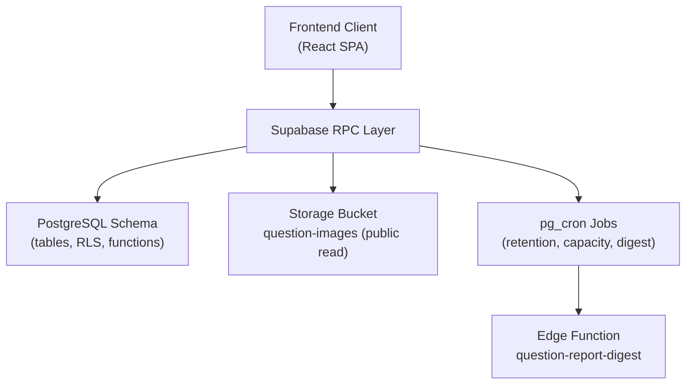
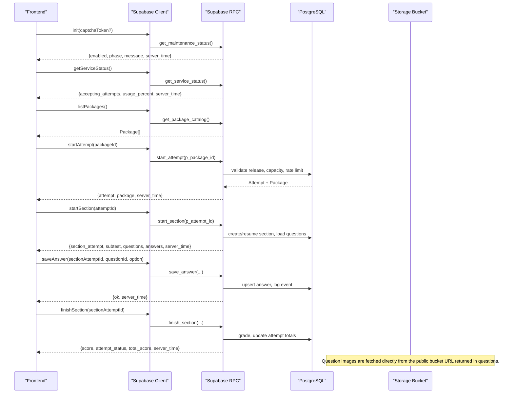
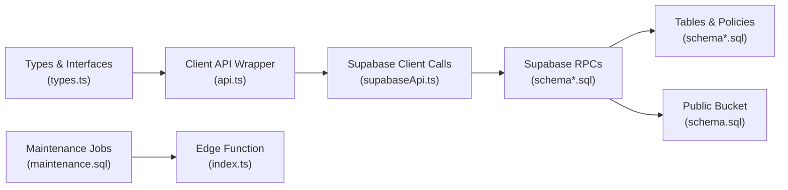

# API Reference

<cite>
**Referenced Files in This Document**
- [schema.sql](file://supabase/schema.sql)
- [schema_v2_reports.sql](file://supabase/schema_v2_reports.sql)
- [schema_v3.sql](file://supabase/schema_v3.sql)
- [schema_v4_maintenance_mode.sql](file://supabase/schema_v4_maintenance_mode.sql)
- [maintenance.sql](file://supabase/maintenance.sql)
- [config.toml](file://supabase/config.toml)
- [index.ts](file://supabase/functions/question-report-digest/index.ts)
- [supabaseApi.ts](file://web/src/lib/supabaseApi.ts)
- [api.ts](file://web/src/lib/api.ts)
- [types.ts](file://web/src/lib/types.ts)
</cite>

## Table of Contents
1. [Introduction](#introduction)
2. [Project Structure](#project-structure)
3. [Core Components](#core-components)
4. [Architecture Overview](#architecture-overview)
5. [Detailed Component Analysis](#detailed-component-analysis)
6. [Dependency Analysis](#dependency-analysis)
7. [Performance Considerations](#performance-considerations)
8. [Troubleshooting Guide](#troubleshooting-guide)
9. [Conclusion](#conclusion)
10. [Appendices](#appendices)

## Introduction
This document is the authoritative API reference for the TBS LPDP Try Out backend. It covers:
- Supabase RPC endpoints used by the client (signatures, parameters, return values, and error codes).
- Authentication model and session requirements.
- Storage access for question images via a public bucket.
- Rate limiting and capacity guards enforced server-side.
- Versioning behavior through immutable package releases and question revisions.
- Practical usage patterns, error handling strategies, and performance tips for clients.

The backend exposes no traditional REST endpoints to end users; all mutations and data retrieval are performed via Supabase RPCs called from the frontend. A single public storage bucket provides read-only access to question images.

## Project Structure
The backend is implemented as SQL functions (RPCs), Row Level Security policies, and scheduled maintenance jobs in Supabase. The frontend calls these RPCs through a typed client layer.

**Diagram sources**
- [schema.sql:16-142](file://supabase/schema.sql#L16-L142)
- [schema.sql:341-692](file://supabase/schema.sql#L341-L692)
- [schema_v3.sql:574-606](file://supabase/schema_v3.sql#L574-L606)
- [schema_v4_maintenance_mode.sql:38-63](file://supabase/schema_v4_maintenance_mode.sql#L38-L63)
- [maintenance.sql:31-51](file://supabase/maintenance.sql#L31-L51)
- [maintenance.sql:87-152](file://supabase/maintenance.sql#L87-L152)
- [index.ts:27-118](file://supabase/functions/question-report-digest/index.ts#L27-L118)

**Section sources**
- [schema.sql:16-142](file://supabase/schema.sql#L16-L142)
- [schema.sql:341-692](file://supabase/schema.sql#L341-L692)
- [schema_v3.sql:574-606](file://supabase/schema_v3.sql#L574-L606)
- [schema_v4_maintenance_mode.sql:38-63](file://supabase/schema_v4_maintenance_mode.sql#L38-L63)
- [maintenance.sql:31-51](file://supabase/maintenance.sql#L31-L51)
- [maintenance.sql:87-152](file://supabase/maintenance.sql#L87-L152)
- [index.ts:27-118](file://supabase/functions/question-report-digest/index.ts#L27-L118)

## Core Components
- Authentication and sessions: Anonymous sign-in with optional human verification token; authenticated role required for most RPCs.
- Package catalog and attempts: Start an attempt, start sections, save answers, toggle doubt, finish sections, retrieve state and review.
- Statistics and versioning: Immutable package releases and question revisions; per-package statistics and histograms.
- Storage: Public-read bucket for question images.
- Maintenance mode: Operator-controlled maintenance window with a public status RPC.
- Scheduled operations: Retention, capacity snapshot, and daily report digest email via an Edge Function.

**Section sources**
- [supabaseApi.ts:45-168](file://web/src/lib/supabaseApi.ts#L45-L168)
- [schema.sql:341-692](file://supabase/schema.sql#L341-L692)
- [schema_v3.sql:574-606](file://supabase/schema_v3.sql#L574-L606)
- [schema_v4_maintenance_mode.sql:38-63](file://supabase/schema_v4_maintenance_mode.sql#L38-L63)
- [maintenance.sql:31-51](file://supabase/maintenance.sql#L31-L51)
- [maintenance.sql:87-152](file://supabase/maintenance.sql#L87-L152)

## Architecture Overview
All user-facing interactions go through Supabase RPCs. The client authenticates (anonymous or with a captcha token), then calls RPCs that enforce ownership via Row Level Security and business rules. Images are served from a public storage bucket. Operational tasks run on schedules and can invoke an Edge Function for email delivery.

**Diagram sources**
- [schema_v4_maintenance_mode.sql:38-63](file://supabase/schema_v4_maintenance_mode.sql#L38-L63)
- [schema.sql:395-415](file://supabase/schema.sql#L395-L415)
- [schema_v3.sql:574-582](file://supabase/schema_v3.sql#L574-L582)
- [schema_v3.sql:709-757](file://supabase/schema_v3.sql#L709-L757)
- [schema_v3.sql:760-800](file://supabase/schema_v3.sql#L760-L800)
- [schema.sql:495-521](file://supabase/schema.sql#L495-L521)
- [schema.sql:551-580](file://supabase/schema.sql#L551-L580)

## Detailed Component Analysis

### Authentication and Session Management
- Anonymous identity per browser is created if needed; a Turnstile token may be required before creating a session in production builds.
- Most RPCs require an authenticated session; some pre-auth probes are allowed for anonymous callers.

Key behaviors:
- Pre-auth probe: get_maintenance_status is callable without authentication.
- Session initialization: ensure a session exists before calling protected RPCs.
- Human verification: when configured, a captcha token must be provided during init.

**Section sources**
- [supabaseApi.ts:45-64](file://web/src/lib/supabaseApi.ts#L45-L64)
- [schema_v4_maintenance_mode.sql:38-63](file://supabase/schema_v4_maintenance_mode.sql#L38-L63)

### Supabase RPCs

#### get_maintenance_status
- Purpose: Public, pre-auth probe to determine whether the site is open, warning, or under maintenance.
- Parameters: None.
- Returns: JSON object with enabled, starts_at, ends_at, message, phase, server_time.
- Notes: Phase is computed server-side based on current time vs schedule.

**Section sources**
- [schema_v4_maintenance_mode.sql:38-63](file://supabase/schema_v4_maintenance_mode.sql#L38-L63)

#### get_service_status
- Purpose: Inform the UI whether new attempts can be accepted and how full the project is.
- Parameters: None.
- Returns: JSON with accepting_attempts (boolean), usage_percent (0–100), measured_at, server_time.
- Notes: Usage is derived from database size and attempt row estimates against configured limits.

**Section sources**
- [schema.sql:395-415](file://supabase/schema.sql#L395-L415)

#### get_package_catalog
- Purpose: List published packages with their current immutable release metadata and statistics.
- Parameters: None.
- Returns: Array of package objects including title, description, difficulty, ai_model, ai_company, ai_model_description, question_version, last_updated_at, completed_attempts_total, statistics_sample_total, mean_score, median_score, coverage timestamps, and subtests.
- Notes: Only published packages with a current release are included.

**Section sources**
- [schema_v3.sql:574-582](file://supabase/schema_v3.sql#L574-L582)

#### get_attempt_summaries
- Purpose: List recent attempts for the authenticated user with summary fields.
- Parameters: None.
- Returns: Array of attempt summaries including id, package_id, package_title, package_version, status, started_at, total_score, finished_sections, total_sections.
- Notes: Limited to the latest 25 attempts.

**Section sources**
- [schema_v3.sql:584-606](file://supabase/schema_v3.sql#L584-L606)

#### start_attempt
- Purpose: Create or resume an active attempt for a published package release.
- Parameters: p_package_id (integer).
- Returns: JSON with attempt, package (current release metadata), server_time.
- Error codes:
  - P0002: Package not found, unpublished, or has no release.
  - P0007: Storage capacity reached (global ceiling).
  - P0005: Too many attempts (per-user hourly budget).
- Notes: Increments attempts_started_total in package_statistics.

**Section sources**
- [schema_v3.sql:709-757](file://supabase/schema_v3.sql#L709-L757)

#### start_section
- Purpose: Start or resume the next unstarted subtest for an attempt; returns questions and existing answers.
- Parameters: p_attempt_id (uuid).
- Returns: Either done:true (all sections finished) or section_attempt, subtest, package, questions[], answers[], server_time.
- Error codes:
  - P0002: Attempt not found.
- Notes: Auto-finishes any active sections past deadline; logs a start event.

**Section sources**
- [schema_v3.sql:760-800](file://supabase/schema_v3.sql#L760-L800)

#### save_answer
- Purpose: Save or update a selected option for a question within an active section.
- Parameters: p_section_attempt_id (uuid), p_question_id (text), p_option (char 'A'-'E' or null).
- Returns: JSON with ok, server_time.
- Error codes:
  - P0002: Question not in this section.
- Notes: Upserts answer and logs a save_answer event (capped per section).

**Section sources**
- [schema.sql:495-521](file://supabase/schema.sql#L495-L521)

#### toggle_doubt
- Purpose: Mark or unmark a question as doubtful within an active section.
- Parameters: p_section_attempt_id (uuid), p_question_id (text), p_doubtful (boolean).
- Returns: JSON with ok, server_time.
- Error codes:
  - P0002: Question not in this section.
- Notes: Logs mark_doubt or unmark_doubt events.

**Section sources**
- [schema.sql:524-549](file://supabase/schema.sql#L524-L549)

#### finish_section
- Purpose: Grade and finalize a section; updates attempt totals when all subtests are complete.
- Parameters: p_section_attempt_id (uuid).
- Returns: JSON with score, attempt_status, total_score, server_time.
- Error codes:
  - P0002: Section attempt not found.
- Notes: Uses immutable question revisions to compute scores.

**Section sources**
- [schema.sql:551-580](file://supabase/schema.sql#L551-L580)

#### get_attempt_state
- Purpose: Retrieve current attempt state and its sections.
- Parameters: p_attempt_id (uuid).
- Returns: JSON with attempt, package, server_time, sections[].
- Error codes:
  - P0002: Attempt not found.

**Section sources**
- [schema.sql:582-607](file://supabase/schema.sql#L582-L607)

#### get_review
- Purpose: Retrieve review data for finished sections, including correct options and explanations, plus the caller’s own report per question.
- Parameters: p_attempt_id (uuid).
- Returns: JSON with attempt, package, sections[].
- Error codes:
  - P0002: Attempt not found.
- Notes: v2 adds my_report per question; v3 uses immutable revisions for grading and reporting.

**Section sources**
- [schema.sql:612-657](file://supabase/schema.sql#L612-L657)
- [schema_v2_reports.sql:207-261](file://supabase/schema_v2_reports.sql#L207-L261)

#### report_question
- Purpose: Submit a report about a question from the review screen. Re-reporting edits the existing report.
- Parameters: p_question_id (text), p_reason (enum), p_comment (text, max 1000), p_attempt_id (uuid, optional).
- Returns: JSON with report object and server_time.
- Error codes:
  - P0006: Invalid reason/comment or missing comment for “other”.
  - P0002: Question not available for reporting (must belong to a finished section of the caller).
  - P0005: Too many reports (rolling-hour budget).
- Notes: Captures selected_option and content_hash; enforces one report per user per revision.

**Section sources**
- [schema_v2_reports.sql:90-176](file://supabase/schema_v2_reports.sql#L90-L176)

#### delete_question_report
- Purpose: Withdraw your own report; idempotent.
- Parameters: p_question_id (text).
- Returns: JSON with deleted (boolean), server_time.

**Section sources**
- [schema_v2_reports.sql:182-200](file://supabase/schema_v2_reports.sql#L182-L200)

### Storage API
- Bucket: question-images.
- Access: Public read for both anonymous and authenticated users.
- Usage: Questions include image_url pointing to files in this bucket. Clients fetch images directly via HTTP using the provided URLs.
- Uploads: Performed by service-role processes (e.g., generator scripts); not exposed to end users.

**Section sources**
- [schema.sql:659-672](file://supabase/schema.sql#L659-L672)

### Real-time Updates and WebSocket Subscriptions
- There are no explicit WebSocket subscriptions defined in the schema or client code.
- Live progress is achieved by polling RPCs such as start_section, get_attempt_state, and get_review, which return server_time to help synchronize clocks.
- Answer events are logged server-side but not pushed to clients via WebSockets.

[No sources needed since this section summarizes observed behavior]

### Rate Limiting and Capacity Guards
- Per-user attempt rate limit: Up to 10 new attempts per hour per user. Exceeding this raises P0005.
- Per-section event log cap: answer_events capped at 500 rows per section to bound storage growth.
- Global storage capacity guard: If db_bytes or attempt_rows exceed configured limits, start_attempt raises P0007.
- Report submission rate limit: Up to 20 reports per user per rolling hour; exceeding this raises P0005.

**Section sources**
- [schema_v3.sql:736-740](file://supabase/schema_v3.sql#L736-L740)
- [schema.sql:246-260](file://supabase/schema.sql#L246-L260)
- [schema.sql:367-372](file://supabase/schema.sql#L367-L372)
- [schema_v2_reports.sql:139-144](file://supabase/schema_v2_reports.sql#L139-L144)

### Versioning Details
- Immutable package releases: Each published package has a versioned release record with content hash and attribution metadata.
- Immutable question revisions: Questions are versioned; answers link to specific revisions for accurate grading.
- Statistics: Per-package aggregates track attempts started/completed, score sums, and sample sizes; histograms enable median computation.

**Section sources**
- [schema_v3.sql:58-166](file://supabase/schema_v3.sql#L58-L166)
- [schema_v3.sql:187-227](file://supabase/schema_v3.sql#L187-L227)
- [schema_v3.sql:539-582](file://supabase/schema_v3.sql#L539-L582)

### Practical Examples

- Start an attempt:
  - Call start_attempt with the package ID. Handle P0002/P0005/P0007 errors. Use the returned package metadata to render the exam flow.
  - Source path: [start_attempt:709-757](file://supabase/schema_v3.sql#L709-L757)

- Start a section:
  - Call start_section with the attempt ID. If done:true, the attempt is complete. Otherwise, use the returned questions and answers to render the section.
  - Source path: [start_section:760-800](file://supabase/schema_v3.sql#L760-L800)

- Save an answer:
  - Call save_answer with sectionAttemptId, questionId, and option (or null to clear). Retry transient failures; do not retry terminal errors like P0002/P0005/P0007.
  - Source path: [save_answer:495-521](file://supabase/schema.sql#L495-L521)

- Finish a section:
  - Call finish_section to grade and finalize. Use the returned score and attempt_status to proceed or show results.
  - Source path: [finish_section:551-580](file://supabase/schema.sql#L551-L580)

- Review:
  - Call get_review to display correct answers and explanations for finished sections, including your own report per question.
  - Source path: [get_review:207-261](file://supabase/schema_v2_reports.sql#L207-L261)

- Report a question:
  - Call report_question from the review screen with reason and optional comment. Re-reporting edits the existing report.
  - Source path: [report_question:90-176](file://supabase/schema_v2_reports.sql#L90-L176)

- Service status:
  - Call get_service_status to decide whether to offer the “Start” button based on accepting_attempts.
  - Source path: [get_service_status:395-415](file://supabase/schema.sql#L395-L415)

- Maintenance status:
  - Call get_maintenance_status early to gate UI behavior (open/warning/maintenance).
  - Source path: [get_maintenance_status:38-63](file://supabase/schema_v4_maintenance_mode.sql#L38-L63)

**Section sources**
- [schema_v3.sql:709-800](file://supabase/schema_v3.sql#L709-L800)
- [schema.sql:395-580](file://supabase/schema.sql#L395-L580)
- [schema_v2_reports.sql:90-200](file://supabase/schema_v2_reports.sql#L90-L200)
- [schema_v4_maintenance_mode.sql:38-63](file://supabase/schema_v4_maintenance_mode.sql#L38-L63)

## Dependency Analysis
The client depends on RPCs rather than direct table access. All writes are mediated by RPCs that enforce RLS and business rules.

**Diagram sources**
- [types.ts:228-256](file://web/src/lib/types.ts#L228-L256)
- [api.ts:77-95](file://web/src/lib/api.ts#L77-L95)
- [supabaseApi.ts:66-168](file://web/src/lib/supabaseApi.ts#L66-L168)
- [schema.sql:341-692](file://supabase/schema.sql#L341-L692)
- [maintenance.sql:87-152](file://supabase/maintenance.sql#L87-L152)
- [index.ts:27-118](file://supabase/functions/question-report-digest/index.ts#L27-L118)

**Section sources**
- [types.ts:228-256](file://web/src/lib/types.ts#L228-L256)
- [api.ts:77-95](file://web/src/lib/api.ts#L77-L95)
- [supabaseApi.ts:66-168](file://web/src/lib/supabaseApi.ts#L66-L168)
- [schema.sql:341-692](file://supabase/schema.sql#L341-L692)
- [maintenance.sql:87-152](file://supabase/maintenance.sql#L87-L152)
- [index.ts:27-118](file://supabase/functions/question-report-digest/index.ts#L27-L118)

## Performance Considerations
- Prefer batching UI actions where possible; each save_answer/toggle_doubt triggers a write and event log entry.
- Use get_attempt_state and get_review to refresh UI state after finishing sections instead of frequent polling.
- Respect server_time returned by RPCs to keep client clocks aligned.
- Avoid redundant calls to listPackages; cache the result until changes are expected.
- For large sections, consider debouncing save_answer calls to reduce write volume.
- Observe usage_percent from get_service_status to inform UX when near capacity.

[No sources needed since this section provides general guidance]

## Troubleshooting Guide
Common error codes and handling strategies:
- P0002: Not found or invalid context (package, attempt, section, question). Validate IDs and ownership; guide users to restart flows if necessary.
- P0003: Section already finished. Do not allow further edits; move to review or next steps.
- P0004: Section deadline passed. Grade immediately and present results.
- P0005: Rate limit exceeded (attempts or reports). Back off and inform users; do not retry aggressively.
- P0006: Bad input (reason/comment validation). Show inline validation messages.
- P0007: Storage capacity reached. Disable new attempts; let existing attempts continue.

Retry strategy:
- Retry transient network errors with exponential backoff.
- Do not retry terminal errors (P0002–P0007).

**Section sources**
- [api.ts:97-122](file://web/src/lib/api.ts#L97-L122)
- [schema.sql:313-337](file://supabase/schema.sql#L313-L337)
- [schema_v2_reports.sql:110-144](file://supabase/schema_v2_reports.sql#L110-L144)

## Conclusion
The TBS LPDP Try Out backend exposes a focused set of RPCs that encapsulate authentication, attempt lifecycle, scoring, versioned content, and operational controls. Clients should rely on these RPCs exclusively, handle the documented error codes, respect rate limits and capacity guards, and use the public storage bucket for images. Maintenance windows and capacity metrics provide safe UX signals, while scheduled jobs maintain data hygiene and operator workflows.

[No sources needed since this section summarizes without analyzing specific files]

## Appendices

### Request/Response Schemas
- See types.ts for TypeScript interfaces that mirror RPC outputs: Package, Subtest, Question, Attempt, SectionAttempt, StartAttemptResult, StartSectionResult, FinishSectionResult, AttemptState, Review, QuestionReport, ServiceStatus, MaintenanceStatus.

**Section sources**
- [types.ts:9-226](file://web/src/lib/types.ts#L9-L226)

### Configuration and Environment
- Supabase project configuration is declared in config.toml; function-level JWT verification settings apply to Edge Functions.

**Section sources**
- [config.toml:1-5](file://supabase/config.toml#L1-L5)

### Scheduled Operations
- Daily retention prunes old attempts and anonymous users.
- Capacity snapshots refresh usage metrics.
- Daily report digest emails are queued and sent via an Edge Function.

**Section sources**
- [maintenance.sql:31-51](file://supabase/maintenance.sql#L31-L51)
- [maintenance.sql:64-73](file://supabase/maintenance.sql#L64-L73)
- [maintenance.sql:87-152](file://supabase/maintenance.sql#L87-L152)
- [index.ts:27-118](file://supabase/functions/question-report-digest/index.ts#L27-L118)