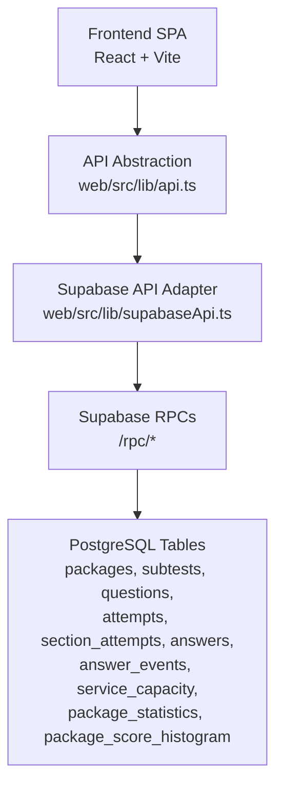
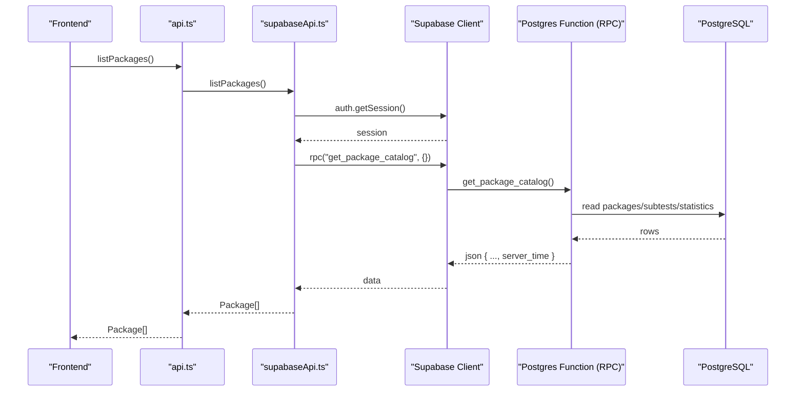
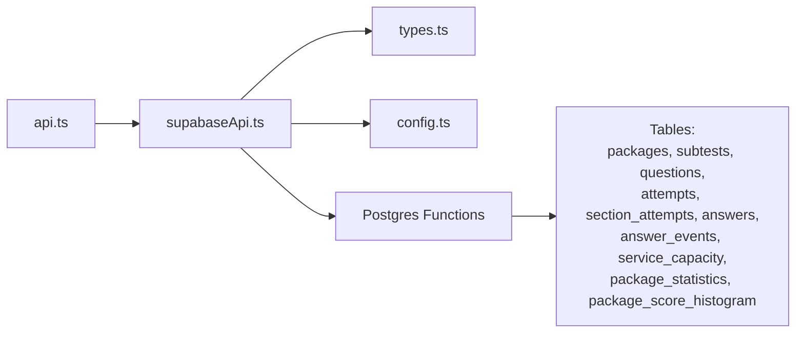
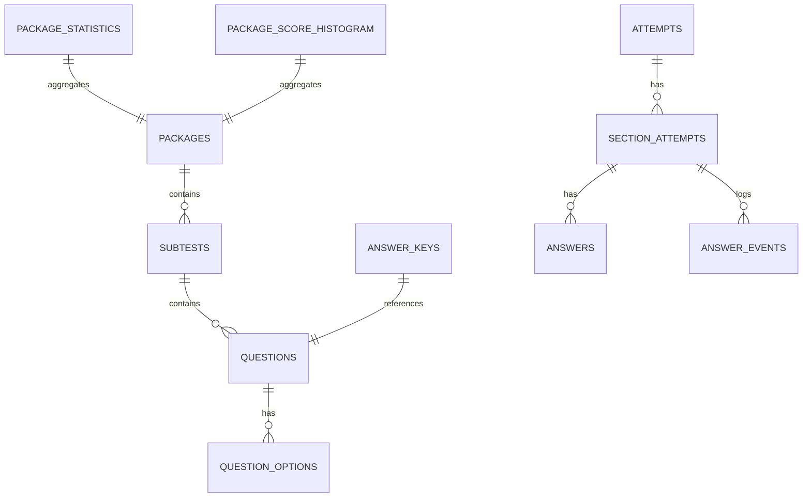

# REST API Endpoints

<cite>
**Referenced Files in This Document**
- [api.ts](file://web/src/lib/api.ts)
- [supabaseApi.ts](file://web/src/lib/supabaseApi.ts)
- [types.ts](file://web/src/lib/types.ts)
- [schema.sql](file://supabase/schema.sql)
- [schema_v3.sql](file://supabase/schema_v3.sql)
- [schema_v4_maintenance_mode.sql](file://supabase/schema_v4_maintenance_mode.sql)
- [config.ts](file://web/src/lib/config.ts)
- [README.md](file://README.md)
</cite>

## Table of Contents
1. [Introduction](#introduction)
2. [Project Structure](#project-structure)
3. [Core Components](#core-components)
4. [Architecture Overview](#architecture-overview)
5. [Detailed Component Analysis](#detailed-component-analysis)
6. [Dependency Analysis](#dependency-analysis)
7. [Performance Considerations](#performance-considerations)
8. [Troubleshooting Guide](#troubleshooting-guide)
9. [Conclusion](#conclusion)
10. [Appendices](#appendices)

## Introduction
This document provides detailed REST API documentation for the TBS LPDP Try Out application endpoints exposed by Supabase RPCs and used by the frontend. It covers HTTP methods, URL patterns, request/response schemas, authentication requirements, query parameters, filtering options, pagination support, response formats, practical examples, error handling strategies, rate limiting, and the relationship between endpoints and underlying database tables. It also explains security policies and data access patterns used by the frontend.

The application is a static SPA hosted on GitHub Pages that communicates directly with Supabase (Postgres + PostgREST). All trusted exam logic runs in Postgres functions (RPCs), and Row Level Security (RLS) enforces user-scoped data access.

**Section sources**
- [README.md:40-63](file://README.md#L40-L63)
- [schema.sql:131-181](file://supabase/schema.sql#L131-L181)

## Project Structure
At a high level:
- The frontend uses a unified API abstraction to call either a local mock or the Supabase backend at runtime.
- The Supabase backend exposes RPCs that encapsulate all business logic, including attempt lifecycle, grading, statistics, and maintenance status.
- Database tables store packages, subtests, questions, attempts, answers, events, capacity, and statistics.

**Diagram sources**
- [api.ts:77-95](file://web/src/lib/api.ts#L77-L95)
- [supabaseApi.ts:32-39](file://web/src/lib/supabaseApi.ts#L32-L39)
- [schema.sql:16-106](file://supabase/schema.sql#L16-L106)
- [schema_v3.sql:187-227](file://supabase/schema_v3.sql#L187-L227)

**Section sources**
- [api.ts:1-128](file://web/src/lib/api.ts#L1-L128)
- [supabaseApi.ts:1-170](file://web/src/lib/supabaseApi.ts#L1-L170)
- [schema.sql:16-106](file://supabase/schema.sql#L16-L106)
- [schema_v3.sql:187-227](file://supabase/schema_v3.sql#L187-L227)

## Core Components
- Authentication: Anonymous sign-in via Supabase Auth; human verification (Turnstile) required before creating an anonymous session in production builds.
- Package listing: Retrieve published packages with metadata and statistics.
- Attempt retrieval: List recent attempts for the current user.
- Statistics access: Aggregate statistics per package (mean/median, histogram).
- User profile operations: Not exposed as a separate profile endpoint; user identity is implicit via anonymous sessions scoped by RLS.

Key implementation points:
- All calls go through `supabase.rpc(...)` which wraps errors into typed `ApiError` objects and syncs server time.
- The frontend abstracts backend selection (mock vs Supabase) and retries transient failures.

**Section sources**
- [supabaseApi.ts:45-64](file://web/src/lib/supabaseApi.ts#L45-L64)
- [supabaseApi.ts:66-169](file://web/src/lib/supabaseApi.ts#L66-L169)
- [api.ts:77-122](file://web/src/lib/api.ts#L77-L122)
- [config.ts:45-60](file://web/src/lib/config.ts#L45-L60)

## Architecture Overview
The frontend calls RPCs over HTTPS using Supabase’s client library. Each RPC performs authorization checks (via `auth.uid()`), enforces RLS, and returns JSON responses that include a `server_time` field for clock synchronization.

**Diagram sources**
- [supabaseApi.ts:90-94](file://web/src/lib/supabaseApi.ts#L90-L94)
- [schema_v3.sql:574-582](file://supabase/schema_v3.sql#L574-L582)

**Section sources**
- [supabaseApi.ts:32-39](file://web/src/lib/supabaseApi.ts#L32-L39)
- [schema_v3.sql:574-582](file://supabase/schema_v3.sql#L574-L582)

## Detailed Component Analysis

### Authentication and Session Management
- Method: POST (via Supabase Auth)
- Endpoint: `/rpc/auth/sign_in_anonymously` (handled internally by Supabase client)
- Request: Optional captcha token when Turnstile is configured
- Response: Session object
- Notes:
  - Production builds require a valid Turnstile token before attempting anonymous sign-in.
  - Subsequent RPC calls use the authenticated session.

Practical example:
- Frontend calls `init(captchaToken?)` which triggers anonymous sign-in if no session exists.

Security:
- Uses Supabase Auth with anonymous users.
- RLS ensures each user can only access their own data.

**Section sources**
- [supabaseApi.ts:45-64](file://web/src/lib/supabaseApi.ts#L45-L64)
- [config.ts:33-43](file://web/src/lib/config.ts#L33-L43)

### Maintenance Status (Public Pre-Auth Probe)
- Method: GET (via Supabase RPC)
- Endpoint: `/rpc/get_maintenance_status`
- Request: None
- Response fields:
  - enabled: boolean
  - starts_at: string | null
  - ends_at: string | null
  - message: string
  - phase: "open" | "warning" | "maintenance"
  - server_time: string
- Notes:
  - Available before authentication.
  - Used to gate UI during scheduled maintenance windows.

Practical example:
- Call `getMaintenanceStatus()` to determine whether to show maintenance banner.

**Section sources**
- [schema_v4_maintenance_mode.sql:38-63](file://supabase/schema_v4_maintenance_mode.sql#L38-L63)
- [supabaseApi.ts:67-81](file://web/src/lib/supabaseApi.ts#L67-L81)

### Service Status (Capacity Gate)
- Method: GET (via Supabase RPC)
- Endpoint: `/rpc/get_service_status`
- Request: None (requires authenticated session)
- Response fields:
  - accepting_attempts: boolean
  - usage_percent: number (0–100)
  - measured_at: string
  - server_time: string
- Notes:
  - Indicates whether new attempts can be created based on storage capacity.
  - Existing attempts remain usable even when full.

Practical example:
- Call `getServiceStatus()` to disable “Start” buttons when not accepting attempts.

**Section sources**
- [schema.sql:395-415](file://supabase/schema.sql#L395-L415)
- [supabaseApi.ts:85-88](file://web/src/lib/supabaseApi.ts#L85-L88)

### Package Listing
- Method: GET (via Supabase RPC)
- Endpoint: `/rpc/get_package_catalog`
- Request: None (requires authenticated session)
- Response: Array of package objects with metadata, statistics, and subtests
- Query parameters: None
- Filtering: Server-side filters to published packages with current releases
- Pagination: None (returns all published packages)

Response schema highlights:
- id, title, description, is_published, created_at
- difficulty, ai_model, ai_company, ai_model_description
- question_version, last_updated_at
- completed_attempts_total, statistics_sample_total
- mean_score, median_score
- statistics_coverage_started_at, score_statistics_coverage_started_at
- subtests: array of subtest definitions

Practical example:
- Call `listPackages()` to render the home page package list.

**Section sources**
- [schema_v3.sql:574-582](file://supabase/schema_v3.sql#L574-L582)
- [supabaseApi.ts:90-94](file://web/src/lib/supabaseApi.ts#L90-L94)
- [types.ts:20-40](file://web/src/lib/types.ts#L20-L40)

### Get Single Package
- Method: GET (via Supabase RPC indirectly)
- Endpoint: Derived from `get_package_catalog`; client finds by id
- Request: None (requires authenticated session)
- Response: Single package object
- Notes: Implemented by fetching catalog and filtering by id.

Practical example:
- Call `getPackage(packageId)` to retrieve details for a specific package.

**Section sources**
- [supabaseApi.ts:96-101](file://web/src/lib/supabaseApi.ts#L96-L101)

### Attempt Retrieval (List Attempts)
- Method: GET (via Supabase RPC)
- Endpoint: `/rpc/get_attempt_summaries`
- Request: None (requires authenticated session)
- Response: Array of attempt summaries
- Query parameters: None
- Filtering: Only current user’s attempts
- Pagination: Limited to most recent 25 attempts

Response schema highlights:
- id, package_id, package_title, package_version
- status, started_at, total_score
- finished_sections, total_sections

Practical example:
- Call `listAttempts()` to display previous attempts and review links.

**Section sources**
- [schema_v3.sql:584-606](file://supabase/schema_v3.sql#L584-L606)
- [supabaseApi.ts:103-106](file://web/src/lib/supabaseApi.ts#L103-L106)
- [types.ts:167-177](file://web/src/lib/types.ts#L167-L177)

### Start Attempt
- Method: POST (via Supabase RPC)
- Endpoint: `/rpc/start_attempt`
- Request body: `{ p_package_id: number }`
- Response:
  - attempt: attempt object
  - package: package release object
  - server_time: string
- Notes:
  - Creates a new attempt or resumes existing active attempt for the same package.
  - Enforces capacity guard and per-user hourly budget.

Practical example:
- Call `startAttempt(packageId)` to begin a try-out.

**Section sources**
- [schema_v3.sql:709-757](file://supabase/schema_v3.sql#L709-L757)
- [supabaseApi.ts:108-111](file://web/src/lib/supabaseApi.ts#L108-L111)
- [types.ts:88-92](file://web/src/lib/types.ts#L88-L92)

### Start Section
- Method: POST (via Supabase RPC)
- Endpoint: `/rpc/start_section`
- Request body: `{ p_attempt_id: string }`
- Response:
  - If done: `{ done: true, server_time }`
  - Else: `{ section_attempt, subtest, package, questions, answers, server_time }`
- Notes:
  - Starts next unstarted section or resumes active one.
  - Returns questions without answer keys.

Practical example:
- Call `startSection(attemptId)` to load the first section or resume.

**Section sources**
- [schema_v3.sql:760-800](file://supabase/schema_v3.sql#L760-L800)
- [supabaseApi.ts:113-116](file://web/src/lib/supabaseApi.ts#L113-L116)
- [types.ts:94-104](file://web/src/lib/types.ts#L94-L104)

### Save Answer
- Method: POST (via Supabase RPC)
- Endpoint: `/rpc/save_answer`
- Request body: `{ p_section_attempt_id: string, p_question_id: string, p_option: "A"|"B"|"C"|"D"|"E"|null }`
- Response: `{ ok: true, server_time }`
- Notes:
  - Validates active section and question membership.
  - Logs event and updates latest answer.

Practical example:
- Call `saveAnswer(sectionAttemptId, questionId, option)` after selecting an option.

**Section sources**
- [schema.sql:495-522](file://supabase/schema.sql#L495-L522)
- [supabaseApi.ts:118-124](file://web/src/lib/supabaseApi.ts#L118-L124)

### Toggle Doubt
- Method: POST (via Supabase RPC)
- Endpoint: `/rpc/toggle_doubt`
- Request body: `{ p_section_attempt_id: string, p_question_id: string, p_doubtful: boolean }`
- Response: `{ ok: true, server_time }`
- Notes:
  - Validates active section and question membership.
  - Logs mark/unmark doubt event.

Practical example:
- Call `toggleDoubt(sectionAttemptId, questionId, doubtful)` to mark/unmark a question.

**Section sources**
- [schema.sql:524-549](file://supabase/schema.sql#L524-L549)
- [supabaseApi.ts:126-132](file://web/src/lib/supabaseApi.ts#L126-L132)

### Finish Section
- Method: POST (via Supabase RPC)
- Endpoint: `/rpc/finish_section`
- Request body: `{ p_section_attempt_id: string }`
- Response:
  - score: number
  - attempt_status: "active" | "finished"
  - total_score: number | null
  - server_time: string
- Notes:
  - Grades section against answer keys.
  - Updates attempt totals and may close the attempt.

Practical example:
- Call `finishSection(sectionAttemptId)` to submit a section.

**Section sources**
- [schema.sql:551-580](file://supabase/schema.sql#L551-L580)
- [supabaseApi.ts:134-137](file://web/src/lib/supabaseApi.ts#L134-L137)
- [types.ts:109-114](file://web/src/lib/types.ts#L109-L114)

### Get Attempt State
- Method: GET (via Supabase RPC)
- Endpoint: `/rpc/get_attempt_state`
- Request body: `{ p_attempt_id: string }`
- Response:
  - attempt: attempt object
  - package: package release object
  - server_time: string
  - sections: array of section_attempt + subtest
- Notes:
  - Used to resume an ongoing attempt.

Practical example:
- Call `getAttemptState(attemptId)` to restore state after refresh.

**Section sources**
- [schema.sql:582-607](file://supabase/schema.sql#L582-L607)
- [supabaseApi.ts:139-142](file://web/src/lib/supabaseApi.ts#L139-L142)
- [types.ts:116-121](file://web/src/lib/types.ts#L116-L121)

### Get Review
- Method: GET (via Supabase RPC)
- Endpoint: `/rpc/get_review`
- Request body: `{ p_attempt_id: string }`
- Response:
  - attempt: attempt object
  - package: package release object
  - sections: array of review sections with questions, selected options, correct options, explanations
- Notes:
  - Only includes finished sections.
  - Includes answer keys and explanations for review.

Practical example:
- Call `getReview(attemptId)` to view results and explanations.

**Section sources**
- [schema.sql:612-657](file://supabase/schema.sql#L612-L657)
- [supabaseApi.ts:144-147](file://web/src/lib/supabaseApi.ts#L144-L147)
- [types.ts:146-165](file://web/src/lib/types.ts#L146-L165)

### Report Question
- Method: POST (via Supabase RPC)
- Endpoint: `/rpc/report_question`
- Request body: `{ p_question_id: string, p_reason: "wrong_key"|"ambiguous"|"bad_explanation"|"typo"|"image_issue"|"other", p_comment: string, p_attempt_id: string }`
- Response: report object
- Notes:
  - Allows users to report issues from the review page.

Practical example:
- Call `reportQuestion(questionId, reason, comment, attemptId)` to submit a report.

**Section sources**
- [supabaseApi.ts:149-163](file://web/src/lib/supabaseApi.ts#L149-L163)
- [types.ts:123-144](file://web/src/lib/types.ts#L123-L144)

### Delete Question Report
- Method: POST (via Supabase RPC)
- Endpoint: `/rpc/delete_question_report`
- Request body: `{ p_question_id: string, p_attempt_id: string }`
- Response: void
- Notes:
  - Withdraw your own report; idempotent.

Practical example:
- Call `deleteQuestionReport(questionId, attemptId)` to remove a report.

**Section sources**
- [supabaseApi.ts:165-168](file://web/src/lib/supabaseApi.ts#L165-L168)

## Dependency Analysis
The frontend depends on:
- Supabase client for RPC calls and authentication.
- Types defined in `types.ts` to validate responses.
- Configuration for environment-specific behavior (offline mode, Turnstile).

Backend dependencies:
- PostgreSQL functions implement business logic.
- RLS policies enforce data isolation.
- Capacity and statistics tables provide operational metrics.

**Diagram sources**
- [api.ts:77-95](file://web/src/lib/api.ts#L77-L95)
- [supabaseApi.ts:1-24](file://web/src/lib/supabaseApi.ts#L1-L24)
- [schema.sql:16-106](file://supabase/schema.sql#L16-L106)
- [schema_v3.sql:187-227](file://supabase/schema_v3.sql#L187-L227)

**Section sources**
- [api.ts:77-95](file://web/src/lib/api.ts#L77-L95)
- [supabaseApi.ts:1-24](file://web/src/lib/supabaseApi.ts#L1-L24)
- [schema.sql:16-106](file://supabase/schema.sql#L16-L106)
- [schema_v3.sql:187-227](file://supabase/schema_v3.sql#L187-L227)

## Performance Considerations
- RPCs return compact JSON payloads tailored to frontend needs.
- Statistics are precomputed and stored in dedicated tables to avoid expensive queries.
- Capacity measurement uses O(1) database functions and caches results for 5 minutes.
- Event logging is capped per section to prevent unbounded growth.

[No sources needed since this section provides general guidance]

## Troubleshooting Guide
Common errors and handling:
- Human verification required: When Turnstile is configured but no token is provided.
- Rate limits: Per-user hourly attempt limit enforced by RPCs.
- Storage capacity reached: New attempts blocked when project exceeds configured ceiling.
- Invalid input: Rejected by RPC validation (e.g., invalid option).
- Transient network errors: Retried with exponential backoff; terminal codes are not retried.

Error codes:
- P0002: Resource not found or invalid context
- P0003: Section already finished
- P0004: Deadline passed
- P0005: Too many attempts (rate limit)
- P0006: Bad input
- P0007: Storage capacity reached

Retry strategy:
- Background writes retry up to 3 times with exponential backoff for non-terminal errors.

**Section sources**
- [config.ts:45-60](file://web/src/lib/config.ts#L45-L60)
- [api.ts:97-122](file://web/src/lib/api.ts#L97-L122)
- [schema.sql:341-389](file://supabase/schema.sql#L341-L389)
- [schema_v3.sql:709-757](file://supabase/schema_v3.sql#L709-L757)

## Conclusion
The TBS LPDP Try Out API is implemented as a set of secure, server-side RPCs that encapsulate all exam logic, protect answer keys, and enforce strict data access policies. The frontend interacts with these endpoints through a unified abstraction that supports both online and offline modes. Authentication is anonymous with optional human verification, and all user data is isolated via RLS. Statistics and capacity controls ensure scalability and reliability under free-tier constraints.

[No sources needed since this section summarizes without analyzing specific files]

## Appendices

### Data Model Relationships

**Diagram sources**
- [schema.sql:16-106](file://supabase/schema.sql#L16-L106)
- [schema_v3.sql:187-227](file://supabase/schema_v3.sql#L187-L227)

### Security Policies Summary
- Content tables (packages, subtests, questions, question_options) are readable only for published content.
- Answer keys are never directly readable by clients.
- User data (attempts, section_attempts, answers, answer_events) is scoped to the current user via RLS.
- Maintenance status is publicly readable before authentication.

**Section sources**
- [schema.sql:131-181](file://supabase/schema.sql#L131-L181)
- [schema_v4_maintenance_mode.sql:32-63](file://supabase/schema_v4_maintenance_mode.sql#L32-L63)