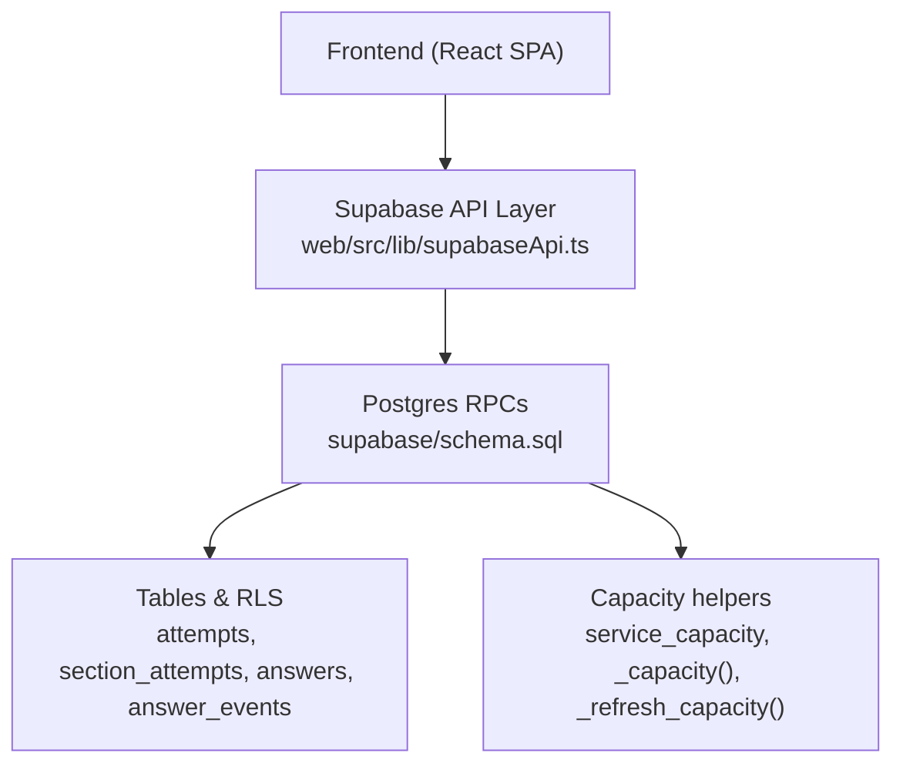
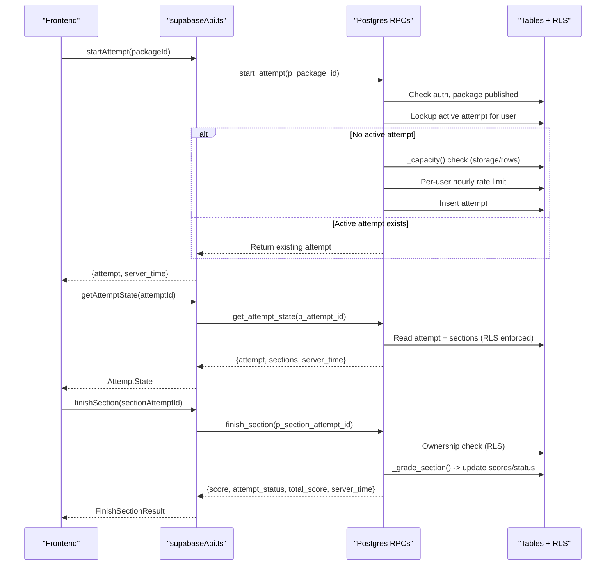
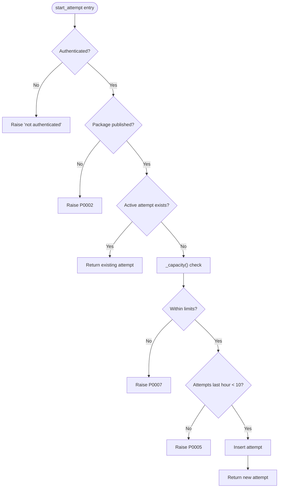
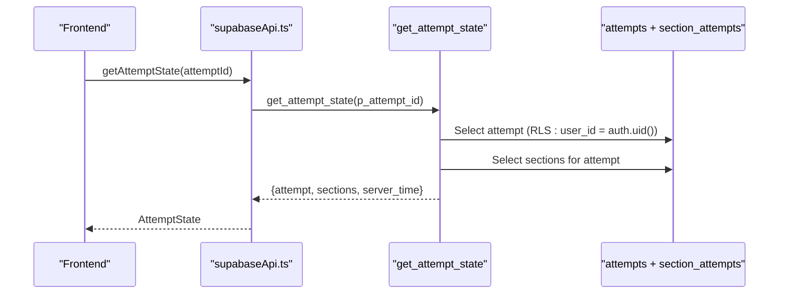
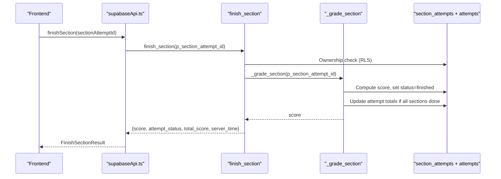
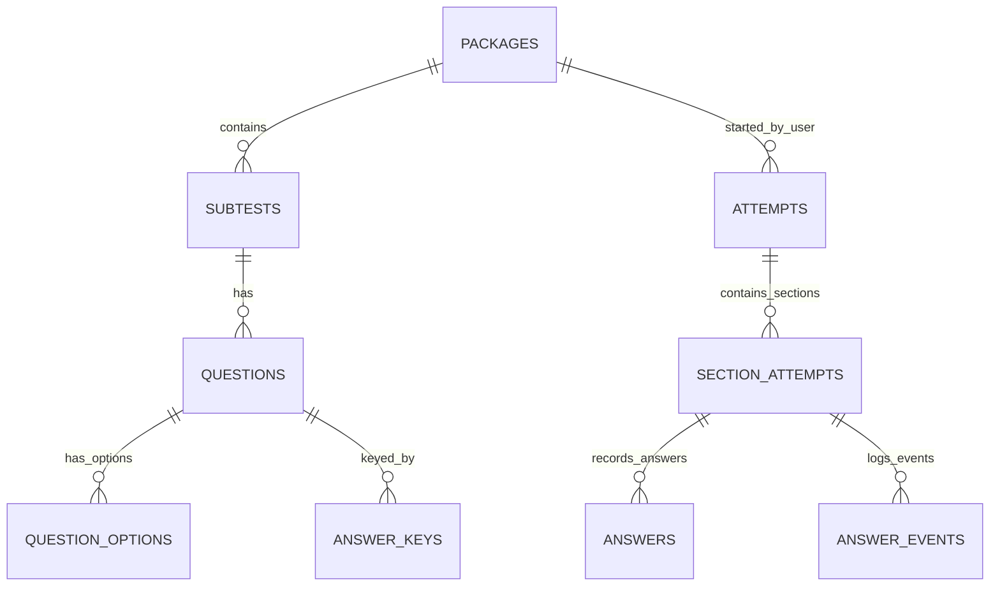
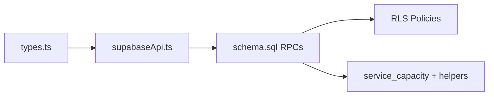

# Attempt Management Functions

<cite>
**Referenced Files in This Document**
- [schema.sql](file://supabase/schema.sql)
- [TECHNICAL_REQUIREMENTS.md](file://docs/TECHNICAL_REQUIREMENTS.md)
- [CAPACITY_GUARD.md](file://docs/CAPACITY_GUARD.md)
- [types.ts](file://web/src/lib/types.ts)
- [api.ts](file://web/src/lib/api.ts)
- [supabaseApi.ts](file://web/src/lib/supabaseApi.ts)
</cite>

## Table of Contents
1. [Introduction](#introduction)
2. [Project Structure](#project-structure)
3. [Core Components](#core-components)
4. [Architecture Overview](#architecture-overview)
5. [Detailed Component Analysis](#detailed-component-analysis)
6. [Dependency Analysis](#dependency-analysis)
7. [Performance Considerations](#performance-considerations)
8. [Troubleshooting Guide](#troubleshooting-guide)
9. [Conclusion](#conclusion)

## Introduction
This document explains the attempt management RPC functions that power the exam lifecycle: start_attempt, get_attempt_state, and finish_section. It covers function signatures, parameter types, return values, error handling, authentication and Row Level Security (RLS), capacity checks, rate limiting, storage guards, transaction boundaries, concurrency behavior, and how attempts relate to packages and sections. It also provides client-side usage patterns and strategies for handling errors and retries.

## Project Structure
The attempt management logic is implemented as Postgres functions (RPCs) with RLS policies protecting user data. The frontend calls these RPCs through a typed API layer.

**Diagram sources**
- [supabaseApi.ts:108-142](file://web/src/lib/supabaseApi.ts#L108-L142)
- [schema.sql:341-390](file://supabase/schema.sql#L341-L390)
- [schema.sql:551-580](file://supabase/schema.sql#L551-L580)
- [schema.sql:582-607](file://supabase/schema.sql#L582-L607)
- [schema.sql:119-129](file://supabase/schema.sql#L119-L129)
- [schema.sql:266-309](file://supabase/schema.sql#L266-L309)

**Section sources**
- [schema.sql:16-142](file://supabase/schema.sql#L16-L142)
- [supabaseApi.ts:108-142](file://web/src/lib/supabaseApi.ts#L108-L142)

## Core Components
- start_attempt(package_id): Creates an attempt or returns an existing active one for the authenticated user. Enforces capacity guard and per-user hourly rate limit before creating new attempts.
- get_attempt_state(attempt_id): Returns the full state for resuming an attempt, including current sections and deadlines.
- finish_section(section_attempt_id): Grades the section, updates status to finished, and closes the attempt when all sections are done.

Key supporting elements:
- Authentication: All RPCs require an authenticated session via Supabase anonymous sign-in.
- RLS: Policies ensure users can only access their own attempts, sections, answers, and events.
- Capacity guard: New attempts are blocked once storage or row-count thresholds are reached; existing work continues uninterrupted.
- Rate limiting: Up to 10 new attempts per hour per user.
- Event logging: Answer interactions are logged with caps to bound storage growth.

**Section sources**
- [schema.sql:341-390](file://supabase/schema.sql#L341-L390)
- [schema.sql:551-580](file://supabase/schema.sql#L551-L580)
- [schema.sql:582-607](file://supabase/schema.sql#L582-L607)
- [schema.sql:133-181](file://supabase/schema.sql#L133-L181)
- [schema.sql:241-260](file://supabase/schema.sql#L241-L260)
- [schema.sql:266-309](file://supabase/schema.sql#L266-L309)
- [TECHNICAL_REQUIREMENTS.md:115-123](file://docs/TECHNICAL_REQUIREMENTS.md#L115-L123)
- [CAPACITY_GUARD.md:17-27](file://docs/CAPACITY_GUARD.md#L17-L27)

## Architecture Overview
The attempt lifecycle flows through RPCs that enforce business rules server-side. The frontend uses typed wrappers to call RPCs and handle errors consistently.

**Diagram sources**
- [supabaseApi.ts:108-142](file://web/src/lib/supabaseApi.ts#L108-L142)
- [schema.sql:341-390](file://supabase/schema.sql#L341-L390)
- [schema.sql:551-580](file://supabase/schema.sql#L551-L580)
- [schema.sql:582-607](file://supabase/schema.sql#L582-L607)
- [schema.sql:185-239](file://supabase/schema.sql#L185-L239)

## Detailed Component Analysis

### start_attempt
- Purpose: Create a new attempt or resume an existing active one for the authenticated user.
- Parameters:
  - p_package_id: integer (package identifier)
- Returns: JSON containing attempt object and server_time.
- Behavior:
  - Requires authentication; raises if not authenticated.
  - Validates package existence and published status.
  - If no active attempt exists:
    - Checks capacity guard (db_bytes vs limit_bytes and attempt_rows vs limit_attempt_rows).
    - Enforces per-user rate limit: max 10 new attempts per rolling hour.
    - Inserts a new attempt row.
  - If an active attempt exists, returns it without gating by capacity/rate limits.
- Errors:
  - Not authenticated: generic exception.
  - Package not found or unpublished: P0002.
  - Storage capacity reached: P0007.
  - Too many attempts: P0005.
- Transaction boundary: Single function execution; inserts and reads occur within one transactional context.
- Concurrency: Safe against duplicate active attempts due to lookup order and insertion; capacity and rate checks apply only on creation.

**Diagram sources**
- [schema.sql:341-390](file://supabase/schema.sql#L341-L390)
- [schema.sql:266-309](file://supabase/schema.sql#L266-L309)

**Section sources**
- [schema.sql:341-390](file://supabase/schema.sql#L341-L390)
- [CAPACITY_GUARD.md:81-96](file://docs/CAPACITY_GUARD.md#L81-L96)
- [TECHNICAL_REQUIREMENTS.md:115-123](file://docs/TECHNICAL_REQUIREMENTS.md#L115-L123)

### get_attempt_state
- Purpose: Retrieve full state for resuming an attempt, including current sections and deadlines.
- Parameters:
  - p_attempt_id: uuid (attempt identifier)
- Returns: JSON containing attempt, sections array, and server_time.
- Behavior:
  - Requires authentication and ownership via RLS.
  - Reads attempt and associated section_attempts for the given attempt_id.
  - Includes subtest metadata for each section.
- Errors:
  - Attempt not found: P0002.
- Transaction boundary: Single read operation within one transactional context.
- Concurrency: Read-only; safe under concurrent access.

**Diagram sources**
- [supabaseApi.ts:139-142](file://web/src/lib/supabaseApi.ts#L139-L142)
- [schema.sql:582-607](file://supabase/schema.sql#L582-L607)
- [schema.sql:158-181](file://supabase/schema.sql#L158-L181)

**Section sources**
- [schema.sql:582-607](file://supabase/schema.sql#L582-L607)
- [schema.sql:158-181](file://supabase/schema.sql#L158-L181)

### finish_section
- Purpose: Grade and finalize a section, updating scores and potentially closing the attempt.
- Parameters:
  - p_section_attempt_id: uuid (section attempt identifier)
- Returns: JSON containing score, attempt_status, total_score, and server_time.
- Behavior:
  - Verifies ownership via join between section_attempts and attempts using RLS.
  - Calls _grade_section to compute score, mark section finished, and close attempt if all sections are done.
  - Idempotent: finishing an already-finished section returns stored score without side effects.
- Errors:
  - Section attempt not found: P0002.
- Transaction boundary: Single function execution; grading and updates occur atomically.
- Concurrency: Safe; idempotent updates prevent double-grading.

**Diagram sources**
- [supabaseApi.ts:134-137](file://web/src/lib/supabaseApi.ts#L134-L137)
- [schema.sql:551-580](file://supabase/schema.sql#L551-L580)
- [schema.sql:185-239](file://supabase/schema.sql#L185-L239)

**Section sources**
- [schema.sql:551-580](file://supabase/schema.sql#L551-L580)
- [schema.sql:185-239](file://supabase/schema.sql#L185-L239)

### Data Model Relationships
Attempts belong to packages and contain multiple section_attempts, each tied to a subtest. Answers and events are scoped to section_attempts.

**Diagram sources**
- [schema.sql:16-106](file://supabase/schema.sql#L16-L106)

**Section sources**
- [schema.sql:16-106](file://supabase/schema.sql#L16-L106)

## Dependency Analysis
- Frontend API layer depends on Supabase RPCs defined in schema.sql.
- Types define contract shapes for RPC inputs/outputs used across the UI.
- Capacity guard relies on service_capacity table and helper functions.
- RLS policies enforce user isolation for attempts, sections, answers, and events.

**Diagram sources**
- [types.ts:88-121](file://web/src/lib/types.ts#L88-L121)
- [supabaseApi.ts:108-142](file://web/src/lib/supabaseApi.ts#L108-L142)
- [schema.sql:133-181](file://supabase/schema.sql#L133-L181)
- [schema.sql:119-129](file://supabase/schema.sql#L119-L129)
- [schema.sql:266-309](file://supabase/schema.sql#L266-L309)

**Section sources**
- [types.ts:88-121](file://web/src/lib/types.ts#L88-L121)
- [supabaseApi.ts:108-142](file://web/src/lib/supabaseApi.ts#L108-L142)
- [schema.sql:133-181](file://supabase/schema.sql#L133-L181)
- [schema.sql:119-129](file://supabase/schema.sql#L119-L129)
- [schema.sql:266-309](file://supabase/schema.sql#L266-L309)

## Performance Considerations
- Capacity measurement uses pg_database_size and planner estimates (reltuples) for O(1) cost even as tables grow.
- Event log cap prevents unbounded growth per section (500 rows max).
- Retention policies (maintenance) clean up old attempts and events to manage long-term storage.
- Retry strategy avoids retrying terminal errors (rate limit, capacity, invalid input).

[No sources needed since this section provides general guidance]

## Troubleshooting Guide
Common errors and handling strategies:
- P0002 (Not found): Indicates missing attempt/package/section; verify IDs and ownership.
- P0003 (Section already finished): Do not re-enter or re-save; proceed to next section or review.
- P0004 (Deadline passed): Section auto-graded; cannot save further answers; finish or move on.
- P0005 (Too many attempts): Wait until the rolling hour window allows more attempts.
- P0006 (Bad input): Validate option keys and question membership before calling.
- P0007 (Storage capacity reached): New attempts blocked; existing work unaffected; inform users.

Client-side retry behavior:
- Non-terminal errors are retried with exponential backoff.
- Terminal errors (P0002–P0007) are surfaced immediately without retry.

**Section sources**
- [api.ts:97-122](file://web/src/lib/api.ts#L97-L122)
- [schema.sql:313-337](file://supabase/schema.sql#L313-L337)
- [schema.sql:341-390](file://supabase/schema.sql#L341-L390)
- [schema.sql:551-580](file://supabase/schema.sql#L551-L580)

## Conclusion
The attempt management RPCs provide a secure, efficient, and resilient exam lifecycle. They enforce authentication, RLS, capacity guards, and rate limits while ensuring data consistency and concurrency safety. Clients interact through a typed API layer with robust error handling and retry strategies. Attempts relate to packages and sections, with clear transitions from active to finished states, and comprehensive support for resuming and reviewing progress.