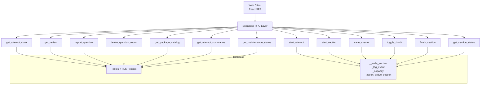
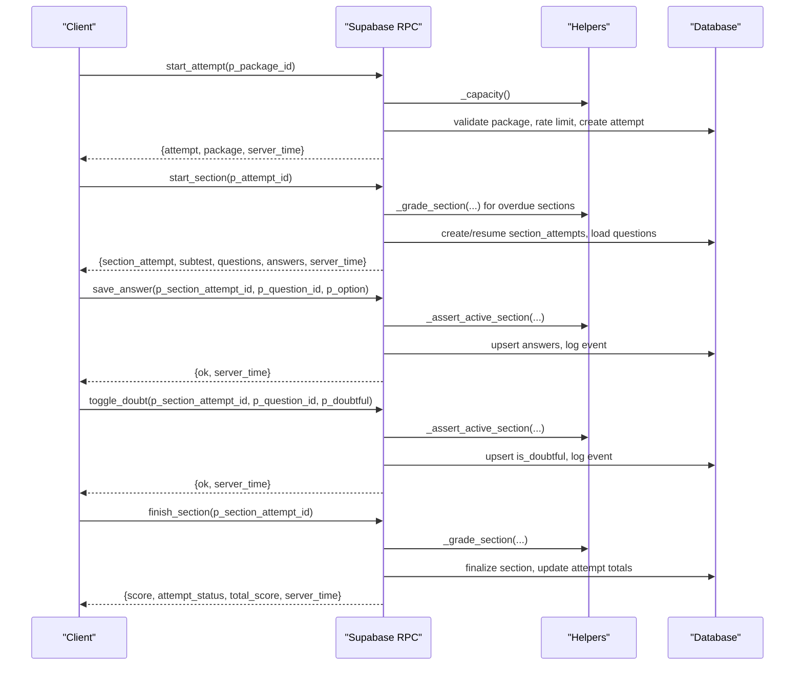
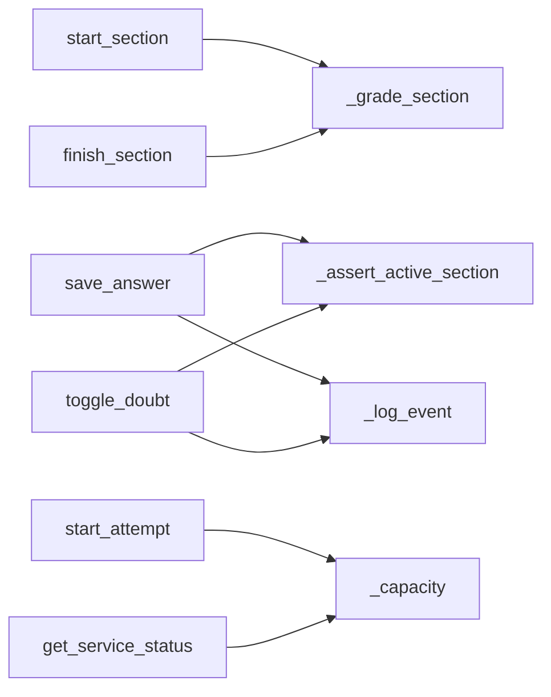

# RPC Functions

<cite>
**Referenced Files in This Document**
- [schema.sql](file://supabase/schema.sql)
- [schema_v2_reports.sql](file://supabase/schema_v2_reports.sql)
- [schema_v3.sql](file://supabase/schema_v3.sql)
- [schema_v4_maintenance_mode.sql](file://supabase/schema_v4_maintenance_mode.sql)
- [maintenance.sql](file://supabase/maintenance.sql)
- [supabaseApi.ts](file://web/src/lib/supabaseApi.ts)
</cite>

## Table of Contents
1. [Introduction](#introduction)
2. [Project Structure](#project-structure)
3. [Core Components](#core-components)
4. [Architecture Overview](#architecture-overview)
5. [Detailed Component Analysis](#detailed-component-analysis)
6. [Dependency Analysis](#dependency-analysis)
7. [Performance Considerations](#performance-considerations)
8. [Troubleshooting Guide](#troubleshooting-guide)
9. [Conclusion](#conclusion)

## Introduction
This document provides comprehensive RPC function documentation for the TBS LPDP Try Out backend. It covers all server-side Supabase functions that manage attempts, sections, answers, doubt marks, grading, review, reporting, and service status. For each RPC, it details parameters, return values, error codes, authentication and Row Level Security (RLS) implications, transaction boundaries, business logic, and practical client usage patterns. It also explains the grading algorithm, attempt lifecycle management, and data validation rules enforced by the database layer.

## Project Structure
The RPC surface is implemented as PostgreSQL functions in the public schema and exposed via Supabase RPCs. The core definitions live in:
- Base schema with RLS, helper functions, and primary RPCs
- v2 reports schema adding question feedback RPCs and a revised get_review
- v3 immutable releases, statistics, and updated grading/attempts/section flows
- v4 maintenance mode exposing a public maintenance status RPC
- Maintenance jobs that schedule retention, capacity refresh, and report digest operations

**Diagram sources**
- [schema.sql:341-657](file://supabase/schema.sql#L341-L657)
- [schema_v2_reports.sql:90-277](file://supabase/schema_v2_reports.sql#L90-L277)
- [schema_v3.sql:574-800](file://supabase/schema_v3.sql#L574-L800)
- [schema_v4_maintenance_mode.sql:38-63](file://supabase/schema_v4_maintenance_mode.sql#L38-L63)

**Section sources**
- [schema.sql:1-692](file://supabase/schema.sql#L1-L692)
- [schema_v2_reports.sql:1-292](file://supabase/schema_v2_reports.sql#L1-L292)
- [schema_v3.sql:1-800](file://supabase/schema_v3.sql#L1-L800)
- [schema_v4_maintenance_mode.sql:1-82](file://supabase/schema_v4_maintenance_mode.sql#L1-L82)
- [maintenance.sql:1-167](file://supabase/maintenance.sql#L1-L167)
- [supabaseApi.ts:1-170](file://web/src/lib/supabaseApi.ts#L1-L170)

## Core Components
- Authentication: All mutating RPCs require an authenticated user (anonymous or persistent per browser). Unauthenticated calls raise “not authenticated”.
- RLS: Direct table writes from clients are denied; all mutations go through RPCs. Read policies restrict access to the current user’s attempts and related data.
- Transaction boundaries: Each RPC executes within a single transaction unless otherwise noted. Grading and completion updates are atomic per section/attempt.
- Validation: Input validation occurs in RPCs and via constraints/enums on tables. Errors use custom errcodes where possible to aid client handling.

Key helpers used across RPCs:
- _grade_section: Computes score, finalizes section, logs finish event, and closes attempt when all subtests finished. In v3, also updates package statistics and histogram.
- _log_event: Appends answer events with a per-section cap to prevent unbounded growth.
- _capacity/_refresh_capacity: Measures DB size and attempt row counts to enforce storage capacity limits.
- _assert_active_section: Validates ownership, active state, and deadline for section-scoped writes.

**Section sources**
- [schema.sql:185-337](file://supabase/schema.sql#L185-L337)
- [schema_v3.sql:610-705](file://supabase/schema_v3.sql#L610-L705)

## Architecture Overview
The system enforces trusted exam logic in the database. Clients never grade or read answer keys directly. The flow typically involves:
- Start an attempt for a published package
- Start a section (auto-create next subtest if none active)
- Save answers and toggle doubt marks during the active section
- Finish a section to compute score and possibly close the attempt
- Review results and report questions post-completion

**Diagram sources**
- [schema.sql:341-580](file://supabase/schema.sql#L341-L580)
- [schema_v3.sql:709-800](file://supabase/schema_v3.sql#L709-L800)

## Detailed Component Analysis

### start_attempt(p_package_id integer)
- Purpose: Create or resume an attempt for a published package. Returns the attempt and package release info.
- Parameters:
  - p_package_id: integer
- Returns: JSON object containing attempt, package (release metadata), and server_time.
- Authentication: Requires authenticated user.
- RLS: Reads packages/subtests via internal queries; does not expose raw tables to client.
- Business Logic:
  - Validates package exists and is published (or has a current release in v3).
  - Enforces global storage capacity limits before creating new attempts.
  - Enforces per-user hourly attempt budget (rate limiting).
  - Creates attempt and increments package statistics counters.
  - Returns associated package release metadata in v3.
- Error Codes:
  - P0002: Package not found/unpublished/no release
  - P0005: Too many attempts in last hour
  - P0007: Storage capacity reached
- Transaction Boundary: Single transaction; attempt creation and stats increment are atomic.
- Client Usage Example:
  - See [supabaseApi.ts:108-111](file://web/src/lib/supabaseApi.ts#L108-L111)

**Section sources**
- [schema.sql:341-390](file://supabase/schema.sql#L341-L390)
- [schema_v3.sql:709-758](file://supabase/schema_v3.sql#L709-L758)
- [supabaseApi.ts:108-111](file://web/src/lib/supabaseApi.ts#L108-L111)

### start_section(p_attempt_id uuid)
- Purpose: Start or resume a section for an attempt. Loads questions and existing answers for the active section.
- Parameters:
  - p_attempt_id: uuid
- Returns: JSON with section_attempt, subtest, questions, answers, and server_time; or done flag if no more sections.
- Authentication: Requires authenticated user.
- RLS: Ensures attempt belongs to caller; only returns data scoped to the attempt.
- Business Logic:
  - Sweeps and auto-finishes any overdue active sections for this attempt.
  - Resumes an existing active section if present.
  - Otherwise creates a new section for the next subtest by position.
  - Logs a “start” event with subtest key.
  - Returns full question set and saved answers for the section.
- Error Codes:
  - P0002: Attempt not found
- Transaction Boundary: Single transaction; includes potential auto-grade of overdue sections.
- Client Usage Example:
  - See [supabaseApi.ts:113-116](file://web/src/lib/supabaseApi.ts#L113-L116)

**Section sources**
- [schema.sql:417-493](file://supabase/schema.sql#L417-L493)
- [schema_v3.sql:760-800](file://supabase/schema_v3.sql#L760-L800)
- [supabaseApi.ts:113-116](file://web/src/lib/supabaseApi.ts#L113-L116)

### save_answer(p_section_attempt_id uuid, p_question_id text, p_option char(1))
- Purpose: Persist a selected option for a question within an active section.
- Parameters:
  - p_section_attempt_id: uuid
  - p_question_id: text
  - p_option: char(1) or null
- Returns: JSON with ok=true and server_time.
- Authentication: Requires authenticated user.
- RLS: Validates ownership and active state via helper; ensures question belongs to the section’s subtest.
- Business Logic:
  - Asserts active section ownership and validity.
  - Validates option value against allowed set.
  - Upserts answer record with selected_option and updated_at.
  - Logs a “save_answer” event.
- Error Codes:
  - P0002: Question not in this section
  - Generic invalid option error if option not in allowed set
- Transaction Boundary: Single transaction; upsert and event logging are atomic.
- Client Usage Example:
  - See [supabaseApi.ts:118-124](file://web/src/lib/supabaseApi.ts#L118-L124)

**Section sources**
- [schema.sql:495-522](file://supabase/schema.sql#L495-L522)
- [schema.sql:311-337](file://supabase/schema.sql#L311-L337)
- [supabaseApi.ts:118-124](file://web/src/lib/supabaseApi.ts#L118-L124)

### toggle_doubt(p_section_attempt_id uuid, p_question_id text, p_doubtful boolean)
- Purpose: Mark or unmark a question as doubtful within an active section.
- Parameters:
  - p_section_attempt_id: uuid
  - p_question_id: text
  - p_doubtful: boolean
- Returns: JSON with ok=true and server_time.
- Authentication: Requires authenticated user.
- RLS: Validates ownership and active state; ensures question belongs to the section’s subtest.
- Business Logic:
  - Asserts active section ownership and validity.
  - Upserts is_doubtful flag and updated_at.
  - Logs “mark_doubt” or “unmark_doubt” event accordingly.
- Error Codes:
  - P0002: Question not in this section
- Transaction Boundary: Single transaction; upsert and event logging are atomic.
- Client Usage Example:
  - See [supabaseApi.ts:126-132](file://web/src/lib/supabaseApi.ts#L126-L132)

**Section sources**
- [schema.sql:524-549](file://supabase/schema.sql#L524-L549)
- [schema.sql:311-337](file://supabase/schema.sql#L311-L337)
- [supabaseApi.ts:126-132](file://web/src/lib/supabaseApi.ts#L126-L132)

### finish_section(p_section_attempt_id uuid)
- Purpose: Finalize a section, compute score, and potentially close the entire attempt.
- Parameters:
  - p_section_attempt_id: uuid
- Returns: JSON with score, attempt_status, total_score, and server_time.
- Authentication: Requires authenticated user.
- RLS: Validates ownership of the section attempt.
- Business Logic:
  - Verifies ownership of the section attempt.
  - Calls grading helper to compute score, mark section finished, log finish event, and close attempt if all subtests finished.
  - Returns final scores and attempt status.
- Error Codes:
  - P0002: Section attempt not found
- Transaction Boundary: Single transaction; grading and attempt closure are atomic.
- Client Usage Example:
  - See [supabaseApi.ts:134-137](file://web/src/lib/supabaseApi.ts#L134-L137)

**Section sources**
- [schema.sql:551-580](file://supabase/schema.sql#L551-L580)
- [schema.sql:185-239](file://supabase/schema.sql#L185-L239)
- [schema_v3.sql:610-705](file://supabase/schema_v3.sql#L610-L705)
- [supabaseApi.ts:134-137](file://web/src/lib/supabaseApi.ts#L134-L137)

### get_attempt_state(p_attempt_id uuid)
- Purpose: Retrieve attempt and its sections’ states for the authenticated user.
- Parameters:
  - p_attempt_id: uuid
- Returns: JSON with attempt and sections (each including section_attempt and subtest), plus server_time.
- Authentication: Requires authenticated user.
- RLS: Ensures attempt belongs to caller.
- Business Logic:
  - Validates attempt ownership.
  - Aggregates sections for the attempt.
- Error Codes:
  - P0002: Attempt not found
- Transaction Boundary: Single read transaction.
- Client Usage Example:
  - See [supabaseApi.ts:139-142](file://web/src/lib/supabaseApi.ts#L139-L142)

**Section sources**
- [schema.sql:582-607](file://supabase/schema.sql#L582-L607)
- [supabaseApi.ts:139-142](file://web/src/lib/supabaseApi.ts#L139-L142)

### get_review(p_attempt_id uuid)
- Purpose: Retrieve detailed review for a finished attempt, including correct options and explanations.
- Parameters:
  - p_attempt_id: uuid
- Returns: JSON with attempt, sections (subtest, score, questions with options, selected_option, is_doubtful, correct_option, explanations), and server_time. In v2+, includes my_report per question.
- Authentication: Requires authenticated user.
- RLS: Ensures attempt belongs to caller; exposes answer_keys only for finished sections of the caller’s own attempt.
- Business Logic:
  - Validates attempt ownership.
  - Aggregates questions and answers for finished sections.
  - Joins answer_keys to provide correct_option and explanations.
  - v2+: Adds my_report field showing the user’s own report per question.
- Error Codes:
  - P0002: Attempt not found
- Transaction Boundary: Single read transaction.
- Client Usage Example:
  - See [supabaseApi.ts:144-147](file://web/src/lib/supabaseApi.ts#L144-L147)

**Section sources**
- [schema.sql:612-657](file://supabase/schema.sql#L612-L657)
- [schema_v2_reports.sql:207-261](file://supabase/schema_v2_reports.sql#L207-L261)
- [supabaseApi.ts:144-147](file://web/src/lib/supabaseApi.ts#L144-L147)

### report_question(p_question_id text, p_reason text, p_comment text default '', p_attempt_id uuid default null)
- Purpose: Submit a question report from the review screen for a finished section.
- Parameters:
  - p_question_id: text
  - p_reason: one of predefined reasons
  - p_comment: optional text (required when reason is “other”)
  - p_attempt_id: optional uuid to narrow scope
- Returns: JSON with report details and server_time.
- Authentication: Requires authenticated user.
- RLS: No direct table write policy; writes go through RPC. Reports are readable only by their author.
- Business Logic:
  - Validates input shape and comment length.
  - Gate: Only allow reporting for questions belonging to a finished section of the caller’s attempt(s).
  - Enforces rolling-hour write budget for reports.
  - Captures selected_option from the relevant section attempt.
  - Inserts or updates report (idempotent per user+question revision in v3).
- Error Codes:
  - P0002: Question not available for reporting
  - P0005: Too many reports in last hour
  - P0006: Invalid input (reason/comment)
- Transaction Boundary: Single transaction; insert/update is atomic.
- Client Usage Example:
  - See [supabaseApi.ts:149-163](file://web/src/lib/supabaseApi.ts#L149-L163)

**Section sources**
- [schema_v2_reports.sql:90-176](file://supabase/schema_v2_reports.sql#L90-L176)
- [schema_v2_reports.sql:207-261](file://supabase/schema_v2_reports.sql#L207-L261)
- [supabaseApi.ts:149-163](file://web/src/lib/supabaseApi.ts#L149-L163)

### delete_question_report(p_question_id text)
- Purpose: Allow users to withdraw their question report.
- Parameters:
  - p_question_id: text
- Returns: JSON with deleted boolean and server_time.
- Authentication: Requires authenticated user.
- RLS: Deletes only the caller’s report.
- Business Logic:
  - Idempotent deletion; success even if report did not exist.
- Error Codes:
  - Not authenticated
- Transaction Boundary: Single transaction.
- Client Usage Example:
  - See [supabaseApi.ts:165-168](file://web/src/lib/supabaseApi.ts#L165-L168)

**Section sources**
- [schema_v2_reports.sql:182-200](file://supabase/schema_v2_reports.sql#L182-L200)
- [supabaseApi.ts:165-168](file://web/src/lib/supabaseApi.ts#L165-L168)

### get_service_status()
- Purpose: Provide coarse service health and capacity metrics to the frontend.
- Parameters: None
- Returns: JSON with accepting_attempts (boolean), usage_percent, measured_at, server_time.
- Authentication: Requires authenticated user.
- RLS: Uses helper to measure capacity without exposing raw bytes to clients.
- Business Logic:
  - Reads capacity snapshot; re-measures if older than threshold.
  - Computes usage percentage based on db_bytes vs limit_bytes and attempt_rows vs limit_attempt_rows.
- Error Codes: None expected under normal operation.
- Transaction Boundary: Single read transaction.
- Client Usage Example:
  - See [supabaseApi.ts:85-88](file://web/src/lib/supabaseApi.ts#L85-L88)

**Section sources**
- [schema.sql:395-415](file://supabase/schema.sql#L395-L415)
- [schema.sql:266-309](file://supabase/schema.sql#L266-L309)
- [supabaseApi.ts:85-88](file://web/src/lib/supabaseApi.ts#L85-L88)

### get_package_catalog()
- Purpose: List published packages with release metadata and statistics.
- Parameters: None
- Returns: JSON array of package objects including title, description, difficulty, AI model info, statistics, and subtests.
- Authentication: Requires authenticated user.
- RLS: Filters to published packages with current release.
- Business Logic:
  - Aggregates package release data and statistics.
  - Includes median score computation helper result.
- Error Codes: None expected under normal operation.
- Transaction Boundary: Single read transaction.
- Client Usage Example:
  - See [supabaseApi.ts:90-94](file://web/src/lib/supabaseApi.ts#L90-L94)

**Section sources**
- [schema_v3.sql:574-582](file://supabase/schema_v3.sql#L574-L582)
- [supabaseApi.ts:90-94](file://web/src/lib/supabaseApi.ts#L90-L94)

### get_attempt_summaries()
- Purpose: List recent attempts for the authenticated user with summary fields.
- Parameters: None
- Returns: JSON array of attempt summaries including package info, status, started_at, total_score, and progress.
- Authentication: Requires authenticated user.
- RLS: Filters to current user’s attempts.
- Business Logic:
  - Limits to most recent 25 attempts.
  - Joins package releases for display metadata.
- Error Codes: None expected under normal operation.
- Transaction Boundary: Single read transaction.
- Client Usage Example:
  - See [supabaseApi.ts:103-106](file://web/src/lib/supabaseApi.ts#L103-L106)

**Section sources**
- [schema_v3.sql:584-606](file://supabase/schema_v3.sql#L584-L606)
- [supabaseApi.ts:103-106](file://web/src/lib/supabaseApi.ts#L103-L106)

### get_maintenance_status()
- Purpose: Return scheduled maintenance window and phase for the frontend gate.
- Parameters: None
- Returns: JSONB with enabled, starts_at, ends_at, message, phase, server_time.
- Authentication: Allowed for anon and authenticated.
- RLS: No client policy on table; RPC computes phase safely.
- Business Logic:
  - Determines phase based on current time relative to scheduled window.
- Error Codes: None expected under normal operation.
- Transaction Boundary: Single read transaction.
- Client Usage Example:
  - See [supabaseApi.ts:67-81](file://web/src/lib/supabaseApi.ts#L67-L81)

**Section sources**
- [schema_v4_maintenance_mode.sql:38-63](file://supabase/schema_v4_maintenance_mode.sql#L38-L63)
- [supabaseApi.ts:67-81](file://web/src/lib/supabaseApi.ts#L67-L81)

## Dependency Analysis
RPCs depend on shared helpers and RLS policies to ensure security and consistency:
- _grade_section: Used by finish_section and automatic deadline sweeps; centralizes scoring and completion logic.
- _log_event: Used by save_answer and toggle_doubt to append audit events with caps.
- _capacity/_refresh_capacity: Used by start_attempt and get_service_status to enforce storage limits.
- _assert_active_section: Used by save_answer and toggle_doubt to validate ownership and deadlines.

**Diagram sources**
- [schema.sql:185-337](file://supabase/schema.sql#L185-L337)
- [schema_v3.sql:610-705](file://supabase/schema_v3.sql#L610-L705)

**Section sources**
- [schema.sql:185-337](file://supabase/schema.sql#L185-L337)
- [schema_v3.sql:610-705](file://supabase/schema_v3.sql#L610-L705)

## Performance Considerations
- Capacity checks: _capacity uses pg_database_size and planner estimates for O(1) reads; refreshed periodically by cron job to avoid request-time overhead.
- Event logging cap: Per-section answer_events capped at 500 rows to prevent unbounded growth and protect free-tier limits.
- Rate limits: Per-user hourly budgets for attempts and reports mitigate abuse and resource exhaustion.
- Indexing: Answer events indexed by section_attempt_id and created_at; attempts indexed by user_id and started_at for efficient lookups.
- Statistics updates: Package statistics and histograms updated atomically upon attempt completion to support aggregate views without heavy runtime aggregation.

[No sources needed since this section provides general guidance]

## Troubleshooting Guide
Common errors and handling patterns:
- Not authenticated: Ensure session established via requireSession before calling RPCs.
- P0002: Resource not found or not accessible; verify IDs and ownership.
- P0004: Section deadline passed; finish_section may still succeed but will grade as-is.
- P0005: Rate limit exceeded; wait before retrying.
- P0006: Invalid input; check reason/comment constraints.
- P0007: Storage capacity reached; cannot start new attempts until capacity increases or cleanup occurs.

Client-side error handling:
- Wrap RPC calls in try/catch and map error codes to user-friendly messages.
- Use server_time to synchronize client clocks and handle timeouts gracefully.

Operational checks:
- Monitor cron jobs and last run details for retention and capacity refresh.
- Inspect database size and relation sizes to diagnose capacity issues.

**Section sources**
- [schema.sql:341-415](file://supabase/schema.sql#L341-L415)
- [schema_v2_reports.sql:90-176](file://supabase/schema_v2_reports.sql#L90-L176)
- [maintenance.sql:154-167](file://supabase/maintenance.sql#L154-L167)

## Conclusion
The TBS LPDP Try Out backend implements a secure, server-authoritative exam engine using Supabase RPCs. All critical operations—attempt lifecycle, section management, answer persistence, doubt marking, grading, review, reporting, and service status—are enforced in the database with strict authentication, RLS, and validation. The design protects sensitive content (answer keys), prevents abuse via rate limits and capacity guards, and maintains consistent state through atomic transactions. Clients interact via a concise API surface that maps cleanly to these server-side functions, ensuring reliability and correctness across web and offline modes.