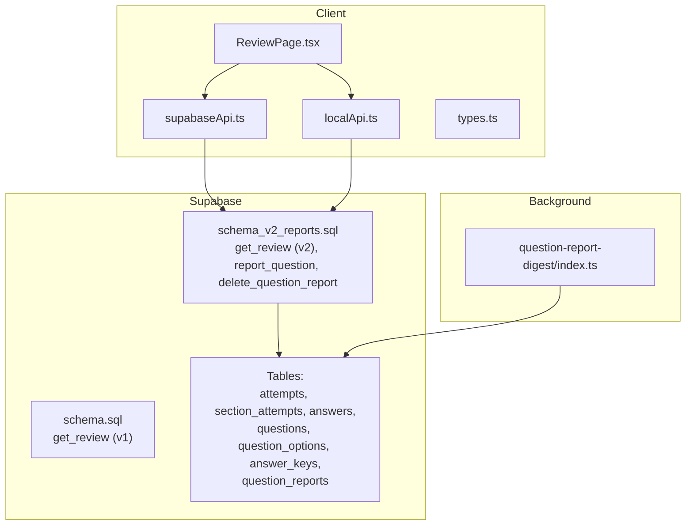
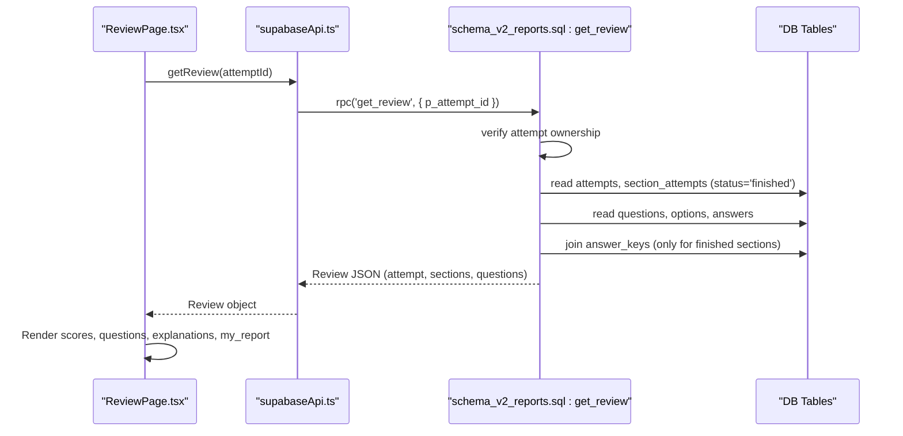
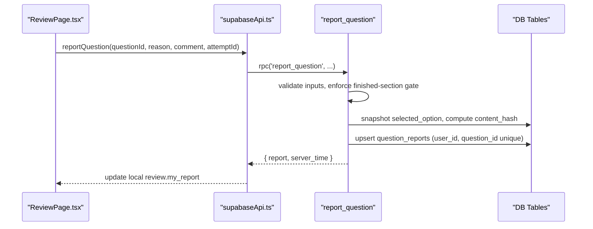
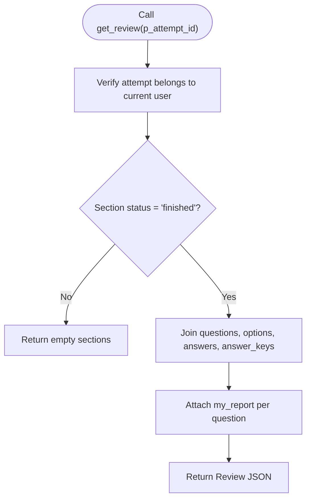
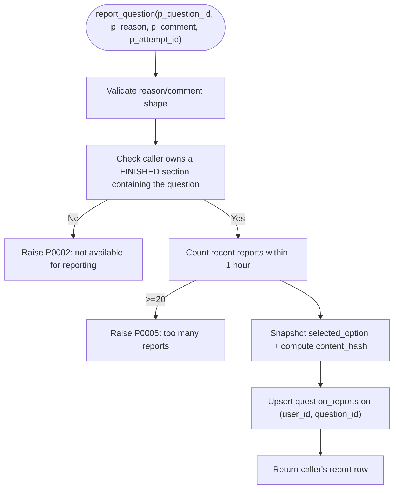
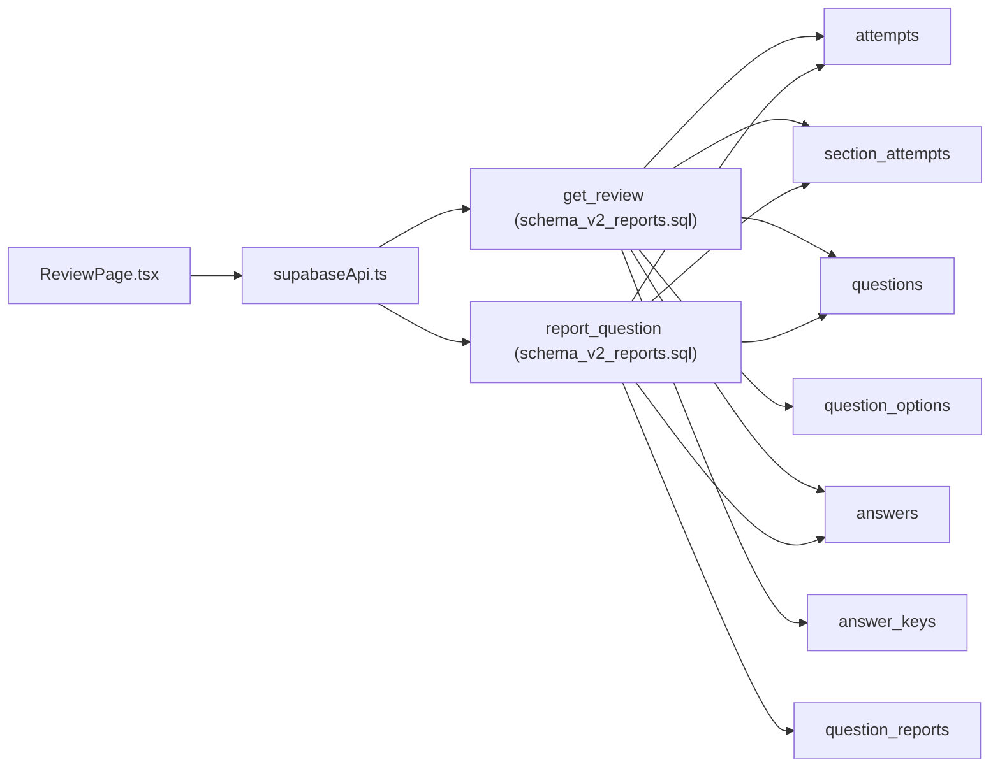

# Review and Reporting Functions

<cite>
**Referenced Files in This Document**
- [schema.sql](file://supabase/schema.sql)
- [schema_v2_reports.sql](file://supabase/schema_v2_reports.sql)
- [types.ts](file://web/src/lib/types.ts)
- [supabaseApi.ts](file://web/src/lib/supabaseApi.ts)
- [localApi.ts](file://web/src/lib/localApi.ts)
- [ReviewPage.tsx](file://web/src/pages/ReviewPage.tsx)
- [index.ts](file://supabase/functions/question-report-digest/index.ts)
- [TECHNICAL_REQUIREMENTS_V2.md](file://docs/TECHNICAL_REQUIREMENTS_V2.md)
</cite>

## Table of Contents
1. [Introduction](#introduction)
2. [Project Structure](#project-structure)
3. [Core Components](#core-components)
4. [Architecture Overview](#architecture-overview)
5. [Detailed Component Analysis](#detailed-component-analysis)
6. [Dependency Analysis](#dependency-analysis)
7. [Performance Considerations](#performance-considerations)
8. [Troubleshooting Guide](#troubleshooting-guide)
9. [Conclusion](#conclusion)

## Introduction
This document explains the review and reporting RPCs that power post-exam analysis and question feedback. It covers:
- How clients request a review via get_review and what data is returned (question details, user answers, correct options, explanations, and per-question report state).
- The security model that restricts answer key access to completed sections only.
- The v2 reporting enhancements: reporting defective questions, editing or withdrawing reports, rate limiting, and content hashing for version safety.
- Practical examples of how clients can build review interfaces and performance analytics from the returned data.
- Differences between basic review (v1) and enhanced reporting features (v2).

## Project Structure
The review and reporting system spans database functions, client types, API wrappers, and UI components:
- Database layer defines tables, RLS policies, and RPCs for grading, reviewing, and reporting.
- Client layer defines TypeScript types and API wrappers to call Supabase RPCs.
- UI layer renders the review page with filters, score summaries, and reporting controls.
- Background function sends operator digests of reports.

**Diagram sources**
- [ReviewPage.tsx:53-102](file://web/src/pages/ReviewPage.tsx#L53-L102)
- [supabaseApi.ts:144-169](file://web/src/lib/supabaseApi.ts#L144-L169)
- [localApi.ts:513-530](file://web/src/lib/localApi.ts#L513-L530)
- [schema.sql:612-623](file://supabase/schema.sql#L612-L623)
- [schema_v2_reports.sql:207-260](file://supabase/schema_v2_reports.sql#L207-L260)
- [index.ts:27-118](file://supabase/functions/question-report-digest/index.ts#L27-L118)

**Section sources**
- [ReviewPage.tsx:53-102](file://web/src/pages/ReviewPage.tsx#L53-L102)
- [supabaseApi.ts:144-169](file://web/src/lib/supabaseApi.ts#L144-L169)
- [localApi.ts:513-530](file://web/src/lib/localApi.ts#L513-L530)
- [schema.sql:612-623](file://supabase/schema.sql#L612-L623)
- [schema_v2_reports.sql:207-260](file://supabase/schema_v2_reports.sql#L207-L260)
- [index.ts:27-118](file://supabase/functions/question-report-digest/index.ts#L27-L118)

## Core Components
- get_review (v1 and v2): Returns attempt metadata, package statistics, and per-section questions with answers, correct options, explanations, and (v2) the caller’s own report.
- report_question (v2): Validates input, enforces the same “finished section” gate as get_review, snapshots selected_option and content_hash, upserts a report row, and returns the caller’s report.
- delete_question_report (v2): Idempotent deletion of the caller’s own report.
- Data models: Types define Review, ReviewSection, ReviewQuestion, QuestionReport, and related structures used by the UI.

Key responsibilities:
- Security: Answer keys and explanations are only included for finished sections of the authenticated user’s attempt.
- Reporting: Reports are isolated per user, rate-limited, and include version-safe content hashes.
- UI integration: The review page uses the returned data to render scores, per-question correctness, explanations, and reporting controls.

**Section sources**
- [schema.sql:612-623](file://supabase/schema.sql#L612-L623)
- [schema_v2_reports.sql:207-260](file://supabase/schema_v2_reports.sql#L207-L260)
- [schema_v2_reports.sql:90-175](file://supabase/schema_v2_reports.sql#L90-L175)
- [schema_v2_reports.sql:182-199](file://supabase/schema_v2_reports.sql#L182-L199)
- [types.ts:146-165](file://web/src/lib/types.ts#L146-L165)
- [types.ts:138-144](file://web/src/lib/types.ts#L138-L144)

## Architecture Overview
The review flow combines server-side gating with rich, secure payloads:

**Diagram sources**
- [ReviewPage.tsx:67-87](file://web/src/pages/ReviewPage.tsx#L67-L87)
- [supabaseApi.ts:144-147](file://web/src/lib/supabaseApi.ts#L144-L147)
- [schema_v2_reports.sql:207-260](file://supabase/schema_v2_reports.sql#L207-L260)

Reporting flow:

**Diagram sources**
- [ReviewPage.tsx:138-151](file://web/src/pages/ReviewPage.tsx#L138-L151)
- [supabaseApi.ts:149-163](file://web/src/lib/supabaseApi.ts#L149-L163)
- [schema_v2_reports.sql:90-175](file://supabase/schema_v2_reports.sql#L90-L175)

## Detailed Component Analysis

### get_review (Basic Review and v2 Enhancement)
- Purpose: Provide post-exam analysis including attempt info, per-section scores, and per-question details with answers, correct options, and explanations.
- Security: Only includes answer_keys for sections marked finished for the authenticated user; prevents answer-key leakage during active exams.
- v2 enhancement: Adds my_report per question so the UI can show whether the user has reported the question without extra round trips.

Data structure highlights:
- Attempt: id, status, timestamps, total_score.
- Sections: subtest metadata, score, ordered questions.
- Questions: id, number, qtype, text, passage, image_url, options, selected_option, is_doubtful, correct_option, explanations, my_report.

**Diagram sources**
- [schema_v2_reports.sql:207-260](file://supabase/schema_v2_reports.sql#L207-L260)
- [schema.sql:612-623](file://supabase/schema.sql#L612-L623)

**Section sources**
- [schema_v2_reports.sql:207-260](file://supabase/schema_v2_reports.sql#L207-L260)
- [schema.sql:612-623](file://supabase/schema.sql#L612-L623)
- [types.ts:146-165](file://web/src/lib/types.ts#L146-L165)

### report_question (v2 Reporting)
- Purpose: Allow users to report defective questions after completing a section.
- Gate: Same predicate as get_review—caller must own a finished section containing the question.
- Validation: Reason must be allowed; comment length capped; “other” requires a comment.
- Rate limit: Max 20 writes per user per rolling hour.
- Version safety: Computes content_hash from question text, passage, and options at report time.
- Upsert: One report per (user_id, question_id); re-reporting edits the existing row.

**Diagram sources**
- [schema_v2_reports.sql:90-175](file://supabase/schema_v2_reports.sql#L90-L175)

**Section sources**
- [schema_v2_reports.sql:90-175](file://supabase/schema_v2_reports.sql#L90-L175)
- [TECHNICAL_REQUIREMENTS_V2.md:73-84](file://docs/TECHNICAL_REQUIREMENTS_V2.md#L73-L84)
- [TECHNICAL_REQUIREMENTS_V2.md:86-96](file://docs/TECHNICAL_REQUIREMENTS_V2.md#L86-L96)

### delete_question_report (v2 Withdrawal)
- Purpose: Allow users to withdraw their own report.
- Behavior: Idempotent; deleting a nonexistent report succeeds silently.

**Section sources**
- [schema_v2_reports.sql:182-199](file://supabase/schema_v2_reports.sql#L182-L199)

### Client Types and API Wrappers
- types.ts defines stable shapes for Review, ReviewSection, ReviewQuestion, QuestionReport, and ExamApi methods.
- supabaseApi.ts calls Supabase RPCs with session checks.
- localApi.ts provides mock implementations for development.

Usage patterns:
- getReview returns Review with sections and questions; UI maps this to score cards and per-question views.
- reportQuestion updates the in-memory review by patching my_report without refetching.

**Section sources**
- [types.ts:138-165](file://web/src/lib/types.ts#L138-L165)
- [supabaseApi.ts:144-169](file://web/src/lib/supabaseApi.ts#L144-L169)
- [localApi.ts:513-530](file://web/src/lib/localApi.ts#L513-L530)

### Review Page Integration
- Loads review data, displays score summary, per-subtest progress, and per-question explanations.
- Provides filtering (all, wrong, blank, doubt, reported).
- Integrates reporting dialog and state management for submit/delete flows.

**Section sources**
- [ReviewPage.tsx:53-102](file://web/src/pages/ReviewPage.tsx#L53-L102)
- [ReviewPage.tsx:116-166](file://web/src/pages/ReviewPage.tsx#L116-L166)
- [ReviewPage.tsx:232-264](file://web/src/pages/ReviewPage.tsx#L232-L264)
- [ReviewPage.tsx:348-416](file://web/src/pages/ReviewPage.tsx#L348-L416)

### Operator Digest Function
- Securely claims a digest run, renders email payload, sends via Resend, and records completion or failure.
- Uses automation/admin keys and environment configuration.

**Section sources**
- [index.ts:27-118](file://supabase/functions/question-report-digest/index.ts#L27-L118)

## Dependency Analysis
- get_review depends on attempts, section_attempts, questions, question_options, answers, and answer_keys.
- report_question depends on section_attempts, attempts, questions, answers, and question_reports; computes content_hash using a helper function.
- UI depends on types.ts for shape validation and supabaseApi.ts for RPC calls.

**Diagram sources**
- [schema_v2_reports.sql:207-260](file://supabase/schema_v2_reports.sql#L207-L260)
- [schema_v2_reports.sql:90-175](file://supabase/schema_v2_reports.sql#L90-L175)
- [supabaseApi.ts:144-169](file://web/src/lib/supabaseApi.ts#L144-L169)
- [ReviewPage.tsx:67-87](file://web/src/pages/ReviewPage.tsx#L67-L87)

**Section sources**
- [schema_v2_reports.sql:207-260](file://supabase/schema_v2_reports.sql#L207-L260)
- [schema_v2_reports.sql:90-175](file://supabase/schema_v2_reports.sql#L90-L175)
- [supabaseApi.ts:144-169](file://web/src/lib/supabaseApi.ts#L144-L169)
- [ReviewPage.tsx:67-87](file://web/src/pages/ReviewPage.tsx#L67-L87)

## Performance Considerations
- get_review aggregates multiple tables but limits results to finished sections of the caller’s attempt, reducing unnecessary joins.
- report_question enforces a rolling-hour rate limit to prevent abuse and excessive writes.
- content_hash computation avoids heavy extensions and uses core Postgres md5.
- UI patches my_report locally to avoid refetches, improving responsiveness.

[No sources needed since this section provides general guidance]

## Troubleshooting Guide
Common errors and handling:
- P0002: Attempt not found or question not available for reporting (e.g., section not finished).
- P0005: Too many reports within one hour; UI shows localized message and does not retry.
- P0006: Invalid input (unknown reason, comment too long, “other” without comment).

Frontend mapping:
- ReviewPage maps error codes to Bahasa Indonesia messages and keeps dialogs open on failure to preserve user input.

**Section sources**
- [ReviewPage.tsx:38-50](file://web/src/pages/ReviewPage.tsx#L38-L50)
- [schema_v2_reports.sql:112-144](file://supabase/schema_v2_reports.sql#L112-L144)
- [TECHNICAL_REQUIREMENTS_V2.md:86-96](file://docs/TECHNICAL_REQUIREMENTS_V2.md#L86-L96)

## Conclusion
The review and reporting system provides a secure, efficient way to analyze exam performance and collect actionable feedback:
- get_review delivers comprehensive post-exam data while protecting answer keys until sections are finished.
- v2 reporting adds robust question feedback with version safety, rate limiting, and isolation.
- Clients can build review interfaces and analytics using the structured data returned by these RPCs.
- The architecture balances usability, security, and scalability through careful gating, minimal round trips, and clear separation of concerns.

[No sources needed since this section summarizes without analyzing specific files]