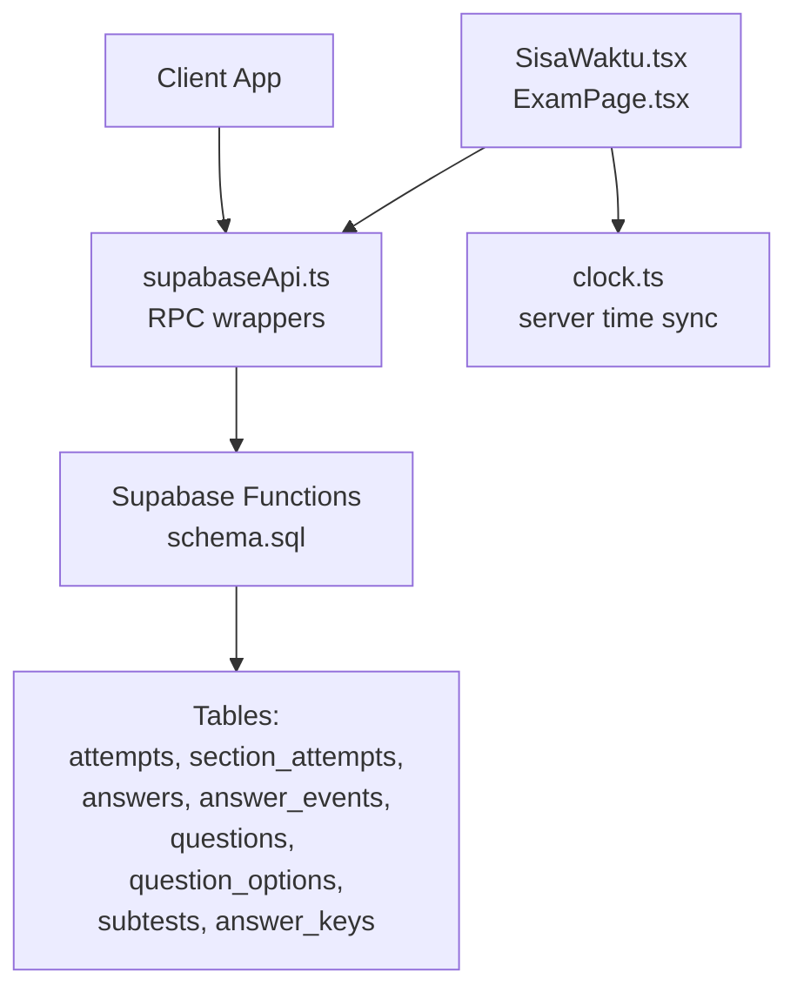
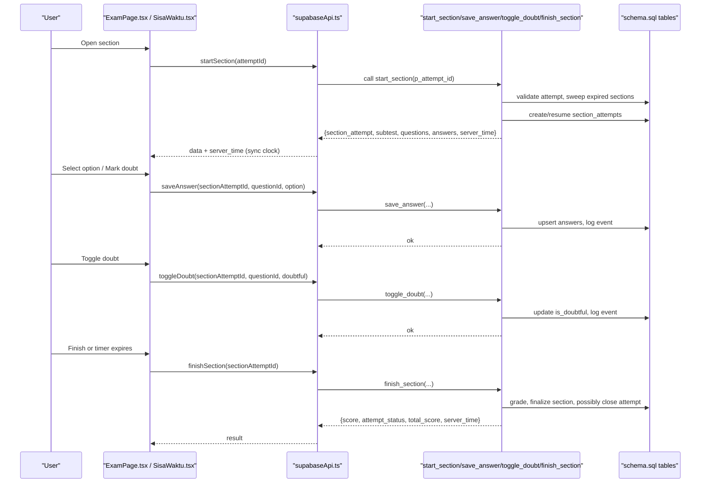
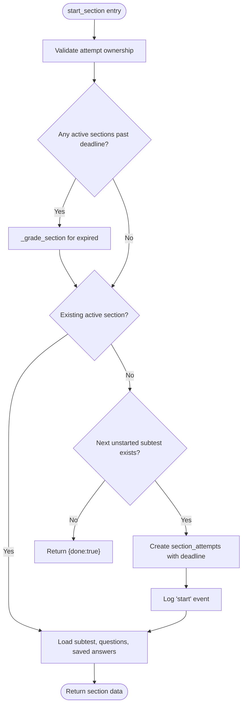
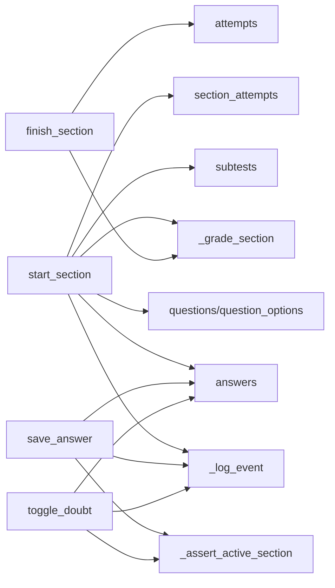

# Section Operations

<cite>
**Referenced Files in This Document**
- [schema.sql](file://supabase/schema.sql)
- [supabaseApi.ts](file://web/src/lib/supabaseApi.ts)
- [localApi.ts](file://web/src/lib/localApi.ts)
- [clock.ts](file://web/src/lib/clock.ts)
- [SisaWaktu.tsx](file://web/src/components/SisaWaktu.tsx)
- [ExamPage.tsx](file://web/src/pages/ExamPage.tsx)
</cite>

## Table of Contents
1. [Introduction](#introduction)
2. [Project Structure](#project-structure)
3. [Core Components](#core-components)
4. [Architecture Overview](#architecture-overview)
5. [Detailed Component Analysis](#detailed-component-analysis)
6. [Dependency Analysis](#dependency-analysis)
7. [Performance Considerations](#performance-considerations)
8. [Troubleshooting Guide](#troubleshooting-guide)
9. [Conclusion](#conclusion)

## Introduction
This document explains the section operation RPC functions that drive exam sections: start_section, save_answer, toggle_doubt, and finish_section. It covers the complete workflow for executing a section including deadline management, question loading, answer persistence, doubt marking, and auto-grading. It also documents how sections relate to subtests, timing constraints, validation rules enforced by each function, real-time saving patterns, timeout handling, error recovery strategies, and the event logging system that tracks user interactions during exam sessions.

## Project Structure
The section operations span server-side SQL functions (Supabase), a client API wrapper, and UI components that manage timers and submission flows.

**Diagram sources**
- [supabaseApi.ts:108-142](file://web/src/lib/supabaseApi.ts#L108-L142)
- [schema.sql:417-580](file://supabase/schema.sql#L417-L580)
- [clock.ts:1-32](file://web/src/lib/clock.ts#L1-L32)
- [SisaWaktu.tsx:1-32](file://web/src/components/SisaWaktu.tsx#L1-L32)
- [ExamPage.tsx:146-174](file://web/src/pages/ExamPage.tsx#L146-L174)

**Section sources**
- [supabaseApi.ts:108-142](file://web/src/lib/supabaseApi.ts#L108-L142)
- [schema.sql:417-580](file://supabase/schema.sql#L417-L580)
- [clock.ts:1-32](file://web/src/lib/clock.ts#L1-L32)
- [SisaWaktu.tsx:1-32](file://web/src/components/SisaWaktu.tsx#L1-L32)
- [ExamPage.tsx:146-174](file://web/src/pages/ExamPage.tsx#L146-L174)

## Core Components
- Server RPCs:
  - start_section: validates attempt ownership, sweeps expired active sections, resumes or creates the next section, loads questions and saved answers, logs start events.
  - save_answer: asserts active section, validates option and question membership, persists selected option, logs save_answer.
  - toggle_doubt: asserts active section, validates question membership, toggles is_doubtful, logs mark/unmark events.
  - finish_section: verifies ownership, grades and finalizes the section, updates attempt totals when all subtests are done.
- Client API:
  - supabaseApi.ts exposes typed wrappers around these RPCs and synchronizes server time from responses.
- Local mock:
  - localApi.ts mirrors RPC semantics in-memory with identical validation and grading behavior for development/offline use.
- Timing:
  - clock.ts maintains server time skew; SisaWaktu.tsx renders countdown and triggers auto-submit on expiry; ExamPage.tsx orchestrates flush and finish with retry and error handling.

**Section sources**
- [schema.sql:417-580](file://supabase/schema.sql#L417-L580)
- [supabaseApi.ts:108-142](file://web/src/lib/supabaseApi.ts#L108-L142)
- [localApi.ts:428-496](file://web/src/lib/localApi.ts#L428-L496)
- [clock.ts:1-32](file://web/src/lib/clock.ts#L1-L32)
- [SisaWaktu.tsx:1-32](file://web/src/components/SisaWaktu.tsx#L1-L32)
- [ExamPage.tsx:146-174](file://web/src/pages/ExamPage.tsx#L146-L174)

## Architecture Overview
End-to-end flow for a section lifecycle:

**Diagram sources**
- [supabaseApi.ts:108-142](file://web/src/lib/supabaseApi.ts#L108-L142)
- [schema.sql:417-580](file://supabase/schema.sql#L417-L580)
- [SisaWaktu.tsx:1-32](file://web/src/components/SisaWaktu.tsx#L1-L32)
- [ExamPage.tsx:146-174](file://web/src/pages/ExamPage.tsx#L146-L174)

## Detailed Component Analysis

### start_section
Responsibilities:
- Validate caller owns the attempt.
- Auto-finish any active sections past their deadline (with grace).
- Resume an existing active section if present; otherwise create the next unstarted subtest based on position.
- Load questions and options for the subtest, excluding answer keys.
- Return persisted answers for the section so the UI can restore state.
- Log a start event with subtest key.

Validation rules:
- Attempt must exist and belong to the current user.
- Subtest selection follows package subtest order; returns done=true when all subtests are finished.
- Questions must belong to the selected subtest.

Timing and deadlines:
- Creates section_attempts with deadline_at = now() + duration_seconds.
- Sweeps and grades any active sections whose deadline has passed plus a small grace window.

Data returned:
- section_attempt metadata, subtest details, questions with options, and previously saved answers.

Error handling:
- Throws specific errors for missing attempt or invalid state; uses consistent error codes.

Event logging:
- Logs a start event with payload containing the subtest key.

**Section sources**
- [schema.sql:417-493](file://supabase/schema.sql#L417-L493)
- [supabaseApi.ts:113-116](file://web/src/lib/supabaseApi.ts#L113-L116)
- [localApi.ts:428-465](file://web/src/lib/localApi.ts#L428-L465)

#### Class-like view of start_section logic

**Diagram sources**
- [schema.sql:417-493](file://supabase/schema.sql#L417-L493)

### save_answer
Responsibilities:
- Assert the section is active and owned by the caller.
- Validate the option value if provided.
- Ensure the question belongs to the current section’s subtest.
- Persist selected_option via upsert on answers.
- Log a save_answer event with the chosen option.

Validation rules:
- Option must be one of A-E or null.
- Question must be part of the pinned subtest.

Real-time saving pattern:
- The client calls this frequently as users select options; the server ensures idempotent upserts and records each change in the event log.

Timeout handling:
- If the section deadline has passed (plus grace), the helper asserts active section will grade and reject further saves.

**Section sources**
- [schema.sql:495-522](file://supabase/schema.sql#L495-L522)
- [supabaseApi.ts:118-124](file://web/src/lib/supabaseApi.ts#L118-L124)
- [localApi.ts:467-476](file://web/src/lib/localApi.ts#L467-L476)

### toggle_doubt
Responsibilities:
- Assert the section is active and owned by the caller.
- Ensure the question belongs to the current section’s subtest.
- Update is_doubtful for the answer row via upsert.
- Log either mark_doubt or unmark_doubt depending on the boolean flag.

Validation rules:
- Same ownership and question membership checks as save_answer.

Use cases:
- Allows users to flag questions they want to revisit later; tracked in both answers and event log.

**Section sources**
- [schema.sql:524-549](file://supabase/schema.sql#L524-L549)
- [supabaseApi.ts:126-132](file://web/src/lib/supabaseApi.ts#L126-L132)
- [localApi.ts:478-487](file://web/src/lib/localApi.ts#L478-L487)

### finish_section
Responsibilities:
- Verify ownership of the section attempt.
- Grade the section using correct answers and finalize it.
- If all subtests are finished, close the attempt and compute total_score.
- Return score, attempt status, and total score.

Auto-grading mechanism:
- Uses the shared grading helper to count correct answers per question and multiply by points per question.
- Idempotent: finishing an already finished section returns stored score without side effects.

Relationship to subtests:
- Finishing a section contributes to closing the overall attempt only after every subtest in the package is completed.

Error handling:
- Throws if section not found; otherwise succeeds even if called after deadline since grading is allowed post-expiry.

**Section sources**
- [schema.sql:551-580](file://supabase/schema.sql#L551-L580)
- [supabaseApi.ts:134-137](file://web/src/lib/supabaseApi.ts#L134-L137)
- [localApi.ts:489-496](file://web/src/lib/localApi.ts#L489-L496)

### Deadline Management and Timer Integration
- Server enforces deadlines:
  - Each section has deadline_at derived from subtest duration.
  - Helpers assert active sections and auto-grade past-deadline requests with a small grace window.
- Client synchronization:
  - Every RPC response includes server_time; the client syncs its internal clock offset to keep countdown accurate.
  - The timer component renders remaining time and triggers auto-submit when reaching zero.
- Auto-submit:
  - On expiry, the page attempts to finish the section; if the server has already graded it, the client handles the expected error gracefully.

**Section sources**
- [schema.sql:311-337](file://supabase/schema.sql#L311-L337)
- [schema.sql:417-460](file://supabase/schema.sql#L417-L460)
- [clock.ts:1-32](file://web/src/lib/clock.ts#L1-L32)
- [SisaWaktu.tsx:1-32](file://web/src/components/SisaWaktu.tsx#L1-L32)
- [ExamPage.tsx:146-174](file://web/src/pages/ExamPage.tsx#L146-L174)

### Event Logging System
- Purpose:
  - Tracks user interactions per section: start, save_answer, mark_doubt, unmark_doubt, finish.
- Storage:
  - answer_events table stores event_type, optional question_id, and JSONB payload.
- Cap:
  - Per-section cap prevents abuse and protects storage limits; once reached, additional events are dropped.
- Usage:
  - start_section logs start with subtest key.
  - save_answer logs option changes.
  - toggle_doubt logs mark/unmark actions.
  - finish_section logs finish with score.

**Section sources**
- [schema.sql:96-106](file://supabase/schema.sql#L96-L106)
- [schema.sql:241-260](file://supabase/schema.sql#L241-L260)
- [schema.sql:462-463](file://supabase/schema.sql#L462-L463)
- [schema.sql:517-518](file://supabase/schema.sql#L517-L518)
- [schema.sql:543-545](file://supabase/schema.sql#L543-L545)
- [schema.sql:212-213](file://supabase/schema.sql#L212-L213)

### Validation Rules Summary
- Ownership:
  - All mutating RPCs verify the caller owns the attempt/section via auth context.
- Question membership:
  - save_answer and toggle_doubt ensure the question belongs to the active section’s subtest.
- Option validation:
  - save_answer rejects options outside A-E.
- Section state:
  - Active-only enforcement with deadline check; past-deadline operations trigger grading and return appropriate errors.
- Subtest integrity:
  - start_section selects the next subtest by position and returns done when all subtests are finished.

**Section sources**
- [schema.sql:311-337](file://supabase/schema.sql#L311-L337)
- [schema.sql:417-493](file://supabase/schema.sql#L417-L493)
- [schema.sql:495-549](file://supabase/schema.sql#L495-L549)

### Real-Time Answer Saving Patterns
- Frequent save_answer calls as users interact with options.
- Idempotent upsert ensures repeated saves do not corrupt state.
- Events recorded for each save enable auditability and analytics.
- Client-side timers and flush mechanisms ensure pending answers are persisted before finishing.

**Section sources**
- [schema.sql:495-522](file://supabase/schema.sql#L495-L522)
- [supabaseApi.ts:118-124](file://web/src/lib/supabaseApi.ts#L118-L124)
- [ExamPage.tsx:146-174](file://web/src/pages/ExamPage.tsx#L146-L174)

### Timeout Handling and Error Recovery
- Server-side:
  - Grace period allows brief tolerance beyond deadline; after that, operations grade and reject with specific error codes.
- Client-side:
  - Timer triggers auto-submit at zero; finishSection is retried and tolerates already-graded states.
  - Errors like “section already finished” or “deadline passed” are handled gracefully to avoid blocking the user.

**Section sources**
- [schema.sql:311-337](file://supabase/schema.sql#L311-L337)
- [schema.sql:417-460](file://supabase/schema.sql#L417-L460)
- [SisaWaktu.tsx:1-32](file://web/src/components/SisaWaktu.tsx#L1-L32)
- [ExamPage.tsx:146-174](file://web/src/pages/ExamPage.tsx#L146-L174)

## Dependency Analysis

**Diagram sources**
- [schema.sql:186-239](file://supabase/schema.sql#L186-L239)
- [schema.sql:241-260](file://supabase/schema.sql#L241-L260)
- [schema.sql:311-337](file://supabase/schema.sql#L311-L337)
- [schema.sql:417-580](file://supabase/schema.sql#L417-L580)

**Section sources**
- [schema.sql:186-239](file://supabase/schema.sql#L186-L239)
- [schema.sql:241-260](file://supabase/schema.sql#L241-L260)
- [schema.sql:311-337](file://supabase/schema.sql#L311-L337)
- [schema.sql:417-580](file://supabase/schema.sql#L417-L580)

## Performance Considerations
- Event log cap:
  - answer_events capped per section to prevent runaway growth and protect storage limits.
- Efficient queries:
  - start_section aggregates questions and options in a single query; answers loaded per section.
- Idempotency:
  - Upserts on answers and idempotent finish reduce redundant writes and race conditions.
- Time sync:
  - Client aligns with server_time to minimize drift and ensure accurate countdowns.

[No sources needed since this section provides general guidance]

## Troubleshooting Guide
Common issues and resolutions:
- “attempt not found”:
  - Ensure the attempt exists and belongs to the current user; re-initiate session if needed.
- “question not in this section”:
  - Verify the question belongs to the active subtest; avoid cross-subtest operations.
- “invalid option”:
  - Only A-E values are accepted; normalize input before calling save_answer.
- “section already finished”:
  - Finish is idempotent; if already graded, proceed to next steps or review.
- “section deadline passed”:
  - Further mutations are blocked; rely on auto-grading and move forward.

Recovery strategies:
- Retry finishSection after timeout; handle P0003/P0004 gracefully.
- Use get_attempt_state to reconcile UI with server state after network issues.

**Section sources**
- [schema.sql:311-337](file://supabase/schema.sql#L311-L337)
- [schema.sql:417-580](file://supabase/schema.sql#L417-L580)
- [supabaseApi.ts:28-39](file://web/src/lib/supabaseApi.ts#L28-L39)

## Conclusion
The section operations provide a robust, validated, and auditable workflow for exam sections. They enforce strict ownership and membership checks, maintain precise timing through server-driven deadlines, persist answers reliably, and track user interactions via event logging. The integration between server RPCs, client API wrappers, and UI components ensures a resilient experience with clear error handling and recovery paths.