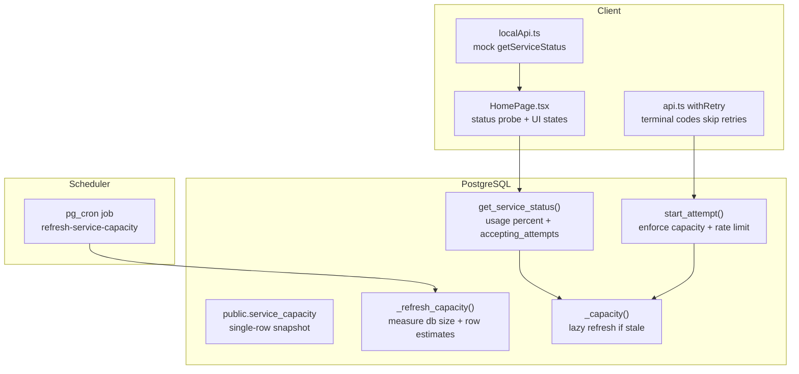
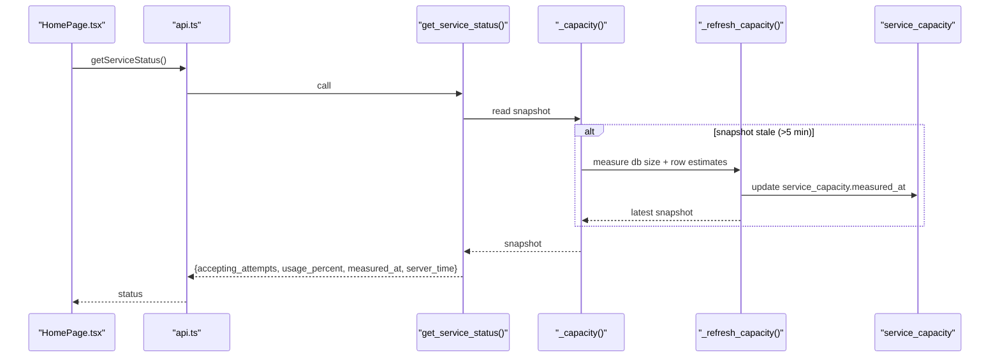
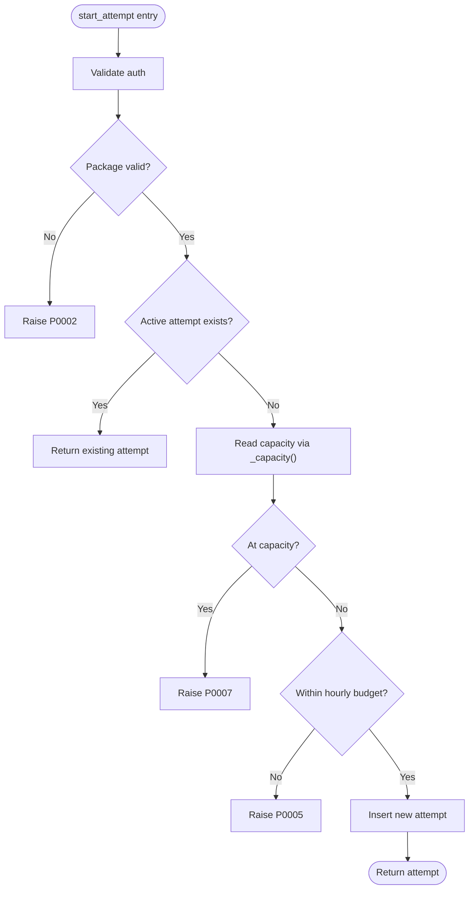
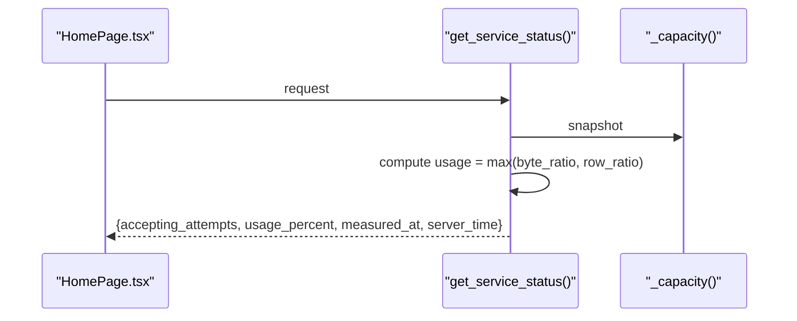
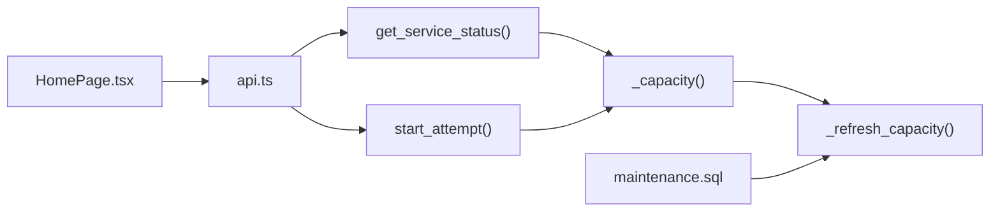

# Service Capacity and Status

<cite>
**Referenced Files in This Document**
- [schema.sql](file://supabase/schema.sql)
- [maintenance.sql](file://supabase/maintenance.sql)
- [CAPACITY_GUARD.md](file://docs/CAPACITY_GUARD.md)
- [api.ts](file://web/src/lib/api.ts)
- [HomePage.tsx](file://web/src/pages/HomePage.tsx)
- [localApi.ts](file://web/src/lib/localApi.ts)
</cite>

## Table of Contents
1. Introduction
2. Project Structure
3. Core Components
4. Architecture Overview
5. Detailed Component Analysis
6. Dependency Analysis
7. Performance Considerations
8. Troubleshooting Guide
9. Conclusion

## Introduction
This document explains the service capacity monitoring and status RPCs that protect the system from database overflow on free tiers, focusing on get_service_status and internal capacity management functions. It covers byte-based and row-count limits, measurement algorithms, caching and self-healing behavior, rate limiting to prevent abuse, and how clients should handle capacity warnings and unavailability. It also details graceful degradation strategies that keep active users productive while preventing new work when storage is exhausted.

## Project Structure
The capacity guard spans server-side Postgres functions and tables, a maintenance scheduler, and client-side handling:
- Server schema defines the capacity table, measurement helpers, enforcement in start_attempt, and the public status RPC.
- Maintenance schedules periodic warm-up measurements.
- Client code calls the status RPC to drive UI state and handles terminal error codes without retrying.

**Diagram sources**
- [schema.sql:108-127](file://supabase/schema.sql#L108-L127)
- [schema.sql:262-309](file://supabase/schema.sql#L262-L309)
- [schema.sql:341-415](file://supabase/schema.sql#L341-L415)
- [maintenance.sql:47-51](file://supabase/maintenance.sql#L47-L51)
- [HomePage.tsx:65-82](file://web/src/pages/HomePage.tsx#L65-L82)
- [api.ts:97-122](file://web/src/lib/api.ts#L97-L122)
- [localApi.ts:381-384](file://web/src/lib/localApi.ts#L381-L384)

**Section sources**
- [schema.sql:108-127](file://supabase/schema.sql#L108-L127)
- [schema.sql:262-309](file://supabase/schema.sql#L262-L309)
- [schema.sql:341-415](file://supabase/schema.sql#L341-L415)
- [maintenance.sql:47-51](file://supabase/maintenance.sql#L47-L51)
- [HomePage.tsx:65-82](file://web/src/pages/HomePage.tsx#L65-L82)
- [api.ts:97-122](file://web/src/lib/api.ts#L97-L122)
- [localApi.ts:381-384](file://web/src/lib/localApi.ts#L381-L384)

## Core Components
- Capacity snapshot table: stores current usage and limits for bytes and attempt rows, plus timestamp of last measurement.
- Measurement helpers:
  - _refresh_capacity(): measures database size and estimated live rows across key tables; stamps measured_at.
  - _capacity(): returns the snapshot, refreshing lazily if older than 5 minutes.
- Enforcement:
  - start_attempt(): checks capacity before creating new attempts; allows resuming existing ones regardless of capacity.
  - Rate limit: per-user hourly budget (e.g., 10 attempts per hour) enforced after capacity check.
- Public status RPC:
  - get_service_status(): computes usage as the greater of byte ratio and row-ratio, clamps to percentage, and exposes whether the service is accepting new attempts.
- Scheduler:
  - pg_cron job periodically warms the snapshot so reads are fast and consistent.
- Client integration:
  - HomePage probes status at load time to disable start buttons and show a warning banner when not accepting attempts.
  - Terminal error codes (including P0007 capacity reached) are not retried by withRetry.

**Section sources**
- [schema.sql:108-127](file://supabase/schema.sql#L108-L127)
- [schema.sql:262-309](file://supabase/schema.sql#L262-L309)
- [schema.sql:341-415](file://supabase/schema.sql#L341-L415)
- [maintenance.sql:47-51](file://supabase/maintenance.sql#L47-L51)
- [HomePage.tsx:24-42](file://web/src/pages/HomePage.tsx#L24-L42)
- [api.ts:97-122](file://web/src/lib/api.ts#L97-L122)

## Architecture Overview
The capacity guard is designed to be self-healing and low-cost:
- Measurements use O(1) catalog stats and directory sizes.
- Staleness threshold ensures infrequent refreshes even without cron.
- Asymmetric enforcement protects ongoing exams while blocking new work near capacity.
- The client receives a simple boolean and percentage to drive UX, never raw byte counts.

**Diagram sources**
- [schema.sql:262-309](file://supabase/schema.sql#L262-L309)
- [schema.sql:392-415](file://supabase/schema.sql#L392-L415)
- [HomePage.tsx:65-82](file://web/src/pages/HomePage.tsx#L65-L82)
- [api.ts:77-81](file://web/src/lib/api.ts#L77-L81)

## Detailed Component Analysis

### Capacity Snapshot and Limits
- Single-row table holds:
  - db_bytes: current database size.
  - attempt_rows: estimated live rows across attempts, section_attempts, answers, answer_events.
  - limit_bytes: soft ceiling (default ~80% of free tier).
  - limit_attempt_rows: secondary ceiling (default 2,000,000).
  - measured_at: timestamp of last measurement.
- Limits are data-driven and can be adjusted via SQL without redeploy.

**Section sources**
- [schema.sql:108-127](file://supabase/schema.sql#L108-L127)
- [CAPACITY_GUARD.md:29-58](file://docs/CAPACITY_GUARD.md#L29-L58)

### Measurement Algorithms
- _refresh_capacity():
  - Uses pg_database_size(current_database()) for size.
  - Aggregates planner’s reltuples estimates for key tables to compute attempt_rows.
  - Updates measured_at to now().
- _capacity():
  - Returns the row; if missing or measured_at older than 5 minutes, triggers _refresh_capacity().
  - Ensures correctness even without cron; cron only warms the cache.

Complexity:
- Size stat is sub-millisecond.
- Row estimate uses catalog lookups, O(1) relative to table growth.
- Concurrency-safe due to idempotent UPDATE; no locks required.

**Section sources**
- [schema.sql:262-309](file://supabase/schema.sql#L262-L309)
- [CAPACITY_GUARD.md:60-79](file://docs/CAPACITY_GUARD.md#L60-L79)

### Enforcement in start_attempt
- Before creating a new attempt:
  - Reads capacity via _capacity().
  - If db_bytes >= limit_bytes OR attempt_rows >= limit_attempt_rows, raises P0007.
- After capacity check:
  - Enforces per-user hourly budget (e.g., 10 attempts per hour), raising P0005 if exceeded.
- Resuming an existing active attempt bypasses these gates to avoid interrupting ongoing work.

**Diagram sources**
- [schema.sql:341-390](file://supabase/schema.sql#L341-L390)

**Section sources**
- [schema.sql:341-390](file://supabase/schema.sql#L341-L390)
- [CAPACITY_GUARD.md:81-96](file://docs/CAPACITY_GUARD.md#L81-L96)

### Public Status RPC: get_service_status
- Computes usage as the greater of:
  - db_bytes / limit_bytes
  - attempt_rows / limit_attempt_rows
- Clamps to 0–100% and returns:
  - accepting_attempts: true if usage < 100%.
  - usage_percent: integer percentage.
  - measured_at and server_time for freshness and diagnostics.
- Raw byte counts are intentionally not exposed to clients.

**Diagram sources**
- [schema.sql:392-415](file://supabase/schema.sql#L392-L415)
- [HomePage.tsx:65-82](file://web/src/pages/HomePage.tsx#L65-L82)

**Section sources**
- [schema.sql:392-415](file://supabase/schema.sql#L392-L415)

### Caching Strategy and Self-Healing
- Snapshot cached for up to 5 minutes; stale snapshots trigger lazy refresh.
- pg_cron job refreshes every 5 minutes to reduce cold-start latency.
- If cron is disabled, reads still self-heal by measuring on demand.

Operational notes:
- Measurement cost is minimal and bounded.
- Concurrency does not require explicit locking; idempotent updates are safe.

**Section sources**
- [schema.sql:262-309](file://supabase/schema.sql#L262-L309)
- [maintenance.sql:47-51](file://supabase/maintenance.sql#L47-L51)
- [CAPACITY_GUARD.md:60-79](file://docs/CAPACITY_GUARD.md#L60-L79)

### Rate Limiting Implementation
- Per-user hourly budget prevents abuse and bounds row growth.
- Enforced in start_attempt after capacity check to ensure global capacity takes precedence over per-user quotas.
- Exceeding the quota raises P0005; client maps this to a user-friendly message.

Client handling:
- withRetry treats P0005 as terminal; it will not retry.
- HomePage displays a specific message for hourly caps.

**Section sources**
- [schema.sql:374-380](file://supabase/schema.sql#L374-L380)
- [api.ts:97-122](file://web/src/lib/api.ts#L97-L122)
- [HomePage.tsx:24-42](file://web/src/pages/HomePage.tsx#L24-L42)

### Client Handling of Capacity Warnings and Unavailability
- HomePage fetches status alongside packages and history.
- If accepting_attempts is false:
  - Start buttons are disabled and relabeled to indicate full quota.
  - A warning banner appears above the package list.
- If status fetch fails (null):
  - Treated as accepting attempts to preserve usability on older schemas or transient failures.
- On startAttempt failure:
  - P0007 maps to a capacity message consistent with the banner.
  - P0005 maps to an hourly cap message.
  - withRetry avoids retries for terminal codes including P0007.

Mock support:
- localApi provides a mock getServiceStatus that simulates full capacity based on a flag.

**Section sources**
- [HomePage.tsx:65-82](file://web/src/pages/HomePage.tsx#L65-L82)
- [HomePage.tsx:24-42](file://web/src/pages/HomePage.tsx#L24-L42)
- [api.ts:97-122](file://web/src/lib/api.ts#L97-L122)
- [localApi.ts:381-384](file://web/src/lib/localApi.ts#L381-L384)

### Graceful Degradation Strategies
- Asymmetric enforcement:
  - New attempts blocked at capacity; existing attempts continue uninterrupted.
  - Section operations, saving answers, toggling doubts, finishing sections remain allowed.
  - Read-only flows (attempt state, review) remain available.
- Reporting remains allowed because question reports are small and valuable.
- UI degrades gracefully:
  - Unknown status defaults to open to avoid blocking users unnecessarily.
  - Consistent messaging between banner and error card prevents confusion.

**Section sources**
- [CAPACITY_GUARD.md:7-27](file://docs/CAPACITY_GUARD.md#L7-L27)
- [CAPACITY_GUARD.md:113-131](file://docs/CAPACITY_GUARD.md#L113-L131)

## Dependency Analysis
- get_service_status depends on _capacity, which may depend on _refresh_capacity.
- start_attempt depends on _capacity for enforcement and enforces per-user rate limits.
- HomePage depends on api.getServiceStatus to render UI state.
- withRetry depends on error codes to decide retry behavior.
- maintenance.sql schedules background refresh to keep _capacity fresh.

**Diagram sources**
- [schema.sql:262-309](file://supabase/schema.sql#L262-L309)
- [schema.sql:341-415](file://supabase/schema.sql#L341-L415)
- [maintenance.sql:47-51](file://supabase/maintenance.sql#L47-L51)
- [HomePage.tsx:65-82](file://web/src/pages/HomePage.tsx#L65-L82)
- [api.ts:77-81](file://web/src/lib/api.ts#L77-L81)

**Section sources**
- [schema.sql:262-309](file://supabase/schema.sql#L262-L309)
- [schema.sql:341-415](file://supabase/schema.sql#L341-L415)
- [maintenance.sql:47-51](file://supabase/maintenance.sql#L47-L51)
- [HomePage.tsx:65-82](file://web/src/pages/HomePage.tsx#L65-L82)
- [api.ts:77-81](file://web/src/lib/api.ts#L77-L81)

## Performance Considerations
- Measurement cost:
  - Database size stat is sub-millisecond.
  - Row estimates come from planner metadata; O(1) relative to table size.
- Cache window:
  - 5-minute staleness threshold reduces repeated measurements.
  - Cron job warms the cache to minimize latency spikes.
- Concurrency:
  - Idempotent updates allow concurrent refresh without locks.
- Client-side:
  - withRetry avoids retry storms on terminal errors (P0005, P0007).
  - Status probe is optional; failures do not block page rendering.

[No sources needed since this section provides general guidance]

## Troubleshooting Guide
Common issues and resolutions:
- Capacity reached (P0007):
  - Symptom: New attempts refused; UI shows capacity warning banner.
  - Resolution: Wait for retention sweep to reclaim space; optionally adjust limit_bytes or tune retention windows.
- Hourly quota exceeded (P0005):
  - Symptom: Too many attempts opened within an hour.
  - Resolution: Retry later or resume an existing attempt.
- Status probe failures:
  - Symptom: UI falls back to assuming acceptance.
  - Resolution: Ensure schema includes get_service_status; verify network/auth; ignore transient failures.

Operational queries:
- Inspect current capacity snapshot and limits.
- Force immediate measurement to validate recent changes.
- Identify largest tables contributing to size.

**Section sources**
- [CAPACITY_GUARD.md:137-161](file://docs/CAPACITY_GUARD.md#L137-L161)

## Conclusion
The capacity guard ensures the application remains stable and fair under free-tier constraints by:
- Measuring database size and row counts efficiently and caching results.
- Preventing new attempts when nearing capacity while allowing ongoing work to finish.
- Providing a simple, safe status RPC for clients to adapt UI accordingly.
- Enforcing per-user rate limits to prevent abuse.
- Delivering clear, consistent messages and graceful degradation to maintain user experience.

[No sources needed since this section summarizes without analyzing specific files]