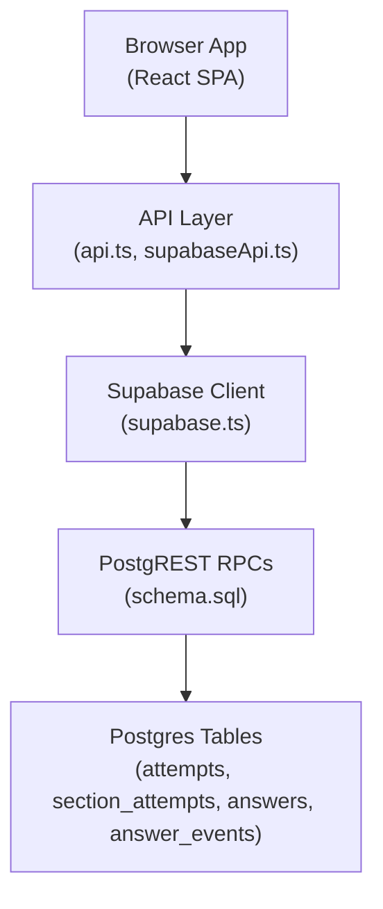
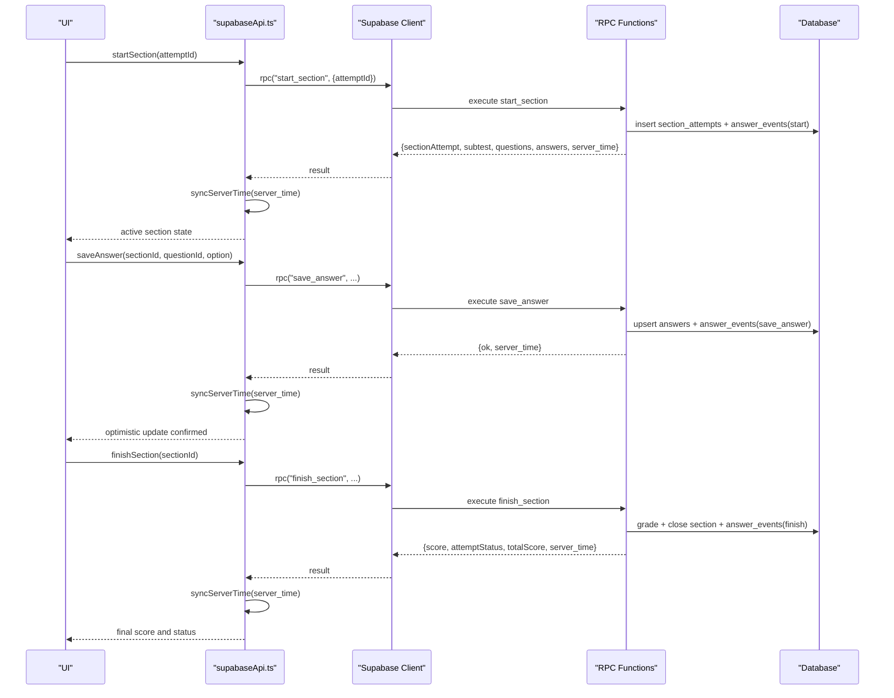
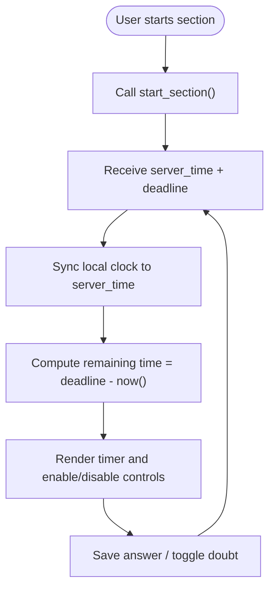
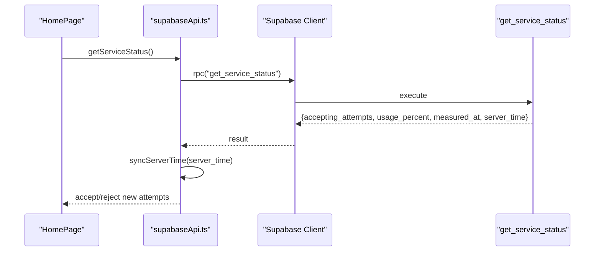
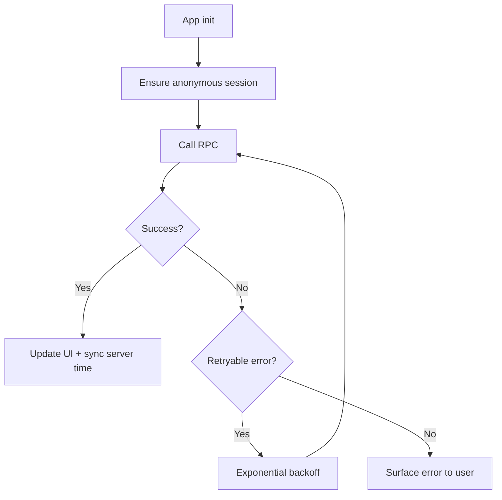
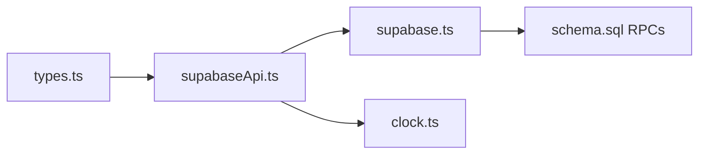

# Real-time Subscriptions

<cite>
**Referenced Files in This Document**
- [schema.sql](file://supabase/schema.sql)
- [supabaseApi.ts](file://web/src/lib/supabaseApi.ts)
- [api.ts](file://web/src/lib/api.ts)
- [types.ts](file://web/src/types.ts)
- [supabase.ts](file://web/src/lib/supabase.ts)
- [clock.ts](file://web/src/lib/clock.ts)
</cite>

## Table of Contents
1. [Introduction](#introduction)
2. [Project Structure](#project-structure)
3. [Core Components](#core-components)
4. [Architecture Overview](#architecture-overview)
5. [Detailed Component Analysis](#detailed-component-analysis)
6. [Dependency Analysis](#dependency-analysis)
7. [Performance Considerations](#performance-considerations)
8. [Troubleshooting Guide](#troubleshooting-guide)
9. [Conclusion](#conclusion)

## Introduction
This document explains how the TBS LPDP Try Out system provides real-time-like updates for exam progress, timer synchronization, and status changes using a request-driven model backed by server-side event logging and time-synced state. It covers:
- How clients obtain authoritative section and attempt state via RPCs
- How events are recorded on the server to support auditability and potential future streaming
- How timers and deadlines are synchronized across client and server
- How service capacity and maintenance status are surfaced to clients
- Recommended patterns for subscribing to updates, handling reconnections, and processing events on the client

The current implementation uses HTTP RPC calls rather than persistent WebSocket connections. Clients poll or call RPCs at appropriate times (start, save, finish, resume) and rely on server-provided timestamps to keep local UI consistent with the authoritative backend clock.

## Project Structure
The real-time behavior is implemented through:
- Supabase SQL schema defining tables, Row Level Security policies, and RPC functions that encapsulate all mutations and reads
- A frontend API layer that wraps RPC calls, synchronizes server time, and retries transient failures
- Type definitions describing the shapes of responses used by the UI

**Diagram sources**
- [api.ts:1-128](file://web/src/lib/api.ts#L1-L128)
- [supabaseApi.ts:1-170](file://web/src/lib/supabaseApi.ts#L1-L170)
- [supabase.ts:1-14](file://web/src/lib/supabase.ts#L1-L14)
- [schema.sql:339-692](file://supabase/schema.sql#L339-L692)

**Section sources**
- [schema.sql:14-142](file://supabase/schema.sql#L14-L142)
- [schema.sql:339-692](file://supabase/schema.sql#L339-L692)
- [api.ts:1-128](file://web/src/lib/api.ts#L1-L128)
- [supabaseApi.ts:1-170](file://web/src/lib/supabaseApi.ts#L1-L170)
- [supabase.ts:1-14](file://web/src/lib/supabase.ts#L1-L14)

## Core Components
- Server-side event log: The `answer_events` table records key actions during an attempt (start, save_answer, mark_doubt, unmark_doubt, finish). These events are appended by server functions when sections start, answers are saved, doubt flags change, and sections finish.
- Time synchronization: Every RPC response includes a `server_time`. The client syncs its internal clock from this value to ensure consistent countdowns and deadline enforcement.
- Service capacity: A dedicated RPC returns whether new attempts are accepted and usage percentage, enabling the UI to gate start buttons and show warnings.
- Maintenance mode: A public RPC exposes scheduled maintenance windows so the app can display maintenance screens before authentication.

Key responsibilities:
- `save_answer`, `toggle_doubt`, `finish_section`, `start_section`: mutate state and append events
- `get_attempt_state`, `get_review`: return authoritative state for resumes and review
- `get_service_status`, `get_maintenance_status`: expose operational status

**Section sources**
- [schema.sql:96-107](file://supabase/schema.sql#L96-L107)
- [schema.sql:241-260](file://supabase/schema.sql#L241-L260)
- [schema.sql:392-415](file://supabase/schema.sql#L392-L415)
- [supabaseApi.ts:32-39](file://web/src/lib/supabaseApi.ts#L32-L39)
- [supabaseApi.ts:67-88](file://web/src/lib/supabaseApi.ts#L67-L88)

## Architecture Overview
The system follows a request-response architecture with server-side event logging. Clients do not maintain persistent channels; instead, they:
- Call RPCs to perform actions (start section, save answer, toggle doubt, finish section)
- Receive authoritative state and server time in each response
- Optionally poll or call RPCs at meaningful user interactions to refresh UI
- Use the synced server time to compute remaining time and enforce deadlines locally

**Diagram sources**
- [supabaseApi.ts:113-137](file://web/src/lib/supabaseApi.ts#L113-L137)
- [schema.sql:417-493](file://supabase/schema.sql#L417-L493)
- [schema.sql:495-580](file://supabase/schema.sql#L495-L580)

## Detailed Component Analysis

### Event Types and Message Formats
The server logs structured events for each section attempt. Each event has:
- `event_type`: one of `start`, `save_answer`, `mark_doubt`, `unmark_doubt`, `finish`
- `payload`: JSON object carrying context such as selected option or score
- `created_at`: timestamp for ordering and auditing

These events are inserted by server functions:
- `start_section` inserts a `start` event with subtest key
- `save_answer` inserts a `save_answer` event with the chosen option
- `toggle_doubt` inserts `mark_doubt` or `unmark_doubt`
- `_grade_section` (called by `finish_section`) inserts a `finish` event with computed score

Event cap per section prevents abuse and bounds storage growth.

**Section sources**
- [schema.sql:96-107](file://supabase/schema.sql#L96-L107)
- [schema.sql:241-260](file://supabase/schema.sql#L241-L260)
- [schema.sql:417-493](file://supabase/schema.sql#L417-L493)
- [schema.sql:495-580](file://supabase/schema.sql#L495-L580)

### Timer Synchronization and Deadline Enforcement
- Deadlines are set server-side when a section starts, based on subtest duration
- Local countdowns derive from `server_time` returned by RPCs, ensuring consistency even if the client clock drifts
- Server enforces deadlines via helper functions; past-deadline requests trigger auto-grading and error codes
- Clients should treat server time as authoritative for countdowns and disable controls when deadlines pass

**Diagram sources**
- [schema.sql:417-493](file://supabase/schema.sql#L417-L493)
- [schema.sql:311-337](file://supabase/schema.sql#L311-L337)
- [supabaseApi.ts:32-39](file://web/src/lib/supabaseApi.ts#L32-L39)

**Section sources**
- [schema.sql:311-337](file://supabase/schema.sql#L311-L337)
- [schema.sql:417-493](file://supabase/schema.sql#L417-L493)
- [supabaseApi.ts:32-39](file://web/src/lib/supabaseApi.ts#L32-L39)

### Subscription Patterns for Exam Progress
Although there are no persistent subscriptions, clients can emulate subscription-like behavior by:
- Calling `get_attempt_state` after significant actions to refresh section statuses and scores
- Using optimistic UI updates followed by confirmation from RPC responses
- Polling `get_attempt_state` periodically while a section is active if needed for multi-tab or background sync

Recommended pattern:
- On action completion (save, toggle doubt, finish), update UI optimistically
- After RPC success, reconcile with server state from the same response or a subsequent `get_attempt_state`
- For cross-session continuity, call `get_attempt_state` when resuming an attempt

**Section sources**
- [schema.sql:582-607](file://supabase/schema.sql#L582-L607)
- [supabaseApi.ts:139-142](file://web/src/lib/supabaseApi.ts#L139-L142)

### Service Capacity Changes
Clients query service capacity before offering new attempts:
- `get_service_status` returns whether new attempts are accepted and usage percentage
- UI should disable start buttons when not accepting attempts and show a warning

**Diagram sources**
- [schema.sql:392-415](file://supabase/schema.sql#L392-L415)
- [supabaseApi.ts:85-88](file://web/src/lib/supabaseApi.ts#L85-L88)

**Section sources**
- [schema.sql:392-415](file://supabase/schema.sql#L392-L415)
- [supabaseApi.ts:85-88](file://web/src/lib/supabaseApi.ts#L85-L88)

### Connection Lifecycle Management and Reconnection Strategy
- No persistent WebSocket connections exist; lifecycle is per-request
- Authentication is anonymous and session-persistent within the browser
- Transient network errors are retried with exponential backoff for background writes
- Chunk load errors trigger a controlled reload to fetch fresh bundles

**Diagram sources**
- [supabaseApi.ts:45-64](file://web/src/lib/supabaseApi.ts#L45-L64)
- [api.ts:97-122](file://web/src/lib/api.ts#L97-L122)

**Section sources**
- [supabaseApi.ts:45-64](file://web/src/lib/supabaseApi.ts#L45-L64)
- [api.ts:97-122](file://web/src/lib/api.ts#L97-L122)

### Error Handling for Network Interruptions
- RPC errors are wrapped into a typed `ApiError` with codes for specific conditions (e.g., rate limits, capacity reached)
- Retries skip terminal error codes to avoid futile retries
- User-facing messages are derived from server error messages

**Section sources**
- [supabaseApi.ts:26-39](file://web/src/lib/supabaseApi.ts#L26-L39)
- [api.ts:97-122](file://web/src/lib/api.ts#L97-L122)

### Examples of Subscribing to Section Attempts, Answer Events, and Capacity Changes
- Section attempts: Call `startSection` to begin/resume; use `get_attempt_state` to refresh statuses and scores
- Answer events: Triggered automatically by `save_answer` and `toggle_doubt`; clients reconcile state from RPC responses
- Capacity changes: Call `getServiceStatus` before starting new attempts; UI reacts to `accepting_attempts` flag

Implementation references:
- Starting and finishing sections
- Saving answers and toggling doubts
- Querying service status

**Section sources**
- [supabaseApi.ts:113-142](file://web/src/lib/supabaseApi.ts#L113-L142)
- [schema.sql:495-580](file://supabase/schema.sql#L495-L580)
- [schema.sql:392-415](file://supabase/schema.sql#L392-L415)

## Dependency Analysis
The frontend depends on:
- Supabase client for RPC calls and session management
- Clock synchronization utility to align local timers with server time
- Type definitions for strongly-typed responses

**Diagram sources**
- [types.ts:1-256](file://web/src/types.ts#L1-L256)
- [supabaseApi.ts:1-170](file://web/src/lib/supabaseApi.ts#L1-L170)
- [supabase.ts:1-14](file://web/src/lib/supabase.ts#L1-L14)
- [schema.sql:339-692](file://supabase/schema.sql#L339-L692)

**Section sources**
- [types.ts:1-256](file://web/src/types.ts#L1-L256)
- [supabaseApi.ts:1-170](file://web/src/lib/supabaseApi.ts#L1-L170)
- [supabase.ts:1-14](file://web/src/lib/supabase.ts#L1-L14)
- [schema.sql:339-692](file://supabase/schema.sql#L339-L692)

## Performance Considerations
- Event logging is capped per section to prevent unbounded growth
- Capacity checks are O(1) using database size and planner estimates, avoiding heavy scans
- RPCs batch necessary data to minimize round-trips (e.g., questions and answers returned together when starting a section)
- Retries with exponential backoff reduce transient failure impact without overwhelming the server

[No sources needed since this section provides general guidance]

## Troubleshooting Guide
Common issues and resolutions:
- Not authenticated: Ensure anonymous session is established before calling mutating RPCs
- Section already finished: Cannot modify answers; proceed to review
- Deadline passed: Section auto-graded; further saves will fail with a deadline error
- Storage capacity reached: New attempts blocked; existing attempts remain usable
- Rate limits: Excessive rapid calls may be throttled; implement debounce/backoff

Operational tips:
- Always sync server time after RPC responses to keep timers accurate
- Use `get_attempt_state` to reconcile UI after network interruptions
- Monitor `get_service_status` to inform users about capacity constraints

**Section sources**
- [schema.sql:311-337](file://supabase/schema.sql#L311-L337)
- [schema.sql:392-415](file://supabase/schema.sql#L392-L415)
- [supabaseApi.ts:26-39](file://web/src/lib/supabaseApi.ts#L26-L39)

## Conclusion
The TBS LPDP Try Out system achieves real-time-like responsiveness through a robust request-driven model:
- Authoritative server state and deadlines ensure consistency across sessions and devices
- Server-side event logging captures every critical action for auditability and future streaming capabilities
- Time synchronization and retry strategies provide resilient, user-friendly experiences under network variability
- Service capacity and maintenance modes allow proactive UI gating and messaging

For future enhancements, consider adding Supabase Realtime subscriptions to push live updates for events and status changes, reducing polling and improving responsiveness in multi-user scenarios.

[No sources needed since this section summarizes without analyzing specific files]