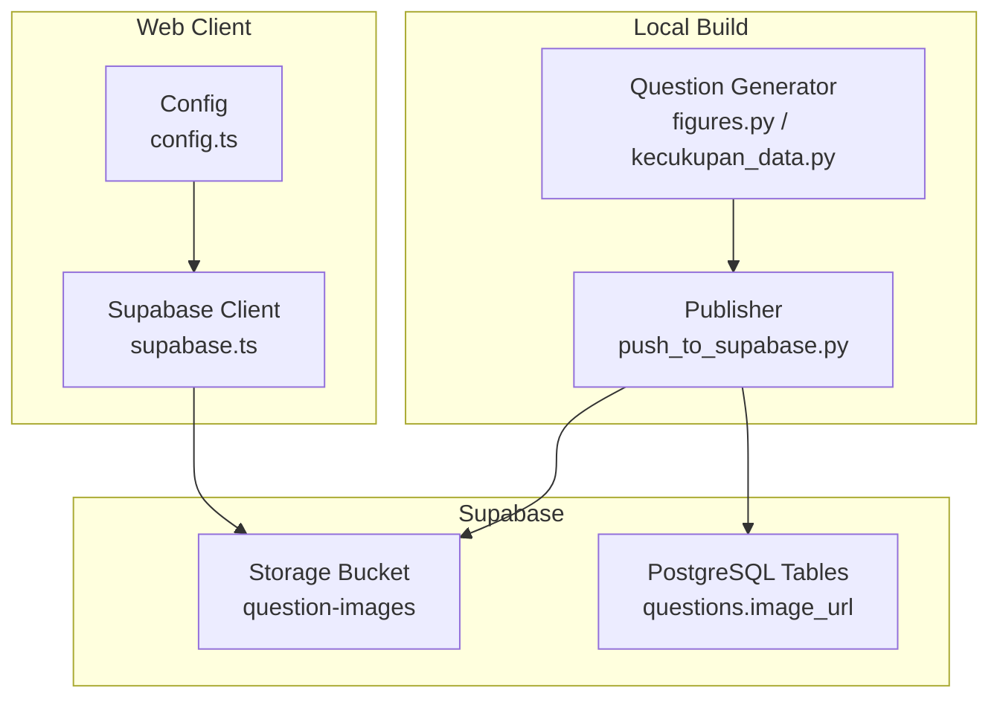
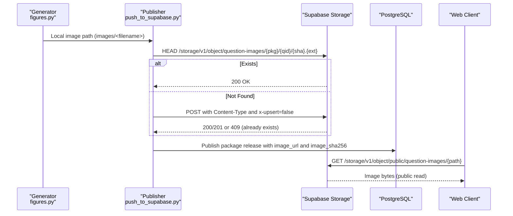
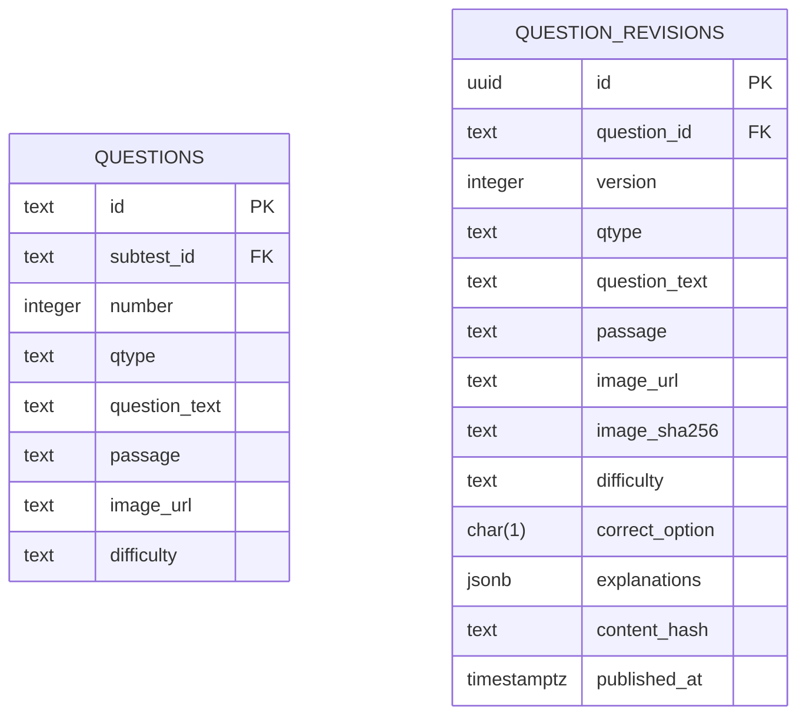
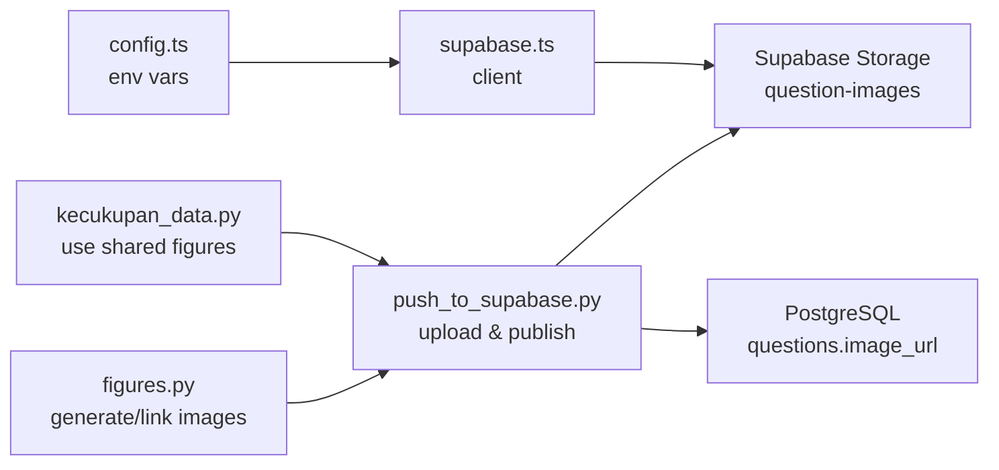

# Storage API

<cite>
**Referenced Files in This Document**
- [schema.sql](file://supabase/schema.sql)
- [push_to_supabase.py](file://questions/generator/push_to_supabase.py)
- [config.ts](file://web/src/lib/config.ts)
- [supabase.ts](file://web/src/lib/supabase.ts)
- [figures.py](file://questions/generator/figures.py)
- [kecukupan_data.py](file://questions/generator/kecukupan_data.py)
- [schema_v3.sql](file://supabase/schema_v3.sql)
</cite>

## Table of Contents
1. [Introduction](#introduction)
2. [Project Structure](#project-structure)
3. [Core Components](#core-components)
4. [Architecture Overview](#architecture-overview)
5. [Detailed Component Analysis](#detailed-component-analysis)
6. [Dependency Analysis](#dependency-analysis)
7. [Performance Considerations](#performance-considerations)
8. [Troubleshooting Guide](#troubleshooting-guide)
9. [Conclusion](#conclusion)
10. [Appendices](#appendices)

## Introduction
This document describes the storage API for question images and assets in the TBS LPDP Try Out system. It focuses on the “question-images” storage bucket, file upload procedures, download endpoints, access control policies, naming conventions, metadata handling, CDN integration, schema, retention considerations, backup guidance, and performance optimization techniques for serving large numbers of images efficiently.

The system uses Supabase Storage with a public-read policy for the “question-images” bucket. Images are uploaded via a content-addressed scheme driven by SHA-256 hashes to ensure immutability and deduplication. The web client reads images through public URLs exposed by Supabase’s storage object endpoint, which can be served via CDN depending on your hosting configuration.

## Project Structure
Key areas relevant to storage:
- Supabase schema defines the “question-images” bucket and public read policy.
- A Python publisher uploads images to Supabase Storage using content addressing and returns public URLs embedded into question payloads.
- The web app configures the Supabase client and environment variables for URL and keys.
- Question generation utilities create or link image files within local packages before publishing.

**Diagram sources**
- [schema.sql:659-672](file://supabase/schema.sql#L659-L672)
- [push_to_supabase.py:69-105](file://questions/generator/push_to_supabase.py#L69-L105)
- [figures.py:1066-1085](file://questions/generator/figures.py#L1066-L1085)
- [config.ts:22-31](file://web/src/lib/config.ts#L22-L31)
- [supabase.ts:9-13](file://web/src/lib/supabase.ts#L9-L13)

**Section sources**
- [schema.sql:659-672](file://supabase/schema.sql#L659-L672)
- [push_to_supabase.py:69-105](file://questions/generator/push_to_supabase.py#L69-L105)
- [config.ts:22-31](file://web/src/lib/config.ts#L22-L31)
- [supabase.ts:9-13](file://web/src/lib/supabase.ts#L9-L13)
- [figures.py:1066-1085](file://questions/generator/figures.py#L1066-L1085)

## Core Components
- Storage bucket: “question-images”, created as public-read.
- Upload pipeline: Content-addressed upload using SHA-256; HEAD then POST with x-upsert=false; reuse if already exists.
- Public download endpoint: /storage/v1/object/public/question-images/{object_path}.
- Metadata: Image content hash (image_sha256) stored alongside image_url in question records; MIME type inferred from filename during upload.
- Access control: Public read policy allows anonymous and authenticated users to read objects in the bucket.
- CDN: Not explicitly configured in this repository; depends on Supabase project settings and hosting provider.

**Section sources**
- [schema.sql:659-672](file://supabase/schema.sql#L659-L672)
- [push_to_supabase.py:69-105](file://questions/generator/push_to_supabase.py#L69-L105)
- [push_to_supabase.py:168-186](file://questions/generator/push_to_supabase.py#L168-L186)
- [schema_v3.sql:58-76](file://supabase/schema_v3.sql#L58-L76)

## Architecture Overview
End-to-end flow for uploading and serving question images:

**Diagram sources**
- [push_to_supabase.py:77-105](file://questions/generator/push_to_supabase.py#L77-L105)
- [push_to_supabase.py:168-186](file://questions/generator/push_to_supabase.py#L168-L186)
- [schema.sql:659-672](file://supabase/schema.sql#L659-L672)

## Detailed Component Analysis

### Storage Bucket and Access Control
- Bucket creation and public flag are enforced idempotently.
- A storage policy grants SELECT to anon and authenticated roles for the “question-images” bucket.
- This enables direct browser downloads via the public object endpoint without authentication.

Operational notes:
- If DDL is restricted, the same policy can be created via the Storage dashboard.
- Only read access is granted; write operations require service role credentials used by the publisher.

**Section sources**
- [schema.sql:659-672](file://supabase/schema.sql#L659-L672)

### Upload Procedure and File Naming
- Content addressing: Each image is stored at a path derived from its SHA-256 digest, ensuring immutability and deduplication across packages and questions.
- Object path format: {package_id}/{question_id}/{sha256}{extension}.
- Upload logic:
  - Compute SHA-256 of the file.
  - Probe existence with HEAD; reuse if present.
  - POST with correct Content-Type and x-upsert=false to prevent accidental overwrites.
  - Handle 409 Conflict as “already exists” due to concurrent publishers.
- MIME type detection: Inferred from filename suffix; falls back to application/octet-stream.

Examples:
- Uploading a new image:
  - Ensure the image exists under the package’s images directory.
  - Run the publisher; it will compute the hash, upload if missing, and return a public URL.
- Reusing an existing image:
  - If the same bytes exist, the publisher reuses the object and returns the same public URL.

**Section sources**
- [push_to_supabase.py:61-66](file://questions/generator/push_to_supabase.py#L61-L66)
- [push_to_supabase.py:77-105](file://questions/generator/push_to_supabase.py#L77-L105)
- [push_to_supabase.py:168-186](file://questions/generator/push_to_supabase.py#L168-L186)

### Metadata Handling
- image_url: Stores the public URL to the image asset in the question record.
- image_sha256: Stores the SHA-256 hash of the image content for integrity and caching strategies.
- Canonical hashing: The publisher computes a canonical hash of question content including image_sha256 to detect changes and version releases.

Schema references:
- Questions table includes image_url.
- Question revisions include image_url and image_sha256 with constraints.

**Section sources**
- [schema.sql:37-47](file://supabase/schema.sql#L37-L47)
- [schema_v3.sql:58-76](file://supabase/schema_v3.sql#L58-L76)
- [push_to_supabase.py:168-219](file://questions/generator/push_to_supabase.py#L168-L219)

### Download Endpoints and CDN Integration
- Public download endpoint pattern: /storage/v1/object/public/question-images/{object_path}.
- The web client does not need authentication to fetch images because of the public read policy.
- CDN behavior:
  - Not explicitly configured in this repository.
  - Depends on Supabase project settings and hosting provider.
  - For optimal delivery, enable CDN caching for static assets and set appropriate cache headers at the platform level.

**Section sources**
- [schema.sql:659-672](file://supabase/schema.sql#L659-L672)
- [push_to_supabase.py:71-74](file://questions/generator/push_to_supabase.py#L71-L74)

### File Permissions and Management
- Read permissions: Public for all users via storage policy.
- Write permissions: Restricted to service role credentials used by the publisher script.
- Deletion and updates:
  - Not implemented in this repository; recommended to use immutable content-addressed paths and avoid overwriting.
  - To remove an image, delete the object via service role APIs or dashboard.
- Auditability:
  - image_sha256 provides verifiable integrity.
  - Package releases capture content hashes for traceability.

**Section sources**
- [schema.sql:659-672](file://supabase/schema.sql#L659-L672)
- [push_to_supabase.py:69-105](file://questions/generator/push_to_supabase.py#L69-L105)
- [schema_v3.sql:85-102](file://supabase/schema_v3.sql#L85-L102)

### Schema and Data Model
- Storage bucket “question-images” is created and marked public.
- Questions store image_url; revisions store image_url and image_sha256.
- Constraints ensure valid difficulty levels and option sets; image_sha256 must be 64 hex characters when present.

**Diagram sources**
- [schema.sql:37-47](file://supabase/schema.sql#L37-L47)
- [schema_v3.sql:58-76](file://supabase/schema_v3.sql#L58-L76)

**Section sources**
- [schema.sql:37-47](file://supabase/schema.sql#L37-L47)
- [schema_v3.sql:58-76](file://supabase/schema_v3.sql#L58-L76)

### Retention Policies and Backup Procedures
- Retention:
  - No explicit retention policy for storage objects is defined in this repository.
  - Recommended practice: Keep immutable content-addressed objects indefinitely; rely on image_sha256 to manage lifecycle.
- Backup:
  - Back up PostgreSQL data regularly (packages, questions, revisions).
  - Back up storage buckets separately if supported by your hosting provider.
  - Use consistent snapshots to ensure database and storage consistency.

[No sources needed since this section provides general guidance]

### Performance Optimization Techniques
- Content addressing reduces duplicate uploads and improves cache hit rates.
- Public read policy eliminates auth overhead for image downloads.
- CDN integration (platform-level):
  - Enable caching for static assets.
  - Set long-lived cache headers for immutable content-addressed paths.
- Browser caching:
  - Leverage immutable URLs to allow aggressive caching.
- Concurrency:
  - Publisher handles 409 conflicts gracefully; safe for parallel runs.

[No sources needed since this section provides general guidance]

## Dependency Analysis
Relationships between components involved in storage:

**Diagram sources**
- [figures.py:1066-1085](file://questions/generator/figures.py#L1066-L1085)
- [kecukupan_data.py:858-884](file://questions/generator/kecukupan_data.py#L858-L884)
- [push_to_supabase.py:69-105](file://questions/generator/push_to_supabase.py#L69-L105)
- [config.ts:22-31](file://web/src/lib/config.ts#L22-L31)
- [supabase.ts:9-13](file://web/src/lib/supabase.ts#L9-L13)

**Section sources**
- [figures.py:1066-1085](file://questions/generator/figures.py#L1066-L1085)
- [kecukupan_data.py:858-884](file://questions/generator/kecukupan_data.py#L858-L884)
- [push_to_supabase.py:69-105](file://questions/generator/push_to_supabase.py#L69-L105)
- [config.ts:22-31](file://web/src/lib/config.ts#L22-L31)
- [supabase.ts:9-13](file://web/src/lib/supabase.ts#L9-L13)

## Performance Considerations
- Prefer content-addressed paths to maximize cache efficiency and avoid redundant transfers.
- Use public read policy to minimize latency and complexity for clients.
- Configure CDN caching for immutable assets to reduce origin requests.
- Monitor upload concurrency; the publisher safely handles conflicts.

[No sources needed since this section provides general guidance]

## Troubleshooting Guide
Common issues and resolutions:
- Upload fails with unexpected HTTP status:
  - Check network connectivity and credentials.
  - Verify Content-Type and x-upsert header usage.
- Concurrent upload conflict (409):
  - Expected behavior; treat as success and reuse the existing object.
- Missing image file:
  - Ensure the generator has produced the image under the package’s images directory before publishing.
- Public access denied:
  - Confirm the storage policy allows SELECT for anon and authenticated roles on the “question-images” bucket.

**Section sources**
- [push_to_supabase.py:77-105](file://questions/generator/push_to_supabase.py#L77-L105)
- [schema.sql:659-672](file://supabase/schema.sql#L659-L672)

## Conclusion
The TBS LPDP Try Out system stores question images in a public-read Supabase bucket using content addressing for immutability and deduplication. The publisher uploads images, embeds public URLs and content hashes into question records, and the web client retrieves images directly via public endpoints. While CDN configuration is not defined in this repository, leveraging CDN caching for immutable content-addressed paths is recommended for optimal performance. Adhering to the naming conventions and metadata practices ensures reliable, scalable asset delivery.

[No sources needed since this section summarizes without analyzing specific files]

## Appendices

### Example Workflows

#### Uploading a New Question Image
- Generate or place the image in the package’s images directory.
- Run the publisher; it will compute the SHA-256, upload if missing, and return a public URL.
- The image_url and image_sha256 are included in the published payload.

**Section sources**
- [figures.py:1066-1085](file://questions/generator/figures.py#L1066-L1085)
- [push_to_supabase.py:168-186](file://questions/generator/push_to_supabase.py#L168-L186)

#### Accessing Stored Assets
- Construct the public URL: /storage/v1/object/public/question-images/{package_id}/{question_id}/{sha256}{extension}.
- No authentication required due to public read policy.

**Section sources**
- [schema.sql:659-672](file://supabase/schema.sql#L659-L672)
- [push_to_supabase.py:71-74](file://questions/generator/push_to_supabase.py#L71-L74)

#### Managing File Permissions
- Read: Public via storage policy.
- Write: Service role credentials only (publisher).
- Deletion: Use service role APIs or dashboard; prefer immutability by avoiding overwrites.

**Section sources**
- [schema.sql:659-672](file://supabase/schema.sql#L659-L672)
- [push_to_supabase.py:69-105](file://questions/generator/push_to_supabase.py#L69-L105)