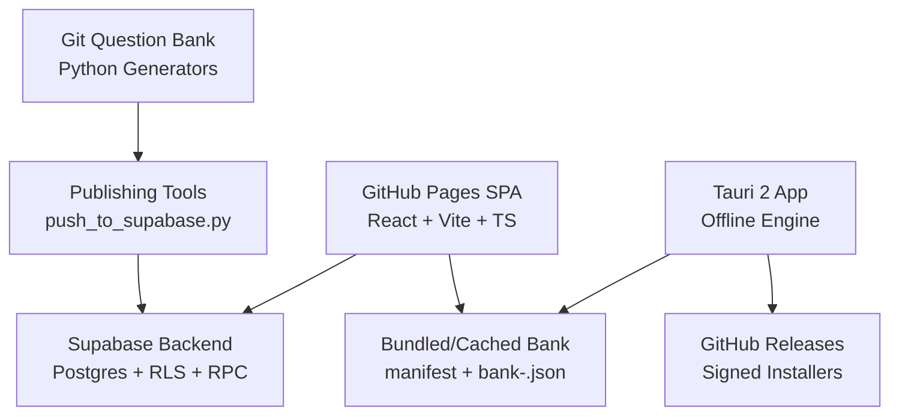
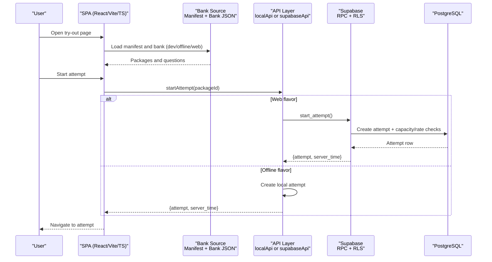
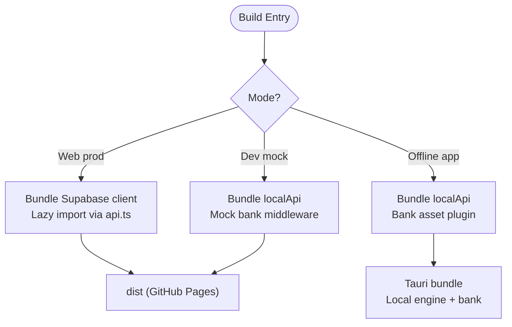
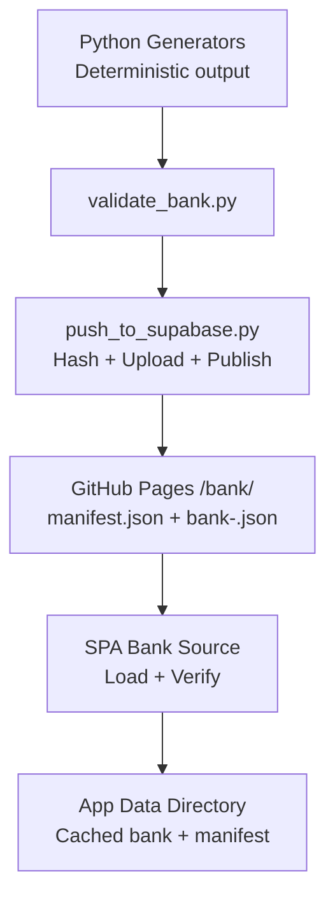
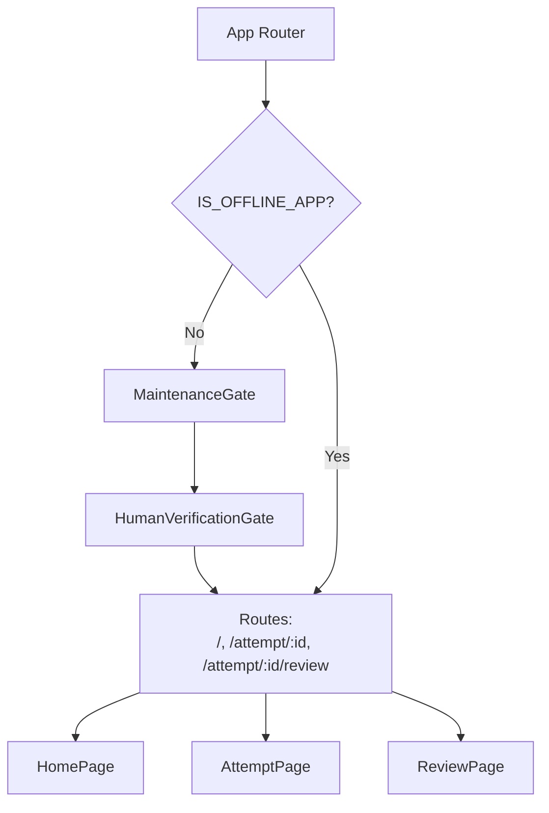
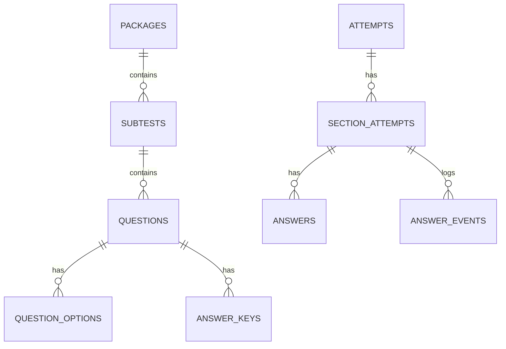
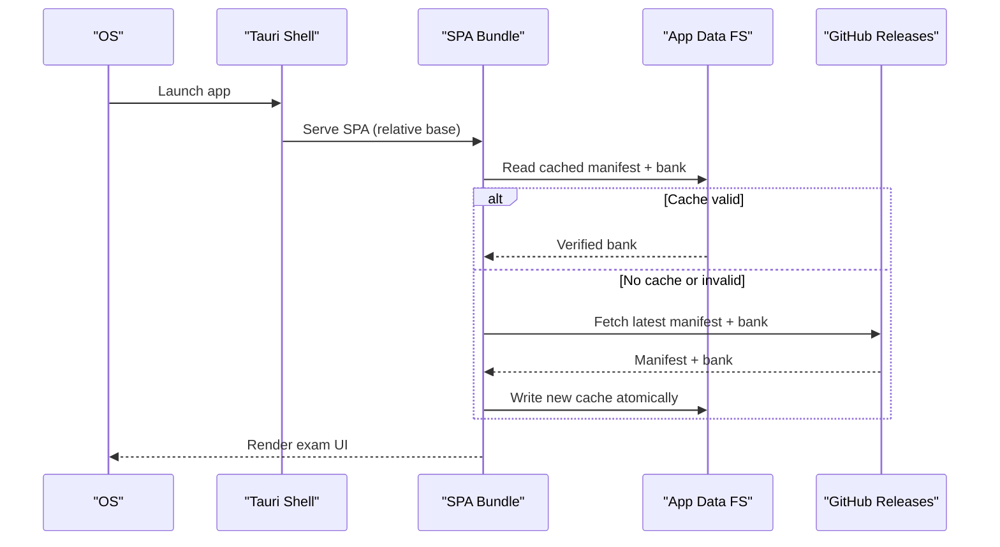
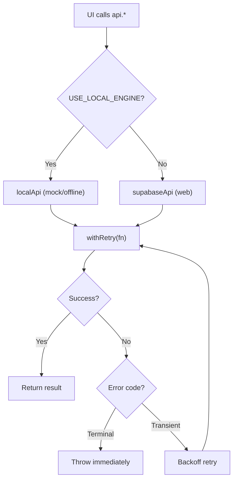
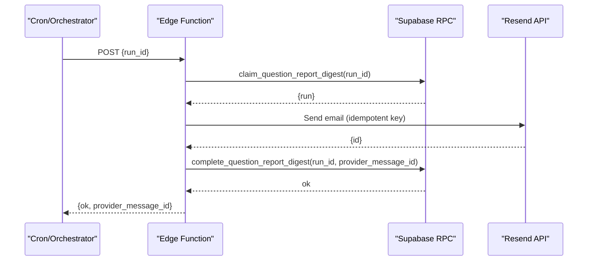
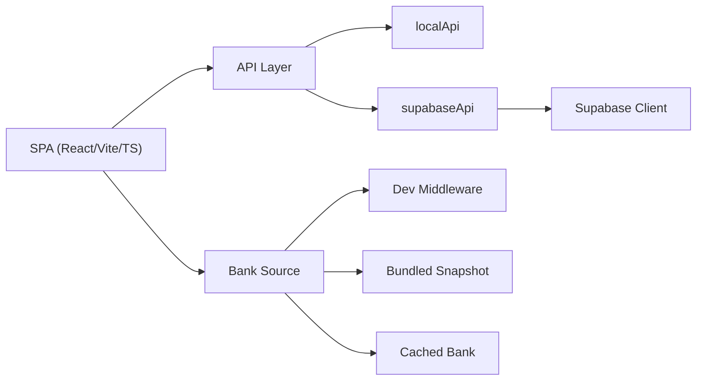

# Architecture Overview

<cite>
**Referenced Files in This Document**
- [README.md](file://README.md)
- [package.json](file://web/package.json)
- [vite.config.ts](file://web/vite.config.ts)
- [config.ts](file://web/src/lib/config.ts)
- [api.ts](file://web/src/lib/api.ts)
- [supabase.ts](file://web/src/lib/supabase.ts)
- [bankSource.ts](file://web/src/lib/bankSource.ts)
- [App.tsx](file://web/src/App.tsx)
- [HomePage.tsx](file://web/src/pages/HomePage.tsx)
- [tauri.conf.json](file://web/src-tauri/tauri.conf.json)
- [schema.sql](file://supabase/schema.sql)
- [config.toml](file://supabase/config.toml)
- [index.ts](file://supabase/functions/question-report-digest/index.ts)
- [README.md](file://questions/generator/README.md)
</cite>

## Table of Contents
1. [Introduction](#introduction)
2. [Project Structure](#project-structure)
3. [Core Components](#core-components)
4. [Architecture Overview](#architecture-overview)
5. [Detailed Component Analysis](#detailed-component-analysis)
6. [Dependency Analysis](#dependency-analysis)
7. [Performance Considerations](#performance-considerations)
8. [Troubleshooting Guide](#troubleshooting-guide)
9. [Conclusion](#conclusion)

## Introduction
This document describes the architecture of the TBS LPDP Try Out system, a browser-based and offline practice application for the LPDP Tes Bakat Skolastik exam. It explains how Git-hosted question banks generated by Python scripts feed a GitHub Pages SPA built with React, Vite, and TypeScript, which communicates with a Supabase backend (PostgreSQL, Row Level Security, RPC functions, anonymous authentication, storage, cron jobs, and a private edge function). It also documents the offline Tauri 2 app that bundles the same SPA with a local exam engine and bundled question bank, and clarifies the security model where trusted grading logic lives in Supabase database functions scoped to anonymous users via Row Level Security. Finally, it details build-time flavors that ensure the deployed website contains no grading engine while the app contains no Supabase credentials.

## Project Structure
The repository is organized into four main areas:
- questions: versioned question packages and deterministic Python generators that produce content and answer keys.
- supabase: database schema, migrations, RLS policies, RPC functions, storage configuration, cron maintenance, and a private edge function for report digests.
- web: the single codebase for both the GitHub Pages SPA and the Tauri 2 offline app, using React, Vite, and TypeScript. Build modes select between mock/local and Supabase backends at compile time.
- exambrowser-ui and docs: reference UI and operational requirements.

**Diagram sources**
- [README.md:40-70](file://README.md#L40-L70)
- [vite.config.ts:10-17](file://web/vite.config.ts#L10-L17)
- [bankSource.ts:20-32](file://web/src/lib/bankSource.ts#L20-L32)
- [tauri.conf.json:37-96](file://web/src-tauri/tauri.conf.json#L37-L96)

**Section sources**
- [README.md:87-101](file://README.md#L87-L101)
- [package.json:9-22](file://web/package.json#L9-L22)

## Core Components
- Question bank and generators: Deterministic Python scripts generate questions, figures, and answer keys; validation and publishing tools create immutable releases.
- Web SPA: A single React/Vite/TypeScript codebase that builds three flavors:
  - Production web: connects to Supabase, uses server-side grading, never includes answer keys or grading engine.
  - Dev mock: runs entirely locally with a mock bank source and local grading.
  - Offline app: bundles a verified question bank snapshot and performs local grading without Supabase credentials.
- Supabase backend: PostgreSQL with RLS scoping attempt data to anonymous users; RPCs implement start_attempt, start_section, save_answer, toggle_doubt, finish_section, get_attempt_state, get_review, and service status; storage bucket for images; cron for maintenance; private edge function for report digest delivery.
- Tauri 2 app: Wraps the SPA, provides an updater, and persists a verified cached bank in the app data directory.

**Section sources**
- [README.md:40-70](file://README.md#L40-L70)
- [vite.config.ts:10-17](file://web/vite.config.ts#L10-L17)
- [config.ts:11-43](file://web/src/lib/config.ts#L11-L43)
- [api.ts:3-12](file://web/src/lib/api.ts#L3-L12)
- [schema.sql:16-142](file://supabase/schema.sql#L16-L142)
- [index.ts:14-58](file://supabase/functions/question-report-digest/index.ts#L14-L58)

## Architecture Overview
The system separates content authoring from runtime execution:
- Content pipeline: Git holds question packages; Python generators compute deterministic answers and explanations; publishing tools upload content-addressed assets and publish immutable release manifests.
- Runtime pipeline: The SPA loads either a remote bank manifest and bank artifact (for updates) or a bundled/cached bank (offline), then starts attempts through Supabase RPCs or a local API depending on flavor. Grading and deadlines are enforced server-side on the web; the offline app grades locally because it must work without network access.
- Security: On the web, only anonymous identities can interact; RLS ensures users see only their own attempts; answer keys are never exposed to clients during active sections; capacity guards and rate limits protect free-tier resources.

**Diagram sources**
- [api.ts:38-68](file://web/src/lib/api.ts#L38-L68)
- [bankSource.ts:199-242](file://web/src/lib/bankSource.ts#L199-L242)
- [schema.sql:341-389](file://supabase/schema.sql#L341-L389)

## Detailed Component Analysis

### Build Flavors and Compile-Time Selection
Vite defines environment literals so Rollup can drop dead branches per flavor:
- Web production: uses Supabase client chunk lazily; no local grading engine or answer keys.
- Dev mock: uses local grading engine and mock bank middleware.
- Offline app: uses local grading engine and bundled/cached bank; no Supabase URL or key.

**Diagram sources**
- [vite.config.ts:10-17](file://web/vite.config.ts#L10-L17)
- [vite.config.ts:25-41](file://web/vite.config.ts#L25-L41)
- [api.ts:38-68](file://web/src/lib/api.ts#L38-L68)
- [config.ts:11-43](file://web/src/lib/config.ts#L11-L43)

**Section sources**
- [vite.config.ts:10-17](file://web/vite.config.ts#L10-L17)
- [vite.config.ts:25-41](file://web/vite.config.ts#L25-L41)
- [api.ts:3-12](file://web/src/lib/api.ts#L3-L12)
- [config.ts:11-43](file://web/src/lib/config.ts#L11-L43)

### Question Bank Pipeline
- Generators: Deterministic scripts produce questions, options, figures, and answer keys; validation ensures integrity before review/publish.
- Publishing: push_to_supabase.py validates and hashes a package, uploads content-addressed images, and publishes an immutable release manifest and bank artifact to GitHub Pages.
- Consumption: The SPA reads manifest.json and bank-<digest>.json; the offline app verifies SHA-256 against the manifest and caches the bank in the app data directory.

**Diagram sources**
- [README.md:40-70](file://README.md#L40-L70)
- [README.md:87-101](file://README.md#L87-L101)
- [bankSource.ts:79-94](file://web/src/lib/bankSource.ts#L79-L94)
- [bankSource.ts:206-242](file://web/src/lib/bankSource.ts#L206-L242)
- [bankSource.ts:267-311](file://web/src/lib/bankSource.ts#L267-L311)

**Section sources**
- [README.md:40-70](file://README.md#L40-L70)
- [README.md:87-101](file://README.md#L87-L101)
- [bankSource.ts:79-94](file://web/src/lib/bankSource.ts#L79-L94)
- [bankSource.ts:206-242](file://web/src/lib/bankSource.ts#L206-L242)
- [bankSource.ts:267-311](file://web/src/lib/bankSource.ts#L267-L311)

### Web SPA Routing and Gating
- HashRouter avoids deep-link 404s on GitHub Pages and keeps routes host-agnostic for Tauri.
- MaintenanceGate and HumanVerificationGate wrap routes for web builds; they are folded away in offline builds.
- UpdateControls appear only in the offline app; DownloadApp appears only on the web.

**Diagram sources**
- [App.tsx:23-36](file://web/src/App.tsx#L23-L36)
- [App.tsx:38-63](file://web/src/App.tsx#L38-L63)

**Section sources**
- [App.tsx:23-36](file://web/src/App.tsx#L23-L36)
- [App.tsx:38-63](file://web/src/App.tsx#L38-L63)

### Supabase Backend: Schema, RLS, and RPCs
- Tables: packages, subtests, questions, question_options, answer_keys, attempts, section_attempts, answers, answer_events, service_capacity.
- RLS: Published content readable; attempt data scoped to current user via auth.uid(); answer_keys has no client policy.
- RPCs: start_attempt, start_section, save_answer, toggle_doubt, finish_section, get_attempt_state, get_review, get_service_status; helpers _grade_section, _log_event, _refresh_capacity, _capacity, _assert_active_section.
- Storage: Public bucket for question images.
- Cron: Maintains capacity snapshots and retention.

**Diagram sources**
- [schema.sql:16-142](file://supabase/schema.sql#L16-L142)

**Section sources**
- [schema.sql:16-142](file://supabase/schema.sql#L16-L142)
- [schema.sql:185-337](file://supabase/schema.sql#L185-L337)
- [schema.sql:341-657](file://supabase/schema.sql#L341-L657)
- [schema.sql:659-672](file://supabase/schema.sql#L659-L672)

### Offline App: Tauri 2 Bundling and Updater
- Tauri config sets product name, window size, CSP, bundling targets, and updater endpoints with public minisign key.
- The SPA is built with mode app; base path is relative for webview hosting.
- Bank source uses a persistent store in the app data directory; verification via SHA-256 against manifest.

**Diagram sources**
- [tauri.conf.json:6-11](file://web/src-tauri/tauri.conf.json#L6-L11)
- [tauri.conf.json:26-35](file://web/src-tauri/tauri.conf.json#L26-L35)
- [tauri.conf.json:37-96](file://web/src-tauri/tauri.conf.json#L37-L96)
- [bankSource.ts:153-197](file://web/src/lib/bankSource.ts#L153-L197)
- [bankSource.ts:206-242](file://web/src/lib/bankSource.ts#L206-L242)

**Section sources**
- [tauri.conf.json:6-11](file://web/src-tauri/tauri.conf.json#L6-L11)
- [tauri.conf.json:26-35](file://web/src-tauri/tauri.conf.json#L26-L35)
- [tauri.conf.json:37-96](file://web/src-tauri/tauri.conf.json#L37-L96)
- [bankSource.ts:153-197](file://web/src/lib/bankSource.ts#L153-L197)
- [bankSource.ts:206-242](file://web/src/lib/bankSource.ts#L206-L242)

### API Layer and Error Handling
- Lazy selection between localApi and supabaseApi based on build-time flags.
- Retry wrapper with exponential backoff for transient errors; terminal error codes short-circuit retries.
- Error messages mapped to user-friendly notices on HomePage.

**Diagram sources**
- [api.ts:38-68](file://web/src/lib/api.ts#L38-L68)
- [api.ts:97-122](file://web/src/lib/api.ts#L97-L122)
- [HomePage.tsx:24-42](file://web/src/pages/HomePage.tsx#L24-L42)

**Section sources**
- [api.ts:38-68](file://web/src/lib/api.ts#L38-L68)
- [api.ts:97-122](file://web/src/lib/api.ts#L97-L122)
- [HomePage.tsx:24-42](file://web/src/pages/HomePage.tsx#L24-L42)

### Private Edge Function: Question Report Digest
- Endpoint secured by automation API key; claims a digest run, renders HTML/text, sends via Resend, marks complete or fails with idempotency.
- Configuration via environment variables; admin key used to call Supabase RPCs for state transitions.

**Diagram sources**
- [index.ts:14-58](file://supabase/functions/question-report-digest/index.ts#L14-L58)
- [index.ts:60-118](file://supabase/functions/question-report-digest/index.ts#L60-L118)

**Section sources**
- [index.ts:14-58](file://supabase/functions/question-report-digest/index.ts#L14-L58)
- [index.ts:60-118](file://supabase/functions/question-report-digest/index.ts#L60-L118)

## Dependency Analysis
- Frontend dependencies: React, React Router DOM, Supabase JS (lazy-loaded), Tauri plugins (only in app mode).
- Build-time dependencies: Vite, TypeScript, React plugin; bank asset and mock plugins conditionally included.
- Backend dependencies: Supabase Postgres, Auth (anonymous), Storage, Cron, Edge Functions.
- Coupling: SPA depends on API layer abstraction; API layer decouples local vs remote implementations; bank source abstracts dev, bundled, and cached origins; Supabase schema centralizes business rules via RPCs and RLS.

**Diagram sources**
- [api.ts:38-68](file://web/src/lib/api.ts#L38-L68)
- [bankSource.ts:199-242](file://web/src/lib/bankSource.ts#L199-L242)
- [supabase.ts:1-14](file://web/src/lib/supabase.ts#L1-L14)

**Section sources**
- [package.json:24-44](file://web/package.json#L24-L44)
- [api.ts:38-68](file://web/src/lib/api.ts#L38-L68)
- [bankSource.ts:199-242](file://web/src/lib/bankSource.ts#L199-L242)
- [supabase.ts:1-14](file://web/src/lib/supabase.ts#L1-L14)

## Performance Considerations
- Lazy loading: Supabase client library is dynamically imported behind feature flags to avoid bundling in offline builds.
- Capacity protection: Service capacity RPC measures database size and attempt rows; global and per-user limits prevent runaway growth.
- Event log capping: Answer events capped per section to bound storage usage.
- Bank verification: SHA-256 verification prevents corrupted or tampered banks from being used.
- HMR and reload guard: Chunk load failures trigger a one-time reload to recover from deployment mismatches.

[No sources needed since this section provides general guidance]

## Troubleshooting Guide
- Not authenticated: Ensure anonymous sign-in is enabled and Turnstile verification succeeds when required.
- Package not found or unpublished: Confirm the package is published and visible in the bank manifest.
- Section already finished or deadline passed: Check section status and server time; auto-grading occurs past deadlines.
- Too many attempts: Respect hourly per-user limit; resume existing attempts instead of creating new ones.
- Storage capacity reached: New attempts are blocked until retention clears old data; existing attempts remain resumable.
- Bank update issues: If refresh returns app-outdated, update the app; if offline, rely on bundled bank.

**Section sources**
- [schema.sql:341-389](file://supabase/schema.sql#L341-L389)
- [schema.sql:417-493](file://supabase/schema.sql#L417-L493)
- [schema.sql:495-580](file://supabase/schema.sql#L495-L580)
- [HomePage.tsx:24-42](file://web/src/pages/HomePage.tsx#L24-L42)
- [bankSource.ts:267-311](file://web/src/lib/bankSource.ts#L267-L311)

## Conclusion
The TBS LPDP Try Out system cleanly separates content authoring from runtime execution, enforces trusted grading server-side on the web, and supports fully offline operation via a Tauri 2 app. Build-time flavor selection guarantees that each deployment contains only what it needs: the website excludes grading engines and answer keys, while the app excludes Supabase credentials. Row Level Security and RPCs provide a secure, scalable backend, and the question bank pipeline ensures immutable, verifiable releases. This design balances usability, security, and reliability across web and offline experiences.