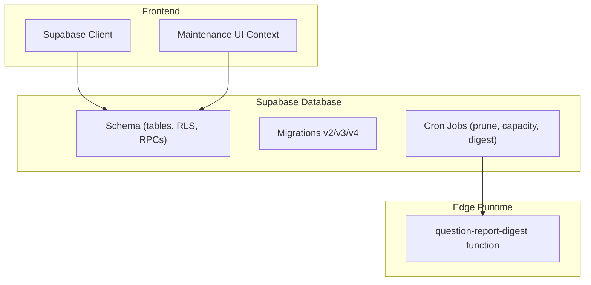
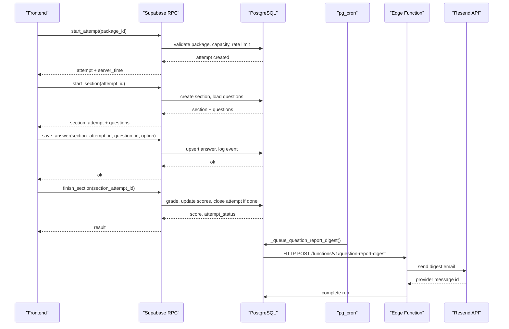
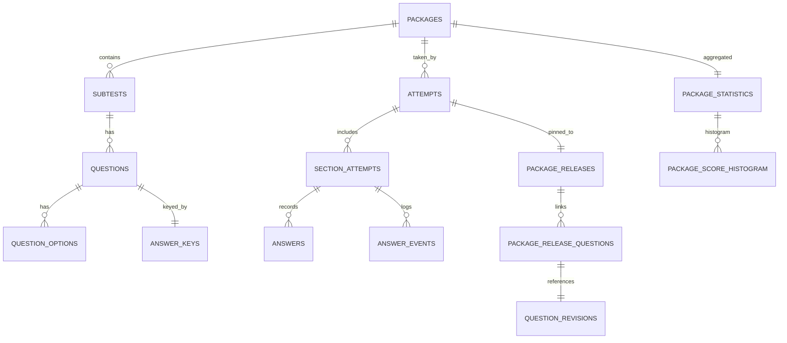
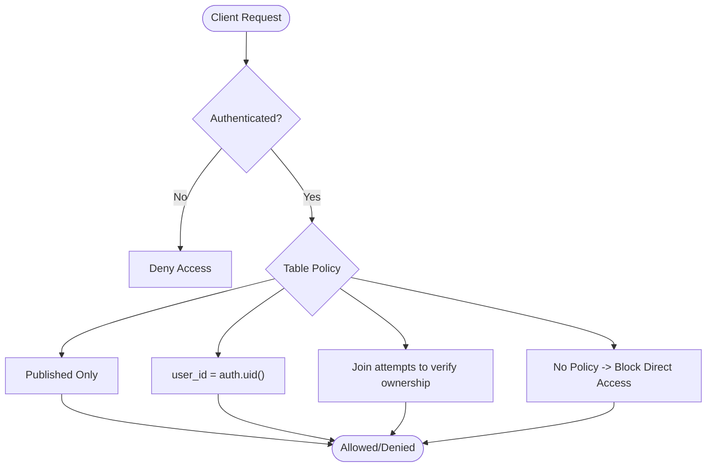
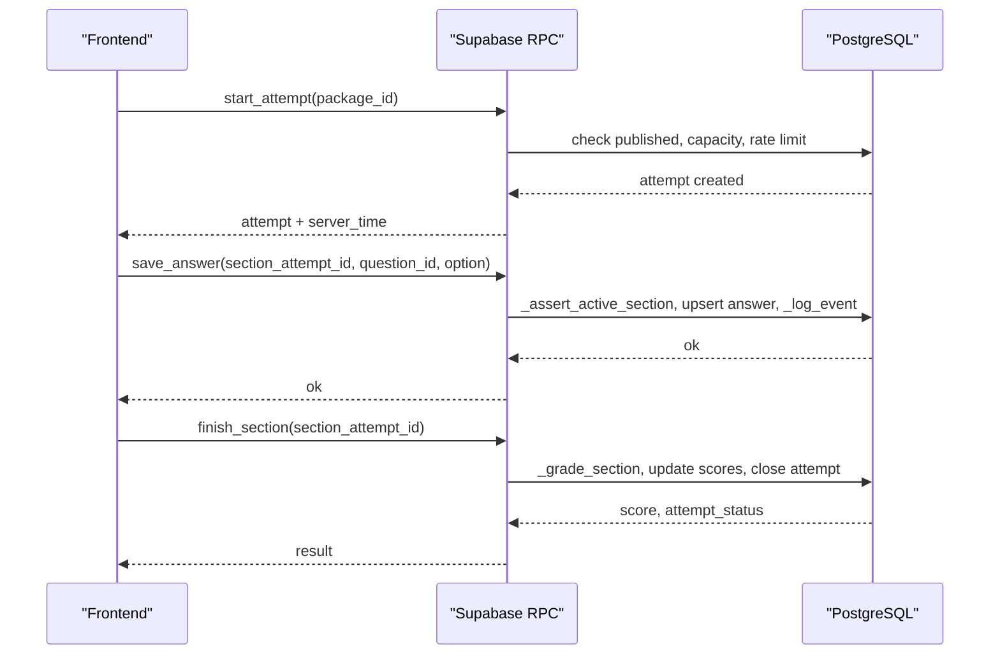
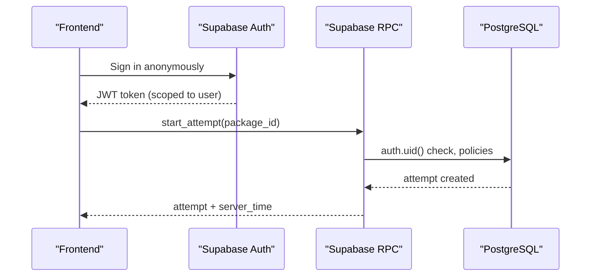
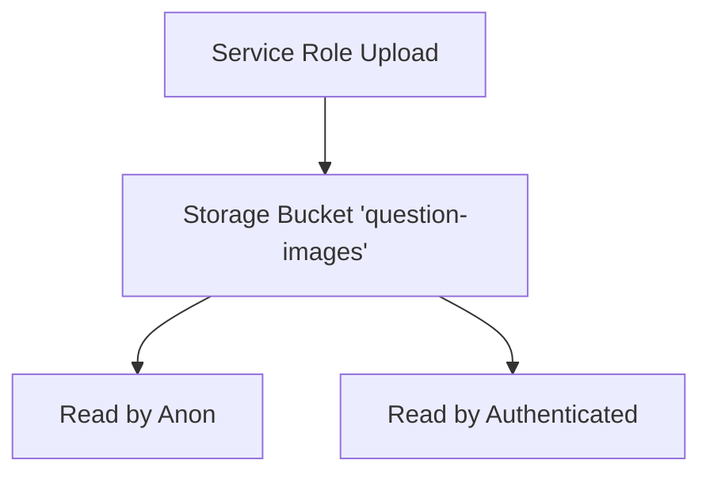
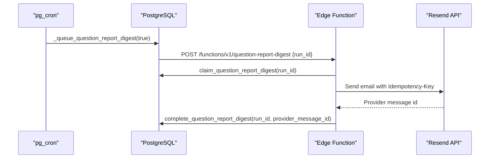
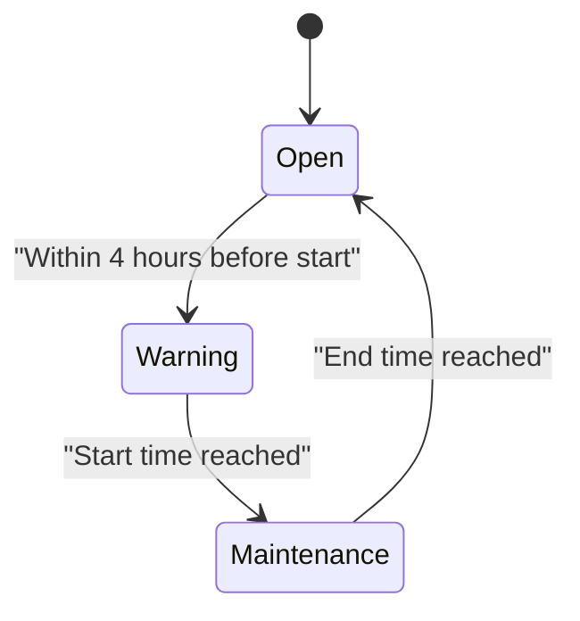
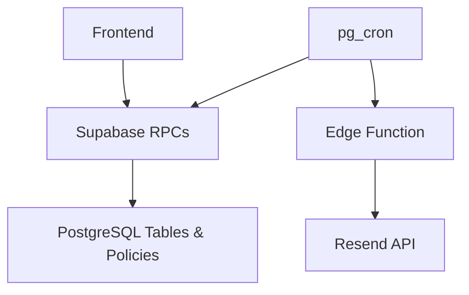

# Backend Architecture

<cite>
**Referenced Files in This Document**
- [schema.sql](file://supabase/schema.sql)
- [schema_v3.sql](file://supabase/schema_v3.sql)
- [schema_v4_maintenance_mode.sql](file://supabase/schema_v4_maintenance_mode.sql)
- [maintenance.sql](file://supabase/maintenance.sql)
- [config.toml](file://supabase/config.toml)
- [index.ts](file://supabase/functions/question-report-digest/index.ts)
- [supabase.ts](file://web/src/lib/supabase.ts)
- [config.ts](file://web/src/lib/config.ts)
- [MaintenanceContext.ts](file://web/src/contexts/MaintenanceContext.ts)
</cite>

## Table of Contents
1. Introduction
2. Project Structure
3. Core Components
4. Architecture Overview
5. Detailed Component Analysis
6. Dependency Analysis
7. Performance Considerations
8. Troubleshooting Guide
9. Conclusion

## Introduction
This document describes the backend architecture for a Supabase-powered exam system. It covers the PostgreSQL schema, Row Level Security (RLS), server-side RPCs that enforce trusted exam logic, anonymous authentication with JWT scoping, storage access controls for question assets, background processing via Edge Functions and cron jobs, database migrations, indexing strategies, performance considerations, and the maintenance mode system.

## Project Structure
The backend is defined primarily in SQL migrations under supabase/, with operational scheduling in maintenance.sql and an Edge Function for email digest generation. The frontend integrates with Supabase using a client configured in web/src/lib.

**Diagram sources**
- [schema.sql:16-142](file://supabase/schema.sql#L16-L142)
- [schema_v3.sql:14-183](file://supabase/schema_v3.sql#L14-L183)
- [schema_v4_maintenance_mode.sql:15-63](file://supabase/schema_v4_maintenance_mode.sql#L15-L63)
- [maintenance.sql:18-51](file://supabase/maintenance.sql#L18-L51)
- [index.ts:27-118](file://supabase/functions/question-report-digest/index.ts#L27-L118)
- [supabase.ts:9-13](file://web/src/lib/supabase.ts#L9-L13)
- [MaintenanceContext.ts:1-25](file://web/src/contexts/MaintenanceContext.ts#L1-L25)

**Section sources**
- [schema.sql:16-142](file://supabase/schema.sql#L16-L142)
- [schema_v3.sql:14-183](file://supabase/schema_v3.sql#L14-L183)
- [schema_v4_maintenance_mode.sql:15-63](file://supabase/schema_v4_maintenance_mode.sql#L15-L63)
- [maintenance.sql:18-51](file://supabase/maintenance.sql#L18-L51)
- [index.ts:27-118](file://supabase/functions/question-report-digest/index.ts#L27-L118)
- [supabase.ts:9-13](file://web/src/lib/supabase.ts#L9-L13)
- [MaintenanceContext.ts:1-25](file://web/src/contexts/MaintenanceContext.ts#L1-L25)

## Core Components
- Data model: packages, subtests, questions, options, answer keys, attempts, section_attempts, answers, answer_events, service_capacity, plus v3 tables for immutable releases and statistics, and v4 maintenance mode table.
- Security: RLS policies restrict data to published content and per-user attempt data; sensitive tables like answer_keys have no client policy.
- Trusted logic: All mutations go through RPCs that validate ownership, deadlines, and business rules.
- Storage: Public bucket for question images with read access for anon/authenticated roles.
- Background jobs: pg_cron schedules prune attempts, refresh capacity snapshots, and queue daily report digests.
- Edge Function: question-report-digest renders and sends emails via Resend with idempotency and error handling.
- Frontend integration: Supabase client configured with anonymous auth and auto-refresh; maintenance status exposed via RPC.

**Section sources**
- [schema.sql:16-142](file://supabase/schema.sql#L16-L142)
- [schema_v3.sql:185-288](file://supabase/schema_v3.sql#L185-L288)
- [schema_v4_maintenance_mode.sql:15-63](file://supabase/schema_v4_maintenance_mode.sql#L15-L63)
- [maintenance.sql:31-51](file://supabase/maintenance.sql#L31-L51)
- [index.ts:27-118](file://supabase/functions/question-report-digest/index.ts#L27-L118)
- [supabase.ts:9-13](file://web/src/lib/supabase.ts#L9-L13)

## Architecture Overview
The system enforces strict separation between client-facing reads and server-only writes. Clients authenticate anonymously and receive scoped JWTs. They call RPCs to start attempts, manage sections, save answers, toggle doubts, finish sections, and review results. Sensitive data (answer keys, explanations) are only returned by server functions after validation. Storage is public-read for question images. Cron jobs maintain data hygiene and capacity awareness. An Edge Function processes scheduled report digests.

**Diagram sources**
- [schema.sql:341-580](file://supabase/schema.sql#L341-L580)
- [schema_v3.sql:709-800](file://supabase/schema_v3.sql#L709-L800)
- [maintenance.sql:87-152](file://supabase/maintenance.sql#L87-L152)
- [index.ts:27-118](file://supabase/functions/question-report-digest/index.ts#L27-L118)

## Detailed Component Analysis

### Database Schema Design
- Core entities:
  - packages: published exam bundles with metadata and timestamps.
  - subtests: ordered sections within a package with duration and passing grade.
  - questions: items belonging to a subtest with type, text, passage, image URL, difficulty.
  - question_options: multiple-choice options per question.
  - answer_keys: correct options and explanations (no client policy).
  - attempts: user-level exam sessions with status and total score.
  - section_attempts: per-subtest progress with deadline and score.
  - answers: selected options and doubt flags per question per section attempt.
  - answer_events: append-only audit log capped per section.
  - service_capacity: project-wide storage and row limits with measured usage.
- v3 additions:
  - Immutable question_revisions and package_releases pin content versions.
  - package_release_questions link releases to specific question revisions.
  - package_statistics and package_score_histogram aggregate completion and score distribution.
  - question_report_digest_runs outbox for email delivery with idempotency.
- v4 addition:
  - site_maintenance singleton table exposes scheduled maintenance windows and phases.

**Diagram sources**
- [schema.sql:16-104](file://supabase/schema.sql#L16-L104)
- [schema_v3.sql:58-166](file://supabase/schema_v3.sql#L58-L166)
- [schema_v3.sql:185-288](file://supabase/schema_v3.sql#L185-L288)

**Section sources**
- [schema.sql:16-104](file://supabase/schema.sql#L16-L104)
- [schema_v3.sql:58-166](file://supabase/schema_v3.sql#L58-L166)
- [schema_v3.sql:185-288](file://supabase/schema_v3.sql#L185-L288)

### Row Level Security Policies
- Published content visibility:
  - packages and subtests readable when published or linked to published packages.
- User-scoped data isolation:
  - attempts, section_attempts, answers, answer_events restricted to current user via auth.uid().
- Sensitive data protection:
  - answer_keys intentionally has no client policy; only accessible through RPCs that return controlled payloads.
- Storage access:
  - question-images bucket allows select for anon and authenticated roles.

**Diagram sources**
- [schema.sql:133-181](file://supabase/schema.sql#L133-L181)
- [schema.sql:663-672](file://supabase/schema.sql#L663-L672)

**Section sources**
- [schema.sql:133-181](file://supabase/schema.sql#L133-L181)
- [schema.sql:663-672](file://supabase/schema.sql#L663-L672)

### RPC Function Architecture (Trusted Exam Logic)
- start_attempt: validates authentication, checks published package, enforces capacity and per-user hourly budget, creates attempt, updates statistics.
- start_section: sweeps expired sections, resumes active or starts next subtest, loads questions and existing answers.
- save_answer: asserts active section, validates question membership, upserts answer, logs event with cap.
- toggle_doubt: asserts active section, toggles doubt flag, logs event.
- finish_section: grades section, updates scores, closes attempt when all sections finished.
- get_attempt_state/get_review: returns user-owned attempt state and review data including correct options and explanations only for finished sections.
- get_service_status: returns capacity usage percentage and acceptance status.

**Diagram sources**
- [schema.sql:341-580](file://supabase/schema.sql#L341-L580)
- [schema_v3.sql:709-800](file://supabase/schema_v3.sql#L709-L800)

**Section sources**
- [schema.sql:341-580](file://supabase/schema.sql#L341-L580)
- [schema_v3.sql:709-800](file://supabase/schema_v3.sql#L709-L800)

### Authentication Flow (Anonymous with JWT Scoping)
- The frontend initializes a Supabase client with publishable/anonymous key and session persistence enabled.
- Anonymous sign-in issues JWT tokens scoped to each user identity.
- RPCs use auth.uid() to enforce per-user access and ensure only the owner can mutate their attempts and answers.
- Maintenance status and service status are exposed via RPCs callable by authenticated users.

**Diagram sources**
- [supabase.ts:9-13](file://web/src/lib/supabase.ts#L9-L13)
- [schema.sql:341-389](file://supabase/schema.sql#L341-L389)

**Section sources**
- [supabase.ts:9-13](file://web/src/lib/supabase.ts#L9-L13)
- [schema.sql:341-389](file://supabase/schema.sql#L341-L389)

### Storage System for Question Images and Assets
- A public bucket named question-images is created and configured for public read access.
- Both anon and authenticated roles can read objects from this bucket.
- Uploads should be performed via service role to avoid exposing write permissions to clients.

**Diagram sources**
- [schema.sql:663-672](file://supabase/schema.sql#L663-L672)

**Section sources**
- [schema.sql:663-672](file://supabase/schema.sql#L663-L672)

### Edge Functions for Background Processing
- The question-report-digest function:
  - Validates request method and apikey header against configured automation key.
  - Claims a pending or sending digest run via RPC.
  - Renders digest payload into HTML/text.
  - Sends email via Resend with idempotency key based on run ID.
  - Updates run status to sent or failed with error details.
- Configuration:
  - verify_jwt set to false for internal automation calls.
  - Secrets managed via environment variables and Vault.

**Diagram sources**
- [maintenance.sql:87-152](file://supabase/maintenance.sql#L87-L152)
- [index.ts:27-118](file://supabase/functions/question-report-digest/index.ts#L27-L118)
- [config.toml:1-5](file://supabase/config.toml#L1-L5)

**Section sources**
- [maintenance.sql:87-152](file://supabase/maintenance.sql#L87-L152)
- [index.ts:27-118](file://supabase/functions/question-report-digest/index.ts#L27-L118)
- [config.toml:1-5](file://supabase/config.toml#L1-L5)

### Database Migrations, Indexing Strategies, and Performance
- Migration order:
  - schema.sql first, then reports schema, then v3, then v4 maintenance mode, then maintenance.sql last.
- Indexes:
  - attempts_user_idx on attempts(user_id, started_at desc) for efficient per-user attempt listing.
  - answer_events_section_idx on answer_events(section_attempt_id, created_at) for event retrieval.
  - question_revisions_hash_idx on question_revisions(question_id, content_hash) for version lookups.
  - package_releases_hash_idx on package_releases(package_id, content_hash) for release lookups.
  - package_release_questions_subtest_idx on package_release_questions(package_release_id, subtest_id, number) for section loading.
  - Unique indexes for digest runs to prevent concurrent processing.
- Performance considerations:
  - Capacity measurement uses pg_database_size and planner estimates for O(1) behavior.
  - Event logging capped per section to bound storage growth.
  - Per-user hourly attempt limits prevent abuse.
  - Cron jobs prune old attempts and anonymous users to keep database size within free tier limits.

**Section sources**
- [schema.sql:73-106](file://supabase/schema.sql#L73-L106)
- [schema_v3.sql:75-102](file://supabase/schema_v3.sql#L75-L102)
- [schema_v3.sql:165-166](file://supabase/schema_v3.sql#L165-L166)
- [schema_v3.sql:286-288](file://supabase/schema_v3.sql#L286-L288)
- [maintenance.sql:31-51](file://supabase/maintenance.sql#L31-L51)

### Maintenance Mode System
- site_maintenance table stores enabled flag, scheduled window, and message.
- get_maintenance_status RPC computes phase: open, warning (within 4 hours before start), or maintenance (within window).
- Frontend consumes this status to show banners or gate access during maintenance.

**Diagram sources**
- [schema_v4_maintenance_mode.sql:15-63](file://supabase/schema_v4_maintenance_mode.sql#L15-L63)

**Section sources**
- [schema_v4_maintenance_mode.sql:15-63](file://supabase/schema_v4_maintenance_mode.sql#L15-L63)
- [MaintenanceContext.ts:1-25](file://web/src/contexts/MaintenanceContext.ts#L1-L25)

## Dependency Analysis
- Frontend depends on Supabase client configuration and RPCs for exam flow and maintenance status.
- Database schema defines relationships and constraints ensuring referential integrity.
- Cron jobs depend on extensions (pg_cron, pg_net) and vault secrets for automation.
- Edge Function depends on environment secrets and Resend API for email delivery.

**Diagram sources**
- [supabase.ts:9-13](file://web/src/lib/supabase.ts#L9-L13)
- [schema.sql:341-580](file://supabase/schema.sql#L341-L580)
- [maintenance.sql:18-51](file://supabase/maintenance.sql#L18-L51)
- [index.ts:27-118](file://supabase/functions/question-report-digest/index.ts#L27-L118)

**Section sources**
- [supabase.ts:9-13](file://web/src/lib/supabase.ts#L9-L13)
- [schema.sql:341-580](file://supabase/schema.sql#L341-L580)
- [maintenance.sql:18-51](file://supabase/maintenance.sql#L18-L51)
- [index.ts:27-118](file://supabase/functions/question-report-digest/index.ts#L27-L118)

## Performance Considerations
- Use of security definer functions ensures consistent privilege context and encapsulates business logic.
- Capacity checks prevent new attempts when storage or row limits are near thresholds.
- Event logging cap prevents unbounded growth of answer_events per section.
- Cron-based pruning keeps database size manageable and reduces query costs.
- Indexes optimize common queries: per-user attempts, events by section, and release/question lookups.

[No sources needed since this section provides general guidance]

## Troubleshooting Guide
- Not authenticated errors: Ensure anonymous sign-in is enabled and client is initialized with correct keys.
- Package not found/unpublished: Verify package is published and has a current release.
- Too many attempts: Rate limiting enforced per user per hour; wait or reduce frequency.
- Storage capacity reached: Monitor service capacity and consider upgrading plan or waiting for pruning.
- Digest delivery failures: Check edge function secrets (automation key, admin key, Resend key, recipients) and network connectivity.
- Maintenance mode: Confirm site_maintenance schedule and phase; frontend will reflect warnings and maintenance states.

**Section sources**
- [schema.sql:341-389](file://supabase/schema.sql#L341-L389)
- [schema_v3.sql:709-757](file://supabase/schema_v3.sql#L709-L757)
- [index.ts:27-118](file://supabase/functions/question-report-digest/index.ts#L27-L118)
- [schema_v4_maintenance_mode.sql:15-63](file://supabase/schema_v4_maintenance_mode.sql#L15-L63)

## Conclusion
The backend leverages Supabase’s PostgreSQL, RLS, RPCs, storage, and Edge Functions to deliver a secure, scalable exam platform. Server-side logic protects sensitive operations, while RLS isolates user data. Background jobs maintain data hygiene and capacity awareness, and maintenance mode enables operator-controlled downtime. Proper migration ordering, indexing, and performance safeguards ensure reliability under load.

[No sources needed since this section summarizes without analyzing specific files]