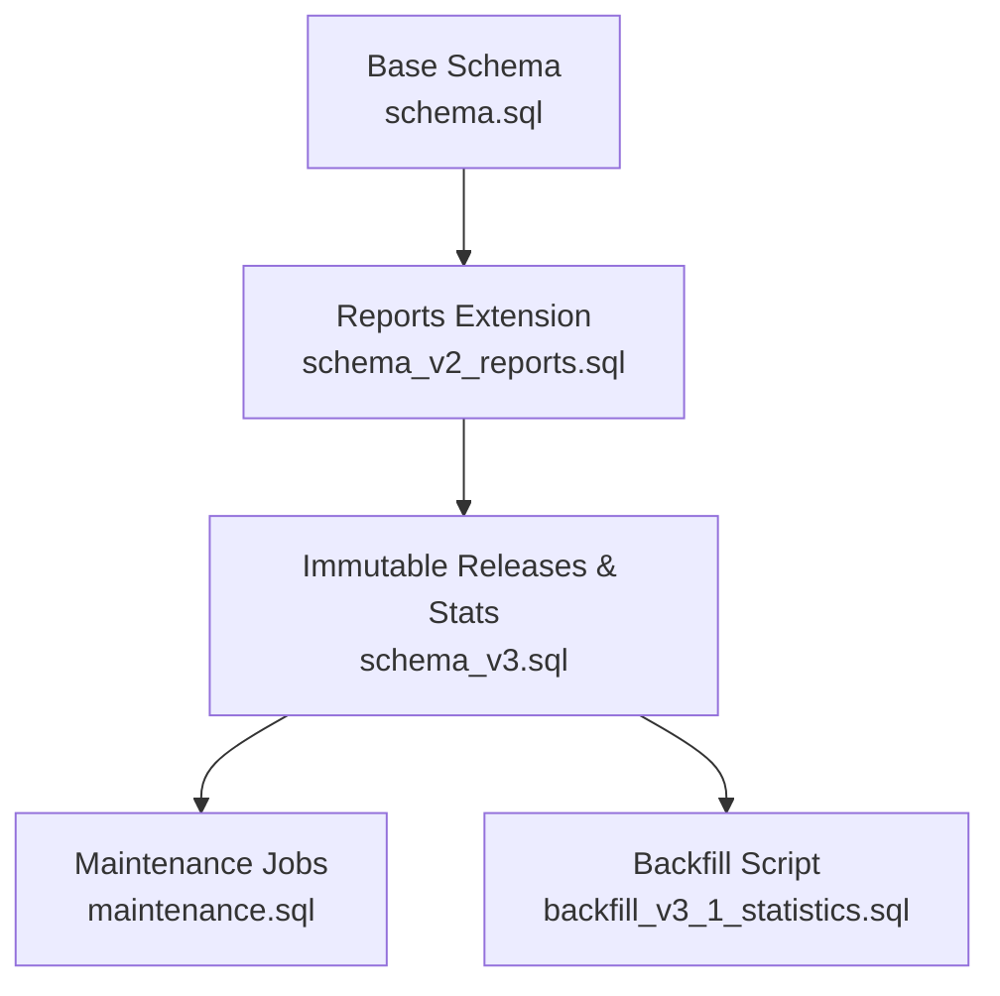
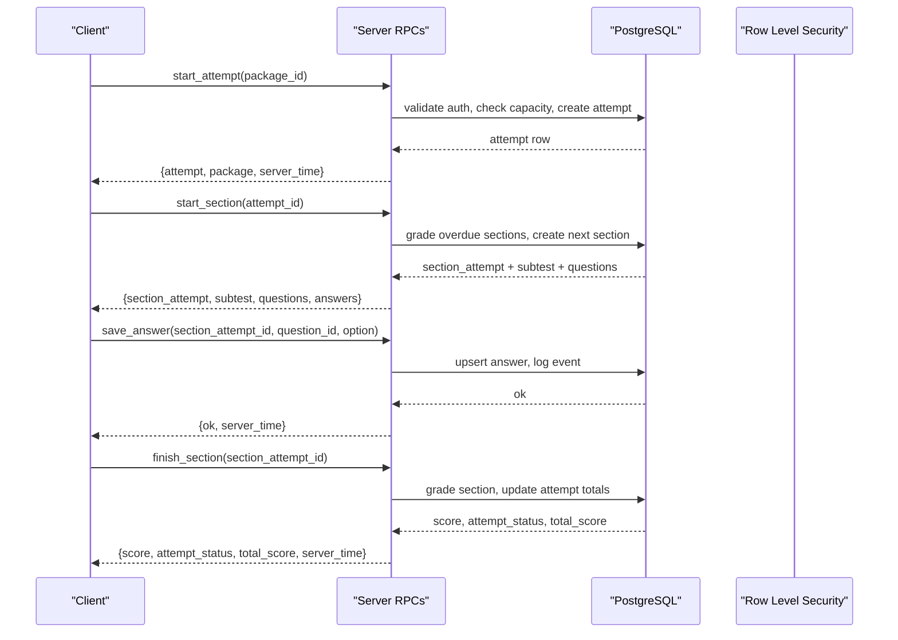
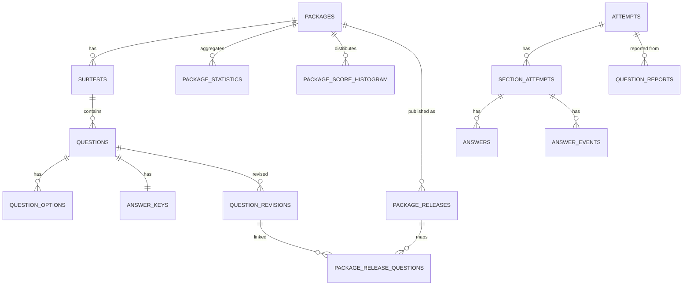

# Database Schema and Data Models

<cite>
**Referenced Files in This Document**
- [schema.sql](file://supabase/schema.sql)
- [schema_v2_reports.sql](file://supabase/schema_v2_reports.sql)
- [schema_v3.sql](file://supabase/schema_v3.sql)
- [maintenance.sql](file://supabase/maintenance.sql)
- [backfill_v3_1_statistics.sql](file://supabase/backfill_v3_1_statistics.sql)
- [schema.json](file://questions/schema.json)
</cite>

## Table of Contents
1. [Introduction](#introduction)
2. [Project Structure](#project-structure)
3. [Core Components](#core-components)
4. [Architecture Overview](#architecture-overview)
5. [Detailed Component Analysis](#detailed-component-analysis)
6. [Dependency Analysis](#dependency-analysis)
7. [Performance Considerations](#performance-considerations)
8. [Troubleshooting Guide](#troubleshooting-guide)
9. [Conclusion](#conclusion)
10. [Appendices](#appendices)

## Introduction
This document provides comprehensive data model documentation for the PostgreSQL database schema used by the TBS LPDP Try Out application. It covers all core tables including packages, subtests, questions, attempts, section_attempts, user statistics, and audit logs. It explains primary keys, foreign key relationships, indexes, constraints, JSONB fields for flexible question storage and attempt data, migration strategy from v2 to v3 schemas, backfill procedures for statistics, data validation rules, business constraints, referential integrity policies, and common query patterns for retrieving exam content, calculating scores, and generating analytics.

## Project Structure
The database schema is defined across multiple SQL files that are applied in a specific order:
- Base schema (v1): defines core entities and RPCs for attempts, sections, answers, events, capacity, and RLS policies.
- Reports extension (v2): adds question reporting functionality with RLS and RPCs.
- Immutable releases and statistics (v3): introduces immutable package/question revisions, pinned attempts, durable statistics, histogram, digest outbox, and updated RPCs.
- Maintenance: schedules retention, capacity refresh, anonymous user pruning, and daily report digest jobs.
- Backfill: one-time script to recover qualified mean/median data from retained pre-boundary attempts.

**Diagram sources**
- [schema.sql:1-12](file://supabase/schema.sql#L1-L12)
- [schema_v2_reports.sql:1-21](file://supabase/schema_v2_reports.sql#L1-L21)
- [schema_v3.sql:1-12](file://supabase/schema_v3.sql#L1-L12)
- [maintenance.sql:1-16](file://supabase/maintenance.sql#L1-L16)
- [backfill_v3_1_statistics.sql:1-17](file://supabase/backfill_v3_1_statistics.sql#L1-L17)

**Section sources**
- [schema.sql:1-12](file://supabase/schema.sql#L1-L12)
- [schema_v2_reports.sql:1-21](file://supabase/schema_v2_reports.sql#L1-L21)
- [schema_v3.sql:1-12](file://supabase/schema_v3.sql#L1-L12)
- [maintenance.sql:1-16](file://supabase/maintenance.sql#L1-L16)
- [backfill_v3_1_statistics.sql:1-17](file://supabase/backfill_v3_1_statistics.sql#L1-L17)

## Core Components
This section summarizes the core tables and their roles:
- packages: Exam packages with publication status and metadata.
- subtests: Sections within a package (verbal, kuantitatif, pemecahan_masalah).
- questions: Question stems, passages, images, difficulty, and type.
- question_options: Multiple-choice options per question.
- answer_keys: Correct option and explanations per question.
- attempts: User-level exam sessions tied to a package and release.
- section_attempts: Per-section progress, deadlines, and scores.
- answers: User selections and doubt flags per question in a section.
- answer_events: Append-only event log for auditing and diagnostics.
- question_reports: User feedback on questions with reasons and comments.
- package_statistics: Aggregated counts and score sums per package.
- package_score_histogram: Score distribution per package for median calculations.
- package_releases: Immutable snapshots of published packages with attribution.
- question_revisions: Immutable snapshots of questions with content hashes.
- package_release_questions: Mapping of questions to a release.
- question_report_digest_runs: Outbox table for scheduled email digests.
- service_capacity: Capacity limits and usage metrics.

Key JSONB fields:
- answer_keys.explanations: Flexible per-option explanations stored as JSONB.
- answer_events.payload: Event-specific payload (e.g., selected option, timing) stored as JSONB.
- package_statistics_backfill_runs.package_summary: Aggregate summary of backfill runs stored as JSONB.
- question_report_digest_runs.email_payload and related fields: Digest payloads and provider messages stored as JSONB.

**Section sources**
- [schema.sql:16-106](file://supabase/schema.sql#L16-L106)
- [schema_v2_reports.sql:27-49](file://supabase/schema_v2_reports.sql#L27-L49)
- [schema_v3.sql:58-166](file://supabase/schema_v3.sql#L58-L166)
- [schema_v3.sql:187-236](file://supabase/schema_v3.sql#L187-L236)
- [schema_v3.sql:267-288](file://supabase/schema_v3.sql#L267-L288)

## Architecture Overview
The system enforces strict read/write boundaries via Row Level Security (RLS) and server-side RPCs. Clients never write directly to content or attempt tables; all mutations go through functions like start_attempt, start_section, save_answer, toggle_doubt, finish_section, get_review, report_question, and delete_question_report.

**Diagram sources**
- [schema.sql:341-389](file://supabase/schema.sql#L341-L389)
- [schema.sql:417-493](file://supabase/schema.sql#L417-L493)
- [schema.sql:495-522](file://supabase/schema.sql#L495-L522)
- [schema.sql:551-580](file://supabase/schema.sql#L551-L580)
- [schema_v3.sql:709-758](file://supabase/schema_v3.sql#L709-L758)
- [schema_v3.sql:760-800](file://supabase/schema_v3.sql#L760-L800)

**Section sources**
- [schema.sql:131-181](file://supabase/schema.sql#L131-L181)
- [schema_v2_reports.sql:51-66](file://supabase/schema_v2_reports.sql#L51-L66)
- [schema_v3.sql:290-301](file://supabase/schema_v3.sql#L290-L301)

## Detailed Component Analysis

### Packages and Subtests
- packages: Primary key id, title, description, is_published flag, created_at timestamp.
- subtests: Primary key id (composite string '<package>-<key>'), foreign key to packages, key enum ('verbal','kuantitatif','pemecahan_masalah'), name, position, question_count, duration_seconds, passing_grade, unique constraints on (package_id, key) and (package_id, position).

Relationships:
- subtests.package_id references packages.id with cascade delete.

Indexes and constraints:
- Unique constraints ensure each subtest key and position is unique per package.

Business rules:
- Only published packages are selectable by authenticated users via RLS policy.

**Section sources**
- [schema.sql:16-35](file://supabase/schema.sql#L16-L35)
- [schema.sql:147-155](file://supabase/schema.sql#L147-L155)

### Questions and Options
- questions: Primary key id (composite string '<package>-<subtest>-<NNN>'), foreign key to subtests, number, qtype, question_text, passage, image_url, difficulty enum ('easy','medium','hard'), unique constraint on (subtest_id, number).
- question_options: Composite primary key (question_id, key), key enum ('A'-'E'), text.

Relationships:
- questions.subtest_id references subtests.id with cascade delete.
- question_options.question_id references questions.id with cascade delete.

Validation:
- Difficulty and key enums enforced by CHECK constraints.

**Section sources**
- [schema.sql:37-54](file://supabase/schema.sql#L37-L54)

### Answer Keys and Explanations (JSONB)
- answer_keys: Primary key question_id referencing questions.id with cascade delete, correct_option enum ('A'-'E'), explanations JSONB storing per-option explanations.

JSONB usage:
- explanations stores structured per-option rationale; validated at ingestion time by publisher tools and schema.json.

Constraints:
- correct_option constrained to valid options.

**Section sources**
- [schema.sql:56-60](file://supabase/schema.sql#L56-L60)
- [schema.json:81-95](file://questions/schema.json#L81-L95)

### Attempts and Section Attempts
- attempts: Primary key id (UUID), user_id references auth.users(id) with cascade delete, package_id references packages.id, status enum ('active','finished'), started_at, finished_at nullable, total_score integer. Index on (user_id, started_at desc).
- section_attempts: Primary key id (UUID), attempt_id references attempts.id with cascade delete, subtest_id references subtests.id, status enum ('active','finished'), started_at, deadline_at, finished_at nullable, score integer, unique constraint on (attempt_id, subtest_id).

Business rules:
- Attempt creation gated by capacity checks and per-user hourly budget.
- Section grading updates status, finished_at, score; when all sections finished, attempt is closed and total_score computed.

**Section sources**
- [schema.sql:64-85](file://supabase/schema.sql#L64-L85)
- [schema.sql:185-238](file://supabase/schema.sql#L185-L238)
- [schema.sql:341-389](file://supabase/schema.sql#L341-L389)

### Answers and Answer Events (Audit Log)
- answers: Composite primary key (section_attempt_id, question_id), selected_option enum ('A'-'E'), is_doubtful boolean default false, updated_at timestamp.
- answer_events: Primary key id (identity bigint), section_attempt_id references section_attempts.id with cascade delete, question_id nullable, event_type enum ('start','save_answer','mark_doubt','unmark_doubt','finish'), payload JSONB default '{}', created_at timestamp. Index on (section_attempt_id, created_at).

Constraints and caps:
- Event logging capped per section to prevent unbounded growth.
- Answers upserted on conflict to avoid duplicates.

**Section sources**
- [schema.sql:87-106](file://supabase/schema.sql#L87-L106)
- [schema.sql:241-260](file://supabase/schema.sql#L241-L260)

### Question Reports (v2)
- question_reports: Primary key id (UUID), user_id references auth.users(id) with cascade delete, question_id references questions.id with cascade delete, attempt_id and section_attempt_id nullable with set null on delete, reason enum, comment text with length limit, selected_option enum, content_hash text, status enum ('open','reviewing','accepted','rejected','duplicate'), created_at, updated_at, unique constraint on (user_id, question_id).

RLS:
- Read policy allows only the reporter to view their own reports.

RPCs:
- report_question validates inputs, gates by finished section ownership, enforces rolling-hour write budget, captures selected option and content hash.
- delete_question_report is idempotent.

**Section sources**
- [schema_v2_reports.sql:27-49](file://supabase/schema_v2_reports.sql#L27-L49)
- [schema_v2_reports.sql:51-66](file://supabase/schema_v2_reports.sql#L51-L66)
- [schema_v2_reports.sql:90-176](file://supabase/schema_v2_reports.sql#L90-L176)
- [schema_v2_reports.sql:182-199](file://supabase/schema_v2_reports.sql#L182-L199)

### Immutable Releases and Revisions (v3)
- package_releases: Primary key id (UUID), package_id references packages.id, version integer > 0, title, description, difficulty enum, ai_model non-blank, ai_company non-blank with length limit, ai_model_description non-blank with length limit, content_hash SHA-256 hex, published_at timestamp, unique constraints on (package_id, version) and (id, package_id).
- question_revisions: Primary key id (UUID), question_id references questions.id, version integer > 0, qtype, question_text, passage, image_url, image_sha256 with length check, difficulty enum, correct_option enum, explanations JSONB, content_hash SHA-256 hex, published_at timestamp, unique constraints on (question_id, version) and (id, question_id).
- package_release_questions: Composite primary key (package_release_id, question_id), package_id, question_id references questions.id, question_revision_id references question_revisions(id, question_id), subtest_id references subtests.id, number, unique constraint on (package_release_id, subtest_id, number).

Triggers:
- Immutability trigger rejects updates/deletes on revision/release tables.

**Section sources**
- [schema_v3.sql:58-102](file://supabase/schema_v3.sql#L58-L102)
- [schema_v3.sql:151-166](file://supabase/schema_v3.sql#L151-L166)
- [schema_v3.sql:290-301](file://supabase/schema_v3.sql#L290-L301)

### Statistics and Histogram (v3)
- package_statistics: Primary key package_id references packages.id, attempts_started_total bigint >= 0, attempts_completed_total bigint >= 0, score_sum bigint >= 0, statistics_sample_total bigint >= 0, statistics_score_sum bigint >= 0, coverage_started_at timestamptz, score_statistics_coverage_started_at timestamptz, updated_at timestamptz, checks ensuring completed <= started and sample <= completed.
- package_score_histogram: Composite primary key (package_id, score), score smallint between 0 and 300 divisible by 5, attempt_count bigint >= 0.
- package_statistics_backfill_runs: Primary key run_key, package_summary JSONB, applied_at timestamptz.

Functions:
- _v3_package_median_score computes median from histogram.
- backfill_v3_1_retained_statistics performs safe, audited backfill with invariants and locks.

**Section sources**
- [schema_v3.sql:187-236](file://supabase/schema_v3.sql#L187-L236)
- [schema_v3.sql:238-263](file://supabase/schema_v3.sql#L238-L263)
- [schema_v3.sql:366-531](file://supabase/schema_v3.sql#L366-L531)

### Digest Outbox (v3)
- question_report_digest_runs: Primary key id (UUID), window_start timestamptz, window_end timestamptz > window_start, status enum ('pending','sending','sent','failed','manual_attention'), delivery_attempts integer >= 0, lease_until timestamptz, email_payload JSONB, payload_sha256 SHA-256 hex, provider_message_id text, last_error text, created_at, sent_at nullable, updated_at, unique constraint on (window_start, window_end), unique index blocking unsent rows.

Purpose:
- Ensures exactly-once processing of daily digest emails and prevents gaps in operator history.

**Section sources**
- [schema_v3.sql:267-288](file://supabase/schema_v3.sql#L267-L288)

### Service Capacity
- service_capacity: Single-row table (boolean id checked true), db_bytes bigint, attempt_rows bigint, limit_bytes bigint, limit_attempt_rows bigint, measured_at timestamptz.

Functions:
- _refresh_capacity measures database size and estimate row counts using planner stats.
- _capacity returns cached snapshot refreshed if older than 5 minutes.

Usage:
- start_attempt gates new attempts based on capacity thresholds.

**Section sources**
- [schema.sql:119-129](file://supabase/schema.sql#L119-L129)
- [schema.sql:262-309](file://supabase/schema.sql#L262-L309)
- [schema.sql:341-389](file://supabase/schema.sql#L341-L389)

## Dependency Analysis
The following diagram shows key entity relationships and dependencies:

**Diagram sources**
- [schema.sql:16-106](file://supabase/schema.sql#L16-L106)
- [schema_v2_reports.sql:27-49](file://supabase/schema_v2_reports.sql#L27-L49)
- [schema_v3.sql:58-166](file://supabase/schema_v3.sql#L58-L166)
- [schema_v3.sql:187-236](file://supabase/schema_v3.sql#L187-L236)

**Section sources**
- [schema.sql:16-106](file://supabase/schema.sql#L16-L106)
- [schema_v2_reports.sql:27-49](file://supabase/schema_v2_reports.sql#L27-L49)
- [schema_v3.sql:58-166](file://supabase/schema_v3.sql#L58-L166)
- [schema_v3.sql:187-236](file://supabase/schema_v3.sql#L187-L236)

## Performance Considerations
- Indexes:
  - attempts.user_id + started_at desc accelerates recent attempt queries.
  - answer_events.section_attempt_id + created_at supports efficient event retrieval per section.
  - question_reports.question_id + created_at desc aids triage queries.
  - question_reports.user_id + updated_at desc supports recent user edits.
  - package_release_questions.package_release_id + subtest_id + number optimizes loading questions by release and section.
  - question_revisions and package_releases have content_hash indexes for deduplication and verification.
- Constraints:
  - Enum CHECK constraints reduce invalid data entry overhead.
  - Unique constraints prevent duplicate mappings and enforce business rules.
- JSONB:
  - explanations and payload fields enable flexible structures without schema churn; ensure minimal size and consistent structure at ingestion.
- Capacity management:
  - _capacity function uses pg_database_size and planner estimates for O(1) reads; scheduled refresh keeps cache warm.
  - Per-attempt event cap prevents runaway growth.
- Retention:
  - Scheduled job prunes attempts older than 7 days, cascading to dependent tables.
  - Anonymous user pruning removes inactive users while preserving those with reports.

[No sources needed since this section provides general guidance]

## Troubleshooting Guide
Common issues and resolutions:
- Authentication errors:
  - Ensure user is authenticated before calling RPCs; functions raise explicit errors for missing auth.
- Package not found or unpublished:
  - Verify package exists and is_published; v3 requires current_release_id to be set.
- Storage capacity reached:
  - Check service_capacity limits; adjust limit_bytes or limit_attempt_rows if plan changes.
- Too many attempts/reports:
  - Respect per-user hourly budgets; retry after cooldown.
- Section already finished or deadline passed:
  - Use finish_section to grade; past-deadline actions may auto-grade and return error codes.
- Invalid option or question not in section:
  - Validate option enum and ensure question belongs to the active section’s subtest.
- Report submission failures:
  - Ensure reason is valid and comment provided when reason is 'other'; respect rolling-hour budget.

Error codes and messages are raised explicitly in RPCs for clear client handling.

**Section sources**
- [schema.sql:341-389](file://supabase/schema.sql#L341-L389)
- [schema.sql:495-522](file://supabase/schema.sql#L495-L522)
- [schema_v2_reports.sql:90-176](file://supabase/schema_v2_reports.sql#L90-L176)

## Conclusion
The database schema implements a robust, secure, and scalable architecture for managing exam content, user attempts, and analytics. It leverages RLS and RPCs to enforce strict access controls, immutable releases and revisions to maintain data integrity, and comprehensive indexing and constraints to optimize performance and ensure referential integrity. The migration path from v2 to v3 introduces durability and auditability for statistics and reporting, with safe backfill procedures to preserve historical accuracy.

[No sources needed since this section summarizes without analyzing specific files]

## Appendices

### Migration Strategy from v2 to v3
- Apply order:
  1. schema.sql (base v1)
  2. schema_v2_reports.sql (reports extension)
  3. schema_v3.sql (immutable releases, statistics, updated RPCs)
  4. maintenance.sql (scheduled jobs)
- Key changes:
  - v2 adds question_reports with RLS and RPCs for reporting defective questions.
  - v3 introduces immutable package_releases and question_revisions, pins attempts to releases, augments statistics with histograms and median computation, and adds digest outbox for email operations.
  - Updated RPCs in v3 override earlier definitions; re-applying v3 ensures final grants and behavior.

**Section sources**
- [schema.sql:1-12](file://supabase/schema.sql#L1-L12)
- [schema_v2_reports.sql:1-21](file://supabase/schema_v2_reports.sql#L1-L21)
- [schema_v3.sql:1-12](file://supabase/schema_v3.sql#L1-L12)

### Backfill Procedures for Statistics
- One-time backfill script executes backfill_v3_1_retained_statistics() to recover qualified mean/median data from retained pre-boundary attempts.
- Safety properties:
  - Aborts unless every durable completion still has a retained attempt row.
  - Derives eligibility from saved answers (48/60 total with per-subtest minimums).
  - Locks aggregate tables during snapshot to ensure consistency.
  - Verifies counter/sum/histogram invariants before and after mutation.
  - Records an immutable audit marker with aggregate-only summary.
  - Returns already_applied on subsequent runs without changing data.

**Section sources**
- [backfill_v3_1_statistics.sql:1-17](file://supabase/backfill_v3_1_statistics.sql#L1-L17)
- [schema_v3.sql:366-531](file://supabase/schema_v3.sql#L366-L531)

### JSONB Fields and Validation
- answer_keys.explanations: Stores per-option explanations; validated by schema.json requiring keys A-E with minimum lengths.
- answer_events.payload: Captures event-specific data; defaults to empty object and is capped per section.
- package_statistics_backfill_runs.package_summary: Holds aggregate summaries of backfill runs; used for auditability.
- question_report_digest_runs.email_payload and related fields: Store digest payloads and provider messages; validated by length and format constraints.

Validation rules:
- schema.json enforces required fields, enums, and structural constraints for question data ingested into the system.
- Server-side CHECK constraints and RPC validations ensure data integrity at runtime.

**Section sources**
- [schema.sql:56-60](file://supabase/schema.sql#L56-L60)
- [schema.sql:96-106](file://supabase/schema.sql#L96-L106)
- [schema_v3.sql:229-236](file://supabase/schema_v3.sql#L229-L236)
- [schema_v3.sql:267-288](file://supabase/schema_v3.sql#L267-L288)
- [schema.json:1-98](file://questions/schema.json#L1-L98)

### Common Query Patterns
- Retrieve exam content:
  - Use start_section RPC to fetch subtest details, questions, and existing answers for a section.
  - Leverage package_releases and package_release_questions to load immutable question sets for a given release.
- Calculate scores:
  - Grade sections via finish_section RPC; internal logic joins answers with correct options and multiplies by point value.
  - Total score computed when all sections are finished; histogram updated for eligible attempts.
- Generate analytics:
  - Query package_statistics for aggregated counts and score sums.
  - Compute median using _v3_package_median_score function over package_score_histogram.
  - Use question_report_digest_runs to track email digest operations and statuses.

[No sources needed since this section provides general guidance]