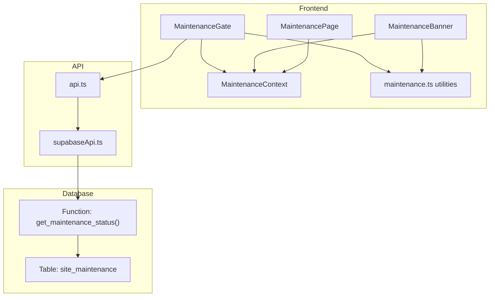
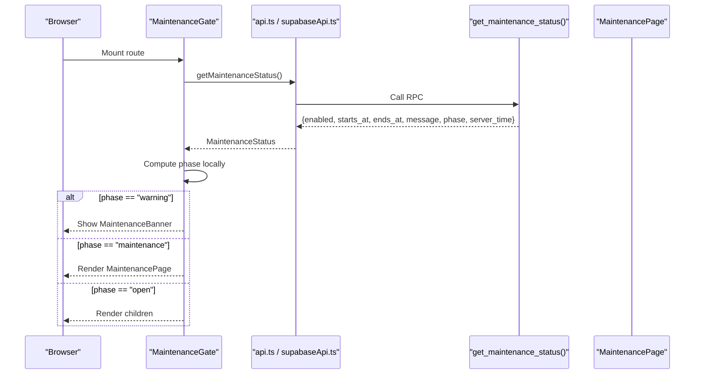
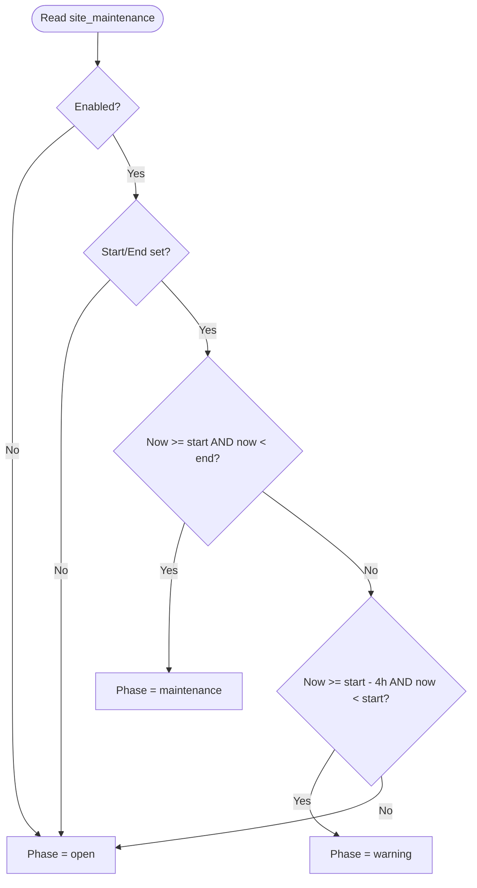
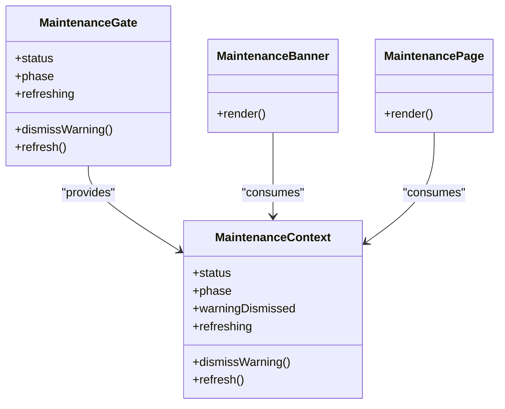
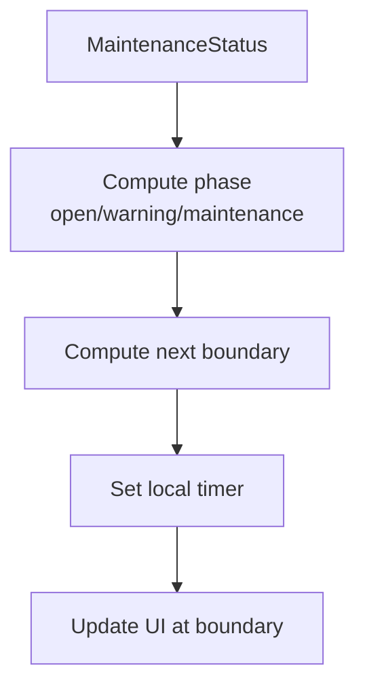
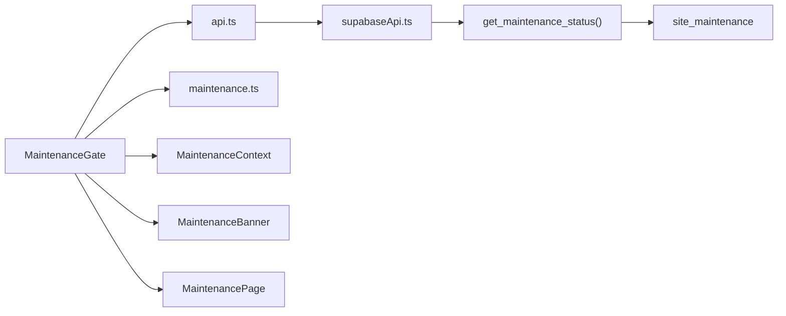

# Maintenance Mode and System Administration

<cite>
**Referenced Files in This Document**
- [schema_v4_maintenance_mode.sql](file://supabase/schema_v4_maintenance_mode.sql)
- [maintenance.sql](file://supabase/maintenance.sql)
- [MaintenanceGate.tsx](file://web/src/components/MaintenanceGate.tsx)
- [MaintenanceBanner.tsx](file://web/src/components/MaintenanceBanner.tsx)
- [MaintenancePage.tsx](file://web/src/pages/MaintenancePage.tsx)
- [MaintenanceContext.ts](file://web/src/contexts/MaintenanceContext.ts)
- [maintenance.ts](file://web/src/lib/maintenance.ts)
- [api.ts](file://web/src/lib/api.ts)
- [supabaseApi.ts](file://web/src/lib/supabaseApi.ts)
- [types.ts](file://web/src/lib/types.ts)
- [TECHNICAL_REQUIREMENTS_V4.md](file://docs/TECHNICAL_REQUIREMENTS_V4.md)
</cite>

## Table of Contents
1. [Introduction](#introduction)
2. [Project Structure](#project-structure)
3. [Core Components](#core-components)
4. [Architecture Overview](#architecture-overview)
5. [Detailed Component Analysis](#detailed-component-analysis)
6. [Dependency Analysis](#dependency-analysis)
7. [Performance Considerations](#performance-considerations)
8. [Troubleshooting Guide](#troubleshooting-guide)
9. [Conclusion](#conclusion)
10. [Appendices](#appendices)

## Introduction
This document explains the maintenance mode system that allows administrators to schedule controlled downtime for the application while keeping users informed. The system is database-driven: a single configuration row defines whether maintenance is enabled, its start and end times, and a user-facing message. A server-side function computes the current phase (open, warning, or maintenance) using the database clock, and the frontend polls this status to display banners and gate access during active maintenance windows.

It also documents the automated background tasks managed by cron jobs for data retention and service capacity snapshots, which complement operational health monitoring. Finally, it provides procedures for scheduling maintenance, communicating with users, monitoring system status, and handling emergencies such as rollback or override scenarios.

## Project Structure
The maintenance feature spans database schema, backend RPCs, and frontend components:

- Database layer:
  - A singleton table stores maintenance configuration.
  - A read-only RPC exposes the computed maintenance status to clients.
- Frontend layer:
  - A global gate component loads the maintenance status before rendering routes.
  - A banner shows a pre-maintenance warning with a dismissible notice.
  - A dedicated maintenance page is shown during active maintenance.
  - Utilities compute phases and boundary transitions locally for smooth UI updates.
  - Context shares state across components.
- API integration:
  - The Supabase API client calls the maintenance status RPC.
  - A local mock implementation supports offline development.

**Diagram sources**
- [schema_v4_maintenance_mode.sql:15-63](file://supabase/schema_v4_maintenance_mode.sql#L15-L63)
- [MaintenanceGate.tsx:35-140](file://web/src/components/MaintenanceGate.tsx#L35-L140)
- [MaintenanceBanner.tsx:1-35](file://web/src/components/MaintenanceBanner.tsx#L1-L35)
- [MaintenancePage.tsx:1-32](file://web/src/pages/MaintenancePage.tsx#L1-L32)
- [MaintenanceContext.ts:1-25](file://web/src/contexts/MaintenanceContext.ts#L1-L25)
- [maintenance.ts:1-48](file://web/src/lib/maintenance.ts#L1-L48)
- [api.ts:77-95](file://web/src/lib/api.ts#L77-L95)
- [supabaseApi.ts:67-81](file://web/src/lib/supabaseApi.ts#L67-L81)

**Section sources**
- [schema_v4_maintenance_mode.sql:15-63](file://supabase/schema_v4_maintenance_mode.sql#L15-L63)
- [MaintenanceGate.tsx:35-140](file://web/src/components/MaintenanceGate.tsx#L35-L140)
- [MaintenanceBanner.tsx:1-35](file://web/src/components/MaintenanceBanner.tsx#L1-L35)
- [MaintenancePage.tsx:1-32](file://web/src/pages/MaintenancePage.tsx#L1-L32)
- [MaintenanceContext.ts:1-25](file://web/src/contexts/MaintenanceContext.ts#L1-L25)
- [maintenance.ts:1-48](file://web/src/lib/maintenance.ts#L1-L48)
- [api.ts:77-95](file://web/src/lib/api.ts#L77-L95)
- [supabaseApi.ts:67-81](file://web/src/lib/supabaseApi.ts#L67-L81)

## Core Components
- Database configuration:
  - Singleton table holds enabled flag, scheduled start/end timestamps, and a user-facing message. Constraints ensure valid schedules and safe defaults.
- Server-side status computation:
  - A secure function returns a JSON object including enabled, timestamps, message, computed phase, and server time. Phase logic considers open, warning (four hours before start), and maintenance windows.
- Frontend gate:
  - Loads maintenance status before route rendering, polls periodically, and switches to the maintenance page when phase is maintenance. It fails open on first probe failure to avoid blocking users due to transient issues.
- Warning banner:
  - Displays a dismissible notice during the warning window, keyed to the specific schedule so changes re-show the banner.
- Maintenance page:
  - Shows a clear message and expected return time; includes a manual refresh button.
- Utilities and context:
  - Compute phase and next boundary transitions locally to update UI precisely at schedule boundaries. Context distributes state to consumers.

**Section sources**
- [schema_v4_maintenance_mode.sql:15-63](file://supabase/schema_v4_maintenance_mode.sql#L15-L63)
- [MaintenanceGate.tsx:35-140](file://web/src/components/MaintenanceGate.tsx#L35-L140)
- [MaintenanceBanner.tsx:1-35](file://web/src/components/MaintenanceBanner.tsx#L1-L35)
- [MaintenancePage.tsx:1-32](file://web/src/pages/MaintenancePage.tsx#L1-L32)
- [maintenance.ts:1-48](file://web/src/lib/maintenance.ts#L1-L48)
- [MaintenanceContext.ts:1-25](file://web/src/contexts/MaintenanceContext.ts#L1-L25)

## Architecture Overview
The maintenance flow begins with the frontend loading the public maintenance status via an RPC. The server computes the phase based on the configured schedule and current time. The frontend uses this information to show warnings or block access during maintenance. Background cron jobs handle data retention and capacity snapshots to support operational health.

**Diagram sources**
- [MaintenanceGate.tsx:35-140](file://web/src/components/MaintenanceGate.tsx#L35-L140)
- [api.ts:77-95](file://web/src/lib/api.ts#L77-L95)
- [supabaseApi.ts:67-81](file://web/src/lib/supabaseApi.ts#L67-L81)
- [schema_v4_maintenance_mode.sql:38-63](file://supabase/schema_v4_maintenance_mode.sql#L38-L63)

## Detailed Component Analysis

### Database Configuration and Status RPC
- Singleton table ensures one active schedule at a time.
- Constraints enforce:
  - If enabled, both start and end must be set.
  - End must be after start if both are present.
  - Message length within acceptable bounds.
- Read-only RPC exposes only necessary fields and computes phase server-side, returning server time for synchronization.

**Diagram sources**
- [schema_v4_maintenance_mode.sql:15-63](file://supabase/schema_v4_maintenance_mode.sql#L15-L63)

**Section sources**
- [schema_v4_maintenance_mode.sql:15-63](file://supabase/schema_v4_maintenance_mode.sql#L15-L63)

### Frontend Maintenance Gate
- Polls status every minute with a short timeout to avoid blocking initial load.
- Uses local boundary timers to switch UI exactly at warning start, maintenance start, and maintenance end without waiting for the next poll.
- Dismisses warning per schedule key stored in session storage; changing the schedule re-shows the banner.
- Dev bypass exists only in development builds; production enforces the gate regardless of environment variables.

**Diagram sources**
- [MaintenanceGate.tsx:35-140](file://web/src/components/MaintenanceGate.tsx#L35-L140)
- [MaintenanceContext.ts:1-25](file://web/src/contexts/MaintenanceContext.ts#L1-L25)
- [MaintenanceBanner.tsx:1-35](file://web/src/components/MaintenanceBanner.tsx#L1-L35)
- [MaintenancePage.tsx:1-32](file://web/src/pages/MaintenancePage.tsx#L1-L32)

**Section sources**
- [MaintenanceGate.tsx:35-140](file://web/src/components/MaintenanceGate.tsx#L35-L140)
- [MaintenanceContext.ts:1-25](file://web/src/contexts/MaintenanceContext.ts#L1-L25)
- [MaintenanceBanner.tsx:1-35](file://web/src/components/MaintenanceBanner.tsx#L1-L35)
- [MaintenancePage.tsx:1-32](file://web/src/pages/MaintenancePage.tsx#L1-L32)

### Utilities and Types
- Phase calculation aligns with server-side logic and uses a four-hour warning lead.
- Boundary detection schedules precise UI transitions at critical moments.
- Schedule key generation enables per-schedule dismissal persistence.
- Date formatting displays localized times for users.

**Diagram sources**
- [maintenance.ts:1-48](file://web/src/lib/maintenance.ts#L1-L48)

**Section sources**
- [maintenance.ts:1-48](file://web/src/lib/maintenance.ts#L1-L48)
- [types.ts:213-226](file://web/src/lib/types.ts#L213-L226)

### API Integration
- The API module dynamically selects between Supabase and local implementations.
- Maintenance status is exposed as part of the ExamApi interface and called before authentication to gate access early.
- Local mock mirrors behavior for offline development.

**Section sources**
- [api.ts:77-95](file://web/src/lib/api.ts#L77-L95)
- [supabaseApi.ts:67-81](file://web/src/lib/supabaseApi.ts#L67-L81)
- [types.ts:228-231](file://web/src/lib/types.ts#L228-L231)

## Dependency Analysis
- Frontend depends on:
  - API abstraction to fetch maintenance status.
  - Supabase RPC for authoritative phase computation.
  - Local utilities for phase and boundary calculations.
  - Context for sharing state across components.
- Backend depends on:
  - Database constraints to ensure valid schedules.
  - Row-level security to restrict direct table access.
  - Cron jobs for data retention and capacity snapshots.

**Diagram sources**
- [MaintenanceGate.tsx:35-140](file://web/src/components/MaintenanceGate.tsx#L35-L140)
- [api.ts:77-95](file://web/src/lib/api.ts#L77-L95)
- [supabaseApi.ts:67-81](file://web/src/lib/supabaseApi.ts#L67-L81)
- [schema_v4_maintenance_mode.sql:15-63](file://supabase/schema_v4_maintenance_mode.sql#L15-L63)

**Section sources**
- [MaintenanceGate.tsx:35-140](file://web/src/components/MaintenanceGate.tsx#L35-L140)
- [api.ts:77-95](file://web/src/lib/api.ts#L77-L95)
- [supabaseApi.ts:67-81](file://web/src/lib/supabaseApi.ts#L67-L81)
- [schema_v4_maintenance_mode.sql:15-63](file://supabase/schema_v4_maintenance_mode.sql#L15-L63)

## Performance Considerations
- Polling interval balances responsiveness with network overhead (one minute).
- Local boundary timers reduce unnecessary re-renders and ensure precise transitions.
- First probe timeout prevents blocking initial load; failures fail open to maintain availability.
- Database constraints minimize invalid states and reduce validation overhead.
- Cron jobs run off-peak to minimize impact on user experience.

[No sources needed since this section provides general guidance]

## Troubleshooting Guide
- Maintenance not showing:
  - Verify the singleton row has enabled true and valid start/end times.
  - Confirm the RPC is granted to anonymous/authenticated roles.
  - Check browser console for probe timeouts or network errors.
- Banner not dismissing:
  - Ensure sessionStorage is available; otherwise, in-memory dismissal still works for the tab session.
  - Changing the schedule resets dismissal for the new schedule key.
- Unexpected maintenance page:
  - Validate server time synchronization and timezone settings.
  - Review phase computation in utilities and RPC to ensure alignment.
- Cron job issues:
  - Inspect job definitions and last run details.
  - Verify extensions are enabled and permissions are correct.
  - Monitor database size and relation sizes to confirm pruning effectiveness.

**Section sources**
- [schema_v4_maintenance_mode.sql:38-63](file://supabase/schema_v4_maintenance_mode.sql#L38-L63)
- [MaintenanceGate.tsx:56-83](file://web/src/components/MaintenanceGate.tsx#L56-L83)
- [maintenance.sql:154-167](file://supabase/maintenance.sql#L154-L167)

## Conclusion
The maintenance mode system provides a robust, database-driven approach to scheduling downtime with clear user communication and reliable access gating. The combination of server-side phase computation, frontend polling, and precise boundary transitions ensures a smooth user experience. Automated cron jobs support operational health by maintaining data retention and capacity snapshots. Administrators can schedule maintenance safely, communicate effectively, and monitor system status through well-defined interfaces and tools.

[No sources needed since this section summarizes without analyzing specific files]

## Appendices

### Procedures

#### Scheduling Maintenance
- Update the singleton row to enable maintenance and set start/end timestamps along with a user-facing message.
- Ensure timestamps include timezone information and that end is after start.
- Re-run schema file if core schema was reapplied to restore RPC grants.

**Section sources**
- [schema_v4_maintenance_mode.sql:15-30](file://supabase/schema_v4_maintenance_mode.sql#L15-L30)
- [schema_v4_maintenance_mode.sql:66-81](file://supabase/schema_v4_maintenance_mode.sql#L66-L81)

#### Communicating With Users
- Use the message field to inform users about the reason and duration.
- The warning banner appears four hours before start; users can dismiss it per schedule.
- During maintenance, the dedicated page shows expected return time and offers manual refresh.

**Section sources**
- [schema_v4_maintenance_mode.sql:20-25](file://supabase/schema_v4_maintenance_mode.sql#L20-L25)
- [MaintenanceBanner.tsx:1-35](file://web/src/components/MaintenanceBanner.tsx#L1-L35)
- [MaintenancePage.tsx:1-32](file://web/src/pages/MaintenancePage.tsx#L1-L32)
- [maintenance.ts:4-16](file://web/src/lib/maintenance.ts#L4-L16)

#### Monitoring System Status
- Check cron job status and recent runs to verify automated tasks.
- Monitor database size and relation sizes to assess retention effectiveness.
- Observe frontend behavior: warning banner, maintenance page, and automatic restoration after end time.

**Section sources**
- [maintenance.sql:154-167](file://supabase/maintenance.sql#L154-L167)

#### Rollback and Emergency Override
- Cancel maintenance by disabling the schedule or clearing timestamps; users will return automatically after end time or immediately upon disable.
- In development, a bypass flag can skip the maintenance gate for testing; this is intentionally disabled in production builds.
- For critical issues, operators should quickly revert the singleton row to normal operation and validate that the frontend resumes normal routing.

**Section sources**
- [schema_v4_maintenance_mode.sql:77-81](file://supabase/schema_v4_maintenance_mode.sql#L77-L81)
- [MaintenanceGate.tsx:17-21](file://web/src/components/MaintenanceGate.tsx#L17-L21)
- [TECHNICAL_REQUIREMENTS_V4.md:39-42](file://docs/TECHNICAL_REQUIREMENTS_V4.md#L39-L42)