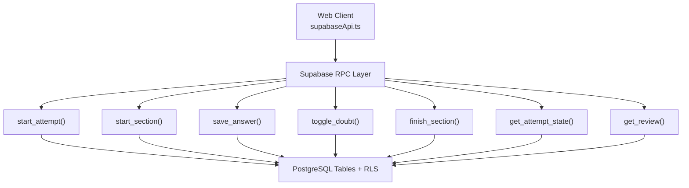
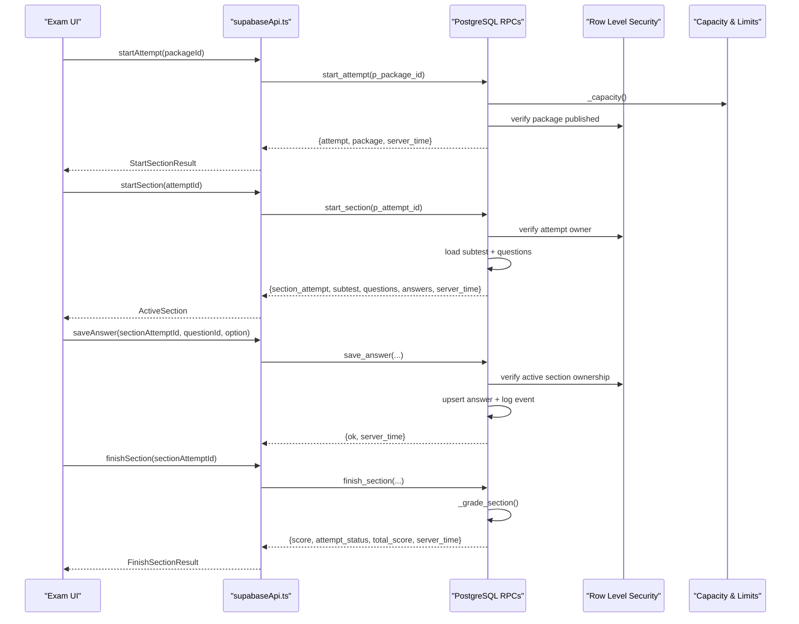
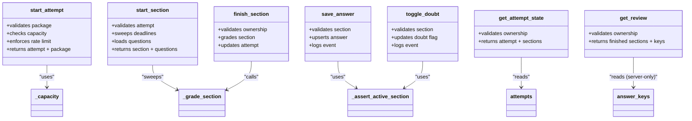
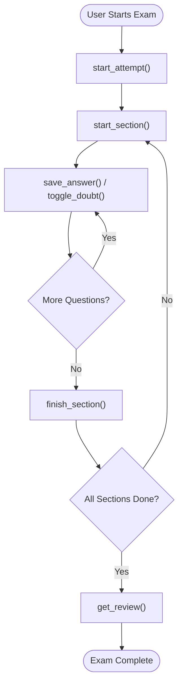

# Core Exam RPC Functions

<cite>
**Referenced Files in This Document**
- [schema.sql](file://supabase/schema.sql)
- [schema_v2_reports.sql](file://supabase/schema_v2_reports.sql)
- [schema_v3.sql](file://supabase/schema_v3.sql)
- [maintenance.sql](file://supabase/maintenance.sql)
- [supabaseApi.ts](file://web/src/lib/supabaseApi.ts)
- [types.ts](file://web/src/lib/types.ts)
</cite>

## Table of Contents
1. [Introduction](#introduction)
2. [Project Structure](#project-structure)
3. [Core Components](#core-components)
4. [Architecture Overview](#architecture-overview)
5. [Detailed Component Analysis](#detailed-component-analysis)
6. [Dependency Analysis](#dependency-analysis)
7. [Performance Considerations](#performance-considerations)
8. [Troubleshooting Guide](#troubleshooting-guide)
9. [Conclusion](#conclusion)
10. [Appendices](#appendices)

## Introduction
This document explains the server-side RPC functions that implement the complete lifecycle of a TBS LPDP practice test, from starting an attempt to reviewing results. All exam logic runs on the database server to prevent cheating: clients never read answer keys or grade answers locally. The system enforces authentication, ownership checks, capacity limits, and per-user rate limits through secure definer functions and Row Level Security policies.

## Project Structure
The exam system is implemented as PostgreSQL functions (RPCs) under the public schema, with a thin client API layer in TypeScript that calls these functions via Supabase RPC.

**Diagram sources**
- [supabaseApi.ts:108-147](file://web/src/lib/supabaseApi.ts#L108-L147)
- [schema.sql:341-657](file://supabase/schema.sql#L341-L657)
- [schema_v3.sql:709-800](file://supabase/schema_v3.sql#L709-L800)

**Section sources**
- [supabaseApi.ts:1-170](file://web/src/lib/supabaseApi.ts#L1-L170)
- [schema.sql:1-692](file://supabase/schema.sql#L1-L692)
- [schema_v3.sql:1-800](file://supabase/schema_v3.sql#L1-L800)

## Core Components
The core RPCs are defined in the database schema and exposed to authenticated users. They implement:

- start_attempt(): Initiates a new exam session with capacity checks and per-user rate limiting.
- start_section(): Starts or resumes a subtest section, loads questions, and sets deadlines.
- save_answer(): Securely records a selected option for a question within an active section.
- toggle_doubt(): Marks or unmarks a question as doubtful during an active section.
- finish_section(): Completes a section, grades it server-side, and updates attempt totals.
- get_attempt_state(): Retrieves current progress for an attempt and its sections.
- get_review(): Returns completed exam results with answer keys and explanations, restricted to finished sections owned by the caller.

All mutations go through these RPCs; direct table writes from clients are revoked.

**Section sources**
- [schema.sql:341-657](file://supabase/schema.sql#L341-L657)
- [schema_v3.sql:709-800](file://supabase/schema_v3.sql#L709-L800)
- [supabaseApi.ts:108-147](file://web/src/lib/supabaseApi.ts#L108-L147)

## Architecture Overview
The architecture ensures security and integrity by running all critical logic server-side:

- Authentication: Each RPC verifies the caller’s identity using auth.uid().
- Ownership: Access checks ensure users can only operate on their own attempts/sections.
- Capacity and Rate Limits: Global storage ceilings and per-user hourly attempt budgets protect service stability.
- Row Level Security: Policies restrict reads/writes to user-owned data; answer_keys are not directly readable by clients.
- Server-Side Grading: Scoring uses immutable question revisions and answer keys stored server-side.

**Diagram sources**
- [supabaseApi.ts:108-147](file://web/src/lib/supabaseApi.ts#L108-L147)
- [schema.sql:341-580](file://supabase/schema.sql#L341-L580)
- [schema_v3.sql:709-800](file://supabase/schema_v3.sql#L709-L800)

## Detailed Component Analysis

### start_attempt()
Purpose:
- Creates or resumes an active attempt for a published package.
- Enforces global capacity limits and per-user hourly attempt budget.
- Pins the attempt to an immutable package release for reproducibility.

Key behaviors:
- Requires authentication.
- Validates package existence and publication status.
- Checks capacity via _capacity() before creating new attempts.
- Applies per-user rate limit (e.g., max attempts per hour).
- Returns attempt metadata along with the pinned package release.

Return structure:
- attempt: Attempt object with id, package_id, package_release_id, status, timestamps, total_score.
- package: Package object including versioning and statistics.
- server_time: Database timestamp for client synchronization.

Error handling:
- Not authenticated: raises exception.
- Package not found/unpublished/no release: error code P0002.
- Storage capacity reached: error code P0007.
- Too many attempts: error code P0005.

Security model:
- Uses security definer function to enforce policy checks.
- No direct table access from clients; all mutations via RPC.

Integration points:
- Updates package_statistics when a new attempt starts.
- Integrates with Row Level Security for subsequent reads/writes.

**Section sources**
- [schema_v3.sql:709-758](file://supabase/schema_v3.sql#L709-L758)
- [schema.sql:341-390](file://supabase/schema.sql#L341-L390)
- [supabaseApi.ts:108-111](file://web/src/lib/supabaseApi.ts#L108-L111)
- [types.ts:88-92](file://web/src/lib/types.ts#L88-L92)

### start_section()
Purpose:
- Starts or resumes a subtest section for an active attempt.
- Loads questions and existing answers for the section.
- Sets deadlines based on subtest duration.

Key behaviors:
- Verifies attempt ownership.
- Sweeps and auto-finishes any overdue sections.
- Resumes an active section if one exists; otherwise creates next subtest by position.
- Logs a 'start' event for auditability.
- Returns questions without exposing answer keys.

Return structure:
- done: true if all sections completed.
- section_attempt: SectionAttempt object with deadlines and status.
- subtest: Subtest metadata.
- package: Pinned package release info.
- questions: Array of Question objects (no correct_option or explanations).
- answers: Current answer states for the section.
- server_time: Database timestamp.

Error handling:
- Attempt not found: error code P0002.

Security model:
- Ownership validation via auth.uid().
- Questions served without answer keys to prevent cheating.

**Section sources**
- [schema_v3.sql:760-800](file://supabase/schema_v3.sql#L760-L800)
- [schema.sql:417-493](file://supabase/schema.sql#L417-L493)
- [supabaseApi.ts:113-116](file://web/src/lib/supabaseApi.ts#L113-L116)
- [types.ts:94-104](file://web/src/lib/types.ts#L94-L104)

### save_answer()
Purpose:
- Records a selected option for a question within an active section.
- Validates input and logs the action.

Key behaviors:
- Asserts section is active and belongs to the caller.
- Validates option key (A–E) and question membership.
- Upserts answer record with updated timestamp.
- Logs a 'save_answer' event with payload.

Return structure:
- ok: boolean indicating success.
- server_time: Database timestamp.

Error handling:
- Invalid option: raises exception.
- Question not in section: error code P0002.

Security model:
- Uses _assert_active_section() to enforce ownership and deadline checks.
- Event logging bounded to prevent abuse.

**Section sources**
- [schema.sql:495-522](file://supabase/schema.sql#L495-L522)
- [schema.sql:311-337](file://supabase/schema.sql#L311-L337)
- [supabaseApi.ts:118-124](file://web/src/lib/supabaseApi.ts#L118-L124)

### toggle_doubt()
Purpose:
- Marks or unmarks a question as doubtful during an active section.

Key behaviors:
- Asserts section is active and belongs to the caller.
- Validates question membership.
- Upserts is_doubtful flag with updated timestamp.
- Logs 'mark_doubt' or 'unmark_doubt' event.

Return structure:
- ok: boolean indicating success.
- server_time: Database timestamp.

Error handling:
- Question not in section: error code P0002.

Security model:
- Ownership and activity checks via _assert_active_section().

**Section sources**
- [schema.sql:524-549](file://supabase/schema.sql#L524-L549)
- [schema.sql:311-337](file://supabase/schema.sql#L311-L337)
- [supabaseApi.ts:126-132](file://web/src/lib/supabaseApi.ts#L126-L132)

### finish_section()
Purpose:
- Completes a section, grades it server-side, and updates attempt totals.

Key behaviors:
- Validates ownership of the section attempt.
- Calls _grade_section() to compute score and finalize section.
- Updates attempt status and total score if all sections finished.
- Returns grading result and attempt state.

Return structure:
- score: Section score.
- attempt_status: 'active' or 'finished'.
- total_score: Cumulative score across sections.
- server_time: Database timestamp.

Error handling:
- Section attempt not found: error code P0002.

Security model:
- Ownership check ensures only the owner can finish.
- Grading uses immutable question revisions and answer keys.

**Section sources**
- [schema.sql:551-580](file://supabase/schema.sql#L551-L580)
- [schema_v3.sql:610-705](file://supabase/schema_v3.sql#L610-L705)
- [supabaseApi.ts:134-137](file://web/src/lib/supabaseApi.ts#L134-L137)
- [types.ts:109-114](file://web/src/lib/types.ts#L109-L114)

### get_attempt_state()
Purpose:
- Retrieves current progress for an attempt and its sections.

Key behaviors:
- Validates attempt ownership.
- Returns attempt metadata and list of sections with subtest info.

Return structure:
- attempt: Attempt object.
- package: Pinned package release info.
- server_time: Database timestamp.
- sections: Array of section_attempt and subtest pairs.

Error handling:
- Attempt not found: error code P0002.

Security model:
- Ownership validation via auth.uid().

**Section sources**
- [schema.sql:582-607](file://supabase/schema.sql#L582-L607)
- [supabaseApi.ts:139-142](file://web/src/lib/supabaseApi.ts#L139-L142)
- [types.ts:116-121](file://web/src/lib/types.ts#L116-L121)

### get_review()
Purpose:
- Returns completed exam results with answer keys and explanations for finished sections.

Key behaviors:
- Validates attempt ownership.
- Includes correct_option and explanations only for finished sections of the caller’s attempt.
- Optionally includes my_report field (v2+) showing the caller’s report per question.

Return structure:
- attempt: Attempt object.
- package: Pinned package release info.
- sections: Array of ReviewSection with subtest, score, and questions.
- Each question includes selected_option, is_doubtful, correct_option, explanations, and my_report.

Error handling:
- Attempt not found: error code P0002.

Security model:
- Answer keys are never exposed for active sections.
- Only finished sections of the caller’s attempt are included.

**Section sources**
- [schema.sql:612-657](file://supabase/schema.sql#L612-L657)
- [schema_v2_reports.sql:207-261](file://supabase/schema_v2_reports.sql#L207-L261)
- [supabaseApi.ts:144-147](file://web/src/lib/supabaseApi.ts#L144-L147)
- [types.ts:146-165](file://web/src/lib/types.ts#L146-L165)

## Dependency Analysis
The RPCs depend on shared helpers and tables:

- _grade_section(): Computes scores using answer_keys or question_revisions and finalizes sections.
- _assert_active_section(): Validates ownership, activity, and deadlines.
- _log_event(): Bounded event logging to prevent abuse.
- _capacity(): Measures and caches storage usage for capacity gating.

Tables involved:
- attempts, section_attempts, answers, answer_events, questions, question_options, answer_keys, subtests, packages, package_releases, question_revisions.

Row Level Security policies:
- Restrict reads/writes to user-owned data.
- answer_keys have no client-readable policy.

**Diagram sources**
- [schema.sql:185-337](file://supabase/schema.sql#L185-L337)
- [schema_v3.sql:610-705](file://supabase/schema_v3.sql#L610-L705)
- [schema.sql:341-657](file://supabase/schema.sql#L341-L657)

**Section sources**
- [schema.sql:131-182](file://supabase/schema.sql#L131-L182)
- [schema_v3.sql:584-606](file://supabase/schema_v3.sql#L584-L606)

## Performance Considerations
- Capacity checks use O(1) estimates via pg_class reltuples to avoid expensive count(*) queries.
- Event logging is capped per section to prevent unbounded growth.
- Deadlines are enforced server-side to minimize client-side timing attacks.
- Immutable question revisions ensure consistent grading without re-parsing content.
- Scheduled maintenance prunes old attempts and anonymous users to keep storage within limits.

[No sources needed since this section provides general guidance]

## Troubleshooting Guide
Common errors and their meanings:

- P0002: Resource not found (package, attempt, section, question).
- P0003: Section already finished.
- P0004: Section deadline passed.
- P0005: Too many attempts or reports (rate limit exceeded).
- P0006: Invalid input (report reason, comment length).
- P0007: Storage capacity reached.

Debugging steps:
- Verify authentication via supabase.auth.getSession().
- Check service status via get_service_status() to confirm capacity.
- Inspect attempt state via get_attempt_state() to identify stuck sections.
- Review answer events for audit trails.

**Section sources**
- [schema.sql:341-657](file://supabase/schema.sql#L341-L657)
- [schema_v2_reports.sql:90-175](file://supabase/schema_v2_reports.sql#L90-L175)
- [supabaseApi.ts:28-39](file://web/src/lib/supabaseApi.ts#L28-L39)

## Conclusion
The TBS LPDP exam system implements a robust, secure, and scalable exam execution pipeline entirely on the server side. By centralizing logic in PostgreSQL RPCs, enforcing strict access controls, and integrating capacity and rate limiting, the system prevents cheating and maintains reliability under load. The modular design allows for clear separation of concerns, easy maintenance, and extensibility for future enhancements.

[No sources needed since this section summarizes without analyzing specific files]

## Appendices

### Typical Usage Flow
1. User selects a package and calls start_attempt().
2. Client receives attempt and package metadata.
3. Client calls start_section() to begin the first subtest.
4. Client loads questions and displays them to the user.
5. User answers questions via save_answer() and marks doubts via toggle_doubt().
6. When ready, client calls finish_section() to submit and grade.
7. After all sections, client retrieves review via get_review() to see results and explanations.

**Diagram sources**
- [supabaseApi.ts:108-147](file://web/src/lib/supabaseApi.ts#L108-L147)
- [schema.sql:341-657](file://supabase/schema.sql#L341-L657)