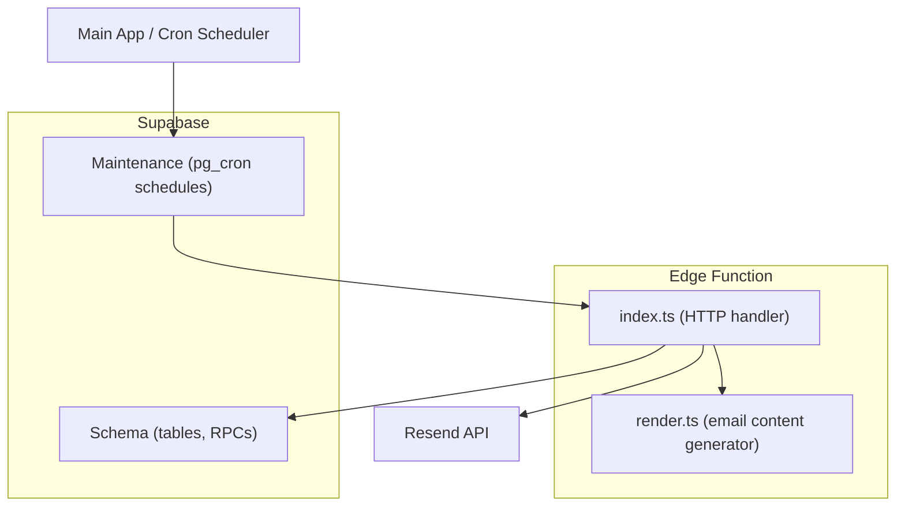
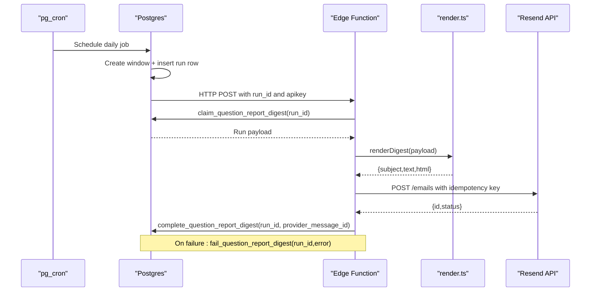
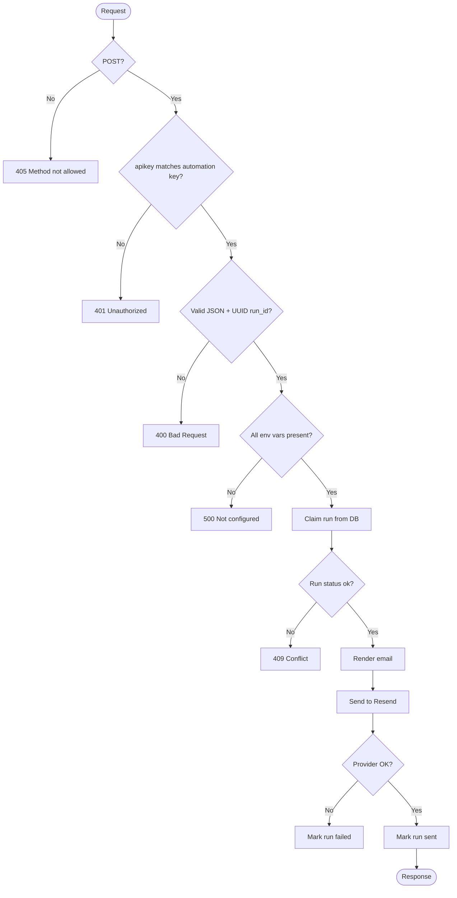
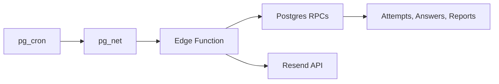

# Edge Functions and Background Processing

<cite>
**Referenced Files in This Document**
- [index.ts](file://supabase/functions/question-report-digest/index.ts)
- [render.ts](file://supabase/functions/question-report-digest/render.ts)
- [render.test.ts](file://supabase/functions/question-report-digest/render.test.ts)
- [config.toml](file://supabase/config.toml)
- [schema.sql](file://supabase/schema.sql)
- [schema_v2_reports.sql](file://supabase/schema_v2_reports.sql)
- [maintenance.sql](file://supabase/maintenance.sql)
- [TECHNICAL_REQUIREMENTS_V3.md](file://docs/TECHNICAL_REQUIREMENTS_V3.md)
</cite>

## Table of Contents
1. [Introduction](#introduction)
2. [Project Structure](#project-structure)
3. [Core Components](#core-components)
4. [Architecture Overview](#architecture-overview)
5. [Detailed Component Analysis](#detailed-component-analysis)
6. [Dependency Analysis](#dependency-analysis)
7. [Performance Considerations](#performance-considerations)
8. [Troubleshooting Guide](#troubleshooting-guide)
9. [Conclusion](#conclusion)
10. [Appendices](#appendices)

## Introduction
This document explains how the Supabase Edge Function for question report digests performs background processing and integrates with Resend.com to deliver automated email reports. It covers the HTTP entry point, email rendering, scheduling via pg_cron, environment configuration, error handling, security posture, input validation, rate limiting, and the relationship between the function and the database schema that stores user attempts, answers, and question reports.

## Project Structure
The digest feature spans three primary areas:
- Edge Function code under supabase/functions/question-report-digest
- Database schema and scheduled jobs under supabase
- Documentation describing deployment and operational requirements under docs



**Diagram sources**
- [maintenance.sql:75-152](file://supabase/maintenance.sql#L75-L152)
- [index.ts:27-118](file://supabase/functions/question-report-digest/index.ts#L27-L118)
- [render.ts:66-127](file://supabase/functions/question-report-digest/render.ts#L66-L127)
- [schema.sql:16-142](file://supabase/schema.sql#L16-L142)

**Section sources**
- [config.toml:1-5](file://supabase/config.toml#L1-L5)
- [maintenance.sql:75-152](file://supabase/maintenance.sql#L75-L152)
- [index.ts:27-118](file://supabase/functions/question-report-digest/index.ts#L27-L118)
- [render.ts:66-127](file://supabase/functions/question-report-digest/render.ts#L66-L127)
- [schema.sql:16-142](file://supabase/schema.sql#L16-L142)

## Core Components
- HTTP entry point: index.ts handles POST requests, validates authentication and inputs, claims a pending run from the database, renders an email, sends it via Resend, and updates the run status.
- Email renderer: render.ts builds subject, plain text, and HTML bodies from a structured payload, safely escaping untrusted content and formatting dates and labels.
- Scheduling and outbox: maintenance.sql defines pg_cron jobs that create fixed windows of report activity, queue runs, and retry failed deliveries. The database tracks run state and errors.
- Schema integration: schema.sql and schema_v2_reports.sql define tables for attempts, answers, events, and question reports; these provide the data used to build personalized reports.

Key responsibilities:
- Authentication and authorization at the edge function boundary
- Idempotent delivery using provider idempotency keys and database outbox
- Safe rendering of untrusted comments into HTML and plain text
- Robust error handling with clear status codes and database logging

**Section sources**
- [index.ts:14-118](file://supabase/functions/question-report-digest/index.ts#L14-L118)
- [render.ts:1-127](file://supabase/functions/question-report-digest/render.ts#L1-L127)
- [maintenance.sql:75-152](file://supabase/maintenance.sql#L75-L152)
- [schema_v2_reports.sql:27-67](file://supabase/schema_v2_reports.sql#L27-L67)

## Architecture Overview
The system uses a database-driven outbox pattern with scheduled jobs to trigger the Edge Function. The function is private (JWT verification disabled) and protected by a named automation secret passed in the apikey header.



**Diagram sources**
- [maintenance.sql:87-152](file://supabase/maintenance.sql#L87-L152)
- [index.ts:27-118](file://supabase/functions/question-report-digest/index.ts#L27-L118)
- [render.ts:66-127](file://supabase/functions/question-report-digest/render.ts#L66-L127)

## Detailed Component Analysis

### HTTP Entry Point: index.ts
Responsibilities:
- Enforce method and authentication via apikey header against configured secrets
- Validate request body and run_id format
- Load environment variables for Supabase URL, Resend key, sender, and recipient
- Claim a run from the database and ensure it is in the expected state
- Render the email using render.ts
- Send email to Resend with an idempotency key derived from the run ID
- Update run state to sent on success or failed on any error path

Error handling:
- Configuration errors return 500
- Unauthorized returns 401
- Invalid JSON or run_id returns 400
- Provider network errors mark the run as failed and return 502
- Provider HTTP failures record provider error details and return 502
- Finalization failures return 500 while acknowledging the email may have been delivered

Security considerations:
- JWT verification disabled; access controlled by a named automation secret
- Secrets loaded from Deno environment variables
- Service role client used for database RPCs
- No sensitive data logged; provider errors are sanitized before storage

Input validation:
- Strict JSON parsing
- UUID format check for run_id
- Environment presence checks for required keys

Rate limiting:
- Not implemented in the function itself; relies on scheduler and database outbox to avoid duplicate work



**Diagram sources**
- [index.ts:27-118](file://supabase/functions/question-report-digest/index.ts#L27-L118)

**Section sources**
- [index.ts:14-118](file://supabase/functions/question-report-digest/index.ts#L14-L118)

### Email Renderer: render.ts
Responsibilities:
- Define types for the digest payload and individual report entries
- Escape all untrusted values to prevent XSS in HTML output
- Format dates consistently in WIB timezone
- Build localized subjects and summaries
- Generate both plain text and HTML versions of the digest
- Handle zero-report scenarios to confirm automation health

Complexity:
- Rendering iterates over reports once; time complexity O(n) where n is number of reports
- HTML generation includes per-report sections; bounded by truncation policy enforced upstream

Security:
- All user-provided fields are escaped before insertion into HTML
- Comments are never logged; only rendered into email content

```mermaid
classDiagram
class DigestReport {
+string question_id
+number package_id
+string subtest
+number number
+number|nullable question_version
+boolean is_current_revision
+string reason
+string status
+string|nullable selected_option
+string comment
+string created_at
+string updated_at
}
class DigestPayload {
+string window_start
+string window_end
+number activity_count
+number open_backlog_count
+number truncated_count
+Record~string,number~ reason_summary
+DigestReport[] reports
}
class Renderer {
+escapeHtml(value) string
+renderDigest(payload) {subject,text,html}
}
Renderer --> DigestPayload : "consumes"
DigestPayload --> DigestReport : "contains"
```

**Diagram sources**
- [render.ts:1-127](file://supabase/functions/question-report-digest/render.ts#L1-L127)

**Section sources**
- [render.ts:1-127](file://supabase/functions/question-report-digest/render.ts#L1-L127)
- [render.test.ts:1-43](file://supabase/functions/question-report-digest/render.test.ts#L1-L43)

### Scheduling and Outbox: maintenance.sql
Responsibilities:
- Enable pg_cron and pg_net extensions
- Schedule daily job to create a fixed outbox window and invoke the Edge Function
- Schedule a retry job every 30 minutes to re-invoke unsent runs without creating new windows
- Use Vault secrets for project URL and automation key
- Protect against race conditions using advisory locks

Operational notes:
- Daily job runs at a fixed UTC time
- Retry job ensures at-least-once delivery with idempotent provider calls
- Errors and last run details can be inspected via cron job logs

**Section sources**
- [maintenance.sql:18-167](file://supabase/maintenance.sql#L18-L167)

### Database Schema Integration
The function reads and writes state through RPCs defined in the schema layer:
- claim_question_report_digest: atomically claims a pending run and marks it sending
- complete_question_report_digest: marks a run as sent and records provider message id
- fail_question_report_digest: marks a run as failed and stores error context

Data relationships relevant to reports:
- Attempts and section attempts capture user exam sessions and timing
- Answers store per-question selections and doubt flags
- Answer events log interactions for each attempt
- Question reports capture user-reported issues with questions, reasons, comments, and selected options
- RLS policies restrict access so users can only see their own data

These tables enable personalized reports based on exam performance metrics such as:
- Activity counts within the reporting window
- Open backlog counts
- Reason summaries aggregated across reports
- Per-report details including question identifiers, subtests, numbers, revisions, statuses, selected options, timestamps, and comments

**Section sources**
- [schema.sql:64-142](file://supabase/schema.sql#L64-L142)
- [schema_v2_reports.sql:27-67](file://supabase/schema_v2_reports.sql#L27-L67)

## Dependency Analysis
- Edge Function depends on:
  - Supabase service role client for RPC calls
  - Resend API for email delivery
  - Environment variables for secrets and endpoints
- Database depends on:
  - pg_cron for scheduling
  - pg_net for outbound HTTP requests from SQL
  - Vault for encrypted secrets
- UI/main application triggers:
  - Indirectly via scheduled jobs rather than direct HTTP calls
  - Acceptance criteria specify no public endpoint for digest delivery



**Diagram sources**
- [maintenance.sql:18-152](file://supabase/maintenance.sql#L18-L152)
- [index.ts:58-118](file://supabase/functions/question-report-digest/index.ts#L58-L118)
- [schema.sql:64-142](file://supabase/schema.sql#L64-L142)

**Section sources**
- [maintenance.sql:18-152](file://supabase/maintenance.sql#L18-L152)
- [index.ts:58-118](file://supabase/functions/question-report-digest/index.ts#L58-L118)

## Performance Considerations
- Rendering is linear in the number of reports; upstream truncation limits detail rows to keep emails within runtime constraints
- Date formatting and localization use efficient Intl APIs
- Network calls to Resend include an idempotency key to avoid duplicate emails during retries
- Database operations are atomic and guarded by advisory locks to prevent concurrent scheduling races
- Error paths minimize side effects and preserve the original window until successful completion

[No sources needed since this section provides general guidance]

## Troubleshooting Guide
Common issues and diagnostics:
- Function not configured: verify SUPABASE_URL, RESEND_API_KEY, REPORT_DIGEST_TO, REPORT_DIGEST_FROM, and automation/admin keys
- Unauthorized: ensure the caller passes the correct apikey header matching the configured automation key
- Invalid JSON or run_id: validate request body and UUID format
- Unable to claim digest run: check database run state and whether another worker already claimed it
- Email provider unavailable: inspect network connectivity and Resend availability; function will mark run as failed
- Email delivery failed: review stored provider error details in the database; check Resend response status and message
- Email sent but delivery state not recorded: finalization RPC failed; consider retrying or manual resolution

Monitoring:
- Inspect cron job runs and failures via cron job details
- Check net._http_response for outbound request outcomes
- Review Edge Function logs for runtime errors and responses
- Query question_report_digest_runs for run states and errors

**Section sources**
- [index.ts:27-118](file://supabase/functions/question-report-digest/index.ts#L27-L118)
- [maintenance.sql:142-167](file://supabase/maintenance.sql#L142-L167)

## Conclusion
The question report digest Edge Function implements a secure, idempotent, and reliable background processing pipeline. It combines a database outbox with scheduled jobs to generate and send personalized email reports summarizing exam performance metrics and user-reported issues. Security is enforced via a named automation secret, strict input validation, and safe rendering of untrusted content. Error handling ensures failures are recorded and retried without duplicating deliveries. The design keeps the main application decoupled from delivery concerns while providing clear observability and operational controls.

[No sources needed since this section summarizes without analyzing specific files]

## Appendices

### Deployment and Environment Configuration
- Deploy the Edge Function with JWT verification disabled and configure secrets:
  - Set RESEND_API_KEY, REPORT_DIGEST_TO, REPORT_DIGEST_FROM
  - Configure named automation secret and project URL in Vault for pg_net
- Apply schema migrations in order: base schema, reports schema, v3 schema, then maintenance to schedule jobs
- Verify Resend sender domain is verified for REPORT_DIGEST_FROM

**Section sources**
- [TECHNICAL_REQUIREMENTS_V3.md:347-365](file://docs/TECHNICAL_REQUIREMENTS_V3.md#L347-L365)
- [config.toml:1-5](file://supabase/config.toml#L1-L5)
- [maintenance.sql:75-152](file://supabase/maintenance.sql#L75-L152)

### Triggering Background Jobs from the Main Application
- The main application does not directly call the Edge Function for digest delivery; instead, pg_cron schedules the queue job which invokes the function
- For other background tasks, follow the same pattern: create an outbox table, schedule a job to enqueue work, and process via Edge Functions or workers

**Section sources**
- [maintenance.sql:75-152](file://supabase/maintenance.sql#L75-L152)

### Monitoring Function Execution
- Use cron job details to observe last runs and failures
- Check network response logs for outbound requests
- Review Edge Function logs for runtime errors
- Inspect database outbox table for run states and errors

**Section sources**
- [maintenance.sql:142-167](file://supabase/maintenance.sql#L142-L167)

### Security Considerations
- Private function with apikey-based authentication
- Secrets managed via environment variables and Vault
- No historical key oracle exposure; reviews and exams do not leak answer keys
- Comments are escaped and omitted from logs to prevent XSS and leakage
- Provider errors are sanitized before storage

**Section sources**
- [index.ts:14-38](file://supabase/functions/question-report-digest/index.ts#L14-L38)
- [render.ts:41-48](file://supabase/functions/question-report-digest/render.ts#L41-L48)
- [TECHNICAL_REQUIREMENTS_V3.md:367-377](file://docs/TECHNICAL_REQUIREMENTS_V3.md#L367-L377)

### Input Validation and Rate Limiting
- Strict JSON parsing and UUID validation for run_id
- Environment presence checks for required keys
- Rate limiting is achieved via scheduler and database outbox; no additional in-function throttling

**Section sources**
- [index.ts:40-57](file://supabase/functions/question-report-digest/index.ts#L40-L57)

### Relationship to Database Schema
- Uses attempts, section_attempts, answers, answer_events, and question_reports to build personalized reports
- RLS policies ensure users can only access their own data
- RPCs encapsulate mutations and maintain consistency of run states

**Section sources**
- [schema.sql:64-142](file://supabase/schema.sql#L64-L142)
- [schema_v2_reports.sql:27-67](file://supabase/schema_v2_reports.sql#L27-L67)