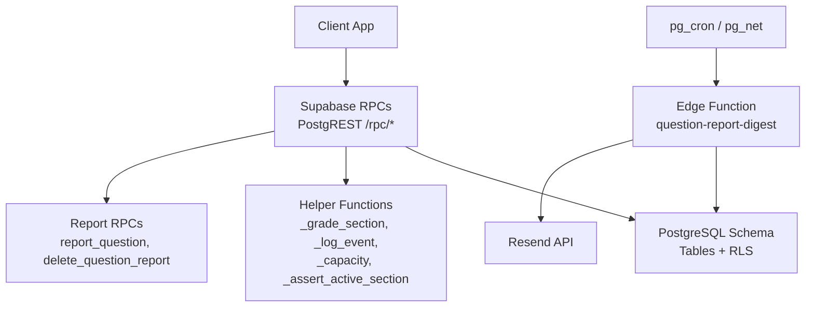
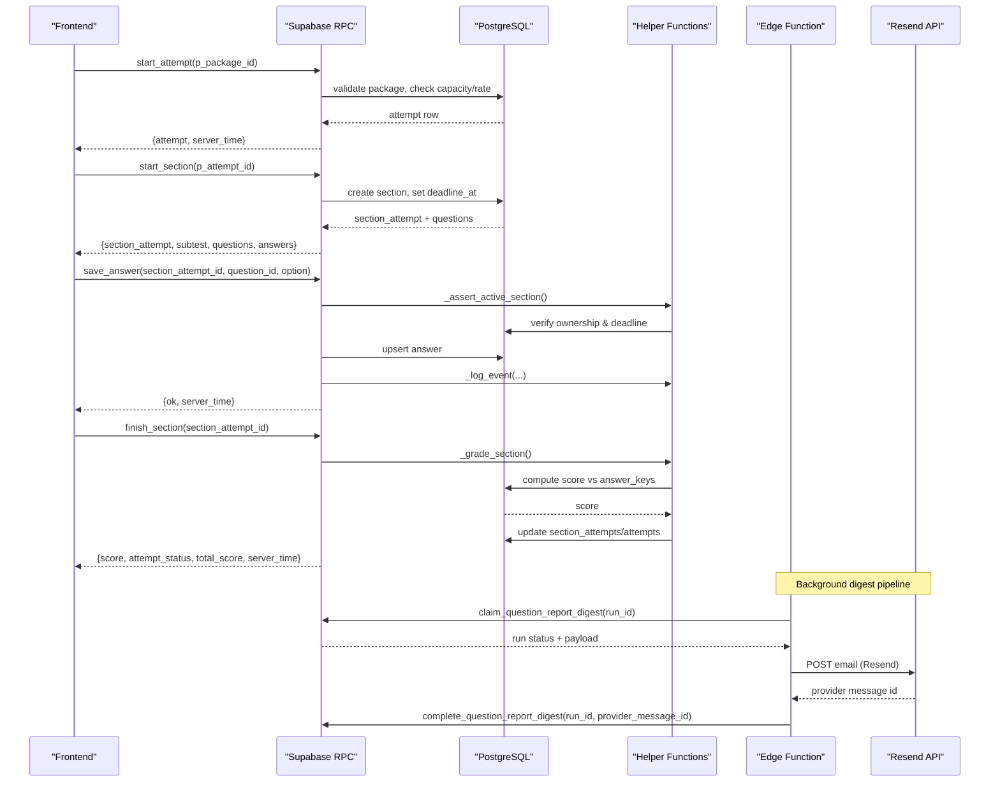
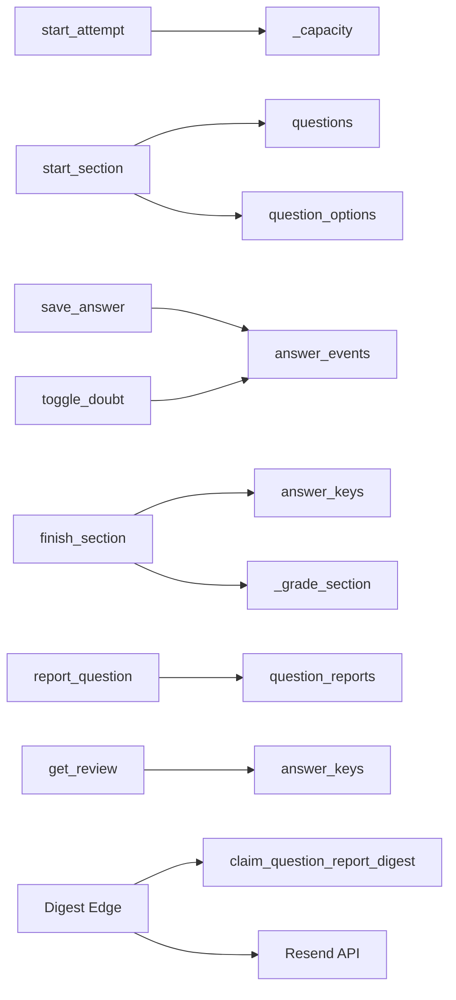

# RPC Functions and Server-Side Logic

<cite>
**Referenced Files in This Document**
- [schema.sql](file://supabase/schema.sql)
- [schema_v2_reports.sql](file://supabase/schema_v2_reports.sql)
- [schema_v3.sql](file://supabase/schema_v3.sql)
- [index.ts](file://supabase/functions/question-report-digest/index.ts)
- [render.ts](file://supabase/functions/question-report-digest/render.ts)
- [TECHNICAL_REQUIREMENTS.md](file://docs/TECHNICAL_REQUIREMENTS.md)
- [TECHNICAL_REQUIREMENTS_V2.md](file://docs/TECHNICAL_REQUIREMENTS_V2.md)
- [TECHNICAL_REQUIREMENTS_V3.md](file://docs/TECHNICAL_REQUIREMENTS_V3.md)
</cite>

## Table of Contents
1. [Introduction](#introduction)
2. [Project Structure](#project-structure)
3. [Core Components](#core-components)
4. [Architecture Overview](#architecture-overview)
5. [Detailed Component Analysis](#detailed-component-analysis)
6. [Dependency Analysis](#dependency-analysis)
7. [Performance Considerations](#performance-considerations)
8. [Troubleshooting Guide](#troubleshooting-guide)
9. [Conclusion](#conclusion)
10. [Appendices](#appendices)

## Introduction
This document provides comprehensive server-side RPC function documentation for the exam system. It covers stored procedures and functions that implement attempt submission, answer validation, scoring algorithms, report generation, and background processing via Edge Functions. It explains how running exam logic server-side prevents cheating and ensures fair assessment by centralizing time enforcement, grading, and access to sensitive data such as correct answers and explanations. It also documents integration with Resend.com for email delivery of question report digests, outlines function versioning across schema migrations, and describes testing strategies and debugging approaches for server-side code execution.

## Project Structure
The server-side logic is implemented primarily in Supabase:
- Database schema, Row Level Security policies, helper functions, and RPCs are defined in SQL migration files.
- Background processing (email digest) is implemented as a Deno-based Edge Function that calls database RPCs and an external email provider.

**Diagram sources**
- [schema.sql:185-337](file://supabase/schema.sql#L185-L337)
- [schema.sql:339-657](file://supabase/schema.sql#L339-L657)
- [schema_v2_reports.sql:90-200](file://supabase/schema_v2_reports.sql#L90-L200)
- [schema_v3.sql:1771-1806](file://supabase/schema_v3.sql#L1771-L1806)
- [index.ts:27-118](file://supabase/functions/question-report-digest/index.ts#L27-L118)

**Section sources**
- [schema.sql:14-142](file://supabase/schema.sql#L14-L142)
- [schema.sql:185-337](file://supabase/schema.sql#L185-L337)
- [schema_v2_reports.sql:27-66](file://supabase/schema_v2_reports.sql#L27-L66)
- [schema_v3.sql:14-24](file://supabase/schema_v3.sql#L14-L24)
- [index.ts:14-25](file://supabase/functions/question-report-digest/index.ts#L14-L25)

## Core Components
- Attempt lifecycle RPCs: start_attempt, start_section, save_answer, toggle_doubt, finish_section, get_attempt_state, get_review.
- Scoring and grading: _grade_section invoked by finish_section and deadline sweeps; integrates with answer_keys to compute scores.
- Event logging: _log_event records user interactions with bounded storage to prevent abuse.
- Capacity guard: _capacity and _refresh_capacity measure usage and enforce soft limits to protect free-tier capacity.
- Report management: report_question and delete_question_report capture user-reported issues with strict input validation and rate limiting.
- Versioned review: get_review returns per-question details including keys and explanations only for finished sections owned by the caller.
- Background digest: claim_question_report_digest, fail_question_report_digest, complete_question_report_digest manage outbox state for email delivery.

**Section sources**
- [schema.sql:185-337](file://supabase/schema.sql#L185-L337)
- [schema.sql:339-657](file://supabase/schema.sql#L339-L657)
- [schema_v2_reports.sql:90-200](file://supabase/schema_v2_reports.sql#L90-L200)
- [schema_v3.sql:1771-1806](file://supabase/schema_v3.sql#L1771-L1806)

## Architecture Overview
The system enforces security and fairness by keeping all exam logic server-side:
- Clients never write tables directly; all mutations go through authenticated RPCs.
- Correct answers and explanations are never exposed to clients except in controlled review flows after completion.
- Time enforcement is trusted server-side using deadlines computed in Postgres; client timers are cosmetic.
- Storage capacity and per-user rate limits prevent abuse and protect service stability.

**Diagram sources**
- [schema.sql:339-580](file://supabase/schema.sql#L339-L580)
- [schema.sql:185-337](file://supabase/schema.sql#L185-L337)
- [schema_v3.sql:1771-1806](file://supabase/schema_v3.sql#L1771-L1806)
- [index.ts:60-118](file://supabase/functions/question-report-digest/index.ts#L60-L118)

## Detailed Component Analysis

### Attempt Submission and Section Management
- start_attempt(p_package_id): Creates or resumes an active attempt for the authenticated user. Validates package existence/published status, checks global storage capacity and per-user hourly attempt budget, then inserts an attempt row. Returns attempt metadata and server time.
- start_section(p_attempt_id): Sweeps overdue sections, resumes active section if present, otherwise creates next unstarted subtest with deadline_at based on subtest duration. Returns section_attempt, subtest, questions (without keys), and existing answers.
- get_attempt_state(p_attempt_id): Returns attempt and its sections for resume flow.

Security benefits:
- Prevents direct table writes from clients.
- Enforces deadlines and ownership at the database layer.
- Protects against scripted abuse via capacity and rate limits.

Error handling patterns:
- Uses custom error codes (e.g., P0002 not found, P0005 too many attempts, P0007 storage capacity reached).
- Throws exceptions when authentication is missing or resources are invalid.

**Section sources**
- [schema.sql:339-415](file://supabase/schema.sql#L339-L415)
- [schema.sql:417-493](file://supabase/schema.sql#L417-L493)
- [schema.sql:582-607](file://supabase/schema.sql#L582-L607)
- [TECHNICAL_REQUIREMENTS.md:150-162](file://docs/TECHNICAL_REQUIREMENTS.md#L150-L162)

### Answer Validation and Doubt Toggling
- save_answer(p_section_attempt_id, p_question_id, p_option): Validates section activity and ownership via _assert_active_section, validates option values, ensures question belongs to the section, upserts answer, logs event, returns ok.
- toggle_doubt(p_section_attempt_id, p_question_id, p_doubtful): Validates section activity and ownership, updates doubt flag, logs mark/unmark events, returns ok.

Security benefits:
- Only allows modifications within active sections owned by the caller.
- Logs interactions to detect anomalies while bounding event growth.

Error handling patterns:
- Rejects invalid options and questions not in the section.
- Raises exceptions for inactive or finished sections.

**Section sources**
- [schema.sql:495-549](file://supabase/schema.sql#L495-L549)
- [schema.sql:241-260](file://supabase/schema.sql#L241-L260)

### Scoring Algorithms and Grading
- _grade_section(p_section_attempt_id): Computes score by joining answers with answer_keys, updates section status to finished with score, logs finish event, and closes the overall attempt when all subtests are finished by summing section scores.
- finish_section(p_section_attempt_id): Calls _grade_section and returns score, attempt status, and total score.

Security benefits:
- Centralized grading ensures consistent scoring and prevents client-side manipulation.
- Access to answer_keys is restricted; only server-side functions can read them.

Error handling patterns:
- Idempotent: re-grading an already finished section preserves stored score.
- Raises exceptions for unauthorized access or invalid states.

**Section sources**
- [schema.sql:185-239](file://supabase/schema.sql#L185-L239)
- [schema.sql:551-580](file://supabase/schema.sql#L551-L580)

### Report Generation and Question Feedback
- report_question(p_question_id, p_reason, p_comment, p_attempt_id): Validates inputs, enforces rolling-hour write budget, gates reporting to users who have finished sections containing the question, upserts report with content hash, returns report metadata.
- delete_question_report(p_question_id): Idempotent deletion of user’s own report.
- get_review(p_attempt_id): Returns attempt and finished sections with per-question details including selected_option, correct_option, explanations, and my_report (user’s own report only).

Security benefits:
- No exposure of answer_keys outside controlled review flows.
- One report per user per question (or per revision in v3) prevents spam.
- Strict input validation and length caps protect integrity.

Error handling patterns:
- Custom error codes for unknown reasons, comment length, and availability.
- Rate limiting returns specific errors to guide retries.

**Section sources**
- [schema_v2_reports.sql:90-200](file://supabase/schema_v2_reports.sql#L90-L200)
- [schema_v2_reports.sql:207-261](file://supabase/schema_v2_reports.sql#L207-L261)
- [TECHNICAL_REQUIREMENTS_V2.md:58-96](file://docs/TECHNICAL_REQUIREMENTS_V2.md#L58-L96)

### Background Processing: Question Report Digest Edge Function
- Edge Function index.ts: Accepts POST with run_id, claims a pending or failed digest run via RPC, renders digest content, sends email via Resend, and marks completion or failure.
- render.ts: Renders text and HTML safely with HTML escaping, formats dates, and constructs subject/body for emails.

Integration points:
- Supabase RPCs: claim_question_report_digest, fail_question_report_digest, complete_question_report_digest.
- External service: Resend API with idempotency key per run.

Security benefits:
- Service-to-service authentication via named automation key.
- Secrets managed via environment variables; no credentials in code.
- Idempotent delivery via provider-level deduplication and run state tracking.

Error handling patterns:
- Validates method, headers, JSON body, run_id format.
- Returns appropriate HTTP status codes for configuration, authorization, and provider errors.
- Records failures back to the database for retry or manual attention.

**Section sources**
- [index.ts:27-118](file://supabase/functions/question-report-digest/index.ts#L27-L118)
- [render.ts:41-128](file://supabase/functions/question-report-digest/render.ts#L41-L128)
- [schema_v3.sql:1771-1806](file://supabase/schema_v3.sql#L1771-L1806)

### Function Versioning Across Migrations
- v1 (schema.sql): Base tables, RLS, core RPCs (_grade_section, _log_event, _capacity, start_attempt, start_section, save_answer, toggle_doubt, finish_section, get_attempt_state, get_review).
- v2 (schema_v2_reports.sql): Adds question_reports table, report_question, delete_question_report, enhanced get_review with my_report field.
- v3 (schema_v3.sql): Introduces immutable revisions, package releases, statistics, and digest outbox RPCs (claim/fail/complete_question_report_digest); updates report uniqueness to revision-aware.

Versioning strategy:
- Each migration is idempotent and must be applied in order.
- Grants and RPC definitions may be re-applied; v3 owns final definitions and grants.
- Backward compatibility considerations exist for frontend and report signatures.

**Section sources**
- [schema.sql:1-12](file://supabase/schema.sql#L1-L12)
- [schema_v2_reports.sql:1-21](file://supabase/schema_v2_reports.sql#L1-L21)
- [schema_v3.sql:1-12](file://supabase/schema_v3.sql#L1-L12)
- [TECHNICAL_REQUIREMENTS_V3.md:277-290](file://docs/TECHNICAL_REQUIREMENTS_V3.md#L277-L290)

## Dependency Analysis
The RPCs depend on helper functions and tables with strict RLS:
- start_attempt depends on packages, attempts, service_capacity, and capacity helpers.
- start_section depends on attempts, section_attempts, subtests, questions, question_options.
- save_answer/toggle_doubt depend on answers, answer_events, and _assert_active_section.
- finish_section/_grade_section depend on answers, answer_keys, section_attempts, attempts.
- report_question depends on question_reports, answers, and review gate predicates.
- Digest Edge Function depends on digest outbox RPCs and Resend API.

**Diagram sources**
- [schema.sql:339-580](file://supabase/schema.sql#L339-L580)
- [schema_v2_reports.sql:90-200](file://supabase/schema_v2_reports.sql#L90-L200)
- [schema_v3.sql:1771-1806](file://supabase/schema_v3.sql#L1771-L1806)
- [index.ts:60-118](file://supabase/functions/question-report-digest/index.ts#L60-L118)

**Section sources**
- [schema.sql:185-337](file://supabase/schema.sql#L185-L337)
- [schema.sql:339-657](file://supabase/schema.sql#L339-L657)
- [schema_v2_reports.sql:90-200](file://supabase/schema_v2_reports.sql#L90-L200)
- [schema_v3.sql:1771-1806](file://supabase/schema_v3.sql#L1771-L1806)

## Performance Considerations
- Capacity measurement uses O(1) operations (pg_database_size and planner estimates) and caches results for five minutes to avoid expensive scans.
- Event logging is capped per section to bound storage growth and prevent abuse.
- Per-user hourly budgets limit rapid creation of attempts and reports.
- Review queries aggregate JSON efficiently but should be used judiciously for large datasets.

[No sources needed since this section provides general guidance]

## Troubleshooting Guide
Common error codes and their meanings:
- P0002: Not found (package, attempt, section, question not available for reporting).
- P0003: Section already finished.
- P0004: Section deadline passed.
- P0005: Too many attempts or reports (rate limit exceeded).
- P0006: Invalid input (unknown reason, comment too long, other without comment, invalid package metadata).
- P0007: Storage capacity reached.

Debugging approaches:
- Inspect answer_events for interaction history and anomalies.
- Check service_capacity snapshot and measured_at timestamps.
- Validate Edge Function secrets and environment configuration.
- Use Supabase SQL editor to query digest runs and their statuses.

**Section sources**
- [schema.sql:311-337](file://supabase/schema.sql#L311-L337)
- [schema_v2_reports.sql:110-144](file://supabase/schema_v2_reports.sql#L110-L144)
- [TECHNICAL_REQUIREMENTS_V2.md:86-96](file://docs/TECHNICAL_REQUIREMENTS_V2.md#L86-L96)

## Conclusion
Running exam logic server-side via Supabase RPCs ensures fairness and security by centralizing time enforcement, grading, and access to sensitive materials. The architecture combines robust database constraints, Row Level Security, helper functions, and background Edge Functions to deliver a resilient, scalable system. Versioned migrations support evolution while maintaining backward compatibility. Testing and debugging are facilitated by explicit error codes, event logging, and operational visibility into capacity and digest pipelines.

[No sources needed since this section summarizes without analyzing specific files]

## Appendices

### RPC Function Signatures and Behavior Summary
- start_attempt(p_package_id integer) → json: attempt row, server_time. Validates auth, package published, capacity, rate limit.
- start_section(p_attempt_id uuid) → json: section_attempt, subtest, questions, answers, server_time. Sets deadline_at, sweeps overdue sections.
- save_answer(p_section_attempt_id uuid, p_question_id text, p_option char) → json: ok, server_time. Validates section, option, question membership; logs event.
- toggle_doubt(p_section_attempt_id uuid, p_question_id text, p_doubtful boolean) → json: ok, server_time. Updates doubt flag; logs event.
- finish_section(p_section_attempt_id uuid) → json: score, attempt_status, total_score, server_time. Grades via answer_keys; closes attempt if complete.
- get_attempt_state(p_attempt_id uuid) → json: attempt, sections, server_time. Resume state.
- get_review(p_attempt_id uuid) → json: attempt, sections with questions, selected_option, correct_option, explanations, my_report. Only finished sections.
- report_question(p_question_id text, p_reason text, p_comment text default '', p_attempt_id uuid default null) → json: report metadata, server_time. Validates inputs, rate limits, review gate.
- delete_question_report(p_question_id text) → json: deleted boolean, server_time. Idempotent.
- claim_question_report_digest(p_run_id uuid) → json: run status and payload. Outbox claim.
- fail_question_report_digest(p_run_id uuid, p_error text) → void: Marks run failed with error.
- complete_question_report_digest(p_run_id uuid, p_provider_message_id text) → void: Marks run sent with provider id.

**Section sources**
- [schema.sql:339-657](file://supabase/schema.sql#L339-L657)
- [schema_v2_reports.sql:90-200](file://supabase/schema_v2_reports.sql#L90-L200)
- [schema_v3.sql:1771-1806](file://supabase/schema_v3.sql#L1771-L1806)

### Security Benefits of Server-Side Exam Logic
- Prevents answer leakage: answer_keys are never exposed to clients except in controlled review flows.
- Enforces timing: deadlines computed server-side; client timers are cosmetic.
- Limits abuse: capacity guards and rate limits protect free-tier resources.
- Ensures fairness: centralized grading and audit trails via answer_events.

**Section sources**
- [schema.sql:131-182](file://supabase/schema.sql#L131-L182)
- [schema.sql:185-337](file://supabase/schema.sql#L185-L337)
- [TECHNICAL_REQUIREMENTS.md:164-169](file://docs/TECHNICAL_REQUIREMENTS.md#L164-L169)

### Integration with Resend.com for Email Delivery
- Edge Function authenticates via named automation key and service role secret.
- Sends emails to configured recipient with subject/text/html rendered safely.
- Uses idempotency key per run to handle retries gracefully.
- Records success or failure back to the database for observability and retry.

**Section sources**
- [index.ts:14-25](file://supabase/functions/question-report-digest/index.ts#L14-L25)
- [index.ts:60-118](file://supabase/functions/question-report-digest/index.ts#L60-L118)
- [render.ts:66-128](file://supabase/functions/question-report-digest/render.ts#L66-L128)

### Testing Strategies and Debugging Approaches
- Unit tests for rendering logic ensure safe HTML output and correct formatting.
- Error codes provide clear signals for frontend handling and retry policies.
- Event logs and capacity snapshots aid in diagnosing performance and abuse.
- Migration files are idempotent; re-applying ensures consistent state.

**Section sources**
- [render.test.ts:1-42](file://supabase/functions/question-report-digest/render.test.ts#L1-L42)
- [TECHNICAL_REQUIREMENTS_V2.md:86-96](file://docs/TECHNICAL_REQUIREMENTS_V2.md#L86-L96)
- [schema.sql:1-12](file://supabase/schema.sql#L1-L12)