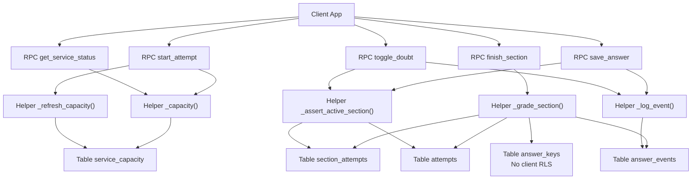
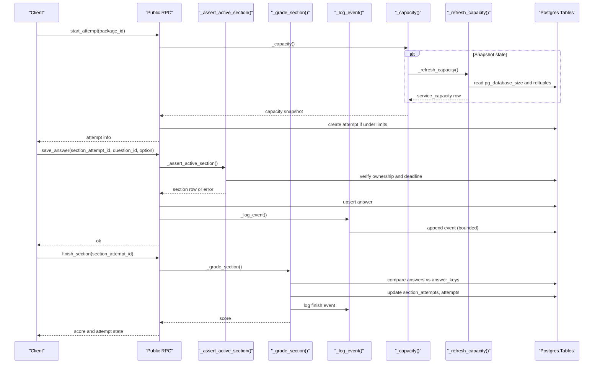
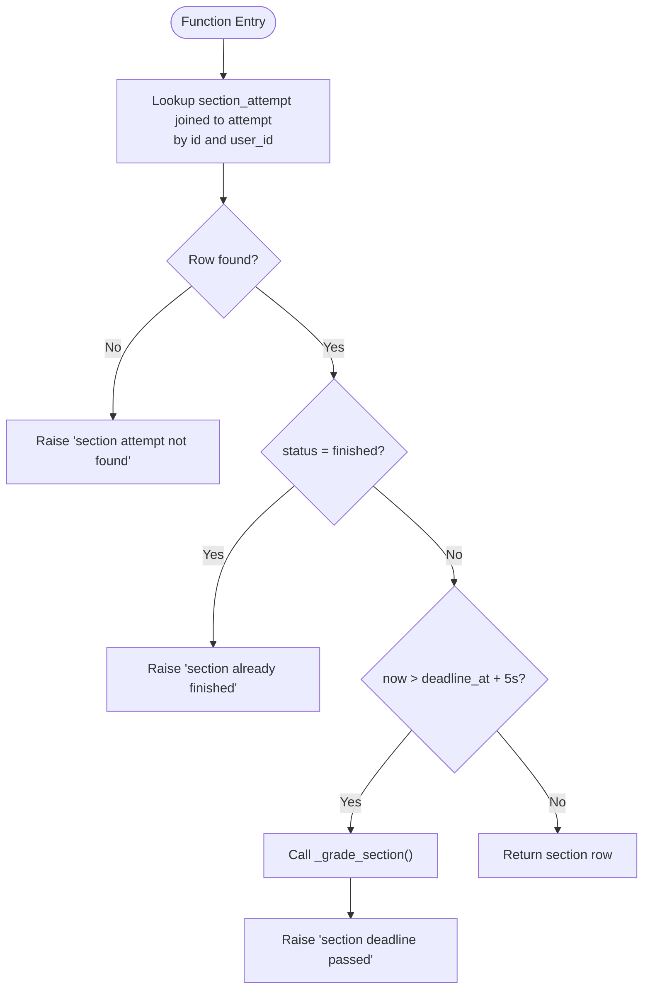
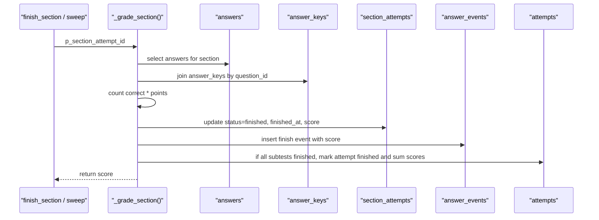
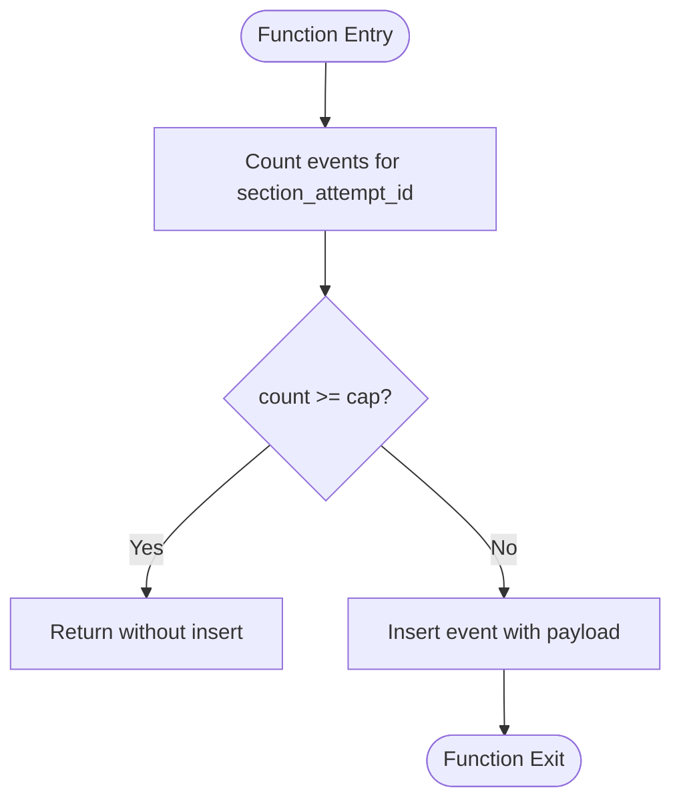
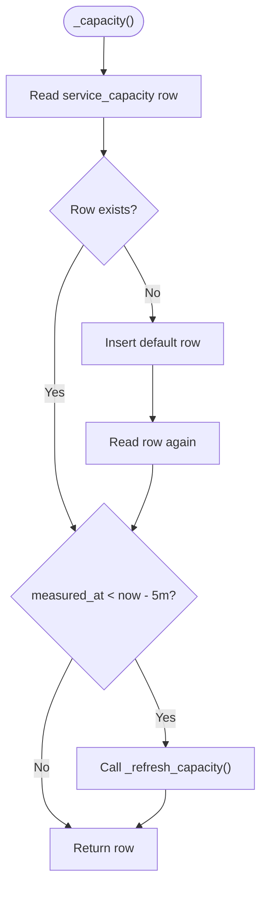
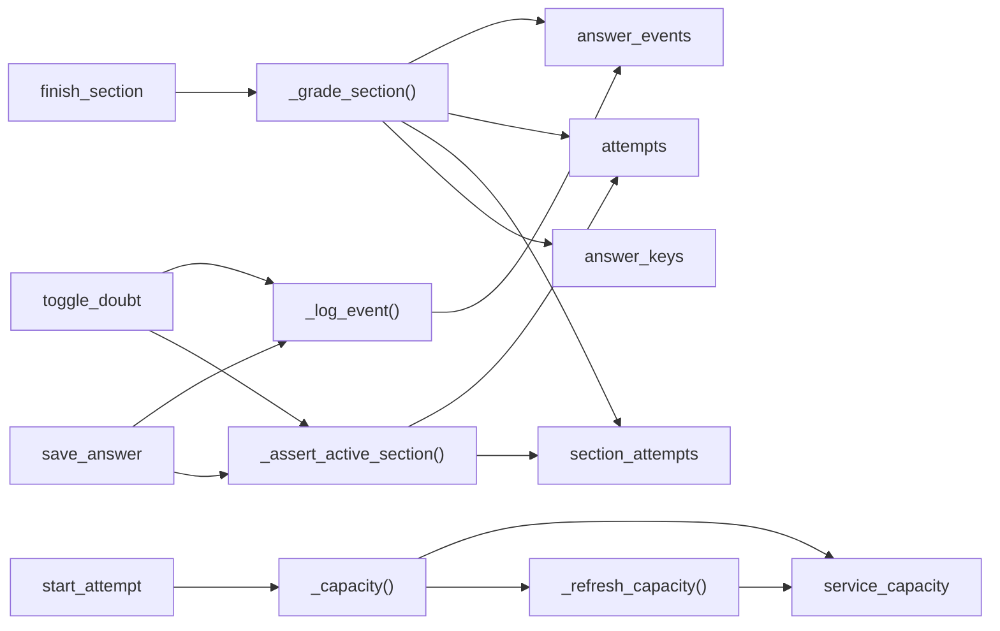

# Security Helper Functions

<cite>
**Referenced Files in This Document**
- [schema.sql](file://supabase/schema.sql)
- [maintenance.sql](file://supabase/maintenance.sql)
- [TECHNICAL_REQUIREMENTS.md](file://docs/TECHNICAL_REQUIREMENTS.md)
</cite>

## Table of Contents
1. [Introduction](#introduction)
2. [Project Structure](#project-structure)
3. [Core Components](#core-components)
4. [Architecture Overview](#architecture-overview)
5. [Detailed Component Analysis](#detailed-component-analysis)
6. [Dependency Analysis](#dependency-analysis)
7. [Performance Considerations](#performance-considerations)
8. [Troubleshooting Guide](#troubleshooting-guide)
9. [Conclusion](#conclusion)

## Introduction
This document explains the internal security helper functions that enforce exam integrity and data protection in the TBS LPDP Try Out system. These helpers are implemented as Postgres functions with a security definer context and an explicit search_path, so they execute with elevated privileges while still enforcing strict ownership and timing rules. They protect sensitive data (answer keys), ensure fair grading, generate bounded audit trails, and prevent abuse through capacity monitoring. Public RPCs call these helpers to provide a secure exam surface where clients cannot directly access or manipulate protected data.

## Project Structure
The security logic lives in the database layer:
- Data model, Row Level Security policies, and all RPCs are defined in schema.sql.
- Scheduled maintenance jobs for retention and capacity snapshots live in maintenance.sql.
- The technical requirements document describes the design constraints and guarantees that these helpers implement.

**Diagram sources**
- [schema.sql:185-337](file://supabase/schema.sql#L185-L337)
- [schema.sql:341-415](file://supabase/schema.sql#L341-L415)
- [schema.sql:417-580](file://supabase/schema.sql#L417-L580)

**Section sources**
- [schema.sql:131-182](file://supabase/schema.sql#L131-L182)
- [schema.sql:185-337](file://supabase/schema.sql#L185-L337)
- [schema.sql:341-415](file://supabase/schema.sql#L341-L415)
- [schema.sql:417-580](file://supabase/schema.sql#L417-L580)
- [maintenance.sql:41-51](file://supabase/maintenance.sql#L41-L51)
- [TECHNICAL_REQUIREMENTS.md:110-123](file://docs/TECHNICAL_REQUIREMENTS.md#L110-L123)

## Core Components
- _assert_active_section(): Validates that the caller owns an active section attempt and enforces deadline rules. If the deadline has passed, it grades the section and rejects further writes.
- _grade_section(): Securely computes a section score by comparing answers against protected answer keys, updates section status, logs a finish event, and closes the overall attempt when all sections are finished.
- _log_event(): Appends one audit event per user action with a per-section cap to bound storage growth.
- _capacity(): Returns a snapshot of project capacity metrics, refreshing if older than five minutes.
- _refresh_capacity(): Measures current database size and attempt-related row counts using O(1) metadata queries and persists them into service_capacity.

These helpers are invoked exclusively by public RPCs, which perform authentication and authorization checks before delegating to the helpers.

**Section sources**
- [schema.sql:185-337](file://supabase/schema.sql#L185-L337)
- [schema.sql:241-309](file://supabase/schema.sql#L241-L309)
- [schema.sql:341-415](file://supabase/schema.sql#L341-L415)
- [TECHNICAL_REQUIREMENTS.md:110-123](file://docs/TECHNICAL_REQUIREMENTS.md#L110-L123)

## Architecture Overview
The system uses a layered security model:
- Row Level Security (RLS) restricts direct table access to authenticated users’ own rows.
- Sensitive tables like answer_keys have no client-readable policy; access is only via server-side RPCs.
- All write paths go through RPCs that validate inputs, enforce ownership, and delegate to security definer helpers.
- Helpers run with security definer and an explicit search_path to minimize privilege escalation risk and avoid unintended object resolution.
- Capacity guards prevent new attempts once storage thresholds are reached, while existing attempts continue uninterrupted.

**Diagram sources**
- [schema.sql:341-390](file://supabase/schema.sql#L341-L390)
- [schema.sql:495-521](file://supabase/schema.sql#L495-L521)
- [schema.sql:551-580](file://supabase/schema.sql#L551-L580)
- [schema.sql:185-337](file://supabase/schema.sql#L185-L337)
- [schema.sql:241-309](file://supabase/schema.sql#L241-L309)

## Detailed Component Analysis

### _assert_active_section()
Purpose:
- Ensures the caller owns the section attempt and that it is still active.
- Enforces deadlines with a small grace window; if past deadline, grades the section and rejects further actions.

Security properties:
- Runs as security definer with search_path set to public, preventing accidental execution in other schemas.
- Uses auth.uid() to bind operations to the authenticated user, bypassing RLS safely within a trusted function.
- Raises specific error codes for not found, already finished, and deadline passed states.

Usage:
- Called by save_answer and toggle_doubt to gate writes to answers and doubt flags.

**Diagram sources**
- [schema.sql:311-337](file://supabase/schema.sql#L311-L337)

**Section sources**
- [schema.sql:311-337](file://supabase/schema.sql#L311-L337)

### _grade_section()
Purpose:
- Computes the section score by counting correct answers against the protected answer key table.
- Marks the section finished, records the finish event, and closes the overall attempt when all subtests are complete.

Security properties:
- Executes as security definer with search_path restricted to public, ensuring safe access to answer_keys without exposing it to clients.
- Idempotent: if the section is already finished, returns the stored score without regrading.

Scoring algorithm:
- For each answer in the section, join to answer_keys on question_id and count matches where selected_option equals correct_option.
- Multiply correct count by the per-question point value to compute the score.

**Diagram sources**
- [schema.sql:185-239](file://supabase/schema.sql#L185-L239)

**Section sources**
- [schema.sql:185-239](file://supabase/schema.sql#L185-L239)

### _log_event()
Purpose:
- Appends one audit event per user action (save_answer, mark_doubt, unmark_doubt, start, finish).
- Caps events per section attempt to prevent unlimited growth.

Storage limits:
- Stops appending beyond a per-section limit, ensuring bounded storage even under abusive write loops.
- Normal usage stays well below the cap; the cap protects free-tier limits.

**Diagram sources**
- [schema.sql:241-260](file://supabase/schema.sql#L241-L260)

**Section sources**
- [schema.sql:241-260](file://supabase/schema.sql#L241-L260)

### _capacity() and _refresh_capacity()
Purpose:
- Provide a capacity snapshot used to guard new attempt creation.
- _refresh_capacity() measures current database size and attempt-related row counts using O(1) metadata queries and persists results.
- _capacity() returns the latest snapshot, refreshing if older than five minutes.

Abuse prevention:
- start_attempt checks capacity before creating new attempts; existing attempts are never blocked mid-exam.
- get_service_status exposes a normalized usage percentage to the frontend for UI gating.

**Diagram sources**
- [schema.sql:262-309](file://supabase/schema.sql#L262-L309)

**Section sources**
- [schema.sql:262-309](file://supabase/schema.sql#L262-L309)
- [schema.sql:341-390](file://supabase/schema.sql#L341-L390)
- [schema.sql:392-415](file://supabase/schema.sql#L392-L415)

## Dependency Analysis
- Public RPCs depend on helpers to enforce security and business rules:
  - start_attempt depends on _capacity() and _refresh_capacity().
  - save_answer and toggle_doubt depend on _assert_active_section() and _log_event().
  - finish_section depends on _grade_section().
- Helpers depend on tables:
  - _grade_section() reads answer_keys (protected) and writes section_attempts, attempts, and answer_events.
  - _assert_active_section() reads section_attempts and attempts to verify ownership and deadlines.
  - _log_event() writes answer_events with a per-section cap.
  - _capacity()/_refresh_capacity() read and write service_capacity and use database metadata.

**Diagram sources**
- [schema.sql:185-337](file://supabase/schema.sql#L185-L337)
- [schema.sql:341-415](file://supabase/schema.sql#L341-L415)
- [schema.sql:495-580](file://supabase/schema.sql#L495-L580)

**Section sources**
- [schema.sql:185-337](file://supabase/schema.sql#L185-L337)
- [schema.sql:341-415](file://supabase/schema.sql#L341-L415)
- [schema.sql:495-580](file://supabase/schema.sql#L495-L580)

## Performance Considerations
- _refresh_capacity() uses pg_database_size and planner estimates (reltuples) to measure capacity in O(1) time regardless of table sizes.
- _capacity() caches the snapshot for five minutes to reduce overhead; it refreshes lazily when stale.
- _log_event() caps per-section events to prevent runaway growth; normal usage remains well under the cap.
- _grade_section() performs a single aggregation over answers joined to answer_keys, then updates related rows; it is idempotent to avoid repeated work.

[No sources needed since this section provides general guidance]

## Troubleshooting Guide
Common errors and their meanings:
- Section not found: Indicates invalid or missing section_attempt_id or ownership mismatch.
- Section already finished: Attempted to modify a completed section; use review flows instead.
- Section deadline passed: Time expired; the section was auto-graded and further writes are rejected.
- Storage capacity reached: New attempts are blocked due to global storage ceiling; existing attempts remain unaffected.

Operational notes:
- Maintenance jobs prune old attempts and anonymous users to control total storage.
- Capacity snapshot can be refreshed manually via _refresh_capacity() if cron is not enabled; _capacity() will self-heal on read.

**Section sources**
- [schema.sql:311-337](file://supabase/schema.sql#L311-L337)
- [schema.sql:341-390](file://supabase/schema.sql#L341-L390)
- [maintenance.sql:31-73](file://supabase/maintenance.sql#L31-L73)

## Conclusion
The security helper functions form the core of the exam integrity and data protection strategy:
- _assert_active_section() ensures ownership and deadline enforcement.
- _grade_section() securely compares answers against protected keys and finalizes scoring.
- _log_event() provides bounded audit trails to support fairness and forensics.
- _capacity() and _refresh_capacity() monitor database usage and prevent abuse while allowing ongoing attempts to complete.

Together with Row Level Security and security definer functions, these helpers create a secure environment where clients cannot directly access sensitive data or manipulate scores, maintaining fairness and data integrity across the exam lifecycle.

[No sources needed since this section summarizes without analyzing specific files]