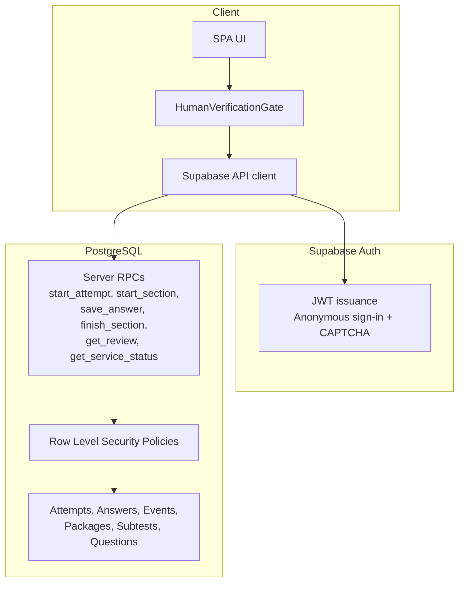
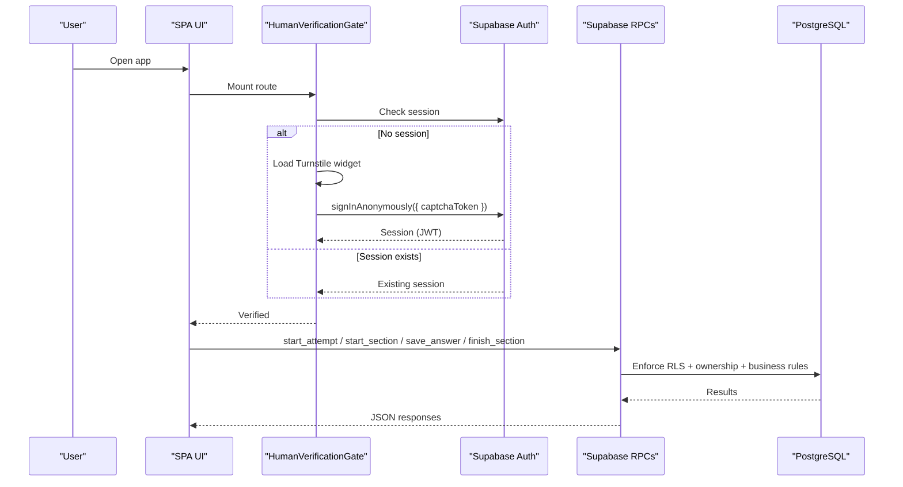
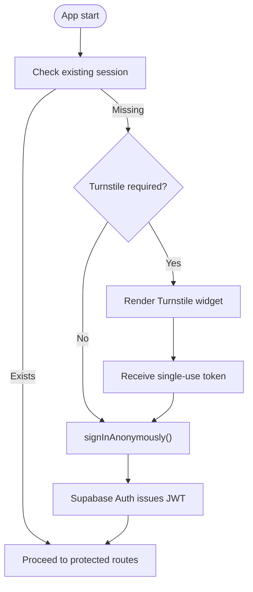
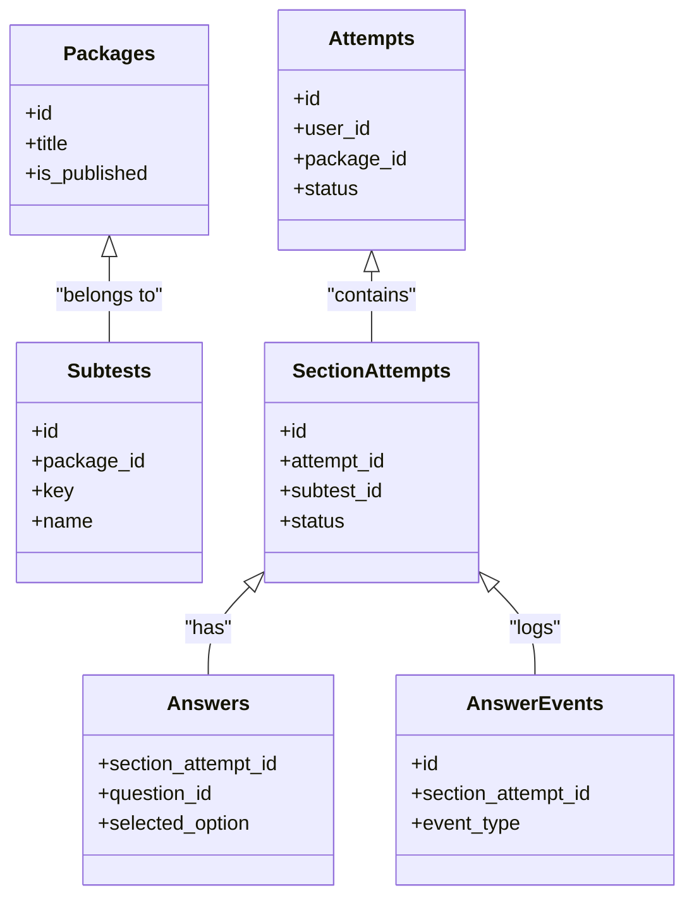
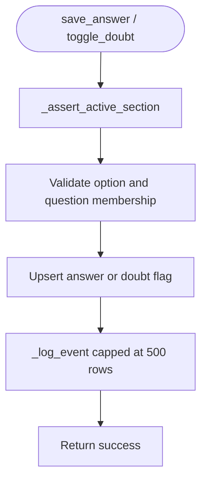
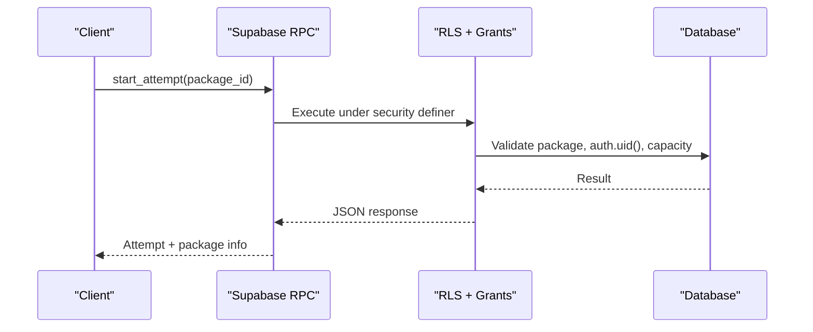
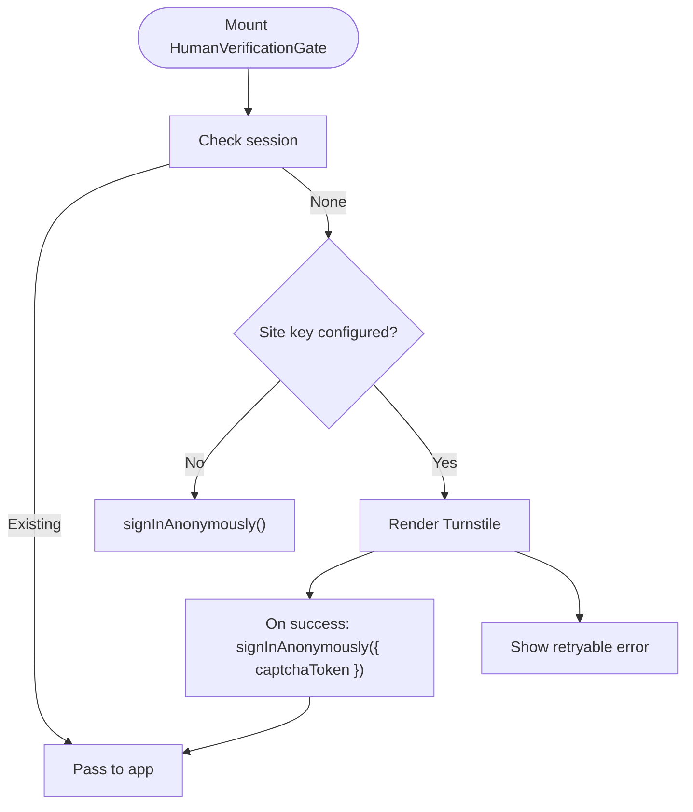
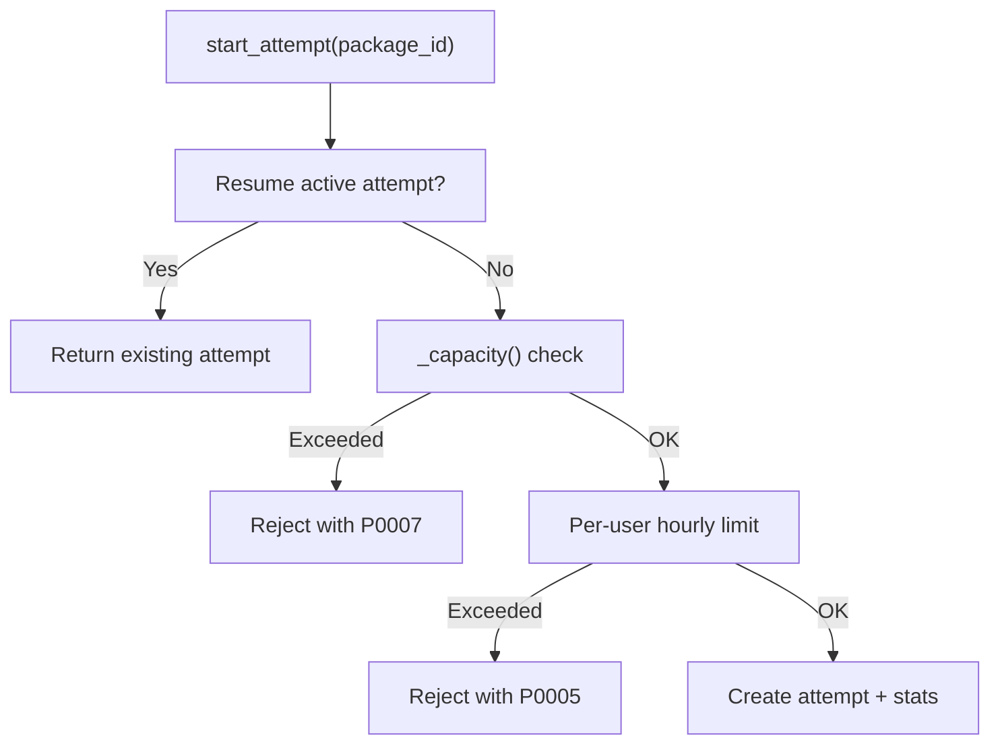
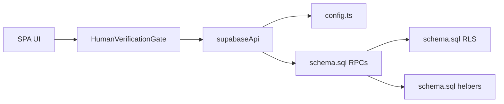

# Row Level Security and Access Control

<cite>
**Referenced Files in This Document**
- [schema.sql](file://supabase/schema.sql)
- [schema_v3.sql](file://supabase/schema_v3.sql)
- [config.toml](file://supabase/config.toml)
- [HumanVerificationGate.tsx](file://web/src/components/HumanVerificationGate.tsx)
- [supabaseApi.ts](file://web/src/lib/supabaseApi.ts)
- [api.ts](file://web/src/lib/api.ts)
- [config.ts](file://web/src/lib/config.ts)
- [TECHNICAL_REQUIREMENTS_V5.md](file://docs/TECHNICAL_REQUIREMENTS_V5.md)
- [CAPACITY_GUARD.md](file://docs/CAPACITY_GUARD.md)
</cite>

## Table of Contents
1. [Introduction](#introduction)
2. [Project Structure](#project-structure)
3. [Core Components](#core-components)
4. [Architecture Overview](#architecture-overview)
5. [Detailed Component Analysis](#detailed-component-analysis)
6. [Dependency Analysis](#dependency-analysis)
7. [Performance Considerations](#performance-considerations)
8. [Troubleshooting Guide](#troubleshooting-guide)
9. [Conclusion](#conclusion)

## Introduction
This document explains the security architecture for anonymous isolation, public question access, and server-enforced grading using Supabase Row Level Security (RLS), PostgreSQL functions, and a human verification gate. It focuses on how user-scoped permissions are enforced via JWT-based authentication, why critical operations run on the server, and how input validation, SQL injection prevention, and API endpoint security are implemented. It also documents rate limiting strategies and capacity guards that prevent abuse while preserving usability for active attempts.

## Project Structure
The security model spans three layers:
- Database layer: RLS policies, stored procedures, and RPCs enforce ownership and business rules.
- Authentication layer: Supabase Auth issues JWT tokens with per-user claims; CAPTCHA is enforced at sign-in for new anonymous identities.
- Client layer: The SPA requests data through RPCs and UI gates that require verification before mounting protected routes.

**Diagram sources**
- [schema.sql:131-181](file://supabase/schema.sql#L131-L181)
- [schema.sql:341-657](file://supabase/schema.sql#L341-L657)
- [HumanVerificationGate.tsx:73-158](file://web/src/components/HumanVerificationGate.tsx#L73-L158)
- [supabaseApi.ts:45-64](file://web/src/lib/supabaseApi.ts#L45-L64)

**Section sources**
- [schema.sql:131-181](file://supabase/schema.sql#L131-L181)
- [schema.sql:341-657](file://supabase/schema.sql#L341-L657)
- [HumanVerificationGate.tsx:73-158](file://web/src/components/HumanVerificationGate.tsx#L73-L158)
- [supabaseApi.ts:45-64](file://web/src/lib/supabaseApi.ts#L45-L64)

## Core Components
- Row Level Security policies isolate user data and restrict direct table access to published content only.
- Server-side RPCs encapsulate all mutations and sensitive reads, enforcing ownership and business rules.
- Human verification gate ensures new anonymous users pass CAPTCHA before obtaining a session.
- Rate limiting and capacity guards protect against abuse and resource exhaustion.

Key responsibilities:
- Isolation: Each user can only see their own attempts, sections, answers, and events.
- Public read: Published packages and subtests are readable by authenticated users; questions and answer keys are not directly exposed.
- Grading: Scoring logic runs inside secure functions to prevent client tampering.
- Abuse prevention: Per-user attempt limits, event log caps, and global capacity checks.

**Section sources**
- [schema.sql:131-181](file://supabase/schema.sql#L131-L181)
- [schema.sql:185-337](file://supabase/schema.sql#L185-L337)
- [schema.sql:341-657](file://supabase/schema.sql#L341-L657)
- [HumanVerificationGate.tsx:73-158](file://web/src/components/HumanVerificationGate.tsx#L73-L158)
- [TECHNICAL_REQUIREMENTS_V5.md:10-53](file://docs/TECHNICAL_REQUIREMENTS_V5.md#L10-L53)

## Architecture Overview
The system enforces least privilege and defense-in-depth:
- Clients never write tables directly; all writes go through RPCs.
- RLS denies direct table access except for published metadata.
- Ownership checks in RPCs ensure users can only act on their own attempts.
- CAPTCHA protects new anonymous sessions; returning sessions bypass the challenge.
- Capacity guard prevents new attempts when storage is near limits while allowing ongoing exams to complete.

**Diagram sources**
- [HumanVerificationGate.tsx:73-158](file://web/src/components/HumanVerificationGate.tsx#L73-L158)
- [supabaseApi.ts:45-64](file://web/src/lib/supabaseApi.ts#L45-L64)
- [schema.sql:341-657](file://supabase/schema.sql#L341-L657)

## Detailed Component Analysis

### Authentication Flow and JWT Scope
- New anonymous users must complete Cloudflare Turnstile before Supabase Auth creates an identity.
- Returning users reuse persisted sessions without additional challenges.
- The client enforces a fail-closed policy: if a site key is configured but no token is present, it refuses to proceed until verification succeeds.
- All RPC calls execute under the authenticated context, enabling `auth.uid()` checks.

**Diagram sources**
- [HumanVerificationGate.tsx:73-158](file://web/src/components/HumanVerificationGate.tsx#L73-L158)
- [supabaseApi.ts:45-64](file://web/src/lib/supabaseApi.ts#L45-L64)
- [config.ts:33-43](file://web/src/lib/config.ts#L33-L43)
- [TECHNICAL_REQUIREMENTS_V5.md:38-53](file://docs/TECHNICAL_REQUIREMENTS_V5.md#L38-L53)

**Section sources**
- [HumanVerificationGate.tsx:73-158](file://web/src/components/HumanVerificationGate.tsx#L73-L158)
- [supabaseApi.ts:45-64](file://web/src/lib/supabaseApi.ts#L45-L64)
- [config.ts:33-43](file://web/src/lib/config.ts#L33-L43)
- [TECHNICAL_REQUIREMENTS_V5.md:38-53](file://docs/TECHNICAL_REQUIREMENTS_V5.md#L38-L53)

### Row Level Security Policies
- Direct table access is revoked from anonymous and unauthenticated roles; clients interact exclusively via RPCs.
- Published packages and subtests are readable by authenticated users; questions and answer keys have no client-facing policies.
- User-owned data (attempts, section attempts, answers, events) is filtered by `auth.uid()` so users cannot view others’ data.

**Diagram sources**
- [schema.sql:16-104](file://supabase/schema.sql#L16-L104)
- [schema.sql:131-181](file://supabase/schema.sql#L131-L181)

**Section sources**
- [schema.sql:131-181](file://supabase/schema.sql#L131-L181)

### Server-Side Grading and Business Rules
Grading and state transitions are centralized in secure functions:
- `_grade_section` computes scores based on correct answers and updates section and attempt status.
- `_assert_active_section` validates ownership, deadline, and state before allowing writes.
- `_log_event` caps per-section event logs to bound storage growth.
- `_capacity` and `_refresh_capacity` measure database usage and enforce global capacity limits.

**Diagram sources**
- [schema.sql:185-337](file://supabase/schema.sql#L185-L337)
- [schema.sql:495-549](file://supabase/schema.sql#L495-L549)

**Section sources**
- [schema.sql:185-337](file://supabase/schema.sql#L185-L337)
- [schema.sql:495-549](file://supabase/schema.sql#L495-L549)

### Input Validation and SQL Injection Prevention
- All inputs are validated within RPCs before use:
  - Option values are restricted to allowed characters.
  - Question IDs are checked against the current section’s subtest.
  - Attempt creation validates package existence and publication status.
- Parameterized queries and strict types prevent SQL injection.
- Storage bucket access is controlled via policies; uploads use service role where needed.

Examples of enforcement points:
- Option validation and question membership check during answer submission.
- Package validation and release binding during attempt creation.
- Event logging cap to prevent unbounded growth.

**Section sources**
- [schema.sql:341-389](file://supabase/schema.sql#L341-L389)
- [schema.sql:495-549](file://supabase/schema.sql#L495-L549)
- [schema.sql:663-672](file://supabase/schema.sql#L663-L672)

### API Endpoint Security
- Only specific RPCs are granted to authenticated users; direct table access is revoked.
- Functions are defined with `security definer`, ensuring they run with elevated privileges while enforcing ownership checks internally.
- Service status exposes only safe metrics; raw capacity numbers are not returned to clients.

**Diagram sources**
- [schema.sql:341-389](file://supabase/schema.sql#L341-L389)
- [schema.sql:674-692](file://supabase/schema.sql#L674-L692)

**Section sources**
- [schema.sql:674-692](file://supabase/schema.sql#L674-L692)

### Human Verification Gate Implementation
- The gate loads Turnstile only when necessary and supports retry and expiry handling.
- If a production site key is configured, the SPA refuses to mount protected routes until a valid token is obtained.
- Mock mode disables third-party verification for development.

**Diagram sources**
- [HumanVerificationGate.tsx:73-158](file://web/src/components/HumanVerificationGate.tsx#L73-L158)
- [supabaseApi.ts:45-64](file://web/src/lib/supabaseApi.ts#L45-L64)
- [config.ts:33-43](file://web/src/lib/config.ts#L33-L43)

**Section sources**
- [HumanVerificationGate.tsx:73-158](file://web/src/components/HumanVerificationGate.tsx#L73-L158)
- [supabaseApi.ts:45-64](file://web/src/lib/supabaseApi.ts#L45-L64)
- [config.ts:33-43](file://web/src/lib/config.ts#L33-L43)
- [TECHNICAL_REQUIREMENTS_V5.md:38-53](file://docs/TECHNICAL_REQUIREMENTS_V5.md#L38-L53)

### Rate Limiting and Capacity Guards
- Per-user hourly budget limits the number of new attempts to curb scripted abuse.
- Global capacity guard blocks new attempts when storage approaches limits while allowing ongoing exams to finish.
- Event logs are capped per section to bound total storage per attempt.

**Diagram sources**
- [schema.sql:341-389](file://supabase/schema.sql#L341-L389)
- [CAPACITY_GUARD.md:81-96](file://docs/CAPACITY_GUARD.md#L81-L96)

**Section sources**
- [schema.sql:341-389](file://supabase/schema.sql#L341-L389)
- [CAPACITY_GUARD.md:81-96](file://docs/CAPACITY_GUARD.md#L81-L96)

## Dependency Analysis
- Client dependencies:
  - `HumanVerificationGate` depends on configuration flags and Supabase Auth.
  - `supabaseApi` enforces session requirements and CAPTCHA token flow.
  - `api` selects implementation at runtime and centralizes retry behavior for non-terminal errors.
- Server dependencies:
  - RPCs depend on RLS policies and helper functions for grading, logging, and capacity.
  - Storage policies allow public read access to question images.

**Diagram sources**
- [HumanVerificationGate.tsx:73-158](file://web/src/components/HumanVerificationGate.tsx#L73-L158)
- [supabaseApi.ts:45-64](file://web/src/lib/supabaseApi.ts#L45-L64)
- [config.ts:33-43](file://web/src/lib/config.ts#L33-L43)
- [schema.sql:131-181](file://supabase/schema.sql#L131-L181)
- [schema.sql:185-337](file://supabase/schema.sql#L185-L337)

**Section sources**
- [HumanVerificationGate.tsx:73-158](file://web/src/components/HumanVerificationGate.tsx#L73-L158)
- [supabaseApi.ts:45-64](file://web/src/lib/supabaseApi.ts#L45-L64)
- [config.ts:33-43](file://web/src/lib/config.ts#L33-L43)
- [schema.sql:131-181](file://supabase/schema.sql#L131-L181)
- [schema.sql:185-337](file://supabase/schema.sql#L185-L337)

## Performance Considerations
- Capacity measurement uses catalog statistics and database size functions to avoid expensive scans.
- Event logging is capped per section to prevent unbounded growth.
- RPCs return aggregated JSON to minimize round-trips and reduce client-side processing.
- Retry logic avoids re-attempting terminal errors like rate limits and capacity saturation.

[No sources needed since this section provides general guidance]

## Troubleshooting Guide
Common issues and mitigations:
- Human verification failures:
  - Ensure Turnstile script loads successfully; handle network errors and retries.
  - Confirm site key configuration and that Supabase Auth has CAPTCHA enabled for anonymous sign-in.
- Rate limit errors:
  - If receiving per-user hourly limits, advise users to wait or resume existing attempts.
- Capacity saturation:
  - New attempts are blocked; existing attempts remain usable. Wait for retention to free space or adjust limits.
- Invalid inputs:
  - Validate options and question membership; RPCs will reject invalid parameters with clear codes.

Operational tips:
- Use service status endpoints to inform users about capacity state.
- Monitor capacity metrics and retention policies to keep storage within plan limits.

**Section sources**
- [HumanVerificationGate.tsx:73-158](file://web/src/components/HumanVerificationGate.tsx#L73-L158)
- [schema.sql:341-389](file://supabase/schema.sql#L341-L389)
- [CAPACITY_GUARD.md:98-131](file://docs/CAPACITY_GUARD.md#L98-L131)

## Conclusion
The application enforces strong security boundaries through Supabase RLS, server-side RPCs, and a human verification gate. Anonymous users are isolated while sharing access to published content. Critical operations such as grading run on the server to prevent tampering. Input validation, parameterized queries, and strict grants prevent injection and unauthorized access. Rate limiting and capacity guards protect availability and integrity under load. Together, these measures provide a robust, scalable security model for exam delivery.

[No sources needed since this section summarizes without analyzing specific files]