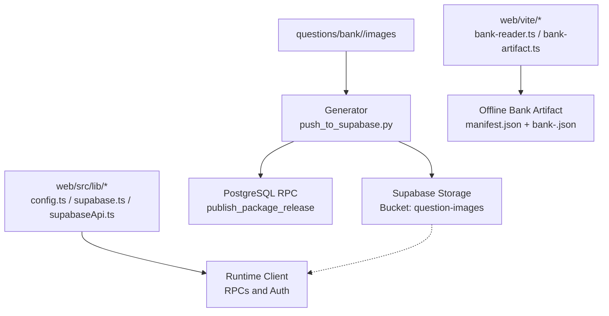
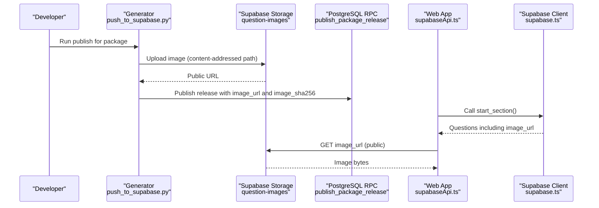
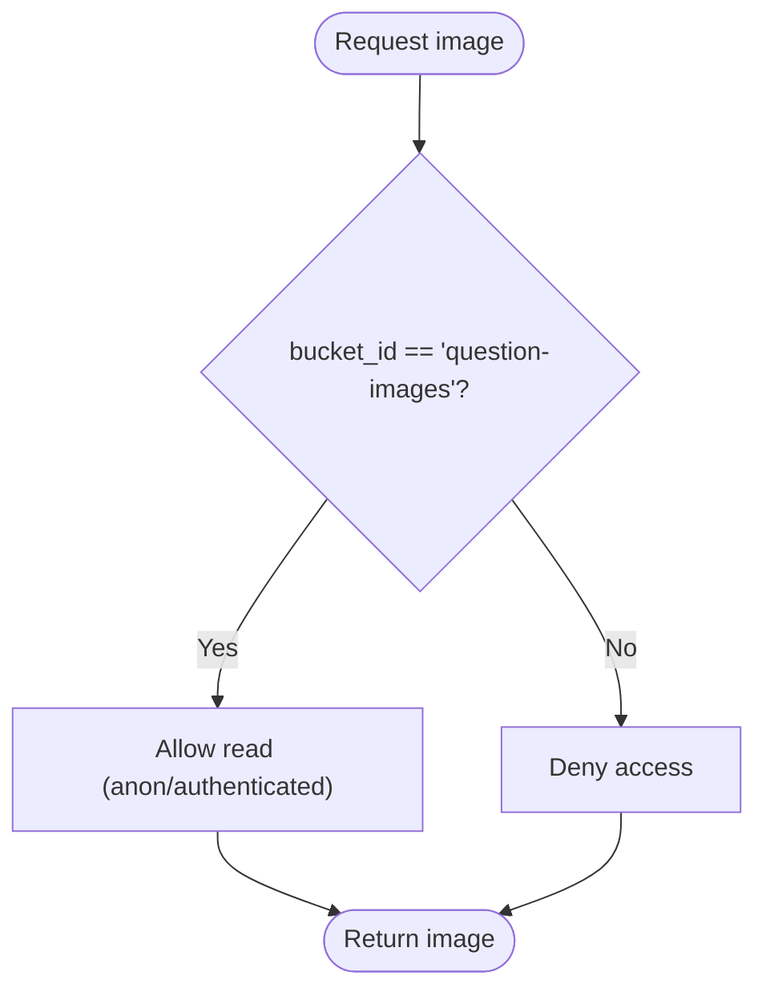
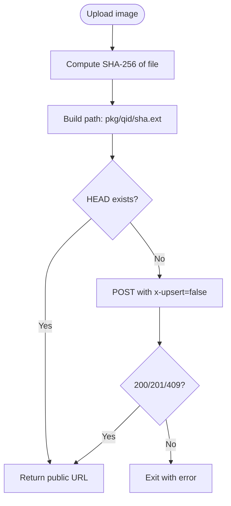
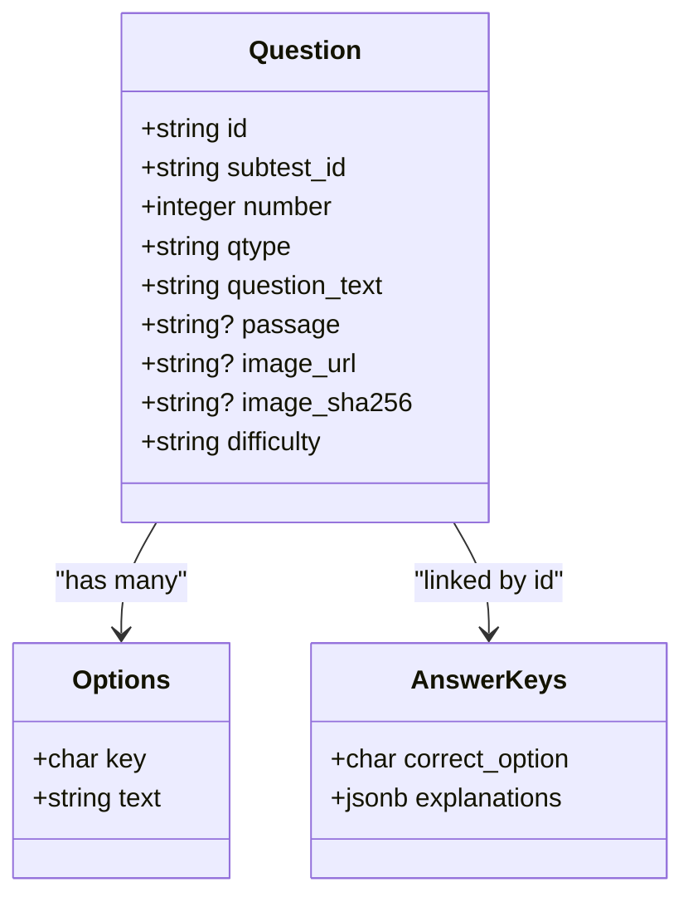
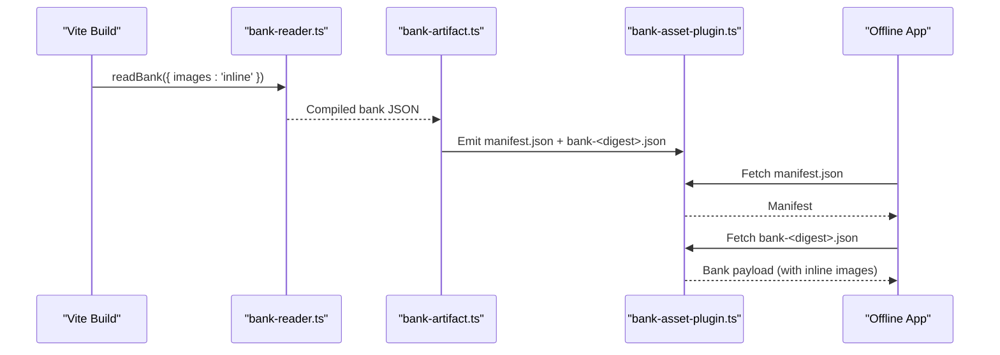
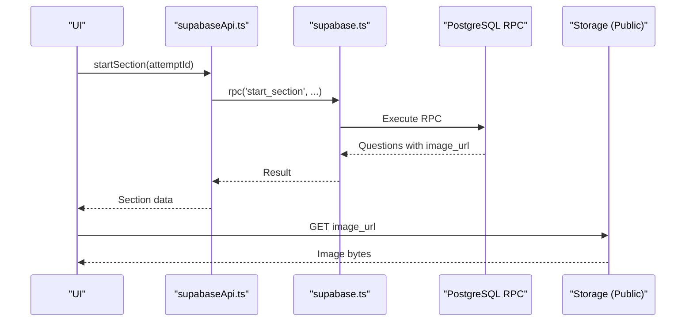
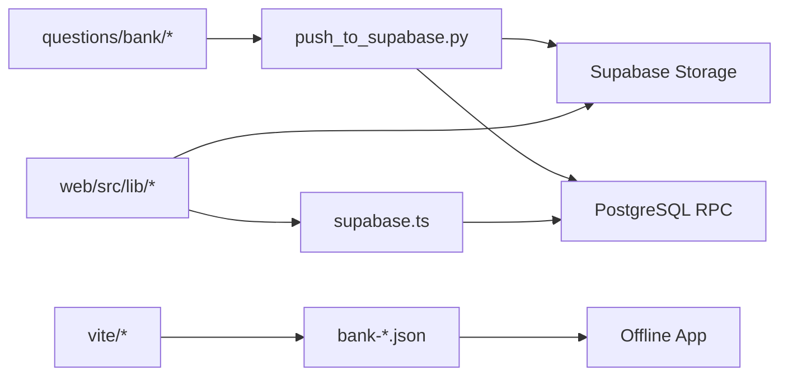

# Storage System and Asset Management

<cite>
**Referenced Files in This Document**
- [schema.sql](file://supabase/schema.sql)
- [push_to_supabase.py](file://questions/generator/push_to_supabase.py)
- [bank-reader.ts](file://web/vite/bank-reader.ts)
- [bank-artifact.ts](file://web/vite/bank-artifact.ts)
- [bank-asset-plugin.ts](file://web/vite/bank-asset-plugin.ts)
- [config.ts](file://web/src/lib/config.ts)
- [supabase.ts](file://web/src/lib/supabase.ts)
- [supabaseApi.ts](file://web/src/lib/supabaseApi.ts)
- [bankSchema.ts](file://web/src/lib/bankSchema.ts)
- [README.md](file://questions/bank/README.md)
</cite>

## Table of Contents
1. [Introduction](#introduction)
2. [Project Structure](#project-structure)
3. [Core Components](#core-components)
4. [Architecture Overview](#architecture-overview)
5. [Detailed Component Analysis](#detailed-component-analysis)
6. [Dependency Analysis](#dependency-analysis)
7. [Performance Considerations](#performance-considerations)
8. [Troubleshooting Guide](#troubleshooting-guide)
9. [Conclusion](#conclusion)
10. [Appendices](#appendices)

## Introduction
This document explains how question images and assets are stored, versioned, and served across the Supabase Storage bucket and the offline bank artifact pipeline. It covers:
- Bucket structure and access control for question images
- File organization patterns and content addressing
- Relationship between question metadata and stored assets
- Caching and CDN behavior via public URLs
- Build-time asset strategies for offline applications
- Guidelines for adding new assets, managing versions, and maintaining efficiency
- Backup and recovery considerations for stored assets

## Project Structure
The repository organizes question banks under questions/bank with per-package directories that include subtest folders and an images folder. The generator publishes packages to Supabase, while the web build compiles a local bank artifact for offline use.

**Diagram sources**
- [push_to_supabase.py:77-105](file://questions/generator/push_to_supabase.py#L77-L105)
- [schema.sql:659-672](file://supabase/schema.sql#L659-L672)
- [bank-reader.ts:159-298](file://web/vite/bank-reader.ts#L159-L298)
- [bank-artifact.ts:25-55](file://web/vite/bank-artifact.ts#L25-L55)
- [config.ts:16-43](file://web/src/lib/config.ts#L16-L43)
- [supabase.ts:9-13](file://web/src/lib/supabase.ts#L9-L13)
- [supabaseApi.ts:66-169](file://web/src/lib/supabaseApi.ts#L66-L169)

**Section sources**
- [README.md:1-3](file://questions/bank/README.md#L1-L3)
- [schema.sql:659-672](file://supabase/schema.sql#L659-L672)
- [push_to_supabase.py:1-35](file://questions/generator/push_to_supabase.py#L1-L35)
- [bank-reader.ts:159-298](file://web/vite/bank-reader.ts#L159-L298)
- [bank-artifact.ts:25-55](file://web/vite/bank-artifact.ts#L25-L55)
- [config.ts:16-43](file://web/src/lib/config.ts#L16-L43)
- [supabase.ts:9-13](file://web/src/lib/supabase.ts#L9-L13)
- [supabaseApi.ts:66-169](file://web/src/lib/supabaseApi.ts#L66-L169)

## Core Components
- Supabase Storage bucket for images:
  - Public-read bucket named question-images is created and secured by a policy allowing anonymous and authenticated reads.
- Content-addressed image uploads:
  - Images are uploaded using SHA-256 digests as part of the object path, ensuring immutability and deduplication.
- Question metadata linkage:
  - Each question stores both image_url (public URL) and image_sha256 (content hash), enabling consistent references and integrity checks.
- Offline bank artifact:
  - The build process compiles the git-based bank into a manifest and a content-addressed bank file; images can be inlined or served via dev middleware.

**Section sources**
- [schema.sql:659-672](file://supabase/schema.sql#L659-L672)
- [push_to_supabase.py:77-105](file://questions/generator/push_to_supabase.py#L77-L105)
- [push_to_supabase.py:168-219](file://questions/generator/push_to_supabase.py#L168-L219)
- [bank-reader.ts:159-298](file://web/vite/bank-reader.ts#L159-L298)
- [bank-artifact.ts:25-55](file://web/vite/bank-artifact.ts#L25-L55)

## Architecture Overview
The system has two primary flows:
- Publishing flow: Generator computes image hashes, uploads content-addressed images to Supabase Storage, and publishes package releases via RPC.
- Consumption flow: Runtime fetches questions through RPCs; images are loaded from public storage URLs. Offline builds embed bank artifacts with inline data URIs for zero-connectivity operation.

**Diagram sources**
- [push_to_supabase.py:77-105](file://questions/generator/push_to_supabase.py#L77-L105)
- [push_to_supabase.py:168-219](file://questions/generator/push_to_supabase.py#L168-L219)
- [schema.sql:659-672](file://supabase/schema.sql#L659-L672)
- [supabaseApi.ts:113-116](file://web/src/lib/supabaseApi.ts#L113-L116)
- [supabase.ts:9-13](file://web/src/lib/supabase.ts#L9-L13)

## Detailed Component Analysis

### Supabase Storage Bucket and Access Control
- Bucket provisioning:
  - The schema creates the question-images bucket and sets it to public read for both anonymous and authenticated users.
- Policy enforcement:
  - A storage.objects policy allows SELECT on the bucket_id matching question-images, enabling direct browser access to image URLs without additional auth.

**Diagram sources**
- [schema.sql:659-672](file://supabase/schema.sql#L659-L672)

**Section sources**
- [schema.sql:659-672](file://supabase/schema.sql#L659-L672)

### Content-Addressed Image Uploads
- Path construction:
  - Object paths follow the pattern <package_id>/<question_id>/<sha256><extension>, ensuring uniqueness and immutability.
- Deduplication and concurrency safety:
  - HEAD probe checks existence; POST uses x-upsert=false; concurrent uploads may return 409, which is treated as reuse since the path encodes the digest.
- MIME detection:
  - Content-Type is inferred from filename extension; fallback to application/octet-stream if unknown.

**Diagram sources**
- [push_to_supabase.py:77-105](file://questions/generator/push_to_supabase.py#L77-L105)

**Section sources**
- [push_to_supabase.py:77-105](file://questions/generator/push_to_supabase.py#L77-L105)

### Question Metadata and Stored Assets
- Metadata fields:
  - image_url holds the public storage URL for rendering images.
  - image_sha256 stores the content hash for integrity and caching strategies.
- Versioning:
  - Package releases include hashes of question payloads; changes to images alter the release hash due to inclusion of image digests.

**Diagram sources**
- [schema.sql:37-60](file://supabase/schema.sql#L37-L60)
- [push_to_supabase.py:168-219](file://questions/generator/push_to_supabase.py#L168-L219)

**Section sources**
- [schema.sql:37-60](file://supabase/schema.sql#L37-L60)
- [push_to_supabase.py:168-219](file://questions/generator/push_to_supabase.py#L168-L219)

### Offline Bank Artifact and Asset Loading Strategy
- Manifest and bank files:
  - The build emits manifest.json and a content-addressed bank-<digest>.json; the manifest includes schema versions, minimum app version, and bank file checksum.
- Image handling modes:
  - In development, images are served via a mock middleware URL keyed by package/image sha.
  - For offline apps, images are inlined as data URIs within the bank payload, enabling zero-connectivity operation.
- Plugin behavior:
  - The Vite plugin emits the bank artifact into the bundle and serves it during development with appropriate cache headers.

**Diagram sources**
- [bank-reader.ts:159-298](file://web/vite/bank-reader.ts#L159-L298)
- [bank-artifact.ts:25-55](file://web/vite/bank-artifact.ts#L25-L55)
- [bank-asset-plugin.ts:23-55](file://web/vite/bank-asset-plugin.ts#L23-L55)

**Section sources**
- [bank-reader.ts:159-298](file://web/vite/bank-reader.ts#L159-L298)
- [bank-artifact.ts:25-55](file://web/vite/bank-artifact.ts#L25-L55)
- [bank-asset-plugin.ts:23-55](file://web/vite/bank-asset-plugin.ts#L23-L55)
- [bankSchema.ts:20-33](file://web/src/lib/bankSchema.ts#L20-L33)

### Runtime Client Integration
- Supabase client configuration:
  - The client is initialized with environment-provided URL and public key; offline mode disables network dependencies.
- API surface:
  - Methods like start_section return questions with image_url; clients render images directly from the public storage URL.

**Diagram sources**
- [supabaseApi.ts:113-116](file://web/src/lib/supabaseApi.ts#L113-L116)
- [supabase.ts:9-13](file://web/src/lib/supabase.ts#L9-L13)
- [schema.sql:659-672](file://supabase/schema.sql#L659-L672)

**Section sources**
- [config.ts:16-43](file://web/src/lib/config.ts#L16-L43)
- [supabase.ts:9-13](file://web/src/lib/supabase.ts#L9-L13)
- [supabaseApi.ts:66-169](file://web/src/lib/supabaseApi.ts#L66-L169)

## Dependency Analysis
- Generator depends on:
  - Local bank directory structure and package manifests
  - Supabase Storage REST endpoints for uploads
  - PostgreSQL RPC endpoint for publishing releases
- Web runtime depends on:
  - Supabase client for RPC calls
  - Public storage URLs for images
  - Build-time artifacts for offline mode

**Diagram sources**
- [push_to_supabase.py:77-105](file://questions/generator/push_to_supabase.py#L77-L105)
- [supabaseApi.ts:66-169](file://web/src/lib/supabaseApi.ts#L66-L169)
- [bank-reader.ts:159-298](file://web/vite/bank-reader.ts#L159-L298)
- [bank-artifact.ts:25-55](file://web/vite/bank-artifact.ts#L25-L55)

**Section sources**
- [push_to_supabase.py:77-105](file://questions/generator/push_to_supabase.py#L77-L105)
- [supabaseApi.ts:66-169](file://web/src/lib/supabaseApi.ts#L66-L169)
- [bank-reader.ts:159-298](file://web/vite/bank-reader.ts#L159-L298)
- [bank-artifact.ts:25-55](file://web/vite/bank-artifact.ts#L25-L55)

## Performance Considerations
- Caching:
  - Public storage URLs enable browser and CDN caching; ensure proper cache-control headers at the edge for optimal performance.
- Deduplication:
  - Content-addressed paths prevent duplicate uploads and reduce storage usage.
- Offline optimization:
  - Inline images in the bank artifact eliminate network requests for offline apps, improving startup time and reliability.

[No sources needed since this section provides general guidance]

## Troubleshooting Guide
- Missing images:
  - Verify that image files exist in the package directory and that the generator computed the correct SHA-256 and uploaded successfully.
- Upload failures:
  - Check HTTP status codes during upload; handle 409 as reused objects and other errors as failures.
- Offline bank issues:
  - Ensure the build runs with images inlined and that the manifest points to the correct bank file digest.

**Section sources**
- [push_to_supabase.py:77-105](file://questions/generator/push_to_supabase.py#L77-L105)
- [bank-reader.ts:159-298](file://web/vite/bank-reader.ts#L159-L298)
- [bank-artifact.ts:25-55](file://web/vite/bank-artifact.ts#L25-L55)

## Conclusion
The storage system combines a public Supabase bucket with content-addressed uploads and robust metadata linking to ensure reliable, efficient, and verifiable image delivery. The offline bank artifact pipeline complements this by embedding assets for zero-connectivity scenarios. Following the guidelines here will help maintain consistency, performance, and resilience across the platform.

[No sources needed since this section summarizes without analyzing specific files]

## Appendices

### Guidelines for Adding New Question Assets
- Place images under the appropriate package directory alongside question JSON files.
- Use standard image formats supported by the reader (PNG, JPEG, SVG, WebP).
- Re-run the generator to compute SHA-256 and upload content-addressed images; verify image_url and image_sha256 in the published release.

**Section sources**
- [bank-reader.ts:32-38](file://web/vite/bank-reader.ts#L32-L38)
- [push_to_supabase.py:168-219](file://questions/generator/push_to_supabase.py#L168-L219)

### Managing File Versions
- Versions are derived from git history for the bank; changes to any file in a package increment its version.
- Release digests incorporate image hashes, ensuring immutable references.

**Section sources**
- [bank-reader.ts:78-125](file://web/vite/bank-reader.ts#L78-L125)
- [bank-reader.ts:159-298](file://web/vite/bank-reader.ts#L159-L298)
- [bank-artifact.ts:25-55](file://web/vite/bank-artifact.ts#L25-L55)

### Maintaining Storage Efficiency
- Prefer reusing existing images when possible; content addressing automatically deduplicates identical files.
- Keep image sizes optimized to reduce bandwidth and storage costs.

**Section sources**
- [push_to_supabase.py:77-105](file://questions/generator/push_to_supabase.py#L77-L105)

### Backup and Recovery Procedures
- Backups:
  - Rely on Supabase project backups and database snapshots; storage objects are publicly accessible via URLs and can be mirrored externally if required.
- Recovery:
  - Re-run the generator to re-upload missing images based on SHA-256 paths; metadata remains consistent due to content addressing.

**Section sources**
- [schema.sql:659-672](file://supabase/schema.sql#L659-L672)
- [push_to_supabase.py:77-105](file://questions/generator/push_to_supabase.py#L77-L105)

### Integration with Build Process for Offline Applications
- Offline mode:
  - The Vite plugin emits the bank artifact into the bundle; images are inlined for zero-connectivity operation.
- Development:
  - Mock middleware serves images via URLs keyed by package and image SHA; cache headers prevent unnecessary reloads.

**Section sources**
- [bank-asset-plugin.ts:23-55](file://web/vite/bank-asset-plugin.ts#L23-L55)
- [bank-reader.ts:159-298](file://web/vite/bank-reader.ts#L159-L298)
- [config.ts:16-43](file://web/src/lib/config.ts#L16-L43)