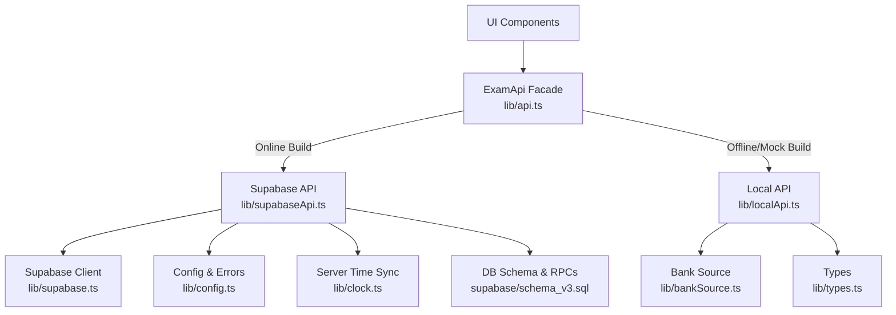
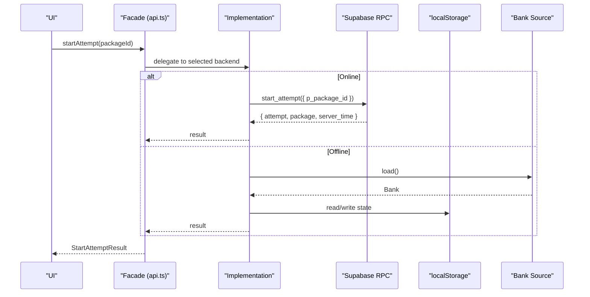
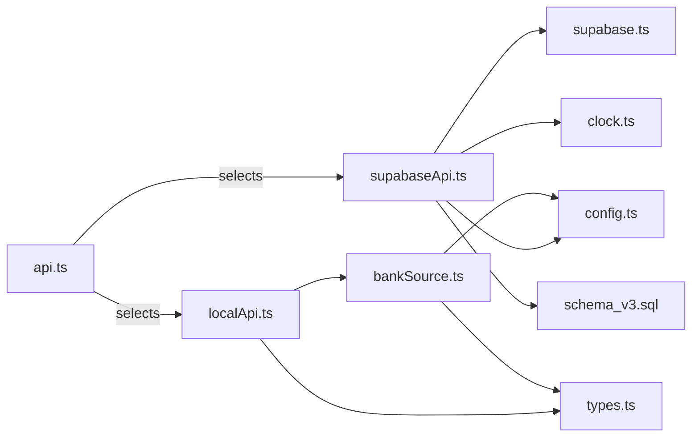

# API Integration and Data Layer

<cite>
**Referenced Files in This Document**
- [api.ts](file://web/src/lib/api.ts)
- [supabaseApi.ts](file://web/src/lib/supabaseApi.ts)
- [localApi.ts](file://web/src/lib/localApi.ts)
- [bankSource.ts](file://web/src/lib/bankSource.ts)
- [types.ts](file://web/src/lib/types.ts)
- [config.ts](file://web/src/lib/config.ts)
- [supabase.ts](file://web/src/lib/supabase.ts)
- [clock.ts](file://web/src/lib/clock.ts)
- [schema_v3.sql](file://supabase/schema_v3.sql)
</cite>

## Table of Contents
1. Introduction
2. Project Structure
3. Core Components
4. Architecture Overview
5. Detailed Component Analysis
6. Dependency Analysis
7. Performance Considerations
8. Troubleshooting Guide
9. Conclusion

## Introduction
This document explains the API integration layer and data abstraction used by the TBS LPDP Try Out application. It covers:
- A unified ExamApi interface that abstracts two backends: a Supabase-based online backend and a local offline engine.
- Supabase client configuration, authentication flows, and server time synchronization.
- The local API implementation with localStorage persistence and question bank hot-swapping for offline usage.
- Bank source abstraction for loading, caching, integrity verification, and versioning of question data.
- Type definitions and schema validation ensuring consistency across components.
- Error handling strategies, retry mechanisms, and network failure recovery.
- Performance optimizations such as lazy imports, request batching via RPCs, response caching, and efficient transformations.
- Migration patterns for API version changes and backwards compatibility.

## Project Structure
The API layer is organized around a single facade that selects an implementation at runtime based on build-time flags. The Supabase implementation calls server-side RPC functions defined in the database schema. The local implementation mirrors the same surface using in-memory state persisted to localStorage and a pluggable question bank source.

**Diagram sources**
- [api.ts:1-128](file://web/src/lib/api.ts#L1-L128)
- [supabaseApi.ts:1-170](file://web/src/lib/supabaseApi.ts#L1-L170)
- [localApi.ts:1-560](file://web/src/lib/localApi.ts#L1-L560)
- [bankSource.ts:1-323](file://web/src/lib/bankSource.ts#L1-L323)
- [types.ts:1-256](file://web/src/lib/types.ts#L1-L256)
- [config.ts:1-68](file://web/src/lib/config.ts#L1-L68)
- [supabase.ts:1-14](file://web/src/lib/supabase.ts#L1-L14)
- [clock.ts:1-65](file://web/src/lib/clock.ts#L1-L65)
- [schema_v3.sql:1-1200](file://supabase/schema_v3.sql#L1-L1200)

**Section sources**
- [api.ts:1-128](file://web/src/lib/api.ts#L1-L128)
- [supabaseApi.ts:1-170](file://web/src/lib/supabaseApi.ts#L1-L170)
- [localApi.ts:1-560](file://web/src/lib/localApi.ts#L1-L560)
- [bankSource.ts:1-323](file://web/src/lib/bankSource.ts#L1-L323)
- [types.ts:1-256](file://web/src/lib/types.ts#L1-L256)
- [config.ts:1-68](file://web/src/lib/config.ts#L1-L68)
- [supabase.ts:1-14](file://web/src/lib/supabase.ts#L1-L14)
- [clock.ts:1-65](file://web/src/lib/clock.ts#L1-L65)
- [schema_v3.sql:1-1200](file://supabase/schema_v3.sql#L1-L1200)

## Core Components
- Unified facade: Provides a stable ExamApi surface and chooses between Supabase or local implementations at runtime. It also implements background retries with exponential backoff and terminal error classification.
- Supabase API: Wraps RPC calls, enforces session requirements, synchronizes server time, and maps errors to a shared ApiError type.
- Local API: Implements the full exam flow locally with immutable release snapshots, attempt pinning, deadline enforcement, grading, statistics, and report management. Persists state to localStorage.
- Bank source: Loads questions from dev mock, bundled snapshot, or verified cached updates; validates manifests and content hashes; supports hot-swapping and subscription notifications.
- Types and config: Strongly typed contracts for all payloads, plus build-time configuration and shared error codes.
- Supabase client: Lazily loaded client configured with environment variables and auth options.
- Clock utility: Synchronizes client time with server responses to ensure consistent countdowns and deadlines.

**Section sources**
- [api.ts:1-128](file://web/src/lib/api.ts#L1-L128)
- [supabaseApi.ts:1-170](file://web/src/lib/supabaseApi.ts#L1-L170)
- [localApi.ts:1-560](file://web/src/lib/localApi.ts#L1-L560)
- [bankSource.ts:1-323](file://web/src/lib/bankSource.ts#L1-L323)
- [types.ts:1-256](file://web/src/lib/types.ts#L1-L256)
- [config.ts:1-68](file://web/src/lib/config.ts#L1-L68)
- [supabase.ts:1-14](file://web/src/lib/supabase.ts#L1-L14)
- [clock.ts:1-65](file://web/src/lib/clock.ts#L1-L65)

## Architecture Overview
The system uses a strategy pattern to switch between online and offline backends while presenting a single ExamApi interface to the rest of the app.

**Diagram sources**
- [api.ts:38-95](file://web/src/lib/api.ts#L38-L95)
- [supabaseApi.ts:108-116](file://web/src/lib/supabaseApi.ts#L108-L116)
- [localApi.ts:405-426](file://web/src/lib/localApi.ts#L405-L426)
- [bankSource.ts:252-260](file://web/src/lib/bankSource.ts#L252-L260)

## Detailed Component Analysis

### Unified API Facade
Responsibilities:
- Lazy selection of implementation based on build flags.
- Dynamic import to keep Supabase client out of offline bundles.
- Chunk reload guard to recover from deployment mismatches.
- Background retry wrapper with exponential backoff and terminal error codes.

Key behaviors:
- Uses environment flags to pick local or Supabase implementation.
- Caches the resolved implementation promise to avoid repeated dynamic imports.
- Detects chunk load failures and triggers a controlled page reload once per session.
- Exposes a stable ExamApi surface delegating to the chosen implementation.
- Provides withRetry for background writes with exponential backoff and terminal code detection.

**Section sources**
- [api.ts:1-128](file://web/src/lib/api.ts#L1-L128)

### Supabase API Implementation
Responsibilities:
- Enforce anonymous session before any write or protected read.
- Call server-side RPC functions and synchronize server time.
- Map PostgREST/Supabase errors to ApiError with stable codes.

Authentication flow:
- requireSession checks for existing session; if missing, attempts anonymous sign-in.
- In production builds with Turnstile configured, requires a captcha token before sign-in.
- Session persistence and auto-refresh are enabled in the Supabase client.

RPC mapping:
- get_maintenance_status, get_service_status, get_package_catalog, get_attempt_summaries, start_attempt, start_section, save_answer, toggle_doubt, finish_section, get_attempt_state, get_review, report_question, delete_question_report.

Server time sync:
- Each RPC response may include server_time; it is synchronized globally to align countdowns and deadlines.

**Section sources**
- [supabaseApi.ts:1-170](file://web/src/lib/supabaseApi.ts#L1-L170)
- [supabase.ts:1-14](file://web/src/lib/supabase.ts#L1-L14)
- [clock.ts:1-65](file://web/src/lib/clock.ts#L1-L65)
- [config.ts:1-68](file://web/src/lib/config.ts#L1-L68)

### Local API Implementation
Responsibilities:
- Full offline reimplementation of the ExamApi surface.
- Immutable release snapshots pinned per attempt.
- Attempt and section lifecycle with deadlines, grading, and statistics.
- Question reporting with rate limits and revision-aware keys.
- Persistence to localStorage with safe upgrades and defaults.

Data model highlights:
- MockState holds attempts, sections, answers, reports, releases, and statistics.
- Releases capture a snapshot of the active package and its questions when an attempt starts.
- Statistics track attempts started/completed, score sums, histograms, and coverage timestamps.

Grading and eligibility:
- Sections are graded on finish or when deadlines pass with grace period.
- Eligibility for statistics requires minimum answered questions per subtest and total.

Persistence:
- State is serialized to localStorage under a versioned key.
- Reads handle malformed data gracefully by falling back to defaults.

**Section sources**
- [localApi.ts:1-560](file://web/src/lib/localApi.ts#L1-L560)

### Bank Source Abstraction
Responsibilities:
- Load questions from dev middleware, bundled snapshot, or verified cache.
- Validate manifest structure and content hash.
- Support refresh to pull newer banks from GitHub Pages when available.
- Notify subscribers when the active bank is swapped.

Sources:
- Dev source: fetches /__mock/bank.json during development.
- Offline source: prefers cached bank if valid; otherwise loads bundled snapshot; can refresh from published manifest.

Integrity and versioning:
- Manifest schema version and bank schema version are enforced.
- SHA-256 verification ensures downloaded bank matches advertised digest.
- App-outdated detection prevents using incompatible banks.

Subscription:
- Emits a custom event after a successful swap so UI can re-read packages without importing heavy modules.

**Section sources**
- [bankSource.ts:1-323](file://web/src/lib/bankSource.ts#L1-L323)
- [types.ts:189-211](file://web/src/lib/types.ts#L189-L211)

### Types and Schema Validation
Responsibilities:
- Define strict shapes for all API payloads and domain entities.
- Provide constants for option keys, report reasons, and comment length limits.
- Separate live-question shape from bank question shape to prevent answer keys leaking into online flows.

Validation:
- parseManifest performs structural validation and format checks for URLs and digests.
- Types enforce allowed values for difficulty, status, and report reasons.

**Section sources**
- [types.ts:1-256](file://web/src/lib/types.ts#L1-L256)
- [bankSchema.ts:1-84](file://web/src/lib/bankSchema.ts#L1-L84)

### Database Schema and RPCs
Responsibilities:
- Define immutable revisions for questions and package releases.
- Provide secure RPCs for catalog, attempts, sections, answers, grading, and reports.
- Enforce RLS by revoking direct table access and exposing only RPCs.
- Maintain statistics tables and histograms; compute median scores server-side.

Key concepts:
- Immutability triggers prevent modification of released content.
- Attempts pin to a specific package_release_id to ensure reproducibility.
- Answers link to question_revision_id to preserve context.
- Service capacity checks gate new attempts to protect storage.

**Section sources**
- [schema_v3.sql:1-1200](file://supabase/schema_v3.sql#L1-L1200)

## Dependency Analysis
The following diagram shows how components depend on each other and where external integrations occur.

**Diagram sources**
- [api.ts:1-128](file://web/src/lib/api.ts#L1-L128)
- [supabaseApi.ts:1-170](file://web/src/lib/supabaseApi.ts#L1-L170)
- [localApi.ts:1-560](file://web/src/lib/localApi.ts#L1-L560)
- [bankSource.ts:1-323](file://web/src/lib/bankSource.ts#L1-L323)
- [types.ts:1-256](file://web/src/lib/types.ts#L1-L256)
- [config.ts:1-68](file://web/src/lib/config.ts#L1-L68)
- [supabase.ts:1-14](file://web/src/lib/supabase.ts#L1-L14)
- [clock.ts:1-65](file://web/src/lib/clock.ts#L1-L65)
- [schema_v3.sql:1-1200](file://supabase/schema_v3.sql#L1-L1200)

**Section sources**
- [api.ts:1-128](file://web/src/lib/api.ts#L1-L128)
- [supabaseApi.ts:1-170](file://web/src/lib/supabaseApi.ts#L1-L170)
- [localApi.ts:1-560](file://web/src/lib/localApi.ts#L1-L560)
- [bankSource.ts:1-323](file://web/src/lib/bankSource.ts#L1-L323)
- [types.ts:1-256](file://web/src/lib/types.ts#L1-L256)
- [config.ts:1-68](file://web/src/lib/config.ts#L1-L68)
- [supabase.ts:1-14](file://web/src/lib/supabase.ts#L1-L14)
- [clock.ts:1-65](file://web/src/lib/clock.ts#L1-L65)
- [schema_v3.sql:1-1200](file://supabase/schema_v3.sql#L1-L1200)

## Performance Considerations
- Lazy backend selection: The Supabase client is dynamically imported only in online builds, reducing bundle size in offline mode.
- Request batching: Server-side RPCs aggregate complex results (e.g., package catalog with subtests and statistics), minimizing round trips.
- Response caching: Bank source caches validated banks in the app data directory and falls back to bundled snapshots; avoids redundant downloads.
- Efficient transformation: Local API strips answer keys when serving questions to active attempts, preventing unnecessary payload size.
- Time synchronization: Global server time skew correction reduces drift in countdowns and deadline checks.
- Retry with backoff: Background writes use exponential backoff to mitigate transient network issues without blocking UI.

[No sources needed since this section provides general guidance]

## Troubleshooting Guide
Common issues and resolutions:
- Missing Supabase configuration: If Supabase URL or public key is not set, the app will refuse to initialize sessions in production builds. Ensure environment variables are provided or run in offline mode.
- Human verification required: When Turnstile is configured, anonymous sign-in requires a captcha token. Integrate the CAPTCHA provider and pass the token to init.
- Storage capacity reached: The service enforces storage and attempt-rate limits. Retrying immediately will fail; wait or clear old attempts.
- Section deadline passed: Active sections are auto-graded when deadlines pass plus a grace period. Further edits are rejected.
- Bank update outdated: If the published bank requires a newer app version, the refresh returns an app-outdated status. Update the app before refreshing.
- Chunk load mismatch: If dynamic chunks mismatch due to deployments, the facade triggers a one-time reload to recover.

Error handling patterns:
- All server errors are wrapped in ApiError with stable codes for terminal states (rate limit, bad input, storage capacity).
- withRetry skips retries for terminal codes and applies exponential backoff for transient errors.
- Local API guards against malformed localStorage entries and invalid bank data, falling back safely.

**Section sources**
- [config.ts:45-68](file://web/src/lib/config.ts#L45-L68)
- [api.ts:97-128](file://web/src/lib/api.ts#L97-L128)
- [supabaseApi.ts:45-64](file://web/src/lib/supabaseApi.ts#L45-L64)
- [localApi.ts:95-115](file://web/src/lib/localApi.ts#L95-L115)
- [bankSource.ts:267-310](file://web/src/lib/bankSource.ts#L267-L310)

## Conclusion
The TBS LPDP Try Out application achieves robust API integration through a unified ExamApi facade that cleanly separates concerns between online and offline modes. The Supabase backend provides secure, server-enforced logic via RPCs, while the local backend offers full offline functionality with immutable release pinning and persistent state. The bank source abstraction ensures reliable, verifiable question data delivery with hot-swapping and version control. Strong typing, schema validation, and consistent error handling provide reliability and maintainability. Performance is optimized through lazy loading, server-side aggregation, caching, and efficient data transformations. Migration patterns and immutability guarantees protect user attempts and analytics across API evolution.

[No sources needed since this section summarizes without analyzing specific files]