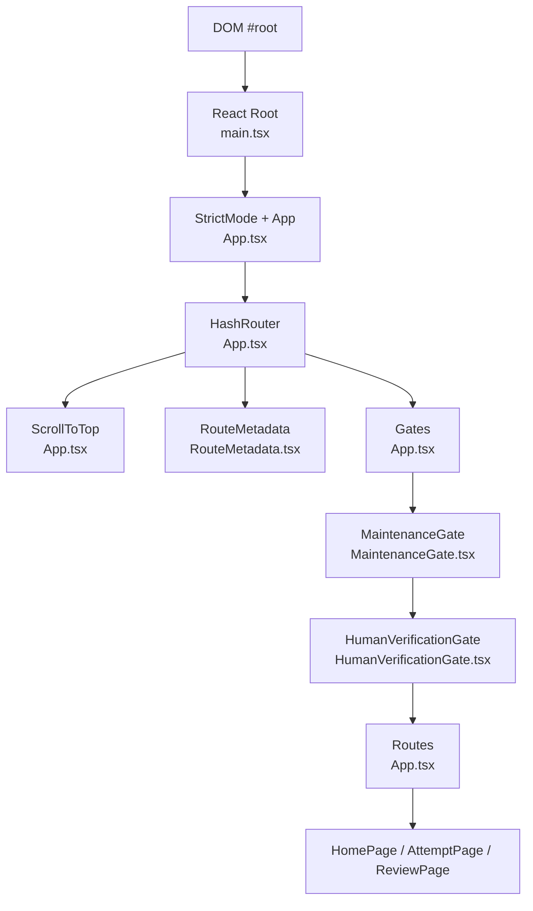
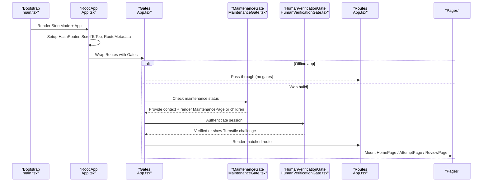
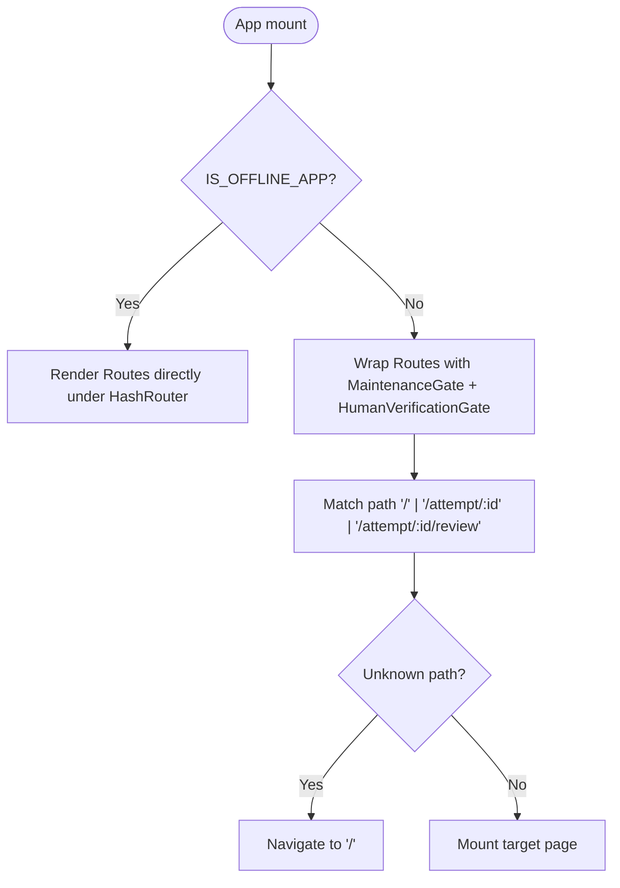
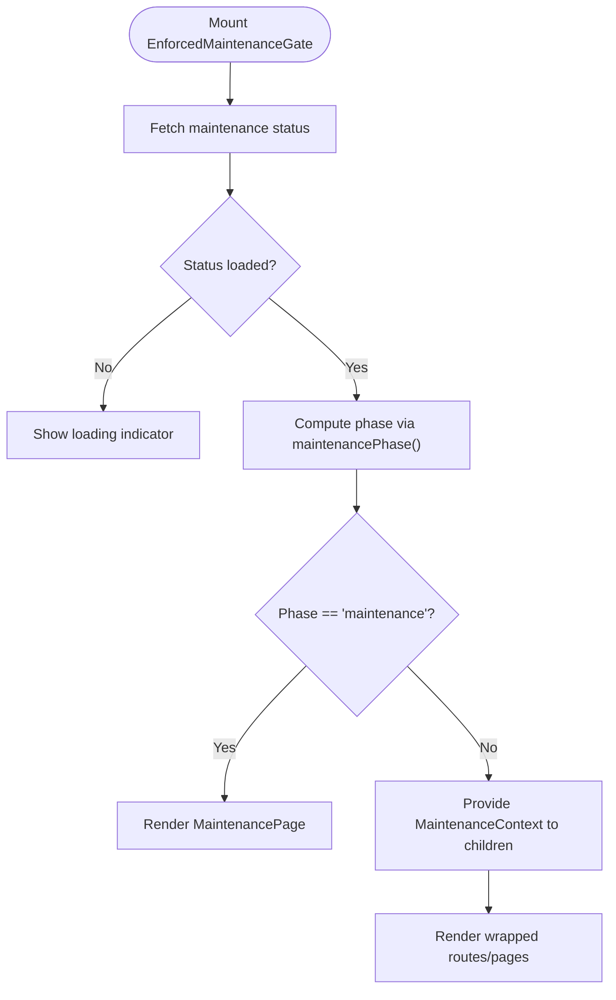
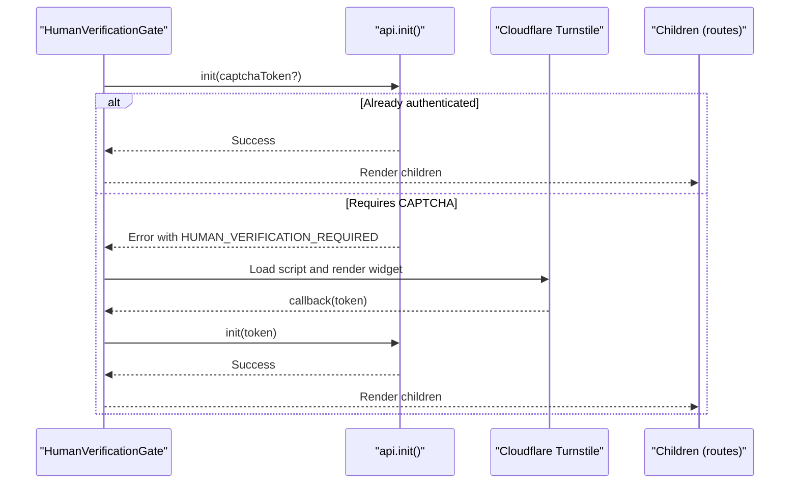
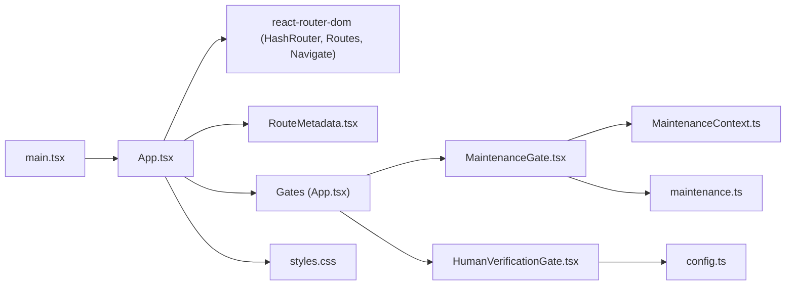

# Application Entry Point and Root Component

<cite>
**Referenced Files in This Document**
- [main.tsx](file://web/src/main.tsx)
- [App.tsx](file://web/src/App.tsx)
- [MaintenanceGate.tsx](file://web/src/components/MaintenanceGate.tsx)
- [HumanVerificationGate.tsx](file://web/src/components/HumanVerificationGate.tsx)
- [RouteMetadata.tsx](file://web/src/components/RouteMetadata.tsx)
- [MaintenanceContext.ts](file://web/src/contexts/MaintenanceContext.ts)
- [config.ts](file://web/src/lib/config.ts)
- [maintenance.ts](file://web/src/lib/maintenance.ts)
- [styles.css](file://web/src/styles.css)
</cite>

## Table of Contents
1. [Introduction](#introduction)
2. [Project Structure](#project-structure)
3. [Core Components](#core-components)
4. [Architecture Overview](#architecture-overview)
5. [Detailed Component Analysis](#detailed-component-analysis)
6. [Dependency Analysis](#dependency-analysis)
7. [Performance Considerations](#performance-considerations)
8. [Troubleshooting Guide](#troubleshooting-guide)
9. [Conclusion](#conclusion)

## Introduction
This document explains the entry point and root component architecture of the TBS LPDP Try Out application. It focuses on how App.tsx bootstraps the React application, configures routing for GitHub Pages compatibility using hash-based navigation, detects platform mode (web vs offline app), initializes global state, and enforces security gates (maintenance mode and human verification). It also covers error boundaries, loading states, accessibility considerations, and responsive design at the application level.

## Project Structure
The application is a single-page React app built with Vite. The bootstrap process mounts the root component into the DOM and applies global styles. Routing is handled by React Router with HashRouter to ensure deep links work on GitHub Pages without server rewrites.

**Diagram sources**
- [main.tsx:6-10](file://web/src/main.tsx#L6-L10)
- [App.tsx:44-61](file://web/src/App.tsx#L44-L61)
- [RouteMetadata.tsx:17-38](file://web/src/components/RouteMetadata.tsx#L17-L38)
- [MaintenanceGate.tsx:35-141](file://web/src/components/MaintenanceGate.tsx#L35-L141)
- [HumanVerificationGate.tsx:77-204](file://web/src/components/HumanVerificationGate.tsx#L77-L204)

**Section sources**
- [main.tsx:1-11](file://web/src/main.tsx#L1-L11)
- [App.tsx:1-63](file://web/src/App.tsx#L1-L63)
- [RouteMetadata.tsx:1-39](file://web/src/components/RouteMetadata.tsx#L1-L39)

## Core Components
- App.tsx: Root container that sets up HashRouter, scroll-to-top behavior, route metadata updates, optional update watcher for the offline app, and security gates around routes.
- MaintenanceGate.tsx: Loads maintenance status from the backend, renders a maintenance page when active, and provides context to descendants.
- HumanVerificationGate.tsx: Ensures a valid session before rendering content; shows Turnstile CAPTCHA when required.
- RouteMetadata.tsx: Updates document title and meta tags based on the current route to support SEO and privacy for private routes.
- MaintenanceContext.ts: Defines the shared maintenance state shape and a hook for consuming it.
- config.ts: Build-time flags and keys including IS_OFFLINE_APP, TURNSTILE_SITE_KEY, and Supabase configuration flags.
- maintenance.ts: Utilities to compute maintenance phase and schedule boundaries.

Key responsibilities:
- Platform detection via IS_OFFLINE_APP to conditionally include offline-only features and strip network-dependent code from bundles.
- Security gates wrapping all routes to enforce maintenance mode and human verification.
- Global state initialization through contexts and lazy-loaded modules.

**Section sources**
- [App.tsx:23-61](file://web/src/App.tsx#L23-L61)
- [MaintenanceGate.tsx:35-141](file://web/src/components/MaintenanceGate.tsx#L35-L141)
- [HumanVerificationGate.tsx:77-204](file://web/src/components/HumanVerificationGate.tsx#L77-L204)
- [RouteMetadata.tsx:17-38](file://web/src/components/RouteMetadata.tsx#L17-L38)
- [MaintenanceContext.ts:4-24](file://web/src/contexts/MaintenanceContext.ts#L4-L24)
- [config.ts:11-43](file://web/src/lib/config.ts#L11-L43)
- [maintenance.ts:7-17](file://web/src/lib/maintenance.ts#L7-L17)

## Architecture Overview
The root component composes routing, global metadata, and security gates. In web builds, both maintenance checks and human verification are enforced. In offline app builds, these gates are bypassed because there is no account or network dependency.

**Diagram sources**
- [main.tsx:6-10](file://web/src/main.tsx#L6-L10)
- [App.tsx:44-61](file://web/src/App.tsx#L44-L61)
- [MaintenanceGate.tsx:35-141](file://web/src/components/MaintenanceGate.tsx#L35-L141)
- [HumanVerificationGate.tsx:77-204](file://web/src/components/HumanVerificationGate.tsx#L77-L204)

## Detailed Component Analysis

### App.tsx: Root Container and Routing
- Uses HashRouter to avoid 404s on GitHub Pages and to keep routes host-agnostic for Tauri webviews.
- Provides ScrollToTop to reset scroll position on route changes.
- Injects RouteMetadata to manage SEO-friendly titles and robots directives per route.
- Conditionally includes AppUpdateWatcher only in offline app builds.
- Wraps all routes with Gates to enforce maintenance and human verification in web builds.

**Diagram sources**
- [App.tsx:23-61](file://web/src/App.tsx#L23-L61)

**Section sources**
- [App.tsx:23-61](file://web/src/App.tsx#L23-L61)

### MaintenanceGate: Maintenance Mode Coordination
- Probes backend maintenance status with timeout protection and periodic polling.
- Computes phase (open/warning/maintenance) and schedules boundary transitions to react instantly to upcoming windows.
- Persists dismissal of warnings per schedule key in sessionStorage.
- Renders a maintenance page when active; otherwise passes children through while providing context.

**Diagram sources**
- [MaintenanceGate.tsx:40-141](file://web/src/components/MaintenanceGate.tsx#L40-L141)
- [maintenance.ts:7-17](file://web/src/lib/maintenance.ts#L7-L17)

**Section sources**
- [MaintenanceGate.tsx:35-141](file://web/src/components/MaintenanceGate.tsx#L35-L141)
- [maintenance.ts:7-17](file://web/src/lib/maintenance.ts#L7-L17)
- [MaintenanceContext.ts:4-24](file://web/src/contexts/MaintenanceContext.ts#L4-L24)

### HumanVerificationGate: Authentication Flow and Turnstile CAPTCHA
- Attempts authentication on mount; if the server requires a CAPTCHA token, it dynamically loads Cloudflare Turnstile and renders the widget.
- Handles success, error, and retry flows; cleans up widgets on unmount.
- Skips verification in mock mode or after successful verification.

**Diagram sources**
- [HumanVerificationGate.tsx:77-204](file://web/src/components/HumanVerificationGate.tsx#L77-L204)
- [config.ts:59-60](file://web/src/lib/config.ts#L59-L60)

**Section sources**
- [HumanVerificationGate.tsx:77-204](file://web/src/components/HumanVerificationGate.tsx#L77-L204)
- [config.ts:59-60](file://web/src/lib/config.ts#L59-L60)

### RouteMetadata: SEO and Privacy
- Updates document title based on route type (home, attempt in progress, review).
- Sets robots meta to index the home page and noindex private attempt/review pages.

**Section sources**
- [RouteMetadata.tsx:17-38](file://web/src/components/RouteMetadata.tsx#L17-L38)

### Platform Detection and Global State Initialization
- IS_OFFLINE_APP determines whether the app runs as an offline Tauri app or a web build.
- In offline mode, network-dependent gates and libraries are tree-shaken away; in web mode, maintenance and Turnstile flows are active.
- Configuration values (Supabase URL/key, Turnstile site key) are derived from environment variables and guarded by IS_OFFLINE_APP.

**Section sources**
- [config.ts:11-43](file://web/src/lib/config.ts#L11-L43)
- [App.tsx:23-36](file://web/src/App.tsx#L23-L36)

## Dependency Analysis
The root component orchestrates several modules and components. The following diagram maps direct dependencies and their roles.

**Diagram sources**
- [main.tsx:1-11](file://web/src/main.tsx#L1-L11)
- [App.tsx:1-63](file://web/src/App.tsx#L1-L63)
- [MaintenanceGate.tsx:1-141](file://web/src/components/MaintenanceGate.tsx#L1-L141)
- [HumanVerificationGate.tsx:1-204](file://web/src/components/HumanVerificationGate.tsx#L1-L204)
- [RouteMetadata.tsx:1-39](file://web/src/components/RouteMetadata.tsx#L1-L39)
- [MaintenanceContext.ts:1-25](file://web/src/contexts/MaintenanceContext.ts#L1-L25)
- [maintenance.ts:1-48](file://web/src/lib/maintenance.ts#L1-L48)
- [config.ts:1-68](file://web/src/lib/config.ts#L1-L68)
- [styles.css:1-200](file://web/src/styles.css#L1-L200)

**Section sources**
- [App.tsx:1-63](file://web/src/App.tsx#L1-L63)
- [MaintenanceGate.tsx:1-141](file://web/src/components/MaintenanceGate.tsx#L1-L141)
- [HumanVerificationGate.tsx:1-204](file://web/src/components/HumanVerificationGate.tsx#L1-L204)
- [RouteMetadata.tsx:1-39](file://web/src/components/RouteMetadata.tsx#L1-L39)
- [MaintenanceContext.ts:1-25](file://web/src/contexts/MaintenanceContext.ts#L1-L25)
- [maintenance.ts:1-48](file://web/src/lib/maintenance.ts#L1-L48)
- [config.ts:1-68](file://web/src/lib/config.ts#L1-L68)
- [styles.css:1-200](file://web/src/styles.css#L1-L200)

## Performance Considerations
- Tree-shaking via IS_OFFLINE_APP ensures offline builds exclude network-dependent code and Turnstile logic, reducing bundle size.
- HashRouter avoids server-side routing complexity and prevents 404s on static hosting like GitHub Pages.
- Maintenance status probing uses timeouts and intervals to balance responsiveness with network efficiency.
- Lazy loading of Turnstile script minimizes initial payload and defers third-party dependencies until needed.

[No sources needed since this section provides general guidance]

## Troubleshooting Guide
- Maintenance gate not showing:
  - Ensure the backend maintenance endpoint returns a valid schedule and that the probe succeeds within the timeout window.
  - Check for dev bypass flags that can skip enforcement during development.
- Turnstile not appearing:
  - Confirm TURNSTILE_SITE_KEY is configured for web builds.
  - Verify network access to the Turnstile script and that browser extensions are not blocking it.
  - Use mock mode in development to bypass CAPTCHA challenges.
- Routing issues on refresh:
  - HashRouter should prevent 404s; verify base path configuration for GitHub Pages deployment.
- Accessibility:
  - Ensure interactive elements have appropriate labels and roles; maintain visible focus indicators.
  - Maintain contrast ratios and readable font sizes across devices.

**Section sources**
- [MaintenanceGate.tsx:17-21](file://web/src/components/MaintenanceGate.tsx#L17-L21)
- [HumanVerificationGate.tsx:117-154](file://web/src/components/HumanVerificationGate.tsx#L117-L154)
- [config.ts:38-43](file://web/src/lib/config.ts#L38-L43)

## Conclusion
The root component establishes a robust foundation for the TBS LPDP Try Out application. It combines hash-based routing for reliable deployment, platform-aware feature gating, and layered security through maintenance mode and human verification. Context-driven state management and careful bundling strategies ensure performance and correctness across web and offline modes. Responsive design and accessibility considerations are applied at the application level to deliver a consistent user experience.

[No sources needed since this section summarizes without analyzing specific files]