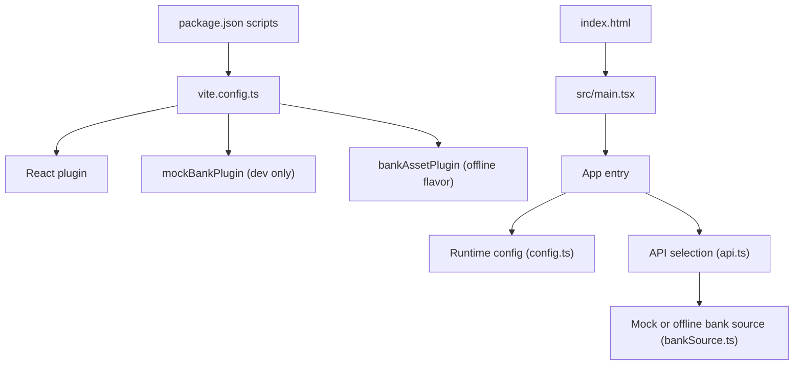
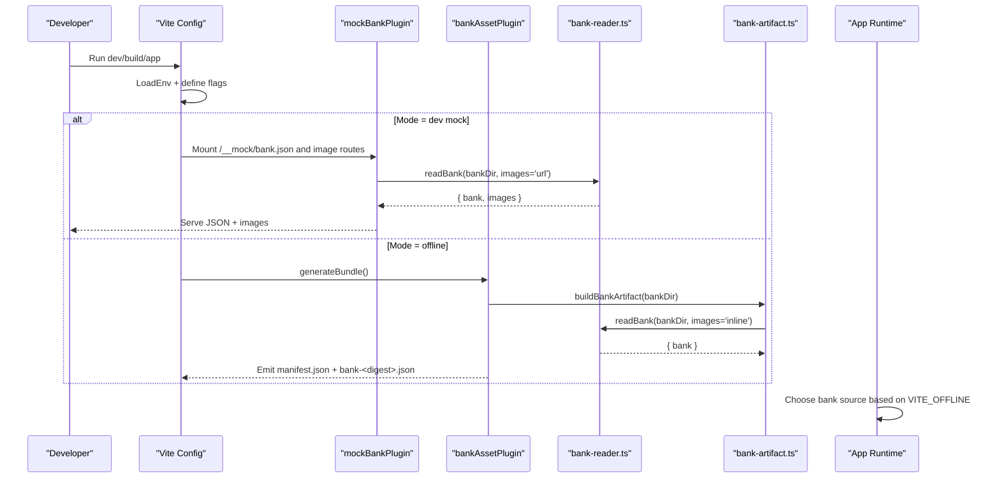
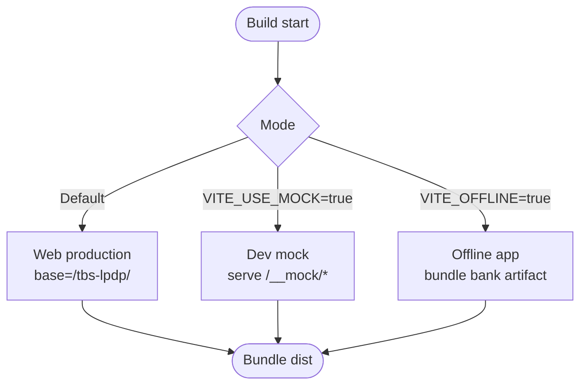
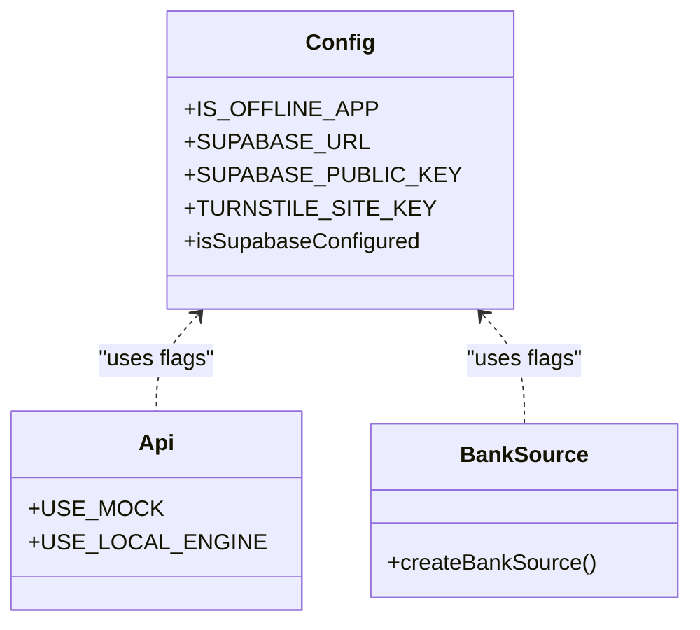
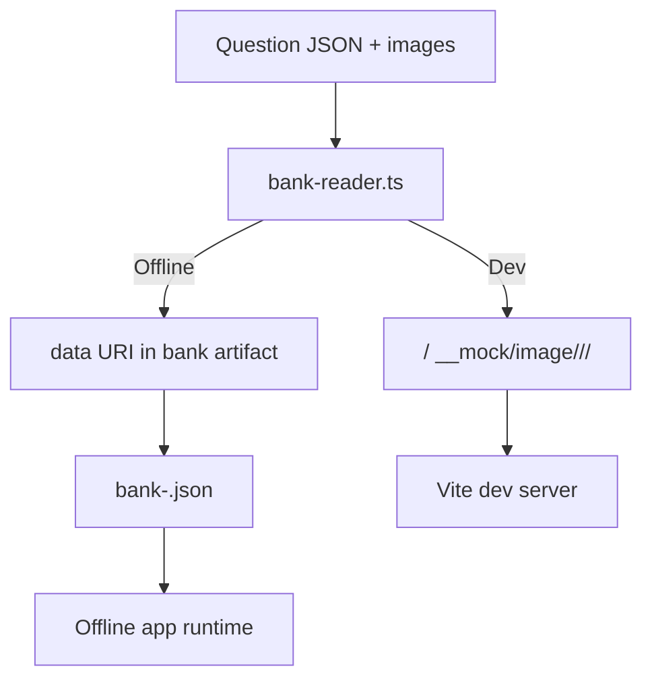
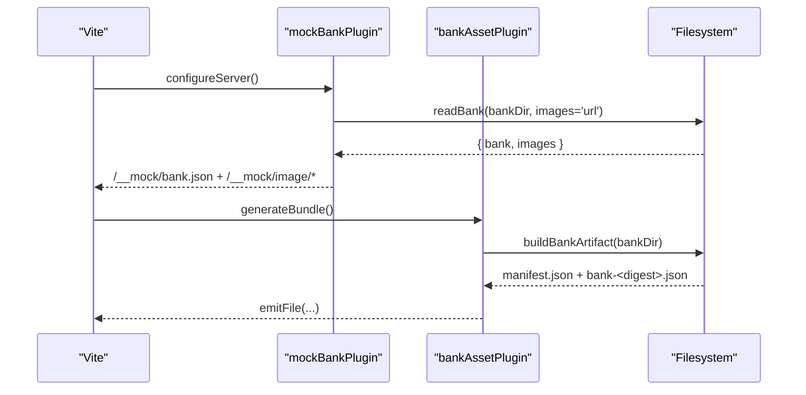
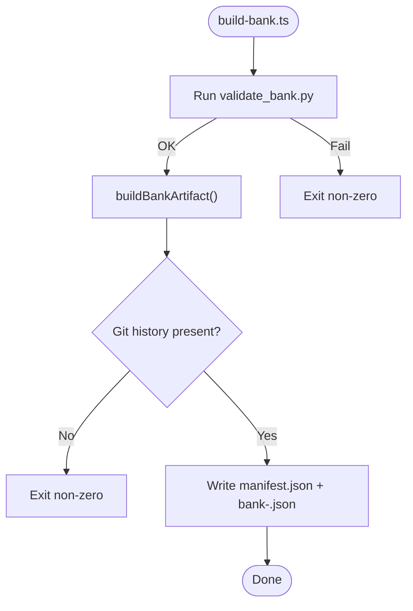
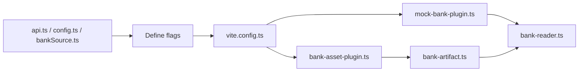

# Build System and Configuration

<cite>
**Referenced Files in This Document**
- [vite.config.ts](file://web/vite.config.ts)
- [package.json](file://web/package.json)
- [tsconfig.json](file://web/tsconfig.json)
- [index.html](file://web/index.html)
- [main.tsx](file://web/src/main.tsx)
- [config.ts](file://web/src/lib/config.ts)
- [api.ts](file://web/src/lib/api.ts)
- [bankSource.ts](file://web/src/lib/bankSource.ts)
- [mock-bank-plugin.ts](file://web/vite/mock-bank-plugin.ts)
- [bank-asset-plugin.ts](file://web/vite/bank-asset-plugin.ts)
- [bank-reader.ts](file://web/vite/bank-reader.ts)
- [bank-artifact.ts](file://web/vite/bank-artifact.ts)
- [build-bank.ts](file://web/scripts/build-bank.ts)
- [bankSchema.ts](file://web/src/lib/bankSchema.ts)
</cite>

## Table of Contents
1. [Introduction](#introduction)
2. [Project Structure](#project-structure)
3. [Core Components](#core-components)
4. [Architecture Overview](#architecture-overview)
5. [Detailed Component Analysis](#detailed-component-analysis)
6. [Dependency Analysis](#dependency-analysis)
7. [Performance Considerations](#performance-considerations)
8. [Troubleshooting Guide](#troubleshooting-guide)
9. [Conclusion](#conclusion)

## Introduction
This document explains the Vite-based build system and configuration architecture for the TBS LPDP Try Out application. It covers multi-environment builds, compile-time feature flags, asset optimization, TypeScript configuration, plugin ecosystem, environment variable management, custom plugins for question bank processing and mock data, and performance optimizations such as lazy loading, tree shaking, and caching strategies.

## Project Structure
The web application is built with Vite and React, with a single codebase that produces three flavors:
- Web production (default): serves from GitHub Pages under /tbs-lpdp/ and uses Supabase backend.
- Development mock: runs locally with a mock question bank served via a dev-only middleware.
- Offline app (Tauri): bundles a compiled question bank artifact and runs without network connectivity.

**Diagram sources**
- [vite.config.ts:1-54](file://web/vite.config.ts#L1-L54)
- [package.json:9-22](file://web/package.json#L9-L22)
- [index.html:109-114](file://web/index.html#L109-L114)
- [main.tsx:1-11](file://web/src/main.tsx#L1-L11)
- [config.ts:1-68](file://web/src/lib/config.ts#L1-L68)
- [api.ts:9-12](file://web/src/lib/api.ts#L9-L12)
- [bankSource.ts:320-322](file://web/src/lib/bankSource.ts#L320-L322)

**Section sources**
- [vite.config.ts:10-41](file://web/vite.config.ts#L10-L41)
- [package.json:9-22](file://web/package.json#L9-L22)
- [index.html:109-114](file://web/index.html#L109-L114)
- [main.tsx:1-11](file://web/src/main.tsx#L1-L11)

## Core Components
- Multi-flavor build orchestration via Vite mode and environment variables.
- Compile-time constants to eliminate unused branches per flavor.
- Custom Vite plugins for serving mock banks and bundling offline artifacts.
- Question bank compilation pipeline reading JSON questions and images into a stable artifact.
- Runtime configuration module exposing feature flags and API endpoints.

Key responsibilities:
- vite.config.ts: defines modes, base path, define constants, plugins, and build targets.
- package.json: provides scripts for dev, build, preview, and Tauri app workflows.
- tsconfig.json: sets strict TS settings, bundler module resolution, and types.
- config.ts: exposes IS_OFFLINE_APP, Supabase credentials, Turnstile key, and error codes.
- api.ts: selects mock vs online vs offline runtime behavior based on env flags.
- bankSource.ts: chooses between offline and dev bank sources at load time.
- mock-bank-plugin.ts: serves compiled bank and images during development.
- bank-asset-plugin.ts: emits manifest and content-addressed bank file for offline builds.
- bank-reader.ts: compiles raw question files into a normalized structure with versioning.
- bank-artifact.ts: generates immutable bank file and manifest with schema metadata.
- build-bank.ts: CLI to produce published artifacts with validation and checks.

**Section sources**
- [vite.config.ts:18-52](file://web/vite.config.ts#L18-L52)
- [package.json:9-22](file://web/package.json#L9-L22)
- [tsconfig.json:1-21](file://web/tsconfig.json#L1-L21)
- [config.ts:11-44](file://web/src/lib/config.ts#L11-L44)
- [api.ts:9-12](file://web/src/lib/api.ts#L9-L12)
- [bankSource.ts:320-322](file://web/src/lib/bankSource.ts#L320-L322)
- [mock-bank-plugin.ts:21-50](file://web/vite/mock-bank-plugin.ts#L21-L50)
- [bank-asset-plugin.ts:13-56](file://web/vite/bank-asset-plugin.ts#L13-L56)
- [bank-reader.ts:159-297](file://web/vite/bank-reader.ts#L159-L297)
- [bank-artifact.ts:25-55](file://web/vite/bank-artifact.ts#L25-L55)
- [build-bank.ts:22-81](file://web/scripts/build-bank.ts#L22-L81)

## Architecture Overview
The build system composes multiple layers:
- Environment and mode selection determine which features are included.
- Vite’s define injects boolean flags so dead code elimination removes unused paths.
- Plugins intercept serve and bundle phases to provide mock services and emit assets.
- The question bank is compiled once into a stable artifact consumed by both dev and offline flows.

**Diagram sources**
- [vite.config.ts:18-41](file://web/vite.config.ts#L18-L41)
- [mock-bank-plugin.ts:21-50](file://web/vite/mock-bank-plugin.ts#L21-L50)
- [bank-asset-plugin.ts:23-56](file://web/vite/bank-asset-plugin.ts#L23-L56)
- [bank-reader.ts:159-297](file://web/vite/bank-reader.ts#L159-L297)
- [bank-artifact.ts:25-55](file://web/vite/bank-artifact.ts#L25-L55)
- [bankSource.ts:320-322](file://web/src/lib/bankSource.ts#L320-L322)

## Detailed Component Analysis

### Multi-Environment Setup and Build Flavors
- Three flavors share one codebase:
  - Web production (default): base set to /tbs-lpdp/, no offline plugin, Supabase enabled if configured.
  - Development mock: VITE_USE_MOCK enables local engine and mock bank middleware; answer keys remain out of production bundles.
  - Offline app (Tauri): VITE_OFFLINE enables bundled bank artifact and disables network dependencies.
- Flavor selectors are forced to literals via define so Rollup can eliminate dead branches deterministically.
- Base path adapts to Tauri vs GitHub Pages deployment.

**Diagram sources**
- [vite.config.ts:18-41](file://web/vite.config.ts#L18-L41)

**Section sources**
- [vite.config.ts:10-41](file://web/vite.config.ts#L10-L41)

### Compile-Time Constants and Feature Flags
- VITE_USE_MOCK and VITE_OFFLINE are defined as string booleans and compared at runtime to select behavior.
- IS_OFFLINE_APP derived flag gates Supabase URL, public key, and Turnstile site key to ensure offline builds contain no secrets.
- USE_MOCK and USE_LOCAL_ENGINE in api.ts choose between mock, online, and offline backends.
- bankSource.ts chooses offline vs dev bank source based on VITE_OFFLINE.

**Diagram sources**
- [config.ts:11-44](file://web/src/lib/config.ts#L11-L44)
- [api.ts:9-12](file://web/src/lib/api.ts#L9-L12)
- [bankSource.ts:320-322](file://web/src/lib/bankSource.ts#L320-L322)

**Section sources**
- [config.ts:11-44](file://web/src/lib/config.ts#L11-L44)
- [api.ts:9-12](file://web/src/lib/api.ts#L9-L12)
- [bankSource.ts:320-322](file://web/src/lib/bankSource.ts#L320-L322)

### Asset Optimization Pipeline
- Images:
  - In dev mock mode, images are served via a middleware route keyed by package ID, SHA-256, and filename, with long-lived cache headers.
  - In offline builds, images are inlined as data URIs into the bank artifact for zero-connectivity operation.
- Code splitting:
  - Vite splits chunks automatically; heavy libraries like Supabase client are kept in lazily imported modules to reduce initial bundle size.
- Bundle analysis:
  - Use Vite’s built-in analyzer or external tools against the generated dist to inspect chunk sizes and identify optimization opportunities.

**Diagram sources**
- [bank-reader.ts:220-234](file://web/vite/bank-reader.ts#L220-L234)
- [mock-bank-plugin.ts:39-48](file://web/vite/mock-bank-plugin.ts#L39-L48)
- [bank-artifact.ts:25-55](file://web/vite/bank-artifact.ts#L25-L55)

**Section sources**
- [bank-reader.ts:220-234](file://web/vite/bank-reader.ts#L220-L234)
- [mock-bank-plugin.ts:39-48](file://web/vite/mock-bank-plugin.ts#L39-L48)
- [bank-artifact.ts:25-55](file://web/vite/bank-artifact.ts#L25-L55)

### TypeScript Configuration and Module Resolution
- Target ES2022 with modern libs and strict mode.
- Module resolution set to bundler to align with Vite’s expectations.
- JSX configured for React 17+ automatic runtime.
- Types include vite/client and node for full IDE support.
- Includes src, vite configs, and scripts for type checking.

**Section sources**
- [tsconfig.json:1-21](file://web/tsconfig.json#L1-L21)

### Plugin Ecosystem Usage
- React plugin for JSX transformation and HMR.
- mockBankPlugin:
  - Mounted only in serve mode to avoid shipping mock logic to production.
  - Serves compiled bank JSON and images with appropriate cache headers.
- bankAssetPlugin:
  - Installed only when VITE_OFFLINE is true.
  - Emits manifest.json and content-addressed bank file during bundle generation.
  - Provides dev server routes for offline flavor testing.

**Diagram sources**
- [mock-bank-plugin.ts:21-50](file://web/vite/mock-bank-plugin.ts#L21-L50)
- [bank-asset-plugin.ts:23-56](file://web/vite/bank-asset-plugin.ts#L23-L56)
- [bank-reader.ts:159-297](file://web/vite/bank-reader.ts#L159-L297)
- [bank-artifact.ts:25-55](file://web/vite/bank-artifact.ts#L25-L55)

**Section sources**
- [mock-bank-plugin.ts:21-50](file://web/vite/mock-bank-plugin.ts#L21-L50)
- [bank-asset-plugin.ts:23-56](file://web/vite/bank-asset-plugin.ts#L23-L56)

### Environment Variable Management
- Environment variables are loaded with a VITE_ prefix and made available at build time.
- Flavor-specific flags:
  - VITE_USE_MOCK: enable mock backend and dev-only bank middleware.
  - VITE_OFFLINE: enable offline flavor, bundle bank artifact, disable network dependencies.
- Application-level configuration:
  - SUPABASE_URL and SUPABASE_PUBLISHABLE_KEY (or ANON_KEY) used only when not offline.
  - TURNSTILE_SITE_KEY used only when not offline.
- Tauri integration:
  - TAURI_ENV_PLATFORM detected to adjust base path and server settings.

**Section sources**
- [vite.config.ts:18-52](file://web/vite.config.ts#L18-L52)
- [config.ts:11-44](file://web/src/lib/config.ts#L11-L44)

### Custom Plugins for Question Bank Processing and Mock Data
- bank-reader.ts:
  - Reads package manifests and subtest question files.
  - Computes versions from git history where available; falls back to mtime otherwise.
  - Produces a normalized bank structure with consistent key ordering for deterministic output.
  - Handles images either as URLs (dev) or inline data URIs (offline).
- bank-artifact.ts:
  - Generates manifest.json with schema versions, minimum app version, and bank reference.
  - Creates content-addressed bank file name from SHA-256 of the compiled bank JSON.
- build-bank.ts:
  - Validates the bank using an external Python validator before emitting artifacts.
  - Enforces presence of git history for reproducible versions.
  - Writes manifest.json and bank-<digest>.json to the specified output directory.

**Diagram sources**
- [build-bank.ts:42-81](file://web/scripts/build-bank.ts#L42-L81)
- [bank-artifact.ts:25-55](file://web/vite/bank-artifact.ts#L25-L55)
- [bank-reader.ts:159-297](file://web/vite/bank-reader.ts#L159-L297)

**Section sources**
- [bank-reader.ts:159-297](file://web/vite/bank-reader.ts#L159-L297)
- [bank-artifact.ts:25-55](file://web/vite/bank-artifact.ts#L25-L55)
- [build-bank.ts:42-81](file://web/scripts/build-bank.ts#L42-L81)

### Performance Optimizations
- Tree shaking:
  - Dead branch elimination via define ensures unused backends and features are removed per flavor.
- Lazy loading:
  - Heavy dependencies (e.g., Supabase client) are placed in lazily imported modules to reduce initial payload.
- Caching strategies:
  - Dev image responses use immutable cache headers for long-term caching.
  - Offline bank artifact is content-addressed, enabling efficient updates and caching.
- Bundle targeting:
  - Tauri builds target specific engines for optimal compatibility and smaller outputs.

**Section sources**
- [vite.config.ts:25-48](file://web/vite.config.ts#L25-L48)
- [mock-bank-plugin.ts:39-48](file://web/vite/mock-bank-plugin.ts#L39-L48)
- [bank-artifact.ts:25-55](file://web/vite/bank-artifact.ts#L25-L55)

## Dependency Analysis
The build system has clear separation of concerns:
- Vite orchestrates plugins and environment.
- Plugins depend on bank-reader and bank-artifact for question bank processing.
- Runtime modules depend on compile-time flags to select behavior.

**Diagram sources**
- [vite.config.ts:18-41](file://web/vite.config.ts#L18-L41)
- [mock-bank-plugin.ts:21-50](file://web/vite/mock-bank-plugin.ts#L21-L50)
- [bank-asset-plugin.ts:23-56](file://web/vite/bank-asset-plugin.ts#L23-L56)
- [bank-reader.ts:159-297](file://web/vite/bank-reader.ts#L159-L297)
- [bank-artifact.ts:25-55](file://web/vite/bank-artifact.ts#L25-L55)
- [api.ts:9-12](file://web/src/lib/api.ts#L9-L12)
- [config.ts:11-44](file://web/src/lib/config.ts#L11-L44)
- [bankSource.ts:320-322](file://web/src/lib/bankSource.ts#L320-L322)

**Section sources**
- [vite.config.ts:18-41](file://web/vite.config.ts#L18-L41)
- [mock-bank-plugin.ts:21-50](file://web/vite/mock-bank-plugin.ts#L21-L50)
- [bank-asset-plugin.ts:23-56](file://web/vite/bank-asset-plugin.ts#L23-L56)
- [bank-reader.ts:159-297](file://web/vite/bank-reader.ts#L159-L297)
- [bank-artifact.ts:25-55](file://web/vite/bank-artifact.ts#L25-L55)
- [api.ts:9-12](file://web/src/lib/api.ts#L9-L12)
- [config.ts:11-44](file://web/src/lib/config.ts#L11-L44)
- [bankSource.ts:320-322](file://web/src/lib/bankSource.ts#L320-L322)

## Performance Considerations
- Keep large libraries in lazy chunks to minimize initial load.
- Ensure dead code elimination by defining flavor flags as literals.
- Use content-addressed artifacts for efficient caching and updates.
- Prefer relative base paths for offline apps to avoid unnecessary redirects.
- Monitor bundle size regularly and analyze chunks for further optimization.

[No sources needed since this section provides general guidance]

## Troubleshooting Guide
Common issues and resolutions:
- Missing git history:
  - Without commit history, question versions fall back to mtime and builds may be non-reproducible. CI requires full history.
- Empty bank:
  - Validation prevents publishing empty or malformed banks; check question files and manifests.
- Mock routes not responding:
  - Ensure dev mode is active and bank directory exists; verify middleware mounting.
- Offline asset not found:
  - Confirm offline flavor is selected and bank artifact was emitted; check base path alignment.

**Section sources**
- [build-bank.ts:59-65](file://web/scripts/build-bank.ts#L59-L65)
- [build-bank.ts:67-70](file://web/scripts/build-bank.ts#L67-L70)
- [mock-bank-plugin.ts:25-48](file://web/vite/mock-bank-plugin.ts#L25-L48)
- [bank-asset-plugin.ts:32-56](file://web/vite/bank-asset-plugin.ts#L32-L56)

## Conclusion
The TBS LPDP Try Out build system leverages Vite’s flexibility to support multiple deployment targets from a single codebase. Compile-time flags and custom plugins ensure that each flavor contains only what it needs, while the question bank pipeline provides deterministic, versioned artifacts for both development and offline usage. TypeScript configuration and strict settings maintain code quality, and performance-oriented practices like tree shaking, lazy loading, and caching keep the application fast and efficient across environments.

[No sources needed since this section summarizes without analyzing specific files]