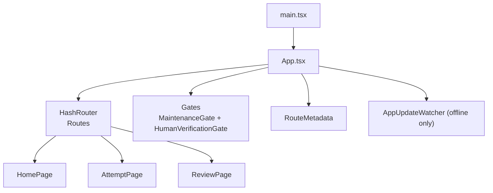
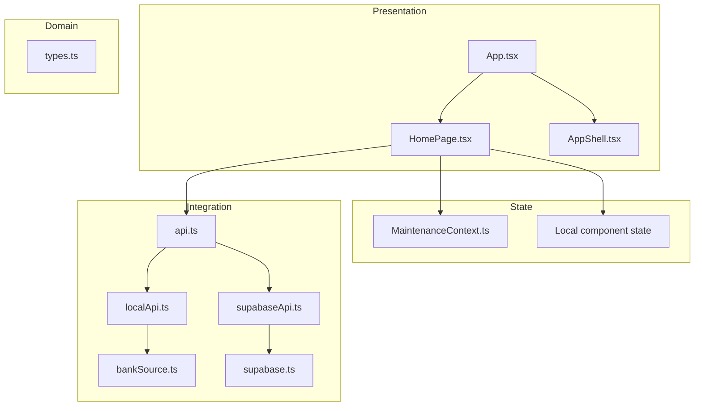
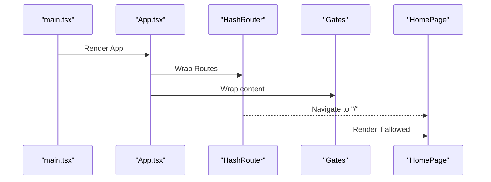
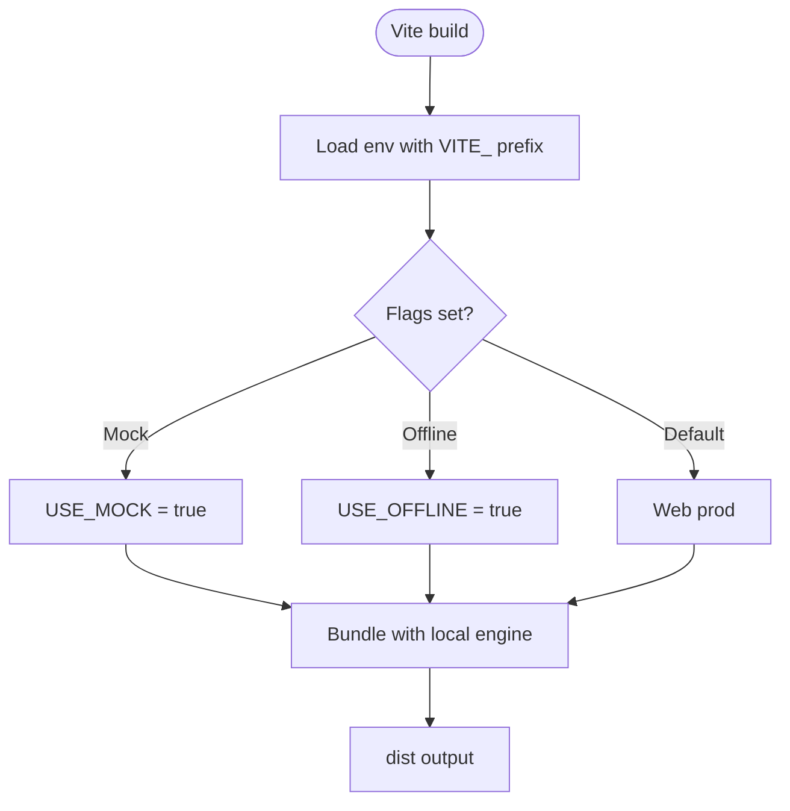
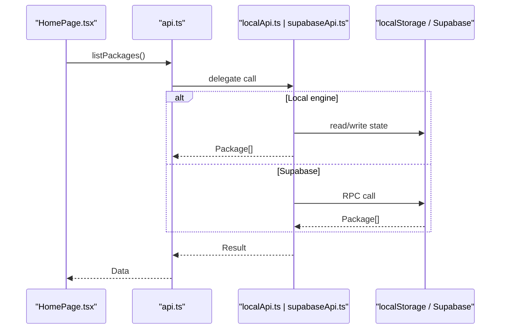
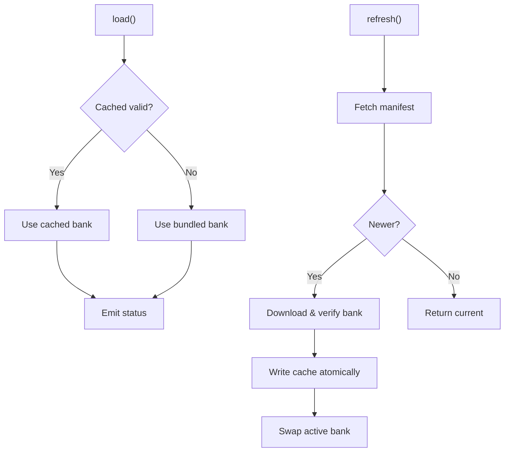
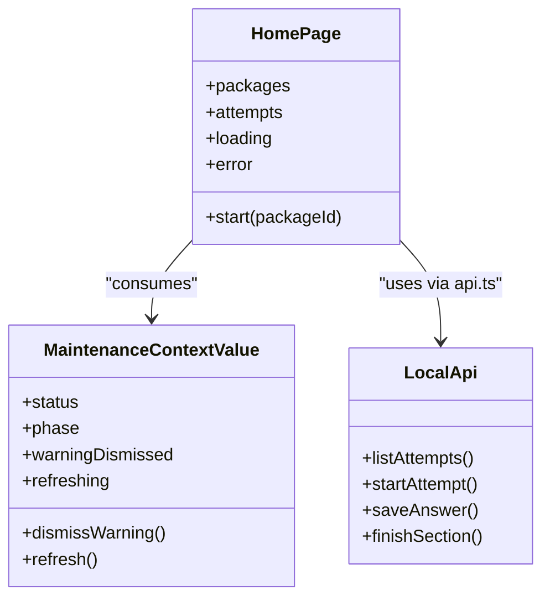
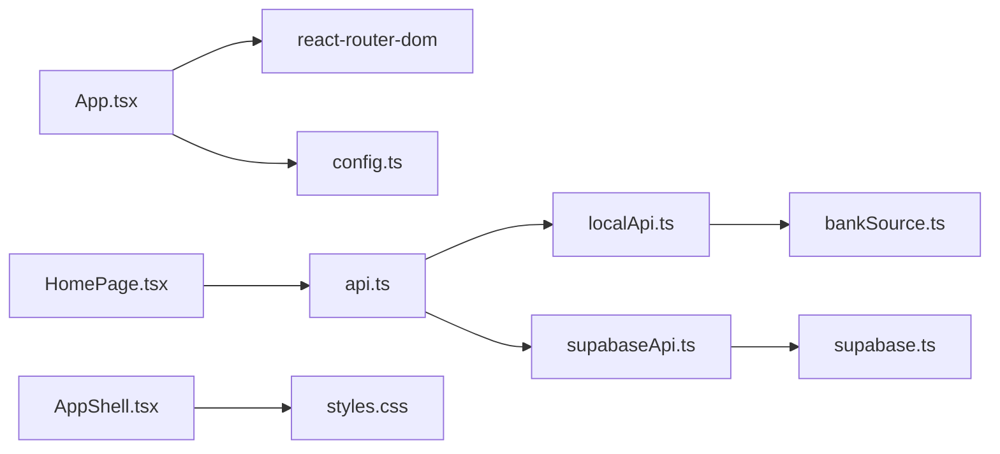

# Frontend Architecture

<cite>
**Referenced Files in This Document**
- [main.tsx](file://web/src/main.tsx)
- [App.tsx](file://web/src/App.tsx)
- [vite.config.ts](file://web/vite.config.ts)
- [package.json](file://web/package.json)
- [config.ts](file://web/src/lib/config.ts)
- [api.ts](file://web/src/lib/api.ts)
- [supabase.ts](file://web/src/lib/supabase.ts)
- [supabaseApi.ts](file://web/src/lib/supabaseApi.ts)
- [localApi.ts](file://web/src/lib/localApi.ts)
- [bankSource.ts](file://web/src/lib/bankSource.ts)
- [types.ts](file://web/src/lib/types.ts)
- [MaintenanceContext.ts](file://web/src/contexts/MaintenanceContext.ts)
- [HomePage.tsx](file://web/src/pages/HomePage.tsx)
- [AppShell.tsx](file://web/src/components/AppShell.tsx)
- [useTick.ts](file://web/src/hooks/useTick.ts)
- [styles.css](file://web/src/styles.css)
</cite>

## Table of Contents
1. Introduction
2. Project Structure
3. Core Components
4. Architecture Overview
5. Detailed Component Analysis
6. Dependency Analysis
7. Performance Considerations
8. Troubleshooting Guide
9. Conclusion

## Introduction
This document describes the frontend architecture of the TBS LPDP Try Out React application. It explains how the single-page application is bootstrapped, how routing and authentication gates are composed at the root, how build-time configuration selects deployment flavors, and how an abstracted API layer supports both online (Supabase) and offline (local engine with local storage) modes. It also covers state management patterns, responsive design, accessibility considerations, and performance optimizations such as code splitting and lazy loading.

## Project Structure
The project is a Vite + TypeScript React SPA under web/. The entry point renders the root App component inside StrictMode. Routing uses HashRouter for GitHub Pages compatibility and to support hosting behind any base path or inside a Tauri webview. Build-time flags select between three flavors:
- Web production: Supabase backend, base path /tbs-lpdp/
- Dev mock: local exam engine served by Vite middleware
- Offline app: local exam engine with bundled/cached question bank, base path ./

**Diagram sources**
- [main.tsx:1-11](file://web/src/main.tsx#L1-L11)
- [App.tsx:1-63](file://web/src/App.tsx#L1-L63)

**Section sources**
- [main.tsx:1-11](file://web/src/main.tsx#L1-L11)
- [App.tsx:1-63](file://web/src/App.tsx#L1-L63)
- [vite.config.ts:1-54](file://web/vite.config.ts#L1-L54)
- [package.json:1-46](file://web/package.json#L1-L46)

## Core Components
- Root shell and routing: App.tsx composes HashRouter, scroll-to-top behavior, route metadata, optional update watcher, maintenance and human verification gates, and page routes.
- Application shell: AppShell.tsx provides the masthead, menu bar, feedback footer, and a maintenance banner; it can hide chrome during active sections.
- Pages: HomePage.tsx lists packages, shows attempt history, handles starting attempts, and integrates offline updates or download prompts depending on flavor.
- Context: MaintenanceContext.ts defines a context for global maintenance status and UI controls.
- Hooks: useTick.ts drives periodic re-renders for countdown timers.

Key responsibilities:
- App.tsx: routing, platform detection via compile-time constants, gating network-dependent features offline.
- AppShell.tsx: consistent layout and chrome visibility control.
- HomePage.tsx: orchestration of data fetching, error handling, capacity checks, and navigation.

**Section sources**
- [App.tsx:1-63](file://web/src/App.tsx#L1-L63)
- [AppShell.tsx:1-56](file://web/src/components/AppShell.tsx#L1-L56)
- [HomePage.tsx:1-400](file://web/src/pages/HomePage.tsx#L1-L400)
- [MaintenanceContext.ts:1-25](file://web/src/contexts/MaintenanceContext.ts#L1-L25)
- [useTick.ts:1-12](file://web/src/hooks/useTick.ts#L1-L12)

## Architecture Overview
The SPA follows a layered architecture:
- Presentation layer: React components organized by feature (pages, components).
- State layer: React Context for global concerns (maintenance), local component state for UI interactions.
- Domain layer: types.ts defines stable contracts for server and local engine responses.
- Integration layer: api.ts abstracts backend selection; supabaseApi.ts implements RPC calls; localApi.ts implements a full local exam engine backed by localStorage and bankSource.ts.

Build-time configuration:
- vite.config.ts defines three flavors using environment variables that are forced to literals so dead branches are eliminated per bundle.
- config.ts exposes compile-time flags like IS_OFFLINE_APP and Supabase credentials, ensuring the offline bundle contains no network client code.

**Diagram sources**
- [App.tsx:1-63](file://web/src/App.tsx#L1-L63)
- [HomePage.tsx:1-400](file://web/src/pages/HomePage.tsx#L1-L400)
- [AppShell.tsx:1-56](file://web/src/components/AppShell.tsx#L1-L56)
- [MaintenanceContext.ts:1-25](file://web/src/contexts/MaintenanceContext.ts#L1-L25)
- [types.ts:1-256](file://web/src/lib/types.ts#L1-L256)
- [api.ts:1-128](file://web/src/lib/api.ts#L1-L128)
- [supabaseApi.ts:1-170](file://web/src/lib/supabaseApi.ts#L1-L170)
- [localApi.ts:1-560](file://web/src/lib/localApi.ts#L1-L560)
- [bankSource.ts:1-323](file://web/src/lib/bankSource.ts#L1-L323)
- [supabase.ts:1-14](file://web/src/lib/supabase.ts#L1-L14)

## Detailed Component Analysis

### Root Application and Routing
- Uses HashRouter to ensure deep links work on GitHub Pages without rewrite rules and to be host-agnostic for Tauri webviews.
- Composes ScrollToTop, RouteMetadata, optional AppUpdateWatcher (offline only), and Gates (MaintenanceGate and HumanVerificationGate) around Routes.
- Defines routes for home, attempt, and review pages, with a catch-all redirect.

**Diagram sources**
- [main.tsx:1-11](file://web/src/main.tsx#L1-L11)
- [App.tsx:1-63](file://web/src/App.tsx#L1-L63)

**Section sources**
- [App.tsx:1-63](file://web/src/App.tsx#L1-L63)

### Build-Time Configuration and Deployment Flavors
- vite.config.ts sets define flags for VITE_USE_MOCK and VITE_OFFLINE as literals to enable dead-code elimination per flavor.
- Base path differs for Tauri vs GitHub Pages.
- Plugins include React, mock bank middleware for dev, and bank asset bundling for offline builds.

**Diagram sources**
- [vite.config.ts:1-54](file://web/vite.config.ts#L1-L54)

**Section sources**
- [vite.config.ts:1-54](file://web/vite.config.ts#L1-L54)
- [config.ts:1-68](file://web/src/lib/config.ts#L1-L68)

### Abstracted API Layer and Backend Selection
- api.ts lazily imports either localApi or supabaseApi based on compile-time flags, caching the implementation promise.
- Provides retry logic for transient errors and a unified interface ExamApi consumed by all pages.
- supabaseApi.ts wraps RPC calls, enforces session requirements, and syncs server time.
- localApi.ts implements the full exam engine locally using localStorage and bankSource.ts, including grading, statistics, and immutable release pinning.

**Diagram sources**
- [api.ts:1-128](file://web/src/lib/api.ts#L1-L128)
- [localApi.ts:1-560](file://web/src/lib/localApi.ts#L1-L560)
- [supabaseApi.ts:1-170](file://web/src/lib/supabaseApi.ts#L1-L170)

**Section sources**
- [api.ts:1-128](file://web/src/lib/api.ts#L1-L128)
- [supabaseApi.ts:1-170](file://web/src/lib/supabaseApi.ts#L1-L170)
- [localApi.ts:1-560](file://web/src/lib/localApi.ts#L1-L560)

### Offline Question Bank Management
- bankSource.ts provides two implementations:
  - Dev source: fetches from Vite middleware endpoint.
  - Offline source: loads from cached verified bank or bundled snapshot, with integrity checks and hot-swapping.
- Supports refresh from published bank, schema version checks, and emits events when updated.

**Diagram sources**
- [bankSource.ts:1-323](file://web/src/lib/bankSource.ts#L1-L323)

**Section sources**
- [bankSource.ts:1-323](file://web/src/lib/bankSource.ts#L1-L323)

### State Management Approach
- Global state: MaintenanceContext.ts holds maintenance status, phase, warning dismissal, and refresh actions.
- Local state: Components manage UI state (loading, errors, pagination, active attempts) using React hooks.
- Persistence: localApi.ts persists attempts, answers, reports, and statistics to localStorage; Supabase mode persists to the backend.

**Diagram sources**
- [MaintenanceContext.ts:1-25](file://web/src/contexts/MaintenanceContext.ts#L1-L25)
- [HomePage.tsx:1-400](file://web/src/pages/HomePage.tsx#L1-L400)
- [localApi.ts:1-560](file://web/src/lib/localApi.ts#L1-L560)

**Section sources**
- [MaintenanceContext.ts:1-25](file://web/src/contexts/MaintenanceContext.ts#L1-L25)
- [HomePage.tsx:1-400](file://web/src/pages/HomePage.tsx#L1-L400)
- [localApi.ts:1-560](file://web/src/lib/localApi.ts#L1-L560)

### Responsive Design and Accessibility
- styles.css defines CSS custom properties, typography, spacing, and layout utilities.
- Masthead and banners incorporate safe-area insets for mobile devices.
- Buttons and interactive elements have focus-visible outlines and touch-friendly behaviors.
- Semantic HTML and aria attributes are used across components (e.g., aria-label, role-appropriate headings).

**Section sources**
- [styles.css:1-200](file://web/src/styles.css#L1-L200)
- [AppShell.tsx:1-56](file://web/src/components/AppShell.tsx#L1-L56)

### Performance Optimizations
- Code splitting and lazy loading:
  - api.ts dynamically imports either localApi or supabaseApi, keeping each flavor lean.
  - Supabase client is loaded lazily through supabaseApi to avoid bundling in offline builds.
- Dead code elimination:
  - Compile-time flags in vite.config.ts and config.ts ensure unused backends and third-party libraries are excluded per flavor.
- Efficient rendering:
  - useTick.ts provides lightweight interval-based updates for countdown displays.
  - Memoization in HomePage reduces recomputation for visible package slices.

**Section sources**
- [api.ts:1-128](file://web/src/lib/api.ts#L1-L128)
- [supabase.ts:1-14](file://web/src/lib/supabase.ts#L1-L14)
- [vite.config.ts:1-54](file://web/vite.config.ts#L1-L54)
- [useTick.ts:1-12](file://web/src/hooks/useTick.ts#L1-L12)
- [HomePage.tsx:1-400](file://web/src/pages/HomePage.tsx#L1-L400)

## Dependency Analysis
High-level dependencies among core modules:

**Diagram sources**
- [App.tsx:1-63](file://web/src/App.tsx#L1-L63)
- [HomePage.tsx:1-400](file://web/src/pages/HomePage.tsx#L1-L400)
- [api.ts:1-128](file://web/src/lib/api.ts#L1-L128)
- [localApi.ts:1-560](file://web/src/lib/localApi.ts#L1-L560)
- [supabaseApi.ts:1-170](file://web/src/lib/supabaseApi.ts#L1-L170)
- [supabase.ts:1-14](file://web/src/lib/supabase.ts#L1-L14)
- [bankSource.ts:1-323](file://web/src/lib/bankSource.ts#L1-L323)
- [AppShell.tsx:1-56](file://web/src/components/AppShell.tsx#L1-L56)
- [styles.css:1-200](file://web/src/styles.css#L1-L200)

**Section sources**
- [api.ts:1-128](file://web/src/lib/api.ts#L1-L128)
- [supabaseApi.ts:1-170](file://web/src/lib/supabaseApi.ts#L1-L170)
- [localApi.ts:1-560](file://web/src/lib/localApi.ts#L1-L560)
- [bankSource.ts:1-323](file://web/src/lib/bankSource.ts#L1-L323)

## Performance Considerations
- Lazy backend selection prevents unnecessary payloads in production bundles.
- Compile-time flagging ensures offline builds exclude Supabase and Turnstile code.
- Atomic cache writes and integrity checks minimize corruption risk and reduce reload cycles.
- Session-scoped guards prevent infinite reload loops during chunk mismatches.
- Pagination and memoization reduce render costs on large datasets.

[No sources needed since this section provides general guidance]

## Troubleshooting Guide
Common issues and resolutions:
- Missing Supabase configuration:
  - Symptom: Error indicating backend not configured.
  - Resolution: Set required environment variables or run in mock mode.
- Capacity reached:
  - Symptom: New attempts blocked with capacity message.
  - Resolution: Wait for automatic cleanup or clear old data; offline mode simulates capacity via flags.
- Chunk load failures:
  - Symptom: Dynamic import errors after deployment updates.
  - Resolution: Automatic reload guard triggers a fresh load; ensure consistent deployment versions.
- Offline bank update errors:
  - Symptom: Bank update fails due to network or integrity check failure.
  - Resolution: Retry refresh; fall back to bundled bank; verify network connectivity.

**Section sources**
- [HomePage.tsx:1-400](file://web/src/pages/HomePage.tsx#L1-L400)
- [api.ts:1-128](file://web/src/lib/api.ts#L1-L128)
- [bankSource.ts:1-323](file://web/src/lib/bankSource.ts#L1-L323)

## Conclusion
The TBS LPDP Try Out frontend is a well-structured Vite + React SPA that cleanly separates presentation, state, domain, and integration layers. Build-time configuration enables multiple deployment flavors while minimizing bundle size. The abstracted API layer supports seamless switching between online and offline modes, with robust persistence and integrity checks. Responsive design and accessibility practices ensure a consistent user experience across devices. Performance optimizations such as code splitting, lazy loading, and dead code elimination keep the application efficient and maintainable.

[No sources needed since this section summarizes without analyzing specific files]