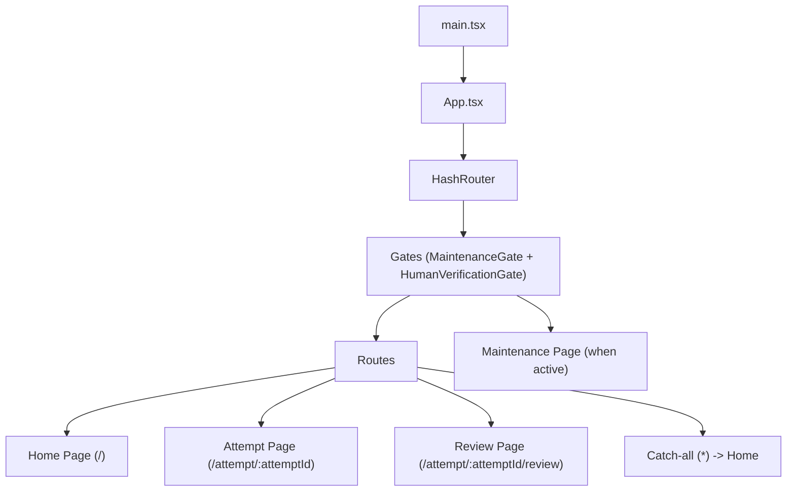
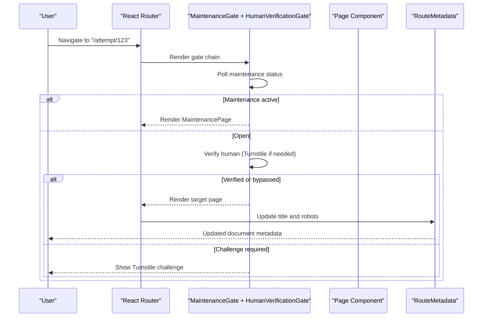
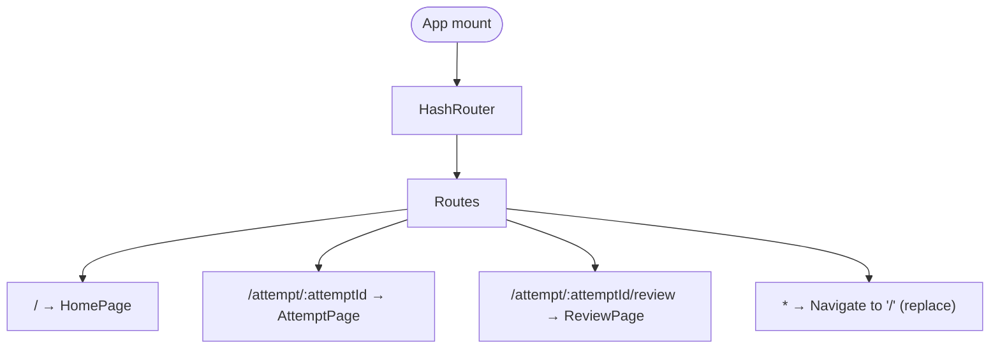
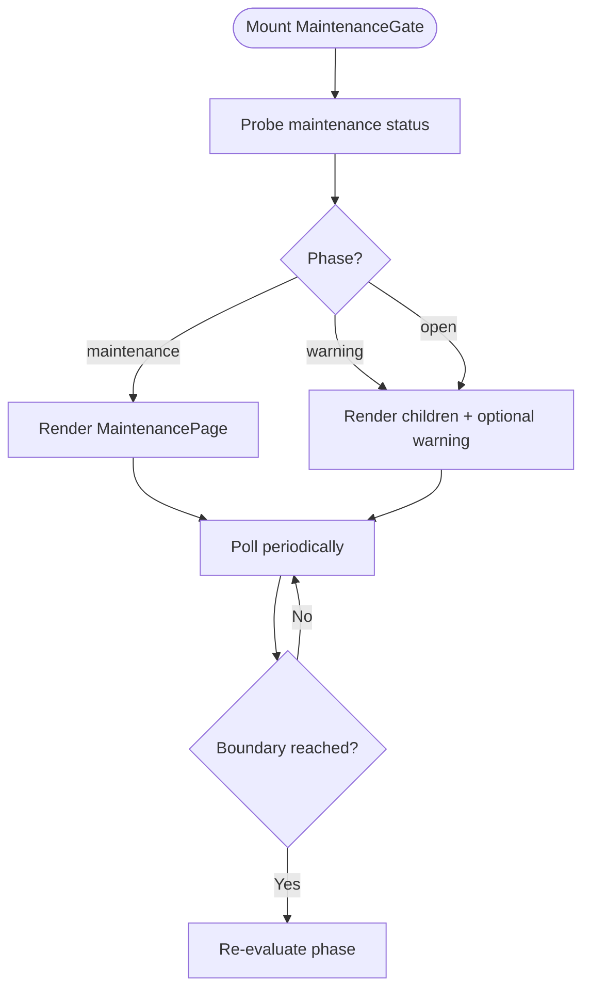
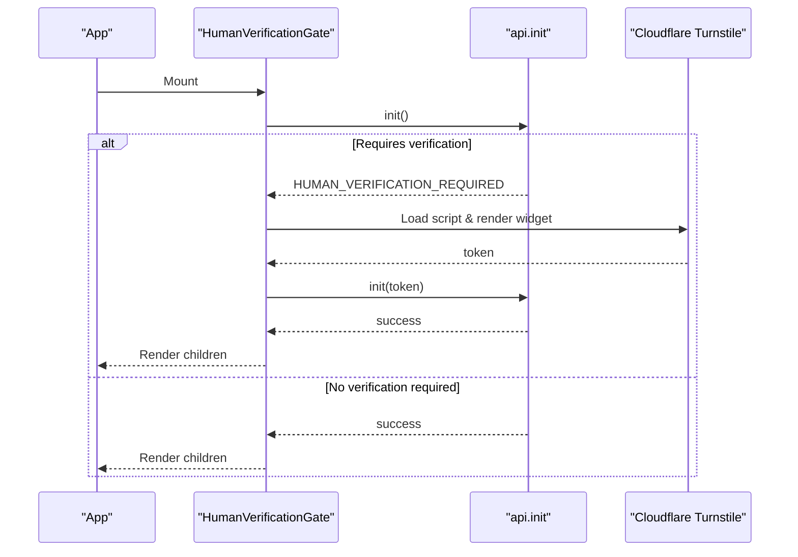
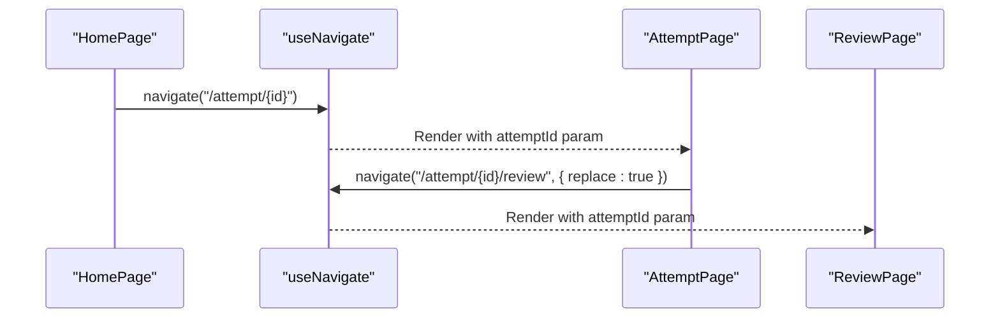
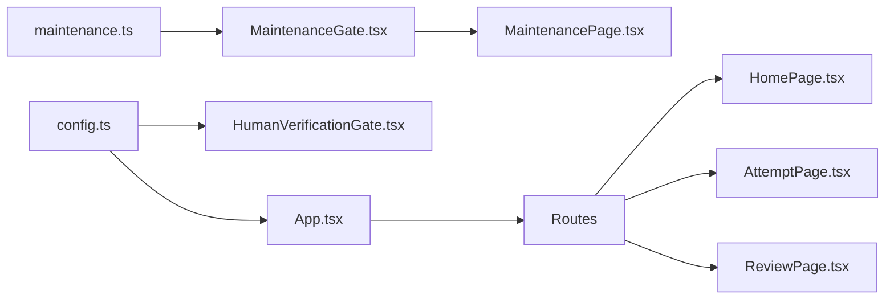

# Routing and Navigation System

<cite>
**Referenced Files in This Document**
- [App.tsx](file://web/src/App.tsx)
- [main.tsx](file://web/src/main.tsx)
- [HomePage.tsx](file://web/src/pages/HomePage.tsx)
- [AttemptPage.tsx](file://web/src/pages/AttemptPage.tsx)
- [ReviewPage.tsx](file://web/src/pages/ReviewPage.tsx)
- [MaintenancePage.tsx](file://web/src/pages/MaintenancePage.tsx)
- [MenuBar.tsx](file://web/src/components/MenuBar.tsx)
- [RouteMetadata.tsx](file://web/src/components/RouteMetadata.tsx)
- [MaintenanceGate.tsx](file://web/src/components/MaintenanceGate.tsx)
- [HumanVerificationGate.tsx](file://web/src/components/HumanVerificationGate.tsx)
- [config.ts](file://web/src/lib/config.ts)
- [maintenance.ts](file://web/src/lib/maintenance.ts)
</cite>

## Table of Contents
1. Introduction
2. Project Structure
3. Core Components
4. Architecture Overview
5. Detailed Component Analysis
6. Dependency Analysis
7. Performance Considerations
8. Troubleshooting Guide
9. Conclusion

## Introduction
This document explains the routing and navigation system used by the TBS LPDP Try Out application. It focuses on the hash-based routing strategy that ensures compatibility with GitHub Pages static hosting, the route structure for home, exam attempts, review pages, and maintenance, and the navigation guards that protect routes based on maintenance mode and human verification. It also covers programmatic navigation patterns, route parameters handling, query-like state usage, deep linking support, navigation state management, breadcrumbs via metadata, mobile-responsive navigation, and how the app integrates with browser history during exams.

## Project Structure
The application is a React SPA built with Vite and uses React Router’s HashRouter to avoid server-side rewrites required by GitHub Pages. Routes are defined at the top level and wrapped by gates that enforce maintenance and verification policies before rendering page components.

**Diagram sources**
- [App.tsx:44-60](file://web/src/App.tsx#L44-L60)
- [MaintenanceGate.tsx:35-139](file://web/src/components/MaintenanceGate.tsx#L35-L139)
- [HumanVerificationGate.tsx:77-158](file://web/src/components/HumanVerificationGate.tsx#L77-L158)

**Section sources**
- [main.tsx:6-10](file://web/src/main.tsx#L6-L10)
- [App.tsx:44-60](file://web/src/App.tsx#L44-L60)

## Core Components
- HashRouter root: The app wraps all routes in HashRouter to ensure deep links work without server rewrites on GitHub Pages and to keep builds host-agnostic for both web and offline app contexts.
- Route definitions:
  - Home: /
  - Attempt: /attempt/:attemptId
  - Review: /attempt/:attemptId/review
  - Catch-all: redirects to home
- Gates:
  - MaintenanceGate: polls maintenance status and renders a maintenance page when active; otherwise passes through.
  - HumanVerificationGate: performs anonymous authentication and shows a Turnstile challenge when required.
- Metadata: RouteMetadata updates document title and robots meta tags per route.
- Navigation UI: MenuBar provides responsive navigation and section scrolling on the home page.

**Section sources**
- [App.tsx:44-60](file://web/src/App.tsx#L44-L60)
- [RouteMetadata.tsx:17-38](file://web/src/components/RouteMetadata.tsx#L17-L38)
- [MenuBar.tsx:40-99](file://web/src/components/MenuBar.tsx#L40-L99)

## Architecture Overview
The routing architecture centers around a small set of routes protected by two gates. All user interactions either navigate programmatically or use declarative Links. Deep links rely on hash fragments maintained by HashRouter.

**Diagram sources**
- [App.tsx:44-60](file://web/src/App.tsx#L44-L60)
- [MaintenanceGate.tsx:35-139](file://web/src/components/MaintenanceGate.tsx#L35-L139)
- [HumanVerificationGate.tsx:77-158](file://web/src/components/HumanVerificationGate.tsx#L77-L158)
- [RouteMetadata.tsx:17-38](file://web/src/components/RouteMetadata.tsx#L17-L38)

## Detailed Component Analysis

### HashRouter and Route Definitions
- Root router: HashRouter is used intentionally to avoid 404s on refresh for deep links under GitHub Pages and to remain host-agnostic for offline apps.
- Routes:
  - Home: /
  - Attempt: /attempt/:attemptId
  - Review: /attempt/:attemptId/review
  - Catch-all: redirects to home using replace navigation
- Scroll-to-top behavior: On every route change, the page scrolls to the top automatically.

**Diagram sources**
- [App.tsx:44-60](file://web/src/App.tsx#L44-L60)

**Section sources**
- [App.tsx:13-21](file://web/src/App.tsx#L13-L21)
- [App.tsx:44-60](file://web/src/App.tsx#L44-L60)

### Navigation Guards

#### Maintenance Gate
- Purpose: Enforce scheduled maintenance windows even on client-only routes.
- Behavior:
  - Probes maintenance status with timeout and polling.
  - Computes phase (open, warning, maintenance) using current time and schedule boundaries.
  - Renders MaintenancePage when phase is maintenance; otherwise renders children.
  - Dismisses warning banners per schedule key within session storage.
  - Uses boundary timers to switch phases precisely at start/end/warning times.

**Diagram sources**
- [MaintenanceGate.tsx:40-139](file://web/src/components/MaintenanceGate.tsx#L40-L139)
- [maintenance.ts:7-29](file://web/src/lib/maintenance.ts#L7-L29)

**Section sources**
- [MaintenanceGate.tsx:35-139](file://web/src/components/MaintenanceGate.tsx#L35-L139)
- [maintenance.ts:7-29](file://web/src/lib/maintenance.ts#L7-L29)

#### Human Verification Gate
- Purpose: Ensure anonymous sign-in flows include a CAPTCHA when required by the backend.
- Behavior:
  - Attempts initialization; if backend requires verification, renders a Turnstile widget.
  - Loads the Turnstile script only when needed and manages lifecycle safely.
  - In mock mode or after successful verification, renders children.

**Diagram sources**
- [HumanVerificationGate.tsx:77-158](file://web/src/components/HumanVerificationGate.tsx#L77-L158)
- [config.ts:59-60](file://web/src/lib/config.ts#L59-L60)

**Section sources**
- [HumanVerificationGate.tsx:77-158](file://web/src/components/HumanVerificationGate.tsx#L77-L158)
- [config.ts:59-60](file://web/src/lib/config.ts#L59-L60)

### Route Parameters and Programmatic Navigation
- Route parameters:
  - attemptId is read from URL params in AttemptPage and ReviewPage to load attempt-specific data.
- Programmatic navigation:
  - HomePage navigates to a new attempt using navigate("/attempt/:id").
  - AttemptPage navigates to review upon completion or when all sections are done, using replace to avoid back-stack issues mid-exam.
  - MenuBar navigates to home with location state to scroll to a specific section.

**Diagram sources**
- [HomePage.tsx:117-127](file://web/src/pages/HomePage.tsx#L117-L127)
- [AttemptPage.tsx:46-59](file://web/src/pages/AttemptPage.tsx#L46-L59)
- [AttemptPage.tsx:78-93](file://web/src/pages/AttemptPage.tsx#L78-L93)

**Section sources**
- [AttemptPage.tsx:21-72](file://web/src/pages/AttemptPage.tsx#L21-L72)
- [HomePage.tsx:117-127](file://web/src/pages/HomePage.tsx#L117-L127)

### Query String Management and Deep Linking
- Query strings: Not used for core routing; instead, route parameters carry identifiers (e.g., attemptId).
- Location state: Used to pass non-URL context such as scrollTo targets when navigating between pages.
- Deep linking: Enabled via HashRouter; deep links like #/attempt/123/review resolve correctly without server rewrites.

**Section sources**
- [MenuBar.tsx:60-64](file://web/src/components/MenuBar.tsx#L60-L64)
- [App.tsx:38-43](file://web/src/App.tsx#L38-L43)

### Navigation State Management and Breadcrumbs
- Navigation state:
  - MenuBar uses location.state.scrollTo to instruct HomePage to scroll to a section after navigation.
  - AttemptPage uses local state to manage loading, intro, exam, and error phases.
- Breadcrumbs:
  - RouteMetadata sets dynamic document titles and robots directives per route to reflect current context (home vs. ongoing exam vs. review).

**Section sources**
- [MenuBar.tsx:60-64](file://web/src/components/MenuBar.tsx#L60-L64)
- [HomePage.tsx:94-100](file://web/src/pages/HomePage.tsx#L94-L100)
- [RouteMetadata.tsx:17-38](file://web/src/components/RouteMetadata.tsx#L17-L38)

### Mobile-Responsive Navigation Patterns
- MenuBar adapts to screen size:
  - Desktop: horizontal inline navigation.
  - Mobile (<768px): hamburger menu with slide-down panel and keyboard accessibility (Escape to close).
- Scroll-to-top button appears after scrolling down and respects reduced motion preferences.

**Section sources**
- [MenuBar.tsx:40-99](file://web/src/components/MenuBar.tsx#L40-L99)
- [styles.css:270-358](file://web/src/styles.css#L270-L358)

### Browser History Integration During Exams
- Back/forward behavior:
  - When an attempt completes or transitions to review, the app uses replace navigation to avoid leaving intermediate states in the history stack.
  - This prevents accidental back navigation into incomplete exam states.
- HashRouter maintains history entries for each route change, enabling standard browser back/forward while respecting replace semantics where appropriate.

**Section sources**
- [AttemptPage.tsx:46-59](file://web/src/pages/AttemptPage.tsx#L46-L59)
- [AttemptPage.tsx:78-93](file://web/src/pages/AttemptPage.tsx#L78-L93)

## Dependency Analysis
The routing layer depends on configuration flags and external services gated behind environment settings.

**Diagram sources**
- [config.ts:16-43](file://web/src/lib/config.ts#L16-L43)
- [maintenance.ts:7-29](file://web/src/lib/maintenance.ts#L7-L29)
- [App.tsx:44-60](file://web/src/App.tsx#L44-L60)

**Section sources**
- [config.ts:16-43](file://web/src/lib/config.ts#L16-L43)
- [maintenance.ts:7-29](file://web/src/lib/maintenance.ts#L7-L29)
- [App.tsx:44-60](file://web/src/App.tsx#L44-L60)

## Performance Considerations
- HashRouter avoids server rewrites and keeps builds portable across environments (web and offline app).
- Maintenance gate uses polling with timeouts and precise boundary timers to minimize unnecessary re-renders while ensuring timely transitions.
- HumanVerificationGate loads Turnstile only when required and cleans up resources on unmount.
- RouteMetadata updates document metadata efficiently per route change.

[No sources needed since this section provides general guidance]

## Troubleshooting Guide
- Deep link 404 on refresh:
  - Cause: Using BrowserRouter or server rewrite requirements.
  - Resolution: Use HashRouter as implemented.
- Maintenance page blocks access:
  - Check maintenance schedule and server time; verify probe succeeds and boundary timers fire.
  - If first probe fails, the app fails open to avoid locking users out.
- Human verification loop:
  - Ensure Turnstile site key is configured and network allows loading the script.
  - In mock mode, verification is bypassed.

**Section sources**
- [App.tsx:38-43](file://web/src/App.tsx#L38-L43)
- [MaintenanceGate.tsx:56-83](file://web/src/components/MaintenanceGate.tsx#L56-L83)
- [HumanVerificationGate.tsx:36-69](file://web/src/components/HumanVerificationGate.tsx#L36-L69)

## Conclusion
The routing and navigation system leverages HashRouter for robust deep linking on static hosting, defines a minimal set of routes for home, attempts, and reviews, and enforces safety via maintenance and human verification gates. Programmatic navigation and location state provide smooth UX, while metadata updates maintain clear breadcrumbs. The design balances reliability, performance, and accessibility across web and offline app contexts.

[No sources needed since this section summarizes without analyzing specific files]