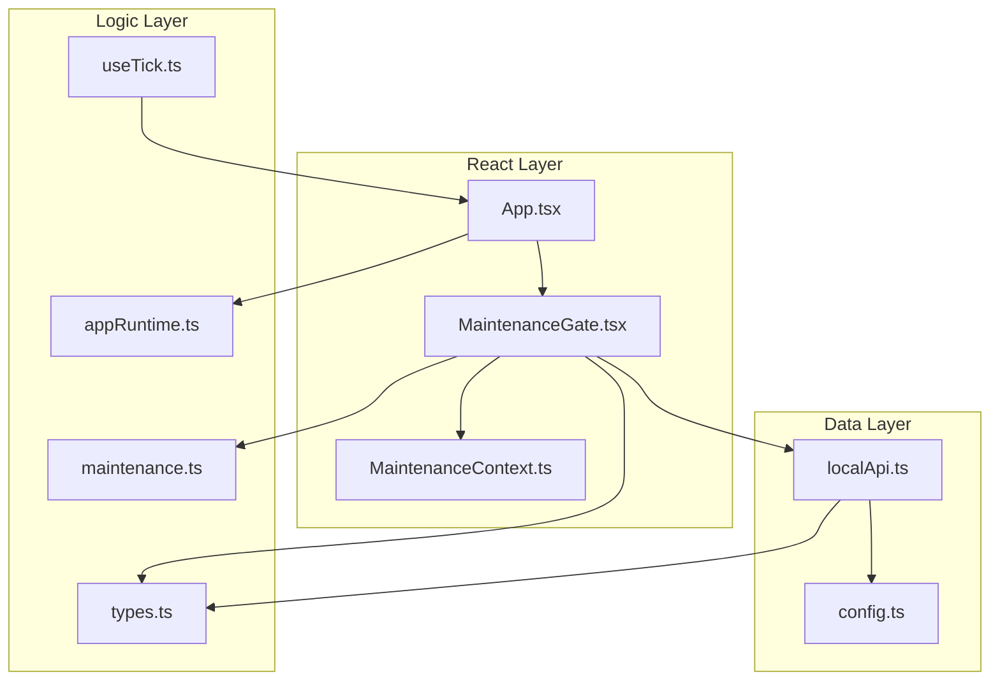
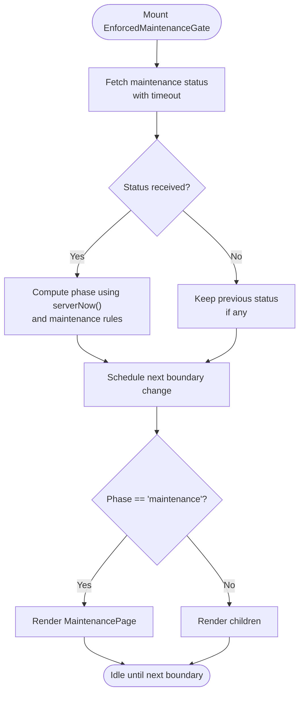
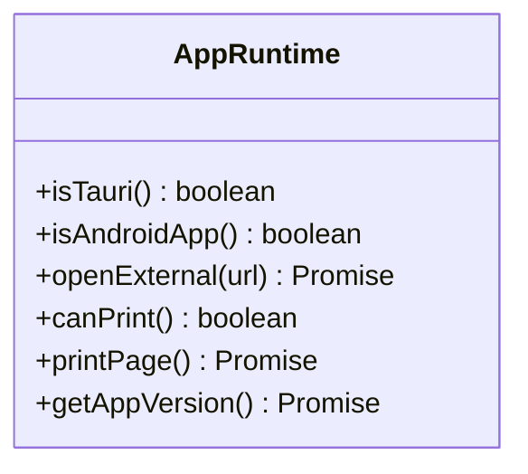
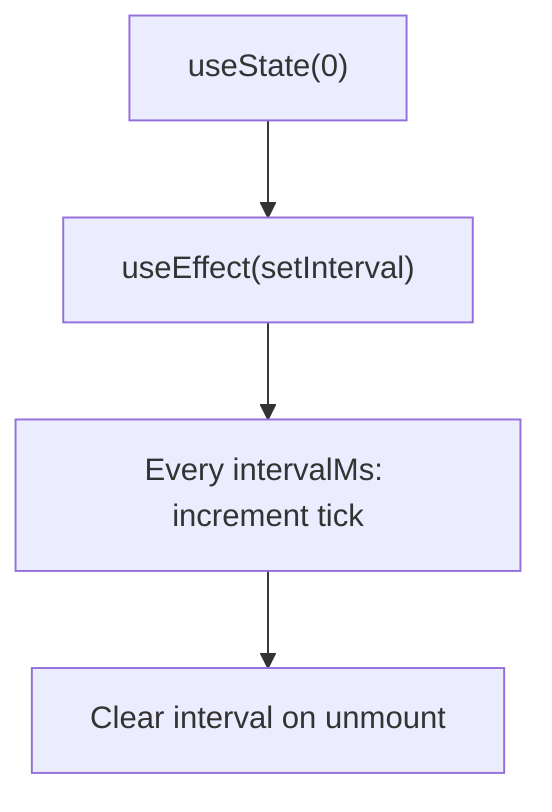
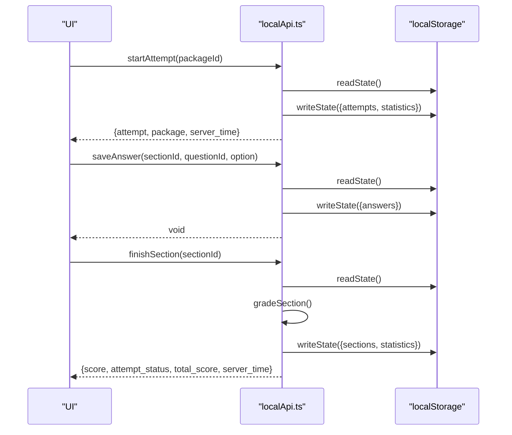
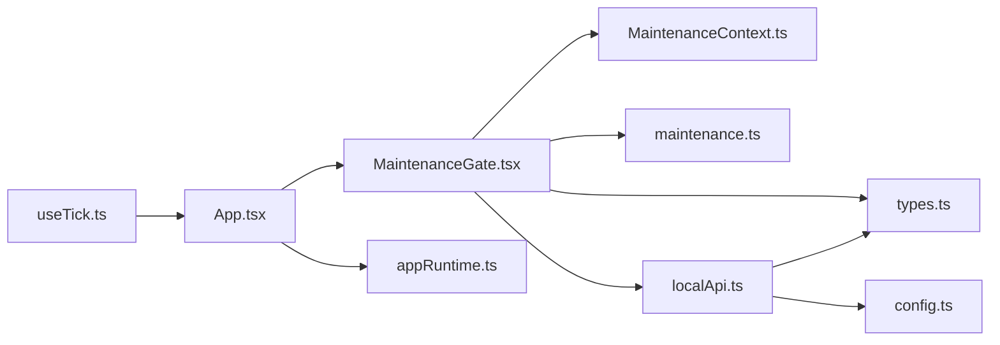

# State Management Architecture

<cite>
**Referenced Files in This Document**
- [MaintenanceContext.ts](file://web/src/contexts/MaintenanceContext.ts)
- [MaintenanceGate.tsx](file://web/src/components/MaintenanceGate.tsx)
- [maintenance.ts](file://web/src/lib/maintenance.ts)
- [types.ts](file://web/src/lib/types.ts)
- [appRuntime.ts](file://web/src/lib/appRuntime.ts)
- [useTick.ts](file://web/src/hooks/useTick.ts)
- [localApi.ts](file://web/src/lib/localApi.ts)
- [config.ts](file://web/src/lib/config.ts)
- [App.tsx](file://web/src/App.tsx)
</cite>

## Table of Contents
1. Introduction
2. Project Structure
3. Core Components
4. Architecture Overview
5. Detailed Component Analysis
6. Dependency Analysis
7. Performance Considerations
8. Troubleshooting Guide
9. Conclusion

## Introduction
This document explains the state management architecture of the TBS LPDP Try Out application with a focus on how global and local state are combined to deliver a responsive, resilient user experience. The app uses a hybrid approach:
- React Context for application-wide state (notably maintenance mode and related UI signals).
- Local component state for UI interactions and transient data.
- A thin runtime module that abstracts platform capabilities and environment detection.
- Custom hooks for reusable stateful logic such as timers.
- A local API layer backed by localStorage for offline capability, session persistence, and deterministic behavior without a network.

The design emphasizes predictable transitions, safe fallbacks when offline or during network failures, and performance-conscious rendering through memoization and selective updates.

## Project Structure
At a high level, state-related code is organized into:
- contexts: global React context providers and consumers.
- components: gatekeepers and UI wrappers that manage lifecycle and visibility based on global state.
- lib: shared modules for types, configuration, runtime helpers, maintenance scheduling, and data access (including an offline-local implementation).
- hooks: reusable stateful logic like timers.
- pages: route-level components that consume context and APIs.



**Diagram sources**
- [App.tsx:44-60](file://web/src/App.tsx#L44-L60)
- [MaintenanceGate.tsx:35-141](file://web/src/components/MaintenanceGate.tsx#L35-L141)
- [MaintenanceContext.ts:4-24](file://web/src/contexts/MaintenanceContext.ts#L4-L24)
- [maintenance.ts:7-47](file://web/src/lib/maintenance.ts#L7-L47)
- [types.ts:213-226](file://web/src/lib/types.ts#L213-L226)
- [appRuntime.ts:12-72](file://web/src/lib/appRuntime.ts#L12-L72)
- [useTick.ts:4-11](file://web/src/hooks/useTick.ts#L4-L11)
- [localApi.ts:27-36](file://web/src/lib/localApi.ts#L27-L36)
- [config.ts:16-43](file://web/src/lib/config.ts#L16-L43)

**Section sources**
- [App.tsx:44-60](file://web/src/App.tsx#L44-L60)
- [MaintenanceGate.tsx:35-141](file://web/src/components/MaintenanceGate.tsx#L35-L141)
- [MaintenanceContext.ts:4-24](file://web/src/contexts/MaintenanceContext.ts#L4-L24)
- [maintenance.ts:7-47](file://web/src/lib/maintenance.ts#L7-L47)
- [types.ts:213-226](file://web/src/lib/types.ts#L213-L226)
- [appRuntime.ts:12-72](file://web/src/lib/appRuntime.ts#L12-L72)
- [useTick.ts:4-11](file://web/src/hooks/useTick.ts#L4-L11)
- [localApi.ts:27-36](file://web/src/lib/localApi.ts#L27-L36)
- [config.ts:16-43](file://web/src/lib/config.ts#L16-L43)

## Core Components
- MaintenanceContext: Provides global maintenance status, phase, warning dismissal, refresh control, and a refreshing indicator to the tree below it.
- MaintenanceGate: Orchestrates fetching and caching of maintenance status, computes phase transitions, schedules boundary updates, and renders either a maintenance page or children. It also exposes a provider value consumed by the rest of the app.
- appRuntime: Detects platform/runtime characteristics (e.g., Tauri vs browser), opens external links, prints, and retrieves app version. Used to adapt behavior across environments.
- useTick: A simple timer hook that triggers periodic re-renders, commonly used to drive countdown displays.
- localApi: Implements the full ExamApi contract using localStorage for persistence, enabling offline operation, deterministic grading, and session continuity across reloads.
- config: Build-time flags and constants that determine whether the app runs offline, which backend to target, and shared error codes.

These pieces together form a cohesive system where global state drives cross-cutting concerns (like maintenance mode), while local state handles UI-specific interactions. Data flows through a consistent API surface that can be backed by remote services or a local store depending on environment.

**Section sources**
- [MaintenanceContext.ts:4-24](file://web/src/contexts/MaintenanceContext.ts#L4-L24)
- [MaintenanceGate.tsx:35-141](file://web/src/components/MaintenanceGate.tsx#L35-L141)
- [appRuntime.ts:12-72](file://web/src/lib/appRuntime.ts#L12-L72)
- [useTick.ts:4-11](file://web/src/hooks/useTick.ts#L4-L11)
- [localApi.ts:27-36](file://web/src/lib/localApi.ts#L27-L36)
- [config.ts:16-43](file://web/src/lib/config.ts#L16-L43)

## Architecture Overview
The application composes state from multiple layers:
- Global state via React Context for maintenance mode and related UI signals.
- Platform-aware runtime utilities for environment-specific behaviors.
- A unified data access layer (ExamApi) implemented locally for offline scenarios and remotely for online scenarios.
- Timers and hooks to keep time-sensitive UIs updated.

```mermaid
sequenceDiagram
participant Browser as "Browser"
participant App as "App.tsx"
participant Gate as "MaintenanceGate.tsx"
participant API as "localApi.ts / supabaseApi.ts"
participant Storage as "localStorage"
participant Ctx as "MaintenanceContext.ts"
Browser->>App : Mount
App->>Gate : Render with children
Gate->>API : getMaintenanceStatus()
API-->>Gate : MaintenanceStatus
Gate->>Storage : Read/write schedule keys (optional)
Gate->>Ctx : Provide {status, phase, warningDismissed, refreshing, dismissWarning, refresh}
Note over Gate,Ctx : Consumers render based on phase; maintenance page shown when active
```

**Diagram sources**
- [App.tsx:44-60](file://web/src/App.tsx#L44-L60)
- [MaintenanceGate.tsx:56-125](file://web/src/components/MaintenanceGate.tsx#L56-L125)
- [localApi.ts:309-375](file://web/src/lib/localApi.ts#L309-L375)
- [MaintenanceContext.ts:13-24](file://web/src/contexts/MaintenanceContext.ts#L13-L24)

## Detailed Component Analysis

### MaintenanceContext and MaintenanceGate
- Purpose: Centralize application-wide maintenance mode and expose a stable interface to consumers.
- Key responsibilities:
  - Fetch maintenance status with timeout protection and polling.
  - Compute current phase (open, warning, maintenance) using server-aligned timestamps.
  - Schedule boundary transitions to update UI at exact times without waiting for the next poll.
  - Persist per-schedule warning dismissal in sessionStorage for better UX.
  - Provide a context value including status, phase, warningDismissed, refreshing, and actions to dismiss or refresh.
- Error handling:
  - On probe failure, the gate fails open (allows content) but retains previously known schedule if available.
  - Timeout guards prevent hanging requests.
- Rendering strategy:
  - If phase is maintenance, render a dedicated MaintenancePage; otherwise render children.
  - While loading, show a minimal loading indicator.



**Diagram sources**
- [MaintenanceGate.tsx:56-125](file://web/src/components/MaintenanceGate.tsx#L56-L125)
- [maintenance.ts:7-29](file://web/src/lib/maintenance.ts#L7-L29)

**Section sources**
- [MaintenanceGate.tsx:35-141](file://web/src/components/MaintenanceGate.tsx#L35-L141)
- [maintenance.ts:7-47](file://web/src/lib/maintenance.ts#L7-L47)
- [MaintenanceContext.ts:4-24](file://web/src/contexts/MaintenanceContext.ts#L4-L24)

### appRuntime Module
- Purpose: Abstract platform differences between web and Tauri shells, exposing utilities for opening external URLs, printing, and retrieving app version.
- Behavior:
  - Detects Tauri presence and Android WebView to tailor behavior.
  - Dynamically imports Tauri plugins only when running in-app to avoid bundling them in web builds.
  - Provides safe defaults for browser-only features.



**Diagram sources**
- [appRuntime.ts:12-72](file://web/src/lib/appRuntime.ts#L12-L72)

**Section sources**
- [appRuntime.ts:12-72](file://web/src/lib/appRuntime.ts#L12-L72)

### useTick Hook
- Purpose: Drive periodic UI updates (e.g., countdown timers) with a configurable interval.
- Characteristics:
  - Uses setInterval internally and cleans up on unmount.
  - Returns a tick counter to trigger re-renders.



**Diagram sources**
- [useTick.ts:4-11](file://web/src/hooks/useTick.ts#L4-L11)

**Section sources**
- [useTick.ts:4-11](file://web/src/hooks/useTick.ts#L4-L11)

### Offline State Persistence and Session Management (localApi)
- Purpose: Implement the full ExamApi contract using localStorage to support offline usage, deterministic grading, and persistent sessions across reloads.
- Key mechanisms:
  - Persistent storage key for attempts, sections, answers, reports, releases, and statistics.
  - Immutable release snapshots pinned to each attempt to ensure consistency even if the question bank changes.
  - Grading logic applied on finish or deadline expiration, updating scores and statistics.
  - Service status simulation for capacity gating in offline mode.
  - Maintenance status override via environment variables for development and local testing.



**Diagram sources**
- [localApi.ts:405-426](file://web/src/lib/localApi.ts#L405-L426)
- [localApi.ts:467-487](file://web/src/lib/localApi.ts#L467-L487)
- [localApi.ts:489-496](file://web/src/lib/localApi.ts#L489-L496)

**Section sources**
- [localApi.ts:27-36](file://web/src/lib/localApi.ts#L27-L36)
- [localApi.ts:95-115](file://web/src/lib/localApi.ts#L95-L115)
- [localApi.ts:213-260](file://web/src/lib/localApi.ts#L213-L260)
- [localApi.ts:405-496](file://web/src/lib/localApi.ts#L405-L496)

### Configuration and Environment Flags
- Purpose: Control build-time and runtime behavior such as offline mode, Supabase configuration, and Turnstile integration.
- Highlights:
  - IS_OFFLINE_APP toggles offline behavior and removes network dependencies from the bundle.
  - SUPABASE_URL and SUPABASE_PUBLIC_KEY are omitted in offline builds to avoid shipping secrets.
  - Shared error codes and events are centralized here for consistency.

**Section sources**
- [config.ts:16-43](file://web/src/lib/config.ts#L16-L43)
- [config.ts:45-68](file://web/src/lib/config.ts#L45-L68)

## Dependency Analysis
The following diagram shows how components and modules depend on each other for state management:



**Diagram sources**
- [App.tsx:44-60](file://web/src/App.tsx#L44-L60)
- [MaintenanceGate.tsx:35-141](file://web/src/components/MaintenanceGate.tsx#L35-L141)
- [MaintenanceContext.ts:4-24](file://web/src/contexts/MaintenanceContext.ts#L4-L24)
- [maintenance.ts:7-47](file://web/src/lib/maintenance.ts#L7-L47)
- [types.ts:213-226](file://web/src/lib/types.ts#L213-L226)
- [localApi.ts:27-36](file://web/src/lib/localApi.ts#L27-L36)
- [config.ts:16-43](file://web/src/lib/config.ts#L16-L43)
- [appRuntime.ts:12-72](file://web/src/lib/appRuntime.ts#L12-L72)
- [useTick.ts:4-11](file://web/src/hooks/useTick.ts#L4-L11)

**Section sources**
- [App.tsx:44-60](file://web/src/App.tsx#L44-L60)
- [MaintenanceGate.tsx:35-141](file://web/src/components/MaintenanceGate.tsx#L35-L141)
- [MaintenanceContext.ts:4-24](file://web/src/contexts/MaintenanceContext.ts#L4-L24)
- [maintenance.ts:7-47](file://web/src/lib/maintenance.ts#L7-L47)
- [types.ts:213-226](file://web/src/lib/types.ts#L213-L226)
- [localApi.ts:27-36](file://web/src/lib/localApi.ts#L27-L36)
- [config.ts:16-43](file://web/src/lib/config.ts#L16-L43)
- [appRuntime.ts:12-72](file://web/src/lib/appRuntime.ts#L12-L72)
- [useTick.ts:4-11](file://web/src/hooks/useTick.ts#L4-L11)

## Performance Considerations
- Memoization:
  - Phase computation and schedule key derivation are memoized to avoid unnecessary recalculations.
  - Context value is memoized to minimize re-renders in consumers.
- Selective Re-renders:
  - Boundary-based updates schedule precise ticks at maintenance phase transitions rather than relying solely on polling intervals.
  - useTick provides a controlled interval mechanism for UI elements that need frequent updates.
- Bundle Optimization:
  - Platform-specific features (e.g., Tauri plugins) are dynamically imported only when needed, keeping web bundles lean.
  - Offline mode excludes network-dependent code paths entirely.
- State Updates:
  - localApi batches writes to localStorage and ensures idempotent operations to reduce redundant updates.
  - Attempts pin immutable releases to avoid inconsistent reads when the question bank changes.

[No sources needed since this section provides general guidance]

## Troubleshooting Guide
- Maintenance status not updating:
  - Check probe timeout and polling interval; verify network connectivity or local maintenance overrides in development.
  - Confirm boundary scheduling logic and that server timestamps are valid.
- Offline mode issues:
  - Ensure IS_OFFLINE_APP is set correctly and that localStorage is accessible.
  - Validate that localApi methods return expected shapes and that storage keys are present.
- Timer drift or excessive re-renders:
  - Adjust useTick interval to balance responsiveness and performance.
  - Use memoization around derived values to limit re-renders.
- Platform-specific features not working:
  - Verify isTauri and isAndroidApp checks; confirm dynamic imports succeed in the intended environment.

**Section sources**
- [MaintenanceGate.tsx:56-125](file://web/src/components/MaintenanceGate.tsx#L56-L125)
- [localApi.ts:309-375](file://web/src/lib/localApi.ts#L309-L375)
- [useTick.ts:4-11](file://web/src/hooks/useTick.ts#L4-L11)
- [appRuntime.ts:12-72](file://web/src/lib/appRuntime.ts#L12-L72)

## Conclusion
The TBS LPDP Try Out application employs a pragmatic hybrid state management strategy:
- React Context centralizes global concerns like maintenance mode, providing a clean interface to consumers.
- Local component state manages UI interactions efficiently.
- A robust runtime abstraction adapts behavior across platforms.
- A local API layer enables offline capability, session persistence, and deterministic grading.
- Custom hooks encapsulate reusable stateful logic such as timers.

Together, these patterns deliver a responsive, resilient user experience with clear separation of concerns, strong error handling, and performance-conscious design.

[No sources needed since this section summarizes without analyzing specific files]