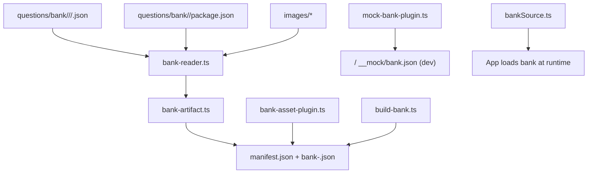
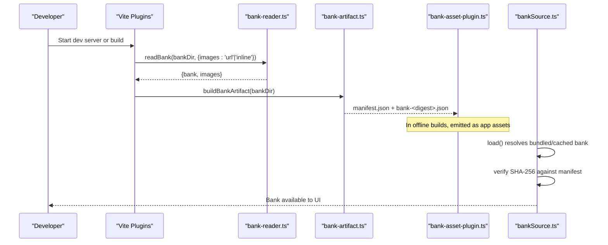
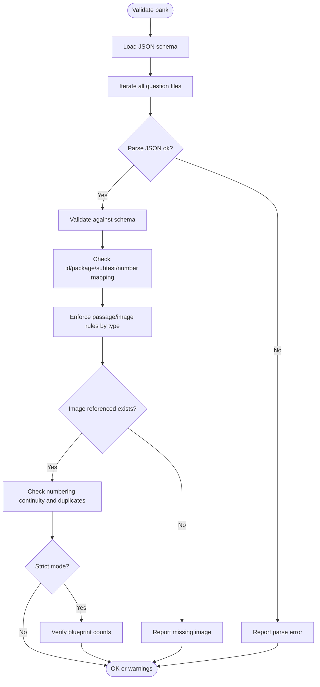
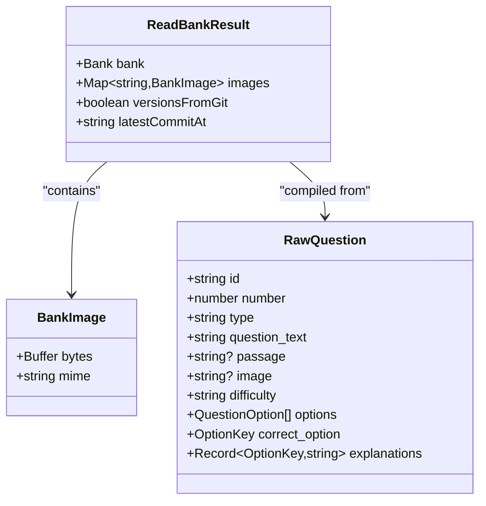
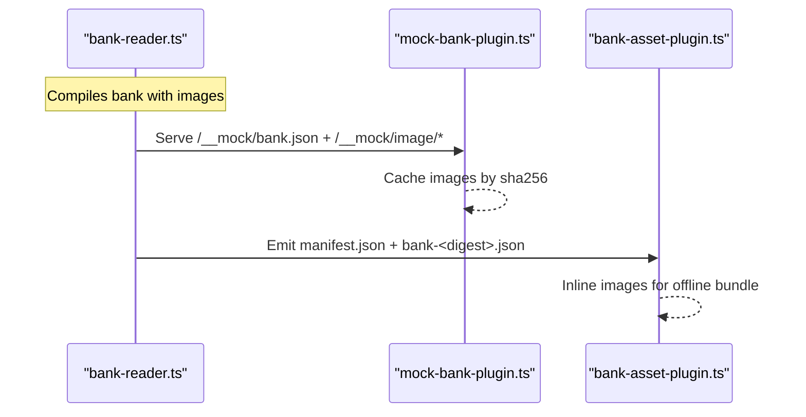
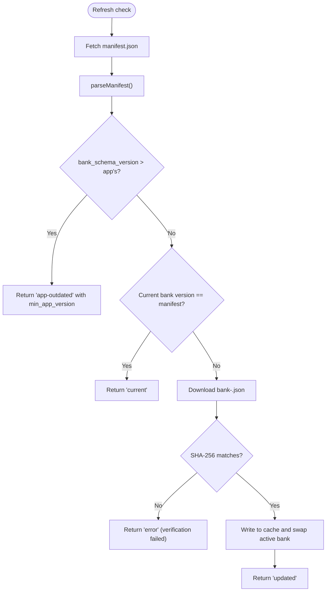
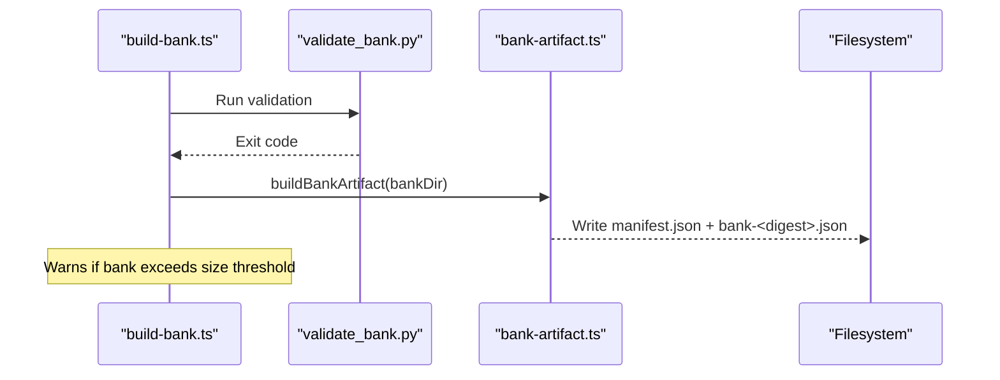
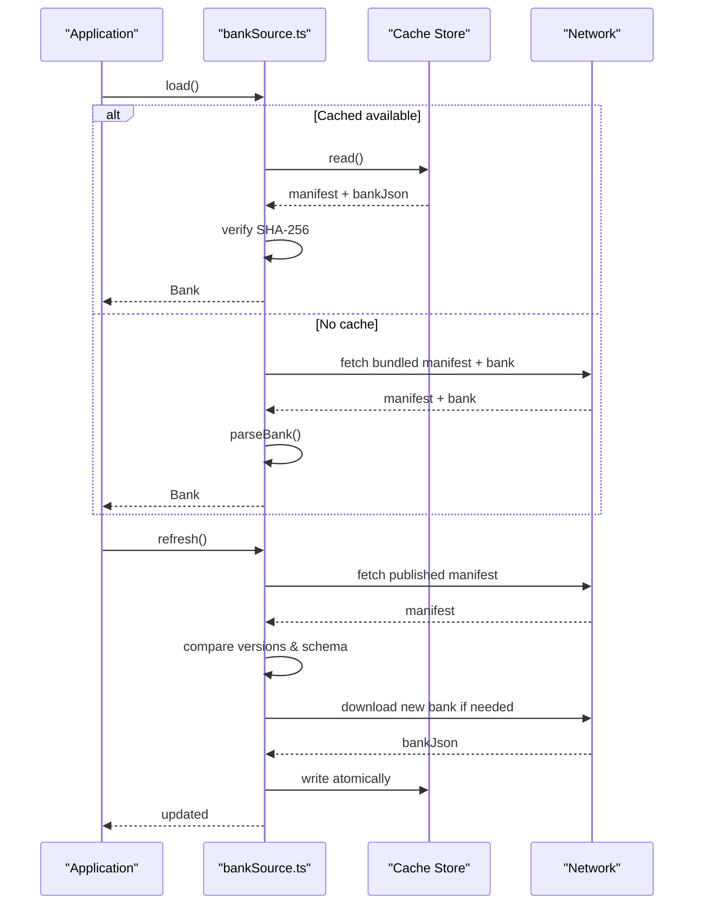
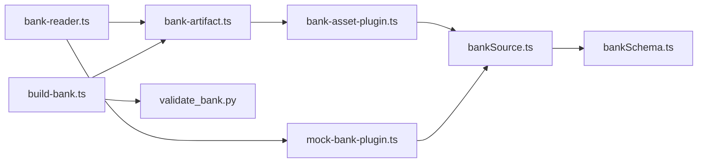

# Bundled Question Bank

<cite>
**Referenced Files in This Document**
- [schema.json](file://questions/schema.json)
- [validate_bank.py](file://questions/generator/validate_bank.py)
- [bank-reader.ts](file://web/vite/bank-reader.ts)
- [bank-artifact.ts](file://web/vite/bank-artifact.ts)
- [bank-asset-plugin.ts](file://web/vite/bank-asset-plugin.ts)
- [mock-bank-plugin.ts](file://web/vite/mock-bank-plugin.ts)
- [build-bank.ts](file://web/scripts/build-bank.ts)
- [vite.config.ts](file://web/vite.config.ts)
- [bankSchema.ts](file://web/src/lib/bankSchema.ts)
- [bankSource.ts](file://web/src/lib/bankSource.ts)
- [package.json (example package)](file://questions/bank/1/package.json)
- [verbal 001.json (sample question)](file://questions/bank/1/verbal/001.json)
- [kuantitatif 001.json (sample question)](file://questions/bank/1/kuantitatif/001.json)
</cite>

## Table of Contents
1. [Introduction](#introduction)
2. [Project Structure](#project-structure)
3. [Core Components](#core-components)
4. [Architecture Overview](#architecture-overview)
5. [Detailed Component Analysis](#detailed-component-analysis)
6. [Dependency Analysis](#dependency-analysis)
7. [Performance Considerations](#performance-considerations)
8. [Troubleshooting Guide](#troubleshooting-guide)
9. [Conclusion](#conclusion)
10. [Appendices](#appendices)

## Introduction
This document explains the bundled question bank system that packages all test materials directly into the application. It covers how Vite plugins read and validate question JSON files during the build process to create optimized artifacts, schema validation for question integrity, asset management for images and metadata, versioning strategies for updates and backward compatibility, size optimization techniques, lazy loading strategies for large question sets, and troubleshooting guidance for common issues.

## Project Structure
The question bank is authored under questions/bank as a set of numbered packages, each containing subtest folders (verbal, kuantitatif, pemecahan_masalah), per-question JSON files, and an optional images directory. The build pipeline lives under web/vite and web/scripts, with runtime logic under web/src/lib.

**Diagram sources**
- [bank-reader.ts:159-297](file://web/vite/bank-reader.ts#L159-L297)
- [bank-artifact.ts:25-55](file://web/vite/bank-artifact.ts#L25-L55)
- [bank-asset-plugin.ts:13-56](file://web/vite/bank-asset-plugin.ts#L13-L56)
- [mock-bank-plugin.ts:21-50](file://web/vite/mock-bank-plugin.ts#L21-L50)
- [build-bank.ts:42-80](file://web/scripts/build-bank.ts#L42-L80)
- [bankSource.ts:206-317](file://web/src/lib/bankSource.ts#L206-L317)

**Section sources**
- [bank-reader.ts:159-297](file://web/vite/bank-reader.ts#L159-L297)
- [bank-artifact.ts:25-55](file://web/vite/bank-artifact.ts#L25-L55)
- [bank-asset-plugin.ts:13-56](file://web/vite/bank-asset-plugin.ts#L13-L56)
- [mock-bank-plugin.ts:21-50](file://web/vite/mock-bank-plugin.ts#L21-L50)
- [build-bank.ts:42-80](file://web/scripts/build-bank.ts#L42-L80)
- [bankSource.ts:206-317](file://web/src/lib/bankSource.ts#L206-L317)

## Core Components
- Schema definition: defines the required fields and constraints for each question file.
- Validator: enforces schema and blueprint rules before publishing or bundling.
- Bank reader: compiles raw question JSONs into a single structured bank, handling images and versions.
- Artifact builder: produces content-addressed bank and manifest files.
- Vite plugins: serve mock bank in dev and emit bundled assets in offline builds.
- Runtime loader: resolves and verifies the active bank from bundled snapshot or cache.

Key responsibilities:
- Validate question integrity using schema and Python validator.
- Build deterministic artifacts keyed by content hash.
- Manage assets (images) either inline or via URL references.
- Provide dev-time mock endpoints and production-time bundled assets.
- Ensure backward compatibility through schema versioning and minimum app version checks.

**Section sources**
- [schema.json:1-98](file://questions/schema.json#L1-L98)
- [validate_bank.py:44-194](file://questions/generator/validate_bank.py#L44-L194)
- [bank-reader.ts:159-297](file://web/vite/bank-reader.ts#L159-L297)
- [bank-artifact.ts:25-55](file://web/vite/bank-artifact.ts#L25-L55)
- [bank-asset-plugin.ts:13-56](file://web/vite/bank-asset-plugin.ts#L13-L56)
- [mock-bank-plugin.ts:21-50](file://web/vite/mock-bank-plugin.ts#L21-L50)
- [bankSchema.ts:7-84](file://web/src/lib/bankSchema.ts#L7-L84)
- [bankSource.ts:206-317](file://web/src/lib/bankSource.ts#L206-L317)

## Architecture Overview
The system has two primary flows:
- Build-time flow: reads questions, validates, compiles, and emits immutable artifacts.
- Runtime flow: loads the bank from a bundled snapshot or cached copy, verifies integrity, and optionally refreshes from published source.

**Diagram sources**
- [bank-reader.ts:159-297](file://web/vite/bank-reader.ts#L159-L297)
- [bank-artifact.ts:25-55](file://web/vite/bank-artifact.ts#L25-L55)
- [bank-asset-plugin.ts:23-56](file://web/vite/bank-asset-plugin.ts#L23-L56)
- [bankSource.ts:206-317](file://web/src/lib/bankSource.ts#L206-L317)

## Detailed Component Analysis

### Schema Validation
- JSON Schema defines required fields, types, enums, and patterns for questions, including image path format and option keys.
- Python validator runs in CI and build steps to enforce:
  - Schema compliance per question file.
  - Path-to-field consistency (id, package, subtest, number).
  - Option key uniqueness and correctness.
  - Passage/image requirements based on question type.
  - Image existence within package images directory.
  - Numbering continuity and blueprint counts.

**Diagram sources**
- [validate_bank.py:44-194](file://questions/generator/validate_bank.py#L44-L194)
- [schema.json:1-98](file://questions/schema.json#L1-L98)

**Section sources**
- [schema.json:1-98](file://questions/schema.json#L1-L98)
- [validate_bank.py:44-194](file://questions/generator/validate_bank.py#L44-L194)

### Bank Reader and Compilation
- Reads package manifests and subtest directories.
- Parses each question JSON and compiles into a normalized structure consumed by the engine.
- Handles images:
  - In dev mode, stores images in memory and serves via /__mock/image/<package>/<sha256>/<file>.
  - In offline builds, inlines images as data URIs to produce self-contained bank artifacts.
- Computes release digests per package and per question to ensure immutability.
- Derives question and package versions from git history when available; falls back to mtime otherwise.

**Diagram sources**
- [bank-reader.ts:47-60](file://web/vite/bank-reader.ts#L47-L60)
- [bank-reader.ts:137-157](file://web/vite/bank-reader.ts#L137-L157)
- [bank-reader.ts:159-297](file://web/vite/bank-reader.ts#L159-L297)

**Section sources**
- [bank-reader.ts:159-297](file://web/vite/bank-reader.ts#L159-L297)

### Asset Management
- Images are stored alongside packages under images/.
- During compilation:
  - Dev mode: images are served via middleware with content-type headers and long-lived caching.
  - Offline mode: images are inlined as base64 data URIs inside the bank JSON for zero-connectivity operation.
- Manifest and bank filenames are content-addressed to ensure immutability and safe caching.

**Diagram sources**
- [bank-reader.ts:220-234](file://web/vite/bank-reader.ts#L220-L234)
- [mock-bank-plugin.ts:21-50](file://web/vite/mock-bank-plugin.ts#L21-L50)
- [bank-asset-plugin.ts:23-56](file://web/vite/bank-asset-plugin.ts#L23-L56)

**Section sources**
- [bank-reader.ts:220-234](file://web/vite/bank-reader.ts#L220-L234)
- [mock-bank-plugin.ts:21-50](file://web/vite/mock-bank-plugin.ts#L21-L50)
- [bank-asset-plugin.ts:23-56](file://web/vite/bank-asset-plugin.ts#L23-L56)

### Versioning Strategy and Backward Compatibility
- Manifest includes:
  - schema_version and bank_schema_version to define contract stability.
  - min_app_version to prevent older apps from reading incompatible banks.
  - bank_version (first 12 hex chars of SHA-256) and generated_at timestamp.
- Runtime compares current app’s BANK_SCHEMA_VERSION with manifest’s bank_schema_version; if newer, prompts update.
- Content-addressed bank files ensure immutability; attempts pin to specific releases.

**Diagram sources**
- [bankSchema.ts:7-84](file://web/src/lib/bankSchema.ts#L7-L84)
- [bankSource.ts:267-317](file://web/src/lib/bankSource.ts#L267-L317)

**Section sources**
- [bankSchema.ts:7-84](file://web/src/lib/bankSchema.ts#L7-L84)
- [bankSource.ts:267-317](file://web/src/lib/bankSource.ts#L267-L317)

### Build-Time Artifacts and Offline Packaging
- build-bank.ts orchestrates validation and artifact generation:
  - Runs validate_bank.py to gate publication.
  - Ensures git history is present for reproducible versions.
  - Emits manifest.json and bank-<digest>.json to output directory.
- bank-asset-plugin.ts emits the same pair into the offline app’s assets for zero-connectivity installs.
- Vite config selects flavors:
  - Web production uses Supabase API and excludes local engine/answer keys.
  - Dev mock enables /__mock endpoints.
  - Offline flavor bundles the bank assets and disables remote dependencies.

**Diagram sources**
- [build-bank.ts:42-80](file://web/scripts/build-bank.ts#L42-L80)
- [bank-artifact.ts:25-55](file://web/vite/bank-artifact.ts#L25-L55)

**Section sources**
- [build-bank.ts:42-80](file://web/scripts/build-bank.ts#L42-L80)
- [bank-artifact.ts:25-55](file://web/vite/bank-artifact.ts#L25-L55)
- [vite.config.ts:18-52](file://web/vite.config.ts#L18-L52)

### Runtime Loading and Lazy Strategies
- bankSource.ts chooses between dev and offline sources based on environment flags.
- Offline source:
  - Loads bundled snapshot first, then cached copy if valid.
  - Verifies downloaded bank’s SHA-256 against manifest.
  - Persists cache atomically to avoid corruption.
- Lazy loading considerations:
  - Large question sets can be split across packages; only needed subtests are loaded per attempt.
  - Images are inlined in offline mode to avoid network requests; consider compressing images to reduce bundle size.
  - For very large banks, consider chunking by subtest or implementing on-demand parsing of question arrays.

**Diagram sources**
- [bankSource.ts:206-317](file://web/src/lib/bankSource.ts#L206-L317)

**Section sources**
- [bankSource.ts:206-317](file://web/src/lib/bankSource.ts#L206-L317)

## Dependency Analysis
- bank-reader.ts depends on filesystem and git to compile bank and compute versions.
- bank-artifact.ts depends on bank-reader and exports manifest/bank pairs.
- bank-asset-plugin.ts uses bank-artifact to emit assets during Vite bundle generation.
- mock-bank-plugin.ts uses bank-reader to serve dev endpoints.
- build-bank.ts invokes validate_bank.py and bank-artifact to publish artifacts.
- bankSource.ts consumes either dev or offline sources and manages caching and updates.

**Diagram sources**
- [bank-reader.ts:159-297](file://web/vite/bank-reader.ts#L159-L297)
- [bank-artifact.ts:25-55](file://web/vite/bank-artifact.ts#L25-L55)
- [bank-asset-plugin.ts:13-56](file://web/vite/bank-asset-plugin.ts#L13-L56)
- [mock-bank-plugin.ts:21-50](file://web/vite/mock-bank-plugin.ts#L21-L50)
- [build-bank.ts:42-80](file://web/scripts/build-bank.ts#L42-L80)
- [bankSchema.ts:7-84](file://web/src/lib/bankSchema.ts#L7-L84)
- [bankSource.ts:206-317](file://web/src/lib/bankSource.ts#L206-L317)

**Section sources**
- [bank-reader.ts:159-297](file://web/vite/bank-reader.ts#L159-L297)
- [bank-artifact.ts:25-55](file://web/vite/bank-artifact.ts#L25-L55)
- [bank-asset-plugin.ts:13-56](file://web/vite/bank-asset-plugin.ts#L13-L56)
- [mock-bank-plugin.ts:21-50](file://web/vite/mock-bank-plugin.ts#L21-L50)
- [build-bank.ts:42-80](file://web/scripts/build-bank.ts#L42-L80)
- [bankSchema.ts:7-84](file://web/src/lib/bankSchema.ts#L7-L84)
- [bankSource.ts:206-317](file://web/src/lib/bankSource.ts#L206-L317)

## Performance Considerations
- Bundle size:
  - Inlining images increases bank size; monitor thresholds and consider compression or external hosting for very large banks.
  - Use subtest-based splitting to limit initial payload; load only required sections per attempt.
- Caching:
  - Dev image middleware uses immutable caching headers for performance.
  - Offline cache persists verified banks atomically to avoid repeated downloads.
- Deterministic builds:
  - Git-based versioning ensures reproducible outputs; ensure full history in CI.
- Network timeouts:
  - Manifest and bank downloads use timeouts to prevent blocking UI.

[No sources needed since this section provides general guidance]

## Troubleshooting Guide
Common issues and resolutions:
- Question formatting errors:
  - Ensure all required fields exist and match schema constraints.
  - Verify option keys are exactly A..E in order and correct_option is among them.
  - Confirm passage/image requirements align with question type.
- Missing assets:
  - Referenced images must exist under the package’s images directory.
  - In dev, confirm /__mock/image paths resolve correctly.
- Empty or invalid bank:
  - Validate bank with validate_bank.py before building.
  - Ensure git history is present for reproducible versions; otherwise versions fall back and CI may fail.
- Bundle size constraints:
  - If bank exceeds thresholds, review image sizes and consider optimizing or deferring loading.
- Runtime verification failures:
  - SHA-256 mismatch indicates corrupted or tampered bank; re-download from trusted source.
  - App outdated: update the app to meet min_app_version requirements.

**Section sources**
- [validate_bank.py:96-194](file://questions/generator/validate_bank.py#L96-L194)
- [bank-reader.ts:220-234](file://web/vite/bank-reader.ts#L220-L234)
- [build-bank.ts:59-80](file://web/scripts/build-bank.ts#L59-L80)
- [bankSource.ts:267-317](file://web/src/lib/bankSource.ts#L267-L317)

## Conclusion
The bundled question bank system provides a robust, validated, and versioned approach to packaging test materials directly into the application. Through strict schema enforcement, deterministic artifact generation, and secure runtime verification, it ensures reliability and backward compatibility. Asset management supports both dev convenience and offline functionality, while versioning strategies enable safe updates and rollback capabilities. Monitoring bundle size and leveraging lazy loading further optimize performance for large question sets.

[No sources needed since this section summarizes without analyzing specific files]

## Appendices
- Example package manifest and sample questions illustrate field usage and structure.

**Section sources**
- [package.json (example package):1-10](file://questions/bank/1/package.json#L1-L10)
- [verbal 001.json (sample question):1-29](file://questions/bank/1/verbal/001.json#L1-L29)
- [kuantitatif 001.json (sample question):1-44](file://questions/bank/1/kuantitatif/001.json#L1-L44)