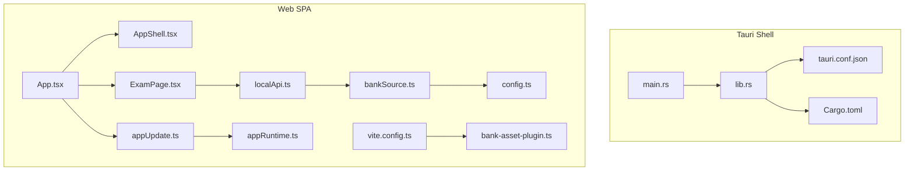
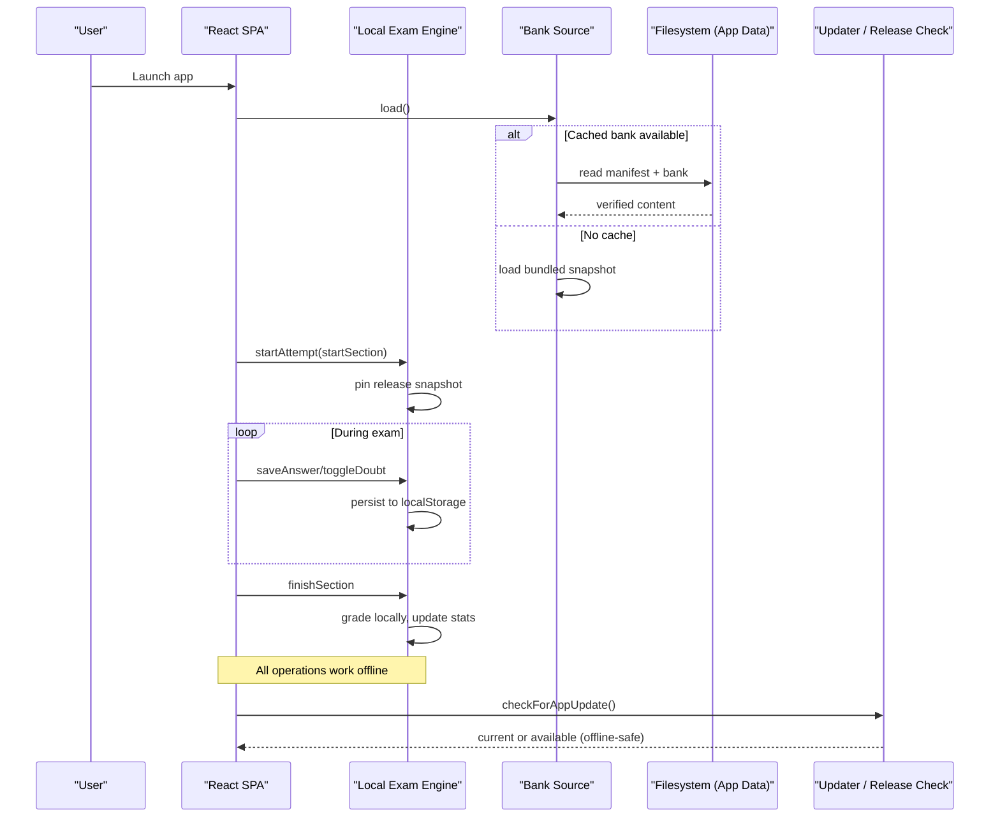
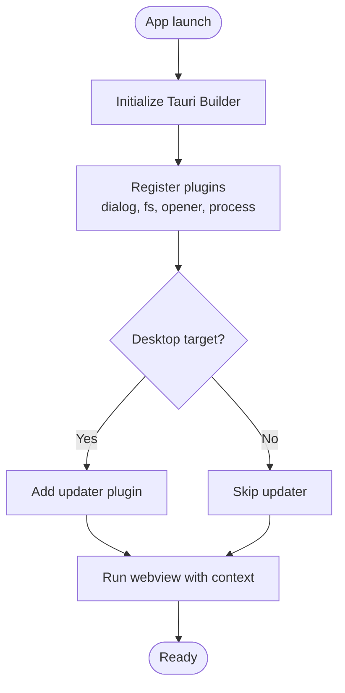
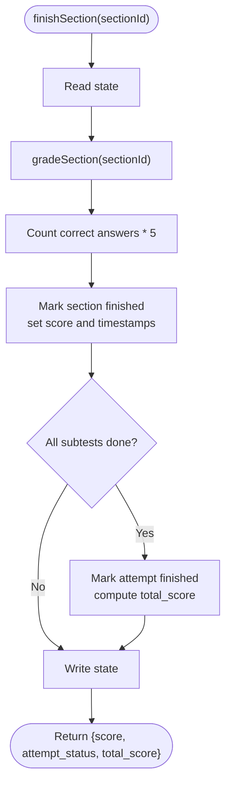
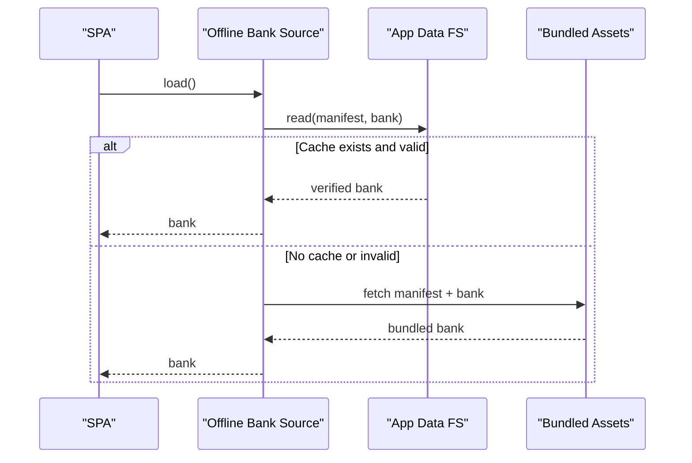
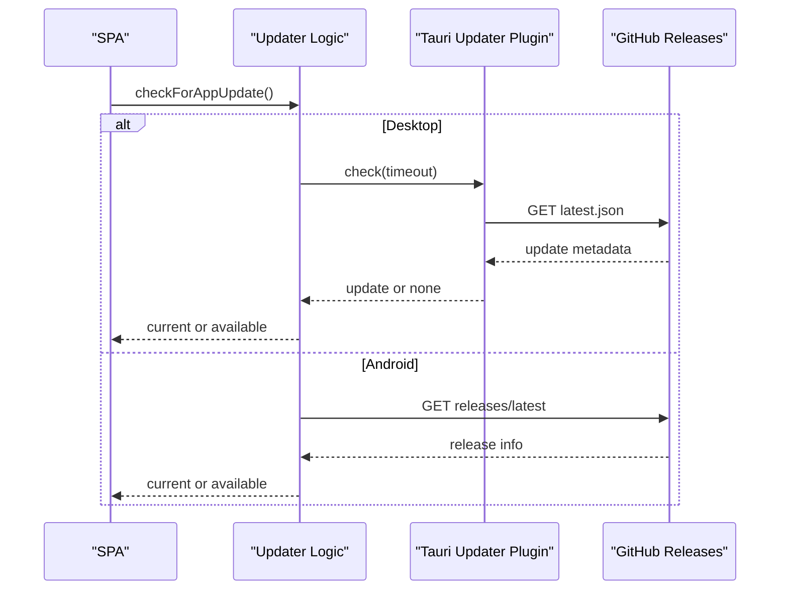
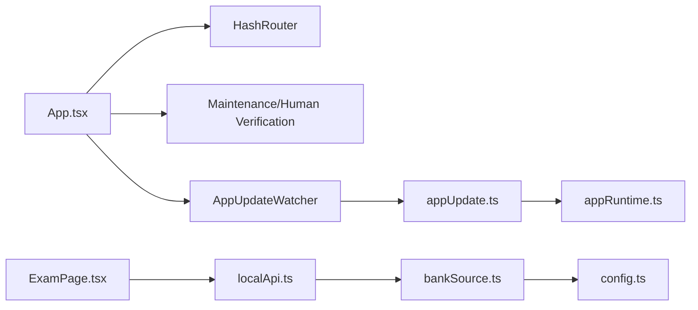

# Offline App Architecture

<cite>
**Referenced Files in This Document**
- [tauri.conf.json](file://web/src-tauri/tauri.conf.json)
- [Cargo.toml](file://web/src-tauri/Cargo.toml)
- [main.rs](file://web/src-tauri/src/main.rs)
- [lib.rs](file://web/src-tauri/src/lib.rs)
- [package.json](file://web/package.json)
- [vite.config.ts](file://web/vite.config.ts)
- [App.tsx](file://web/src/App.tsx)
- [bankSource.ts](file://web/src/lib/bankSource.ts)
- [appUpdate.ts](file://web/src/lib/appUpdate.ts)
- [localApi.ts](file://web/src/lib/localApi.ts)
- [config.ts](file://web/src/lib/config.ts)
- [appRuntime.ts](file://web/src/lib/appRuntime.ts)
- [bank-asset-plugin.ts](file://web/vite/bank-asset-plugin.ts)
- [ExamPage.tsx](file://web/src/pages/ExamPage.tsx)
- [AppShell.tsx](file://web/src/components/AppShell.tsx)
</cite>

## Table of Contents
1. [Introduction](#introduction)
2. [Project Structure](#project-structure)
3. [Core Components](#core-components)
4. [Architecture Overview](#architecture-overview)
5. [Detailed Component Analysis](#detailed-component-analysis)
6. [Dependency Analysis](#dependency-analysis)
7. [Performance Considerations](#performance-considerations)
8. [Troubleshooting Guide](#troubleshooting-guide)
9. [Conclusion](#conclusion)
10. [Appendices](#appendices)

## Introduction
This document explains the offline-first architecture of the TBS LPDP Try Out application built with a React single-page application (SPA) and a Rust-based Tauri 2 shell. The same SPA is bundled into native applications for Windows, macOS, Linux, and Android that run entirely without network connectivity during exams. All question materials are included in the installer, answers are graded locally, and updates are handled via GitHub Releases while preserving offline functionality.

## Project Structure
The project is organized into three main layers:
- Tauri shell (Rust): minimal native entry point, platform integrations, and optional updater plugin on desktop.
- Web SPA (React + Vite): exam UI, local engine, bank source abstraction, update checks, and runtime helpers.
- Question bank assets: compiled JSON artifacts emitted into the app bundle for offline use.

**Diagram sources**
- [main.rs:1-7](file://web/src-tauri/src/main.rs#L1-L7)
- [lib.rs:1-57](file://web/src-tauri/src/lib.rs#L1-L57)
- [tauri.conf.json:1-98](file://web/src-tauri/tauri.conf.json#L1-L98)
- [Cargo.toml:1-42](file://web/src-tauri/Cargo.toml#L1-L42)
- [App.tsx:1-63](file://web/src/App.tsx#L1-L63)
- [ExamPage.tsx:1-380](file://web/src/pages/ExamPage.tsx#L1-L380)
- [AppShell.tsx:1-56](file://web/src/components/AppShell.tsx#L1-L56)
- [bankSource.ts:1-323](file://web/src/lib/bankSource.ts#L1-L323)
- [localApi.ts:1-560](file://web/src/lib/localApi.ts#L1-L560)
- [appUpdate.ts:1-153](file://web/src/lib/appUpdate.ts#L1-L153)
- [appRuntime.ts:1-73](file://web/src/lib/appRuntime.ts#L1-L73)
- [config.ts:1-68](file://web/src/lib/config.ts#L1-L68)
- [vite.config.ts:1-54](file://web/vite.config.ts#L1-L54)
- [bank-asset-plugin.ts:1-58](file://web/vite/bank-asset-plugin.ts#L1-L58)

**Section sources**
- [tauri.conf.json:1-98](file://web/src-tauri/tauri.conf.json#L1-L98)
- [Cargo.toml:1-42](file://web/src-tauri/Cargo.toml#L1-L42)
- [main.rs:1-7](file://web/src-tauri/src/main.rs#L1-L7)
- [lib.rs:1-57](file://web/src-tauri/src/lib.rs#L1-L57)
- [package.json:1-46](file://web/package.json#L1-L46)
- [vite.config.ts:1-54](file://web/vite.config.ts#L1-L54)

## Core Components
- Tauri shell: A thin Rust layer that initializes plugins (dialog, filesystem, opener, process), registers a print command, and conditionally enables the updater plugin on desktop. It runs the webview with CSP and capabilities configured for offline operation.
- Local exam engine: A full client-side implementation of the exam API that persists attempts, sections, answers, statistics, and reports to localStorage. It pins each attempt to an immutable release snapshot from the question bank so hot-swapping the bank does not affect active attempts.
- Bundled question bank: A manifest plus content-addressed bank JSON emitted by a Vite plugin into the app bundle. At runtime, the offline bank source prefers a verified cached copy in the app data directory, then falls back to the bundled snapshot.
- Update mechanism: Desktop uses the Tauri updater plugin to install signed updates; Android compares versions against GitHub Releases and opens the APK download in the system browser. Both flows degrade gracefully when offline.

**Section sources**
- [lib.rs:1-57](file://web/src-tauri/src/lib.rs#L1-L57)
- [tauri.conf.json:26-96](file://web/src-tauri/tauri.conf.json#L26-L96)
- [localApi.ts:27-36](file://web/src/lib/localApi.ts#L27-L36)
- [bankSource.ts:6-18](file://web/src/lib/bankSource.ts#L6-L18)
- [bank-asset-plugin.ts:1-58](file://web/vite/bank-asset-plugin.ts#L1-L58)
- [appUpdate.ts:1-153](file://web/src/lib/appUpdate.ts#L1-L153)

## Architecture Overview
The offline app runs entirely within a Tauri webview. The SPA loads the bundled question bank, starts attempts pinned to immutable snapshots, saves answers locally, and grades sections offline. Updates check GitHub Releases but do not block offline usage.

**Diagram sources**
- [bankSource.ts:199-317](file://web/src/lib/bankSource.ts#L199-L317)
- [localApi.ts:405-496](file://web/src/lib/localApi.ts#L405-L496)
- [appUpdate.ts:102-110](file://web/src/lib/appUpdate.ts#L102-L110)

## Detailed Component Analysis

### Tauri Shell (Rust)
- Entry points: `main.rs` delegates to the library; `lib.rs` builds the Tauri app, registers plugins, exposes `print_page`, and enables the updater only on desktop targets.
- Security: CSP restricts origins; asset protocol disabled; capabilities scoped to default and desktop features.
- Platform behavior: Print dialog is delegated to the OS on desktop; Android returns false since WebView lacks a print path.

**Diagram sources**
- [lib.rs:29-55](file://web/src-tauri/src/lib.rs#L29-L55)
- [Cargo.toml:20-35](file://web/src-tauri/Cargo.toml#L20-L35)

**Section sources**
- [main.rs:1-7](file://web/src-tauri/src/main.rs#L1-L7)
- [lib.rs:1-57](file://web/src-tauri/src/lib.rs#L1-L57)
- [Cargo.toml:1-42](file://web/src-tauri/Cargo.toml#L1-L42)
- [tauri.conf.json:26-96](file://web/src-tauri/tauri.conf.json#L26-L96)

### Local Exam Engine
- Persistence: Attempts, sections, answers, reports, releases, and statistics are stored in localStorage under versioned keys.
- Immutability: Each attempt pins to a release snapshot created at start time; hot-swapping the bank does not alter ongoing attempts.
- Grading: Sections are graded locally when finished or when deadlines pass; scoring rules enforce minimum answered questions per subtest for statistics eligibility.
- Error handling: Deadline passed and already-finished states are enforced with specific error codes.

**Diagram sources**
- [localApi.ts:489-496](file://web/src/lib/localApi.ts#L489-L496)
- [localApi.ts:213-260](file://web/src/lib/localApi.ts#L213-L260)

**Section sources**
- [localApi.ts:27-36](file://web/src/lib/localApi.ts#L27-L36)
- [localApi.ts:183-207](file://web/src/lib/localApi.ts#L183-L207)
- [localApi.ts:213-260](file://web/src/lib/localApi.ts#L213-L260)
- [localApi.ts:405-496](file://web/src/lib/localApi.ts#L405-L496)

### Bundled Question Bank System
- Build-time artifact: A Vite plugin emits a manifest and a content-addressed bank JSON into the app bundle for offline use.
- Runtime resolution: The offline bank source first tries a verified cached copy in the app data directory; if missing or corrupted, it falls back to the bundled snapshot.
- Integrity: Cached bank files are validated using SHA-256 against the manifest before use.
- Hot-swap: When a newer bank is downloaded and verified, the app swaps it in and notifies listeners to refresh package listings.

**Diagram sources**
- [bank-asset-plugin.ts:13-55](file://web/vite/bank-asset-plugin.ts#L13-L55)
- [bankSource.ts:199-242](file://web/src/lib/bankSource.ts#L199-L242)
- [bankSource.ts:218-235](file://web/src/lib/bankSource.ts#L218-L235)

**Section sources**
- [bank-asset-plugin.ts:1-58](file://web/vite/bank-asset-plugin.ts#L1-L58)
- [bankSource.ts:6-18](file://web/src/lib/bankSource.ts#L6-L18)
- [bankSource.ts:133-197](file://web/src/lib/bankSource.ts#L133-L197)
- [bankSource.ts:199-317](file://web/src/lib/bankSource.ts#L199-L317)

### Update Mechanism
- Desktop: Uses the Tauri updater plugin to check for signed updates and install them in place; relaunches automatically after installation. Package managers like .deb/.rpm cannot self-update and fall back to opening the release page.
- Android: Compares the installed version with the latest GitHub Release tag; if newer, opens the APK download URL in the system browser for overlay installation.
- Offline safety: Network failures or timeouts return an “offline” status and never block normal app usage.

**Diagram sources**
- [appUpdate.ts:39-110](file://web/src/lib/appUpdate.ts#L39-L110)
- [lib.rs:37-40](file://web/src-tauri/src/lib.rs#L37-L40)
- [tauri.conf.json:87-96](file://web/src-tauri/tauri.conf.json#L87-L96)

**Section sources**
- [appUpdate.ts:1-153](file://web/src/lib/appUpdate.ts#L1-L153)
- [lib.rs:37-40](file://web/src-tauri/src/lib.rs#L37-L40)
- [tauri.conf.json:87-96](file://web/src-tauri/tauri.conf.json#L87-L96)

### Platform-Specific Considerations
- Windows: Console window suppressed in release; NSIS installer supports multiple languages and user-scoped installs.
- macOS: Minimum system version set; signing identity configured; print dialog driven natively due to WKWebView limitations.
- Linux: Debian packages declare required dependencies (GTK/WebKit).
- Android: Updater plugin is excluded; update flow opens APK downloads; print capability is hidden because WebView lacks a print path.

**Section sources**
- [tauri.conf.json:62-85](file://web/src-tauri/tauri.conf.json#L62-L85)
- [lib.rs:15-27](file://web/src-tauri/src/lib.rs#L15-L27)
- [appRuntime.ts:17-47](file://web/src/lib/appRuntime.ts#L17-L47)

### Security Implications of Local Exam Logic
- Answer grading occurs only in offline and dev-mock builds; production web bundles exclude the local engine and answer keys.
- CSP restricts external connections; asset protocol is disabled; capabilities limit IPC exposure.
- Question bank integrity is enforced via SHA-256 verification against the manifest before caching or use.
- Update verification relies on minisign signatures managed by the updater plugin on desktop.

**Section sources**
- [config.ts:11-43](file://web/src/lib/config.ts#L11-L43)
- [bankSource.ts:79-86](file://web/src/lib/bankSource.ts#L79-L86)
- [bankSource.ts:218-235](file://web/src/lib/bankSource.ts#L218-L235)
- [tauri.conf.json:26-35](file://web/src-tauri/tauri.conf.json#L26-L35)

### Distribution Strategy and Installation
- Desktop packaging targets include app archives, DMG, NSIS, AppImage, DEB, and RPM.
- Android builds produce debug suffixes for development; distribution uses signed APKs that can be installed over existing apps.
- The updater plugin is enabled only on non-mobile targets; Android uses a browser-based download-and-install flow.

**Section sources**
- [tauri.conf.json:37-85](file://web/src-tauri/tauri.conf.json#L37-L85)
- [Cargo.toml:31-35](file://web/src-tauri/Cargo.toml#L31-L35)

## Dependency Analysis
The SPA composes several modules with clear boundaries:
- `App.tsx` orchestrates routing and update watching based on build flags.
- `ExamPage.tsx` drives the exam UI and interacts with the local engine.
- `localApi.ts` implements the exam API and depends on `bankSource.ts` for question material.
- `bankSource.ts` abstracts where questions come from (dev mock vs offline bundled/cached).
- `appUpdate.ts` handles update checks and integrates with Tauri or GitHub Releases.
- `appRuntime.ts` provides environment detection and platform helpers.
- `config.ts` defines build-time flags and shared constants.

**Diagram sources**
- [App.tsx:1-63](file://web/src/App.tsx#L1-L63)
- [ExamPage.tsx:1-380](file://web/src/pages/ExamPage.tsx#L1-L380)
- [localApi.ts:1-560](file://web/src/lib/localApi.ts#L1-L560)
- [bankSource.ts:1-323](file://web/src/lib/bankSource.ts#L1-L323)
- [appUpdate.ts:1-153](file://web/src/lib/appUpdate.ts#L1-L153)
- [appRuntime.ts:1-73](file://web/src/lib/appRuntime.ts#L1-L73)
- [config.ts:1-68](file://web/src/lib/config.ts#L1-L68)

**Section sources**
- [App.tsx:1-63](file://web/src/App.tsx#L1-L63)
- [ExamPage.tsx:1-380](file://web/src/pages/ExamPage.tsx#L1-L380)
- [localApi.ts:1-560](file://web/src/lib/localApi.ts#L1-L560)
- [bankSource.ts:1-323](file://web/src/lib/bankSource.ts#L1-L323)
- [appUpdate.ts:1-153](file://web/src/lib/appUpdate.ts#L1-L153)
- [appRuntime.ts:1-73](file://web/src/lib/appRuntime.ts#L1-L73)
- [config.ts:1-68](file://web/src/lib/config.ts#L1-L68)

## Performance Considerations
- Dead code elimination: Build-time flags ensure offline and web builds exclude unrelated code paths (e.g., local engine in web production, updater in Android).
- Optimistic UI: Answers are saved with debounced writes to reduce I/O overhead during rapid interactions.
- Efficient bank loading: Cached banks are preferred and verified once; bundled fallback avoids network calls on first launch.
- Minimal native surface: The Rust shell stays thin, delegating most logic to the SPA to keep startup fast and bundle sizes small.

[No sources needed since this section provides general guidance]

## Troubleshooting Guide
- Section deadline passed: If a section times out, the engine auto-grades and rejects further writes; users should proceed to the next section or review.
- Already finished: Writes to completed sections are rejected; navigate to review or start a new attempt.
- Bank verification failure: If a downloaded bank fails SHA-256 checks, the app keeps the previous bank and logs an error; retry later or reinstall.
- Update unavailable offline: Update checks return “offline”; the app continues functioning normally until connectivity is restored.
- Print button not working on Android: The shell disables printing on Android due to WebView limitations; use device share or screenshot options instead.

**Section sources**
- [localApi.ts:262-275](file://web/src/lib/localApi.ts#L262-L275)
- [localApi.ts:489-496](file://web/src/lib/localApi.ts#L489-L496)
- [bankSource.ts:293-310](file://web/src/lib/bankSource.ts#L293-L310)
- [appUpdate.ts:72-110](file://web/src/lib/appUpdate.ts#L72-L110)
- [lib.rs:15-27](file://web/src-tauri/src/lib.rs#L15-L27)

## Conclusion
The TBS LPDP Try Out application delivers a fully offline experience by combining a lightweight Tauri shell with a robust React SPA. The local exam engine ensures secure, server-independent grading and persistence, while the bundled question bank guarantees availability without network access. Updates are handled safely across platforms, with graceful degradation when offline. This design balances security, performance, and usability across desktop and mobile environments.

[No sources needed since this section summarizes without analyzing specific files]

## Appendices

### Build-Time Flavors and Environment Flags
- Default web production: Supabase-backed API, base path for GitHub Pages.
- Dev mock: Local engine with mock bank middleware for development.
- Offline app: Local engine with bundled/cached bank, no backend dependencies.

**Section sources**
- [vite.config.ts:10-17](file://web/vite.config.ts#L10-L17)
- [vite.config.ts:18-52](file://web/vite.config.ts#L18-L52)

### Runtime Helpers and Capabilities
- Environment detection: Determines Tauri presence, Android target, and printable capabilities.
- External links: Opens URLs through the opener plugin when inside Tauri.
- Version retrieval: Reads installed app version for update comparisons.

**Section sources**
- [appRuntime.ts:1-73](file://web/src/lib/appRuntime.ts#L1-L73)