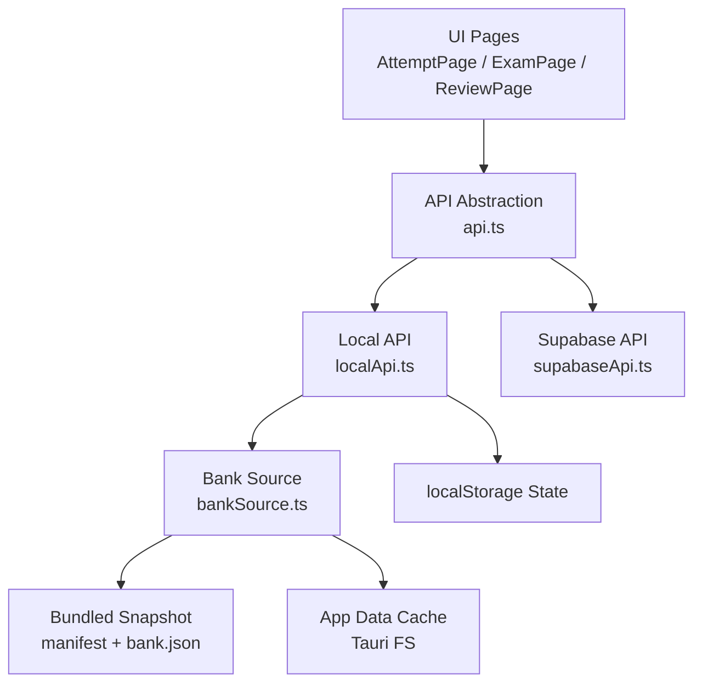
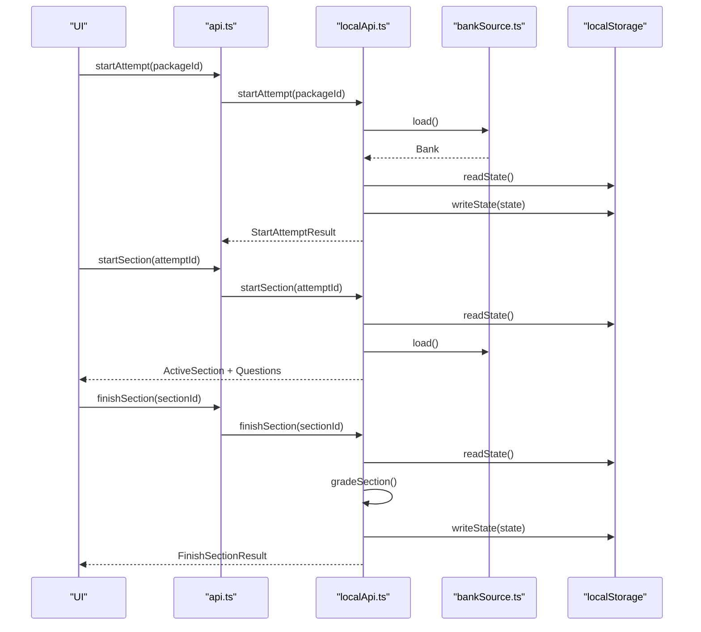
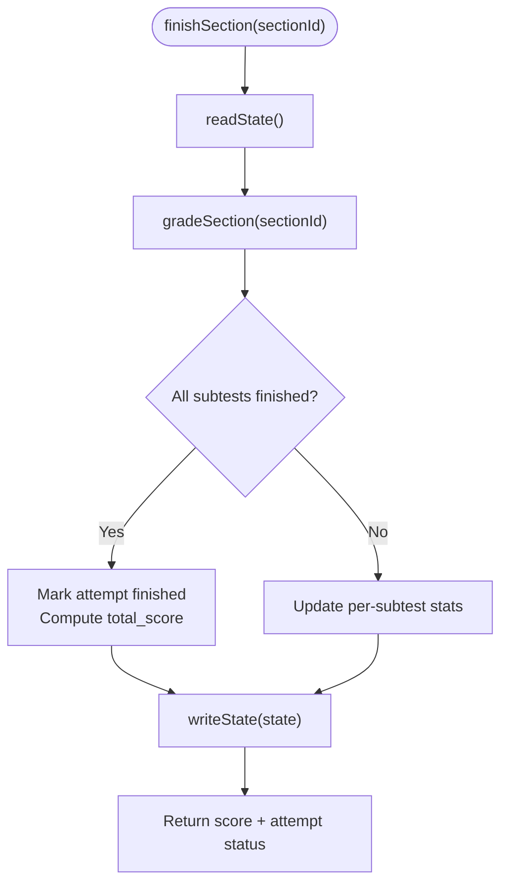
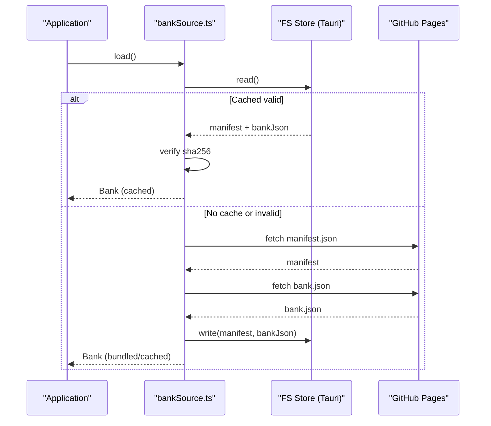
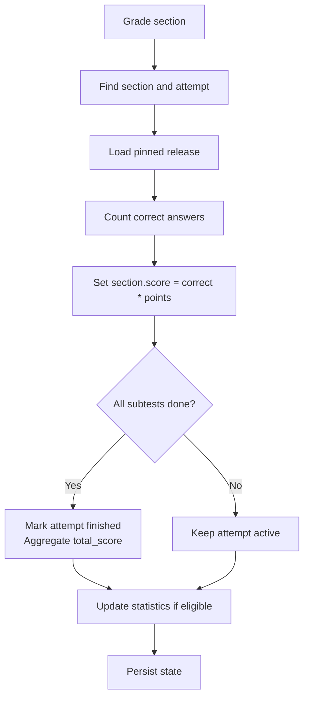
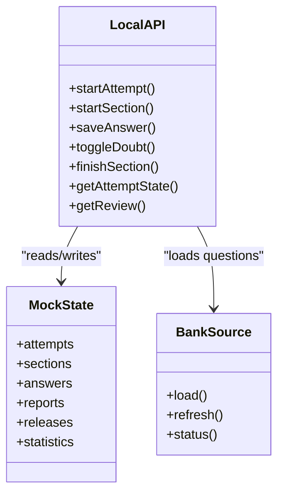
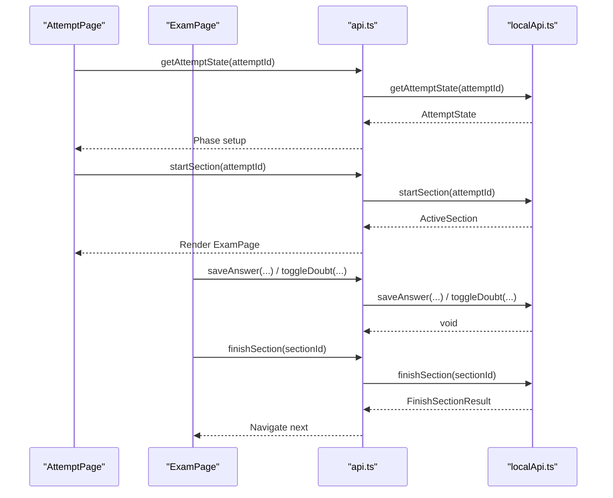
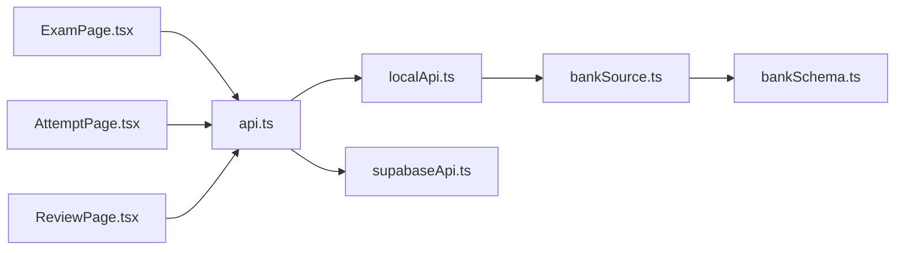

# Offline Exam Engine

<cite>
**Referenced Files in This Document**
- [localApi.ts](file://web/src/lib/localApi.ts)
- [bankSource.ts](file://web/src/lib/bankSource.ts)
- [api.ts](file://web/src/lib/api.ts)
- [types.ts](file://web/src/lib/types.ts)
- [config.ts](file://web/src/lib/config.ts)
- [ExamPage.tsx](file://web/src/pages/ExamPage.tsx)
- [AttemptPage.tsx](file://web/src/pages/AttemptPage.tsx)
- [ReviewPage.tsx](file://web/src/pages/ReviewPage.tsx)
- [bank-reader.ts](file://web/vite/bank-reader.ts)
- [mock-bank-plugin.ts](file://web/vite/mock-bank-plugin.ts)
- [bankSchema.ts](file://web/src/lib/bankSchema.ts)
</cite>

## Table of Contents
1. Introduction
2. Project Structure
3. Core Components
4. Architecture Overview
5. Detailed Component Analysis
6. Dependency Analysis
7. Performance Considerations
8. Troubleshooting Guide
9. Conclusion

## Introduction
This document explains the offline exam engine that runs entirely without network connectivity. It covers how the Local API layer performs all data operations using local storage, how the question bank is loaded from bundled JSON files, how answers are graded locally with the same algorithms as the server-side grading, and how state, progress, and results are persisted across sessions. It also documents error handling for corrupted data, storage limitations, recovery mechanisms, and performance considerations for large question sets and long exam sessions.

## Project Structure
The offline exam engine is implemented as a browser-based SPA with a clear separation between UI, API abstraction, and backend implementations:

- API selection and runtime flavor: The application chooses between a local (offline) implementation and a Supabase-backed implementation at build time. In offline mode, the bundle excludes any network client or answer keys used by the web production build.
- Question bank source: A pluggable source loads questions from either a dev mock endpoint or an offline cache/bundled snapshot. The offline path verifies integrity and persists updates to the app data directory when available.
- Local API: A full reimplementation of the server RPC contract that grades sections locally, pins attempts to immutable release snapshots, enforces deadlines, and persists state to localStorage.
- Pages: Attempt orchestration, exam session UI, and review/reporting flows.

**Diagram sources**
- [api.ts:38-68](file://web/src/lib/api.ts#L38-L68)
- [localApi.ts:27-36](file://web/src/lib/localApi.ts#L27-L36)
- [bankSource.ts:6-18](file://web/src/lib/bankSource.ts#L6-L18)

**Section sources**
- [api.ts:1-128](file://web/src/lib/api.ts#L1-L128)
- [bankSource.ts:1-323](file://web/src/lib/bankSource.ts#L1-L323)
- [localApi.ts:1-560](file://web/src/lib/localApi.ts#L1-L560)

## Core Components
- API abstraction: Selects the correct backend at runtime based on build flags. Provides retry helpers and consistent error messaging.
- Local API: Implements the complete ExamApi surface using localStorage for persistence and the injected bank source for questions. Handles attempt lifecycle, section deadlines, grading, statistics, and reporting.
- Bank source: Loads the question bank from a bundled snapshot or verified cached copy; supports refresh from a published manifest and content-addressed integrity checks.
- UI pages: Orchestrate the attempt flow, handle user interactions, manage timers, and persist answers with debounced writes.

Key responsibilities:
- Offline data operations via localStorage and local file storage (Tauri).
- Immutable release pinning per attempt to ensure reproducibility.
- Local grading identical to server logic.
- Robust error handling and recovery for corruption and capacity limits.

**Section sources**
- [api.ts:1-128](file://web/src/lib/api.ts#L1-L128)
- [localApi.ts:27-36](file://web/src/lib/localApi.ts#L27-L36)
- [bankSource.ts:6-18](file://web/src/lib/bankSource.ts#L6-L18)

## Architecture Overview
The offline engine replaces server calls with local logic while preserving the same interface and semantics:

- Build-time branching ensures only one backend is included per build flavor.
- The bank source resolves the active question set, preferring a verified cached version over the bundled snapshot.
- The local API persists attempts, sections, answers, reports, and statistics in localStorage.
- Grading occurs locally when finishing a section, computing scores and updating attempt totals and statistics.

**Diagram sources**
- [api.ts:38-68](file://web/src/lib/api.ts#L38-L68)
- [localApi.ts:405-496](file://web/src/lib/localApi.ts#L405-L496)
- [bankSource.ts:237-260](file://web/src/lib/bankSource.ts#L237-L260)

## Detailed Component Analysis

### Local API Layer (Offline Data Operations)
The Local API implements the entire ExamApi contract using localStorage for persistence and the injected bank source for questions. It mirrors server semantics including immutable release snapshots, deadline enforcement, idempotent finishes, and monotonic statistics.

Highlights:
- State model: Attempts, sections, answers, reports, releases, and statistics are stored in a single localStorage key and safely parsed with fallbacks.
- Release pinning: Each attempt pins to a release snapshot created at start time; subsequent bank swaps do not affect existing attempts.
- Grading: Section scoring uses the pinned release’s answer keys and computes total scores and eligibility for statistics.
- Deadlines: Active sections are auto-graded if their deadline has passed plus a grace period.
- Reports: Per-question reports are rate-limited and tied to the immutable release.

**Diagram sources**
- [localApi.ts:489-496](file://web/src/lib/localApi.ts#L489-L496)
- [localApi.ts:213-260](file://web/src/lib/localApi.ts#L213-L260)

Error handling:
- Corrupted or missing localStorage state falls back to an empty state structure.
- Missing or invalid package/subtest/release identifiers raise structured errors with codes.
- Deadline exceeded triggers auto-grade and returns a terminal error code.

Performance:
- Answers are saved per question with minimal reads/writes; state is serialized once per operation.
- Statistics computation is O(n) over sections and histograms but bounded by small constants per attempt.

**Section sources**
- [localApi.ts:95-115](file://web/src/lib/localApi.ts#L95-L115)
- [localApi.ts:183-207](file://web/src/lib/localApi.ts#L183-L207)
- [localApi.ts:213-275](file://web/src/lib/localApi.ts#L213-L275)
- [localApi.ts:405-496](file://web/src/lib/localApi.ts#L405-L496)

### Question Bank Loading Mechanism
The bank source abstracts where questions come from:

- Dev mode: Serves a compiled bank via a Vite middleware endpoint.
- Offline mode: Prefers a verified cached bank in the app data directory; otherwise loads the bundled snapshot shipped with the installer.

Integrity and updates:
- Manifest validation ensures schema compatibility and restricts filenames to prevent redirection attacks.
- Content verification uses SHA-256 hashing against the manifest before accepting a cached or downloaded bank.
- Updates are atomic: temporary files are renamed into place, and superseded revisions are cleaned up.

**Diagram sources**
- [bankSource.ts:206-242](file://web/src/lib/bankSource.ts#L206-L242)
- [bankSource.ts:267-311](file://web/src/lib/bankSource.ts#L267-L311)
- [bankSchema.ts:40-67](file://web/src/lib/bankSchema.ts#L40-L67)

Build-time compilation:
- The bank reader compiles the git-versioned question bank into a single artifact with packages and questions keyed by subtest. Images can be inlined as data URIs for the offline bundle or served via a dev middleware URL.

**Section sources**
- [bankSource.ts:138-197](file://web/src/lib/bankSource.ts#L138-L197)
- [bankSource.ts:206-242](file://web/src/lib/bankSource.ts#L206-L242)
- [bank-reader.ts:159-298](file://web/vite/bank-reader.ts#L159-L298)
- [mock-bank-plugin.ts:21-50](file://web/vite/mock-bank-plugin.ts#L21-L50)

### Answer Processing and Local Grading
Grading is performed locally in the Local API and mirrors server-side behavior:

- Correct answers are counted per section based on the pinned release’s answer keys.
- Section scores are computed as correct_count multiplied by a fixed point value.
- When all subtests are finished, the attempt is marked finished and total_score is aggregated.
- Eligibility rules for statistics are enforced (minimum answered counts per subtest), and histograms are updated accordingly.

**Diagram sources**
- [localApi.ts:213-260](file://web/src/lib/localApi.ts#L213-L260)

Complexity:
- Grading is linear in the number of questions in the section. For large sections, this remains efficient because it operates on in-memory arrays derived from the pinned release.

**Section sources**
- [localApi.ts:213-260](file://web/src/lib/localApi.ts#L213-L260)

### State Management, Progress Tracking, and Persistence
- Session state: Attempts, sections, answers, reports, releases, and statistics are persisted under a dedicated localStorage key. Reads wrap parsing in try/catch to tolerate corruption.
- Progress tracking: The UI tracks current index, answers, doubt flags, and remaining time. Debounced saves reduce write frequency during rapid interactions.
- Result persistence: Finished sections and attempts are persisted immediately; reviews reconstruct from persisted state and the pinned release.

**Diagram sources**
- [localApi.ts:68-84](file://web/src/lib/localApi.ts#L68-L84)
- [localApi.ts:95-115](file://web/src/lib/localApi.ts#L95-L115)
- [bankSource.ts:51-60](file://web/src/lib/bankSource.ts#L51-L60)

**Section sources**
- [localApi.ts:95-115](file://web/src/lib/localApi.ts#L95-L115)
- [ExamPage.tsx:100-144](file://web/src/pages/ExamPage.tsx#L100-L144)
- [AttemptPage.tsx:30-76](file://web/src/pages/AttemptPage.tsx#L30-L76)

### Error Handling and Recovery
- Corrupted localStorage: Parsing failures fall back to an empty state, preventing crashes and allowing continued use.
- Invalid or missing resources: Structured errors with codes are thrown for missing packages, subtests, or releases; callers handle these consistently.
- Capacity limits: Storage capacity reached prevents new attempts; retries are suppressed for terminal codes.
- Corruption in bank cache: Verified via SHA-256; corrupted caches are discarded and the app falls back to the bundled snapshot.
- Network timeouts: Manifest and bank downloads have explicit timeouts; offline conditions return benign statuses rather than failing the app.

Recovery mechanisms:
- Atomic updates to the bank cache ensure consistency even on crash.
- Graceful fallbacks preserve usability (e.g., maintenance status defaults, offline bank status).
- Retry helper avoids transient failures while respecting terminal error codes.

**Section sources**
- [localApi.ts:95-115](file://web/src/lib/localApi.ts#L95-L115)
- [localApi.ts:405-426](file://web/src/lib/localApi.ts#L405-L426)
- [bankSource.ts:218-242](file://web/src/lib/bankSource.ts#L218-L242)
- [bankSource.ts:267-311](file://web/src/lib/bankSource.ts#L267-L311)
- [api.ts:97-122](file://web/src/lib/api.ts#L97-L122)

### UI Integration and Flow Control
- AttemptPage orchestrates phases: loading, intro, exam, and review. It handles resuming active sections and navigating to review upon completion.
- ExamPage manages per-section interactions: selecting options, toggling doubt, saving answers with debounce, and finishing sections. It integrates with timers and displays warnings for failed writes.
- ReviewPage displays scores, per-section breakdowns, and allows reporting issues with questions.

**Diagram sources**
- [AttemptPage.tsx:30-93](file://web/src/pages/AttemptPage.tsx#L30-L93)
- [ExamPage.tsx:100-174](file://web/src/pages/ExamPage.tsx#L100-L174)
- [localApi.ts:428-496](file://web/src/lib/localApi.ts#L428-L496)

**Section sources**
- [AttemptPage.tsx:1-142](file://web/src/pages/AttemptPage.tsx#L1-L142)
- [ExamPage.tsx:1-380](file://web/src/pages/ExamPage.tsx#L1-L380)
- [ReviewPage.tsx:52-166](file://web/src/pages/ReviewPage.tsx#L52-L166)

## Dependency Analysis
- api.ts selects the implementation at build time and provides retry utilities.
- localApi.ts depends on bankSource.ts for questions and persists state to localStorage.
- bankSource.ts depends on bankSchema.ts for manifest validation and may use Tauri filesystem APIs in offline builds.
- UI pages depend on api.ts and types.ts for contracts and shapes.

**Diagram sources**
- [api.ts:38-68](file://web/src/lib/api.ts#L38-L68)
- [localApi.ts:1-36](file://web/src/lib/localApi.ts#L1-L36)
- [bankSource.ts:1-18](file://web/src/lib/bankSource.ts#L1-L18)
- [bankSchema.ts:1-18](file://web/src/lib/bankSchema.ts#L1-L18)

**Section sources**
- [api.ts:1-128](file://web/src/lib/api.ts#L1-L128)
- [localApi.ts:1-560](file://web/src/lib/localApi.ts#L1-L560)
- [bankSource.ts:1-323](file://web/src/lib/bankSource.ts#L1-L323)

## Performance Considerations
- Large question sets:
  - Grading is O(n) per section; memory usage scales with the size of the pinned release’s questions array.
  - Answers are stored per section in a map keyed by question_id; lookups are O(1).
  - Statistics histograms update incrementally; median calculation iterates sorted entries but remains bounded by the number of distinct scores.
- Extended sessions:
  - Debounced saves reduce localStorage writes during rapid answering.
  - Auto-grade on deadline prevents indefinite resource retention.
  - Bank refresh uses short timeouts for manifest checks to avoid blocking UI.
- Memory management:
  - Pinned releases isolate each attempt’s data; hot-swapping the bank does not require reloading active attempts.
  - Image handling in the bank reader can inline images for offline bundles; consider image sizes for very large banks.

[No sources needed since this section provides general guidance]

## Troubleshooting Guide
Common issues and resolutions:
- Corrupted localStorage state:
  - Symptom: Unexpected empty state or parse errors.
  - Resolution: The Local API falls back to an empty state automatically; users can continue taking tests. Clearing storage may be necessary if persistent corruption occurs.
- Storage capacity reached:
  - Symptom: New attempts are blocked with a terminal error code.
  - Resolution: Reduce stored attempts or clear old data; retries are intentionally disabled for this condition.
- Corrupted bank cache:
  - Symptom: Downloaded bank fails integrity check.
  - Resolution: The app discards the corrupted cache and falls back to the bundled snapshot; future refreshes will re-download and verify.
- Network timeouts during refresh:
  - Symptom: Refresh returns offline or unsupported status.
  - Resolution: The app continues operating with the current bank; retry later when connectivity is available.
- Deadline exceeded:
  - Symptom: Section auto-grades and becomes uneditable.
  - Resolution: Proceed to the next section or review; the result is final.

Operational tips:
- Use dev mock mode to validate flows without a backend.
- Monitor bank manifest versions to ensure compatibility.
- Keep image assets optimized to minimize bundle size.

**Section sources**
- [localApi.ts:95-115](file://web/src/lib/localApi.ts#L95-L115)
- [localApi.ts:405-426](file://web/src/lib/localApi.ts#L405-L426)
- [bankSource.ts:218-242](file://web/src/lib/bankSource.ts#L218-L242)
- [bankSource.ts:267-311](file://web/src/lib/bankSource.ts#L267-L311)
- [api.ts:97-122](file://web/src/lib/api.ts#L97-L122)

## Conclusion
The offline exam engine delivers a fully functional, network-independent testing experience by implementing the complete API surface locally, pinning attempts to immutable releases, and persisting all state in localStorage. The question bank is loaded from a verified cached or bundled snapshot, ensuring reliability and integrity. Grading, progress tracking, and result persistence mirror server-side behavior, enabling consistent outcomes across environments. Robust error handling and recovery mechanisms protect against corruption and capacity constraints, while performance optimizations support large question sets and extended sessions.