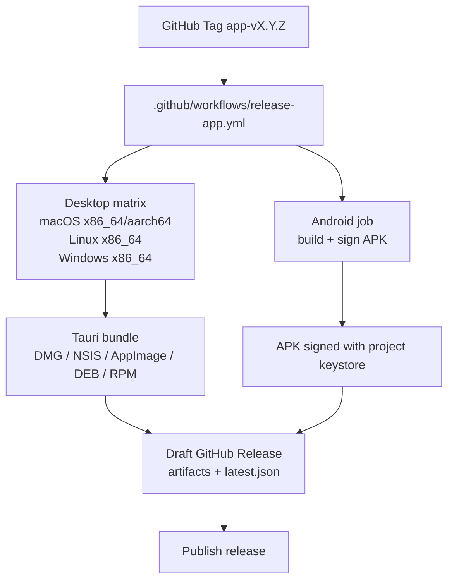
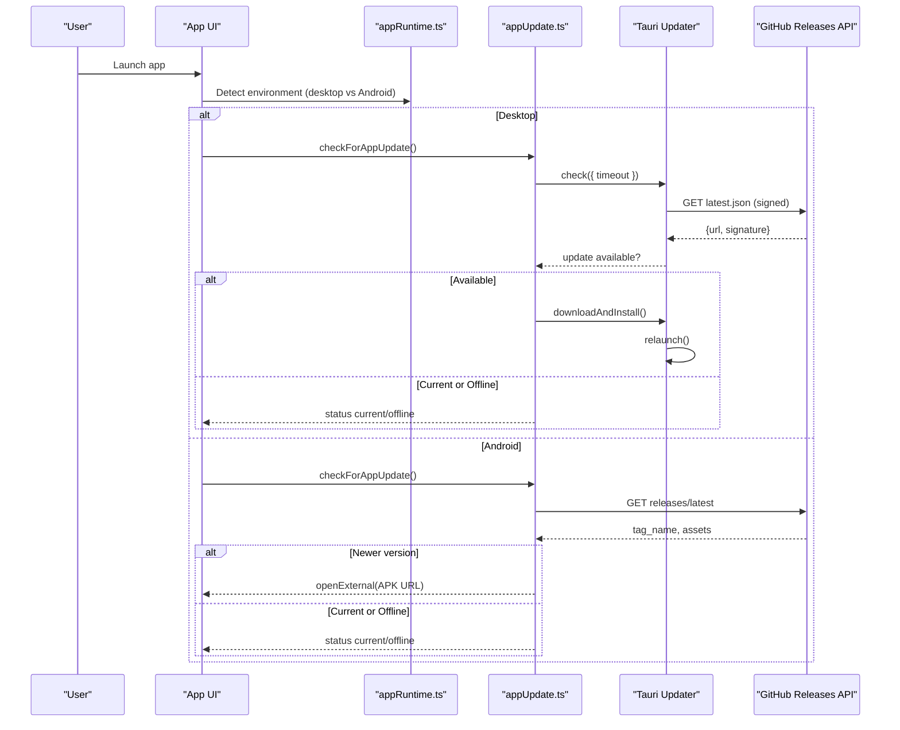
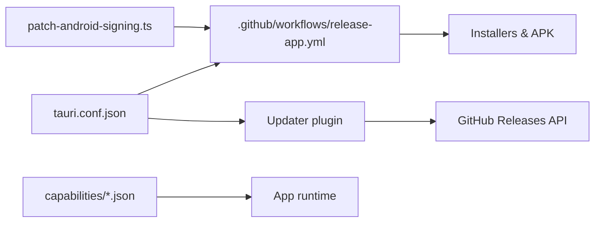

# Platform Distribution

<cite>
**Referenced Files in This Document**
- [tauri.conf.json](file://web/src-tauri/tauri.conf.json)
- [release-app.yml](file://.github/workflows/release-app.yml)
- [package.json](file://web/package.json)
- [Cargo.toml](file://web/src-tauri/Cargo.toml)
- [appUpdate.ts](file://web/src/lib/appUpdate.ts)
- [appRuntime.ts](file://web/src/lib/appRuntime.ts)
- [default.json](file://web/src-tauri/capabilities/default.json)
- [desktop.json](file://web/src-tauri/capabilities/desktop.json)
- [patch-android-signing.ts](file://web/scripts/patch-android-signing.ts)
</cite>

## Table of Contents
1. [Introduction](#introduction)
2. [Project Structure](#project-structure)
3. [Core Components](#core-components)
4. [Architecture Overview](#architecture-overview)
5. [Detailed Component Analysis](#detailed-component-analysis)
6. [Dependency Analysis](#dependency-analysis)
7. [Performance Considerations](#performance-considerations)
8. [Troubleshooting Guide](#troubleshooting-guide)
9. [Conclusion](#conclusion)

## Introduction
This document explains how the offline application is distributed across Windows, macOS, Linux, and Android using Tauri and GitHub Actions. It covers platform-specific packaging (NSIS for Windows, DMG for macOS, AppImage/DEB/RPM for Linux, APK for Android), signing and notarization requirements, automated build and release workflows, update mechanisms that check GitHub Releases while preserving offline functionality, and troubleshooting guidance for common issues.

## Project Structure
The distribution pipeline centers around a Tauri project under web/src-tauri with configuration for bundling targets, updater endpoints, and platform capabilities. The CI workflow triggers on version tags, builds installers for desktop platforms, signs and uploads an Android APK, and publishes a single GitHub Release containing all artifacts and updater metadata.

**Diagram sources**
- [release-app.yml:24-181](file://.github/workflows/release-app.yml#L24-L181)
- [release-app.yml:183-296](file://.github/workflows/release-app.yml#L183-L296)
- [release-app.yml:298-309](file://.github/workflows/release-app.yml#L298-L309)

**Section sources**
- [tauri.conf.json:37-85](file://web/src-tauri/tauri.conf.json#L37-L85)
- [release-app.yml:24-181](file://.github/workflows/release-app.yml#L24-L181)
- [release-app.yml:183-296](file://.github/workflows/release-app.yml#L183-L296)

## Core Components
- Tauri configuration defines product identity, window defaults, security policy, bundle targets, platform options, and updater settings.
- GitHub Actions workflow orchestrates builds, signing, artifact upload, and release publishing.
- Update logic differentiates between desktop (in-place updates via Tauri updater) and Android (browser-based APK download).
- Capabilities restrict permissions to only what is needed for offline operation and safe external links.

Key responsibilities:
- Packaging: NSIS (Windows), DMG (macOS), AppImage/DEB/RPM (Linux), APK (Android).
- Signing: minisign for updater payloads; Android keystore for APKs.
- Updates: GitHub Releases as source of truth; offline-first behavior when network unavailable.
- Security: least-privilege filesystem access and controlled URL opener.

**Section sources**
- [tauri.conf.json:1-98](file://web/src-tauri/tauri.conf.json#L1-L98)
- [release-app.yml:24-181](file://.github/workflows/release-app.yml#L24-L181)
- [release-app.yml:183-296](file://.github/workflows/release-app.yml#L183-L296)
- [appUpdate.ts:1-153](file://web/src/lib/appUpdate.ts#L1-L153)
- [default.json:1-44](file://web/src-tauri/capabilities/default.json#L1-L44)
- [desktop.json:1-9](file://web/src-tauri/capabilities/desktop.json#L1-L9)

## Architecture Overview
The distribution architecture integrates Tauri’s bundler with GitHub Actions to produce platform-native installers and an Android package. Desktop updates are handled by Tauri’s updater plugin against a signed manifest hosted on GitHub Releases. Android updates use a custom flow that checks the latest release and opens the APK download in the system browser.

**Diagram sources**
- [appUpdate.ts:39-109](file://web/src/lib/appUpdate.ts#L39-L109)
- [appRuntime.ts:12-38](file://web/src/lib/appRuntime.ts#L12-L38)
- [desktop.json:1-9](file://web/src-tauri/capabilities/desktop.json#L1-L9)

## Detailed Component Analysis

### Tauri Configuration and Bundling Targets
- Product identity and version are defined centrally and consumed by CI.
- Bundle targets include app, dmg, nsis, appimage, deb, rpm.
- Platform-specific options:
  - Windows: NSIS installer with multi-language support and per-user install mode.
  - macOS: minimum system version and signing identity placeholder for local development.
  - Linux: DEB dependencies declared for runtime libraries.
  - Android: debug suffix configured for dev builds.
- Updater plugin endpoint points to a JSON file served from GitHub Releases; public key is embedded for verification.

Operational notes:
- The updater is enabled for desktop platforms only; Android uses a custom flow.
- CSP allows IPC and limited external connections required for update checks and release page opening.

**Section sources**
- [tauri.conf.json:1-98](file://web/src-tauri/tauri.conf.json#L1-L98)

### GitHub Actions Release Workflow
The workflow enforces tag-to-version alignment, validates updater configuration, builds installers across platforms, signs the Android APK, and publishes a draft release before final publication.

Key steps:
- Guard job validates tag format and presence of updater public key and signing secrets.
- Desktop matrix builds for macOS (both architectures), Linux (x86_64), and Windows (x86_64).
- Android job initializes Gradle project, patches signing configuration, builds and verifies APK signature, and uploads it to the same release.
- Publish job converts the draft release to published once all jobs succeed.

Artifacts produced:
- Windows: NSIS setup installer.
- macOS: DMG bundles for Intel and Apple Silicon.
- Linux: AppImage, DEB, RPM packages.
- Android: Signed APK for arm64.
- Updater metadata: latest.json alongside installers.

Secrets required:
- TAURI_SIGNING_PRIVATE_KEY and password for updater payload signing.
- ANDROID_KEYSTORE_B64, ANDROID_KEYSTORE_PASSWORD, ANDROID_KEY_ALIAS, ANDROID_KEY_PASSWORD for APK signing.

**Section sources**
- [release-app.yml:24-181](file://.github/workflows/release-app.yml#L24-L181)
- [release-app.yml:183-296](file://.github/workflows/release-app.yml#L183-L296)
- [release-app.yml:298-309](file://.github/workflows/release-app.yml#L298-L309)

### Update Mechanism (Desktop and Android)
- Desktop: Uses Tauri’s updater plugin to fetch and verify signed latest.json from GitHub Releases, then downloads and installs the new version in place. If installation cannot self-update (e.g., system-managed packages), the user is guided to the release page.
- Android: Since there is no updater plugin implementation for Android, the app queries the GitHub Releases API, compares versions, and opens the APK download in the system browser. Users install over the existing app; data persists because the APK is signed with the same keystore.

Offline behavior:
- Network failures or timeouts result in “offline” status; the app continues functioning with its bundled question bank.
- No forced connectivity; update checks are best-effort.

**Section sources**
- [appUpdate.ts:1-153](file://web/src/lib/appUpdate.ts#L1-L153)
- [appRuntime.ts:12-38](file://web/src/lib/appRuntime.ts#L12-L38)
- [desktop.json:1-9](file://web/src-tauri/capabilities/desktop.json#L1-L9)

### Signing and Notarization
- Desktop updater payloads are signed using minisign; the public key is embedded in Tauri config for verification during updates.
- Android APKs are signed with a project keystore configured at build time via a patch script that injects signing configuration into the generated Gradle project.
- macOS and Windows code signing identities are referenced in Tauri config; notarization flows are not enforced here and can be added if desired.

Security considerations:
- Secrets are injected via CI environment variables and never committed.
- Android signing is validated at build time; unsigned or mismatched signatures fail early.

**Section sources**
- [tauri.conf.json:70-96](file://web/src-tauri/tauri.conf.json#L70-L96)
- [release-app.yml:118-181](file://.github/workflows/release-app.yml#L118-L181)
- [release-app.yml:250-296](file://.github/workflows/release-app.yml#L250-L296)
- [patch-android-signing.ts:1-100](file://web/scripts/patch-android-signing.ts#L1-L100)

### Permissions and Capabilities
- Filesystem access is scoped to a dedicated directory for the offline question bank, ensuring minimal exposure.
- Dialog permissions allow update prompts and informational messages.
- URL opener is restricted to GitHub and mailto schemes to prevent arbitrary navigation.

These constraints preserve offline functionality while enabling necessary interactions like update checks and release page access.

**Section sources**
- [default.json:1-44](file://web/src-tauri/capabilities/default.json#L1-L44)

### Build Scripts and Toolchain
- Node toolchain and npm cache are used to build the frontend and run Tauri CLI commands.
- Rust toolchain includes target triples for each platform; caching reduces build times.
- Android NDK and Java are provisioned for APK generation; Gradle project is initialized and patched before building.

**Section sources**
- [release-app.yml:91-117](file://.github/workflows/release-app.yml#L91-L117)
- [release-app.yml:198-223](file://.github/workflows/release-app.yml#L198-L223)
- [package.json:9-22](file://web/package.json#L9-L22)
- [Cargo.toml:1-42](file://web/src-tauri/Cargo.toml#L1-L42)

## Dependency Analysis
The distribution depends on coordinated configuration and scripts:
- Tauri config drives bundling targets and updater behavior.
- CI workflow consumes config values and secrets to produce artifacts.
- Update logic relies on GitHub Releases API and Tauri updater plugin.
- Android signing relies on a dynamic patch applied to generated Gradle files.

**Diagram sources**
- [tauri.conf.json:37-96](file://web/src-tauri/tauri.conf.json#L37-L96)
- [release-app.yml:24-181](file://.github/workflows/release-app.yml#L24-L181)
- [patch-android-signing.ts:1-100](file://web/scripts/patch-android-signing.ts#L1-L100)
- [default.json:1-44](file://web/src-tauri/capabilities/default.json#L1-L44)

**Section sources**
- [tauri.conf.json:37-96](file://web/src-tauri/tauri.conf.json#L37-L96)
- [release-app.yml:24-181](file://.github/workflows/release-app.yml#L24-L181)
- [patch-android-signing.ts:1-100](file://web/scripts/patch-android-signing.ts#L1-L100)
- [default.json:1-44](file://web/src-tauri/capabilities/default.json#L1-L44)

## Performance Considerations
- Use prebuilt binaries and caches (npm, Rust) to reduce CI duration.
- Build AppImage on an older Ubuntu runner to maximize compatibility across distributions.
- Enable LTO and strip symbols in release profile to reduce binary size.
- Keep update checks short-lived with timeouts to avoid blocking startup.

[No sources needed since this section provides general guidance]

## Troubleshooting Guide

Common issues and resolutions:

- Tag does not match version:
  - Symptom: CI guard fails indicating tag mismatch.
  - Resolution: Ensure the Git tag matches the version in Tauri config (e.g., app-v0.1.4).

- Missing updater public key:
  - Symptom: CI reports placeholder public key.
  - Resolution: Replace the placeholder with the project’s minisign public key in Tauri config.

- Missing signing secrets:
  - Symptom: CI errors about missing secrets.
  - Resolution: Add TAURI_SIGNING_PRIVATE_KEY and password to repository secrets; add Android keystore secrets for APK signing.

- Android signing failure:
  - Symptom: No signed release APK produced or signature verification fails.
  - Resolution: Ensure keystore properties and base64-encoded keystore are set; confirm patch script runs successfully and generates signing config.

- macOS quarantine message:
  - Symptom: App blocked on first launch due to unsigned certificate.
  - Resolution: Follow system instructions to open anyway; remove quarantine attributes if prompted.

- Linux dependency errors:
  - Symptom: AppImage or DEB fails to run due to missing libraries.
  - Resolution: Install declared dependencies (e.g., WebKitGTK, GTK3) on target systems.

- Update checks failing offline:
  - Symptom: Update check returns offline status.
  - Resolution: This is expected; app remains fully functional offline. Verify network connectivity if updates are required.

**Section sources**
- [release-app.yml:24-57](file://.github/workflows/release-app.yml#L24-L57)
- [release-app.yml:118-181](file://.github/workflows/release-app.yml#L118-L181)
- [release-app.yml:250-296](file://.github/workflows/release-app.yml#L250-L296)
- [tauri.conf.json:70-96](file://web/src-tauri/tauri.conf.json#L70-L96)
- [patch-android-signing.ts:1-100](file://web/scripts/patch-android-signing.ts#L1-L100)
- [appUpdate.ts:39-109](file://web/src/lib/appUpdate.ts#L39-L109)

## Conclusion
The project leverages Tauri and GitHub Actions to deliver a cross-platform offline application with robust distribution and update mechanisms. Desktop platforms receive native installers and in-place updates verified by minisign; Android receives a signed APK with a browser-based upgrade flow. The CI workflow automates validation, building, signing, and release publishing, while capabilities enforce least-privilege access. With careful attention to secrets, platform dependencies, and update endpoints, the distribution pipeline remains reliable and secure across environments.

[No sources needed since this section summarizes without analyzing specific files]