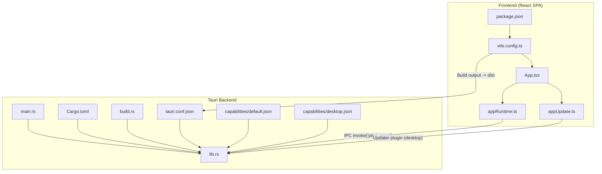
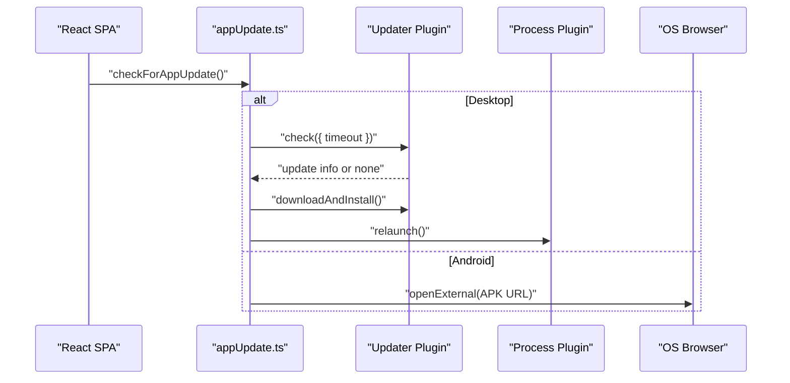
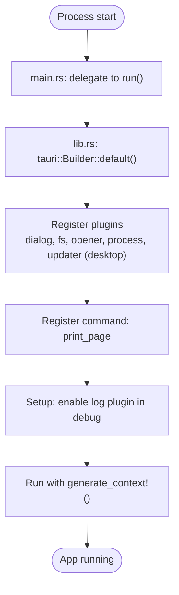
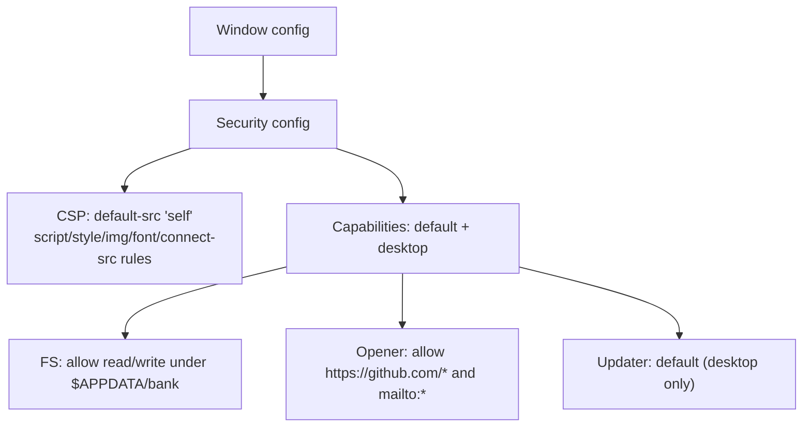
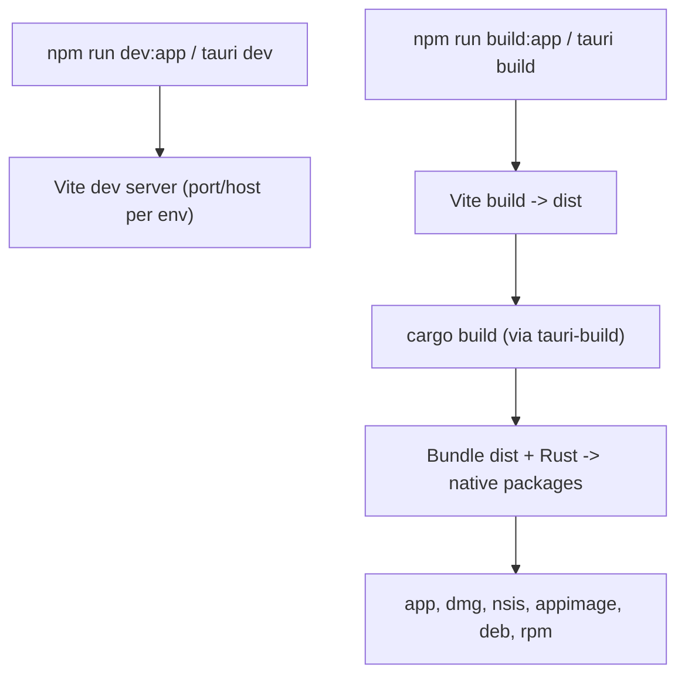
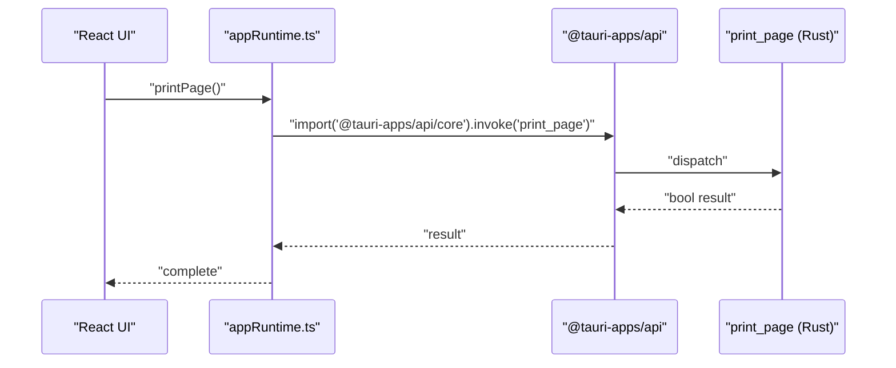
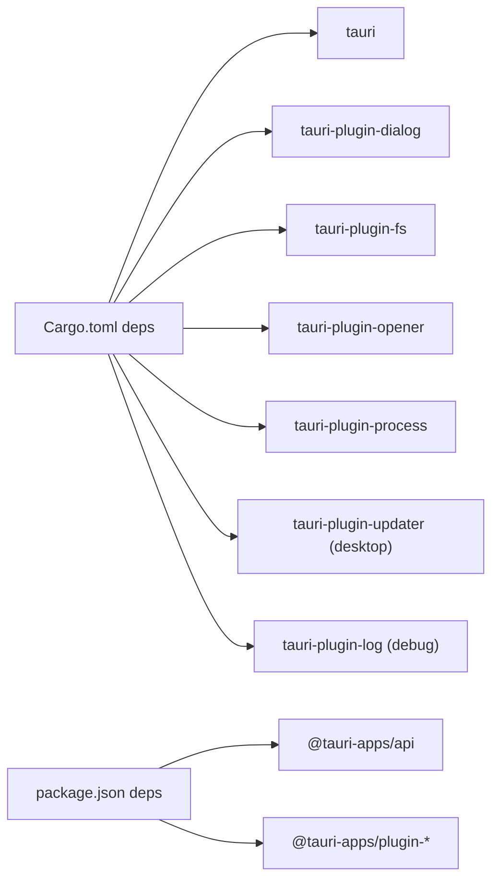

# Tauri Application Shell

<cite>
**Referenced Files in This Document**
- [main.rs](file://web/src-tauri/src/main.rs)
- [lib.rs](file://web/src-tauri/src/lib.rs)
- [Cargo.toml](file://web/src-tauri/Cargo.toml)
- [build.rs](file://web/src-tauri/build.rs)
- [tauri.conf.json](file://web/src-tauri/tauri.conf.json)
- [default.json](file://web/src-tauri/capabilities/default.json)
- [desktop.json](file://web/src-tauri/capabilities/desktop.json)
- [package.json](file://web/package.json)
- [vite.config.ts](file://web/vite.config.ts)
- [appRuntime.ts](file://web/src/lib/appRuntime.ts)
- [appUpdate.ts](file://web/src/lib/appUpdate.ts)
- [App.tsx](file://web/src/App.tsx)
</cite>

## Table of Contents
1. [Introduction](#introduction)
2. [Project Structure](#project-structure)
3. [Core Components](#core-components)
4. [Architecture Overview](#architecture-overview)
5. [Detailed Component Analysis](#detailed-component-analysis)
6. [Dependency Analysis](#dependency-analysis)
7. [Performance Considerations](#performance-considerations)
8. [Troubleshooting Guide](#troubleshooting-guide)
9. [Conclusion](#conclusion)

## Introduction
This document explains the Tauri application shell built with Rust for an offline-first exam application. It covers how the Rust entry point initializes the Tauri runtime, configures windows and security, integrates with a React single-page application (SPA), and how the build process compiles Rust code and bundles web assets into native installers. It also documents capability definitions, content security policy (CSP), platform-specific behaviors, debugging techniques, and performance optimizations.

## Project Structure
The project is organized into:
- A Tauri backend under web/src-tauri containing Rust source, Cargo configuration, Tauri configuration, capabilities, and a minimal build script.
- A React SPA under web that builds to dist and is served by Tauri during development or bundled at build time.
- Frontend integration utilities that detect the runtime environment and call Tauri plugins only when available.



**Diagram sources**
- [main.rs:1-7](file://web/src-tauri/src/main.rs#L1-L7)
- [lib.rs:1-57](file://web/src-tauri/src/lib.rs#L1-L57)
- [Cargo.toml:1-42](file://web/src-tauri/Cargo.toml#L1-L42)
- [build.rs:1-4](file://web/src-tauri/build.rs#L1-L4)
- [tauri.conf.json:1-98](file://web/src-tauri/tauri.conf.json#L1-L98)
- [default.json:1-44](file://web/src-tauri/capabilities/default.json#L1-L44)
- [desktop.json:1-9](file://web/src-tauri/capabilities/desktop.json#L1-L9)
- [package.json:1-46](file://web/package.json#L1-L46)
- [vite.config.ts:1-54](file://web/vite.config.ts#L1-L54)
- [App.tsx:1-63](file://web/src/App.tsx#L1-L63)
- [appRuntime.ts:1-73](file://web/src/lib/appRuntime.ts#L1-L73)
- [appUpdate.ts:1-153](file://web/src/lib/appUpdate.ts#L1-L153)

**Section sources**
- [main.rs:1-7](file://web/src-tauri/src/main.rs#L1-L7)
- [lib.rs:1-57](file://web/src-tauri/src/lib.rs#L1-L57)
- [Cargo.toml:1-42](file://web/src-tauri/Cargo.toml#L1-L42)
- [build.rs:1-4](file://web/src-tauri/build.rs#L1-L4)
- [tauri.conf.json:1-98](file://web/src-tauri/tauri.conf.json#L1-L98)
- [default.json:1-44](file://web/src-tauri/capabilities/default.json#L1-L44)
- [desktop.json:1-9](file://web/src-tauri/capabilities/desktop.json#L1-L9)
- [package.json:1-46](file://web/package.json#L1-L46)
- [vite.config.ts:1-54](file://web/vite.config.ts#L1-L54)
- [App.tsx:1-63](file://web/src/App.tsx#L1-L63)
- [appRuntime.ts:1-73](file://web/src/lib/appRuntime.ts#L1-L73)
- [appUpdate.ts:1-153](file://web/src/lib/appUpdate.ts#L1-L153)

## Core Components
- Tauri entry point: The Rust main function delegates to a library run function that sets up plugins, registers commands, and starts the Tauri app context.
- Library initialization: Registers dialog, filesystem, opener, process, and optional updater plugins; exposes a print command; enables logging in debug builds.
- Configuration: Defines window properties, CSP, capabilities, bundling targets, and update endpoints.
- Capabilities: Restrict filesystem access to a dedicated bank directory and allow opening URLs to specific domains. Desktop-only updater permissions are defined separately.
- Frontend integration: Detects runtime environment, dynamically imports Tauri APIs, and invokes commands like printing and updates.

**Section sources**
- [main.rs:1-7](file://web/src-tauri/src/main.rs#L1-L7)
- [lib.rs:1-57](file://web/src-tauri/src/lib.rs#L1-L57)
- [tauri.conf.json:1-98](file://web/src-tauri/tauri.conf.json#L1-L98)
- [default.json:1-44](file://web/src-tauri/capabilities/default.json#L1-L44)
- [desktop.json:1-9](file://web/src-tauri/capabilities/desktop.json#L1-L9)
- [appRuntime.ts:1-73](file://web/src/lib/appRuntime.ts#L1-L73)
- [appUpdate.ts:1-153](file://web/src/lib/appUpdate.ts#L1-L153)

## Architecture Overview
The Tauri shell runs a single main window that serves the React SPA. The frontend uses a thin runtime layer to call native features via Tauri’s IPC. Updates are handled differently on desktop (in-place via updater plugin) and Android (browser download).

```mermaid
sequenceDiagram
    participant FE as "React SPA"
    participant RT as "appRuntime.ts"
    participant TR as "Tauri Runtime"
    participant PL as "Plugins"
    participant OS as "OS"
    FE->>RT: "printPage()"
    RT->>TR: "invoke('print_page')"
    TR->>PL: "window.print() (desktop)"
    PL-->>TR: "success/failure"
    TR-->>RT: "boolean result"
    RT-->>FE: "complete"
    Note over FE,OS: "On Android, print is not supported; button is hidden."
```

**Diagram sources**
- [appRuntime.ts:54-61](file://web/src/lib/appRuntime.ts#L54-L61)
- [lib.rs:15-27](file://web/src-tauri/src/lib.rs#L15-L27)



**Diagram sources**
- [appUpdate.ts:72-100](file://web/src/lib/appUpdate.ts#L72-L100)
- [appUpdate.ts:39-70](file://web/src/lib/appUpdate.ts#L39-L70)
- [desktop.json:1-9](file://web/src-tauri/capabilities/desktop.json#L1-L9)

## Detailed Component Analysis

### Rust Entry Point and Runtime Initialization
- main.rs: Minimal entry that disables console window on Windows release builds and calls the library run function.
- lib.rs: Initializes Tauri builder, registers plugins (dialog, fs, opener, process, and updater on desktop), exposes print_page command, enables log plugin in debug builds, and runs the app with generated context.



**Diagram sources**
- [main.rs:1-7](file://web/src-tauri/src/main.rs#L1-L7)
- [lib.rs:30-55](file://web/src-tauri/src/lib.rs#L30-L55)

**Section sources**
- [main.rs:1-7](file://web/src-tauri/src/main.rs#L1-L7)
- [lib.rs:1-57](file://web/src-tauri/src/lib.rs#L1-L57)

### Window Properties and Security Configuration
- Window: Single “main” window with title, size, minimum size, resizable flag, centering, and fullscreen disabled.
- Security: Asset protocol disabled; CSP restricts scripts, styles, images, fonts, and network connections; only allowed origins include local IPC and specific remote endpoints.
- Capabilities: Default capability grants core functionality, limited filesystem access to $APPDATA/bank, and opener permission for GitHub and mailto links. Desktop capability adds updater and process restart permissions.



**Diagram sources**
- [tauri.conf.json:12-35](file://web/src-tauri/tauri.conf.json#L12-L35)
- [default.json:1-44](file://web/src-tauri/capabilities/default.json#L1-L44)
- [desktop.json:1-9](file://web/src-tauri/capabilities/desktop.json#L1-L9)

**Section sources**
- [tauri.conf.json:12-35](file://web/src-tauri/tauri.conf.json#L12-L35)
- [default.json:1-44](file://web/src-tauri/capabilities/default.json#L1-L44)
- [desktop.json:1-9](file://web/src-tauri/capabilities/desktop.json#L1-L9)

### Build Process and Web Asset Bundling
- Cargo configuration: Defines package metadata, crate types for staticlib/cdylib/rlib, dependencies including Tauri and plugins, conditional updater dependency for non-mobile targets, and release profile optimizations (LTO, strip, small size).
- Build script: Invokes tauri_build::build to wire Tauri context generation.
- Vite configuration: Produces dist output; selects base path for Tauri vs web; includes mock or bank asset plugins based on mode; sets target browsers for Tauri WebView; configures dev server behavior for Tauri dev.
- Package scripts: Provide commands to run Tauri dev/build, build the app bundle, and manage icons and versioning.



**Diagram sources**
- [Cargo.toml:1-42](file://web/src-tauri/Cargo.toml#L1-L42)
- [build.rs:1-4](file://web/src-tauri/build.rs#L1-L4)
- [vite.config.ts:18-52](file://web/vite.config.ts#L18-L52)
- [package.json:9-22](file://web/package.json#L9-L22)
- [tauri.conf.json:6-11](file://web/src-tauri/tauri.conf.json#L6-L11)

**Section sources**
- [Cargo.toml:1-42](file://web/src-tauri/Cargo.toml#L1-L42)
- [build.rs:1-4](file://web/src-tauri/build.rs#L1-L4)
- [vite.config.ts:18-52](file://web/vite.config.ts#L18-L52)
- [package.json:9-22](file://web/package.json#L9-L22)
- [tauri.conf.json:6-11](file://web/src-tauri/tauri.conf.json#L6-L11)

### Frontend Integration with Tauri
- Runtime detection: Checks for Tauri internals and Android user agent to adapt behavior.
- Dynamic imports: Tauri plugins are imported only when inside the app shell to keep web/dev builds free of native dependencies.
- Commands: Calls print_page via IPC; opens external URLs through the opener plugin scoped by capabilities.
- Update flow: Desktop uses updater plugin; Android checks GitHub releases and opens APK in browser.



**Diagram sources**
- [appRuntime.ts:12-15](file://web/src/lib/appRuntime.ts#L12-L15)
- [appRuntime.ts:31-38](file://web/src/lib/appRuntime.ts#L31-L38)
- [appRuntime.ts:54-61](file://web/src/lib/appRuntime.ts#L54-L61)
- [lib.rs:15-27](file://web/src-tauri/src/lib.rs#L15-L27)

**Section sources**
- [appRuntime.ts:12-15](file://web/src/lib/appRuntime.ts#L12-L15)
- [appRuntime.ts:31-38](file://web/src/lib/appRuntime.ts#L31-L38)
- [appRuntime.ts:54-61](file://web/src/lib/appRuntime.ts#L54-L61)
- [lib.rs:15-27](file://web/src-tauri/src/lib.rs#L15-L27)

### Platform-Specific Initialization and System Integration
- Windows: Console window suppressed in release builds; updater installed passively via configuration.
- macOS/Linux: Updater plugin enabled; print uses native dialogs; Linux packages declare required system libraries.
- Android: No updater plugin; update flow falls back to downloading APK via browser; print is unsupported and hidden in UI.

**Section sources**
- [main.rs:1-2](file://web/src-tauri/src/main.rs#L1-L2)
- [tauri.conf.json:70-85](file://web/src-tauri/tauri.conf.json#L70-L85)
- [tauri.conf.json:87-96](file://web/src-tauri/tauri.conf.json#L87-L96)
- [appUpdate.ts:39-70](file://web/src/lib/appUpdate.ts#L39-L70)
- [appRuntime.ts:45-47](file://web/src/lib/appRuntime.ts#L45-L47)

## Dependency Analysis
- Backend dependencies: Tauri core and plugins (dialog, fs, opener, process, updater on desktop); serde and serde_json for data handling; logging.
- Frontend dependencies: Tauri client APIs and plugins; React ecosystem; Supabase client for web mode.
- Conditional compilation: Updater plugin included only on non-mobile targets; log plugin enabled in debug builds.



**Diagram sources**
- [Cargo.toml:20-34](file://web/src-tauri/Cargo.toml#L20-L34)
- [package.json:24-34](file://web/package.json#L24-L34)

**Section sources**
- [Cargo.toml:20-34](file://web/src-tauri/Cargo.toml#L20-L34)
- [package.json:24-34](file://web/package.json#L24-L34)

## Performance Considerations
- Release profile: LTO enabled, single codegen unit, opt-level set to size, panic abort, and symbol stripping reduce binary size and improve startup.
- Frontend targeting: For Tauri builds, Vite targets modern WebView engines to avoid polyfills and reduce bundle size.
- Conditional code: Dead code elimination ensures web and app builds contain only necessary modules (e.g., no updater or bank engine in web builds).
- Logging: Log plugin enabled only in debug builds to avoid overhead in production.

[No sources needed since this section provides general guidance]

## Troubleshooting Guide
- Debugging Rust backend:
  - Enable logs in debug builds via the configured log plugin; inspect logs from the Tauri dev tools or platform-native consoles.
  - Use cargo build/run to compile and launch with Tauri CLI; errors during setup will be surfaced by the Tauri runner.
- Debugging frontend:
  - Use browser developer tools for web builds; in Tauri dev mode, use platform webview inspector if available.
  - Ensure Vite dev server port/host settings match Tauri dev expectations; strict port is enforced for Tauri.
- Common issues:
  - CSP blocking resources: Verify CSP allows required origins and inline styles where necessary; adjust tauri.conf.json security.csp if needed.
  - Capability denied: If filesystem or opener operations fail, confirm paths and URL patterns match capabilities/default.json allowances.
  - Update failures: On desktop, check network connectivity and updater endpoint; on Android, ensure APK download succeeds and can be installed.

**Section sources**
- [lib.rs:44-51](file://web/src-tauri/src/lib.rs#L44-L51)
- [tauri.conf.json:26-35](file://web/src-tauri/tauri.conf.json#L26-L35)
- [default.json:6-41](file://web/src-tauri/capabilities/default.json#L6-L41)
- [vite.config.ts:49-52](file://web/vite.config.ts#L49-L52)

## Conclusion
The Tauri shell provides a minimal, secure, and efficient foundation for the offline exam application. It initializes a focused set of plugins, enforces strict security policies, and integrates seamlessly with a React SPA. The build pipeline produces optimized native binaries across platforms while keeping the frontend modular and platform-aware. Updates are handled appropriately per platform, and debugging/logging are tailored for development without impacting production performance.