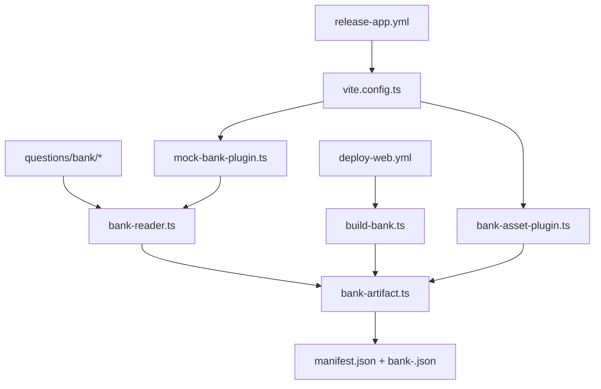
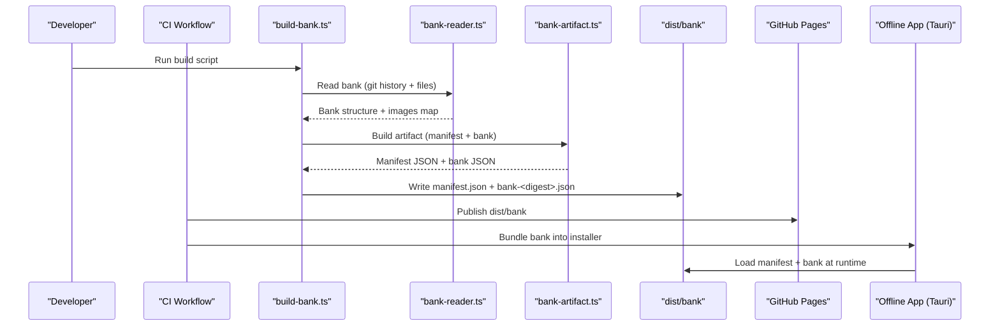
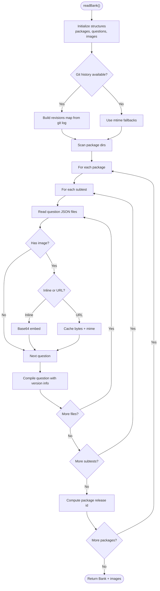
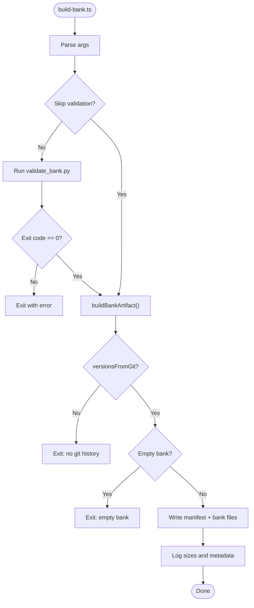
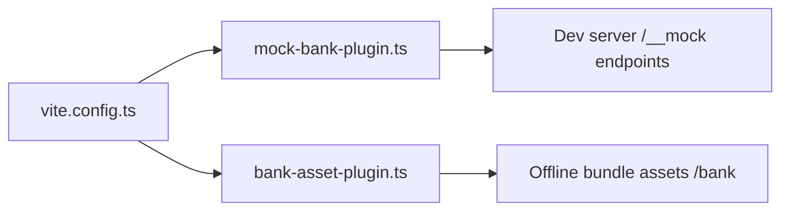
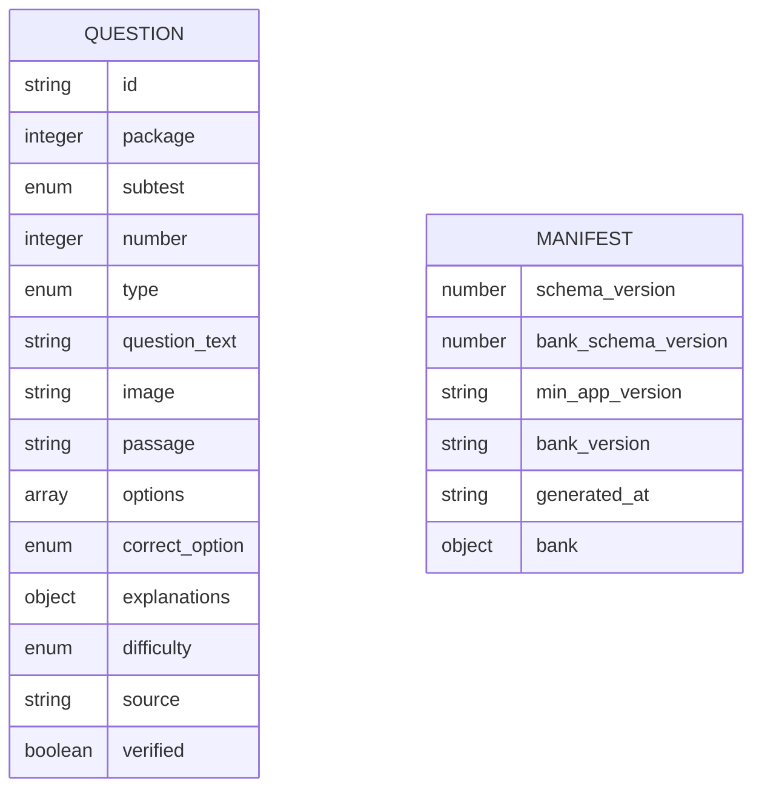
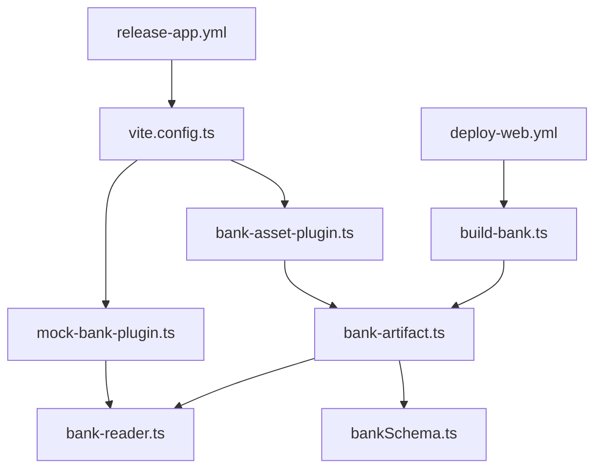

# Artifact Generation

<cite>
**Referenced Files in This Document**
- [bank-artifact.ts](file://web/vite/bank-artifact.ts)
- [build-bank.ts](file://web/scripts/build-bank.ts)
- [bank-reader.ts](file://web/vite/bank-reader.ts)
- [bank-asset-plugin.ts](file://web/vite/bank-asset-plugin.ts)
- [mock-bank-plugin.ts](file://web/vite/mock-bank-plugin.ts)
- [vite.config.ts](file://web/vite.config.ts)
- [bankSchema.ts](file://web/src/lib/bankSchema.ts)
- [schema.json](file://questions/schema.json)
- [package.json](file://web/package.json)
- [deploy-web.yml](file://.github/workflows/deploy-web.yml)
- [release-app.yml](file://.github/workflows/release-app.yml)
</cite>

## Table of Contents
1. [Introduction](#introduction)
2. [Project Structure](#project-structure)
3. [Core Components](#core-components)
4. [Architecture Overview](#architecture-overview)
5. [Detailed Component Analysis](#detailed-component-analysis)
6. [Dependency Analysis](#dependency-analysis)
7. [Performance Considerations](#performance-considerations)
8. [Troubleshooting Guide](#troubleshooting-guide)
9. [Conclusion](#conclusion)
10. [Appendices](#appendices)

## Introduction
This document explains the artifact generation system that compiles processed question data into optimized, deployment-ready bundles for web and offline applications. It covers how multiple question packages are consolidated into unified bundles, how versioning and metadata are managed, and how bundle size is optimized through image inlining and content addressing. It also documents the build script that orchestrates validation, dependency resolution, environment-specific configuration, and output formatting for different targets (web via GitHub Pages, desktop via Tauri installers, and mobile via Android APK). Finally, it provides performance guidance, debugging tools for artifact inspection, and troubleshooting steps for common issues.

## Project Structure
The artifact pipeline lives primarily under web/ with supporting source data under questions/. The key pieces are:
- Source question bank: questions/bank/<package>/<subtest>/<number>.json plus package manifests and images.
- Bank compilation and artifact creation: web/vite/bank-reader.ts, web/vite/bank-artifact.ts.
- Build orchestration: web/scripts/build-bank.ts.
- Vite integration for dev and offline builds: web/vite/mock-bank-plugin.ts, web/vite/bank-asset-plugin.ts, web/vite.config.ts.
- Schema and contracts: web/src/lib/bankSchema.ts, questions/schema.json.
- CI workflows: .github/workflows/deploy-web.yml, .github/workflows/release-app.yml.



**Diagram sources**
- [bank-reader.ts:159-297](file://web/vite/bank-reader.ts#L159-L297)
- [bank-artifact.ts:25-55](file://web/vite/bank-artifact.ts#L25-L55)
- [build-bank.ts:22-81](file://web/scripts/build-bank.ts#L22-L81)
- [mock-bank-plugin.ts:21-51](file://web/vite/mock-bank-plugin.ts#L21-L51)
- [bank-asset-plugin.ts:13-57](file://web/vite/bank-asset-plugin.ts#L13-L57)
- [vite.config.ts:18-52](file://web/vite.config.ts#L18-L52)
- [deploy-web.yml:97-100](file://.github/workflows/deploy-web.yml#L97-L100)
- [release-app.yml:115-181](file://.github/workflows/release-app.yml#L115-L181)

**Section sources**
- [bank-reader.ts:1-297](file://web/vite/bank-reader.ts#L1-L297)
- [bank-artifact.ts:1-56](file://web/vite/bank-artifact.ts#L1-L56)
- [build-bank.ts:1-81](file://web/scripts/build-bank.ts#L1-L81)
- [vite.config.ts:1-54](file://web/vite.config.ts#L1-L54)
- [deploy-web.yml:1-133](file://.github/workflows/deploy-web.yml#L1-L133)
- [release-app.yml:1-310](file://.github/workflows/release-app.yml#L1-L310)

## Core Components
- Bank reader: Scans the git-backed question bank, reads package manifests and subtest files, computes per-question and per-package versions from git history, and assembles a normalized Bank structure. Images can be served by URL in development or inlined as base64 data URIs for offline artifacts.
- Artifact builder: Computes a content-addressed bank file name from the SHA-256 of the compiled JSON, produces a small manifest pointing to the bank file with integrity and size metadata, and records schema versions and minimum app version.
- Build script: Validates the bank using an external Python validator, ensures git history availability for reproducible versions, writes the manifest and bank files to the configured output directory, and warns on oversized outputs.
- Vite plugins:
  - Mock bank plugin: Serves the compiled bank and images during development without bundling answer keys into production assets.
  - Asset plugin: Emits the same manifest/bank pair into the offline app bundle so fresh installs work without connectivity.
- Configuration: Environment-driven flavors (web, dev mock, offline app) control which backend and bank handling are included, ensuring no local engine or answer keys leak into public web builds.

**Section sources**
- [bank-reader.ts:159-297](file://web/vite/bank-reader.ts#L159-L297)
- [bank-artifact.ts:25-55](file://web/vite/bank-artifact.ts#L25-L55)
- [build-bank.ts:22-81](file://web/scripts/build-bank.ts#L22-L81)
- [mock-bank-plugin.ts:21-51](file://web/vite/mock-bank-plugin.ts#L21-L51)
- [bank-asset-plugin.ts:13-57](file://web/vite/bank-asset-plugin.ts#L13-L57)
- [vite.config.ts:18-52](file://web/vite.config.ts#L18-L52)

## Architecture Overview
The system follows a clear separation between source data, compilation, packaging, and distribution:



**Diagram sources**
- [build-bank.ts:42-81](file://web/scripts/build-bank.ts#L42-L81)
- [bank-reader.ts:159-297](file://web/vite/bank-reader.ts#L159-L297)
- [bank-artifact.ts:25-55](file://web/vite/bank-artifact.ts#L25-L55)
- [deploy-web.yml:97-100](file://.github/workflows/deploy-web.yml#L97-L100)
- [release-app.yml:115-181](file://.github/workflows/release-app.yml#L115-L181)

## Detailed Component Analysis

### Bank Reader
Responsibilities:
- Traverse package directories and subtests, parse JSON question files, and assemble a normalized Bank object.
- Compute per-question and per-package versions from git log; fall back to file mtimes when git history is unavailable.
- Handle images in two modes:
  - URL mode: Serve images via a dev middleware path keyed by package and image hash.
  - Inline mode: Embed images as base64 data URIs for offline artifacts.
- Maintain deterministic output by sorting and fixing field order where necessary.

Key behaviors:
- Git-based revision tracking ensures stable, reproducible versions across runs over the same tree.
- Package release IDs are content-addressed based on the package manifest and its questions, enabling immutable pinning.



**Diagram sources**
- [bank-reader.ts:159-297](file://web/vite/bank-reader.ts#L159-L297)

**Section sources**
- [bank-reader.ts:159-297](file://web/vite/bank-reader.ts#L159-L297)

### Artifact Builder
Responsibilities:
- Convert the compiled Bank into two published files:
  - A content-addressed bank file named bank-<first-12-hex-of-sha256>.json.
  - A small manifest.json referencing the bank file, including sha256, byte size, schema versions, minimum app version, and generated timestamp derived from the latest commit time.
- Ensure immutability: any change to the bank content changes the digest and filename.

Outputs:
- manifest.json: Contains schema_version, bank_schema_version, min_app_version, bank_version, generated_at, and bank.url/sha256/bytes.
- bank-<digest>.json: The full compiled bank payload.

```mermaid
classDiagram
class BankArtifact {
+manifest : BankManifest
+manifestJson : string
+bankFileName : string
+bankJson : string
+versionsFromGit : boolean
}
class BankManifest {
+schema_version : number
+bank_schema_version : number
+min_app_version : string
+bank_version : string
+generated_at : string
+bank : { url, sha256, bytes }
}
BankArtifact --> BankManifest : "produces"
```

**Diagram sources**
- [bank-artifact.ts:15-55](file://web/vite/bank-artifact.ts#L15-L55)
- [bankSchema.ts:20-33](file://web/src/lib/bankSchema.ts#L20-L33)

**Section sources**
- [bank-artifact.ts:25-55](file://web/vite/bank-artifact.ts#L25-L55)
- [bankSchema.ts:20-33](file://web/src/lib/bankSchema.ts#L20-L33)

### Build Script
Responsibilities:
- Parse CLI arguments for output directory, bank directory, validation toggle, and help.
- Validate the bank using an external Python validator before proceeding.
- Require git history for reproducible versions; fail if not available.
- Ensure the compiled bank is non-empty.
- Write manifest.json and bank-<digest>.json to the output directory.
- Log sizes and warnings (e.g., bank exceeds threshold).

Environment and dependencies:
- Requires Node.js with native TypeScript support.
- Uses Python validator from questions/generator/validate_bank.py.



**Diagram sources**
- [build-bank.ts:22-81](file://web/scripts/build-bank.ts#L22-L81)

**Section sources**
- [build-bank.ts:22-81](file://web/scripts/build-bank.ts#L22-L81)

### Vite Plugins and Configuration
- Mock bank plugin:
  - Only active in development (serve mode).
  - Serves /__mock/bank.json with the compiled bank and images via /__mock/image/<package>/<sha256>/<file>.
  - Keeps images cached in memory to preserve older figures for pinned attempts.
- Asset plugin:
  - Active only for offline flavor (VITE_OFFLINE=true).
  - Emits manifest.json and bank-<digest>.json into the app’s assets for zero-connectivity operation.
  - Provides dev server middleware to serve these assets under /bank with appropriate cache headers.
- Configuration:
  - Flavor selection via environment variables: VITE_USE_MOCK and VITE_OFFLINE.
  - Base path differs for Tauri vs web to ensure correct asset resolution.
  - Ensures dead code elimination prevents local engine or answer keys from leaking into public web builds.



**Diagram sources**
- [vite.config.ts:18-52](file://web/vite.config.ts#L18-L52)
- [mock-bank-plugin.ts:21-51](file://web/vite/mock-bank-plugin.ts#L21-L51)
- [bank-asset-plugin.ts:13-57](file://web/vite/bank-asset-plugin.ts#L13-L57)

**Section sources**
- [mock-bank-plugin.ts:21-51](file://web/vite/mock-bank-plugin.ts#L21-L51)
- [bank-asset-plugin.ts:13-57](file://web/vite/bank-asset-plugin.ts#L13-L57)
- [vite.config.ts:18-52](file://web/vite.config.ts#L18-L52)

### Schema and Contracts
- Question schema: Defines required fields, types, and constraints for question JSON files, including options, explanations, difficulty, and image paths.
- Bank manifest schema: Defines the contract for manifest.json consumed by the offline app, including schema versions, minimum app version, and bank integrity metadata.
- Version comparison utility: Compares dotted numeric versions ignoring suffixes.



**Diagram sources**
- [schema.json:1-98](file://questions/schema.json#L1-L98)
- [bankSchema.ts:20-33](file://web/src/lib/bankSchema.ts#L20-L33)

**Section sources**
- [schema.json:1-98](file://questions/schema.json#L1-L98)
- [bankSchema.ts:20-33](file://web/src/lib/bankSchema.ts#L20-L33)

## Dependency Analysis
The artifact pipeline has clear boundaries and minimal coupling:
- build-bank.ts depends on bank-artifact.ts and invokes the Python validator.
- bank-artifact.ts depends on bank-reader.ts and bankSchema.ts constants.
- bank-reader.ts depends on filesystem and git commands; it does not depend on network services.
- Vite plugins depend on bank-reader.ts and bank-artifact.ts but are isolated to dev/offline contexts.
- CI workflows coordinate environment setup, validation, and publishing without altering core logic.



**Diagram sources**
- [build-bank.ts:22-81](file://web/scripts/build-bank.ts#L22-L81)
- [bank-artifact.ts:25-55](file://web/vite/bank-artifact.ts#L25-L55)
- [bank-reader.ts:159-297](file://web/vite/bank-reader.ts#L159-L297)
- [bankSchema.ts:20-33](file://web/src/lib/bankSchema.ts#L20-L33)
- [mock-bank-plugin.ts:21-51](file://web/vite/mock-bank-plugin.ts#L21-L51)
- [bank-asset-plugin.ts:13-57](file://web/vite/bank-asset-plugin.ts#L13-L57)
- [vite.config.ts:18-52](file://web/vite.config.ts#L18-L52)
- [deploy-web.yml:97-100](file://.github/workflows/deploy-web.yml#L97-L100)
- [release-app.yml:115-181](file://.github/workflows/release-app.yml#L115-L181)

**Section sources**
- [build-bank.ts:22-81](file://web/scripts/build-bank.ts#L22-L81)
- [bank-artifact.ts:25-55](file://web/vite/bank-artifact.ts#L25-L55)
- [bank-reader.ts:159-297](file://web/vite/bank-reader.ts#L159-L297)
- [vite.config.ts:18-52](file://web/vite.config.ts#L18-L52)
- [deploy-web.yml:97-100](file://.github/workflows/deploy-web.yml#L97-L100)
- [release-app.yml:115-181](file://.github/workflows/release-app.yml#L115-L181)

## Performance Considerations
- Content addressing: Using SHA-256 for bank filenames ensures caches remain valid and enables efficient updates when content changes.
- Image inlining: In offline builds, images are embedded as base64 data URIs to avoid additional network requests, improving offline startup performance.
- Deterministic output: Sorting and fixed field ordering guarantee byte-identical outputs across runs over the same tree, reducing diff noise and aiding caching.
- Size monitoring: The build script logs bank size and warns when exceeding thresholds, prompting review of image strategies.
- Dead code elimination: Environment flags ensure only necessary code paths are included in each flavor, preventing unnecessary bloat in public web builds.

[No sources needed since this section provides general guidance]

## Troubleshooting Guide
Common issues and resolutions:
- No git history:
  - Symptom: Build fails due to missing git history; versions fall back to mtimes and are not reproducible.
  - Resolution: Ensure checkout includes full history (fetch-depth: 0) in CI and local builds.
- Validation failure:
  - Symptom: Python validator exits non-zero; build aborts.
  - Resolution: Fix question JSON schema violations or inconsistencies flagged by validate_bank.py.
- Empty bank:
  - Symptom: Compiled bank is empty; build aborts.
  - Resolution: Verify package directories and subtest folders contain valid JSON files.
- Oversized bank:
  - Symptom: Warning about bank exceeding size threshold.
  - Resolution: Review image usage; consider optimizing or restructuring images for better compression or alternative delivery strategies.
- Offline asset mismatch:
  - Symptom: Offline app cannot load bank or manifest.
  - Resolution: Ensure VITE_OFFLINE flavor is used and bank asset plugin emits files under /bank; verify base path configuration for Tauri vs web.

**Section sources**
- [build-bank.ts:59-81](file://web/scripts/build-bank.ts#L59-L81)
- [bank-reader.ts:165-187](file://web/vite/bank-reader.ts#L165-L187)
- [bank-asset-plugin.ts:23-57](file://web/vite/bank-asset-plugin.ts#L23-L57)

## Conclusion
The artifact generation system provides a robust, reproducible pipeline for compiling question data into optimized bundles suitable for web and offline deployments. Through git-based versioning, content addressing, and environment-aware bundling, it ensures correctness, security, and performance. The modular design separates concerns across reading, building, and serving, while CI workflows enforce quality gates and publish artifacts consistently across platforms.

[No sources needed since this section summarizes without analyzing specific files]

## Appendices

### Artifact Structure and Deployment Targets
- Web (GitHub Pages):
  - Outputs: manifest.json and bank-<digest>.json published under /tbs-lpdp/bank/.
  - Behavior: Publicly accessible; no local engine or answer keys in the web bundle.
- Desktop (Tauri):
  - Outputs: Installers built with the bank bundled into assets for offline use.
  - Behavior: Fresh installs operate without connectivity; updates check for new bank versions when online.
- Mobile (Android):
  - Outputs: Signed APK bundled with the bank assets.
  - Behavior: Same offline-first behavior; upgrades preserve user state.

**Section sources**
- [deploy-web.yml:97-100](file://.github/workflows/deploy-web.yml#L97-L100)
- [release-app.yml:115-181](file://.github/workflows/release-app.yml#L115-L181)
- [bank-asset-plugin.ts:23-57](file://web/vite/bank-asset-plugin.ts#L23-L57)

### Build Commands and Scripts
- Local bank build: npm run build:bank [--out <dir>] [--bank-dir <dir>] [--skip-validate]
- Web build: npm run build
- Offline app build: npm run build:app
- Tauri development and packaging: npm run app:dev, npm run app:build

**Section sources**
- [package.json:9-23](file://web/package.json#L9-L23)