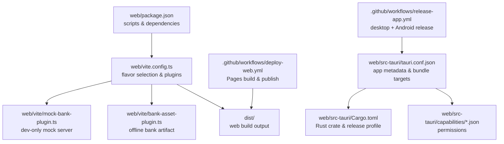
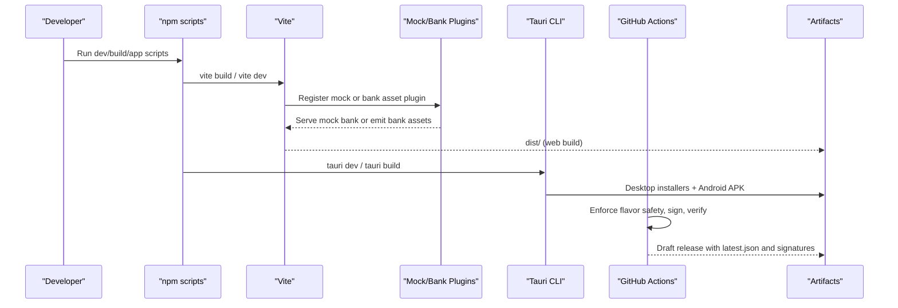
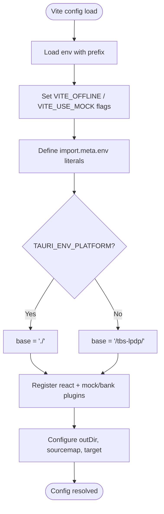
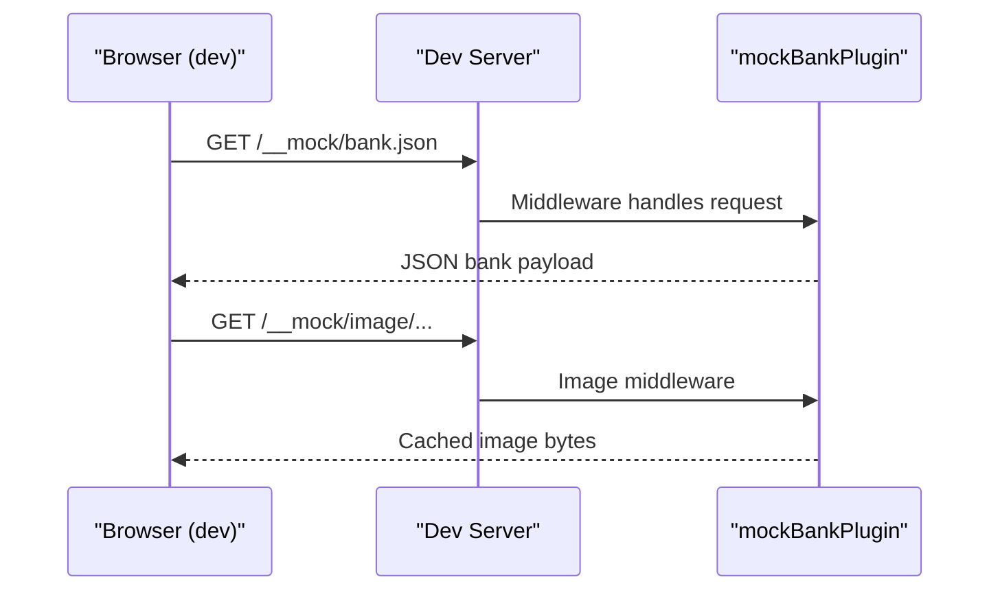
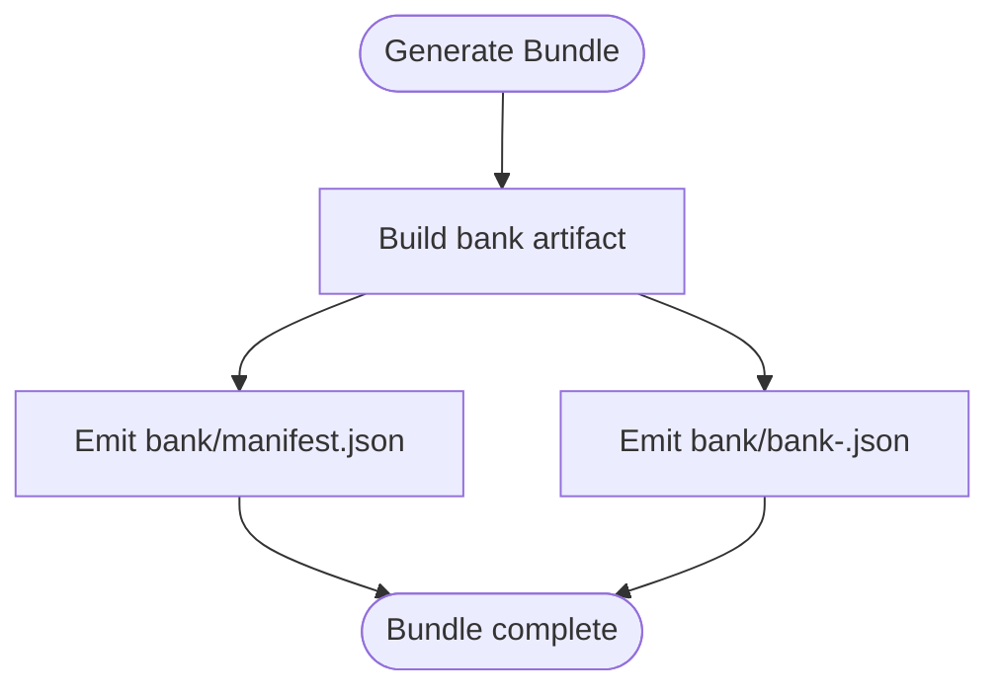
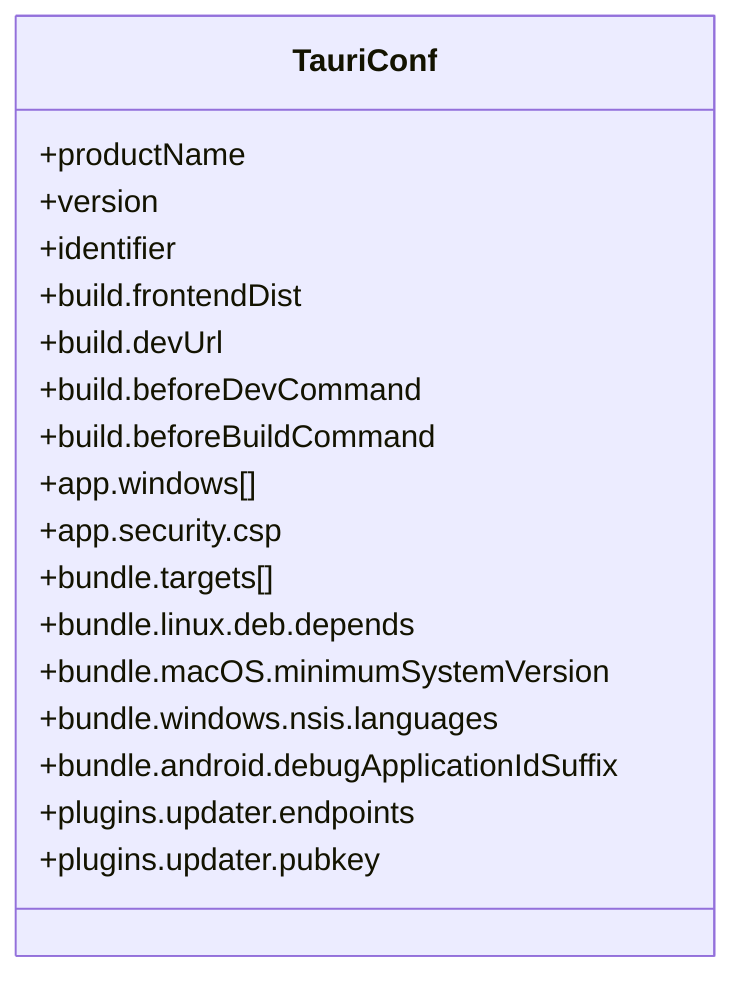
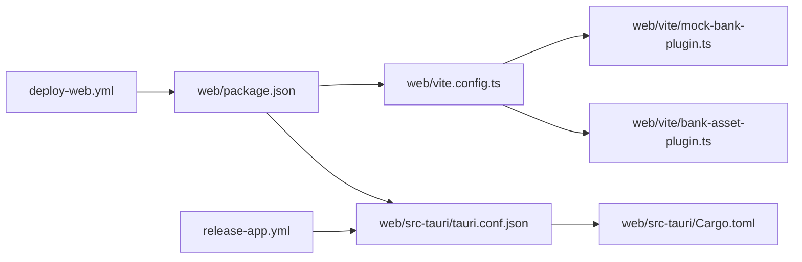

# Build Configuration

<cite>
**Referenced Files in This Document**
- [package.json](file://web/package.json)
- [vite.config.ts](file://web/vite.config.ts)
- [mock-bank-plugin.ts](file://web/vite/mock-bank-plugin.ts)
- [bank-asset-plugin.ts](file://web/vite/bank-asset-plugin.ts)
- [tauri.conf.json](file://web/src-tauri/tauri.conf.json)
- [Cargo.toml](file://web/src-tauri/Cargo.toml)
- [default.json](file://web/src-tauri/capabilities/default.json)
- [desktop.json](file://web/src-tauri/capabilities/desktop.json)
- [deploy-web.yml](file://.github/workflows/deploy-web.yml)
- [release-app.yml](file://.github/workflows/release-app.yml)
- [tsconfig.json](file://web/tsconfig.json)
</cite>

## Table of Contents
1. Introduction
2. Project Structure
3. Core Components
4. Architecture Overview
5. Detailed Component Analysis
6. Dependency Analysis
7. Performance Considerations
8. Troubleshooting Guide
9. Conclusion

## Introduction
This document explains the build configuration system that manages different deployment targets and environments for a web application and its desktop/mobile variants. It covers:
- Vite configuration, plugin registration, environment variables, build optimizations, and target-specific settings
- Package scripts that automate development, builds, and app packaging
- Tauri configuration for desktop and mobile builds, including platform-specific options, signing, and distribution packaging
- Environment management across development, staging, and production scenarios
- CI/CD workflows that enforce security constraints and produce release artifacts

## Project Structure
The build system centers around the web application with a single codebase producing multiple flavors:
- Web (GitHub Pages) using Supabase backend and relative base path
- Offline app (Tauri) bundling a compiled question bank and running locally without network
- Development mode with a mock backend to run exams without a live backend

**Diagram sources**
- [package.json:9-22](file://web/package.json#L9-L22)
- [vite.config.ts:18-52](file://web/vite.config.ts#L18-L52)
- [mock-bank-plugin.ts:21-50](file://web/vite/mock-bank-plugin.ts#L21-L50)
- [bank-asset-plugin.ts:13-55](file://web/vite/bank-asset-plugin.ts#L13-L55)
- [tauri.conf.json:6-11](file://web/src-tauri/tauri.conf.json#L6-L11)
- [Cargo.toml:36-41](file://web/src-tauri/Cargo.toml#L36-L41)
- [default.json:1-43](file://web/src-tauri/capabilities/default.json#L1-L43)
- [desktop.json:1-8](file://web/src-tauri/capabilities/desktop.json#L1-L8)
- [deploy-web.yml:25-122](file://.github/workflows/deploy-web.yml#L25-L122)
- [release-app.yml:59-181](file://.github/workflows/release-app.yml#L59-L181)

**Section sources**
- [package.json:9-22](file://web/package.json#L9-L22)
- [vite.config.ts:18-52](file://web/vite.config.ts#L18-L52)
- [tauri.conf.json:6-11](file://web/src-tauri/tauri.conf.json#L6-L11)
- [Cargo.toml:36-41](file://web/src-tauri/Cargo.toml#L36-L41)
- [deploy-web.yml:25-122](file://.github/workflows/deploy-web.yml#L25-L122)
- [release-app.yml:59-181](file://.github/workflows/release-app.yml#L59-L181)

## Core Components
- Vite configuration defines three flavors via environment flags, sets base paths per target, registers dev-only and offline plugins, and configures build outputs and browser targets.
- Tauri configuration wires frontend dist, dev URL, before-build commands, window settings, CSP, bundle targets, platform specifics, updater endpoints, and signing keys.
- GitHub Actions enforce flavor safety for web builds, build and sign installers for desktop platforms, and build/sign APKs for Android, then publish a draft release.

Key responsibilities:
- Flavor isolation: ensure local engine and answer keys never reach the public web bundle
- Asset strategy: serve mock bank during development; bundle compiled bank for offline apps
- Platform optimization: adjust WebView targets, Linux dependencies, macOS minimum version, Windows installer languages, Android debug suffix
- Security: strict CSP, minimal permissions, signed updates, verified signatures

**Section sources**
- [vite.config.ts:18-52](file://web/vite.config.ts#L18-L52)
- [mock-bank-plugin.ts:21-50](file://web/vite/mock-bank-plugin.ts#L21-L50)
- [bank-asset-plugin.ts:13-55](file://web/vite/bank-asset-plugin.ts#L13-L55)
- [tauri.conf.json:12-98](file://web/src-tauri/tauri.conf.json#L12-L98)
- [Cargo.toml:20-41](file://web/src-tauri/Cargo.toml#L20-L41)
- [default.json:1-43](file://web/src-tauri/capabilities/default.json#L1-L43)
- [desktop.json:1-8](file://web/src-tauri/capabilities/desktop.json#L1-L8)
- [deploy-web.yml:50-100](file://.github/workflows/deploy-web.yml#L50-L100)
- [release-app.yml:24-58](file://.github/workflows/release-app.yml#L24-L58)

## Architecture Overview
The build pipeline supports multiple deployment targets from one codebase:

**Diagram sources**
- [package.json:9-22](file://web/package.json#L9-L22)
- [vite.config.ts:18-52](file://web/vite.config.ts#L18-L52)
- [mock-bank-plugin.ts:21-50](file://web/vite/mock-bank-plugin.ts#L21-L50)
- [bank-asset-plugin.ts:13-55](file://web/vite/bank-asset-plugin.ts#L13-L55)
- [tauri.conf.json:6-11](file://web/src-tauri/tauri.conf.json#L6-L11)
- [deploy-web.yml:50-100](file://.github/workflows/deploy-web.yml#L50-L100)
- [release-app.yml:59-181](file://.github/workflows/release-app.yml#L59-L181)

## Detailed Component Analysis

### Vite Configuration and Flavors
- Flavor selection is driven by environment variables loaded at config time. The configuration forces these values into literals so dead branches are eliminated at build time, preventing sensitive code (local engine or answer keys) from leaking into bundles.
- Base path differs between GitHub Pages and Tauri webviews to ensure correct asset resolution.
- Plugins:
  - React plugin for JSX support
  - Mock bank plugin active only in development to serve a fixture bank and images
  - Bank asset plugin active only in offline mode to compile and emit a manifest and bank artifact into the bundle
- Build output and targets:
  - Output directory configured
  - Source maps disabled for production
  - Browser targets adjusted when building for Tauri to match embedded webviews

**Diagram sources**
- [vite.config.ts:18-52](file://web/vite.config.ts#L18-L52)

**Section sources**
- [vite.config.ts:18-52](file://web/vite.config.ts#L18-L52)

### Vite Plugins

#### Mock Bank Plugin (Development Only)
- Serves a compiled question bank and images under a mock endpoint during development
- Uses an in-memory image cache keyed by hash to keep figures stable across edits
- Restricted to serve-time only so no mock code reaches production bundles

**Diagram sources**
- [mock-bank-plugin.ts:21-50](file://web/vite/mock-bank-plugin.ts#L21-L50)

**Section sources**
- [mock-bank-plugin.ts:21-50](file://web/vite/mock-bank-plugin.ts#L21-L50)

#### Bank Asset Plugin (Offline App)
- Compiles the question bank into a manifest and a versioned bank file
- Emits these as assets during build so the offline app ships with zero connectivity
- In dev, serves the same endpoints used by the app to read the bank

**Diagram sources**
- [bank-asset-plugin.ts:23-29](file://web/vite/bank-asset-plugin.ts#L23-L29)

**Section sources**
- [bank-asset-plugin.ts:13-55](file://web/vite/bank-asset-plugin.ts#L13-L55)

### Tauri Configuration and Packaging
- Frontend integration:
  - Points to built dist folder and dev URL
  - Runs appropriate npm scripts before dev and build
- App shell:
  - Window dimensions, centering, resizable behavior
  - Strict Content Security Policy limiting sources and actions
- Bundling:
  - Active bundling with multiple targets (app, dmg, nsis, appimage, deb, rpm)
  - Publisher metadata, license, category, homepage
  - Platform-specific options: Linux dependencies, macOS minimum version and signing identity, Windows NSIS languages, Android debug suffix
- Updater:
  - Endpoint to fetch latest.json
  - Windows passive install mode
  - Public key for verifying update signatures

**Diagram sources**
- [tauri.conf.json:1-98](file://web/src-tauri/tauri.conf.json#L1-L98)

**Section sources**
- [tauri.conf.json:6-98](file://web/src-tauri/tauri.conf.json#L6-L98)

### Rust Crate and Release Profile
- Crate type includes staticlib, cdylib, rlib to support both desktop and mobile linking
- Dependencies include Tauri core and plugins; updater plugin excluded on Android/iOS where not available
- Release profile optimizes binary size and performance with LTO, single codegen unit, size opt-level, abort-on-panic, and stripping

**Section sources**
- [Cargo.toml:1-41](file://web/src-tauri/Cargo.toml#L1-L41)

### Capabilities and Permissions
- Default capability grants filesystem access scoped to the app’s bank directory, dialog prompts, and opening URLs to GitHub and mailto links
- Desktop capability enables in-place updates and process restart on supported platforms

**Section sources**
- [default.json:1-43](file://web/src-tauri/capabilities/default.json#L1-L43)
- [desktop.json:1-8](file://web/src-tauri/capabilities/desktop.json#L1-L8)

### TypeScript and Build Targets
- TypeScript target set to ES2022 with modern module resolution and strict checks
- Types include Vite client types and Node types for tooling compatibility

**Section sources**
- [tsconfig.json:1-20](file://web/tsconfig.json#L1-L20)

## Dependency Analysis
- Vite depends on React plugin and custom plugins for mock/offline features
- Tauri CLI orchestrates native builds and packaging, invoking npm scripts defined in package.json
- CI workflows depend on Node, Python, Rust toolchains, and platform SDKs to produce cross-platform artifacts

**Diagram sources**
- [package.json:9-22](file://web/package.json#L9-L22)
- [vite.config.ts:18-52](file://web/vite.config.ts#L18-L52)
- [mock-bank-plugin.ts:21-50](file://web/vite/mock-bank-plugin.ts#L21-L50)
- [bank-asset-plugin.ts:13-55](file://web/vite/bank-asset-plugin.ts#L13-L55)
- [tauri.conf.json:6-11](file://web/src-tauri/tauri.conf.json#L6-L11)
- [Cargo.toml:20-41](file://web/src-tauri/Cargo.toml#L20-L41)
- [deploy-web.yml:25-122](file://.github/workflows/deploy-web.yml#L25-L122)
- [release-app.yml:59-181](file://.github/workflows/release-app.yml#L59-L181)

**Section sources**
- [package.json:9-22](file://web/package.json#L9-L22)
- [vite.config.ts:18-52](file://web/vite.config.ts#L18-L52)
- [tauri.conf.json:6-11](file://web/src-tauri/tauri.conf.json#L6-L11)
- [Cargo.toml:20-41](file://web/src-tauri/Cargo.toml#L20-L41)
- [deploy-web.yml:25-122](file://.github/workflows/deploy-web.yml#L25-L122)
- [release-app.yml:59-181](file://.github/workflows/release-app.yml#L59-L181)

## Performance Considerations
- Dead-code elimination: Vite inlines flavor flags to remove unused backends and answer keys from bundles
- Targeted browser engines: Tauri builds use explicit targets aligned with embedded webviews to avoid polyfills
- Binary optimizations: Rust release profile uses LTO, single codegen unit, size optimization, panic abort, and strip to reduce footprint
- Asset caching: Mock image responses use immutable caching headers in development for faster reloads
- Bundle size control: Source maps disabled in production builds

[No sources needed since this section provides general guidance]

## Troubleshooting Guide
- Local engine leakage to web:
  - CI asserts that neither offline nor mock flags are set for the Pages build and scans the dist bundle to ensure the local engine is absent
- Missing git history for bank versions:
  - Workflows fetch full history so bank versioning works; missing history triggers warnings during bank artifact generation
- Android signing issues:
  - CI verifies the produced APK signature and fails if unsigned or mismatched; keystore properties are generated securely from secrets
- Tauri dev server port conflicts:
  - Tauri dev enforces strict port and configurable host to avoid collisions
- CSP errors in Tauri:
  - Ensure required domains are allowed in the CSP; the configuration restricts connect-src to specific origins

**Section sources**
- [deploy-web.yml:50-100](file://.github/workflows/deploy-web.yml#L50-L100)
- [release-app.yml:80-112](file://.github/workflows/release-app.yml#L80-L112)
- [release-app.yml:250-296](file://.github/workflows/release-app.yml#L250-L296)
- [vite.config.ts:49-52](file://web/vite.config.ts#L49-L52)
- [tauri.conf.json:26-35](file://web/src-tauri/tauri.conf.json#L26-L35)

## Conclusion
This build system delivers a secure, efficient, and multi-target workflow from a single codebase:
- Vite flavors isolate web and offline behaviors, ensuring sensitive code never leaks to public deployments
- Tauri packaging produces cross-platform installers and Android APKs with robust signing and update mechanisms
- CI enforces flavor safety, signs artifacts, verifies signatures, and publishes releases consistently
- Developers can iterate quickly with mock data while maintaining strict boundaries for production builds

[No sources needed since this section summarizes without analyzing specific files]