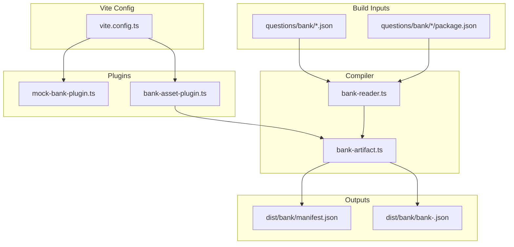
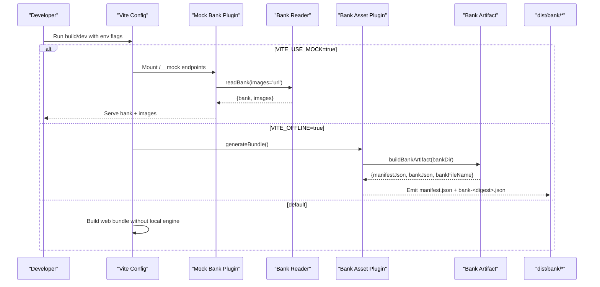
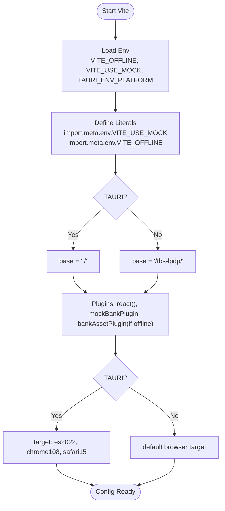
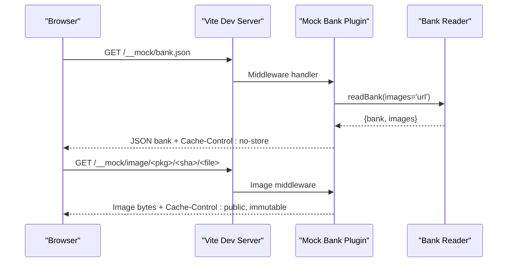
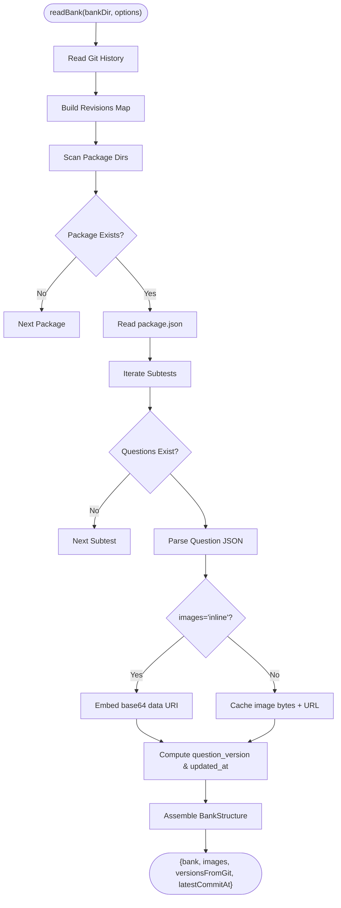
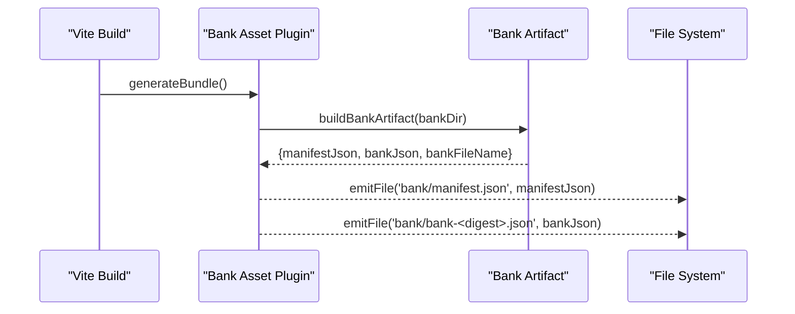
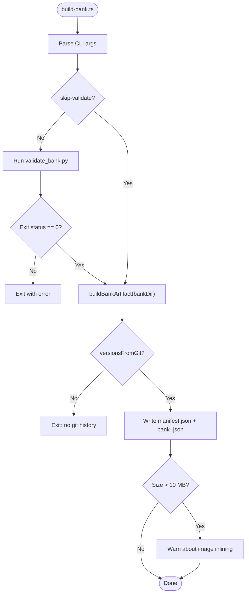
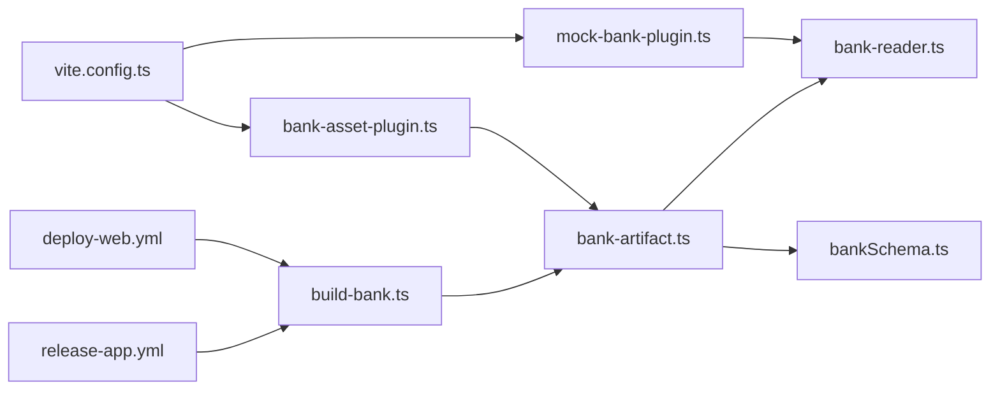

# Build and Packaging

<cite>
**Referenced Files in This Document**
- [vite.config.ts](file://web/vite.config.ts)
- [bank-artifact.ts](file://web/vite/bank-artifact.ts)
- [bank-asset-plugin.ts](file://web/vite/bank-asset-plugin.ts)
- [bank-reader.ts](file://web/vite/bank-reader.ts)
- [mock-bank-plugin.ts](file://web/vite/mock-bank-plugin.ts)
- [build-bank.ts](file://web/scripts/build-bank.ts)
- [bankSchema.ts](file://web/src/lib/bankSchema.ts)
- [types.ts](file://web/src/lib/types.ts)
- [deploy-web.yml](file://.github/workflows/deploy-web.yml)
- [release-app.yml](file://.github/workflows/release-app.yml)
- [package.json](file://web/package.json)
</cite>

## Table of Contents
1. [Introduction](#introduction)
2. [Project Structure](#project-structure)
3. [Core Components](#core-components)
4. [Architecture Overview](#architecture-overview)
5. [Detailed Component Analysis](#detailed-component-analysis)
6. [Dependency Analysis](#dependency-analysis)
7. [Performance Considerations](#performance-considerations)
8. [Troubleshooting Guide](#troubleshooting-guide)
9. [Conclusion](#conclusion)
10. [Appendices](#appendices)

## Introduction
This document explains the build and packaging system that compiles raw question files into optimized bundles for web and offline applications. It covers:
- The Vite plugin architecture that reads question packages during the build process and emits optimized artifacts.
- The asset handling pipeline for images, diagrams, and multimedia associated with questions, including optimization and caching strategies.
- The transformation pipeline that converts JSON question files into browser-compatible formats, supports lazy loading of large assets, and manages bundle size.
- Configuration options for different deployment targets (web, desktop, mobile), environment variables, and debugging tools.
- Integration with CI/CD pipelines for automated builds and deployments.

## Project Structure
The build system is centered around Vite and custom plugins located under web/vite, a bank compilation script under web/scripts, and CI workflows under .github/workflows. The source question bank lives under questions/bank and is read at build time to produce:
- A content-addressed bank file named bank-<digest>.json
- A small manifest.json pointing to the bank file with integrity metadata



**Diagram sources**
- [vite.config.ts:18-52](file://web/vite.config.ts#L18-L52)
- [bank-reader.ts:159-297](file://web/vite/bank-reader.ts#L159-L297)
- [bank-artifact.ts:25-55](file://web/vite/bank-artifact.ts#L25-L55)
- [bank-asset-plugin.ts:13-57](file://web/vite/bank-asset-plugin.ts#L13-L57)
- [mock-bank-plugin.ts:21-50](file://web/vite/mock-bank-plugin.ts#L21-L50)

**Section sources**
- [vite.config.ts:1-54](file://web/vite.config.ts#L1-L54)
- [package.json:9-22](file://web/package.json#L9-L22)

## Core Components
- Vite configuration selects build flavors via environment flags and sets base paths and targets per platform.
- Mock bank plugin serves compiled bank and image assets during development.
- Bank reader scans the question bank directory, parses JSON questions, computes versions from git history, and handles image modes (URL or inline data URIs).
- Bank artifact generator produces immutable, content-addressed bank files and a manifest with integrity checks.
- Bank asset plugin emits bundled bank artifacts for offline apps and serves them in dev mode.
- Build script validates the bank using an external validator and writes final artifacts.

**Section sources**
- [vite.config.ts:18-52](file://web/vite.config.ts#L18-L52)
- [mock-bank-plugin.ts:21-50](file://web/vite/mock-bank-plugin.ts#L21-L50)
- [bank-reader.ts:159-297](file://web/vite/bank-reader.ts#L159-L297)
- [bank-artifact.ts:25-55](file://web/vite/bank-artifact.ts#L25-L55)
- [bank-asset-plugin.ts:13-57](file://web/vite/bank-asset-plugin.ts#L13-L57)
- [build-bank.ts:22-81](file://web/scripts/build-bank.ts#L22-L81)

## Architecture Overview
The system supports three flavors through environment-driven branching:
- Web production: uses remote API, no local engine or answer keys.
- Dev mock: enables local engine and serves bank via middleware.
- Offline app: bundles a precompiled bank snapshot for zero-connectivity operation.



**Diagram sources**
- [vite.config.ts:18-52](file://web/vite.config.ts#L18-L52)
- [mock-bank-plugin.ts:21-50](file://web/vite/mock-bank-plugin.ts#L21-L50)
- [bank-asset-plugin.ts:23-57](file://web/vite/bank-asset-plugin.ts#L23-L57)
- [bank-artifact.ts:25-55](file://web/vite/bank-artifact.ts#L25-L55)

## Detailed Component Analysis

### Vite Configuration and Flavor Selection
- Reads environment variables to determine flavor: VITE_OFFLINE and VITE_USE_MOCK.
- Forces flavor selectors into literals via define so dead code elimination removes unused backends.
- Sets base path based on target (relative for Tauri, GitHub Pages path prefix for web).
- Conditionally includes plugins: mock bank plugin always in serve; bank asset plugin only when offline.
- Adjusts build target for Tauri environments and disables sourcemaps for production.



**Diagram sources**
- [vite.config.ts:18-52](file://web/vite.config.ts#L18-L52)

**Section sources**
- [vite.config.ts:18-52](file://web/vite.config.ts#L18-L52)

### Mock Bank Plugin (Development)
- Serves compiled bank at /__mock/bank.json with images referenced by URL.
- Caches images keyed by package and SHA to preserve versioned figures across edits.
- Only active in serve mode, ensuring no answer keys leak into production bundles.



**Diagram sources**
- [mock-bank-plugin.ts:21-50](file://web/vite/mock-bank-plugin.ts#L21-L50)
- [bank-reader.ts:159-297](file://web/vite/bank-reader.ts#L159-L297)

**Section sources**
- [mock-bank-plugin.ts:21-50](file://web/vite/mock-bank-plugin.ts#L21-L50)

### Bank Reader (Question Compilation)
- Scans questions/bank directories, reads package manifests and question JSON files.
- Computes question and package versions from git history; falls back to mtime if unavailable.
- Handles images in two modes:
  - URL mode: references images via /__mock/image cache key for dev.
  - Inline mode: embeds images as base64 data URIs for offline artifacts.
- Produces a normalized structure consumed by the local exam engine.



**Diagram sources**
- [bank-reader.ts:78-135](file://web/vite/bank-reader.ts#L78-L135)
- [bank-reader.ts:159-297](file://web/vite/bank-reader.ts#L159-L297)

**Section sources**
- [bank-reader.ts:159-297](file://web/vite/bank-reader.ts#L159-L297)

### Bank Artifact Generator
- Compiles the bank into immutable, content-addressed files:
  - bank-<digest>.json: full bank payload with images inlined for offline use.
  - manifest.json: small descriptor with schema versions, minimum app version, bank version, generated timestamp, and integrity metadata.
- Ensures reproducibility by deriving bank_version from SHA-256 of the serialized bank.

```mermaid
classDiagram
class BankArtifact {
+manifest : BankManifest
+manifestJson : string
+bankFileName : string
+bankJson : string
+versionsFromGit : boolean
}
class BankManifest {
+schema_version : number
+bank_schema_version : number
+min_app_version : string
+bank_version : string
+generated_at : string
+bank : { url, sha256, bytes }
}
BankArtifact --> BankManifest : "contains"
```

**Diagram sources**
- [bank-artifact.ts:15-55](file://web/vite/bank-artifact.ts#L15-L55)
- [bankSchema.ts:20-33](file://web/src/lib/bankSchema.ts#L20-L33)

**Section sources**
- [bank-artifact.ts:25-55](file://web/vite/bank-artifact.ts#L25-L55)
- [bankSchema.ts:20-33](file://web/src/lib/bankSchema.ts#L20-L33)

### Bank Asset Plugin (Offline App Bundling)
- Installed only when VITE_OFFLINE is true.
- Emits manifest.json and bank-<digest>.json into the build output under bank/.
- In dev server mode, mounts endpoints to serve these assets with appropriate headers.



**Diagram sources**
- [bank-asset-plugin.ts:23-57](file://web/vite/bank-asset-plugin.ts#L23-L57)
- [bank-artifact.ts:25-55](file://web/vite/bank-artifact.ts#L25-L55)

**Section sources**
- [bank-asset-plugin.ts:13-57](file://web/vite/bank-asset-plugin.ts#L13-L57)

### Build Script and Validation Gate
- Runs validate_bank.py before emitting artifacts to ensure bank integrity.
- Requires full git history to compute meaningful versions; otherwise fails.
- Writes manifest.json and bank-<digest>.json to the specified output directory.
- Warns when bank size exceeds thresholds to revisit image inlining strategy.



**Diagram sources**
- [build-bank.ts:22-81](file://web/scripts/build-bank.ts#L22-L81)

**Section sources**
- [build-bank.ts:22-81](file://web/scripts/build-bank.ts#L22-L81)

## Dependency Analysis
- vite.config.ts orchestrates plugin inclusion and environment-based branching.
- mock-bank-plugin.ts depends on bank-reader.ts for serving dev assets.
- bank-asset-plugin.ts depends on bank-artifact.ts to generate outputs.
- bank-artifact.ts depends on bank-reader.ts and bankSchema.ts for types and constants.
- CI workflows depend on Node, Python, and platform-specific toolchains to build and publish artifacts.



**Diagram sources**
- [vite.config.ts:18-52](file://web/vite.config.ts#L18-L52)
- [mock-bank-plugin.ts:21-50](file://web/vite/mock-bank-plugin.ts#L21-L50)
- [bank-asset-plugin.ts:13-57](file://web/vite/bank-asset-plugin.ts#L13-L57)
- [bank-artifact.ts:25-55](file://web/vite/bank-artifact.ts#L25-L55)
- [bank-reader.ts:159-297](file://web/vite/bank-reader.ts#L159-L297)
- [bankSchema.ts:20-33](file://web/src/lib/bankSchema.ts#L20-L33)
- [build-bank.ts:22-81](file://web/scripts/build-bank.ts#L22-L81)
- [deploy-web.yml:97-100](file://.github/workflows/deploy-web.yml#L97-L100)
- [release-app.yml:81-85](file://.github/workflows/release-app.yml#L81-L85)

**Section sources**
- [vite.config.ts:18-52](file://web/vite.config.ts#L18-L52)
- [deploy-web.yml:97-100](file://.github/workflows/deploy-web.yml#L97-L100)
- [release-app.yml:81-85](file://.github/workflows/release-app.yml#L81-L85)

## Performance Considerations
- Dead code elimination: Environment flags are forced to literals to remove unused backends from bundles, reducing size and preventing leakage of answer keys.
- Asset inlining vs URLs:
  - Dev uses URL references with long-lived caching for images to speed up iteration.
  - Offline bundles inline images as data URIs for zero-connectivity operation; warnings trigger review when bank size exceeds thresholds.
- Content addressing: Bank files are immutable and identified by SHA-256, enabling efficient caching and integrity verification.
- Platform targets: Tauri builds set explicit targets to optimize compatibility and reduce polyfills.

[No sources needed since this section provides general guidance]

## Troubleshooting Guide
- Missing git history:
  - Symptom: Versions fall back to mtime; CI may fail if full history is not fetched.
  - Resolution: Ensure fetch-depth: 0 in checkout steps for both web and app releases.
- Empty bank:
  - Symptom: Compiled bank has no packages/questions.
  - Resolution: Verify questions/bank structure and package manifests exist.
- Local engine in production:
  - Symptom: Answer keys present in web bundle.
  - Resolution: Ensure VITE_OFFLINE and VITE_USE_MOCK are unset in production environment; CI asserts this.
- Large bank size:
  - Symptom: Warning about exceeding threshold.
  - Resolution: Review image inlining strategy and consider splitting or optimizing assets.

**Section sources**
- [bank-reader.ts:78-135](file://web/vite/bank-reader.ts#L78-L135)
- [build-bank.ts:57-81](file://web/scripts/build-bank.ts#L57-L81)
- [deploy-web.yml:49-75](file://.github/workflows/deploy-web.yml#L49-L75)

## Conclusion
The build and packaging system leverages Vite plugins and a robust bank compiler to deliver optimized, secure, and reproducible artifacts for web and offline applications. Environment-driven flavor selection ensures separation of concerns between development, web production, and offline app builds. Asset handling balances performance and connectivity requirements, while CI/CD enforces validation and safety constraints.

[No sources needed since this section summarizes without analyzing specific files]

## Appendices

### Configuration Options and Environment Variables
- VITE_OFFLINE: Enables offline flavor and bundles bank assets.
- VITE_USE_MOCK: Enables dev mock backend and serves bank via middleware.
- TAURI_ENV_PLATFORM: Detected by config to adjust base path and build targets.
- VITE_SUPABASE_URL, VITE_SUPABASE_PUBLISHABLE_KEY, VITE_SUPABASE_ANON_KEY, VITE_TURNSTILE_SITE_KEY: Used in web production builds.

**Section sources**
- [vite.config.ts:18-52](file://web/vite.config.ts#L18-L52)
- [deploy-web.yml:79-88](file://.github/workflows/deploy-web.yml#L79-L88)

### CI/CD Integration
- Deploy web to GitHub Pages:
  - Builds web bundle and publishes bank artifacts under /tbs-lpdp/bank/.
  - Validates environment to prevent local engine inclusion.
  - Pushes question packages to Supabase when service role key is configured.
- Release offline app:
  - Builds multi-platform installers and APK.
  - Includes bank snapshot compiled with full git history.
  - Signs artifacts and publishes release with updater metadata.

**Section sources**
- [deploy-web.yml:24-133](file://.github/workflows/deploy-web.yml#L24-L133)
- [release-app.yml:24-310](file://.github/workflows/release-app.yml#L24-L310)