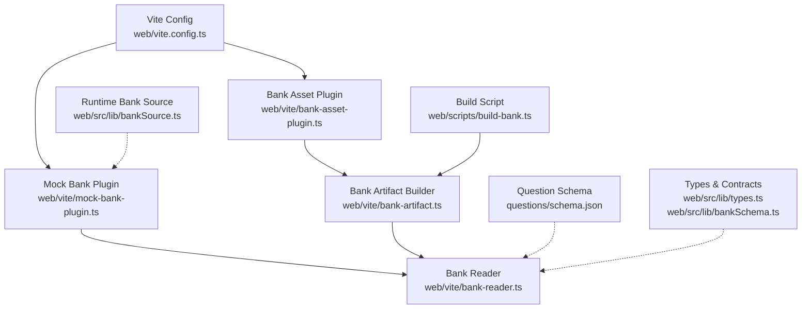
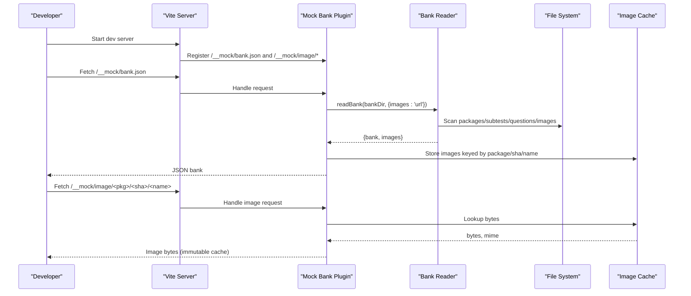
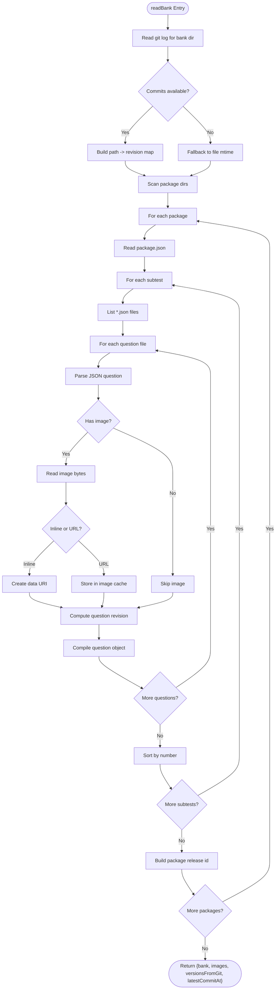
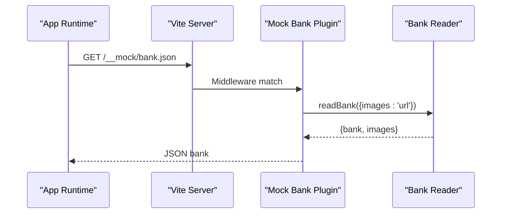
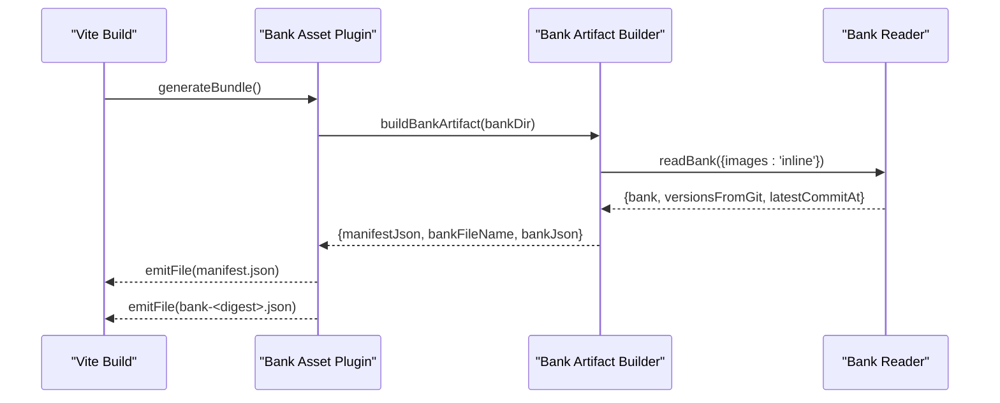
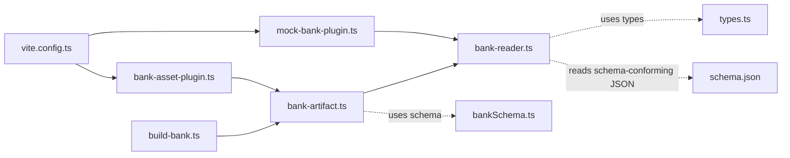

# Vite Plugin Architecture

<cite>
**Referenced Files in This Document**
- [bank-reader.ts](file://web/vite/bank-reader.ts)
- [bank-asset-plugin.ts](file://web/vite/bank-asset-plugin.ts)
- [mock-bank-plugin.ts](file://web/vite/mock-bank-plugin.ts)
- [bank-artifact.ts](file://web/vite/bank-artifact.ts)
- [vite.config.ts](file://web/vite.config.ts)
- [build-bank.ts](file://web/scripts/build-bank.ts)
- [schema.json](file://questions/schema.json)
- [types.ts](file://web/src/lib/types.ts)
- [bankSchema.ts](file://web/src/lib/bankSchema.ts)
- [bankSource.ts](file://web/src/lib/bankSource.ts)
</cite>

## Table of Contents
1. [Introduction](#introduction)
2. [Project Structure](#project-structure)
3. [Core Components](#core-components)
4. [Architecture Overview](#architecture-overview)
5. [Detailed Component Analysis](#detailed-component-analysis)
6. [Dependency Analysis](#dependency-analysis)
7. [Performance Considerations](#performance-considerations)
8. [Troubleshooting Guide](#troubleshooting-guide)
9. [Conclusion](#conclusion)
10. [Appendices](#appendices)

## Introduction
This document explains the Vite plugin architecture that processes a question bank during development and build time. It covers:
- How the bank reader scans JSON question files, validates structure against a schema, and transforms them into an optimized bundle.
- How the asset plugin emits a content-addressed bank artifact for offline distribution and serves it in development.
- How the mock bank plugin provides a local fixture for development without external services.
- Configuration options, lifecycle hooks, error handling patterns, and integration points with the main build pipeline.
- Guidance for custom plugin development and troubleshooting common issues.

## Project Structure
The relevant parts of the project are organized under web/vite for plugins and scripts, questions/bank for source data, and web/src/lib for shared contracts consumed by both runtime and build-time code.

**Diagram sources**
- [vite.config.ts:18-41](file://web/vite.config.ts#L18-L41)
- [mock-bank-plugin.ts:21-49](file://web/vite/mock-bank-plugin.ts#L21-L49)
- [bank-asset-plugin.ts:13-55](file://web/vite/bank-asset-plugin.ts#L13-L55)
- [bank-artifact.ts:25-54](file://web/vite/bank-artifact.ts#L25-L54)
- [bank-reader.ts:159-297](file://web/vite/bank-reader.ts#L159-L297)
- [build-bank.ts:22-81](file://web/scripts/build-bank.ts#L22-L81)
- [schema.json:1-98](file://questions/schema.json#L1-L98)
- [types.ts:196-211](file://web/src/lib/types.ts#L196-L211)
- [bankSchema.ts:7-33](file://web/src/lib/bankSchema.ts#L7-L33)

**Section sources**
- [vite.config.ts:1-54](file://web/vite.config.ts#L1-L54)
- [README.md:118-154](file://web/README.md#L118-L154)

## Core Components
- Bank Reader: Scans the git-backed question bank directory, parses JSON questions, computes versions from git history, handles images (inline or URL), and assembles a compiled bank object consumed by the exam engine.
- Mock Bank Plugin: Serves the compiled bank at /__mock/bank.json during development and proxies image requests to serve cached assets with immutable caching.
- Bank Asset Plugin: Emits manifest.json and a content-addressed bank-<digest>.json into the app’s assets for offline builds; also serves these files during development when base paths differ.
- Bank Artifact Builder: Pure function producing the published artifact pair (manifest + bank file) deterministically from the git tree.
- Build Script: Orchestrates validation via Python validator, ensures full git history is present, and writes the final artifacts.

**Section sources**
- [bank-reader.ts:7-21](file://web/vite/bank-reader.ts#L7-L21)
- [bank-reader.ts:159-297](file://web/vite/bank-reader.ts#L159-L297)
- [mock-bank-plugin.ts:4-12](file://web/vite/mock-bank-plugin.ts#L4-L12)
- [mock-bank-plugin.ts:21-49](file://web/vite/mock-bank-plugin.ts#L21-L49)
- [bank-asset-plugin.ts:4-12](file://web/vite/bank-asset-plugin.ts#L4-L12)
- [bank-asset-plugin.ts:13-55](file://web/vite/bank-asset-plugin.ts#L13-L55)
- [bank-artifact.ts:5-13](file://web/vite/bank-artifact.ts#L5-L13)
- [bank-artifact.ts:25-54](file://web/vite/bank-artifact.ts#L25-L54)
- [build-bank.ts:1-14](file://web/scripts/build-bank.ts#L1-L14)
- [build-bank.ts:42-81](file://web/scripts/build-bank.ts#L42-L81)

## Architecture Overview
The system supports three build flavors selected at compile time:
- Web production: uses remote APIs; no bank bundling.
- Dev mock: enables local engine and serves bank via middleware.
- Offline app: bundles the bank artifact into the app and serves it locally.

**Diagram sources**
- [vite.config.ts:18-41](file://web/vite.config.ts#L18-L41)
- [mock-bank-plugin.ts:21-49](file://web/vite/mock-bank-plugin.ts#L21-L49)
- [bank-reader.ts:159-297](file://web/vite/bank-reader.ts#L159-L297)

## Detailed Component Analysis

### Bank Reader
Responsibilities:
- Traverse questions/bank/<package>/<subtest>/*.json.
- Parse each question and compute stable IDs and versions from git commit history.
- Handle images either inline (for published artifact) or as URLs (for dev).
- Assemble packages and questions into a compiled Bank shape consumed by the engine.

Key behaviors:
- Git-based versioning: Uses git log to compute per-path revisions and timestamps; falls back to mtime if git unavailable.
- Deterministic output: Fixed key ordering and content hashing ensure byte-identical outputs across runs over the same tree.
- Image handling:
  - Inline mode: Base64 data URIs embedded in the bank JSON.
  - URL mode: Maps to /__mock/image/<package>/<sha256>/<name> served by the mock plugin.
- Subtest blueprint: Enforces order, duration, and passing grade per subtest.

Validation notes:
- The reader assumes well-formed JSON following the repository’s conventions. Structural validation is enforced by the Python validator invoked by the build script.

Complexity considerations:
- File scanning is O(N) over all question files and images.
- Git log parsing is proportional to the number of commits touching the bank directory.

Error handling:
- Gracefully degrades when git is unavailable.
- Returns empty bank if directory missing.
- Throws on malformed JSON or missing images (caller should handle).

**Section sources**
- [bank-reader.ts:23-38](file://web/vite/bank-reader.ts#L23-L38)
- [bank-reader.ts:73-135](file://web/vite/bank-reader.ts#L73-L135)
- [bank-reader.ts:159-297](file://web/vite/bank-reader.ts#L159-L297)
- [types.ts:196-211](file://web/src/lib/types.ts#L196-L211)

#### Data Flow Flowchart

**Diagram sources**
- [bank-reader.ts:159-297](file://web/vite/bank-reader.ts#L159-L297)

### Mock Bank Plugin
Role:
- Serve the compiled bank at /__mock/bank.json during development.
- Serve images at /__mock/image/<package>/<sha256>/<name> with immutable caching.
- Ensure answer keys remain only in development; never included in production bundles.

Lifecycle hooks:
- configureServer: Registers middlewares for bank and image endpoints.

Caching strategy:
- In-memory Map caches image bytes keyed by package/sha/filename to preserve older figures even after edits.

Error handling:
- Returns 500 with error details on read failures.

Integration:
- Used only in serve mode; applied via Vite config.

**Section sources**
- [mock-bank-plugin.ts:4-12](file://web/vite/mock-bank-plugin.ts#L4-L12)
- [mock-bank-plugin.ts:19-49](file://web/vite/mock-bank-plugin.ts#L19-L49)
- [vite.config.ts:18-41](file://web/vite.config.ts#L18-L41)

#### Sequence Diagram: Dev Bank Request

**Diagram sources**
- [mock-bank-plugin.ts:21-49](file://web/vite/mock-bank-plugin.ts#L21-L49)
- [bank-reader.ts:159-297](file://web/vite/bank-reader.ts#L159-L297)

### Bank Asset Plugin
Role:
- Emit manifest.json and bank-<digest>.json into the app’s assets for offline builds.
- Serve these files during development under appropriate base paths.

Lifecycle hooks:
- configResolved: Captures base path.
- generateBundle: Builds artifact and emits files.
- configureServer: Mounts middleware to serve generated files in dev.

Caching strategy:
- No-store for dynamic serving in dev; immutable caching not used here.

Error handling:
- Warns when git history is missing (versions fall back to 1).
- Returns 500 with error JSON on runtime errors.

Integration:
- Only installed when VITE_OFFLINE is true.

**Section sources**
- [bank-asset-plugin.ts:4-12](file://web/vite/bank-asset-plugin.ts#L4-L12)
- [bank-asset-plugin.ts:13-55](file://web/vite/bank-asset-plugin.ts#L13-L55)
- [vite.config.ts:18-41](file://web/vite.config.ts#L18-L41)

#### Sequence Diagram: Offline Bundle Generation

**Diagram sources**
- [bank-asset-plugin.ts:23-30](file://web/vite/bank-asset-plugin.ts#L23-L30)
- [bank-artifact.ts:25-54](file://web/vite/bank-artifact.ts#L25-L54)
- [bank-reader.ts:159-297](file://web/vite/bank-reader.ts#L159-L297)

### Bank Artifact Builder
Responsibilities:
- Produce deterministic manifest.json and bank-<digest>.json from the git tree.
- Compute SHA-256 of the bank JSON and embed metadata (schema versions, min app version, generated_at from latest commit).

Determinism:
- Uses latestCommitAt instead of wall-clock time to keep outputs reproducible.

Output contract:
- Manifest fields validated by parseManifest in runtime code.

**Section sources**
- [bank-artifact.ts:5-13](file://web/vite/bank-artifact.ts#L5-L13)
- [bank-artifact.ts:25-54](file://web/vite/bank-artifact.ts#L25-L54)
- [bankSchema.ts:7-33](file://web/src/lib/bankSchema.ts#L7-L33)

### Build Script
Responsibilities:
- Validate the bank using the Python validator before building.
- Require full git history for stable versions.
- Write manifest.json and bank-<digest>.json to output directory.

Checks:
- Ensures non-empty bank and warns if size exceeds threshold.

**Section sources**
- [build-bank.ts:1-14](file://web/scripts/build-bank.ts#L1-L14)
- [build-bank.ts:22-81](file://web/scripts/build-bank.ts#L22-L81)

### Question Schema and Types
- Schema defines strict structure for question JSON files, including required fields, enums, and constraints.
- Types define the compiled Bank, BankQuestion, and related shapes consumed by the engine and runtime.

Validation flow:
- Python validator enforces structural and semantic rules.
- Runtime parseManifest validates downloaded manifests.

**Section sources**
- [schema.json:1-98](file://questions/schema.json#L1-L98)
- [types.ts:196-211](file://web/src/lib/types.ts#L196-L211)
- [bankSchema.ts:39-67](file://web/src/lib/bankSchema.ts#L39-L67)

## Dependency Analysis

**Diagram sources**
- [vite.config.ts:18-41](file://web/vite.config.ts#L18-L41)
- [mock-bank-plugin.ts:21-49](file://web/vite/mock-bank-plugin.ts#L21-L49)
- [bank-asset-plugin.ts:13-55](file://web/vite/bank-asset-plugin.ts#L13-L55)
- [bank-artifact.ts:25-54](file://web/vite/bank-artifact.ts#L25-L54)
- [bank-reader.ts:159-297](file://web/vite/bank-reader.ts#L159-L297)
- [build-bank.ts:22-81](file://web/scripts/build-bank.ts#L22-L81)
- [types.ts:196-211](file://web/src/lib/types.ts#L196-L211)
- [bankSchema.ts:7-33](file://web/src/lib/bankSchema.ts#L7-L33)
- [schema.json:1-98](file://questions/schema.json#L1-L98)

**Section sources**
- [vite.config.ts:1-54](file://web/vite.config.ts#L1-L54)
- [bank-reader.ts:159-297](file://web/vite/bank-reader.ts#L159-L297)
- [bank-artifact.ts:25-54](file://web/vite/bank-artifact.ts#L25-L54)
- [build-bank.ts:22-81](file://web/scripts/build-bank.ts#L22-L81)

## Performance Considerations
- Git log parsing can be expensive for large histories; consider shallow clones only where necessary and rely on fetch-depth: 0 for CI to ensure stable versions.
- Image inlining increases bank size; monitor total size and revisit strategies if exceeding thresholds.
- Dev image caching avoids repeated reads and improves HMR responsiveness.
- Avoid unnecessary re-reads by leveraging in-memory caches in dev (as implemented).

[No sources needed since this section provides general guidance]

## Troubleshooting Guide
Common issues and resolutions:
- Missing git history:
  - Symptom: Warnings about versions falling back to 1; build script exits with error.
  - Resolution: Ensure CI checkout includes full history (fetch-depth: 0).
- Empty bank:
  - Symptom: Build fails due to empty compiled bank.
  - Resolution: Verify questions/bank contains valid packages and subtests.
- Validation failures:
  - Symptom: Python validator returns non-zero status.
  - Resolution: Fix question JSON according to schema and validator rules.
- Dev server cannot serve bank:
  - Symptom: 500 errors from /__mock/bank.json.
  - Resolution: Check filesystem permissions and bank directory path; inspect error response.
- Images not loading in dev:
  - Symptom: 404 on /__mock/image/* or wrong MIME type.
  - Resolution: Ensure image exists under the package directory and matches expected extensions; verify cache key format.
- Offline app cannot update bank:
  - Symptom: Download verification fails or old bank persists.
  - Resolution: Confirm manifest URL matches bank filename pattern and SHA-256 matches payload.

**Section sources**
- [bank-asset-plugin.ts:23-55](file://web/vite/bank-asset-plugin.ts#L23-L55)
- [mock-bank-plugin.ts:21-49](file://web/vite/mock-bank-plugin.ts#L21-L49)
- [build-bank.ts:42-81](file://web/scripts/build-bank.ts#L42-L81)
- [bankSchema.ts:39-67](file://web/src/lib/bankSchema.ts#L39-L67)

## Conclusion
The Vite plugin architecture cleanly separates concerns:
- Bank Reader compiles and version-controls the question bank deterministically.
- Mock Bank Plugin enables fully local development without external dependencies.
- Bank Asset Plugin produces a robust, content-addressed artifact for offline distribution.
- The build script enforces quality gates through validation and history requirements.
Together, they provide a reliable, reproducible pipeline for processing and distributing question banks across web and offline environments.

[No sources needed since this section summarizes without analyzing specific files]

## Appendices

### Configuration Options
- Environment flags:
  - VITE_USE_MOCK: Enables dev mock backend.
  - VITE_OFFLINE: Enables offline flavor and bundles bank artifact.
  - TAURI_ENV_PLATFORM: Detects Tauri environment for base path and server settings.
- Vite base:
  - Relative base for Tauri; GitHub Pages base otherwise.
- Plugins:
  - Always include React plugin.
  - Include mock bank plugin in serve mode.
  - Include bank asset plugin only in offline builds.

**Section sources**
- [vite.config.ts:18-41](file://web/vite.config.ts#L18-L41)

### Custom Plugin Development Tips
- Use apply: 'serve' to restrict dev-only behavior and prevent leaking sensitive data into production.
- Leverage configureServer to mount middlewares for endpoints like /__mock/bank.json and /__mock/image/*.
- Prefer pure functions (like buildBankArtifact) for deterministic outputs and easier testing.
- Integrate with existing readers/artifacts to avoid duplication and maintain consistency.

**Section sources**
- [mock-bank-plugin.ts:4-12](file://web/vite/mock-bank-plugin.ts#L4-L12)
- [bank-artifact.ts:5-13](file://web/vite/bank-artifact.ts#L5-L13)

### Runtime Integration Notes
- The runtime chooses between dev and offline bank sources based on build-time flags.
- Dev source fetches /__mock/bank.json; offline source uses bundled or cached artifacts with integrity checks.

**Section sources**
- [bankSource.ts:100-127](file://web/src/lib/bankSource.ts#L100-L127)
- [bankSource.ts:293-322](file://web/src/lib/bankSource.ts#L293-L322)