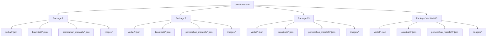
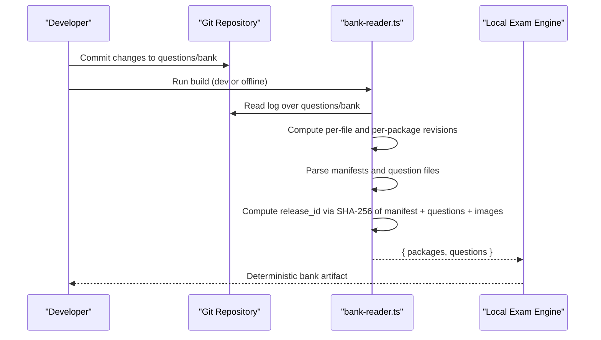
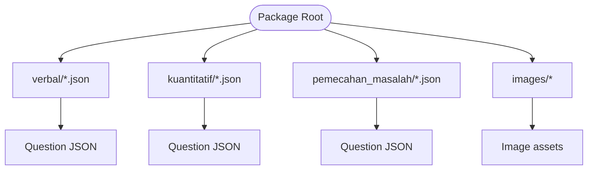
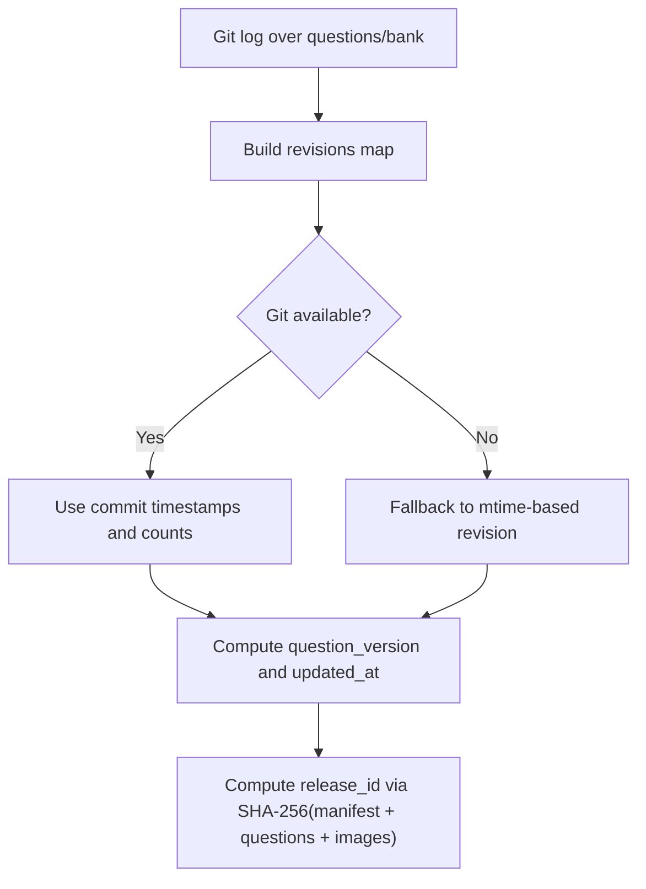
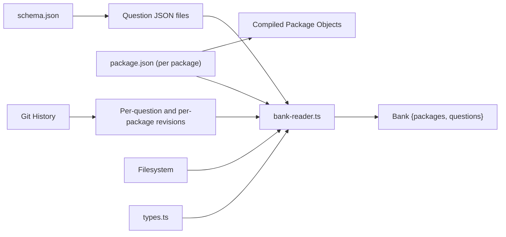

# Package Management

<cite>
**Referenced Files in This Document**
- [questions/bank/README.md](file://questions/bank/README.md)
- [questions/schema.json](file://questions/schema.json)
- [questions/generator/common.py](file://questions/generator/common.py)
- [web/vite/bank-reader.ts](file://web/vite/bank-reader.ts)
- [web/src/lib/types.ts](file://web/src/lib/types.ts)
- [scripts/bump_version.py](file://scripts/bump_version.py)
- [questions/bank/1/package.json](file://questions/bank/1/package.json)
- [questions/bank/2/package.json](file://questions/bank/2/package.json)
- [questions/bank/13/package.json](file://questions/bank/13/package.json)
- [questions/bank/14/package.json](file://questions/bank/14/package.json)
- [questions/bank/1/verbal/001.json](file://questions/bank/1/verbal/001.json)
- [questions/bank/1/kuantitatif/001.json](file://questions/bank/1/kuantitatif/001.json)
- [questions/bank/1/pemecahan_masalah/001.json](file://questions/bank/1/pemecahan_masalah/001.json)
- [questions/bank/14/verbal/001.json](file://questions/bank/14/verbal/001.json)
- [questions/bank/14/kuantitatif/001.json](file://questions/bank/14/kuantitatif/001.json)
- [questions/bank/14/pemecahan_masalah/001.json](file://questions/bank/14/pemecahan_masalah/001.json)
</cite>

## Update Summary
**Changes Made**
- Added comprehensive documentation for Package 14 featuring Kimi-K3 AI model from Moonshot AI
- Updated package examples to include the latest package (Package 14)
- Enhanced AI model diversity section to showcase different AI providers
- Updated package count and statistics to reflect the new addition
- Added specific examples of Package 14's question structure and metadata

## Table of Contents
1. [Introduction](#introduction)
2. [Project Structure](#project-structure)
3. [Core Components](#core-components)
4. [Architecture Overview](#architecture-overview)
5. [Detailed Component Analysis](#detailed-component-analysis)
6. [Dependency Analysis](#dependency-analysis)
7. [Performance Considerations](#performance-considerations)
8. [Troubleshooting Guide](#troubleshooting-guide)
9. [Conclusion](#conclusion)
10. [Appendices](#appendices)

## Introduction
This document explains the package management system that organizes questions into version-controlled packages for distribution and deployment. Each package represents a complete set of questions for a specific exam session or practice set, organized by subtest categories (verbal, kuantitatif, pemecahan_masalah). The system uses Git as the source of truth to derive immutable versions and content-addressed release identifiers, ensuring reproducible builds and reliable attempt pinning. It also describes how package metadata is stored, how versions are tracked, and how updates are coordinated across multiple packages.

The current question bank contains 14 packages, with Package 14 being the latest addition featuring the Kimi-K3 AI model from Moonshot AI, providing high-difficulty questions with enhanced reasoning capabilities.

## Project Structure
The question bank lives under questions/bank. Each numbered directory is a package containing:
- A package manifest (package.json) with metadata such as id, title, description, difficulty, and AI model information.
- Three subtest directories: verbal, kuantitatif, pemecahan_masalah.
- An images directory for figures referenced by questions.
- One JSON file per question within each subtest, following a strict schema.

**Diagram sources**
- [web/vite/bank-reader.ts:189-293](file://web/vite/bank-reader.ts#L189-L293)
- [questions/generator/common.py:135-164](file://questions/generator/common.py#L135-L164)

**Section sources**
- [questions/bank/README.md:1-3](file://questions/bank/README.md#L1-L3)
- [web/vite/bank-reader.ts:189-293](file://web/vite/bank-reader.ts#L189-L293)
- [questions/generator/common.py:135-164](file://questions/generator/common.py#L135-L164)

## Core Components
- Question Schema: Defines the contract for each question file, including required fields, allowed types, image paths, and validation rules.
- Package Manifests: Per-package metadata files describing the package identity, difficulty, and AI provenance.
- Bank Reader: Compiles the git-backed question bank into an in-memory structure consumed by the local exam engine, deriving versions from Git history and computing content-addressed release IDs.
- Types and Contracts: TypeScript interfaces define the compiled shapes used by the application and build tools.
- Version Bumping Script: Updates app-level semantic versions across configuration files; while not directly managing question packages, it coordinates release cadence with the rest of the product.

**Section sources**
- [questions/schema.json:1-98](file://questions/schema.json#L1-L98)
- [questions/bank/1/package.json:1-10](file://questions/bank/1/package.json#L1-L10)
- [questions/bank/14/package.json:1-10](file://questions/bank/14/package.json#L1-L10)
- [web/vite/bank-reader.ts:159-298](file://web/vite/bank-reader.ts#L159-L298)
- [web/src/lib/types.ts:200-211](file://web/src/lib/types.ts#L200-L211)
- [scripts/bump_version.py:1-124](file://scripts/bump_version.py#L1-L124)

## Architecture Overview
The package management architecture centers on Git as the single source of truth for question content. The build process reads the filesystem, validates against the schema, computes per-question and per-package revisions from Git history, and produces a deterministic artifact with a content-addressed release ID.

**Diagram sources**
- [web/vite/bank-reader.ts:73-125](file://web/vite/bank-reader.ts#L73-L125)
- [web/vite/bank-reader.ts:159-298](file://web/vite/bank-reader.ts#L159-L298)

## Detailed Component Analysis

### Directory Structure and Subtests
Each package directory contains three subtest folders:
- verbal: Penalaran Verbal questions
- kuantitatif: Penalaran Kuantitatif questions
- pemecahan_masalah: Pemecahan Masalah questions

Files are named with zero-padded numbers (e.g., 001.json), and each file follows the schema. Images referenced by questions live under images/ and are addressed relative to the package root.

**Diagram sources**
- [questions/generator/common.py:17-58](file://questions/generator/common.py#L17-L58)
- [questions/bank/14/verbal/001.json:1-43](file://questions/bank/14/verbal/001.json#L1-L43)
- [questions/bank/14/kuantitatif/001.json:1-43](file://questions/bank/14/kuantitatif/001.json#L1-L43)
- [questions/bank/14/pemecahan_masalah/001.json:1-43](file://questions/bank/14/pemecahan_masalah/001.json#L1-L43)

**Section sources**
- [questions/generator/common.py:17-58](file://questions/generator/common.py#L17-L58)
- [questions/schema.json:23-96](file://questions/schema.json#L23-L96)

### Package Metadata and AI Model Diversity
Each package includes a manifest with:
- id: numeric package identifier
- title and description: human-readable labels
- difficulty: easy, medium, hard, or hard+ (as seen in Package 14)
- ai_model, ai_company, ai_model_description: provenance metadata

The question bank now features diverse AI models from different providers:
- **Anthropic**: Opus 5 (Packages 1-12)
- **Alibaba Cloud**: Qwen3.8-Max (Package 13)
- **Moonshot AI**: Kimi-K3 (Package 14) - Latest addition with enhanced reasoning capabilities

Package 14 specifically uses the Kimi-K3 model, described as "a leading language model from Moonshot AI with deep reasoning capabilities to generate more challenging TBS questions than previous packages."

**Updated** Added Package 14 with Kimi-K3 AI model from Moonshot AI, representing the latest advancement in AI-generated questions with enhanced reasoning capabilities.

**Section sources**
- [questions/bank/1/package.json:1-10](file://questions/bank/1/package.json#L1-L10)
- [questions/bank/2/package.json:1-10](file://questions/bank/2/package.json#L1-L10)
- [questions/bank/13/package.json:1-10](file://questions/bank/13/package.json#L1-L10)
- [questions/bank/14/package.json:1-10](file://questions/bank/14/package.json#L1-L10)
- [web/vite/bank-reader.ts:194-202](file://web/vite/bank-reader.ts#L194-L202)
- [web/vite/bank-reader.ts:271-293](file://web/vite/bank-reader.ts#L271-L293)

### Question Schema and Validation
The schema enforces:
- Stable id derived from path: <package>-<subtest>-<NNN>
- Allowed subtests and question types
- Required fields like options, correct_option, explanations, difficulty, source, verified
- Image path constraints relative to the package directory

Validation helpers ensure type correctness and consistency between subtests and question types.

**Section sources**
- [questions/schema.json:1-98](file://questions/schema.json#L1-L98)
- [questions/generator/common.py:29-68](file://questions/generator/common.py#L29-L68)
- [questions/generator/common.py:167-207](file://questions/generator/common.py#L167-L207)

### Versioning Strategy
- Per-question revision: Derived from Git history of each question file and its parent directories. If Git is unavailable, fallback to file modification time.
- Per-package revision: Counts commits touching any file within the package directory.
- Release ID: Content-addressed hash combining manifest, all question JSONs, and image bytes. This ensures immutability and reproducibility even if uncommitted edits exist at build time.

**Diagram sources**
- [web/vite/bank-reader.ts:73-125](file://web/vite/bank-reader.ts#L73-L125)
- [web/vite/bank-reader.ts:186-188](file://web/vite/bank-reader.ts#L186-L188)
- [web/vite/bank-reader.ts:199-202](file://web/vite/bank-reader.ts#L199-L202)
- [web/vite/bank-reader.ts:236-251](file://web/vite/bank-reader.ts#L236-L251)
- [web/vite/bank-reader.ts:271-293](file://web/vite/bank-reader.ts#L271-L293)

**Section sources**
- [web/vite/bank-reader.ts:73-125](file://web/vite/bank-reader.ts#L73-L125)
- [web/vite/bank-reader.ts:186-188](file://web/vite/bank-reader.ts#L186-L188)
- [web/vite/bank-reader.ts:199-202](file://web/vite/bank-reader.ts#L199-L202)
- [web/vite/bank-reader.ts:236-251](file://web/vite/bank-reader.ts#L236-L251)
- [web/vite/bank-reader.ts:271-293](file://web/vite/bank-reader.ts#L271-L293)

### App-Level Semantic Versioning
While question packages use Git-derived revisions and content-addressed release IDs, the application itself uses semantic versioning managed by a script that bumps versions across Tauri and web configs. This helps coordinate releases with package updates.

**Section sources**
- [scripts/bump_version.py:1-124](file://scripts/bump_version.py#L1-L124)

### Creating New Packages
To create a new package:
- Add a new numbered directory under questions/bank.
- Create package.json with id, title, description, difficulty, and AI metadata.
- Create subtest directories (verbal, kuantitatif, pemecahan_masalah) and add question JSON files following the schema.
- Place images under images/ and reference them using relative paths in question files.
- Commit changes to Git so revisions and release IDs can be computed.

**Example**: Package 14 demonstrates the standard structure with 60 total questions (23 verbal, 25 quantitative, 12 problem-solving) generated using the Kimi-K3 AI model.

**Section sources**
- [web/vite/bank-reader.ts:189-202](file://web/vite/bank-reader.ts#L189-L202)
- [questions/generator/common.py:135-164](file://questions/generator/common.py#L135-L164)
- [questions/schema.json:23-96](file://questions/schema.json#L23-L96)

### Managing Package Versions
- Use Git commits to drive per-question and per-package revisions.
- Avoid renaming question files after pushing; ids are stable and derived from paths.
- For app releases, bump semantic versions using the provided script to keep Tauri and web versions synchronized.

**Section sources**
- [web/vite/bank-reader.ts:73-125](file://web/vite/bank-reader.ts#L73-L125)
- [web/vite/bank-reader.ts:186-188](file://web/vite/bank-reader.ts#L186-L188)
- [scripts/bump_version.py:29-54](file://scripts/bump_version.py#L29-L54)
- [scripts/bump_version.py:94-120](file://scripts/bump_version.py#L94-L120)

### Coordinating Updates Across Multiple Packages
- When updating multiple packages, commit changes together to produce consistent revisions and release artifacts.
- Ensure all packages adhere to the schema and subtest/type constraints before committing.
- Use the same semantic version bump for app releases when coordinating cross-package updates.

**Section sources**
- [web/vite/bank-reader.ts:189-293](file://web/vite/bank-reader.ts#L189-L293)
- [questions/generator/common.py:29-68](file://questions/generator/common.py#L29-L68)
- [scripts/bump_version.py:94-120](file://scripts/bump_version.py#L94-L120)

## Dependency Analysis
The package management system has clear dependencies:
- Questions depend on the schema for structure and validation.
- Packages depend on manifests for metadata and on subtest directories for content.
- The bank reader depends on Git history for versioning and on the filesystem for content.
- The application consumes the compiled bank through well-defined TypeScript interfaces.

**Diagram sources**
- [questions/schema.json:1-98](file://questions/schema.json#L1-L98)
- [web/vite/bank-reader.ts:159-298](file://web/vite/bank-reader.ts#L159-L298)
- [web/src/lib/types.ts:200-211](file://web/src/lib/types.ts#L200-L211)

**Section sources**
- [web/vite/bank-reader.ts:159-298](file://web/vite/bank-reader.ts#L159-L298)
- [web/src/lib/types.ts:200-211](file://web/src/lib/types.ts#L200-L211)
- [questions/schema.json:1-98](file://questions/schema.json#L1-L98)

## Performance Considerations
- Git log parsing can be expensive for large histories; the reader caches revisions per path and directory prefix to avoid repeated scans.
- Image handling supports two modes: inline data URIs for offline bundles and URL references for dev mock serving, balancing size and performance.
- Deterministic output ensures identical artifacts for the same tree, aiding caching and reproducibility.

## Troubleshooting Guide
Common issues and resolutions:
- Missing package.json: The reader skips directories without a manifest; ensure each package includes a valid manifest.
- Invalid question JSON: Validate against the schema; check required fields, option keys, and explanation coverage.
- Git unavailable: Revisions fall back to file modification times; ensure Git is initialized and accessible for accurate versioning.
- Image path errors: Confirm images exist under images/ and paths match the pattern enforced by the schema.

**Section sources**
- [web/vite/bank-reader.ts:169-171](file://web/vite/bank-reader.ts#L169-L171)
- [web/vite/bank-reader.ts:186-188](file://web/vite/bank-reader.ts#L186-L188)
- [questions/schema.json:57-61](file://questions/schema.json#L57-L61)
- [questions/schema.json:66-95](file://questions/schema.json#L66-L95)

## Conclusion
The package management system leverages Git as the authoritative source for question content, deriving immutable versions and content-addressed release identifiers to ensure reproducibility and reliability. With the addition of Package 14 featuring the Kimi-K3 AI model from Moonshot AI, the question bank now offers 14 distinct packages with diverse AI-generated content ranging from medium to very high difficulty levels. Packages are organized by subtest categories, validated by a strict schema, and compiled into a deterministic bank consumed by the exam engine. Semantic versioning for the application coordinates releases alongside package updates, while guidelines for creating and managing packages streamline collaboration and maintenance.

## Appendices

### Example Question Files
- Verbal example: demonstrates synonym question structure and explanations.
- Quantitative example: demonstrates arithmetic problem with detailed explanations.
- Problem-solving example: demonstrates logical reasoning with constraints.

**Section sources**
- [questions/bank/1/verbal/001.json:1-43](file://questions/bank/1/verbal/001.json#L1-L43)
- [questions/bank/1/kuantitatif/001.json:1-43](file://questions/bank/1/kuantitatif/001.json#L1-L43)
- [questions/bank/1/pemecahan_masalah/001.json:1-43](file://questions/bank/1/pemecahan_masalah/001.json#L1-L43)
- [questions/bank/14/verbal/001.json:1-43](file://questions/bank/14/verbal/001.json#L1-L43)
- [questions/bank/14/kuantitatif/001.json:1-43](file://questions/bank/14/kuantitatif/001.json#L1-L43)
- [questions/bank/14/pemecahan_masalah/001.json:1-43](file://questions/bank/14/pemecahan_masalah/001.json#L1-L43)

### Package Statistics and AI Model Distribution
The question bank currently contains 14 packages with the following distribution:
- **Total Packages**: 14
- **AI Models Used**: 
  - Anthropic Opus 5 (Packages 1-12): 12 packages
  - Alibaba Cloud Qwen3.8-Max (Package 13): 1 package
  - Moonshot AI Kimi-K3 (Package 14): 1 package
- **Difficulty Levels**: Medium, Hard, and Hard+ (Package 14)
- **Questions per Package**: Consistent 60 questions (23 verbal, 25 quantitative, 12 problem-solving)

**Section sources**
- [questions/bank/1/package.json:1-10](file://questions/bank/1/package.json#L1-L10)
- [questions/bank/13/package.json:1-10](file://questions/bank/13/package.json#L1-L10)
- [questions/bank/14/package.json:1-10](file://questions/bank/14/package.json#L1-L10)