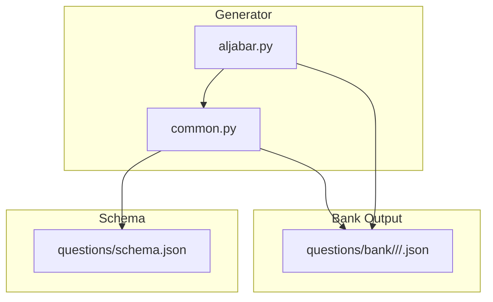
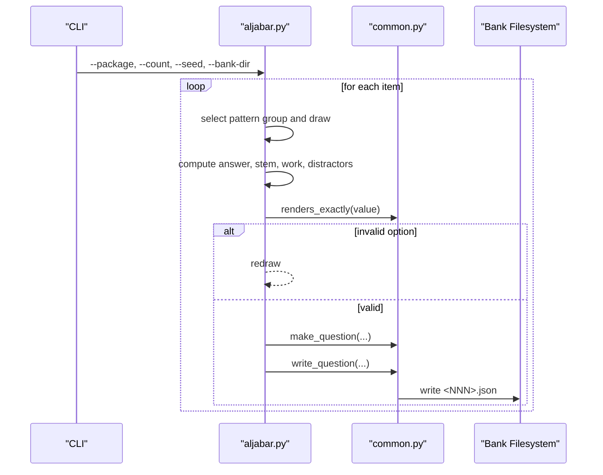
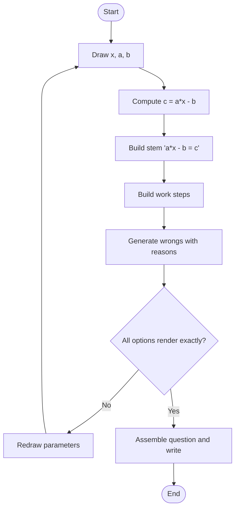
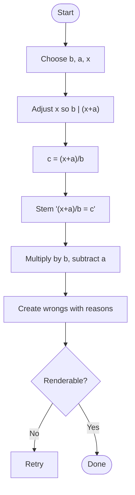
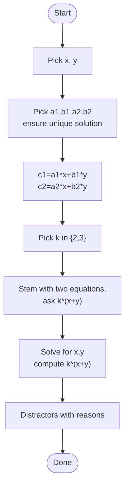
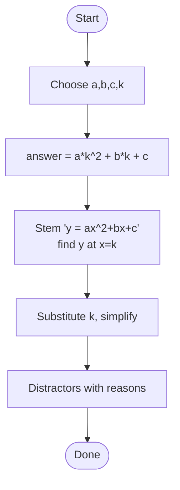
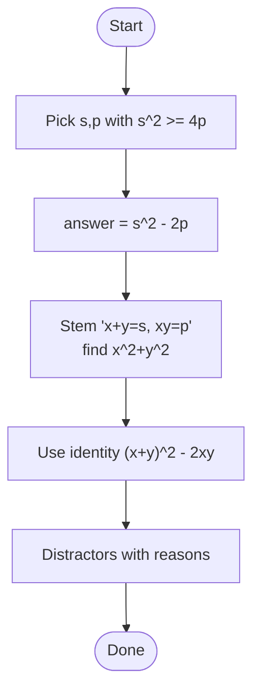
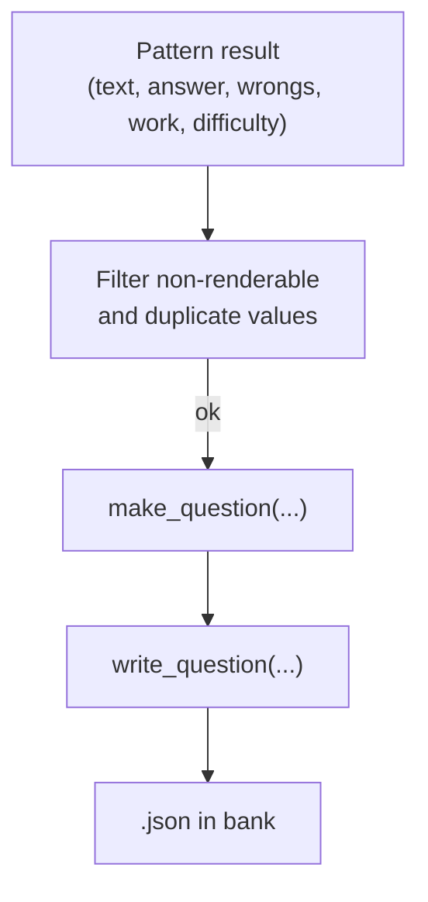
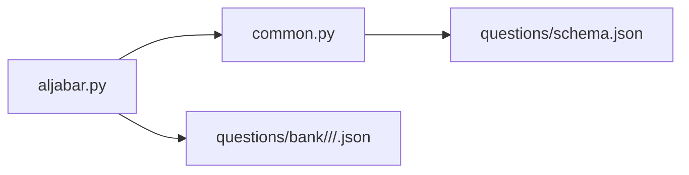

# Algebra Problem Generators

<cite>
**Referenced Files in This Document**
- [aljabar.py](file://questions/generator/aljabar.py)
- [common.py](file://questions/generator/common.py)
- [README.md](file://questions/generator/README.md)
- [COVERAGE.md](file://questions/generator/COVERAGE.md)
- [schema.json](file://questions/schema.json)
- [010.json](file://questions/bank/10/kuantitatif/010.json)
- [006.json](file://questions/bank/2/kuantitatif/006.json)
</cite>

## Table of Contents
1. Introduction
2. Project Structure
3. Core Components
4. Architecture Overview
5. Detailed Component Analysis
6. Dependency Analysis
7. Performance Considerations
8. Troubleshooting Guide
9. Conclusion

## Introduction
This document explains the algebra question generator that produces valid algebra problems with computed answer keys, step-by-step solution work, and pedagogically meaningful distractors. It covers linear equations (one variable), systems of two linear equations, quadratic evaluation at a point, and symmetric identities. The generator ensures that every option is renderable in Indonesian exam notation and that each wrong option is tied to a specific common mistake.

The system supports configuration via command-line arguments for reproducibility and output location, and it integrates with a shared question schema and bank layout used across all generators.

## Project Structure
At a high level:
- Generator scripts live under questions/generator.
- Generated questions are written into questions/bank/<package>/<subtest>/<NNN>.json.
- A JSON schema defines the canonical question structure.
- Shared utilities handle formatting, validation, numbering, and writing.

**Diagram sources**
- [aljabar.py:257-301](file://questions/generator/aljabar.py#L257-L301)
- [common.py:135-207](file://questions/generator/common.py#L135-L207)
- [schema.json:1-98](file://questions/schema.json#L1-L98)

**Section sources**
- [README.md:1-33](file://questions/generator/README.md#L1-L33)
- [aljabar.py:1-23](file://questions/generator/aljabar.py#L1-L23)

## Core Components
- Pattern generators: Each algebra pattern is implemented as a function that draws parameters deterministically, computes the correct answer, constructs the stem, builds step-by-step work, and proposes plausible wrong answers with explanations.
- Quality gates: Only items whose options render exactly in Indonesian notation (terminating decimals or integers) are accepted; otherwise the draw is retried.
- Packaging policy: Patterns are grouped by solving method and drawn without replacement per package to avoid duplicate methods within one set.
- Question assembly: A shared helper validates and serializes questions according to the schema and writes them to the bank.

Key responsibilities:
- aljabar.py: Implements four algebra patterns and orchestrates drawing, filtering, shuffling, and writing.
- common.py: Provides number formatting, rendering checks, next-number tracking, question construction, and schema enforcement.

**Section sources**
- [aljabar.py:79-252](file://questions/generator/aljabar.py#L79-L252)
- [common.py:99-127](file://questions/generator/common.py#L99-L127)
- [common.py:139-207](file://questions/generator/common.py#L139-L207)

## Architecture Overview
The generator follows a deterministic pipeline:
1. Parse CLI arguments (package, count, seed, bank-dir).
2. For each requested item:
   - Select a pattern from an unshuffled pool of method groups (without replacement).
   - Draw parameters and compute answer, stem, work, and candidate distractors.
   - Filter out non-renderable options and duplicates.
   - Shuffle options and assign keys A–E.
   - Build a question dict and write to the bank.

**Diagram sources**
- [aljabar.py:304-320](file://questions/generator/aljabar.py#L304-L320)
- [aljabar.py:257-301](file://questions/generator/aljabar.py#L257-L301)
- [common.py:139-207](file://questions/generator/common.py#L139-L207)

## Detailed Component Analysis

### Linear Equation (One Variable)
Algorithm:
- Choose integer x, coefficients a and b.
- Compute c = a·x − b so that isolating x yields an exact integer.
- Stem asks to solve a·x − b = c.
- Work shows moving −b to the right side and dividing by a.
- Distractors model common errors: forgetting sign change, dividing before moving terms, subtracting coefficient instead of dividing, stopping at a·x.

**Diagram sources**
- [aljabar.py:79-102](file://questions/generator/aljabar.py#L79-L102)
- [common.py:120-127](file://questions/generator/common.py#L120-L127)

**Section sources**
- [aljabar.py:79-102](file://questions/generator/aljabar.py#L79-L102)

### Fraction Equation (One Variable)
Algorithm:
- Choose denominator b, numerator offset a, and target x.
- Adjust x so that (x + a) is divisible by b, ensuring c = (x + a)/b is exact.
- Stem presents (x + a) ÷ b = c.
- Work multiplies both sides by b then subtracts a.
- Distractors include adding instead of subtracting a, subtracting before multiplying, dividing by b instead of multiplying, and reversing order.

**Diagram sources**
- [aljabar.py:105-127](file://questions/generator/aljabar.py#L105-L127)
- [common.py:120-127](file://questions/generator/common.py#L120-L127)

**Section sources**
- [aljabar.py:105-127](file://questions/generator/aljabar.py#L105-L127)

### System of Two Linear Equations (Linear Combination)
Algorithm:
- Pick integer solutions x, y.
- Randomly choose coefficients a1, b1, a2, b2 such that the system has a unique solution and avoids degenerate cases.
- Compute c1 = a1·x + b1·y and c2 = a2·x + b2·y.
- Ask for k·(x + y) where k ∈ {2, 3}.
- Work solves the system to find x and y, then evaluates k·(x + y).
- Distractors include computing difference instead of sum, omitting factor k, partial sums, and incorrect “add equations and divide by sum of coefficients” approach.

**Diagram sources**
- [aljabar.py:130-175](file://questions/generator/aljabar.py#L130-L175)

**Section sources**
- [aljabar.py:130-175](file://questions/generator/aljabar.py#L130-L175)

### Quadratic Evaluation
Algorithm:
- Choose coefficients a, b, c and evaluate point k.
- Stem gives y = a·x² + b·x + c and asks for y at x = k.
- Work substitutes k, respects signs, and simplifies.
- Distractors include squaring the whole term a·x, misreading x² as 2x, sign errors on b·x or c, and incorrectly treating negative squares.

**Diagram sources**
- [aljabar.py:178-212](file://questions/generator/aljabar.py#L178-L212)

**Section sources**
- [aljabar.py:178-212](file://questions/generator/aljabar.py#L178-L212)

### Symmetric Identity (Sum and Product)
Algorithm:
- Choose s = x + y and p = xy such that discriminant s² − 4p ≥ 0 (ensuring real roots).
- Compute answer = s² − 2p for x² + y².
- Stem provides s and p and asks for x² + y².
- Work applies identity x² + y² = (x + y)² − 2xy.
- Distractors include stopping at s², subtracting xy once, adding 2xy, or confusing with (x − y)².

**Diagram sources**
- [aljabar.py:215-242](file://questions/generator/aljabar.py#L215-L242)

**Section sources**
- [aljabar.py:215-242](file://questions/generator/aljabar.py#L215-L242)

### Question Assembly and Writing
- Options must be exactly A–E, with explanations for each.
- Numbers are formatted using Indonesian conventions (comma decimal separator, dot thousands separator, typographic minus).
- Non-renderable values (e.g., repeating decimals) are rejected to keep options readable.
- Questions are validated against the schema and written atomically to the bank directory.

**Diagram sources**
- [aljabar.py:257-301](file://questions/generator/aljabar.py#L257-L301)
- [common.py:99-127](file://questions/generator/common.py#L99-L127)
- [common.py:167-207](file://questions/generator/common.py#L167-L207)

**Section sources**
- [aljabar.py:257-301](file://questions/generator/aljabar.py#L257-L301)
- [common.py:99-127](file://questions/generator/common.py#L99-L127)
- [common.py:167-207](file://questions/generator/common.py#L167-L207)

## Dependency Analysis
- aljabar.py depends on common.py for:
  - Number formatting and rendering checks
  - Next free question number computation
  - Question dict creation and file writing
  - Subtest/type constraints
- The generated JSON files conform to questions/schema.json.

**Diagram sources**
- [aljabar.py:27-40](file://questions/generator/aljabar.py#L27-L40)
- [common.py:13-16](file://questions/generator/common.py#L13-L16)
- [schema.json:1-98](file://questions/schema.json#L1-L98)

**Section sources**
- [aljabar.py:27-40](file://questions/generator/aljabar.py#L27-L40)
- [common.py:13-16](file://questions/generator/common.py#L13-L16)
- [schema.json:1-98](file://questions/schema.json#L1-L98)

## Performance Considerations
- Deterministic draws with a fixed seed ensure reproducible generation and fast debugging.
- Early rejection of non-renderable options prevents wasted effort downstream.
- Pattern grouping without replacement reduces redundancy across a single package.
- Using exact arithmetic (fractions) avoids floating-point drift and keeps computations precise.

[No sources needed since this section provides general guidance]

## Troubleshooting Guide
Common issues and resolutions:
- Repeating decimals in options: The generator rejects such values; if you see repeated retries, adjust ranges or denominators to ensure terminating decimals.
- Duplicate options: The generator deduplicates values; if fewer than four clean distractors remain, the draw is retried.
- Schema violations: Ensure options are exactly A–E, explanations cover all options, and type/subtest combinations are allowed.
- Overwriting existing files: The writer refuses to overwrite; regenerate with a different seed or bank directory.

Operational tips:
- Use --seed to reproduce a specific package.
- Use --bank-dir to generate into a scratch directory for review before publishing.
- Validate the entire bank after generation using the provided validator script referenced in the generator README.

**Section sources**
- [README.md:24-33](file://questions/generator/README.md#L24-L33)
- [common.py:154-163](file://questions/generator/common.py#L154-L163)
- [common.py:167-207](file://questions/generator/common.py#L167-L207)

## Conclusion
The algebra generator produces high-quality, computationally verified algebra problems with clear solution steps and targeted distractors. Its design emphasizes readability, correctness, and consistency with the official test’s style and schema. By controlling complexity through parameter ranges and enforcing rendering rules, it reliably generates linear equations, systems of equations, quadratic evaluations, and symmetric identities suitable for quantitative reasoning assessments.

[No sources needed since this section summarizes without analyzing specific files]

## Appendices

### Configuration Options
- Command-line arguments:
  - --package: Target package number.
  - --count: Number of items to generate.
  - --seed: Seed for deterministic generation.
  - --bank-dir: Destination directory for generated questions.
- Difficulty control:
  - Each pattern returns a difficulty label ("easy", "medium", "hard") based on its complexity.
- Variable types and ranges:
  - Parameters (coefficients, constants, points) are drawn from bounded integer ranges to keep stems readable and answers exact.

**Section sources**
- [aljabar.py:304-320](file://questions/generator/aljabar.py#L304-L320)
- [aljabar.py:79-242](file://questions/generator/aljabar.py#L79-L242)

### Example Outputs
- Linear equation example:
  - See [010.json](file://questions/bank/10/kuantitatif/010.json) for a generated linear equation item.
- Symmetric identity example:
  - See [006.json](file://questions/bank/2/kuantitatif/006.json) for a generated identity-based item.

**Section sources**
- [010.json:1-44](file://questions/bank/10/kuantitatif/010.json#L1-L44)
- [006.json:1-44](file://questions/bank/2/kuantitatif/006.json#L1-L44)