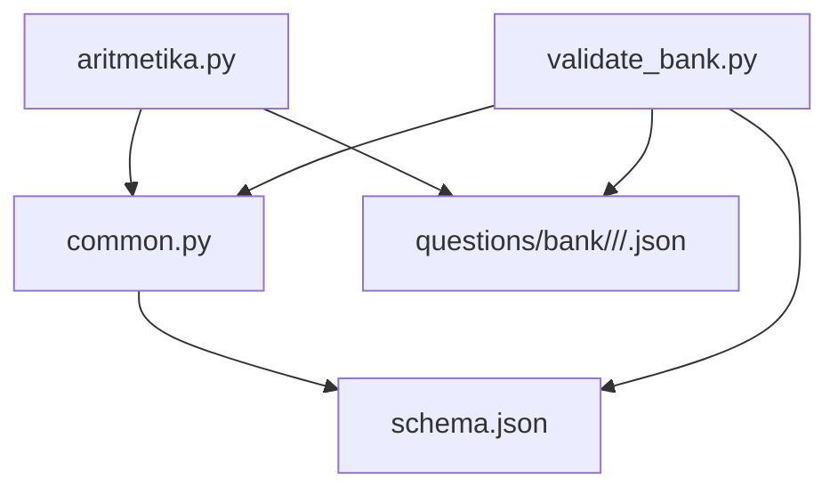
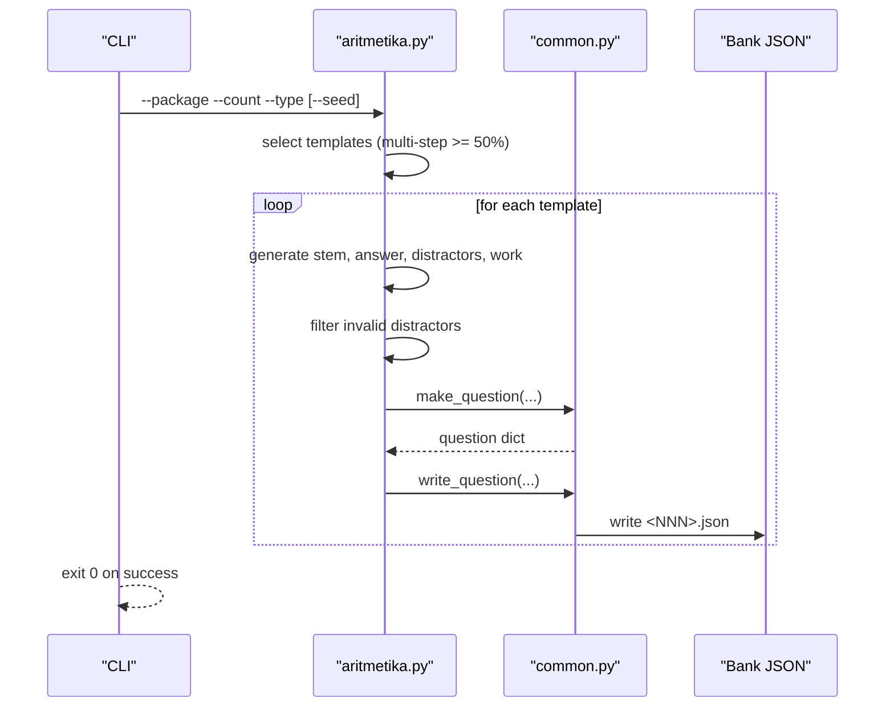
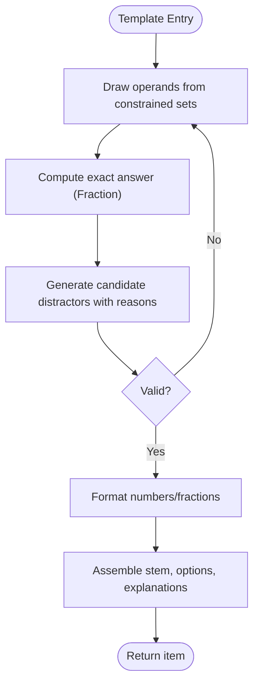
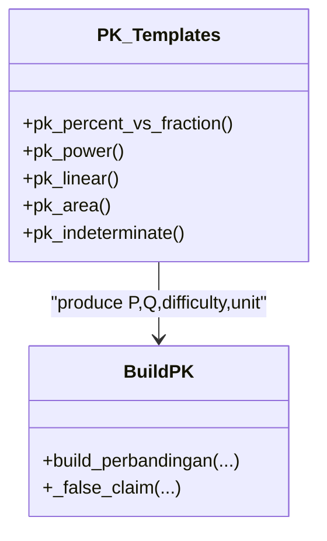
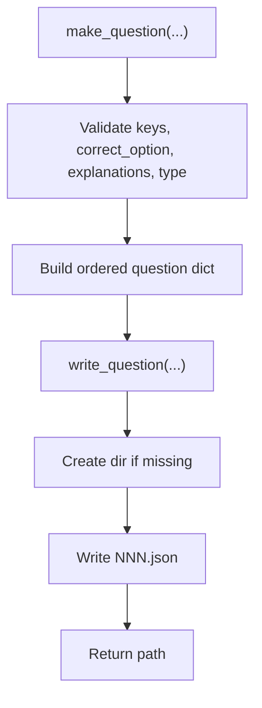
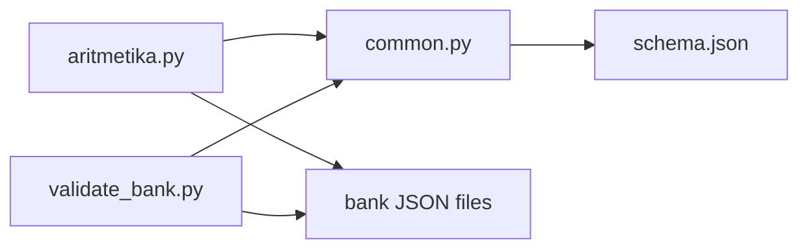

# Arithmetic Question Generators

<cite>
**Referenced Files in This Document**
- [aritmetika.py](file://questions/generator/aritmetika.py)
- [common.py](file://questions/generator/common.py)
- [schema.json](file://questions/schema.json)
- [README.md](file://questions/generator/README.md)
- [validate_bank.py](file://questions/generator/validate_bank.py)
- [001.json](file://questions/bank/1/kuantitatif/001.json)
- [002.json](file://questions/bank/1/kuantitatif/002.json)
</cite>

## Table of Contents
1. [Introduction](#introduction)
2. [Project Structure](#project-structure)
3. [Core Components](#core-components)
4. [Architecture Overview](#architecture-overview)
5. [Detailed Component Analysis](#detailed-component-analysis)
6. [Dependency Analysis](#dependency-analysis)
7. [Performance Considerations](#performance-considerations)
8. [Troubleshooting Guide](#troubleshooting-guide)
9. [Conclusion](#conclusion)
10. [Appendices](#appendices)

## Introduction
This document explains the arithmetic question generator that produces mathematically accurate problems for quantitative reasoning assessments. It covers how valid questions are generated deterministically, how answer keys are computed rather than guessed, and how difficulty levels, number ranges, operation types, and formatting options are controlled. It also documents validation and quality assurance measures to ensure pedagogical effectiveness and mathematical correctness.

## Project Structure
The generator lives under questions/generator and writes questions into questions/bank as JSON files conforming to a strict schema. The core logic is split between:
- aritmetika.py: deterministic generators for arithmetic and quantitative comparison items
- common.py: shared helpers for formatting, question assembly, blueprint constraints, and file I/O
- schema.json: JSON Schema enforcing the structure of each question
- validate_bank.py: bank-wide validation against schema and blueprint rules
- README.md: usage notes and tooling overview

**Diagram sources**
- [aritmetika.py:1-836](file://questions/generator/aritmetika.py#L1-L836)
- [common.py:1-218](file://questions/generator/common.py#L1-L218)
- [schema.json:1-98](file://questions/schema.json#L1-L98)
- [validate_bank.py:1-208](file://questions/generator/validate_bank.py#L1-L208)

**Section sources**
- [README.md:1-33](file://questions/generator/README.md#L1-L33)
- [common.py:1-218](file://questions/generator/common.py#L1-L218)
- [schema.json:1-98](file://questions/schema.json#L1-L98)

## Core Components
- Deterministic templates per arithmetic topic (percentages, fractions, rates, averages, ratios, powers/roots, mixed operations, order-of-operations with fractions).
- Each template returns:
  - Stem text
  - Exact answer (as Fraction)
  - Distractors with reasons (value, explanation)
  - Worked steps
  - Difficulty label
  - Formatter function for display
- Build pipeline:
  - Selects templates ensuring at least half are multi-step
  - Generates distractors, filters invalid ones (non-terminating decimals, too large magnitude, duplicates)
  - Shuffles options, assigns correct key
  - Assembles question dict via make_question and writes to disk

Key behaviors:
- Answers are exact using Fraction; formatting falls back to fraction notation when decimals would be repeating
- Indonesian number formatting uses comma as decimal separator and dot as thousands separator
- Every wrong option has a specific “Salah.” explanation naming the mistake

**Section sources**
- [aritmetika.py:64-560](file://questions/generator/aritmetika.py#L64-L560)
- [common.py:99-128](file://questions/generator/common.py#L99-L128)
- [common.py:167-207](file://questions/generator/common.py#L167-L207)

## Architecture Overview
The system follows a template-driven architecture where each arithmetic concept is implemented as a small function returning all necessary metadata. A build function orchestrates selection, filtering, and output. Validation ensures schema compliance and blueprint adherence.

**Diagram sources**
- [aritmetika.py:493-560](file://questions/generator/aritmetika.py#L493-L560)
- [common.py:167-207](file://questions/generator/common.py#L167-L207)

## Detailed Component Analysis

### Arithmetic Templates
Each template targets a specific skill and constructs plausible distractors tied to common mistakes. Examples include:
- Percentages and chained percentages
- Rates and proportions
- Fractions and order-of-operations
- Mixed operations
- Average updates and weighted means
- Ratios and power/root combinations
- Decimal chains and reverse discounts

Design principles:
- Operands chosen so results print cleanly in Indonesian notation or remain as exact fractions
- Distractors stay within a reasonable magnitude band to avoid being dismissed by size alone
- Explanations explicitly name the error leading to each wrong option

**Diagram sources**
- [aritmetika.py:68-468](file://questions/generator/aritmetika.py#L68-L468)

**Section sources**
- [aritmetika.py:68-468](file://questions/generator/aritmetika.py#L68-L468)

### Quantitative Comparison Templates
These compare two quantities P and Q and ask which relation holds. Some cases are indeterminate, making D the correct answer and requiring witness values to justify it. A fifth option E presents a substantive claim that must be computed to reject.

**Diagram sources**
- [aritmetika.py:571-789](file://questions/generator/aritmetika.py#L571-L789)

**Section sources**
- [aritmetika.py:571-789](file://questions/generator/aritmetika.py#L571-L789)

### Question Assembly and Output
- make_question enforces:
  - Exactly five options keyed A..E
  - Correct option among A..E
  - Explanations for all options
  - Allowed type per subtest
- write_question:
  - Creates package/subtest directory if needed
  - Writes numbered JSON file
  - Refuses to overwrite existing files

**Diagram sources**
- [common.py:167-207](file://questions/generator/common.py#L167-L207)
- [common.py:154-164](file://questions/generator/common.py#L154-L164)

**Section sources**
- [common.py:154-207](file://questions/generator/common.py#L154-L207)

### Example Questions
Sample outputs illustrate the format and content produced by the generator:
- An average update problem with detailed explanations for each option
- A rate/proportion problem with step-by-step working shown in explanations

**Section sources**
- [001.json:1-44](file://questions/bank/1/kuantitatif/001.json#L1-L44)
- [002.json:1-44](file://questions/bank/1/kuantitatif/002.json#L1-L44)

## Dependency Analysis
- aritmetika.py depends on common.py for:
  - Number formatting and rendering rules
  - Question construction and writing
  - Blueprint and allowed types
- validate_bank.py depends on common.py and schema.json to enforce:
  - Schema compliance
  - Path-to-ID consistency
  - Option/explanation integrity
  - Blueprint counts and difficulty labeling
- Generated JSON files must satisfy schema.json constraints

**Diagram sources**
- [aritmetika.py:1-836](file://questions/generator/aritmetika.py#L1-L836)
- [common.py:1-218](file://questions/generator/common.py#L1-L218)
- [schema.json:1-98](file://questions/schema.json#L1-L98)
- [validate_bank.py:1-208](file://questions/generator/validate_bank.py#L1-L208)

**Section sources**
- [common.py:1-218](file://questions/generator/common.py#L1-L218)
- [validate_bank.py:1-208](file://questions/generator/validate_bank.py#L1-L208)
- [schema.json:1-98](file://questions/schema.json#L1-L98)

## Performance Considerations
- Deterministic generation with bounded retries:
  - Each template attempts up to 200 draws before failing, preventing infinite loops while allowing rejections due to formatting or magnitude constraints
- Fraction-based arithmetic avoids floating-point drift and ensures exact answers
- Filtering keeps distractors within a scale limit relative to the answer to maintain plausibility
- Template pools ensure a mix of single-step and multi-step items to balance cognitive load

[No sources needed since this section provides general guidance]

## Troubleshooting Guide
Common issues and resolutions:
- Duplicate or overwriting question files:
  - write_question refuses to overwrite existing files; choose next available number
- Invalid JSON or schema violations:
  - Use validate_bank.py to detect errors early; fix fields like id, options, explanations, and type constraints
- Incorrect type/subtest mapping:
  - Ensure qtype is allowed for the subtest per TYPES_BY_SUBTEST
- Missing passage/image for stimulus-based types:
  - validate_bank.py flags these; add required passage or image
- Package difficulty mismatch:
  - validate_bank.py checks manifest difficulty against calculated difficulty based on per-question difficulties

Operational tips:
- Run validate_bank.py after generation to catch issues before review/publish
- Use --strict mode to enforce complete packages matching blueprint counts
- For reproducible runs, pass --seed to any generator

**Section sources**
- [common.py:154-164](file://questions/generator/common.py#L154-L164)
- [validate_bank.py:44-194](file://questions/generator/validate_bank.py#L44-L194)
- [README.md:24-31](file://questions/generator/README.md#L24-L31)

## Conclusion
The arithmetic question generator provides a robust, deterministic pipeline for producing high-quality quantitative reasoning items. By computing answers exactly, crafting meaningful distractors with explicit explanations, and enforcing schema and blueprint constraints, it ensures both mathematical accuracy and educational value. Validation tools and clear configuration options support consistent, scalable question production across packages.

[No sources needed since this section summarizes without analyzing specific files]

## Appendices

### Parameter Configuration Summary
- Generator invocation:
  - --package: target package ID
  - --count: number of questions to generate
  - --type: aritmetika or perbandingan_kuantitatif
  - --template: opt-in explicit templates excluded from legacy default pools
  - --seed: reproducibility seed
  - --bank-dir: alternate output directory
- Formatting and difficulty:
  - fmt_number controls Indonesian number formatting and fallback to fraction notation
  - Difficulty labels are assigned per template and aggregated to compute package-level difficulty
- Schema constraints:
  - Options must be exactly A..E with explanations for all
  - Type must be allowed for the subtest
  - Images and passages must match type requirements

**Section sources**
- [aritmetika.py:792-800](file://questions/generator/aritmetika.py#L792-L800)
- [common.py:99-128](file://questions/generator/common.py#L99-L128)
- [common.py:167-207](file://questions/generator/common.py#L167-L207)
- [schema.json:1-98](file://questions/schema.json#L1-L98)