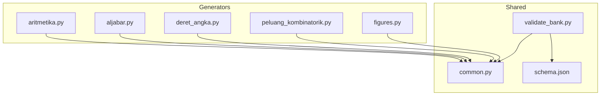
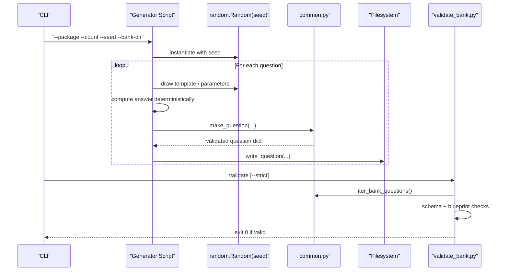
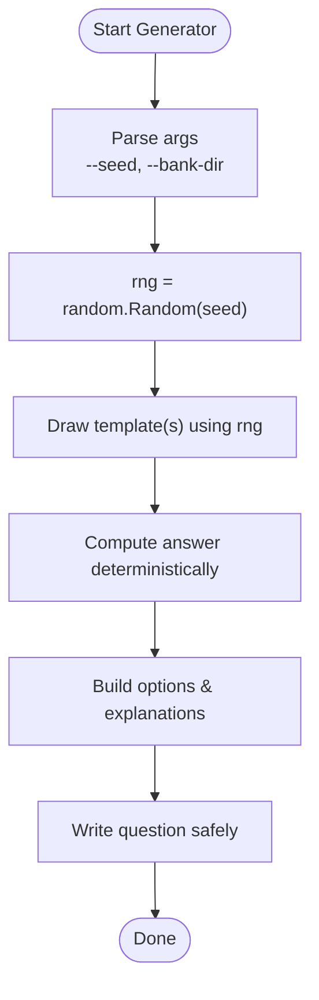
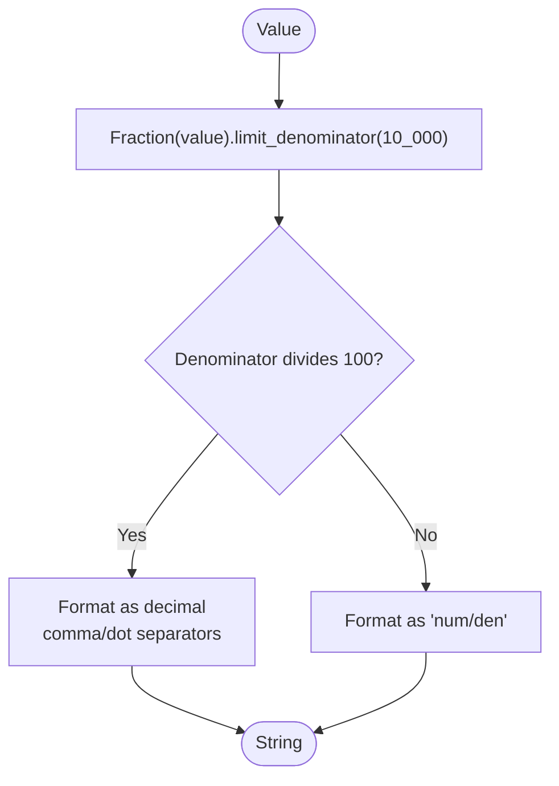
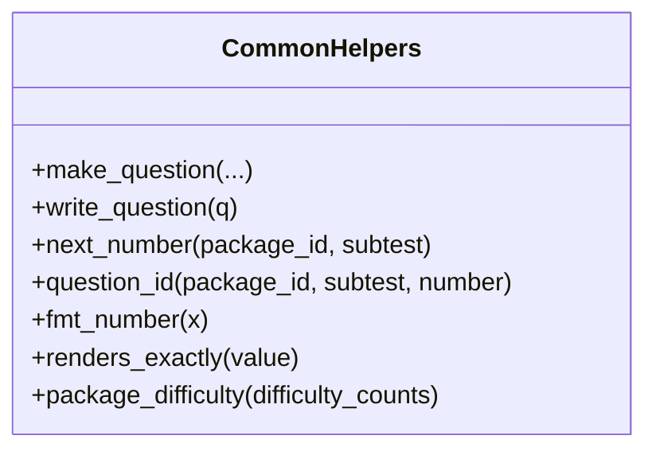
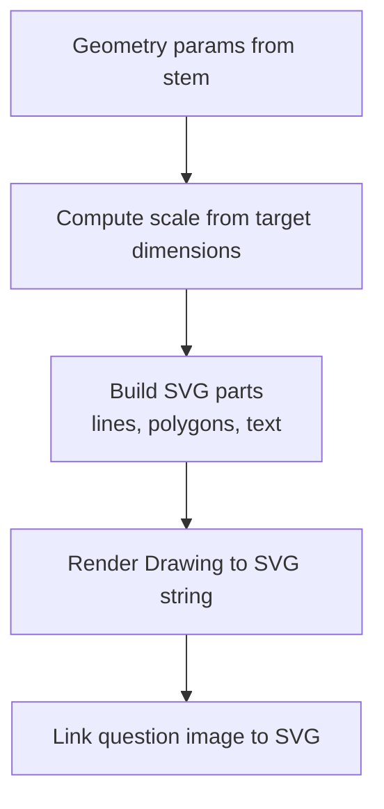
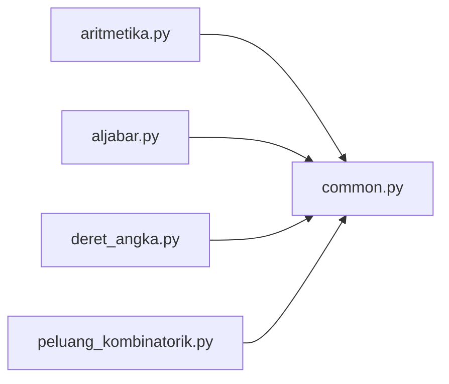
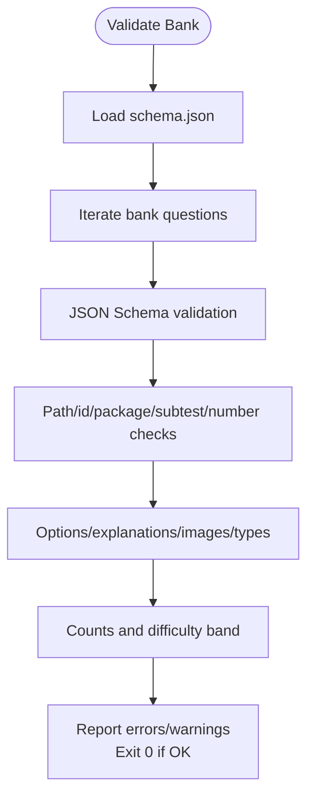
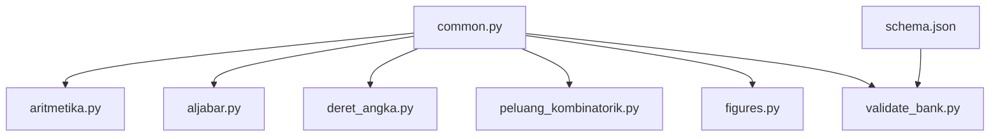

# Common Utilities and Shared Functions

<cite>
**Referenced Files in This Document**
- [common.py](file://questions/generator/common.py)
- [figures.py](file://questions/generator/figures.py)
- [aritmetika.py](file://questions/generator/aritmetika.py)
- [aljabar.py](file://questions/generator/aljabar.py)
- [deret_angka.py](file://questions/generator/deret_angka.py)
- [peluang_kombinatorik.py](file://questions/generator/peluang_kombinatorik.py)
- [validate_bank.py](file://questions/generator/validate_bank.py)
- [schema.json](file://questions/schema.json)
- [README.md](file://questions/generator/README.md)
- [requirements.txt](file://questions/generator/requirements.txt)
</cite>

## Table of Contents
1. Introduction
2. Project Structure
3. Core Components
4. Architecture Overview
5. Detailed Component Analysis
6. Dependency Analysis
7. Performance Considerations
8. Troubleshooting Guide
9. Conclusion

## Introduction
This document explains the shared utilities and common functions that power all question generators in the project. It focuses on:
- Deterministic output via seed-based randomness
- Core mathematical helpers for formatting, fractions, and validation
- Reusable components for building questions consistently across types
- Configuration and constraints enforced by schema and validators
- Error handling patterns and testing utilities that keep the generation pipeline reliable

The goal is to make the system understandable for both developers extending generators and reviewers validating outputs.

## Project Structure
At a high level, the generator suite is organized around:
- A shared utility module providing configuration, number formatting, question assembly, and file I/O helpers
- Type-specific generators implementing deterministic math and distractor construction
- A figure generator producing deterministic SVGs for geometry items
- A validator enforcing schema, blueprint, and consistency rules
- A JSON schema defining the canonical question structure

**Diagram sources**
- [common.py:1-218](file://questions/generator/common.py#L1-L218)
- [figures.py:1-800](file://questions/generator/figures.py#L1-L800)
- [aritmetika.py:1-200](file://questions/generator/aritmetika.py#L1-L200)
- [aljabar.py:1-200](file://questions/generator/aljabar.py#L1-L200)
- [deret_angka.py:1-200](file://questions/generator/deret_angka.py#L1-L200)
- [peluang_kombinatorik.py:1-200](file://questions/generator/peluang_kombinatorik.py#L1-L200)
- [validate_bank.py:1-200](file://questions/generator/validate_bank.py#L1-L200)
- [schema.json:1-98](file://questions/schema.json#L1-L98)

**Section sources**
- [README.md:1-33](file://questions/generator/README.md#L1-L33)

## Core Components
- Deterministic random management: Each generator accepts a seed and constructs an isolated random instance to ensure reproducible sequences.
- Number formatting and fraction handling: Consistent Indonesian-style rendering with exact fractions when decimals are not terminating.
- Question assembly and validation: Centralized creation of question objects with strict option ordering, explanation coverage, and type/subtest checks.
- Filesystem helpers: Canonical paths, next-number computation, safe write semantics (no overwrite), and bank iteration.
- Figure generation: Deterministic SVG builders for geometry figures, with measured and schematic variants.
- Validation and schema enforcement: JSON Schema validation plus blueprint and path consistency checks.

**Section sources**
- [common.py:77-218](file://questions/generator/common.py#L77-L218)
- [figures.py:71-166](file://questions/generator/figures.py#L71-L166)
- [validate_bank.py:44-194](file://questions/generator/validate_bank.py#L44-L194)
- [schema.json:1-98](file://questions/schema.json#L1-L98)

## Architecture Overview
The generation pipeline follows a consistent pattern:
- Parse arguments including --seed and --bank-dir
- Create a seeded random.Random instance
- Select or draw templates without replacement
- Compute answers deterministically from constructed parameters
- Build options and explanations as (value, reason) pairs
- Assemble a question dict using shared helpers
- Write to disk safely; figures link to generated SVGs
- Validate the entire bank against schema and blueprint

**Diagram sources**
- [aritmetika.py:1-200](file://questions/generator/aritmetika.py#L1-L200)
- [aljabar.py:1-200](file://questions/generator/aljabar.py#L1-L200)
- [deret_angka.py:1-200](file://questions/generator/deret_angka.py#L1-L200)
- [peluang_kombinatorik.py:1-200](file://questions/generator/peluang_kombinatorik.py#L1-L200)
- [common.py:135-218](file://questions/generator/common.py#L135-L218)
- [validate_bank.py:44-194](file://questions/generator/validate_bank.py#L44-L194)

## Detailed Component Analysis

### Seed-Based Randomness and Determinism
- Every generator uses a local random.Random instance seeded by the user-provided value. This isolates randomness per run and makes outputs fully reproducible.
- Generators pass this rng into pattern functions so every choice is deterministic.
- The README documents that all generators accept --seed and refuse to overwrite existing files, ensuring repeatable builds.

**Diagram sources**
- [aritmetika.py:1-200](file://questions/generator/aritmetika.py#L1-L200)
- [aljabar.py:1-200](file://questions/generator/aljabar.py#L1-L200)
- [deret_angka.py:1-200](file://questions/generator/deret_angka.py#L1-L200)
- [peluang_kombinatorik.py:1-200](file://questions/generator/peluang_kombinatorik.py#L1-L200)
- [README.md:24-25](file://questions/generator/README.md#L24-L25)

**Section sources**
- [README.md:24-25](file://questions/generator/README.md#L24-L25)

### Mathematical Helpers and Number Formatting
- fmt_number formats numbers in Indonesian style: comma decimal separator, dot thousands separator, typographic minus, and exact fraction notation when decimals do not terminate cleanly.
- renders_exactly checks whether a value can be represented as a whole or terminating decimal, used to filter options that would otherwise print as repeating decimals.
- package_difficulty computes deterministic difficulty bands using integer cross-multiplication to avoid floating-point boundary issues.

**Diagram sources**
- [common.py:99-128](file://questions/generator/common.py#L99-L128)

**Section sources**
- [common.py:77-128](file://questions/generator/common.py#L77-L128)

### Question Assembly and Validation Helpers
- make_question enforces:
  - Option keys exactly A..E in order
  - correct_option among A..E
  - explanations covering exactly A..E
  - qtype allowed for the given subtest
- write_question ensures no overwrites and writes canonical JSON with UTF-8 encoding and trailing newline.
- next_number computes the next free question number per subtest directory.
- question_id produces stable IDs derived from package, subtest, and number.

**Diagram sources**
- [common.py:135-218](file://questions/generator/common.py#L135-L218)

**Section sources**
- [common.py:135-218](file://questions/generator/common.py#L135-L218)

### Figures and Geometry Utilities
- figures.py provides deterministic SVG generation for geometry items.
- Measured figures scale to stem values and label only what the stem states; derived quantities are computed but never printed as labels to avoid giving away answers.
- Schematic figures for data-sufficiency families carry no numeric values and include a “not drawn to scale” note.
- Rendering uses fixed constants and consistent styling to ensure byte-for-byte reproducibility.

**Diagram sources**
- [figures.py:71-166](file://questions/generator/figures.py#L71-L166)
- [figures.py:170-800](file://questions/generator/figures.py#L170-L800)

**Section sources**
- [figures.py:1-800](file://questions/generator/figures.py#L1-L800)

### Type-Specific Generators: Math and Reasoning
- aritmetika.py: Percentages, chained percentages, rates/proportions, fraction operations, order-of-operations, averages, ratios, powers/roots, and more. Distractors are tied to specific mistakes with reasons.
- aljabar.py: Linear equations, fraction equations, two-variable systems, quadratic substitution, symmetric identities. Answers are computed from constructed solutions.
- deret_angka.py: Number sequences with rigorous rival-rule screening to ensure unambiguous continuations; supports interior blanks, leading blanks, and multi-blank layouts.
- peluang_kombinatorik.py: Probability and counting problems keyed by combinatorics functions; probabilities rendered as reduced fractions.

**Diagram sources**
- [aritmetika.py:1-200](file://questions/generator/aritmetika.py#L1-L200)
- [aljabar.py:1-200](file://questions/generator/aljabar.py#L1-L200)
- [deret_angka.py:1-200](file://questions/generator/deret_angka.py#L1-L200)
- [peluang_kombinatorik.py:1-200](file://questions/generator/peluang_kombinatorik.py#L1-L200)
- [common.py:135-218](file://questions/generator/common.py#L135-L218)

**Section sources**
- [aritmetika.py:1-200](file://questions/generator/aritmetika.py#L1-L200)
- [aljabar.py:1-200](file://questions/generator/aljabar.py#L1-L200)
- [deret_angka.py:1-200](file://questions/generator/deret_angka.py#L1-L200)
- [peluang_kombinatorik.py:1-200](file://questions/generator/peluang_kombinatorik.py#L1-L200)

### Validation and Schema Enforcement
- validate_bank.py validates:
  - JSON parseability and schema conformance
  - id/package/subtest/number consistency with file paths
  - option keys A..E and correct_option presence
  - explanation coverage for all options
  - image references exist
  - unique numbering without gaps
  - stimulus requirements per type (passage or chart)
  - blueprint counts in strict mode
  - package difficulty matches calculated band
- Uses jsonschema Draft202012Validator and shared constants from common.py.

**Diagram sources**
- [validate_bank.py:44-194](file://questions/generator/validate_bank.py#L44-L194)
- [schema.json:1-98](file://questions/schema.json#L1-L98)
- [common.py:17-74](file://questions/generator/common.py#L17-L74)

**Section sources**
- [validate_bank.py:1-200](file://questions/generator/validate_bank.py#L1-L200)
- [schema.json:1-98](file://questions/schema.json#L1-L98)
- [common.py:17-74](file://questions/generator/common.py#L17-L74)

### Configuration Options
- All generators accept:
  - --seed for deterministic runs
  - --bank-dir to write to a scratch directory instead of the default bank
- The README documents these flags and the non-overwrite policy.
- External dependencies are minimal: jsonschema and requests.

**Section sources**
- [README.md:24-25](file://questions/generator/README.md#L24-L25)
- [requirements.txt:1-3](file://questions/generator/requirements.txt#L1-L3)

## Dependency Analysis
- Generators depend on common.py for shared helpers and constants.
- validate_bank.py depends on common.py and schema.json for validation rules.
- figures.py depends on common.py for iterating and linking images.
- Type-specific generators encapsulate domain logic while reusing common utilities for formatting, validation, and I/O.

**Diagram sources**
- [common.py:1-218](file://questions/generator/common.py#L1-L218)
- [validate_bank.py:1-200](file://questions/generator/validate_bank.py#L1-L200)
- [schema.json:1-98](file://questions/schema.json#L1-L98)
- [figures.py:1-800](file://questions/generator/figures.py#L1-L800)

**Section sources**
- [common.py:1-218](file://questions/generator/common.py#L1-L218)
- [validate_bank.py:1-200](file://questions/generator/validate_bank.py#L1-L200)
- [schema.json:1-98](file://questions/schema.json#L1-L98)

## Performance Considerations
- Deterministic computations use Fraction for exact arithmetic where needed, avoiding floating-point drift and ensuring stable formatting.
- Number formatting limits denominators to prevent excessive precision artifacts while preserving readability.
- Rival-rule screening in sequence generators prevents ambiguous stems early, reducing retries and ensuring quality at generation time.
- SVG generation uses fixed scaling and layout constants to minimize variability and keep outputs compact and consistent.

[No sources needed since this section provides general guidance]

## Troubleshooting Guide
Common issues and how the system handles them:
- Overwrite protection: write_question raises an error if a file already exists to prevent accidental overwrites.
- Invalid JSON: iter_bank_questions yields parse errors with context for quick remediation.
- Schema violations: validate_bank.py reports precise locations and messages from jsonschema.
- Blueprint mismatches: strict mode flags missing or extra questions per subtest and verifies difficulty bands.
- Image references: validation checks that referenced images exist under the package’s images directory.
- Stimulus requirements: types requiring passage or chart are enforced; self-contained types must not carry extraneous passages.

**Section sources**
- [common.py:154-164](file://questions/generator/common.py#L154-L164)
- [common.py:210-218](file://questions/generator/common.py#L210-L218)
- [validate_bank.py:96-194](file://questions/generator/validate_bank.py#L96-L194)

## Conclusion
The shared utilities provide a robust foundation for deterministic, high-quality question generation:
- Seed-based randomness guarantees reproducibility across runs and environments.
- Centralized formatting and validation ensure consistent output and compliance with exam standards.
- Strict schema and blueprint enforcement catch errors early and maintain integrity across the bank.
- Reusable components reduce duplication and enable focused development of new question types.

Adhering to these patterns ensures that the entire generation pipeline remains predictable, auditable, and scalable.