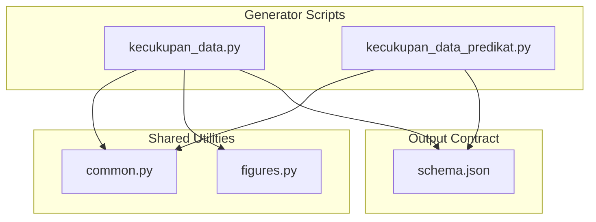
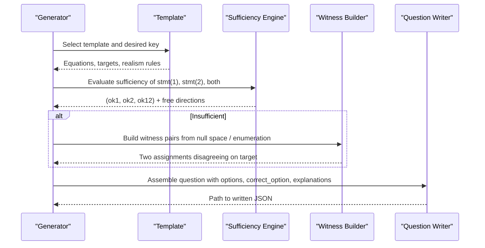
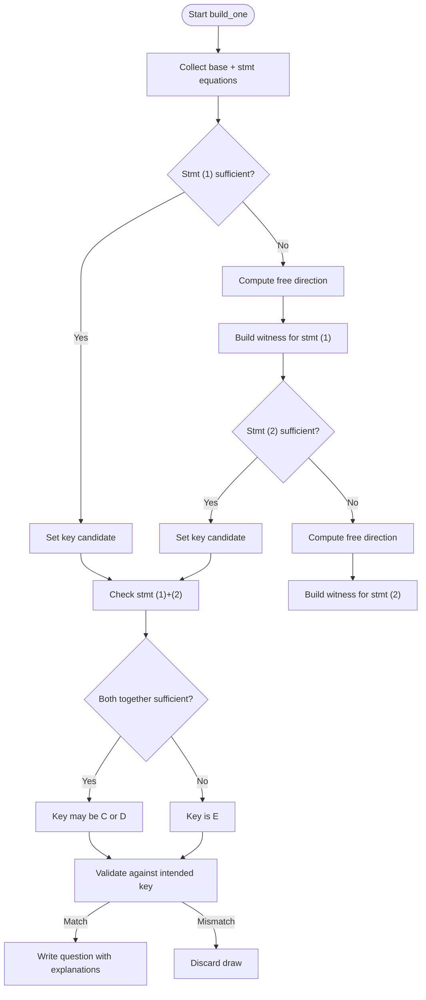
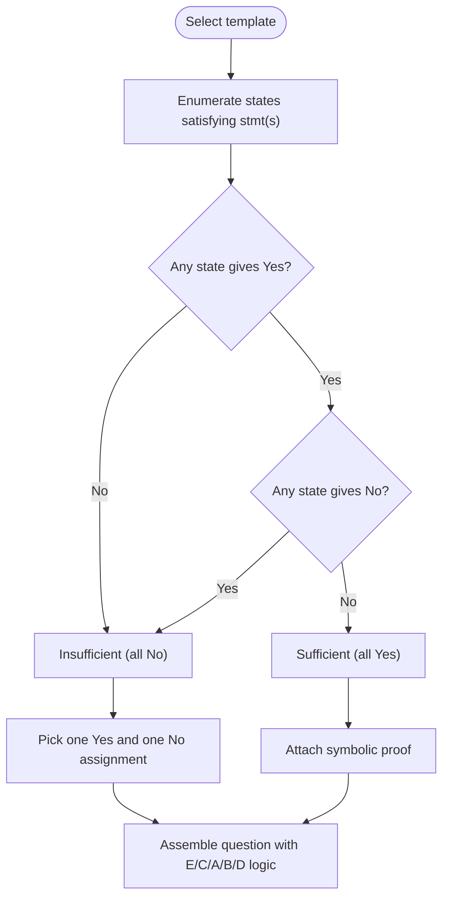
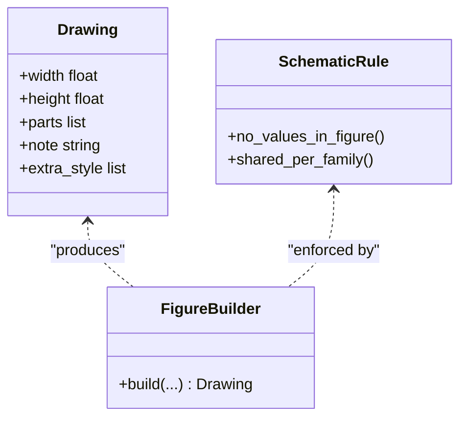
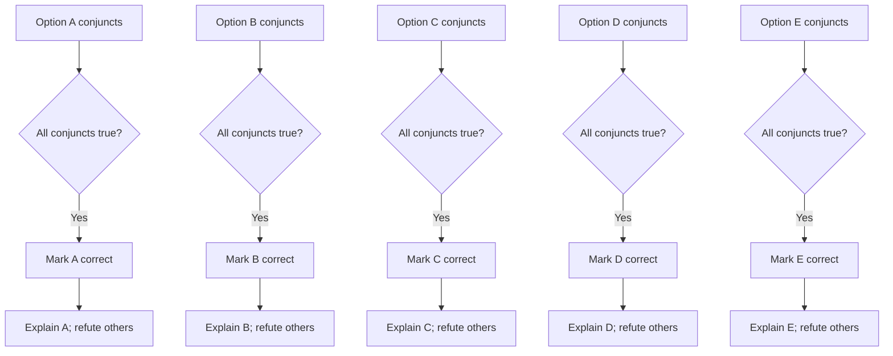
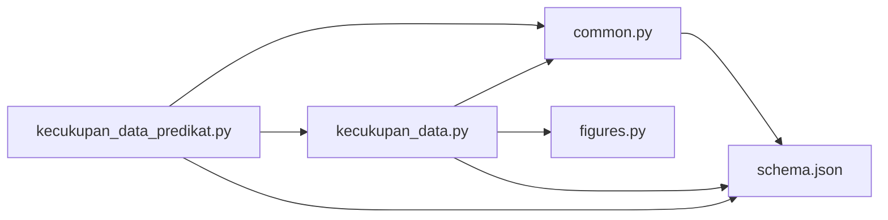

# Data Sufficiency Question Generators

<cite>
**Referenced Files in This Document**
- [kecukupan_data.py](file://questions/generator/kecukupan_data.py)
- [kecukupan_data_predikat.py](file://questions/generator/kecukupan_data_predikat.py)
- [common.py](file://questions/generator/common.py)
- [figures.py](file://questions/generator/figures.py)
- [README.md](file://questions/generator/README.md)
- [schema.json](file://questions/schema.json)
</cite>

## Table of Contents
1. [Introduction](#introduction)
2. [Project Structure](#project-structure)
3. [Core Components](#core-components)
4. [Architecture Overview](#architecture-overview)
5. [Detailed Component Analysis](#detailed-component-analysis)
6. [Dependency Analysis](#dependency-analysis)
7. [Performance Considerations](#performance-considerations)
8. [Troubleshooting Guide](#troubleshooting-guide)
9. [Conclusion](#conclusion)

## Introduction
This document explains the data sufficiency question generators that produce problems where test-takers must decide whether given information is sufficient to answer a question. It covers:
- The algorithmic approach for generating valid scenarios with logical consistency between statements and conclusions
- The predicate-based generation system for yes/no inequality questions
- The validation process ensuring each generated item has exactly one correct option among the standard five choices
- How witnesses (counterexamples) are produced to justify “not sufficient” claims
- How geometry items use schematic figures to avoid giving away answers by measurement

## Project Structure
The data sufficiency generators live under the question generator package and rely on shared utilities and a schema for output.

**Diagram sources**
- [kecukupan_data.py:1-35](file://questions/generator/kecukupan_data.py#L1-L35)
- [kecukupan_data_predikat.py:1-20](file://questions/generator/kecukupan_data_predikat.py#L1-L20)
- [common.py:1-25](file://questions/generator/common.py#L1-L25)
- [figures.py:1-30](file://questions/generator/figures.py#L1-L30)
- [schema.json:1-22](file://questions/schema.json#L1-L22)

**Section sources**
- [README.md:1-22](file://questions/generator/README.md#L1-L22)
- [common.py:13-24](file://questions/generator/common.py#L13-L24)
- [schema.json:1-22](file://questions/schema.json#L1-L22)

## Core Components
- Deterministic linear-algebra engine for numeric data sufficiency items, using exact arithmetic to determine sufficiency and construct counterexamples
- Predicate-based generator for yes/no inequality items over positive integers, with exhaustive search and symbolic proofs
- Shared helpers for formatting, writing questions, and enforcing the bank schema
- Schematic figure generator for geometry items that avoids leaking values through diagrams

Key responsibilities:
- Decide the correct option deterministically from the math behind each template
- Produce explanations that name why wrong options fail and why the right option holds
- Ensure realism constraints (positive integers, round currency, geometric feasibility) for all printed examples

**Section sources**
- [kecukupan_data.py:79-155](file://questions/generator/kecukupan_data.py#L79-L155)
- [kecukupan_data_predikat.py:41-86](file://questions/generator/kecukupan_data_predikat.py#L41-L86)
- [common.py:99-127](file://questions/generator/common.py#L99-L127)
- [figures.py:770-787](file://questions/generator/figures.py#L770-L787)

## Architecture Overview
Two complementary pipelines generate data sufficiency items:

1) Numeric templates (linear systems, averages, perimeters, prices, fleets, geometry):
   - Each template declares equations and target functionals
   - Exact rank analysis determines sufficiency of statement (1), statement (2), and both together
   - When insufficient, a witness pair is constructed from the null space and scaled to satisfy realism constraints
   - The correct option is derived from the computed sufficiency triple; draws not matching the intended key are discarded

2) Predicate templates (yes/no fraction inequalities):
   - Over a finite domain of positive integers, enumerate states satisfying each statement(s)
   - If both Yes and No outcomes exist, the statement set is insufficient; otherwise it is sufficient and the result is known
   - Explanations include symbolic equivalence and concrete assignments when needed

**Diagram sources**
- [kecukupan_data.py:714-745](file://questions/generator/kecukupan_data.py#L714-L745)
- [kecukupan_data.py:792-884](file://questions/generator/kecukupan_data.py#L792-L884)
- [kecukupan_data_predikat.py:148-177](file://questions/generator/kecukupan_data_predikat.py#L148-L177)
- [kecukupan_data_predikat.py:184-253](file://questions/generator/kecukupan_data_predikat.py#L184-L253)

## Detailed Component Analysis

### Numeric Data Sufficiency Engine
- Exact linear algebra:
  - Reduced row echelon form and null-space basis computation over exact rationals
  - Free-direction detection checks whether any functional in the target set remains undetermined
- Templates:
  - Word problems: linear systems, average mixtures, perimeter, basket price, fleet totals
  - Geometry: parallel angles, midsegment, two right triangles sharing a base
  - Each template specifies:
    - Target functionals (what must be pinned down)
    - Realism constraints (e.g., positive integers, round rupiah, triangle closure)
    - Optional value_of for non-linear targets (e.g., height = AD·BC/(AD+BC))
- Validation and explanation:
  - For each option, conjuncts assert sufficiency or insufficiency; explanations either support or refute based on actual truth
  - Every “not sufficient” claim includes a witness pair that satisfies the same statements but yields different target values

**Diagram sources**
- [kecukupan_data.py:792-884](file://questions/generator/kecukupan_data.py#L792-L884)

**Section sources**
- [kecukupan_data.py:79-155](file://questions/generator/kecukupan_data.py#L79-L155)
- [kecukupan_data.py:183-438](file://questions/generator/kecukupan_data.py#L183-L438)
- [kecukupan_data.py:455-673](file://questions/generator/kecukupan_data.py#L455-L673)
- [kecukupan_data.py:684-745](file://questions/generator/kecukupan_data.py#L684-L745)
- [kecukupan_data.py:792-884](file://questions/generator/kecukupan_data.py#L792-L884)

### Predicate-Based Data Sufficiency Generator
- Domain: positive integers a, b, c, d in a small range
- Predicates:
  - Ratio order: a/b < c/d
  - Sum order: a + c < b + d
  - Equality and inequality relations between variables
- Decision procedure:
  - Enumerate all states satisfying a statement set
  - If both Yes and No results appear, the statement set is insufficient; otherwise sufficient and the answer is determined
- Explanations:
  - Include symbolic equivalence (a/b < (a+c)/(b+d) iff ad < bc iff a/b < c/d)
  - Provide concrete assignments when a statement is insufficient

**Diagram sources**
- [kecukupan_data_predikat.py:148-177](file://questions/generator/kecukupan_data_predikat.py#L148-L177)
- [kecukupan_data_predikat.py:184-253](file://questions/generator/kecukupan_data_predikat.py#L184-L253)

**Section sources**
- [kecukupan_data_predikat.py:1-20](file://questions/generator/kecukupan_data_predikat.py#L1-L20)
- [kecukupan_data_predikat.py:41-86](file://questions/generator/kecukupan_data_predikat.py#L41-L86)
- [kecukupan_data_predikat.py:89-145](file://questions/generator/kecukupan_data_predikat.py#L89-L145)
- [kecukupan_data_predikat.py:148-177](file://questions/generator/kecukupan_data_predikat.py#L148-L177)
- [kecukupan_data_predikat.py:184-253](file://questions/generator/kecukupan_data_predikat.py#L184-L253)

### Figures for Geometry Items
- Measured figures for hand-authored geometry items scale with stated dimensions
- Schematic figures for generated data sufficiency items carry no values; they show relationships (parallel lines, right angles) without leaking measurements
- Shared figures are reused across families; ensure no value appears in the image that could be measured to solve the item

**Diagram sources**
- [figures.py:71-78](file://questions/generator/figures.py#L71-L78)
- [figures.py:770-787](file://questions/generator/figures.py#L770-L787)

**Section sources**
- [figures.py:1-30](file://questions/generator/figures.py#L1-L30)
- [figures.py:770-787](file://questions/generator/figures.py#L770-L787)

### Option Validation and Explanation Generation
- Standard five-option set is fixed and enforced
- For each option, the generator builds conjuncts that reflect what that option asserts about sufficiency
- The correct option’s explanation supports its conjuncts; wrong options’ explanations refute at least one conjunct
- Explanations include:
  - Direct sufficiency statements (“pernyataan (1) menentukan …”)
  - Counterexample narratives for insufficiency (“… sama-sama memenuhinya, tetapi memberikan … dan …”)

**Diagram sources**
- [kecukupan_data.py:831-856](file://questions/generator/kecukupan_data.py#L831-L856)
- [kecukupan_data_predikat.py:219-233](file://questions/generator/kecukupan_data_predikat.py#L219-L233)

**Section sources**
- [kecukupan_data.py:60-76](file://questions/generator/kecukupan_data.py#L60-L76)
- [kecukupan_data.py:756-789](file://questions/generator/kecukupan_data.py#L756-L789)
- [kecukupan_data.py:831-856](file://questions/generator/kecukupan_data.py#L831-L856)
- [kecukupan_data_predikat.py:219-233](file://questions/generator/kecukupan_data_predikat.py#L219-L233)

## Dependency Analysis
- kecukupan_data.py depends on:
  - common.py for number formatting, question assembly, and schema enforcement
  - figures.py for shared schematic images
- kecukupan_data_predikat.py depends on:
  - common.py for question assembly
  - Reuses OPTIONS and PROMPT from kecukupan_data.py
- Both scripts write JSON conforming to schema.json

**Diagram sources**
- [kecukupan_data.py:44-53](file://questions/generator/kecukupan_data.py#L44-L53)
- [kecukupan_data_predikat.py:30-34](file://questions/generator/kecukupan_data_predikat.py#L30-L34)
- [common.py:130-164](file://questions/generator/common.py#L130-L164)
- [schema.json:1-22](file://questions/schema.json#L1-L22)

**Section sources**
- [common.py:167-207](file://questions/generator/common.py#L167-L207)
- [schema.json:23-96](file://questions/schema.json#L23-L96)

## Performance Considerations
- Exact rational arithmetic avoids floating-point drift and ensures deterministic decisions
- Null-space and RREF computations are efficient for small systems typical of these templates
- Predicate generator enumerates a bounded domain (small positive integers), which is fast and guarantees completeness for insufficiency detection
- Witness scaling tries a limited set of scales to find realistic counterexamples quickly

[No sources needed since this section provides general guidance]

## Troubleshooting Guide
Common issues and how the code handles them:
- Draw does not match intended key:
  - The builder discards such draws after multiple attempts; an error is raised if no clean draw is found within the attempt limit
- Missing witness for “not sufficient”:
  - If a free direction cannot be scaled to a realistic assignment, the draw is discarded to avoid printing unsupported counterexamples
- Template has no feasible model:
  - Predicate generator raises an error if no positive-integer state satisfies the statements
- Schema violations:
  - make_question enforces allowed types, option keys, and required fields; invalid inputs raise errors before writing

**Section sources**
- [kecukupan_data.py:910-928](file://questions/generator/kecukupan_data.py#L910-L928)
- [kecukupan_data.py:816-822](file://questions/generator/kecukupan_data.py#L816-L822)
- [kecukupan_data_predikat.py:152-159](file://questions/generator/kecukupan_data_predikat.py#L152-L159)
- [common.py:167-207](file://questions/generator/common.py#L167-L207)

## Conclusion
The data sufficiency generators combine rigorous mathematical reasoning with robust validation to produce high-quality, logically consistent items:
- Numeric templates use exact linear algebra to determine sufficiency and construct concrete counterexamples
- Predicate templates exhaustively search a finite domain and provide symbolic proofs for sufficiency
- Shared utilities enforce schema compliance and formatting standards
- Schematic figures prevent measurement-based solving while preserving clarity

These design choices ensure that every generated question has exactly one correct option, well-supported explanations, and realistic, verifiable content suitable for standardized testing.