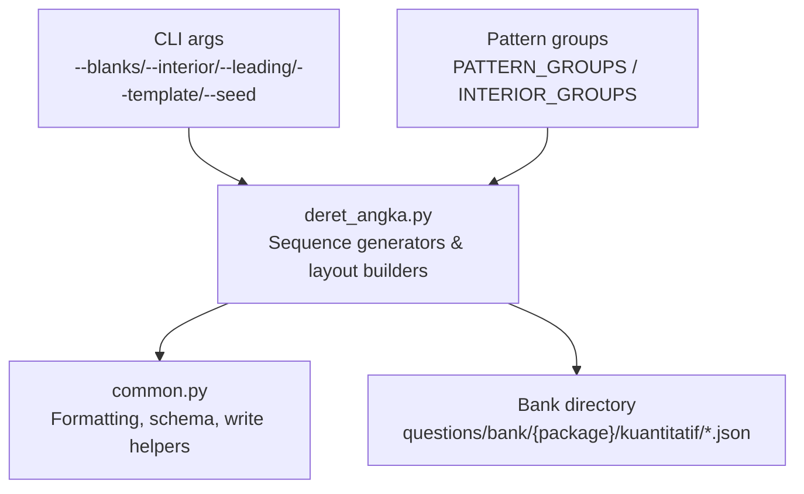
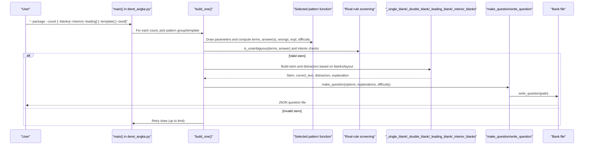
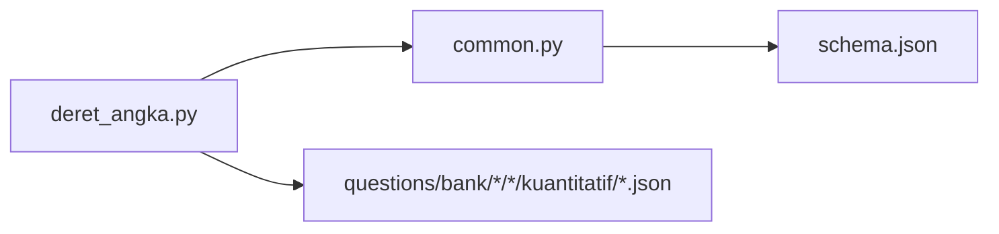

# Number Sequence Pattern Generators

<cite>
**Referenced Files in This Document**
- [deret_angka.py](file://questions/generator/deret_angka.py)
- [common.py](file://questions/generator/common.py)
- [README.md](file://questions/generator/README.md)
- [COVERAGE.md](file://questions/generator/COVERAGE.md)
</cite>

## Table of Contents
1. [Introduction](#introduction)
2. [Project Structure](#project-structure)
3. [Core Components](#core-components)
4. [Architecture Overview](#architecture-overview)
5. [Detailed Component Analysis](#detailed-component-analysis)
6. [Dependency Analysis](#dependency-analysis)
7. [Performance Considerations](#performance-considerations)
8. [Troubleshooting Guide](#troubleshooting-guide)
9. [Conclusion](#conclusion)
10. [Appendices](#appendices)

## Introduction
This document explains the number sequence pattern generator that creates quantitative reasoning problems involving numerical sequences, series, and pattern recognition. It details how the system generates valid sequences, computes correct answers by construction, screens for ambiguity, and produces meaningful explanations for each option. It also documents configuration options for complexity, pattern types, difficulty scaling, and output layouts.

The generator is deterministic when seeded, writes questions into a structured bank, and enforces quality rules such as:
- Answers are computed from the generation rule, never guessed.
- Every distractor is tied to a specific mistake with an explanation.
- Stems are screened against rival rules to ensure a single intended reading.
- Output formatting follows Indonesian exam conventions.

**Section sources**
- [deret_angka.py:1-35](file://questions/generator/deret_angka.py#L1-L35)
- [README.md:1-24](file://questions/generator/README.md#L1-L24)

## Project Structure
The number sequence generator lives under the question generator suite and integrates with shared utilities to produce standardized question artifacts.

**Diagram sources**
- [deret_angka.py:827-853](file://questions/generator/deret_angka.py#L827-L853)
- [deret_angka.py:1126-1201](file://questions/generator/deret_angka.py#L1126-L1201)
- [common.py:135-164](file://questions/generator/common.py#L135-L164)

**Section sources**
- [README.md:9-24](file://questions/generator/README.md#L9-L24)
- [common.py:13-24](file://questions/generator/common.py#L13-L24)

## Core Components
- Sequence pattern generators: Each returns terms, answer(s), wrongs (value + reason), explanation text, and difficulty. Examples include geometric progressions, Fibonacci-like sequences, interleaved arithmetic/geometric tracks, increasing or doubling differences, alternating operations, cycling operations, squares offsets, oblong numbers, and three-interleaved tracks.
- Rival-rule screening: Functions detect alternative interpretations (arithmetic, geometric, constant second difference, interleaved variants, alternating differences, Fibonacci-like). If any rival fits all printed terms but predicts a different continuation, the candidate is rejected to avoid ambiguous stems.
- Weak predictions: Under-determined readings (e.g., weak interleaved second-difference) cannot veto candidates but their predicted values are excluded from distractors to avoid rewarding incorrect interpretations.
- Layout builders: Support multiple stem shapes:
  - Single blank at tail (ask next term).
  - Two blanks at tail (ask next two terms).
  - Leading blank (missing first term of two-interleaved sequence).
  - Interior blanks (four terms, two blanks, then anchor term).
- Question assembly: Uses shared helpers to format numbers, assemble options, attach per-option explanations, and write JSON files into the canonical bank path.

**Section sources**
- [deret_angka.py:52-197](file://questions/generator/deret_angka.py#L52-L197)
- [deret_angka.py:203-813](file://questions/generator/deret_angka.py#L203-L813)
- [deret_angka.py:856-1123](file://questions/generator/deret_angka.py#L856-L1123)
- [common.py:99-128](file://questions/generator/common.py#L99-L128)
- [common.py:167-207](file://questions/generator/common.py#L167-L207)

## Architecture Overview
The end-to-end flow from CLI invocation to written question:

**Diagram sources**
- [deret_angka.py:1204-1247](file://questions/generator/deret_angka.py#L1204-L1247)
- [deret_angka.py:1126-1201](file://questions/generator/deret_angka.py#L1126-L1201)
- [deret_angka.py:190-197](file://questions/generator/deret_angka.py#L190-L197)
- [deret_angka.py:1033-1051](file://questions/generator/deret_angka.py#L1033-L1051)
- [common.py:167-207](file://questions/generator/common.py#L167-L207)

## Detailed Component Analysis

### Rival-Rule Screening and Ambiguity Control
The generator defines a set of strong rival rules and weak rules. Strong rules can veto a candidate if they fit the printed terms but predict a different continuation. Weak rules cannot veto but their predictions are excluded from distractors to avoid rewarding misreadings.

Key behaviors:
- Arithmetic progression detection via constant first difference.
- Geometric progression detection via constant ratio using exact fractions; non-integer results are rejected.
- Constant second-difference detection.
- Interleaved arithmetic/geometric tracks (two-way and three-way).
- Alternating differences between two constants.
- Fibonacci-like sum rule.
- Weak interleaved second-difference and mixed half-rules used only to exclude distractor values.

Ambiguity checks:
- For standard tails: no rival rule fitting all printed terms may predict a different next term.
- For two-blank tails: after assuming the 7th term, the 8th must also be unambiguous.
- For interior blanks: a rival rule must not reach the anchor while passing through different hidden terms.

**Section sources**
- [deret_angka.py:52-197](file://questions/generator/deret_angka.py#L52-L197)
- [deret_angka.py:1033-1051](file://questions/generator/deret_angka.py#L1033-L1051)

### Pattern Generators and Difficulty Scaling
Each pattern returns:
- Terms (printed evidence).
- Answer(s): typically the next one or next two terms.
- Wrong options: pairs of (value, reason) describing the specific mistake.
- Explanation: natural-language justification tailored to the generated sequence.
- Difficulty label: easy, medium, or hard.

Examples of patterns and their characteristics:
- Geometric progression: simple multiplication by a ratio; negative ratios increase difficulty.
- Two interleaved arithmetic tracks: odd/even positions follow separate arithmetic sequences.
- Increasing differences: constant second difference (quadratic growth).
- Alternating operations: e.g., multiply then add repeatedly.
- Cycling operations: three-step cycle with incrementing operands; supports division by construction.
- Fibonacci-like: sum of previous two terms.
- Squares offset: n² plus constant.
- Doubling differences: differences double each step.
- Signed arithmetic crossing zero: constant difference across sign change.
- Oblong numbers: n(n+1) plus offset.
- Alternating signed squares: consecutive squares with alternating signs.
- Square increments: successive additions of 1², 2², ...
- Double minus primes: double previous term and subtract consecutive primes.
- Fixed four-operation cycle: ×m, −k, :m, +k repeated with fixed operands.
- Three interleaved tracks: three independent arithmetic sequences rotated.

Difficulty scaling:
- Patterns self-report difficulty labels.
- Two-blank stems are treated as hard regardless of underlying pattern.
- Interior blanks are treated as hard due to reduced evidence and anchor verification.
- Package-level difficulty bands can be derived from counts of easy/medium/hard items.

**Section sources**
- [deret_angka.py:203-813](file://questions/generator/deret_angka.py#L203-L813)
- [common.py:77-96](file://questions/generator/common.py#L77-L96)

### Layout Builders and Option Generation
Stem layouts determine what is shown and what is asked:
- Single blank: asks for the next term; distractors are filtered to avoid already-printed values and weak predictions.
- Two blanks: asks for the next two terms; distractors split into families where either the first blank is wrong or the second continues incorrectly.
- Leading blank: hides the first term of a two-interleaved sequence; uniqueness is enforced by checking rival rules against extended observations.
- Interior blanks: shows four terms, two blanks, then an anchor term; distractors include generic misreadings and template-specific ones; anchor ensures correctness.

Option sets:
- Options are formatted using shared number formatting.
- Explanations are attached per option: correct option gets the full explanation; distractors get “Salah.” followed by the specific mistake reason.
- Duplicate options are removed; invalid or duplicate answers are rejected unless explicitly allowed by metadata.

**Section sources**
- [deret_angka.py:856-1123](file://questions/generator/deret_angka.py#L856-L1123)

### Question Assembly and Writing
Shared helpers enforce schema compliance and consistent formatting:
- Number formatting uses Indonesian conventions (comma decimal separator, dot thousands separator, typographic minus).
- Fractions are preserved when decimals would be repeating or misleading.
- Questions are assembled with ordered keys, validated option keys (A–E), and explanations covering all options.
- Writing refuses to overwrite existing files to preserve integrity.

**Section sources**
- [common.py:99-128](file://questions/generator/common.py#L99-L128)
- [common.py:167-207](file://questions/generator/common.py#L167-L207)
- [common.py:154-164](file://questions/generator/common.py#L154-L164)

### Configuration Options
Command-line options control generation behavior:
- --package: target package ID for organization.
- --count: number of questions to generate.
- --blanks: 1 or 2; controls whether the stem asks for one or two continuation terms.
- --interior: enables the hardest shape with four terms, two blanks, and an anchor term.
- --leading: hides the first term of a two-interleaved sequence; requires specific constraints.
- --template: selects an opt-in architecture (e.g., fixed_four_operation_cycle, three_interleaved).
- --seed: deterministic random seed for reproducible output.
- --bank-dir: custom destination directory for generated questions.

Grouping and selection:
- PATTERN_GROUPS organizes legacy default patterns so one package avoids duplicates within solving methods.
- INTERIOR_GROUPS restricts templates suitable for anchored stems.
- EXPLICIT_PATTERNS provides opt-in architectures not included in legacy defaults.

**Section sources**
- [deret_angka.py:816-853](file://questions/generator/deret_angka.py#L816-L853)
- [deret_angka.py:1204-1247](file://questions/generator/deret_angka.py#L1204-L1247)

## Dependency Analysis
The generator depends on shared utilities for formatting, schema validation, and file I/O. The dependency graph is straightforward and cohesive:

Coupling and cohesion:
- High cohesion within deret_angka.py: all sequence logic, screening, and layout building are centralized.
- Low coupling to external modules: only common.py for shared functionality.
- No circular dependencies observed.

External integration points:
- Filesystem writes to the question bank.
- JSON schema enforcement via common helpers.
- Optional Supabase publishing is outside this module’s scope.

**Diagram sources**
- [deret_angka.py:1126-1201](file://questions/generator/deret_angka.py#L1126-L1201)
- [common.py:135-164](file://questions/generator/common.py#L135-L164)

**Section sources**
- [common.py:13-24](file://questions/generator/common.py#L13-L24)

## Performance Considerations
- Deterministic draws with retries: build_one loops up to a limit to find clean draws; this guards against rare invalid combinations without blocking generation.
- Fraction arithmetic: uses exact rational math to avoid floating-point drift and to support precise formatting and comparisons.
- Screening cost: rival-rule checks run per candidate; however, the number of rules is small and inputs are short sequences, keeping overhead low.
- Formatting cost: fmt_number handles terminating decimals and fraction fallback efficiently.

Optimization opportunities:
- Cache frequent computations (e.g., rival-rule predictions) if generating large batches.
- Precompute operand ranges for cycling operations to reduce retry loops.
- Parallelize independent draws across seeds or packages if throughput becomes critical.

[No sources needed since this section provides general guidance]

## Troubleshooting Guide
Common issues and resolutions:
- No clean draw after attempts: indicates the selected pattern or constraints cannot produce a valid item; switch pattern or adjust flags (--blanks, --interior, --leading).
- Overwritten file error: the writer refuses to overwrite existing questions; ensure unique numbering or use a fresh bank directory.
- Repeating decimals in options: the generator filters out options that do not render exactly; redraw until acceptable values appear.
- Ambiguous stem: rival-rule screening rejects candidates; try a different pattern or layout.
- Invalid arguments: --leading has strict compatibility requirements; ensure --count=1 and no conflicting flags.

Validation and coverage:
- Use the generator README and COVERAGE documentation to understand supported architectures and package recipes.
- Validate the entire bank with the provided validator script before review/publish.

**Section sources**
- [deret_angka.py:1126-1201](file://questions/generator/deret_angka.py#L1126-L1201)
- [common.py:154-164](file://questions/generator/common.py#L154-L164)
- [README.md:24-33](file://questions/generator/README.md#L24-L33)
- [COVERAGE.md:1-45](file://questions/generator/COVERAGE.md#L1-L45)

## Conclusion
The number sequence pattern generator provides a robust, deterministic framework for creating high-quality quantitative reasoning items. It ensures correctness by computing answers from construction, prevents ambiguity via rigorous rival-rule screening, and delivers pedagogically useful explanations tied to specific mistakes. With flexible layouts and configuration options, it supports a wide range of sequence types and difficulty levels while maintaining consistency with exam standards.

[No sources needed since this section summarizes without analyzing specific files]

## Appendices

### Appendix A: Supported Sequence Types and Architectures
- Arithmetic progression (constant difference).
- Geometric progression (constant ratio).
- Fibonacci-like sequences (sum of previous two).
- Interleaved arithmetic/geometric tracks (two-way and three-way).
- Alternating differences (two alternating constants).
- Increasing differences (constant second difference).
- Doubling differences (geometric growth in differences).
- Alternating operations (e.g., multiply/add cycles).
- Cycling operations (three-step cycle with incrementing operands; supports division).
- Squares offset (n² + c).
- Oblong numbers (n(n+1) + offset).
- Alternating signed squares.
- Square increments (add 1², 2², ...).
- Double minus primes (double and subtract consecutive primes).
- Fixed four-operation cycle (×m, −k, :m, +k).

**Section sources**
- [deret_angka.py:203-813](file://questions/generator/deret_angka.py#L203-L813)
- [COVERAGE.md:12-28](file://questions/generator/COVERAGE.md#L12-L28)

### Appendix B: CLI Usage Summary
- Generate number sequences:
  - python3 deret_angka.py --package N --count K [--blanks 1|2] [--interior] [--leading] [--template NAME] [--seed S]
- Notes:
  - --leading requires --count 1, --blanks 1, and no --interior or --template.
  - --template requires --count 1 and cannot combine with --interior.
  - --seed ensures reproducibility.
  - --bank-dir allows writing to a scratch directory.

**Section sources**
- [deret_angka.py:1204-1247](file://questions/generator/deret_angka.py#L1204-L1247)