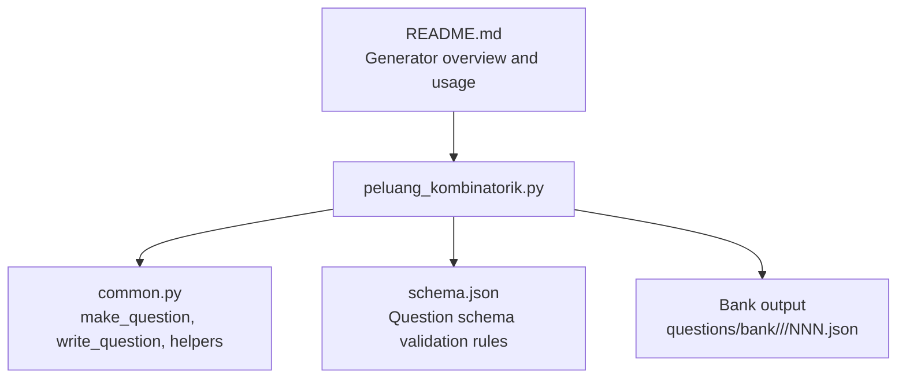
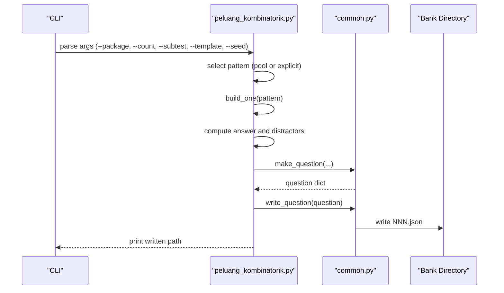
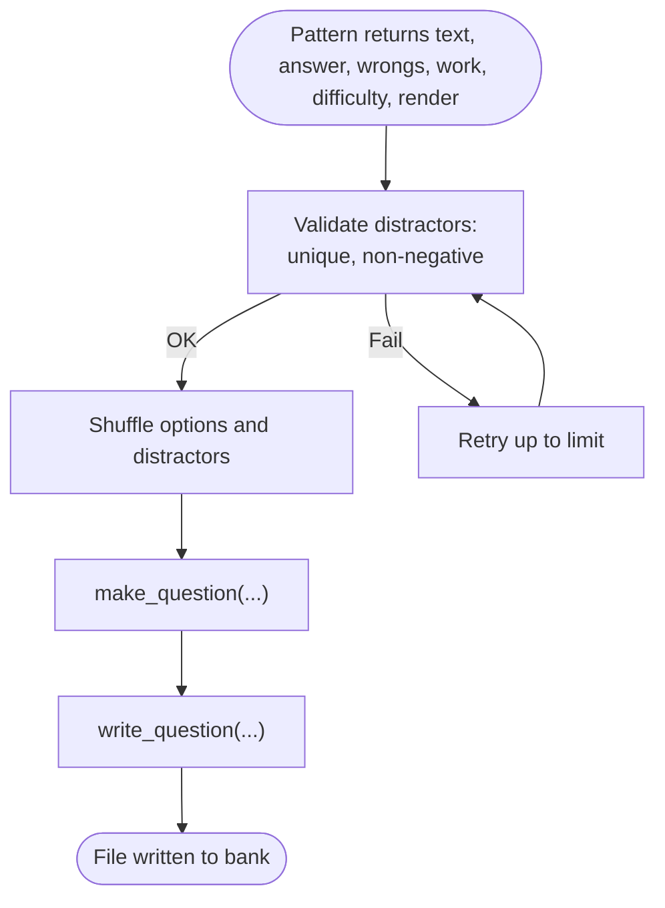
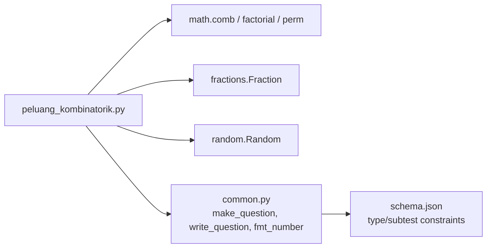
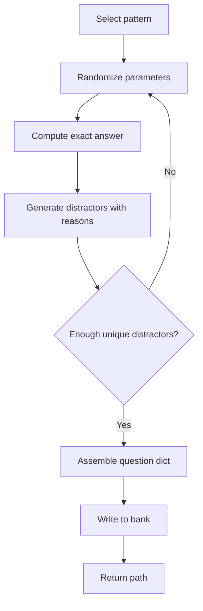

# Probability and Combinatorics Generators

<cite>
**Referenced Files in This Document**
- [peluang_kombinatorik.py](file://questions/generator/peluang_kombinatorik.py)
- [common.py](file://questions/generator/common.py)
- [schema.json](file://questions/schema.json)
- [README.md](file://questions/generator/README.md)
- [001.json](file://questions/bank/10/pemecahan_masalah/001.json)
- [001.json](file://questions/bank/2/pemecahan_masalah/001.json)
- [001.json](file://questions/bank/3/pemecahan_masalah/001.json)
</cite>

## Table of Contents
1. [Introduction](#introduction)
2. [Project Structure](#project-structure)
3. [Core Components](#core-components)
4. [Architecture Overview](#architecture-overview)
5. [Detailed Component Analysis](#detailed-component-analysis)
6. [Dependency Analysis](#dependency-analysis)
7. [Performance Considerations](#performance-considerations)
8. [Troubleshooting Guide](#troubleshooting-guide)
9. [Conclusion](#conclusion)
10. [Appendices](#appendices)

## Introduction
This document explains the probability and combinatorics question generator that produces deterministic, mathematically verified problems for quantitative reasoning and problem-solving sections. It covers:
- The mathematical algorithms used to generate valid scenarios with correct sample spaces and outcome counts.
- Supported concepts: independent events, conditional probability, binomial distributions, and combinatorial counting principles.
- Configuration options for complexity, event types, and calculation methods.
- How generated questions are structured and validated against a strict schema.

The generator is designed so that every answer key is computed from the same construction that creates the stem, ensuring correctness and reproducibility across runs when seeded.

## Project Structure
At a high level, the generator lives under the question generation scripts and writes JSON question files into a bank directory organized by package and subtest.

**Diagram sources**
- [peluang_kombinatorik.py:1-525](file://questions/generator/peluang_kombinatorik.py#L1-L525)
- [common.py:1-218](file://questions/generator/common.py#L1-L218)
- [schema.json:1-98](file://questions/schema.json#L1-L98)
- [README.md:1-33](file://questions/generator/README.md#L1-L33)

**Section sources**
- [peluang_kombinatorik.py:1-525](file://questions/generator/peluang_kombinatorik.py#L1-L525)
- [common.py:1-218](file://questions/generator/common.py#L1-L218)
- [schema.json:1-98](file://questions/schema.json#L1-L98)
- [README.md:1-33](file://questions/generator/README.md#L1-L33)

## Core Components
- Deterministic pattern generators: Each function builds a scenario, computes the exact answer using combinatorics or probability rules, and provides named distractors with explanations.
- Question assembly: Common utilities assemble a question dict conforming to the schema and write it to disk without overwriting existing files.
- Schema enforcement: The JSON schema defines required fields, allowed types, and option structure; common utilities enforce type-to-subtest mapping and option ordering.

Key responsibilities:
- Generate valid sample spaces and count outcomes accurately.
- Produce five options (A–E), one correct and four plausible distractors tied to specific mistakes.
- Render probabilities as reduced fractions and numbers in exam-appropriate formats.
- Tag difficulty and source metadata for traceability.

**Section sources**
- [peluang_kombinatorik.py:45-55](file://questions/generator/peluang_kombinatorik.py#L45-L55)
- [peluang_kombinatorik.py:60-427](file://questions/generator/peluang_kombinatorik.py#L60-L427)
- [common.py:77-128](file://questions/generator/common.py#L77-L128)
- [common.py:135-207](file://questions/generator/common.py#L135-L207)
- [schema.json:1-98](file://questions/schema.json#L1-L98)

## Architecture Overview
The generator follows a pipeline:
1. Select a pattern (either from a curated pool or an explicit template).
2. Build a scenario with randomized parameters within safe ranges.
3. Compute the exact answer using combinatorial/probabilistic formulas.
4. Generate distractors based on documented common errors.
5. Assemble a question dict via shared helpers and write to the bank.

**Diagram sources**
- [peluang_kombinatorik.py:451-525](file://questions/generator/peluang_kombinatorik.py#L451-L525)
- [common.py:167-207](file://questions/generator/common.py#L167-L207)

## Detailed Component Analysis

### Pattern Library and Mathematical Algorithms
Each pattern implements a distinct concept with precise sample space definitions and outcome calculations.

- Two-colour draw (simultaneous selection):
  - Sample space: combinations of two items from total.
  - Outcome: product of counts for each colour.
  - Uses combinations to avoid order dependence.
  - See: [gen_two_colour_draw:60-96](file://questions/generator/peluang_kombinatorik.py#L60-L96)

- At least one (complement rule):
  - Computes complement (none selected) then subtracts from 1.
  - Ensures “at least one” is not confused with “exactly one.”
  - See: [gen_at_least_one:98-133](file://questions/generator/peluang_kombinatorik.py#L98-L133)

- Committee composition (constraints):
  - Multi-step selection with constraints; uses multiplication principle.
  - See: [gen_committee:135-167](file://questions/generator/peluang_kombinatorik.py#L135-L167)

- Arrangement together (adjacency constraint):
  - Treats adjacent pair as a block; accounts for internal order.
  - See: [gen_arrangement_together:169-198](file://questions/generator/peluang_kombinatorik.py#L169-L198)

- Splitting distinct items equally between two named recipients:
  - Choose subset for first recipient; remainder goes to second.
  - See: [gen_split_equally:200-229](file://questions/generator/peluang_kombinatorik.py#L200-L229)

- Dice sum (ordered pairs sample space):
  - Explicitly enumerates ordered pairs; avoids unordered fallacy.
  - See: [gen_dice_sum:231-264](file://questions/generator/peluang_kombinatorik.py#L231-L264)

- Three-digit even numbers without repetition:
  - Constrains units digit; applies multiplication principle across positions.
  - See: [gen_even_three_digit:266-306](file://questions/generator/peluang_kombinatorik.py#L266-L306)

- Non-consecutive day selection:
  - Subtracts adjacent pairs from all pairs.
  - See: [gen_nonadjacent_days:308-341](file://questions/generator/peluang_kombinatorik.py#L308-L341)

- Circular permutations with non-adjacency:
  - Uses circular permutation formula and subtracts adjacent cases.
  - See: [gen_circular_nonadjacent:343-378](file://questions/generator/peluang_kombinatorik.py#L343-L378)

- Lattice paths through checkpoint:
  - Splits path into two segments; multiplies ways for each segment.
  - See: [gen_lattice_checkpoint:380-427](file://questions/generator/peluang_kombinatorik.py#L380-L427)

These patterns cover core combinatorial counting principles (permutations, combinations, multiplication/addition rules, adjacency constraints, circular arrangements) and fundamental probability ideas (sample space definition, complement rule, conditional reasoning via constrained selections).

**Section sources**
- [peluang_kombinatorik.py:60-427](file://questions/generator/peluang_kombinatorik.py#L60-L427)

### Supporting Concepts: Independent Events, Conditional Probability, Binomial Distribution
While the current pattern set focuses on classical counting and basic probability constructs, the generator’s design supports extending to additional concepts:

- Independent events:
  - Can be modeled by multiplying probabilities of independent draws when replacement is specified; ensure sample space reflects independence.
  - Implementation approach: define events with known probabilities and multiply accordingly.

- Conditional probability:
  - Model by restricting sample space to the condition and recomputing ratios.
  - Example: probability of drawing a red marble given that the first draw was blue.

- Binomial distribution:
  - Model repeated independent trials with fixed success probability; compute probabilities for k successes out of n trials.
  - Use combinations to count favorable sequences and multiply by p^k(1-p)^(n-k).

To add these, follow the established pattern: define parameters, compute exact answers, provide named distractors, and integrate into the pool or explicit templates.

[No sources needed since this section proposes conceptual extensions not yet implemented]

### Question Assembly and Output Format
- Options must be exactly A–E in order; explanations must cover all keys.
- Difficulty is tagged per item; source indicates the generating script.
- Probabilities render as reduced fractions; other numbers use exam-appropriate formatting.
- Questions are written to canonical paths and refuse to overwrite existing files.

**Diagram sources**
- [peluang_kombinatorik.py:451-492](file://questions/generator/peluang_kombinatorik.py#L451-L492)
- [common.py:167-207](file://questions/generator/common.py#L167-L207)

**Section sources**
- [peluang_kombinatorik.py:451-492](file://questions/generator/peluang_kombinatorik.py#L451-L492)
- [common.py:167-207](file://questions/generator/common.py#L167-L207)
- [schema.json:1-98](file://questions/schema.json#L1-L98)

### Examples from the Bank
- Complement rule example: “at least one” probability with marbles.
  - See: [001.json:1-44](file://questions/bank/10/pemecahan_masalah/001.json#L1-L44)
- Ordered pairs sample space example: dice sum probability.
  - See: [001.json:1-44](file://questions/bank/2/pemecahan_masalah/001.json#L1-L44)
- Combination split example: distributing distinct candies equally.
  - See: [001.json:1-44](file://questions/bank/3/pemecahan_masalah/001.json#L1-L44)

**Section sources**
- [001.json:1-44](file://questions/bank/10/pemecahan_masalah/001.json#L1-L44)
- [001.json:1-44](file://questions/bank/2/pemecahan_masalah/001.json#L1-L44)
- [001.json:1-44](file://questions/bank/3/pemecahan_masalah/001.json#L1-L44)

## Dependency Analysis
The generator depends on:
- Python standard library modules for randomness, fractions, and combinatorics.
- Shared helpers for formatting, question assembly, and file I/O.
- A strict JSON schema for validation and consistency.

**Diagram sources**
- [peluang_kombinatorik.py:30-39](file://questions/generator/peluang_kombinatorik.py#L30-L39)
- [common.py:1-218](file://questions/generator/common.py#L1-L218)
- [schema.json:1-98](file://questions/schema.json#L1-L98)

**Section sources**
- [peluang_kombinatorik.py:30-39](file://questions/generator/peluang_kombinatorik.py#L30-L39)
- [common.py:1-218](file://questions/generator/common.py#L1-L218)
- [schema.json:1-98](file://questions/schema.json#L1-L98)

## Performance Considerations
- Deterministic generation: Using a seed ensures reproducible outputs; ideal for testing and versioned packages.
- Efficient computation: Direct use of combinatorial functions avoids expensive enumeration; only small explicit loops are used where necessary (e.g., dice sums).
- Safe parameter ranges: Random ranges keep computations tractable and results readable.
- Option uniqueness: The generator retries if distractors collide or are invalid, limiting attempts to prevent long runs.

[No sources needed since this section provides general guidance]

## Troubleshooting Guide
Common issues and resolutions:
- Duplicate or invalid distractors:
  - The generator filters duplicates and negative values; if insufficient unique distractors remain after filtering, it retries up to a limit.
  - If it fails after many attempts, adjust parameter ranges or pattern logic.
  - See: [build_one retry loop:451-492](file://questions/generator/peluang_kombinatorik.py#L451-L492)

- Overwrite protection:
  - Writing refuses to overwrite existing files; ensure unique question numbers or target a different bank directory.
  - See: [write_question guard:154-164](file://questions/generator/common.py#L154-L164)

- Type/subtest mismatch:
  - Types must be allowed for the chosen subtest; otherwise, an error is raised during question assembly.
  - See: [make_question validation:167-207](file://questions/generator/common.py#L167-L207)

- Formatting expectations:
  - Probabilities render as reduced fractions; numbers use exam-appropriate formatting. Ensure stems and options align with these conventions.
  - See: [number formatting:99-128](file://questions/generator/common.py#L99-L128)

**Section sources**
- [peluang_kombinatorik.py:451-492](file://questions/generator/peluang_kombinatorik.py#L451-L492)
- [common.py:154-207](file://questions/generator/common.py#L154-L207)

## Conclusion
The probability and combinatorics generator provides a robust, deterministic framework for creating high-quality problems grounded in sound mathematical reasoning. Its pattern library covers essential counting techniques and probability concepts, while its shared infrastructure ensures consistent formatting, validation, and storage. Extending the generator to include independent events, conditional probability, and binomial distributions can be achieved by following the established pattern model and integrating new templates into the pool or explicit configuration.

[No sources needed since this section summarizes without analyzing specific files]

## Appendices

### Configuration Options
- Package and subtest selection:
  - Choose which package and subtest to write into.
  - See: [CLI arguments:495-505](file://questions/generator/peluang_kombinatorik.py#L495-L505)

- Count and seeding:
  - Control how many questions to generate and enable reproducibility via seed.
  - See: [CLI arguments:495-505](file://questions/generator/peluang_kombinatorik.py#L495-L505)

- Template selection:
  - Force a specific pattern for targeted generation without altering the default pool.
  - See: [explicit templates map:440-448](file://questions/generator/peluang_kombinatorik.py#L440-L448)

- Bank directory:
  - Write to a custom directory instead of the default bank location.
  - See: [CLI argument:495-505](file://questions/generator/peluang_kombinatorik.py#L495-L505)

**Section sources**
- [peluang_kombinatorik.py:495-525](file://questions/generator/peluang_kombinatorik.py#L495-L525)

### Data Flow Diagram: Generating One Question

**Diagram sources**
- [peluang_kombinatorik.py:451-492](file://questions/generator/peluang_kombinatorik.py#L451-L492)
- [common.py:167-207](file://questions/generator/common.py#L167-L207)