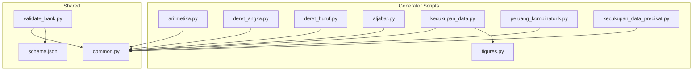
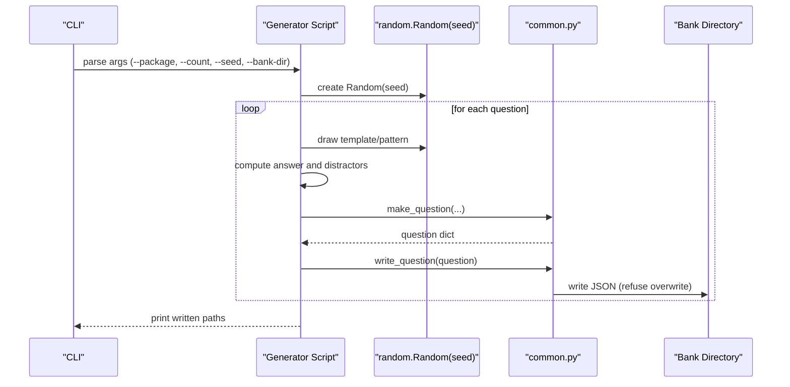
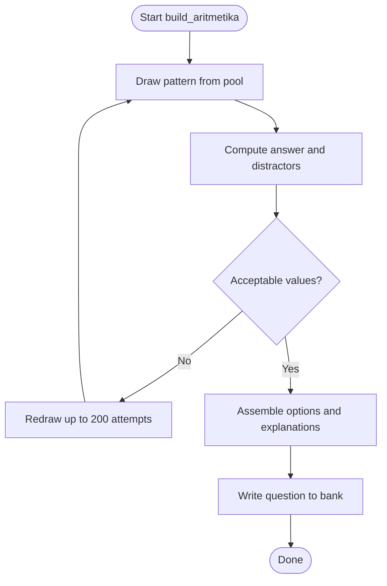
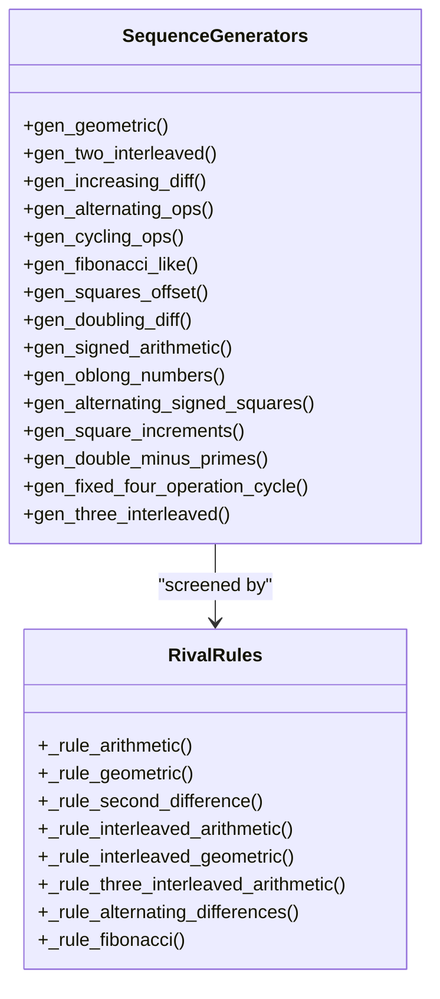
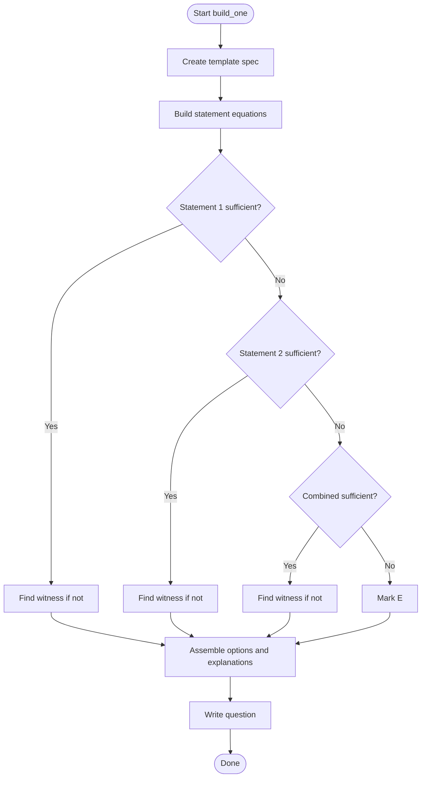
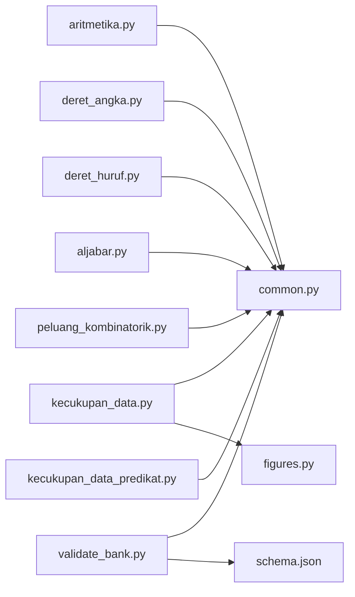

# Question Generation Framework

<cite>
**Referenced Files in This Document**
- [common.py](file://questions/generator/common.py)
- [schema.json](file://questions/schema.json)
- [README.md](file://questions/generator/README.md)
- [COVERAGE.md](file://questions/generator/COVERAGE.md)
- [requirements.txt](file://questions/generator/requirements.txt)
- [aritmetika.py](file://questions/generator/aritmetika.py)
- [deret_angka.py](file://questions/generator/deret_angka.py)
- [aljabar.py](file://questions/generator/aljabar.py)
- [kecukupan_data.py](file://questions/generator/kecukupan_data.py)
- [peluang_kombinatorik.py](file://questions/generator/peluang_kombinatorik.py)
- [deret_huruf.py](file://questions/generator/deret_huruf.py)
- [kecukupan_data_predikat.py](file://questions/generator/kecukupan_data_predikat.py)
- [figures.py](file://questions/generator/figures.py)
- [validate_bank.py](file://questions/generator/validate_bank.py)
</cite>

## Table of Contents
1. [Introduction](#introduction)
2. [Project Structure](#project-structure)
3. [Core Components](#core-components)
4. [Architecture Overview](#architecture-overview)
5. [Detailed Component Analysis](#detailed-component-analysis)
6. [Dependency Analysis](#dependency-analysis)
7. [Performance Considerations](#performance-considerations)
8. [Troubleshooting Guide](#troubleshooting-guide)
9. [Conclusion](#conclusion)
10. [Appendices](#appendices)

## Introduction
This document explains the Python-based question generation framework that produces deterministic, reproducible question sets for a standardized test bank. The framework generates computable question types with computed answer keys and high-quality distractors, ensuring consistent output across runs via explicit random seed management. It also documents shared utilities, mathematical algorithms, JSON schema compliance, edge-case handling, and validation processes.

The framework supports multiple subtests and question types:
- Arithmetic and quantitative comparison (aritmetika, perbandingan_kuantitatif)
- Number sequences (deret_angka)
- Letter sequences (deret_huruf)
- Algebra (aljabar)
- Data sufficiency (kecukupan_data and predicate variants)
- Probability and combinatorics (peluang_kombinatorik)
- Figures (SVG builders for geometry items)

All generators write canonical JSON files conforming to a strict schema and are validated by a bank validator tool.

**Section sources**
- [README.md:1-33](file://questions/generator/README.md#L1-L33)
- [COVERAGE.md:1-45](file://questions/generator/COVERAGE.md#L1-L45)

## Project Structure
At the core is a set of generator scripts under questions/generator, each targeting one or more question types. Shared utilities live in common.py, which defines blueprint constraints, formatting helpers, and question assembly functions. A JSON schema enforces the structure of every generated question file.

**Diagram sources**
- [common.py:1-218](file://questions/generator/common.py#L1-L218)
- [schema.json:1-98](file://questions/schema.json#L1-L98)
- [validate_bank.py:1-200](file://questions/generator/validate_bank.py#L1-L200)
- [aritmetika.py:1-836](file://questions/generator/aritmetika.py#L1-L836)
- [deret_angka.py:1-1252](file://questions/generator/deret_angka.py#L1-L1252)
- [deret_huruf.py:1-391](file://questions/generator/deret_huruf.py#L1-L391)
- [aljabar.py:1-325](file://questions/generator/aljabar.py#L1-L325)
- [kecukupan_data.py:1-934](file://questions/generator/kecukupan_data.py#L1-L934)
- [peluang_kombinatorik.py:1-525](file://questions/generator/peluang_kombinatorik.py#L1-L525)
- [kecukupan_data_predikat.py:1-282](file://questions/generator/kecukupan_data_predikat.py#L1-L282)
- [figures.py:1-200](file://questions/generator/figures.py#L1-L200)

**Section sources**
- [README.md:1-33](file://questions/generator/README.md#L1-L33)
- [requirements.txt:1-3](file://questions/generator/requirements.txt#L1-L3)

## Core Components
- Shared utilities (common.py):
  - Blueprint definitions for subtests, allowed types per subtest, and package difficulty calculation.
  - Formatting helpers for Indonesian number notation and fraction rendering.
  - Canonical path helpers for next question numbers, IDs, and writing questions to disk.
  - make_question assembles a question dict with strict option key ordering and type checks.
- Schema (schema.json):
  - Enforces required fields, option keys A–E, correct_option, explanations for all options, image paths, passage usage rules, and difficulty levels.
- Validation (validate_bank.py):
  - Validates every question against the schema and blueprint counts, ensures unique numbering, checks stimulus requirements, verifies referenced images, and computes package difficulty consistency.

These components ensure that generated questions are structurally valid, semantically consistent, and aligned with test blueprints.

**Section sources**
- [common.py:17-107](file://questions/generator/common.py#L17-L107)
- [common.py:130-218](file://questions/generator/common.py#L130-L218)
- [schema.json:1-98](file://questions/schema.json#L1-L98)
- [validate_bank.py:44-194](file://questions/generator/validate_bank.py#L44-L194)

## Architecture Overview
Each generator script follows a consistent pattern:
- Accept CLI arguments including --seed for reproducibility and --bank-dir for output location.
- Use a seeded random.Random instance to draw templates deterministically.
- Generate stems, compute answers exactly using Fraction or math.comb/factorial, and produce distractors as (value, reason) pairs.
- Assemble a question dict via common.make_question and write it to the canonical bank path using common.write_question.
- Refuse to overwrite existing files to preserve integrity.

**Diagram sources**
- [aritmetika.py:792-836](file://questions/generator/aritmetika.py#L792-L836)
- [deret_angka.py:1-1252](file://questions/generator/deret_angka.py#L1-L1252)
- [aljabar.py:304-325](file://questions/generator/aljabar.py#L304-L325)
- [kecukupan_data.py:792-934](file://questions/generator/kecukupan_data.py#L792-L934)
- [peluang_kombinatorik.py:495-525](file://questions/generator/peluang_kombinatorik.py#L495-L525)
- [common.py:139-218](file://questions/generator/common.py#L139-L218)

## Detailed Component Analysis

### Arithmetic and Quantitative Comparison (aritmetika.py)
- Purpose: Generates arithmetic problems and quantitative comparison items with computed answers and named distractors.
- Key patterns:
  - Percentages, chained percentages, rates/proportions, fraction operations, order-of-operations expressions, mixed operations, percent change, averages, ratios, powers/roots, decimal chains, weighted group means, reverse discounts.
  - Quantitative comparison kinds include percentage vs fraction, powers, linear expressions, area comparisons, indeterminate relations with witness pairs, composite proportions, and mixed-unit equalities.
- Determinism: Uses Fraction for exact arithmetic; rejects draws that do not render cleanly in Indonesian notation or produce ambiguous options.
- Output: Writes aritmetika or perbandingan_kuantitatif questions with full explanations keyed to specific mistakes.

**Diagram sources**
- [aritmetika.py:510-560](file://questions/generator/aritmetika.py#L510-L560)
- [aritmetika.py:711-790](file://questions/generator/aritmetika.py#L711-L790)

**Section sources**
- [aritmetika.py:1-836](file://questions/generator/aritmetika.py#L1-L836)

### Number Sequences (deret_angka.py)
- Purpose: Generates number sequence questions with one or two tail blanks, interior blanks, leading layouts, and fixed four-operation cycles.
- Algorithms:
  - Rival-rule screening to ensure unambiguous continuation (arithmetic, geometric, second difference, interleaved arithmetic/geometric, three-interleaved, alternating differences, Fibonacci-like).
  - Weak predictions excluded from distractor sets to avoid rewarding misreadings.
  - Construction guarantees exact divisions and positive intermediate values where needed.
- Determinism: Seeded RNG; repeated draws until clean distractors and unambiguous stems are produced.
- Output: deret_angka questions with detailed explanations tied to specific misreadings.

**Diagram sources**
- [deret_angka.py:52-197](file://questions/generator/deret_angka.py#L52-L197)
- [deret_angka.py:203-800](file://questions/generator/deret_angka.py#L203-L800)

**Section sources**
- [deret_angka.py:1-1252](file://questions/generator/deret_angka.py#L1-L1252)

### Letter Sequences (deret_huruf.py)
- Purpose: Generates letter-sequence questions using A=1..Z=26 mapping, supporting tail blanks (one/two), interior anchored shapes, and various cycle patterns.
- Algorithms:
  - Rival-rule screening includes constant steps, accelerating steps, interleaved tracks, repeating cycles (period 3/4), and modular constant steps.
  - Ensures unambiguous continuation within alphabet bounds.
- Determinism: Seeded RNG; redraws until rival rules agree on the same continuation.
- Output: deret_huruf questions with explanations describing the specific misreading for each distractor.

**Section sources**
- [deret_huruf.py:1-391](file://questions/generator/deret_huruf.py#L1-L391)

### Algebra (aljabar.py)
- Purpose: Generates algebra questions covering linear equations, two-variable systems, quadratic evaluation, and symmetric identities.
- Algorithms:
  - Exact construction of equations around drawn solutions to guarantee correctness.
  - Distractors represent common algebraic slips (sign errors, order-of-operations mistakes, incorrect substitution).
- Determinism: Seeded RNG; filters out non-exact renders and insufficient distractors.
- Output: aljabar questions with work steps and precise explanations.

**Section sources**
- [aljabar.py:1-325](file://questions/generator/aljabar.py#L1-L325)

### Data Sufficiency (kecukupan_data.py)
- Purpose: Generates data sufficiency items where the key is a claim about sufficiency rather than a numeric answer.
- Algorithms:
  - Exact linear algebra over Fractions to determine sufficiency via rank comparison.
  - Null-space basis used to construct witness pairs proving insufficiency.
  - Geometry templates use schematic figures from figures.py to avoid measurement-based solving.
- Determinism: Seeded RNG; redraws until desired key is realized and witnesses are realistic.
- Output: kecukupan_data questions with standard Indonesian options and rigorous explanations.

**Diagram sources**
- [kecukupan_data.py:792-934](file://questions/generator/kecukupan_data.py#L792-L934)
- [kecukupan_data.py:81-155](file://questions/generator/kecukupan_data.py#L81-L155)

**Section sources**
- [kecukupan_data.py:1-934](file://questions/generator/kecukupan_data.py#L1-L934)

### Predicate-Based Data Sufficiency (kecukupan_data_predikat.py)
- Purpose: Handles yes/no inequality predicate sufficiency using symbolic equivalence and exhaustive positive-integer search.
- Algorithms:
  - Symbolic proof based on ratio-sum equivalence for positive variables.
  - Finite domain search to find counterexamples when statements are insufficient.
- Determinism: Seeded RNG; deterministic state enumeration ensures reproducible outputs.
- Output: kecukupan_data questions with proofs and witness assignments.

**Section sources**
- [kecukupan_data_predikat.py:1-282](file://questions/generator/kecukupan_data_predikat.py#L1-L282)

### Probability and Combinatorics (peluang_kombinatorik.py)
- Purpose: Generates probability and counting problems with exact answers derived from combinations/permutations.
- Algorithms:
  - Uses math.comb, factorial, perm to compute sample spaces and favorable outcomes.
  - Distractors model common counting mistakes (order vs combination, replacement vs without replacement, misapplied complements).
- Determinism: Seeded RNG; filters invalid or duplicate distractors.
- Output: peluang_kombinatorik questions with reduced fractions and step-by-step work.

**Section sources**
- [peluang_kombinatorik.py:1-525](file://questions/generator/peluang_kombinatorik.py#L1-L525)

### Figures (figures.py)
- Purpose: Generates SVG figures deterministically from stem parameters, enforcing that figures only label what the stem provides.
- Features:
  - Builders for rectangles, trapezoids, sectors, cylinders, and other shapes.
  - Consistent palette and typography matching web styles.
  - --check mode compares generated SVGs against disk to prevent manual edits.
  - --link mode updates question image references to point at generated files.

**Section sources**
- [figures.py:1-200](file://questions/generator/figures.py#L1-L200)

## Dependency Analysis
- Generators depend on common.py for shared utilities and schema validation.
- Data sufficiency geometry items depend on figures.py for schematic diagrams.
- validate_bank.py depends on schema.json and common.py to enforce structural and blueprint constraints.
- External dependencies: jsonschema for validation, requests for upload workflows (not shown here but present in requirements).

**Diagram sources**
- [common.py:1-218](file://questions/generator/common.py#L1-L218)
- [schema.json:1-98](file://questions/schema.json#L1-L98)
- [validate_bank.py:1-200](file://questions/generator/validate_bank.py#L1-L200)
- [figures.py:1-200](file://questions/generator/figures.py#L1-L200)

**Section sources**
- [requirements.txt:1-3](file://questions/generator/requirements.txt#L1-L3)

## Performance Considerations
- Exact arithmetic with Fraction avoids floating-point drift and ensures deterministic results.
- Rejection sampling (up to 200 attempts) prevents low-quality draws; this is bounded and safe for typical generator runs.
- Rival-rule screening adds computational overhead but is essential for item quality and ambiguity elimination.
- Figure generation is deterministic and fast; --check mode can be expensive for large banks but ensures integrity.

[No sources needed since this section provides general guidance]

## Troubleshooting Guide
Common issues and resolutions:
- Overwrite protection: write_question refuses to overwrite existing files; ensure slot reservation before running generators.
- Schema violations: validate_bank.py reports exact locations; fix field mismatches, option keys, or missing passages/images.
- Blueprint mismatches: strict mode enforces exact counts per subtest; adjust generator counts accordingly.
- Difficulty mismatch: package difficulty is calculated from counts; update package manifest or regenerate to match.
- Image references: validate_bank.py checks existence; run figures.py --link to update references.

**Section sources**
- [validate_bank.py:44-194](file://questions/generator/validate_bank.py#L44-L194)
- [common.py:154-164](file://questions/generator/common.py#L154-L164)

## Conclusion
The framework delivers high-quality, deterministic question generation through exact computation, rigorous distractor design, and strict schema enforcement. Shared utilities centralize formatting, path management, and validation, while individual generators implement specialized algorithms tailored to each question type. The result is a robust pipeline for producing reproducible, exam-grade content suitable for automated validation and publishing.

[No sources needed since this section summarizes without analyzing specific files]

## Appendices

### Generator Configuration Examples
- Arithmetic: python3 aritmetika.py --package 1 --count 6 --type aritmetika --seed 7
- Number sequences: python3 deret_angka.py --package 7 --count 1 --template fixed_four_operation_cycle --blanks 2 --seed SEED
- Algebra: python3 aljabar.py --package 1 --count 3 --seed 7
- Data sufficiency: python3 kecukupan_data.py --package 1 --count 2 --kind geometry --seed 7
- Probability: python3 peluang_kombinatorik.py --package 1 --count 2 --subtest pemecahan_masalah --seed 7
- Letter sequences: python3 deret_huruf.py --package 7 --count 1 --blanks 1 --seed SEED

**Section sources**
- [COVERAGE.md:30-45](file://questions/generator/COVERAGE.md#L30-L45)
- [README.md:24-33](file://questions/generator/README.md#L24-L33)

### Output Validation Process
- Run validate_bank.py [--strict] to check schema compliance, blueprint counts, image references, and package difficulty consistency.
- Fix reported errors/warnings and re-run until exit code 0.

**Section sources**
- [validate_bank.py:17-19](file://questions/generator/validate_bank.py#L17-L19)
- [validate_bank.py:197-208](file://questions/generator/validate_bank.py#L197-L208)