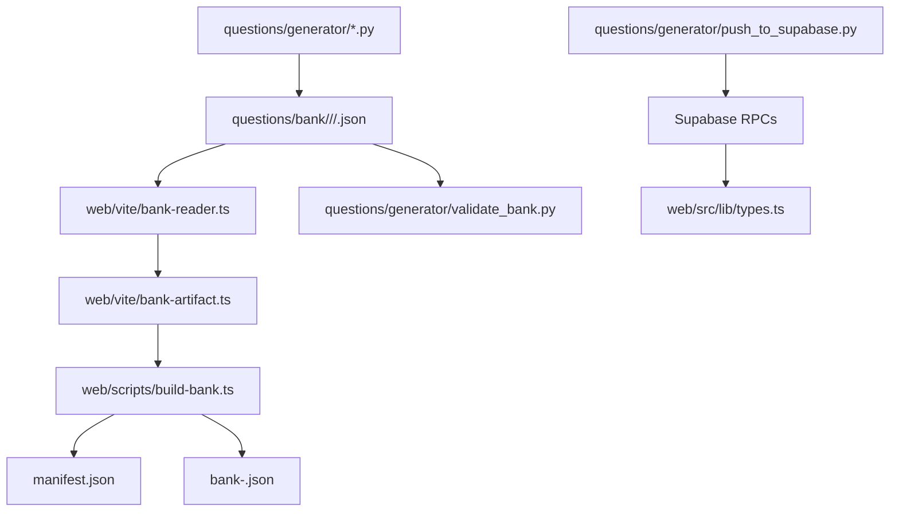
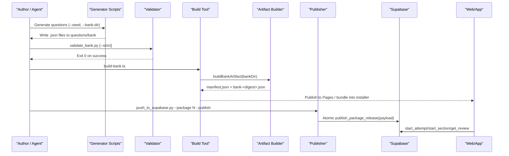
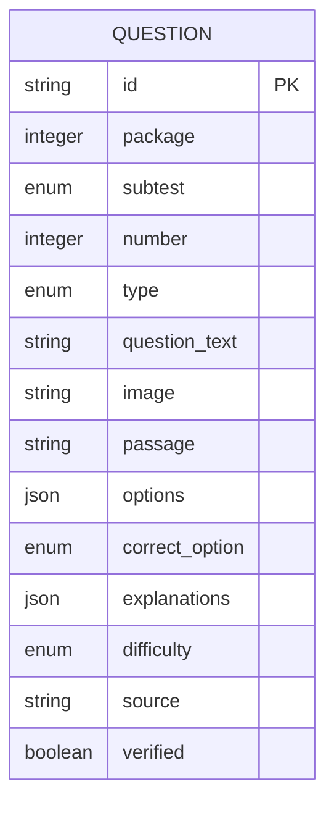
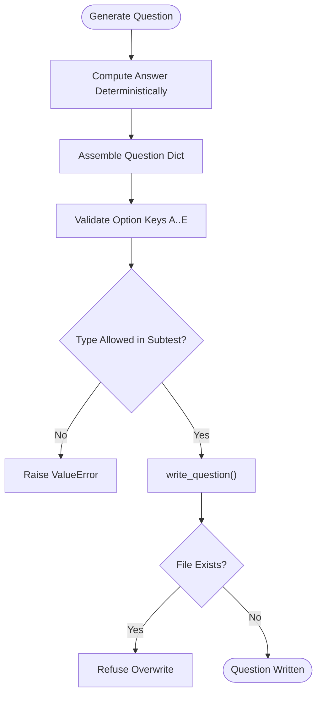
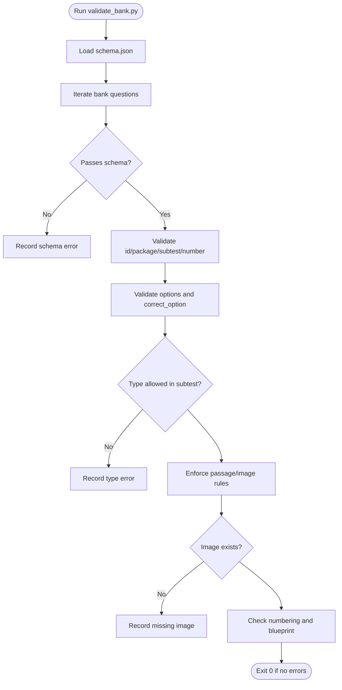
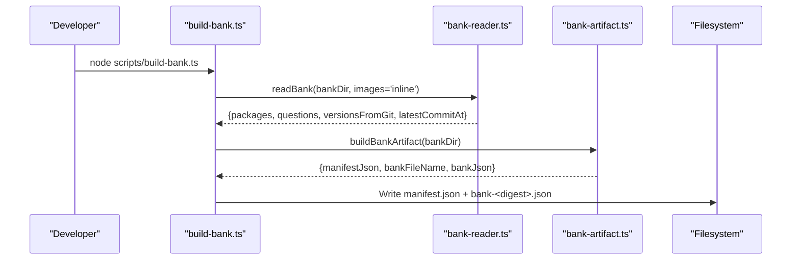
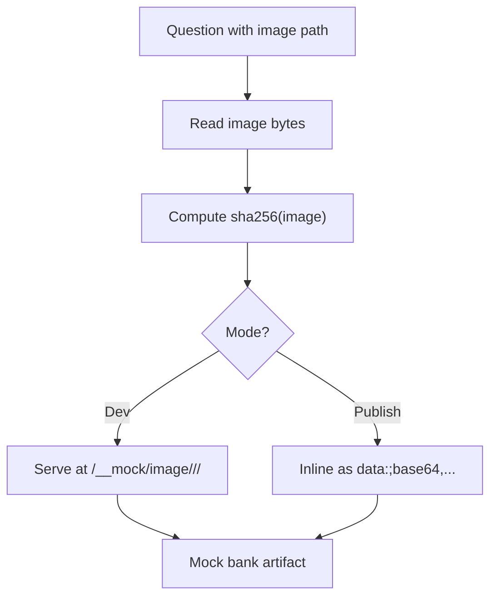
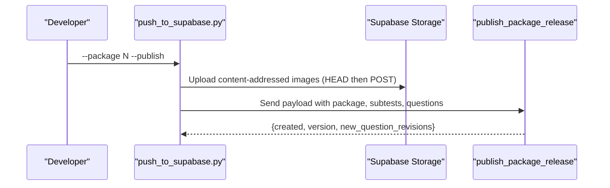
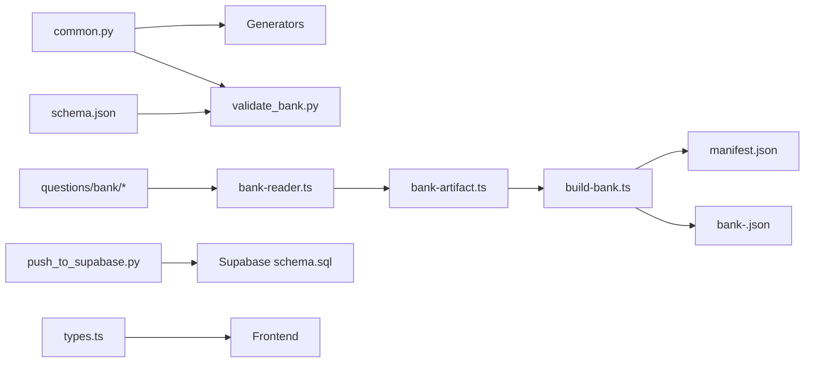

# Question Management Architecture

<cite>
**Referenced Files in This Document**
- [schema.json](file://questions/schema.json)
- [common.py](file://questions/generator/common.py)
- [validate_bank.py](file://questions/generator/validate_bank.py)
- [push_to_supabase.py](file://questions/generator/push_to_supabase.py)
- [README.md](file://questions/generator/README.md)
- [package.json](file://questions/bank/1/package.json)
- [001.json](file://questions/bank/1/kuantitatif/001.json)
- [bank-reader.ts](file://web/vite/bank-reader.ts)
- [build-bank.ts](file://web/scripts/build-bank.ts)
- [bank-artifact.ts](file://web/vite/bank-artifact.ts)
- [bankSchema.ts](file://web/src/lib/bankSchema.ts)
- [types.ts](file://web/src/lib/types.ts)
- [schema.sql](file://supabase/schema.sql)
</cite>

## Table of Contents
1. [Introduction](#introduction)
2. [Project Structure](#project-structure)
3. [Core Components](#core-components)
4. [Architecture Overview](#architecture-overview)
5. [Detailed Component Analysis](#detailed-component-analysis)
6. [Dependency Analysis](#dependency-analysis)
7. [Performance Considerations](#performance-considerations)
8. [Troubleshooting Guide](#troubleshooting-guide)
9. [Conclusion](#conclusion)
10. [Appendices](#appendices)

## Introduction
This document explains the end-to-end question management architecture for the LPDP TBS try-out system. It covers how questions are authored and generated, validated, versioned, built into optimized bundles, and delivered to web and offline applications. It also documents the JSON schema that defines questions, options, explanations, and metadata; the Python-based generator framework that produces deterministic, reproducible question sets; the Git-backed versioning strategy using semantic releases; the validation pipeline ensuring integrity and quality; the build process producing content-addressed artifacts; asset management for images and diagrams; testing strategies for generation output; and the relationship between packages, subtests, and final exam delivery.

## Project Structure
The repository organizes question assets under a Git-tracked bank directory with per-package folders containing subtest directories (verbal, kuantitatif, pemecahan_masalah). Each package includes a manifest describing title, difficulty, and AI model metadata. A shared JSON Schema defines the question contract. A Python generator suite provides deterministic scripts for computable question types and a validator enforcing schema and blueprint rules. The web toolchain compiles the bank into a content-addressed artifact plus a small mutable manifest for distribution. Supabase hosts runtime data, including published packages, questions, answer keys, and user attempts.



**Diagram sources**
- [bank-reader.ts:1-298](file://web/vite/bank-reader.ts#L1-L298)
- [validate_bank.py:1-208](file://questions/generator/validate_bank.py#L1-L208)
- [push_to_supabase.py:1-346](file://questions/generator/push_to_supabase.py#L1-L346)
- [build-bank.ts:1-81](file://web/scripts/build-bank.ts#L1-L81)
- [bank-artifact.ts:1-56](file://web/vite/bank-artifact.ts#L1-L56)

**Section sources**
- [README.md:1-33](file://questions/generator/README.md#L1-L33)
- [package.json:1-10](file://questions/bank/1/package.json#L1-L10)

## Core Components
- Question JSON Schema: Defines fields such as id, package, subtest, number, type, question_text, image, passage, options, correct_option, explanations, difficulty, source, verified. Enforces option keys A–E, required explanation strings, and allowed types per subtest via external rules.
- Generator Framework: Deterministic scripts for arithmetic, algebra, sequences, probability, and data sufficiency types. All generators accept --seed for reproducibility and refuse to overwrite existing files. Shared helpers define blueprints, formatting, and safe question assembly.
- Validation Pipeline: Validates every file against the schema, path-derived IDs, option ordering, stimulus requirements, image references, numbering gaps/duplicates, and strict blueprint counts when requested.
- Build Process: Compiles the Git-tracked bank into an immutable bank file and a small manifest. Uses git history to compute per-question and per-package versions, ensuring byte-identical outputs across runs over the same tree.
- Asset Management: Images referenced by questions are stored under each package’s images directory. During build, images are either inlined as data URIs or served through a dev middleware keyed by content hash.
- Delivery: Published packages are pushed to Supabase with content-addressed images and atomic release publication. The web app consumes either the local compiled bank (offline) or server-provided questions via RPCs.

**Section sources**
- [schema.json:1-98](file://questions/schema.json#L1-L98)
- [common.py:1-218](file://questions/generator/common.py#L1-L218)
- [validate_bank.py:1-208](file://questions/generator/validate_bank.py#L1-L208)
- [bank-reader.ts:1-298](file://web/vite/bank-reader.ts#L1-L298)
- [build-bank.ts:1-81](file://web/scripts/build-bank.ts#L1-L81)
- [bank-artifact.ts:1-56](file://web/vite/bank-artifact.ts#L1-L56)
- [push_to_supabase.py:1-346](file://questions/generator/push_to_supabase.py#L1-L346)

## Architecture Overview
The system treats the Git repository as the single source of truth for question content. Generators produce deterministic questions into the bank. Validators enforce schema and blueprint compliance before any build or publish. The build step compiles the bank into a content-addressed artifact plus a manifest, suitable for web hosting and offline bundling. Publishers push complete package releases to Supabase, where RPCs serve live exams. The frontend consumes either the compiled bank (for offline/local use) or the server API for active attempts.



**Diagram sources**
- [README.md:1-33](file://questions/generator/README.md#L1-L33)
- [validate_bank.py:1-208](file://questions/generator/validate_bank.py#L1-L208)
- [build-bank.ts:1-81](file://web/scripts/build-bank.ts#L1-L81)
- [bank-artifact.ts:1-56](file://web/vite/bank-artifact.ts#L1-L56)
- [push_to_supabase.py:1-346](file://questions/generator/push_to_supabase.py#L1-L346)
- [schema.sql:341-657](file://supabase/schema.sql#L341-L657)

## Detailed Component Analysis

### JSON Schema and Data Model
The question schema enforces:
- Stable id derived from path: <package>-<subtest>-<NNN>
- Package and subtest constraints
- Number range and uniqueness per subtest
- Allowed types per subtest enforced by common.py
- Exactly five options A–E with text
- Correct option among A–E
- Explanations for all options with minimum length
- Optional image path relative to package directory
- Optional passage for reading/data interpretation types
- Difficulty band and source attribution
- Verified flag indicating human review

A concrete example shows a quantitative reasoning item with options, correct key, explanations, and difficulty.



**Diagram sources**
- [schema.json:1-98](file://questions/schema.json#L1-L98)
- [001.json:1-44](file://questions/bank/1/kuantitatif/001.json#L1-L44)

**Section sources**
- [schema.json:1-98](file://questions/schema.json#L1-L98)
- [001.json:1-44](file://questions/bank/1/kuantitatif/001.json#L1-L44)

### Generator Framework and Determinism
- Deterministic generation: All generators accept --seed to ensure repeatable outputs. They compute answers rather than guessing, especially for complex types like data sufficiency and probability.
- Safe writes: write_question refuses to overwrite existing files to prevent accidental edits.
- Blueprint enforcement: common.py defines BLUEPRINT with subtest names, positions, durations, passing grades, and expected counts. TYPES_BY_SUBTEST constrains which types may appear in each subtest.
- Formatting utilities: fmt_number formats numbers consistently with Indonesian conventions and preserves exact fractions when needed.



**Diagram sources**
- [common.py:154-207](file://questions/generator/common.py#L154-L207)
- [README.md:1-33](file://questions/generator/README.md#L1-L33)

**Section sources**
- [common.py:1-218](file://questions/generator/common.py#L1-L218)
- [README.md:1-33](file://questions/generator/README.md#L1-L33)

### Validation Pipeline
Validation ensures:
- Every file parses and passes schema.json
- Path-derived id/package/subtest/number consistency
- Options ordered A–E exactly once; correct_option present
- Explanations cover all options
- Image references exist within the package
- Unique numbering without gaps per subtest
- Stimulus-based types carry required passage or image
- Strict mode enforces blueprint counts per subtest



**Diagram sources**
- [validate_bank.py:44-194](file://questions/generator/validate_bank.py#L44-L194)
- [common.py:19-68](file://questions/generator/common.py#L19-L68)

**Section sources**
- [validate_bank.py:1-208](file://questions/generator/validate_bank.py#L1-L208)
- [common.py:1-218](file://questions/generator/common.py#L1-L218)

### Build Process and Content Addressing
The build process compiles the Git-tracked bank into two files:
- manifest.json: Small, mutable, contains schema versions, min app version, bank_version (first 12 hex chars of SHA-256), generated_at timestamp from latest bank commit, and reference to the bank file.
- bank-<digest>.json: Immutable, content-addressed payload with packages and questions.

Versioning is derived from git history for stability and reproducibility. Without full history, the build fails to ensure NF-32 compliance.



**Diagram sources**
- [build-bank.ts:1-81](file://web/scripts/build-bank.ts#L1-L81)
- [bank-reader.ts:1-298](file://web/vite/bank-reader.ts#L1-L298)
- [bank-artifact.ts:1-56](file://web/vite/bank-artifact.ts#L1-L56)

**Section sources**
- [build-bank.ts:1-81](file://web/scripts/build-bank.ts#L1-L81)
- [bank-reader.ts:1-298](file://web/vite/bank-reader.ts#L1-L298)
- [bank-artifact.ts:1-56](file://web/vite/bank-artifact.ts#L1-L56)
- [bankSchema.ts:1-84](file://web/src/lib/bankSchema.ts#L1-L84)

### Asset Management
Images are stored under each package’s images directory and referenced by relative paths in questions. During development, images are served via a mock middleware keyed by package and content hash. For published offline bundles, images are inlined as base64 data URIs to keep the bank self-contained.



**Diagram sources**
- [bank-reader.ts:220-234](file://web/vite/bank-reader.ts#L220-L234)

**Section sources**
- [bank-reader.ts:1-298](file://web/vite/bank-reader.ts#L1-L298)

### Publishing and Version Control Strategy
Publishing uses content addressing for images and atomic RPC transactions for package releases. The publisher validates manifests, computes canonical hashes consistent with PostgreSQL jsonb ordering, and uploads images only when new. Re-running unchanged packages is a no-op. Releases are identified by content hashes, enabling immutable versioning aligned with semantic versioning practices at the package level.



**Diagram sources**
- [push_to_supabase.py:69-119](file://questions/generator/push_to_supabase.py#L69-L119)
- [push_to_supabase.py:122-298](file://questions/generator/push_to_supabase.py#L122-L298)

**Section sources**
- [push_to_supabase.py:1-346](file://questions/generator/push_to_supabase.py#L1-L346)

### Runtime Data Model and Exam Flow
The Supabase schema defines tables for packages, subtests, questions, options, answer keys, attempts, section attempts, answers, and events. RPCs provide secure endpoints for starting attempts, sections, saving answers, toggling doubts, finishing sections, retrieving state, and reviewing results. Answer keys are not directly readable by clients; they are used server-side during grading.

```mermaid
classDiagram
class Packages {
+integer id
+text title
+text description
+boolean is_published
+timestamptz created_at
}
class Subtests {
+text id
+integer package_id
+text key
+text name
+integer position
+integer question_count
+integer duration_seconds
+integer passing_grade
}
class Questions {
+text id
+text subtest_id
+integer number
+text qtype
+text question_text
+text passage
+text image_url
+text difficulty
}
class AnswerKeys {
+text question_id
+char correct_option
+jsonb explanations
}
class Attempts {
+uuid id
+uuid user_id
+integer package_id
+text status
+timestamptz started_at
+timestamptz finished_at
+integer total_score
}
class SectionAttempts {
+uuid id
+uuid attempt_id
+text subtest_id
+text status
+timestamptz started_at
+timestamptz deadline_at
+timestamptz finished_at
+integer score
}
class Answers {
+uuid section_attempt_id
+text question_id
+char selected_option
+boolean is_doubtful
+timestamptz updated_at
}
Packages ||--o{ Subtests : "id -> package_id"
Subtests ||--o{ Questions : "id -> subtest_id"
Questions ||--o{ AnswerKeys : "id -> question_id"
Attempts ||--o{ SectionAttempts : "id -> attempt_id"
SectionAttempts ||--o{ Answers : "id -> section_attempt_id"
```

**Diagram sources**
- [schema.sql:16-104](file://supabase/schema.sql#L16-L104)

**Section sources**
- [schema.sql:1-692](file://supabase/schema.sql#L1-L692)
- [types.ts:1-256](file://web/src/lib/types.ts#L1-L256)

## Dependency Analysis
- Generator dependencies: common.py centralizes blueprint, type allowances, and helpers used by all generator scripts and validators.
- Validation dependencies: validate_bank.py depends on schema.json and common.py constants to enforce structure and blueprint rules.
- Build dependencies: bank-reader.ts reads the Git bank and computes versions from commit history; bank-artifact.ts wraps this into a content-addressed artifact; build-bank.ts orchestrates validation and artifact emission.
- Runtime dependencies: types.ts defines contracts consumed by the frontend; schema.sql defines server-side structures and RPCs used by the publisher and client.



**Diagram sources**
- [common.py:1-218](file://questions/generator/common.py#L1-L218)
- [validate_bank.py:1-208](file://questions/generator/validate_bank.py#L1-L208)
- [bank-reader.ts:1-298](file://web/vite/bank-reader.ts#L1-L298)
- [bank-artifact.ts:1-56](file://web/vite/bank-artifact.ts#L1-L56)
- [build-bank.ts:1-81](file://web/scripts/build-bank.ts#L1-L81)
- [push_to_supabase.py:1-346](file://questions/generator/push_to_supabase.py#L1-L346)
- [schema.sql:1-692](file://supabase/schema.sql#L1-L692)
- [types.ts:1-256](file://web/src/lib/types.ts#L1-L256)

**Section sources**
- [common.py:1-218](file://questions/generator/common.py#L1-L218)
- [validate_bank.py:1-208](file://questions/generator/validate_bank.py#L1-L208)
- [bank-reader.ts:1-298](file://web/vite/bank-reader.ts#L1-L298)
- [bank-artifact.ts:1-56](file://web/vite/bank-artifact.ts#L1-L56)
- [build-bank.ts:1-81](file://web/scripts/build-bank.ts#L1-L81)
- [push_to_supabase.py:1-346](file://questions/generator/push_to_supabase.py#L1-L346)
- [schema.sql:1-692](file://supabase/schema.sql#L1-L692)
- [types.ts:1-256](file://web/src/lib/types.ts#L1-L256)

## Performance Considerations
- Deterministic generation reduces rework and ensures reproducible outputs across environments.
- Content addressing avoids duplicate image storage and enables efficient caching.
- Git-based versioning provides stable, reproducible builds without relying on timestamps.
- Server-side grading and event logging cap per-section events to bound storage growth.
- Capacity checks prevent new attempts when storage limits are reached while preserving ongoing sessions.

[No sources needed since this section provides general guidance]

## Troubleshooting Guide
Common issues and resolutions:
- Schema validation failures: Ensure question fields match schema.json and option keys are A–E in order with explanations for all options.
- Blueprint mismatches: Use strict mode to detect incomplete packages; verify subtest counts and type allowances.
- Missing images: Confirm referenced images exist under the package’s images directory.
- Numbering gaps or duplicates: Ensure sequential numbering without gaps per subtest.
- Build without git history: Provide full history to enable stable versioning; otherwise the build fails.
- Publishing environment variables: Set SUPABASE_URL and SUPABASE_SERVICE_ROLE_KEY for live publishing.

**Section sources**
- [validate_bank.py:44-194](file://questions/generator/validate_bank.py#L44-L194)
- [build-bank.ts:42-65](file://web/scripts/build-bank.ts#L42-L65)
- [push_to_supabase.py:301-346](file://questions/generator/push_to_supabase.py#L301-L346)

## Conclusion
The question management architecture combines a strict JSON contract, deterministic generation, comprehensive validation, Git-backed versioning, and robust build and publishing pipelines. This design ensures high-quality, reproducible question sets that can be reliably delivered to web and offline applications while maintaining security and performance through content addressing and server-side controls.

[No sources needed since this section summarizes without analyzing specific files]

## Appendices

### Relationship Between Packages, Subtests, and Final Exam Delivery
- Packages group subtests and metadata; each package has a manifest defining title, difficulty, and AI model information.
- Subtests define the exam sections (verbal, quantitative, problem solving) with fixed durations and passing grades.
- Final delivery occurs via:
  - Compiled bank artifacts for offline/local use, pinned by bank_version in the manifest.
  - Supabase RPCs for live attempts, serving questions and managing attempts securely.

**Section sources**
- [package.json:1-10](file://questions/bank/1/package.json#L1-L10)
- [common.py:19-24](file://questions/generator/common.py#L19-L24)
- [bankSchema.ts:7-33](file://web/src/lib/bankSchema.ts#L7-L33)
- [schema.sql:16-47](file://supabase/schema.sql#L16-L47)