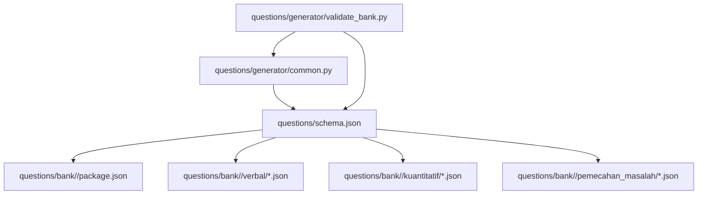
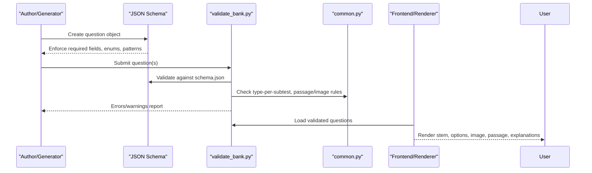
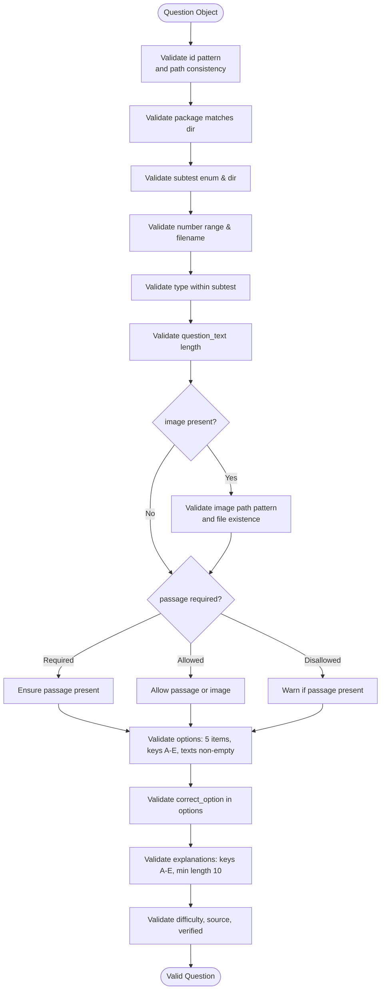
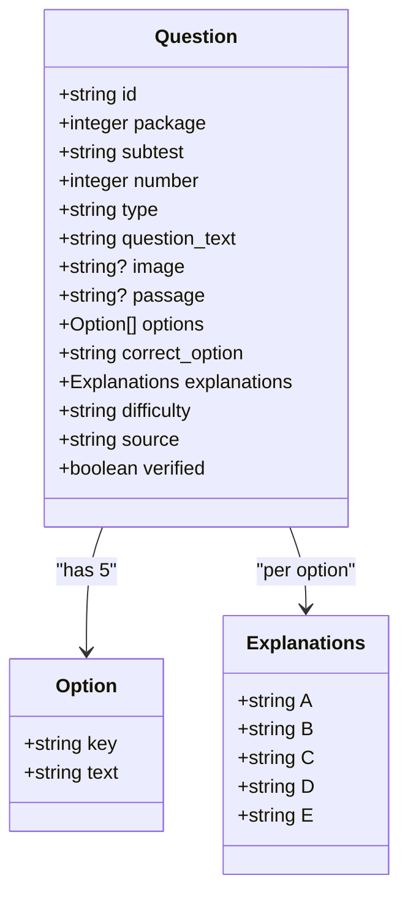
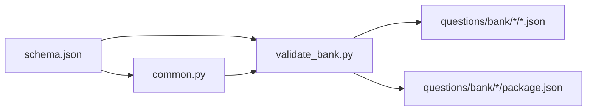

# Question Schema Definition

<cite>
**Referenced Files in This Document**
- [schema.json](file://questions/schema.json)
- [common.py](file://questions/generator/common.py)
- [validate_bank.py](file://questions/generator/validate_bank.py)
- [package.json](file://questions/bank/1/package.json)
- [verbal 001.json](file://questions/bank/1/verbal/001.json)
- [kuantitatif 001.json](file://questions/bank/1/kuantitatif/001.json)
- [pemecahan_masalah 001.json](file://questions/bank/1/pemecahan_masalah/001.json)
- [verbal 023.json](file://questions/bank/1/verbal/023.json)
- [kuantitatif 025.json](file://questions/bank/1/kuantitatif/025.json)
- [pemecahan_masalah 012.json](file://questions/bank/1/pemecahan_masalah/012.json)
</cite>

## Table of Contents
1. Introduction
2. Project Structure
3. Core Components
4. Architecture Overview
5. Detailed Component Analysis
6. Dependency Analysis
7. Performance Considerations
8. Troubleshooting Guide
9. Conclusion

## Introduction
This document defines the JSON schema that governs test questions in the TBS LPDP system. It explains every required field, validation rules, and constraints, including pattern matching for IDs, enum restrictions for subtests and question types, length requirements for text content, and the five-option format (A–E). It also clarifies how explanations are structured per option, how passages and images relate to rendering logic, and how the schema enforces data integrity across the entire question lifecycle from authoring to validation and delivery.

## Project Structure
The question bank is organized by package and subtest:
- Each package directory contains a manifest (package.json) describing the package metadata.
- Under each package are three subtest folders: verbal, kuantitatif, pemecahan_masalah.
- Each question is stored as a single JSON file named with a three-digit number corresponding to its number field.
- A central JSON Schema (schema.json) defines the contract for every question object.
- Generator utilities and validators enforce additional business rules beyond the schema.

**Diagram sources**
- [schema.json:1-98](file://questions/schema.json#L1-L98)
- [common.py:13-17](file://questions/generator/common.py#L13-L17)
- [validate_bank.py:29-41](file://questions/generator/validate_bank.py#L29-L41)

**Section sources**
- [schema.json:1-98](file://questions/schema.json#L1-L98)
- [package.json:1-10](file://questions/bank/1/package.json#L1-L10)
- [common.py:13-17](file://questions/generator/common.py#L13-L17)
- [validate_bank.py:44-194](file://questions/generator/validate_bank.py#L44-L194)

## Core Components
At the heart of the system is a single JSON Schema that defines a question object with these required fields:
- id: Stable identifier derived from path; must match a strict pattern.
- package: Integer package ID (minimum 1).
- subtest: One of verbal, kuantitatif, pemecahan_masalah.
- number: Integer between 1 and 25 inclusive.
- type: Enumerated question type; allowed combinations per subtest are enforced by generator logic.
- question_text: String with minimum length 5.
- image: Optional string or null; if present, must match a relative path pattern under images/.
- passage: Optional string or null; used for shared stimuli such as reading passages or pipe-delimited tables.
- options: Array of exactly five items, each an object with key (A–E) and text (non-empty).
- correct_option: One of A–E.
- explanations: Object with keys A–E, each a non-empty string with minimum length 10.
- difficulty: One of easy, medium, hard.
- source: Non-empty string indicating origin.
- verified: Boolean flag.

Validation highlights:
- id pattern: <package>-<subtest>-<NNN>, where NNN is a three-digit number.
- subtest enum: verbal | kuantitatif | pemecahan_masalah.
- type enum: specific to subtest via generator mapping; schema allows all defined types but cross-checks occur in code.
- options: exactly five entries with ordered keys A through E.
- explanations: one explanation per option key, each at least 10 characters.
- image: when provided, must be a relative path under images/ with supported extensions.
- passage: optional; required for certain types (e.g., reading, analisis_teks), or allowed only for specific types.

Examples of valid structures:
- Verbal synonym item: see [verbal 001.json:1-29](file://questions/bank/1/verbal/001.json#L1-L29).
- Quantitative arithmetic item: see [kuantitatif 001.json:1-44](file://questions/bank/1/kuantitatif/001.json#L1-L44).
- Problem-solving logical reasoning item: see [pemecahan_masalah 001.json:1-44](file://questions/bank/1/pemecahan_masalah/001.json#L1-L44).
- Reading comprehension with passage: see [verbal 023.json:1-44](file://questions/bank/1/verbal/023.json#L1-L44).
- Geometry with image stimulus: see [kuantitatif 025.json:1-44](file://questions/bank/1/kuantitatif/025.json#L1-L44).
- Case-based reasoning: see [pemecahan_masalah 012.json:1-44](file://questions/bank/1/pemecahan_masalah/012.json#L1-L44).

**Section sources**
- [schema.json:7-95](file://questions/schema.json#L7-L95)
- [verbal 001.json:1-29](file://questions/bank/1/verbal/001.json#L1-L29)
- [kuantitatif 001.json:1-44](file://questions/bank/1/kuantitatif/001.json#L1-L44)
- [pemecahan_masalah 001.json:1-44](file://questions/bank/1/pemecahan_masalah/001.json#L1-L44)
- [verbal 023.json:1-44](file://questions/bank/1/verbal/023.json#L1-L44)
- [kuantitatif 025.json:1-44](file://questions/bank/1/kuantitatif/025.json#L1-L44)
- [pemecahan_masalah 012.json:1-44](file://questions/bank/1/pemecahan_masalah/012.json#L1-L44)

## Architecture Overview
The question lifecycle spans authoring, generation, validation, and rendering:
- Authoring and generation produce question objects conforming to the schema.
- Validation scripts check schema compliance and additional business rules (type-per-subtest, passage/image usage, numbering, image existence).
- Rendering logic consumes validated questions to display stems, options, images, passages, and explanations.

**Diagram sources**
- [schema.json:1-98](file://questions/schema.json#L1-L98)
- [validate_bank.py:44-194](file://questions/generator/validate_bank.py#L44-L194)
- [common.py:29-68](file://questions/generator/common.py#L29-L68)

## Detailed Component Analysis

### Field-by-Field Validation Rules
- id: Must match pattern ^[0-9]+-(verbal|kuantitatif|pemecahan_masalah)-[0-9]{3}$. The validator ensures it equals the constructed expected ID from package, subtest, and filename number.
- package: Integer ≥ 1; must match the package directory name.
- subtest: Enum restricted to verbal, kuantitatif, pemecahan_masalah; must match the subtest folder name.
- number: Integer 1–25; must match the three-digit filename stem; uniqueness and no gaps enforced per subtest.
- type: Enum constrained by subtest via TYPES_BY_SUBTEST; e.g., verbal supports sinonim, antonim, analogi, silogisme, kalimat_efektif, reading; kuantitatif supports aritmetika, aljabar, deret_angka, deret_huruf, perbandingan_kuantitatif, kecukupan_data, peluang_kombinatorik, soal_cerita, geometri; pemecahan_masalah supports logika_analitis, penalaran_kasus, silogisme, interpretasi_data, analisis_teks, soal_cerita, peluang_kombinatorik.
- question_text: String minLength 5.
- image: String or null; if string, must match ^images/[^/]+\.(png|jpg|jpeg|svg|webp)$; validator checks file existence under package/images/.
- passage: String or null; required for types reading and analisis_teks; allowed for interpretasi_data (or image); disallowed for self-contained types (warnings if present).
- options: Array of exactly 5 items; each item has key in {A,B,C,D,E} and text minLength 1; order must be A→E.
- correct_option: Enum A–E; must be present in options keys.
- explanations: Object with required keys A–E; each value string minLength 10.
- difficulty: Enum easy, medium, hard.
- source: String minLength 1.
- verified: Boolean.

**Diagram sources**
- [schema.json:24-95](file://questions/schema.json#L24-L95)
- [validate_bank.py:110-147](file://questions/generator/validate_bank.py#L110-L147)
- [common.py:29-68](file://questions/generator/common.py#L29-L68)

**Section sources**
- [schema.json:24-95](file://questions/schema.json#L24-L95)
- [validate_bank.py:110-147](file://questions/generator/validate_bank.py#L110-L147)
- [common.py:29-68](file://questions/generator/common.py#L29-L68)

### Five-Option Format and Explanations
- Options must be an array of exactly five objects with keys A, B, C, D, E in that order. Each option has a text field that must be non-empty.
- correct_option must reference one of those keys.
- explanations must include all five keys with detailed text (min length 10) explaining correctness or common misconceptions for each option.

Example references:
- Verbal synonym with full explanations: [verbal 001.json:10-24](file://questions/bank/1/verbal/001.json#L10-L24).
- Quantitative arithmetic with explanations: [kuantitatif 001.json:10-39](file://questions/bank/1/kuantitatif/001.json#L10-L39).
- Logical reasoning with explanations: [pemecahan_masalah 001.json:10-39](file://questions/bank/1/pemecahan_masalah/001.json#L10-L39).

**Section sources**
- [schema.json:66-91](file://questions/schema.json#L66-L91)
- [verbal 001.json:10-24](file://questions/bank/1/verbal/001.json#L10-L24)
- [kuantitatif 001.json:10-39](file://questions/bank/1/kuantitatif/001.json#L10-L39)
- [pemecahan_masalah 001.json:10-39](file://questions/bank/1/pemecahan_masalah/001.json#L10-L39)

### Relationship Between Metadata and Rendering Logic
- Subtest and type determine which rendering components are used (e.g., reading vs arithmetic).
- passage is rendered above the stem for reading and analisis_teks; for interpretasi_data, passage may contain a pipe-delimited table or an image chart may be used.
- image is displayed alongside the stem when present; validator ensures the referenced file exists.
- options and correct_option drive interactive selection and feedback; explanations provide per-option rationale.
- difficulty influences package-level difficulty calculation and can affect sequencing or presentation strategies.

**Diagram sources**
- [schema.json:23-95](file://questions/schema.json#L23-L95)

**Section sources**
- [common.py:60-68](file://questions/generator/common.py#L60-L68)
- [validate_bank.py:130-147](file://questions/generator/validate_bank.py#L130-L147)

### Examples Across Question Types
- Verbal (reading): Uses passage to provide context; example shows passage-driven comprehension. See [verbal 023.json:1-44](file://questions/bank/1/verbal/023.json#L1-L44).
- Quantitative (geometri): Uses image to illustrate geometry; example demonstrates visual stimulus integration. See [kuantitatif 025.json:1-44](file://questions/bank/1/kuantitatif/025.json#L1-L44).
- Problem-solving (penalaran_kasus): Self-contained stem with analytical reasoning; example illustrates case-based evaluation. See [pemecahan_masalah 012.json:1-44](file://questions/bank/1/pemecahan_masalah/012.json#L1-L44).

**Section sources**
- [verbal 023.json:1-44](file://questions/bank/1/verbal/023.json#L1-L44)
- [kuantitatif 025.json:1-44](file://questions/bank/1/kuantitatif/025.json#L1-L44)
- [pemecahan_masalah 012.json:1-44](file://questions/bank/1/pemecahan_masalah/012.json#L1-L44)

## Dependency Analysis
The schema is consumed by both generator utilities and the validator:
- common.py loads the schema and provides helper functions for constructing and writing questions, enforcing option ordering and type-per-subtest constraints.
- validate_bank.py uses jsonschema Draft202012Validator to enforce schema rules and adds business validations (path consistency, image existence, passage/image rules, numbering integrity, blueprint counts).

**Diagram sources**
- [schema.json:1-98](file://questions/schema.json#L1-L98)
- [common.py:130-132](file://questions/generator/common.py#L130-L132)
- [validate_bank.py:29-41](file://questions/generator/validate_bank.py#L29-L41)

**Section sources**
- [common.py:130-132](file://questions/generator/common.py#L130-L132)
- [validate_bank.py:44-194](file://questions/generator/validate_bank.py#L44-L194)

## Performance Considerations
- Schema validation is lightweight and runs per question; batch validation iterates over all files once.
- Image existence checks add filesystem I/O; ensure images are correctly placed to avoid repeated failures.
- Numbering checks and blueprint enforcement run per package/subtest; keep numbering contiguous to minimize validation overhead.
- For large banks, consider parallelizing validation across packages while maintaining deterministic reporting.

## Troubleshooting Guide
Common issues and resolutions:
- Invalid id: Ensure id matches pattern and equals expected constructed ID from package, subtest, and number. See [validate_bank.py:110-120](file://questions/generator/validate_bank.py#L110-L120).
- Wrong subtest or type: Verify subtest enum and type-per-subset mapping. See [validate_bank.py:127-128](file://questions/generator/validate_bank.py#L127-L128) and [common.py:29-58](file://questions/generator/common.py#L29-L58).
- Missing or extra options: Ensure exactly five options with keys A–E in order. See [validate_bank.py:122-126](file://questions/generator/validate_bank.py#L122-L126).
- Incorrect correct_option: Must be one of the option keys. See [validate_bank.py:125-126](file://questions/generator/validate_bank.py#L125-L126).
- Passage/image misuse: For reading/analisis_teks, passage is required; for interpretasi_data, either passage or image must exist; self-contained types should not have passage. See [validate_bank.py:130-139](file://questions/generator/validate_bank.py#L130-L139) and [common.py:60-68](file://questions/generator/common.py#L60-L68).
- Referenced image missing: Ensure image path matches pattern and file exists under package/images/. See [validate_bank.py:141-144](file://questions/generator/validate_bank.py#L141-L144).
- Numbering gaps/duplicates: Ensure unique, contiguous numbers per subtest. See [validate_bank.py:149-163](file://questions/generator/validate_bank.py#L149-L163).
- Package difficulty mismatch: Difficulty must match calculated band based on question difficulties. See [validate_bank.py:172-185](file://questions/generator/validate_bank.py#L172-L185).

**Section sources**
- [validate_bank.py:110-185](file://questions/generator/validate_bank.py#L110-L185)
- [common.py:60-68](file://questions/generator/common.py#L60-L68)

## Conclusion
The TBS LPDP question schema provides a robust, machine-readable contract ensuring consistent structure, rich metadata, and comprehensive explanations for each question. Combined with generator helpers and a thorough validator, it guarantees data integrity from creation through deployment. By adhering to the field constraints, enum restrictions, and passage/image rules, authors and automated tools can maintain high-quality, render-ready questions across the entire question lifecycle.