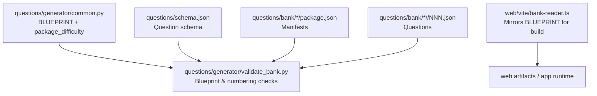
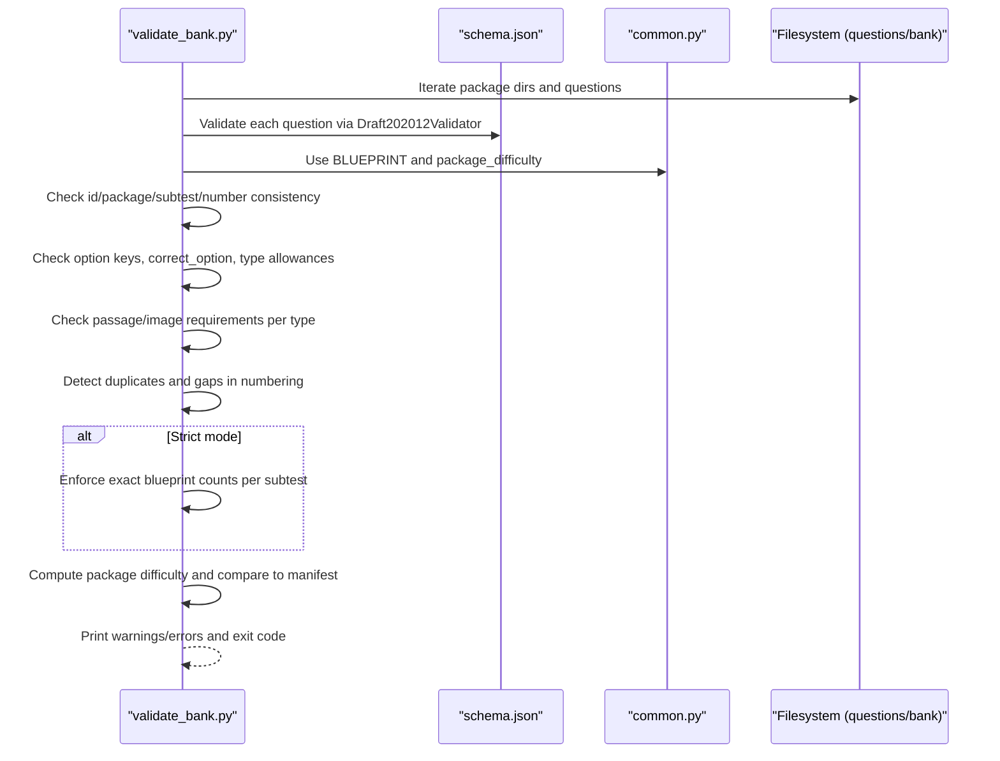
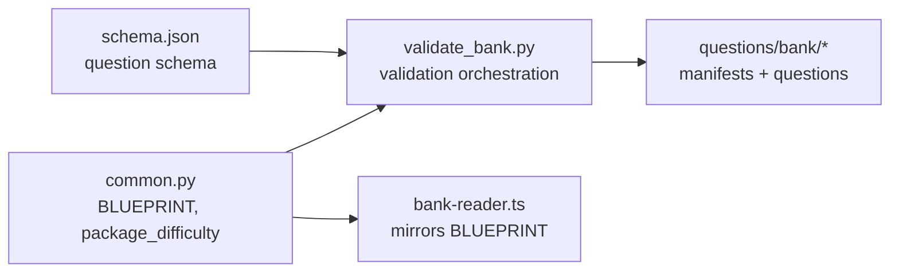

# Blueprint Compliance

<cite>
**Referenced Files in This Document**
- [common.py](file://questions/generator/common.py)
- [validate_bank.py](file://questions/generator/validate_bank.py)
- [schema.json](file://questions/schema.json)
- [bank-reader.ts](file://web/vite/bank-reader.ts)
- [package.json (example)](file://questions/bank/1/package.json)
- [question example](file://questions/bank/1/verbal/001.json)
</cite>

## Table of Contents
1. Introduction
2. Project Structure
3. Core Components
4. Architecture Overview
5. Detailed Component Analysis
6. Dependency Analysis
7. Performance Considerations
8. Troubleshooting Guide
9. Conclusion

## Introduction
This document explains blueprint compliance validation for LPDP exam packages. It covers how the BLUEPRINT defines expected question counts per subtest, how strict mode enforces completeness, how package difficulty is calculated and validated against manifest declarations, and how numbering sequence validation ensures unique, gap-free question numbers within each subtest. It also provides examples of violations, contrasts strict vs non-strict modes, and shows how this validation integrates into overall package quality assurance.

## Project Structure
The blueprint compliance system spans a small set of focused components:
- A shared configuration module that defines the blueprint and difficulty calculation logic.
- A validator script that scans the question bank, enforces schema and blueprint rules, and reports errors/warnings.
- A JSON schema that constrains individual question files.
- A build-time reader that mirrors the blueprint for the web engine and compiles the bank artifact.
- Example package metadata and question files to illustrate structure.

**Diagram sources**
- [common.py:20-24](file://questions/generator/common.py#L20-L24)
- [common.py:77-96](file://questions/generator/common.py#L77-L96)
- [validate_bank.py:44-194](file://questions/generator/validate_bank.py#L44-L194)
- [schema.json:1-98](file://questions/schema.json#L1-L98)
- [bank-reader.ts:23-28](file://web/vite/bank-reader.ts#L23-L28)

**Section sources**
- [common.py:20-24](file://questions/generator/common.py#L20-L24)
- [validate_bank.py:44-194](file://questions/generator/validate_bank.py#L44-L194)
- [schema.json:1-98](file://questions/schema.json#L1-L98)
- [bank-reader.ts:23-28](file://web/vite/bank-reader.ts#L23-L28)

## Core Components
- BLUEPRINT: Defines three subtests with their display names, positions, expected question counts, durations, and passing grades.
- package_difficulty: Computes a deterministic band (easy/medium/hard) from difficulty counts using fixed weights and thresholds.
- validate_bank: Orchestrates full validation including schema conformance, path/id consistency, image existence, passage requirements, duplicate/gap detection, blueprint counts (in strict mode), and manifest difficulty alignment.
- schema.json: Constrains fields like id pattern, allowed types, options, explanations, and difficulty values.
- bank-reader.ts: Mirrors BLUEPRINT for the web build pipeline and emits subtest metadata used by the application.

**Section sources**
- [common.py:20-24](file://questions/generator/common.py#L20-L24)
- [common.py:77-96](file://questions/generator/common.py#L77-L96)
- [validate_bank.py:44-194](file://questions/generator/validate_bank.py#L44-L194)
- [schema.json:1-98](file://questions/schema.json#L1-L98)
- [bank-reader.ts:23-28](file://web/vite/bank-reader.ts#L23-L28)

## Architecture Overview
The validation flow reads every question file, validates it against the schema, checks structural invariants, aggregates counts per package/subtest, and then applies blueprint and difficulty rules. In strict mode, missing or incomplete subtests are flagged as errors.

**Diagram sources**
- [validate_bank.py:44-194](file://questions/generator/validate_bank.py#L44-L194)
- [common.py:20-24](file://questions/generator/common.py#L20-L24)
- [common.py:77-96](file://questions/generator/common.py#L77-L96)
- [schema.json:1-98](file://questions/schema.json#L1-L98)

## Detailed Component Analysis

### BLUEPRINT Configuration
- Defines three subtests: verbal, kuantitatif, pemecahan_masalah.
- Each entry includes name, position, expected question count, duration, and passing grade.
- The same blueprint is mirrored in the web build tooling to ensure consistent UI metadata.

Examples of expectations:
- Verbal expects 23 questions.
- Kuantitatif expects 25 questions.
- Pemecahan Masalah expects 12 questions.

**Section sources**
- [common.py:20-24](file://questions/generator/common.py#L20-L24)
- [bank-reader.ts:23-28](file://web/vite/bank-reader.ts#L23-L28)

### Package Difficulty Calculation
- Uses fixed weights for easy, medium, hard.
- Computes a weighted average and maps it to a band using integer cross-multiplication for deterministic boundaries.
- Returns both the band label and an exact fractional index for reporting.

Validation behavior:
- For complete packages (total equals sum of blueprint counts), the validator compares the manifest’s declared difficulty with the computed band.
- If they differ, an error is reported with the computed index and counts.

**Section sources**
- [common.py:77-96](file://questions/generator/common.py#L77-L96)
- [validate_bank.py:172-185](file://questions/generator/validate_bank.py#L172-L185)

### Numbering Sequence Validation
- Collects all question numbers per (package, subtest).
- Reports duplicates if any number appears more than once.
- Ensures no gaps: numbers must form a contiguous range starting at 1 up to the count of unique numbers.
- Also flags if the total exceeds the blueprint count for that subtest.

**Section sources**
- [validate_bank.py:146-163](file://questions/generator/validate_bank.py#L146-L163)

### Manifest and Schema Alignment
- Validates package manifests exist and contain required fields with correct types and constraints.
- Validates each question against schema.json, including id pattern, allowed types, options, explanations, and difficulty enum.
- Checks that referenced images exist under the package’s images directory.

**Section sources**
- [validate_bank.py:58-94](file://questions/generator/validate_bank.py#L58-L94)
- [validate_bank.py:96-147](file://questions/generator/validate_bank.py#L96-L147)
- [schema.json:1-98](file://questions/schema.json#L1-L98)

### Strict vs Non-Strict Mode
- Non-strict mode: Runs all schema and structural checks; reports over-counts and gaps but does not fail on missing subtests or incomplete counts.
- Strict mode: Adds enforcement that each package must have exactly the blueprint count per subtest and that all three subtests must be present; otherwise, errors are raised.

Usage:
- Run the validator with --strict to enforce blueprint completeness.

**Section sources**
- [validate_bank.py:149-170](file://questions/generator/validate_bank.py#L149-L170)
- [validate_bank.py:197-203](file://questions/generator/validate_bank.py#L197-L203)

### Integration with Overall Quality Assurance
- Schema validation ensures data integrity at the question level.
- Structural checks ensure ids, paths, and references are consistent.
- Blueprint and difficulty checks ensure test design fidelity and manifest accuracy.
- The web build tool mirrors the blueprint so the UI reflects official subtest metadata.

**Section sources**
- [validate_bank.py:44-194](file://questions/generator/validate_bank.py#L44-L194)
- [bank-reader.ts:23-28](file://web/vite/bank-reader.ts#L23-L28)

## Dependency Analysis

**Diagram sources**
- [common.py:20-24](file://questions/generator/common.py#L20-L24)
- [common.py:77-96](file://questions/generator/common.py#L77-L96)
- [validate_bank.py:44-194](file://questions/generator/validate_bank.py#L44-L194)
- [schema.json:1-98](file://questions/schema.json#L1-L98)
- [bank-reader.ts:23-28](file://web/vite/bank-reader.ts#L23-L28)

**Section sources**
- [validate_bank.py:44-194](file://questions/generator/validate_bank.py#L44-L194)
- [common.py:20-24](file://questions/generator/common.py#L20-L24)
- [common.py:77-96](file://questions/generator/common.py#L77-L96)
- [schema.json:1-98](file://questions/schema.json#L1-L98)
- [bank-reader.ts:23-28](file://web/vite/bank-reader.ts#L23-L28)

## Performance Considerations
- Validation iterates all question files once and performs lightweight aggregations; complexity is linear in the number of questions.
- Schema validation uses a single compiled validator instance per run.
- Numbering checks use sets and sorting per (package, subtest), which is efficient for typical subtest sizes.
- Avoid enabling unnecessary logging in CI to keep output concise.

[No sources needed since this section provides general guidance]

## Troubleshooting Guide

Common blueprint violations and how to fix them:
- Duplicate question numbers in a subtest: Ensure each NNN.json has a unique number and that the number field matches the filename.
- Numbering gaps: Fill missing numbers or renumber sequentially from 1 without skipping.
- Exceeding blueprint count: Remove extra questions or adjust the package to match the expected count per subtest.
- Missing subtest in strict mode: Add the required subtest folder with the correct number of questions.
- Manifest difficulty mismatch: Adjust the package difficulty in package.json to match the computed band based on actual question difficulties.

Example references:
- A valid package manifest structure can be seen in the example package metadata.
- A valid question file demonstrates required fields and structure.

**Section sources**
- [validate_bank.py:149-185](file://questions/generator/validate_bank.py#L149-L185)
- [package.json (example):1-10](file://questions/bank/1/package.json#L1-L10)
- [question example:1-29](file://questions/bank/1/verbal/001.json#L1-L29)

## Conclusion
Blueprint compliance validation ensures that LPDP exam packages adhere to official specifications through rigorous checks: schema conformance, structural consistency, numbering integrity, blueprint counts, and difficulty alignment. Strict mode enforces completeness, while non-strict mode supports incremental development. Together with the web build-time blueprint mirroring, these mechanisms provide robust quality assurance across authoring, validation, and deployment.

[No sources needed since this section summarizes without analyzing specific files]