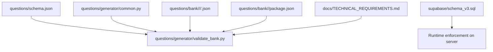
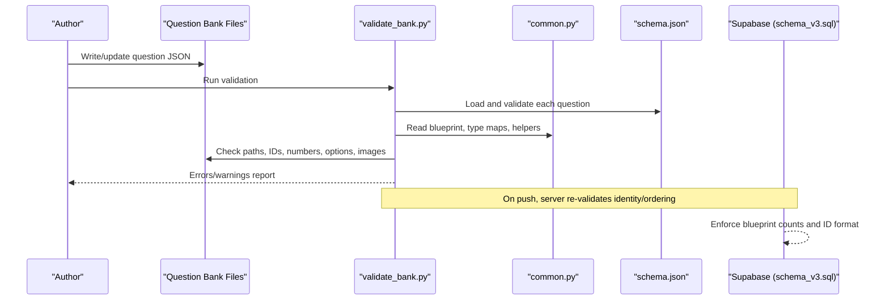
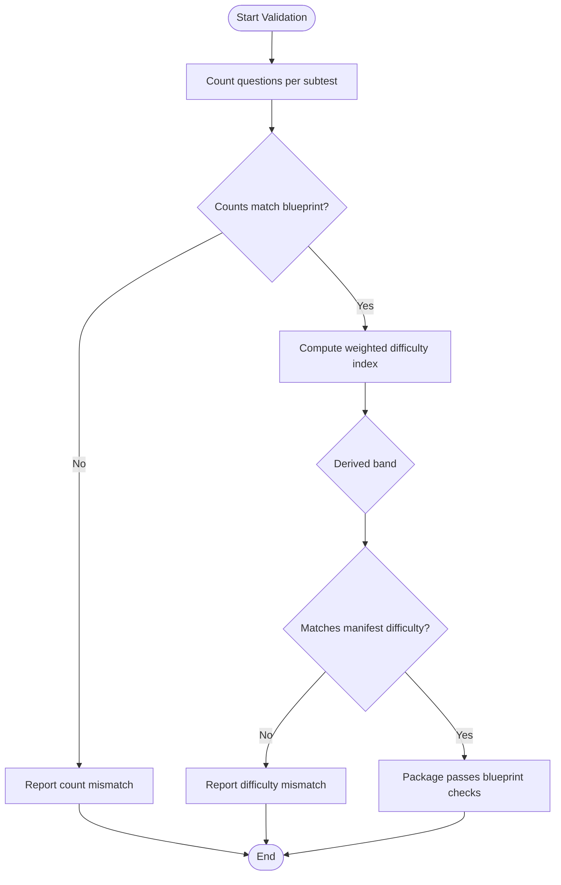
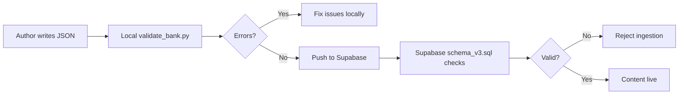
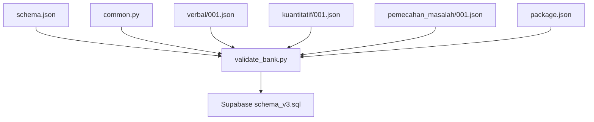

# Business Rule Validation

<cite>
**Referenced Files in This Document**
- [questions/schema.json](file://questions/schema.json)
- [questions/generator/common.py](file://questions/generator/common.py)
- [questions/generator/validate_bank.py](file://questions/generator/validate_bank.py)
- [questions/bank/1/package.json](file://questions/bank/1/package.json)
- [questions/bank/1/verbal/001.json](file://questions/bank/1/verbal/001.json)
- [questions/bank/1/kuantitatif/001.json](file://questions/bank/1/kuantitatif/001.json)
- [questions/bank/1/pemecahan_masalah/001.json](file://questions/bank/1/pemecahan_masalah/001.json)
- [supabase/schema_v3.sql](file://supabase/schema_v3.sql)
- [docs/TECHNICAL_REQUIREMENTS.md](file://docs/TECHNICAL_REQUIREMENTS.md)
</cite>

## Table of Contents
1. Introduction
2. Project Structure
3. Core Components
4. Architecture Overview
5. Detailed Component Analysis
6. Dependency Analysis
7. Performance Considerations
8. Troubleshooting Guide
9. Conclusion

## Introduction
This document explains the business rule validation system that enforces domain-specific constraints for the LPDP TBS question bank beyond basic JSON schema validation. It covers:
- Type compatibility with subtests (verbal, quantitative, problem-solving)
- Stimulus-based requirements (passage and image rules)
- Option key formatting and correctness
- Blueprint compliance (package completeness and difficulty distribution alignment)
- Examples of violations, workflows, and integration points across the pipeline

The goal is to make these rules clear and actionable for authors, reviewers, and CI systems.

## Project Structure
At a high level, validation spans three layers:
- Schema layer: defines the shape and allowed values for each question file.
- Domain rules layer: enforces type-to-subtest mapping, stimulus presence, option keys, numbering, and image references.
- Blueprint layer: ensures package counts per subtest and package-level difficulty band match expectations.

**Diagram sources**
- [questions/schema.json:1-98](file://questions/schema.json#L1-L98)
- [questions/generator/common.py:1-218](file://questions/generator/common.py#L1-L218)
- [questions/generator/validate_bank.py:1-208](file://questions/generator/validate_bank.py#L1-L208)
- [supabase/schema_v3.sql:1264-1342](file://supabase/schema_v3.sql#L1264-L1342)
- [docs/TECHNICAL_REQUIREMENTS.md:52-89](file://docs/TECHNICAL_REQUIREMENTS.md#L52-L89)

**Section sources**
- [questions/schema.json:1-98](file://questions/schema.json#L1-L98)
- [questions/generator/common.py:1-218](file://questions/generator/common.py#L1-L218)
- [questions/generator/validate_bank.py:1-208](file://questions/generator/validate_bank.py#L1-L208)
- [docs/TECHNICAL_REQUIREMENTS.md:52-89](file://docs/TECHNICAL_REQUIREMENTS.md#L52-L89)

## Core Components
- JSON Schema: Defines required fields, types, enums, patterns, and structural constraints for each question.
- Domain Rules (common.py): Encodes blueprint counts, allowed types per subtest, passage/image rules, and helper utilities (e.g., package difficulty calculation).
- Validator (validate_bank.py): Orchestrates schema validation, path-to-metadata consistency, option key checks, stimulus checks, image existence, numbering uniqueness and gaps, blueprint counts, and difficulty band alignment.
- Server-side enforcement (schema_v3.sql): Re-validates critical identity and ordering constraints when content is ingested into Supabase.

Key responsibilities:
- Ensure every question conforms to the schema.
- Enforce type-to-subtest compatibility.
- Require or forbid passages/images based on question type.
- Validate option keys are exactly A–E in order and correct_option is present.
- Guarantee unique, gap-free numbering per subtest within a package.
- Verify referenced images exist under the package’s images directory.
- Check blueprint counts and package difficulty band.

**Section sources**
- [questions/schema.json:1-98](file://questions/schema.json#L1-L98)
- [questions/generator/common.py:19-96](file://questions/generator/common.py#L19-L96)
- [questions/generator/validate_bank.py:44-194](file://questions/generator/validate_bank.py#L44-L194)
- [supabase/schema_v3.sql:1264-1342](file://supabase/schema_v3.sql#L1264-L1342)

## Architecture Overview
The validation pipeline integrates schema conformance, domain rules, and blueprint checks before content is accepted into production.

**Diagram sources**
- [questions/generator/validate_bank.py:44-194](file://questions/generator/validate_bank.py#L44-L194)
- [questions/generator/common.py:19-96](file://questions/generator/common.py#L19-L96)
- [questions/schema.json:1-98](file://questions/schema.json#L1-L98)
- [supabase/schema_v3.sql:1264-1342](file://supabase/schema_v3.sql#L1264-L1342)

## Detailed Component Analysis

### Question Schema Constraints
- Required fields include id, package, subtest, number, type, question_text, image, passage, options, correct_option, explanations, difficulty, source, verified.
- id must follow a stable pattern derived from package, subtest, and zero-padded number.
- subtest must be one of verbal, kuantitatif, pemecahan_masalah.
- type is constrained to an enumerated set; cross-type/subtest compatibility is enforced by domain rules, not schema alone.
- image must be null or a relative path matching the expected pattern under images/.
- passage must be null except for specific types; when used, it carries shared stimuli (text tables or reading passages).
- options must be an array of exactly five items with keys A–E and non-empty text.
- correct_option must be one of A–E.
- explanations must cover all five options with non-empty strings.
- difficulty must be easy, medium, or hard.

These constraints form the baseline; business rules add stricter, domain-specific checks.

**Section sources**
- [questions/schema.json:1-98](file://questions/schema.json#L1-L98)

### Type Compatibility with Subtests
- Allowed types per subtest are defined centrally and enforced during validation.
- Verbal supports synonym, antonym, analogy, syllogism, effective sentence, and reading comprehension.
- Quantitative supports arithmetic, algebra, number sequences, letter sequences, quantitative comparison, data sufficiency, probability/combinatorics, word problems, and geometry.
- Problem-solving supports analytical logic, case reasoning, syllogism, data interpretation, text analysis, word problems, and probability/combinatorics.

Violations occur when a question’s type does not belong to its declared subtest.

**Section sources**
- [questions/generator/common.py:26-58](file://questions/generator/common.py#L26-L58)
- [questions/generator/validate_bank.py:127-128](file://questions/generator/validate_bank.py#L127-L128)

### Stimulus-Based Requirements (Passage and Image)
- Some types require a shared stimulus in passage (reading comprehension and text analysis).
- Data interpretation may carry its stimulus either as a pipe-delimited table in passage or as a chart in image.
- Self-contained types must not carry a passage; if they do, a warning is raised.

Validation enforces:
- Required passage for certain types.
- Either passage or image for data interpretation.
- No passage for self-contained types (warning only).

**Section sources**
- [questions/generator/common.py:60-68](file://questions/generator/common.py#L60-L68)
- [questions/generator/validate_bank.py:130-139](file://questions/generator/validate_bank.py#L130-L139)

### Option Key Formatting and Correctness
- Options must have keys exactly A, B, C, D, E in that order.
- correct_option must be among the option keys.
- Explanations must cover all five options.

These checks prevent malformed answer sets and ensure consistent rendering and grading.

**Section sources**
- [questions/schema.json:66-80](file://questions/schema.json#L66-L80)
- [questions/generator/validate_bank.py:122-126](file://questions/generator/validate_bank.py#L122-L126)

### Image Reference Validation
- If a question references an image, the file must exist under the package’s images directory.
- The validator resolves the path relative to the package root and reports missing images.

This prevents broken visuals in the exam interface.

**Section sources**
- [questions/schema.json:57-61](file://questions/schema.json#L57-L61)
- [questions/generator/validate_bank.py:141-144](file://questions/generator/validate_bank.py#L141-L144)

### Numbering, Uniqueness, and Gaps
- For each package and subtest, question numbers must be unique and contiguous starting at 1.
- Duplicate numbers or gaps trigger errors.
- The validator also verifies that the number field matches the filename stem.

**Section sources**
- [questions/generator/validate_bank.py:146-163](file://questions/generator/validate_bank.py#L146-L163)

### Blueprint Compliance: Package Completeness and Difficulty Distribution
- Each package must contain the expected number of questions per subtest (verbal 23, quantitative 25, problem-solving 12).
- In strict mode, missing subtests or incorrect counts are flagged.
- Package difficulty band is computed from the distribution of easy/medium/hard questions using deterministic thresholds and must match the manifest’s declared difficulty.

**Diagram sources**
- [questions/generator/common.py:19-24](file://questions/generator/common.py#L19-L24)
- [questions/generator/common.py:77-96](file://questions/generator/common.py#L77-L96)
- [questions/generator/validate_bank.py:172-185](file://questions/generator/validate_bank.py#L172-L185)

**Section sources**
- [questions/generator/common.py:19-24](file://questions/generator/common.py#L19-L24)
- [questions/generator/common.py:77-96](file://questions/generator/common.py#L77-L96)
- [questions/generator/validate_bank.py:149-185](file://questions/generator/validate_bank.py#L149-L185)

### Integration with the Overall Validation Pipeline
- Local validation: run the validator against the git question bank to catch issues early.
- Server-side validation: upon ingestion, Supabase functions enforce identity, ordering, and blueprint constraints, providing a second line of defense.
- Documentation and agent guidelines reference these rules to guide authoring and review.

**Diagram sources**
- [questions/generator/validate_bank.py:197-203](file://questions/generator/validate_bank.py#L197-L203)
- [supabase/schema_v3.sql:1264-1342](file://supabase/schema_v3.sql#L1264-L1342)
- [docs/TECHNICAL_REQUIREMENTS.md:79-89](file://docs/TECHNICAL_REQUIREMENTS.md#L79-L89)

**Section sources**
- [docs/TECHNICAL_REQUIREMENTS.md:79-89](file://docs/TECHNICAL_REQUIREMENTS.md#L79-L89)
- [supabase/schema_v3.sql:1264-1342](file://supabase/schema_v3.sql#L1264-L1342)

## Dependency Analysis
- validate_bank.py depends on common.py for blueprint constants, type mappings, and helpers.
- Both rely on schema.json for structural validation.
- Example question files demonstrate valid structures and usage of optional fields like image and passage.
- Supabase schema re-enforces critical constraints at ingestion time.

**Diagram sources**
- [questions/schema.json:1-98](file://questions/schema.json#L1-L98)
- [questions/generator/common.py:1-218](file://questions/generator/common.py#L1-L218)
- [questions/generator/validate_bank.py:1-208](file://questions/generator/validate_bank.py#L1-L208)
- [questions/bank/1/verbal/001.json:1-29](file://questions/bank/1/verbal/001.json#L1-L29)
- [questions/bank/1/kuantitatif/001.json:1-44](file://questions/bank/1/kuantitatif/001.json#L1-L44)
- [questions/bank/1/pemecahan_masalah/001.json:1-44](file://questions/bank/1/pemecahan_masalah/001.json#L1-L44)
- [questions/bank/1/package.json:1-10](file://questions/bank/1/package.json#L1-L10)
- [supabase/schema_v3.sql:1264-1342](file://supabase/schema_v3.sql#L1264-L1342)

**Section sources**
- [questions/generator/validate_bank.py:31-41](file://questions/generator/validate_bank.py#L31-L41)
- [questions/generator/common.py:19-96](file://questions/generator/common.py#L19-L96)

## Performance Considerations
- Validation runs once per package or full bank; complexity scales linearly with the number of question files.
- Schema validation is efficient via a dedicated library.
- Image existence checks involve filesystem lookups; batch them per package where possible.
- Blueprint counting and difficulty computation are O(n) over questions per package.

[No sources needed since this section provides general guidance]

## Troubleshooting Guide
Common business rule violations and how to resolve them:

- Wrong type for subtest
  - Symptom: error stating type not allowed in subtest.
  - Fix: move the question to a subtest where the type is permitted, or change the type to match the subtest.

- Missing required passage
  - Symptom: error requiring passage for reading or text analysis.
  - Fix: add a passage containing the shared stimulus.

- Data interpretation without stimulus
  - Symptom: error requiring either passage or image for data interpretation.
  - Fix: provide a pipe-delimited table in passage or attach a chart image.

- Stray passage on self-contained type
  - Symptom: warning about carrying a passage for a self-contained type.
  - Fix: remove the passage unless it is genuinely required by the type.

- Invalid option keys or missing correct_option
  - Symptom: error indicating option keys must be A–E in order or correct_option not among options.
  - Fix: reorder options to A–E and ensure correct_option matches one of them.

- Missing explanations for options
  - Symptom: schema error indicating explanations must cover all five options.
  - Fix: add explanations for A–E.

- Referenced image not found
  - Symptom: error reporting missing image file.
  - Fix: place the image under the package’s images directory and update the path.

- Duplicate or gapped question numbers
  - Symptom: error reporting duplicates or gaps in numbering.
  - Fix: ensure numbers are unique and contiguous from 1 to N per subtest.

- Blueprint count mismatch
  - Symptom: error exceeding or missing expected question counts per subtest.
  - Fix: adjust the number of questions to match the blueprint; use strict mode to enforce exact counts.

- Package difficulty band mismatch
  - Symptom: error indicating manifest difficulty differs from calculated band.
  - Fix: adjust the distribution of easy/medium/hard questions or correct the manifest’s difficulty label.

**Section sources**
- [questions/generator/validate_bank.py:122-185](file://questions/generator/validate_bank.py#L122-L185)
- [questions/schema.json:57-95](file://questions/schema.json#L57-L95)

## Conclusion
The business rule validation system combines schema conformance, domain-specific checks, and blueprint compliance to ensure high-quality, consistent question packages. By enforcing type compatibility, stimulus requirements, option formatting, image integrity, numbering continuity, and difficulty alignment, the system protects both authoring quality and runtime reliability. Integrating local validation with server-side checks creates a robust pipeline that catches issues early and prevents invalid content from reaching users.

[No sources needed since this section summarizes without analyzing specific files]