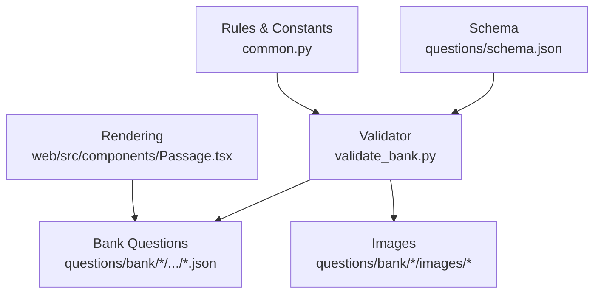
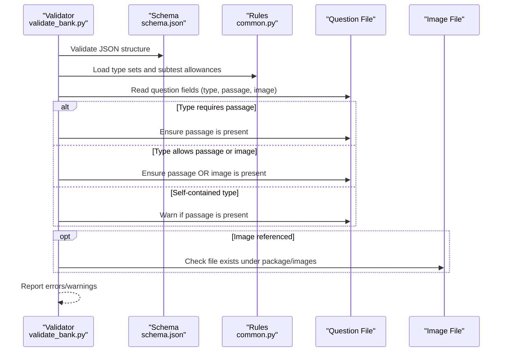
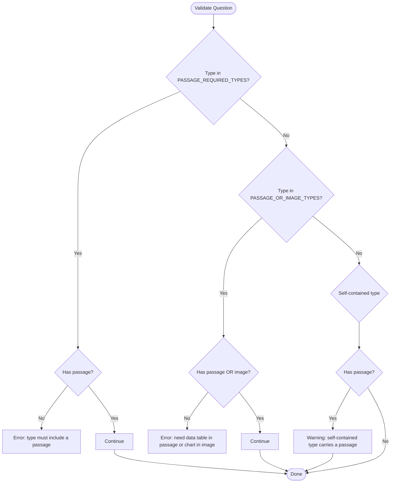
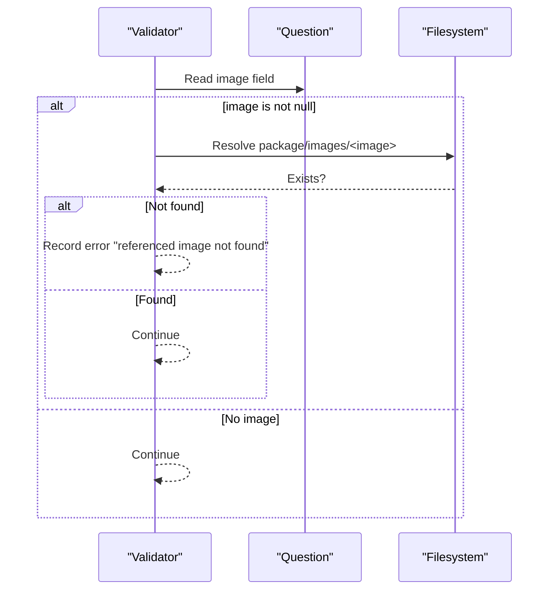
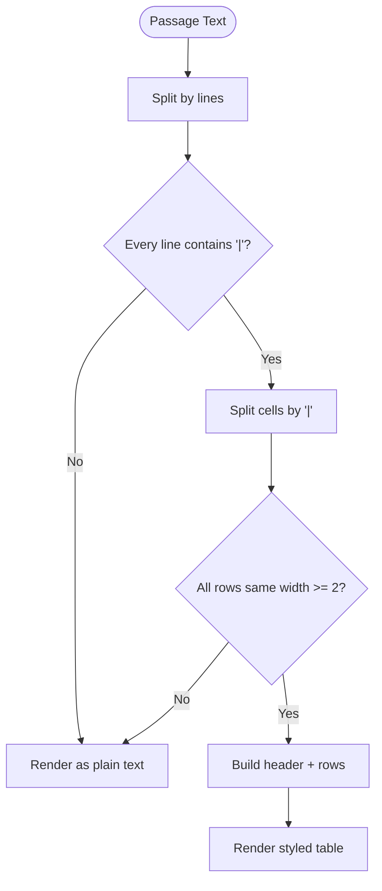
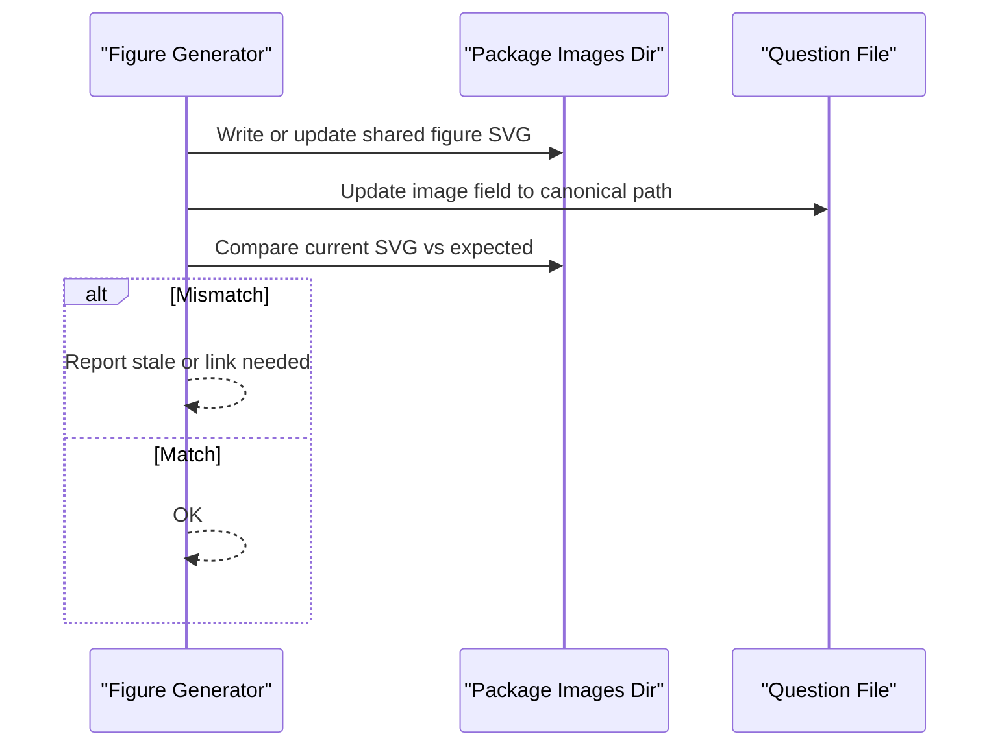
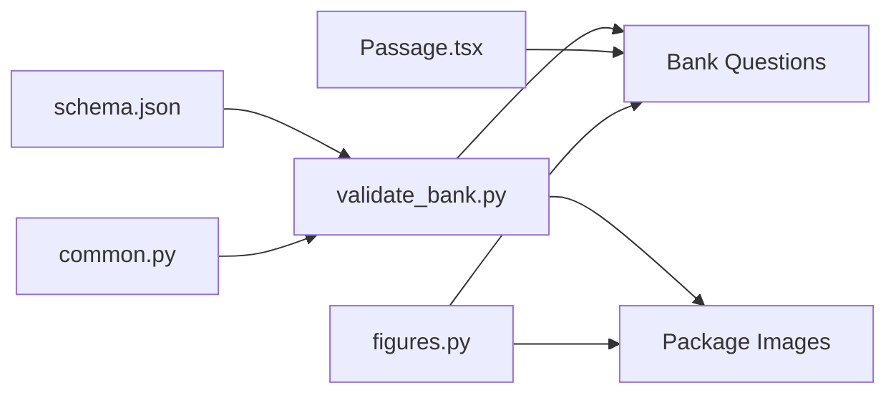

# Passage and Image Validation

<cite>
**Referenced Files in This Document**
- [validate_bank.py](file://questions/generator/validate_bank.py)
- [common.py](file://questions/generator/common.py)
- [schema.json](file://questions/schema.json)
- [Passage.tsx](file://web/src/components/Passage.tsx)
- [figures.py](file://questions/generator/figures.py)
- [017.json](file://questions/bank/1/verbal/017.json)
- [009.json](file://questions/bank/10/pemecahan_masalah/009.json)
- [011.json](file://questions/bank/10/pemecahan_masalah/011.json)
</cite>

## Table of Contents
1. Introduction
2. Project Structure
3. Core Components
4. Architecture Overview
5. Detailed Component Analysis
6. Dependency Analysis
7. Performance Considerations
8. Troubleshooting Guide
9. Conclusion

## Introduction
This document explains the validation rules that enforce stimulus-based question requirements for passages and images. It covers:
- How PASSAGE_REQUIRED_TYPES, PASSAGE_OR_IMAGE_TYPES, and PASSAGE_ALLOWED_TYPES control whether a question must include a passage or may use an image instead.
- How image file reference validation ensures referenced images exist in the package’s images directory.
- The distinction between self-contained questions and those requiring passages or data tables.
- Examples of passage validation scenarios, image reference checking, and error handling for missing or invalid stimuli.

## Project Structure
The validation logic spans three layers:
- Schema layer: defines required fields and formats for questions (including image path pattern and passage field).
- Rules layer: defines which question types require or allow passages and how to validate them.
- Execution layer: runs schema checks and rule checks across the question bank, including image existence verification.

**Diagram sources**
- [schema.json:1-98](file://questions/schema.json#L1-L98)
- [validate_bank.py:1-208](file://questions/generator/validate_bank.py#L1-L208)
- [common.py:1-218](file://questions/generator/common.py#L1-L218)
- [Passage.tsx:1-74](file://web/src/components/Passage.tsx#L1-L74)

**Section sources**
- [schema.json:1-98](file://questions/schema.json#L1-L98)
- [validate_bank.py:1-208](file://questions/generator/validate_bank.py#L1-L208)
- [common.py:1-218](file://questions/generator/common.py#L1-L218)

## Core Components
- Question schema enforces required fields such as id, type, options, correct_option, explanations, difficulty, source, verified, plus optional but constrained fields like image and passage.
- Rule constants define stimulus requirements per question type:
  - PASSAGE_REQUIRED_TYPES: reading, analisis_teks
  - PASSAGE_OR_IMAGE_TYPES: interpretasi_data
  - PASSAGE_ALLOWED_TYPES: union of the above; all other types are self-contained and should not carry a passage.
- Validator performs:
  - JSON schema validation.
  - Type-to-subtest allowance checks.
  - Stimulus presence checks based on the three type sets.
  - Image file existence checks relative to the package directory.
  - Numbering and blueprint consistency checks.

**Section sources**
- [schema.json:1-98](file://questions/schema.json#L1-L98)
- [common.py:60-68](file://questions/generator/common.py#L60-L68)
- [validate_bank.py:103-145](file://questions/generator/validate_bank.py#L103-L145)

## Architecture Overview
The end-to-end flow validates each question file against both schema and business rules, then verifies external assets (images).

**Diagram sources**
- [validate_bank.py:103-145](file://questions/generator/validate_bank.py#L103-L145)
- [common.py:60-68](file://questions/generator/common.py#L60-L68)
- [schema.json:57-65](file://questions/schema.json#L57-L65)

## Detailed Component Analysis

### Stimulus Requirement Rules
- PASSAGE_REQUIRED_TYPES: reading and analisis_teks must include a non-null passage. If missing, the validator reports an error indicating the type must include a passage.
- PASSAGE_OR_IMAGE_TYPES: interpretasi_data must include either a pipe-delimited table in passage or an image chart. If neither is present, the validator reports an error specifying that a data table in passage or a chart in image is required.
- PASSAGE_ALLOWED_TYPES: only reading, analisis_teks, and interpretasi_data may carry a passage. For any other type, the presence of a passage triggers a warning that the type is self-contained.

**Diagram sources**
- [validate_bank.py:130-139](file://questions/generator/validate_bank.py#L130-L139)
- [common.py:60-68](file://questions/generator/common.py#L60-L68)

**Section sources**
- [validate_bank.py:130-139](file://questions/generator/validate_bank.py#L130-L139)
- [common.py:60-68](file://questions/generator/common.py#L60-L68)

### Image Reference Validation
- When a question includes an image field, the validator resolves the path relative to the package directory and checks that the file exists.
- If the referenced image is missing, an error is reported with the relative image path.
- The schema constrains image paths to a specific pattern and allows null when no image is used.

**Diagram sources**
- [validate_bank.py:141-144](file://questions/generator/validate_bank.py#L141-L144)
- [schema.json:57-61](file://questions/schema.json#L57-L61)

**Section sources**
- [validate_bank.py:141-144](file://questions/generator/validate_bank.py#L141-L144)
- [schema.json:57-61](file://questions/schema.json#L57-L61)

### Passage Rendering and Data Tables
- For interpretasi_data, the passage is stored as a pipe-delimited table. The rendering component parses this text into a structured table when every line has consistent columns; otherwise it renders as plain text.
- This parsing supports proper display of data tables in the UI and distinguishes numeric columns for alignment.

**Diagram sources**
- [Passage.tsx:17-29](file://web/src/components/Passage.tsx#L17-L29)
- [Passage.tsx:31-74](file://web/src/components/Passage.tsx#L31-L74)

**Section sources**
- [Passage.tsx:17-74](file://web/src/components/Passage.tsx#L17-L74)

### Shared Figures and Image Generation
- Generated figures are written into the package’s images directory and linked via a canonical image path.
- A check mode compares generated SVGs against disk files to detect stale or mismatched images.
- Linking ensures questions point to the correct shared figure path.

**Diagram sources**
- [figures.py:1066-1085](file://questions/generator/figures.py#L1066-L1085)
- [figures.py:1211-1240](file://questions/generator/figures.py#L1211-L1240)

**Section sources**
- [figures.py:1066-1085](file://questions/generator/figures.py#L1066-L1085)
- [figures.py:1211-1240](file://questions/generator/figures.py#L1211-L1240)

### Example Scenarios

#### Reading passage requirement
- A reading-type question must include a non-null passage. An example shows a reading question with a multi-paragraph passage embedded directly in the question file.

**Section sources**
- [017.json:1-44](file://questions/bank/1/verbal/017.json#L1-L44)

#### Interpretasi data table in passage
- An interpretasi_data question stores its data table as a pipe-delimited string in the passage field. The validator accepts this as the stimulus for the type.

**Section sources**
- [009.json:1-44](file://questions/bank/10/pemecahan_masalah/009.json#L1-L44)

#### Analisis teks passage requirement
- An analisis_teks question must include a non-null passage containing the argumentative text to be analyzed.

**Section sources**
- [011.json:1-44](file://questions/bank/10/pemecahan_masalah/011.json#L1-L44)

## Dependency Analysis
- validate_bank.py depends on:
  - schema.json for structural validation.
  - common.py for type sets and subtest allowances.
  - Filesystem access to verify image references.
- Passage.tsx depends on the format contract for interpretasi_data passages (pipe-delimited tables).
- figures.py coordinates generation and linking of images consumed by questions.

**Diagram sources**
- [validate_bank.py:1-208](file://questions/generator/validate_bank.py#L1-L208)
- [common.py:1-218](file://questions/generator/common.py#L1-L218)
- [schema.json:1-98](file://questions/schema.json#L1-L98)
- [Passage.tsx:1-74](file://web/src/components/Passage.tsx#L1-L74)
- [figures.py:1066-1240](file://questions/generator/figures.py#L1066-L1240)

**Section sources**
- [validate_bank.py:1-208](file://questions/generator/validate_bank.py#L1-L208)
- [common.py:1-218](file://questions/generator/common.py#L1-L218)
- [schema.json:1-98](file://questions/schema.json#L1-L98)
- [Passage.tsx:1-74](file://web/src/components/Passage.tsx#L1-L74)
- [figures.py:1066-1240](file://questions/generator/figures.py#L1066-L1240)

## Performance Considerations
- Validation runs once per question file; image existence checks add filesystem I/O proportional to the number of questions referencing images.
- Keeping image paths short and centralized reduces resolution overhead.
- Using shared figures avoids duplicate assets and improves cache efficiency during builds.

[No sources needed since this section provides general guidance]

## Troubleshooting Guide
Common issues and their causes:
- Missing passage for reading or analisis_teks:
  - Cause: type is in PASSAGE_REQUIRED_TYPES but passage is null.
  - Fix: Add a non-null passage to the question.
- Missing stimulus for interpretasi_data:
  - Cause: Neither passage nor image provided for a type in PASSAGE_OR_IMAGE_TYPES.
  - Fix: Provide either a pipe-delimited table in passage or an image chart.
- Stray passage in self-contained types:
  - Cause: Non-stimulus types have a passage set.
  - Fix: Remove the passage from self-contained question types.
- Referenced image not found:
  - Cause: image path does not resolve to an existing file under the package’s images directory.
  - Fix: Ensure the image file exists at the specified relative path or update the image field to a valid file.
- Stale or unlinked shared figures:
  - Cause: Generated figure differs from disk or question points to wrong path.
  - Fix: Re-run figure generation and linking tools to synchronize assets and references.

**Section sources**
- [validate_bank.py:130-145](file://questions/generator/validate_bank.py#L130-L145)
- [figures.py:1211-1240](file://questions/generator/figures.py#L1211-L1240)

## Conclusion
The validation system enforces strict stimulus requirements based on question type:
- reading and analisis_teks must include a passage.
- interpretasi_data must include either a passage table or an image chart.
- All other types are self-contained and should not carry a passage.
Image references are validated against the package’s images directory to prevent broken assets. Together, these rules ensure consistent content structure, reliable rendering, and robust quality control across the question bank.