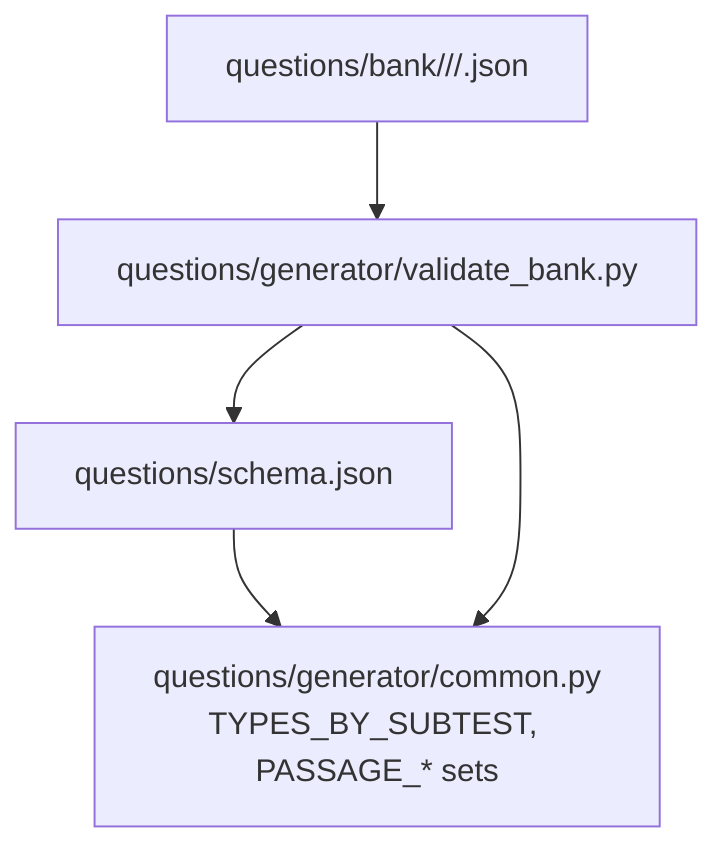
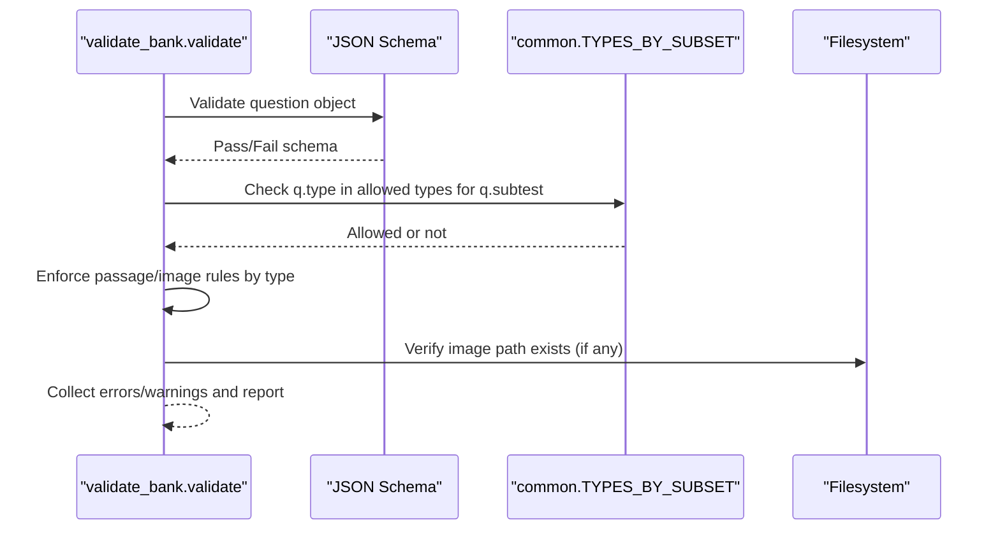
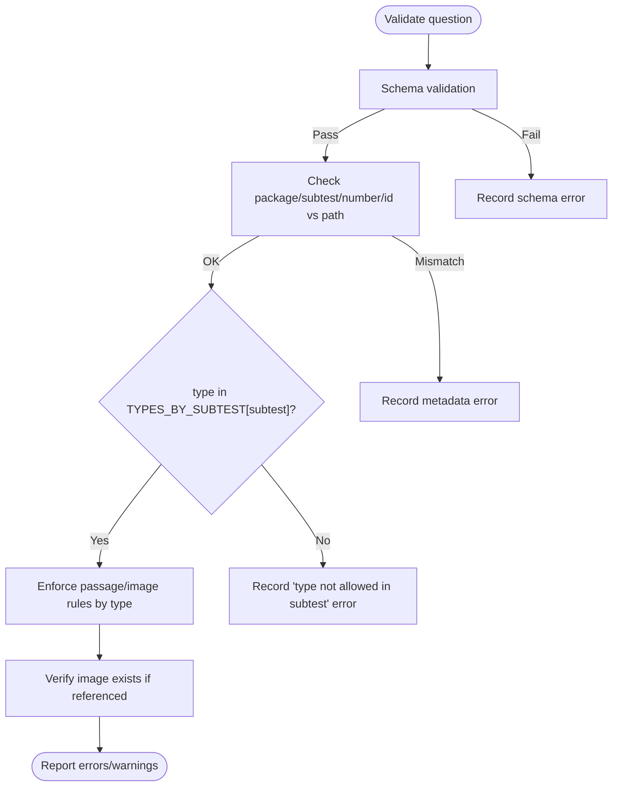
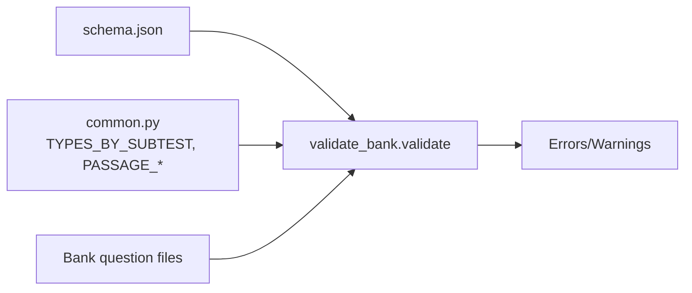

# Question Type Validation

<cite>
**Referenced Files in This Document**
- [common.py](file://questions/generator/common.py)
- [validate_bank.py](file://questions/generator/validate_bank.py)
- [schema.json](file://questions/schema.json)
- [001.json (verbal)](file://questions/bank/1/verbal/001.json)
- [001.json (kuantitatif)](file://questions/bank/1/kuantitatif/001.json)
- [001.json (pemecahan_masalah)](file://questions/bank/1/pemecahan_masalah/001.json)
</cite>

## Table of Contents
1. [Introduction](#introduction)
2. [Project Structure](#project-structure)
3. [Core Components](#core-components)
4. [Architecture Overview](#architecture-overview)
5. [Detailed Component Analysis](#detailed-component-analysis)
6. [Dependency Analysis](#dependency-analysis)
7. [Performance Considerations](#performance-considerations)
8. [Troubleshooting Guide](#troubleshooting-guide)
9. [Conclusion](#conclusion)

## Introduction
This document explains how question type validation ensures that each question is correctly categorized within its subtest: verbal, quantitative (kuantitatif), and problem-solving (pemecahan_masalah). It focuses on the TYPES_BY_SUBTEST mapping, the validation logic that enforces domain-specific constraints, and the relationship between question types and their content requirements such as passages or images. It also provides examples of valid and invalid assignments and describes the error messages produced when a question’s type does not match the expected set for its subtest directory location.

## Project Structure
The validation system spans three main areas:
- Schema definition for question structure and allowed fields.
- Shared constants and helpers defining which question types are allowed per subtest and what content is required.
- A bank validator that checks every question file against the schema, path-based metadata, and domain rules including type-to-subtest enforcement.

**Diagram sources**
- [schema.json:1-98](file://questions/schema.json#L1-L98)
- [common.py:26-68](file://questions/generator/common.py#L26-L68)
- [validate_bank.py:31-41](file://questions/generator/validate_bank.py#L31-L41)

**Section sources**
- [schema.json:1-98](file://questions/schema.json#L1-L98)
- [common.py:26-68](file://questions/generator/common.py#L26-L68)
- [validate_bank.py:31-41](file://questions/generator/validate_bank.py#L31-L41)

## Core Components
- TYPES_BY_SUBTEST defines the allowed question types per subtest.
- PASSAGE_REQUIRED_TYPES and PASSAGE_OR_IMAGE_TYPES define content requirements tied to specific types.
- validate_bank.py enforces:
  - JSON schema compliance.
  - Path-to-metadata consistency (package, subtest, number, id).
  - Type-to-subtest membership via TYPES_BY_SUBTEST.
  - Passage/image requirements based on type.
  - Image existence and numbering integrity.

Key responsibilities:
- common.py: centralizes allowed types and passage rules; used by both generator and validator.
- validate_bank.py: orchestrates validation across all question files and reports errors/warnings.
- schema.json: declares field-level constraints and enumerations for question properties.

**Section sources**
- [common.py:26-68](file://questions/generator/common.py#L26-L68)
- [validate_bank.py:44-147](file://questions/generator/validate_bank.py#L44-L147)
- [schema.json:23-95](file://questions/schema.json#L23-L95)

## Architecture Overview
The validation pipeline processes each question file through layered checks:
1. Parse JSON and validate against schema.json.
2. Verify identity fields match the file path (package, subtest, number, id).
3. Check that the question’s type is allowed for its subtest using TYPES_BY_SUBTEST.
4. Enforce passage/image requirements based on the question type.
5. Validate referenced images exist and numbering is consistent.

**Diagram sources**
- [validate_bank.py:96-147](file://questions/generator/validate_bank.py#L96-L147)
- [common.py:26-68](file://questions/generator/common.py#L26-L68)
- [schema.json:23-95](file://questions/schema.json#L23-L95)

## Detailed Component Analysis

### TYPES_BY_SUBTEST Mapping
The mapping restricts which question types may appear under each subtest directory:
- verbal: sinonim, antonim, analogi, silogisme, kalimat_efektif, reading
- kuantitatif: aritmetika, aljabar, deret_angka, deret_huruf, perbandingan_kuantitatif, kecukupan_data, peluang_kombinatorik, soal_cerita, geometri
- pemecahan_masalah: logika_analitis, penalaran_kasus, silogisme, interpretasi_data, analisis_teks, soal_cerita, peluang_kombinatorik

These sets enforce domain-specific constraints so that, for example, a “reading” item must be placed in the verbal subtest, while “aritmetika” belongs in kuantitatif.

**Section sources**
- [common.py:26-58](file://questions/generator/common.py#L26-L58)

### Validation Logic for Type vs Subtest
During validation, after confirming the question passes schema checks and path metadata matches, the validator verifies:
- The question’s type is present in the allowed set for its subtest.
- If not, an error is recorded indicating the mismatch.

Additionally, the generator helper make_question performs the same check at creation time to prevent invalid combinations from being written.

**Diagram sources**
- [validate_bank.py:104-147](file://questions/generator/validate_bank.py#L104-L147)
- [common.py:167-191](file://questions/generator/common.py#L167-L191)

**Section sources**
- [validate_bank.py:104-147](file://questions/generator/validate_bank.py#L104-L147)
- [common.py:167-191](file://questions/generator/common.py#L167-L191)

### Content Requirements by Type
- Types requiring a shared stimulus:
  - reading, analisis_teks: must include a passage.
  - interpretasi_data: must include either a passage (pipe-delimited table) or an image (chart).
- Self-contained types must not carry a passage; if they do, a warning is issued.

These rules ensure that questions needing external data cannot be answered without it, and that self-contained items remain unambiguous.

**Section sources**
- [common.py:60-68](file://questions/generator/common.py#L60-L68)
- [validate_bank.py:130-139](file://questions/generator/validate_bank.py#L130-L139)
- [schema.json:57-65](file://questions/schema.json#L57-L65)

### Examples of Valid and Invalid Assignments
Valid assignments (type belongs to the subtest):
- verbal: sinonim, antonim, analogi, silogisme, kalimat_efektif, reading
- kuantitatif: aritmetika, aljabar, deret_angka, deret_huruf, perbandingan_kuantitatif, kecukupan_data, peluang_kombinatorik, soal_cerita, geometri
- pemecahan_masalah: logika_analitis, penalaran_kasus, silogisme, interpretasi_data, analisis_teks, soal_cerita, peluang_kombinatorik

Invalid assignments (type does not belong to the subtest):
- Placing a “reading” question in kuantitatif or pemecahan_masalah.
- Placing an “aritmetika” question in verbal or pemecahan_masalah.
- Placing a “logika_analitis” question in verbal or kuantitatif.

When an invalid assignment occurs, the validator records an error indicating the type is not allowed in that subtest.

Examples from the bank:
- A verbal question with type “sinonim” is valid for the verbal subtest.
- A kuantitatif question with type “aritmetika” is valid for the kuantitatif subtest.
- A pemecahan_masalah question with type “logika_analitis” is valid for the pemecahan_masalah subtest.

**Section sources**
- [common.py:26-58](file://questions/generator/common.py#L26-L58)
- [validate_bank.py:127-128](file://questions/generator/validate_bank.py#L127-L128)
- [001.json (verbal):1-29](file://questions/bank/1/verbal/001.json#L1-L29)
- [001.json (kuantitatif):1-44](file://questions/bank/1/kuantitatif/001.json#L1-L44)
- [001.json (pemecahan_masalah):1-44](file://questions/bank/1/pemecahan_masalah/001.json#L1-L44)

### Error Messages for Type Mismatches
- When a question’s type is not allowed for its subtest, the validator emits an error message stating that the type is not allowed in that subtest.
- For passage-related violations:
  - Required-type missing passage: error stating the type must include a passage.
  - Stimulus-required type missing both passage and image: error stating the type must include a data table in passage or a chart in image.
  - Self-contained type carrying a passage: warning that the type carries a passage but is self-contained.

These messages help authors quickly locate and correct misplacements or missing stimuli.

**Section sources**
- [validate_bank.py:127-139](file://questions/generator/validate_bank.py#L127-L139)

### Relationship Between Question Types and Content Requirements
- reading and analisis_teks require a passage because the stem cannot be answered without the shared text.
- interpretasi_data requires either a passage (table) or an image (chart); absence of both triggers an error.
- All other types are considered self-contained; inclusion of a passage is flagged as a warning to avoid confusion.

This design ensures that stimulus-dependent questions are consistently structured and verifiable.

**Section sources**
- [common.py:60-68](file://questions/generator/common.py#L60-L68)
- [validate_bank.py:130-139](file://questions/generator/validate_bank.py#L130-L139)
- [schema.json:57-65](file://questions/schema.json#L57-L65)

## Dependency Analysis
The validation flow depends on:
- schema.json for structural validation.
- common.py for allowed types and passage rules.
- validate_bank.py for orchestration and reporting.

**Diagram sources**
- [schema.json:1-98](file://questions/schema.json#L1-L98)
- [common.py:26-68](file://questions/generator/common.py#L26-L68)
- [validate_bank.py:44-147](file://questions/generator/validate_bank.py#L44-L147)

**Section sources**
- [validate_bank.py:31-41](file://questions/generator/validate_bank.py#L31-L41)
- [common.py:26-68](file://questions/generator/common.py#L26-L68)
- [schema.json:1-98](file://questions/schema.json#L1-L98)

## Performance Considerations
- Validation runs per-file and aggregates errors; complexity scales linearly with the number of question files.
- Using sets for TYPES_BY_SUBTEST allows O(1) membership checks per question.
- Schema validation is performed once per file; minimizing redundant checks keeps runtime efficient.
- Image existence checks are filesystem-bound; batch processing avoids repeated I/O overhead.

[No sources needed since this section provides general guidance]

## Troubleshooting Guide
Common issues and resolutions:
- Type not allowed in subtest:
  - Cause: The question’s type is not in TYPES_BY_SUBTEST for its subtest directory.
  - Resolution: Move the question to the correct subtest folder or change the type to one allowed for that subtest.
  - Error message: Indicates the type is not allowed in the subtest.
- Missing passage for required types:
  - Cause: reading or analisis_teks without a passage.
  - Resolution: Add a passage containing the required stimulus.
  - Error message: States the type must include a passage.
- Missing stimulus for interpretasi_data:
  - Cause: No passage or image provided.
  - Resolution: Provide either a pipe-delimited table in passage or a chart in image.
  - Error message: States the type must include a data table in passage or a chart in image.
- Stray passage in self-contained types:
  - Cause: Non-stimulus types include a passage.
  - Resolution: Remove the passage unless the type genuinely requires it.
  - Warning message: Indicates the type carries a passage but is self-contained.
- Referenced image not found:
  - Cause: Image path does not exist under the package’s images directory.
  - Resolution: Ensure the image file exists at the referenced path.
  - Error message: Reports the referenced image was not found.

**Section sources**
- [validate_bank.py:127-144](file://questions/generator/validate_bank.py#L127-L144)

## Conclusion
Question type validation enforces strict alignment between a question’s type and its subtest placement using TYPES_BY_SUBTEST. The validator ensures that each question’s type is permitted for its subtest directory, enforces passage/image requirements based on type, and produces clear error and warning messages to guide corrections. This approach maintains domain integrity across verbal, quantitative, and problem-solving subtests and supports reliable generation, review, and deployment of the question bank.

[No sources needed since this section summarizes without analyzing specific files]