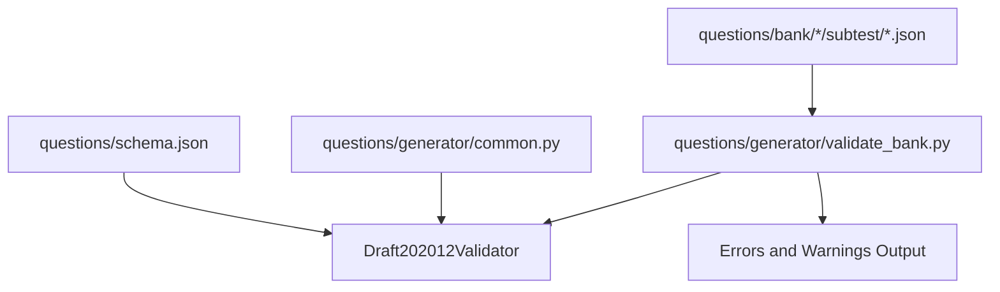
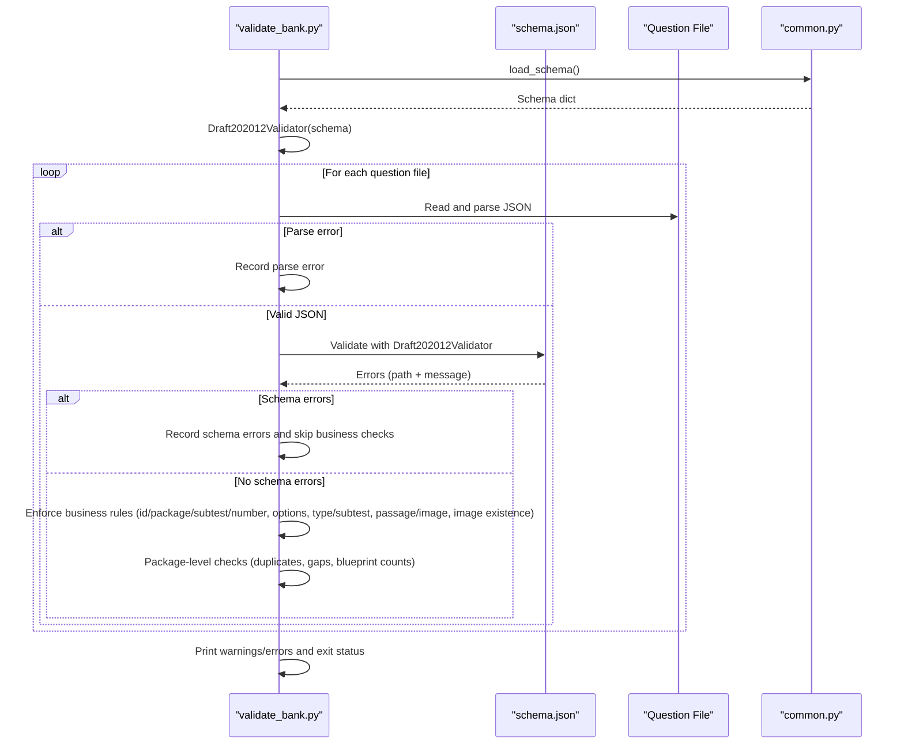
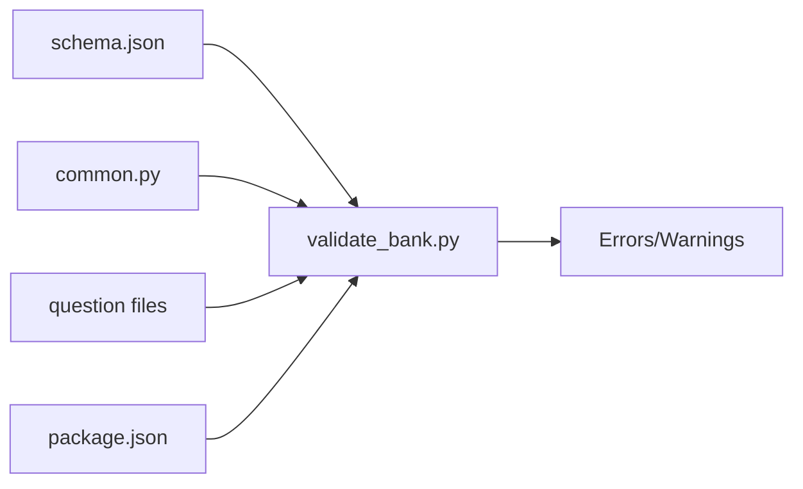

# Schema Validation

<cite>
**Referenced Files in This Document**
- [schema.json](file://questions/schema.json)
- [validate_bank.py](file://questions/generator/validate_bank.py)
- [common.py](file://questions/generator/common.py)
- [001.json (kuantitatif)](file://questions/bank/1/kuantitatif/001.json)
- [001.json (verbal)](file://questions/bank/1/verbal/001.json)
- [001.json (pemecahan_masalah)](file://questions/bank/1/pemecahan_masalah/001.json)
- [package.json (package 1)](file://questions/bank/1/package.json)
</cite>

## Table of Contents
1. [Introduction](#introduction)
2. [Project Structure](#project-structure)
3. [Core Components](#core-components)
4. [Architecture Overview](#architecture-overview)
5. [Detailed Component Analysis](#detailed-component-analysis)
6. [Dependency Analysis](#dependency-analysis)
7. [Performance Considerations](#performance-considerations)
8. [Troubleshooting Guide](#troubleshooting-guide)
9. [Conclusion](#conclusion)

## Introduction
This document explains the JSON schema validation system that ensures question data integrity across the LPDP TBS question bank. It focuses on how each question file is validated against the schema definition, what rules are enforced, and how errors are reported with precise locations and messages. It also provides examples of valid and invalid structures, common validation errors, and a troubleshooting guide to help you fix schema compliance issues quickly.

## Project Structure
The validation system centers around three key artifacts:
- The JSON Schema definition for questions at questions/schema.json
- A Python validator script that uses Draft202012Validator to validate every question file
- Shared constants and helpers that define business rules and iteration over the question bank

**Diagram sources**
- [schema.json:1-98](file://questions/schema.json#L1-L98)
- [validate_bank.py:29-46](file://questions/generator/validate_bank.py#L29-L46)
- [common.py:130-132](file://questions/generator/common.py#L130-L132)

**Section sources**
- [schema.json:1-98](file://questions/schema.json#L1-L98)
- [validate_bank.py:1-46](file://questions/generator/validate_bank.py#L1-L46)
- [common.py:13-16](file://questions/generator/common.py#L13-L16)

## Core Components
- JSON Schema (questions/schema.json): Declares the contract for each question object, including required fields, types, constraints, and allowed values.
- Validator (questions/generator/validate_bank.py): Loads the schema, iterates through all question files, validates each one using Draft202012Validator, and enforces additional business logic.
- Shared helpers (questions/generator/common.py): Provides schema loading, blueprint definitions, type allowances per subtest, passage requirements, and utilities used by the validator.

Key responsibilities:
- Structural validation via JSON Schema (types, patterns, enums, min/max, required fields).
- Business rule validation (option keys, correct option presence, type/subtest compatibility, passage/image requirements, image existence, numbering uniqueness and gaps, strict mode counts).
- Error reporting with precise paths and descriptive messages.

**Section sources**
- [schema.json:1-98](file://questions/schema.json#L1-L98)
- [validate_bank.py:44-194](file://questions/generator/validate_bank.py#L44-L194)
- [common.py:19-68](file://questions/generator/common.py#L19-L68)

## Architecture Overview
The validation pipeline processes each question file as follows:
- Iterate through all question files under questions/bank
- Parse JSON; if parsing fails, record an error and skip further checks
- Validate against the JSON Schema using Draft202012Validator; collect schema violations with path and message
- If schema passes, enforce business rules (id/package/subtest/number consistency, option keys, correct_option, type/subtest mapping, passage/image requirements, image existence)
- Aggregate package-level checks (duplicate numbers, gaps, blueprint counts in strict mode)
- Print warnings and errors; exit code indicates success or failure

**Diagram sources**
- [validate_bank.py:96-194](file://questions/generator/validate_bank.py#L96-L194)
- [common.py:130-132](file://questions/generator/common.py#L130-L132)
- [schema.json:1-98](file://questions/schema.json#L1-L98)

## Detailed Component Analysis

### JSON Schema Definition (questions/schema.json)
The schema defines the structure and constraints for each question object. Highlights include:
- Required fields: id, package, subtest, number, type, question_text, image, passage, options, correct_option, explanations, difficulty, source, verified
- Field types and constraints:
  - id: string matching pattern "<package>-<subtest>-<NNN>"
  - package: integer minimum 1
  - subtest: enum ["verbal", "kuantitatif", "pemecahan_masalah"]
  - number: integer between 1 and 25
  - type: enum of supported question types (business logic restricts which types are allowed per subtest)
  - question_text: string minLength 5
  - image: string or null; must match pattern "images/<filename>.<ext>"
  - passage: string or null; used for stimulus-based types
  - options: array of exactly 5 items; each item has key in ["A","B","C","D","E"] and text minLength 1
  - correct_option: enum ["A","B","C","D","E"]
  - explanations: object with required keys A..E; each explanation string minLength 10
  - difficulty: enum ["easy","medium","hard"]
  - source: string minLength 1
  - verified: boolean

These constraints ensure structural integrity and consistency across the question bank.

**Section sources**
- [schema.json:1-98](file://questions/schema.json#L1-L98)

### Validator Script (questions/generator/validate_bank.py)
The validator orchestrates schema and business rule checks:
- Uses Draft202012Validator with the loaded schema
- Iterates through all question files via iter_bank_questions from common.py
- For each file:
  - Records parse errors if JSON is invalid
  - Validates against schema; records errors with location path and message
  - Skips business checks if schema validation failed
  - Checks id/package/subtest/number consistency with file path
  - Ensures option keys are exactly A..E in order and correct_option is among them
  - Verifies type is allowed for the subtest using TYPES_BY_SUBTEST
  - Enforces passage/image requirements based on question type
  - Validates referenced images exist in the package directory
  - Aggregates package-level checks: duplicate numbers, gaps, blueprint counts (strict mode)
- Prints warnings and errors; returns exit code 0 if no errors, 1 otherwise

Error reporting format:
- Each error includes relative file path, context ("schema:" for schema violations), field path within the JSON, and a descriptive message.

**Section sources**
- [validate_bank.py:29-46](file://questions/generator/validate_bank.py#L29-L46)
- [validate_bank.py:96-194](file://questions/generator/validate_bank.py#L96-L194)

### Shared Helpers (questions/generator/common.py)
Provides shared constants and utilities:
- SCHEMA_PATH points to questions/schema.json
- BLUEPRINT defines subtest counts and durations
- TYPES_BY_SUBTEST maps allowed question types per subtest
- PASSAGE_REQUIRED_TYPES and PASSAGE_OR_IMAGE_TYPES define stimulus requirements
- OPTION_KEYS and DIFFICULTY_WEIGHTS support validation and difficulty calculation
- load_schema reads and returns the schema dictionary
- iter_bank_questions yields parsed question objects and parse errors

These helpers centralize configuration and reduce duplication across scripts.

**Section sources**
- [common.py:13-16](file://questions/generator/common.py#L13-L16)
- [common.py:19-68](file://questions/generator/common.py#L19-L68)
- [common.py:130-132](file://questions/generator/common.py#L130-L132)
- [common.py:210-218](file://questions/generator/common.py#L210-L218)

## Dependency Analysis
The validator depends on:
- JSON Schema (questions/schema.json) for structural validation
- Common helpers (questions/generator/common.py) for schema loading, business rules, and iteration
- Question files (questions/bank/*/subtest/*.json) as inputs
- Optional package manifests (questions/bank/*/package.json) for metadata validation

**Diagram sources**
- [validate_bank.py:29-46](file://questions/generator/validate_bank.py#L29-L46)
- [common.py:130-132](file://questions/generator/common.py#L130-L132)
- [schema.json:1-98](file://questions/schema.json#L1-L98)

**Section sources**
- [validate_bank.py:29-46](file://questions/generator/validate_bank.py#L29-L46)
- [common.py:130-132](file://questions/generator/common.py#L130-L132)

## Performance Considerations
- Schema validation runs per question file; for large banks, consider parallelization if needed.
- Business rule checks are lightweight but accumulate across packages; avoid unnecessary re-scans.
- Image existence checks involve filesystem operations; batch or cache results if performance becomes critical.
- Strict mode adds blueprint count checks; use only when necessary to minimize overhead.

[No sources needed since this section provides general guidance]

## Troubleshooting Guide

### How to Run Validation
- Execute the validator script from the repository root:
  - python3 questions/generator/validate_bank.py
  - Use --strict to enforce exact blueprint counts per subtest
  - Use --bank-dir to specify a custom bank directory if needed

Expected output:
- OK: All checks passed
- FAILED: One or more errors found; review printed messages

Exit codes:
- 0: Valid
- 1: Errors found

### Common Schema Violations and Fixes
- Missing required fields: Ensure all required fields are present (id, package, subtest, number, type, question_text, image, passage, options, correct_option, explanations, difficulty, source, verified).
- Incorrect types: Verify field types match the schema (e.g., package is integer, number is integer 1–25, difficulty is enum).
- Pattern mismatches:
  - id must match "<package>-<subtest>-<NNN>"
  - image must be null or match "images/<filename>.<ext>"
- Enum violations:
  - subtest must be one of verbal, kuantitatif, pemecahan_masalah
  - type must be one of the defined enums
  - correct_option must be A–E
  - difficulty must be easy, medium, hard
- Array constraints:
  - options must have exactly 5 items
  - Each option must have key in A–E and text with minLength 1
  - explanations must have keys A–E with strings minLength 10
- String constraints:
  - question_text minLength 5
  - source minLength 1

### Business Rule Violations and Fixes
- Option keys not exactly A–E in order: Reorder options so keys are A, B, C, D, E sequentially.
- correct_option not among options: Ensure correct_option matches one of the option keys.
- Type not allowed for subtest: Check TYPES_BY_SUBTEST in common.py and adjust type accordingly.
- Passage/image requirements:
  - reading and analisis_teks require passage
  - interpretasi_data requires either passage or image
  - Self-contained types should not include passage (warning if present)
- Referenced image not found: Ensure image path exists under the package's images directory.
- Numbering issues:
  - Duplicate numbers in a subtest: Remove duplicates
  - Gaps in numbering: Fill missing numbers or remove extra files
  - Exceeds blueprint count: Adjust question count to match blueprint
- Strict mode failures: Ensure complete packages with exact counts per subtest.

### Error Reporting Format
Errors include:
- Relative file path
- Context (e.g., "schema:")
- Field path within the JSON (e.g., "options/0/key")
- Descriptive message explaining the violation

Example error formats:
- "questions/bank/1/kuantitatif/001.json: schema: id: '1-verbal-001' does not match pattern ..."
- "questions/bank/1/verbal/001.json: options must be exactly A..E in order, got ['B','A','C','D','E']"
- "questions/bank/1/pemecahan_masalah/001.json: type 'logika_analitis' not allowed in subtest 'verbal'"

### Examples of Valid Structures
Valid question example (kuantitatif):
- id: "1-kuantitatif-001"
- package: 1
- subtest: "kuantitatif"
- number: 1
- type: "aritmetika"
- question_text: non-empty string
- image: null or valid image path
- passage: null or appropriate content
- options: array of 5 items with keys A–E and texts
- correct_option: one of A–E
- explanations: object with keys A–E and non-empty strings
- difficulty: "easy", "medium", or "hard"
- source: non-empty string
- verified: boolean

Valid question example (verbal):
- id: "1-verbal-001"
- package: 1
- subtest: "verbal"
- number: 1
- type: "sinonim"
- Other fields follow the same constraints as above.

Valid question example (pemecahan_masalah):
- id: "1-pemecahan_masalah-001"
- package: 1
- subtest: "pemecahan_masalah"
- number: 1
- type: "logika_analitis"
- Other fields follow the same constraints as above.

### Example Invalid Structures
- Wrong id pattern: id = "1-verbal-001" in a kuantitatif file
- Missing options: fewer than 5 options
- Incorrect option keys: keys not in A–E or not in order
- Missing explanations: absent keys A–E or empty strings
- Invalid type for subtest: type not in TYPES_BY_SUBTEST[subtest]
- Missing passage for required types: reading or analisis_teks without passage
- Referenced image not found: image path does not exist

### Step-by-Step Fix Workflow
1. Run validation to identify errors
2. Locate the specific file and field path from the error message
3. Correct the field value to match schema constraints
4. Re-run validation to confirm fixes
5. Repeat until no errors remain

**Section sources**
- [validate_bank.py:96-194](file://questions/generator/validate_bank.py#L96-L194)
- [schema.json:1-98](file://questions/schema.json#L1-L98)
- [common.py:19-68](file://questions/generator/common.py#L19-L68)

## Conclusion
The JSON schema validation system ensures high-quality, consistent question data across the LPDP TBS question bank. By combining strict schema enforcement with comprehensive business rule checks, it catches both structural and logical errors early. The detailed error reporting helps authors quickly locate and fix issues, maintaining the integrity and reliability of the question bank.

[No sources needed since this section summarizes without analyzing specific files]