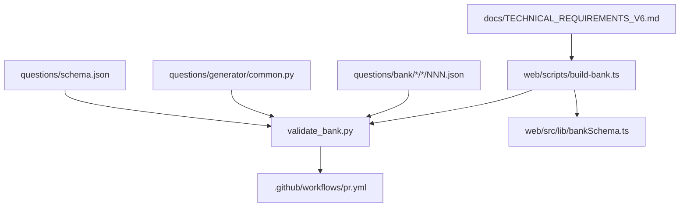
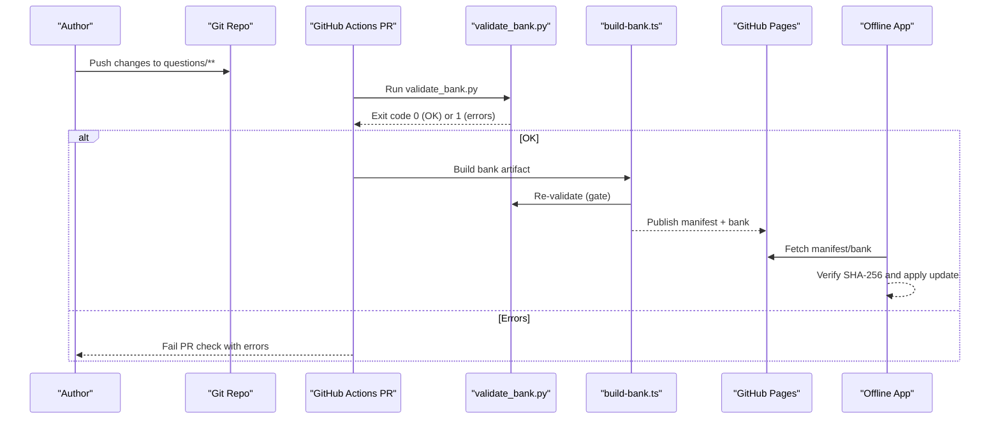
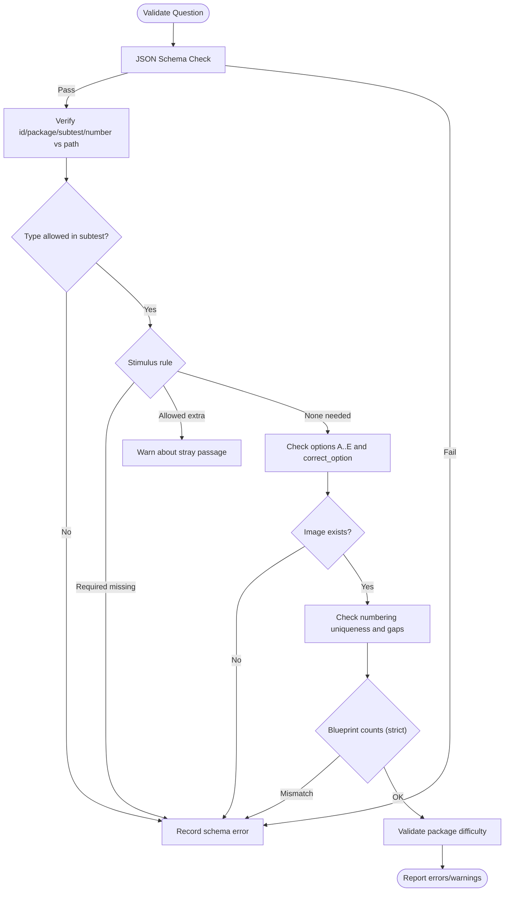
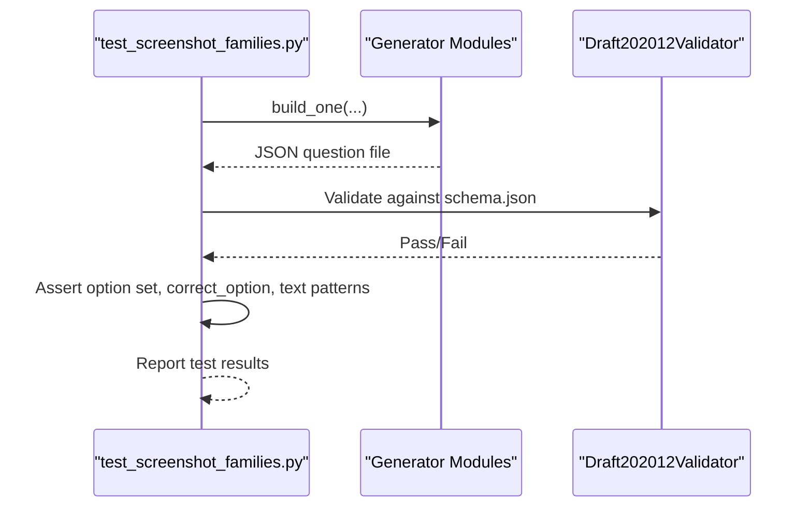
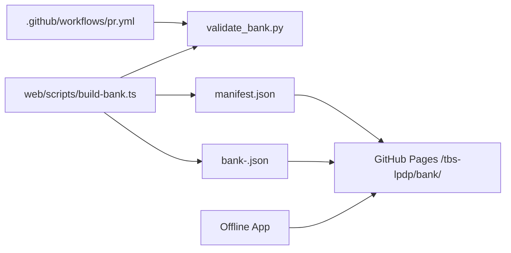
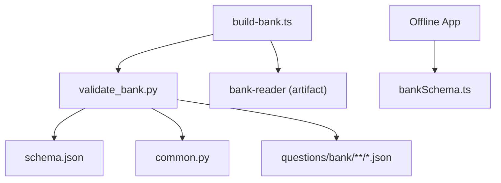

# Validation Pipeline

<cite>
**Referenced Files in This Document**
- [schema.json](file://questions/schema.json)
- [common.py](file://questions/generator/common.py)
- [validate_bank.py](file://questions/generator/validate_bank.py)
- [test_screenshot_families.py](file://questions/generator/test_screenshot_families.py)
- [build-bank.ts](file://web/scripts/build-bank.ts)
- [bankSchema.ts](file://web/src/lib/bankSchema.ts)
- [pr.yml](file://.github/workflows/pr.yml)
- [TECHNICAL_REQUIREMENTS_V6.md](file://docs/TECHNICAL_REQUIREMENTS_V6.md)
- [001.json (verbal)](file://questions/bank/1/verbal/001.json)
- [001.json (kuantitatif)](file://questions/bank/1/kuantitatif/001.json)
- [001.json (pemecahan_masalah)](file://questions/bank/1/pemecahan_masalah/001.json)
</cite>

## Table of Contents
1. [Introduction](#introduction)
2. [Project Structure](#project-structure)
3. [Core Components](#core-components)
4. [Architecture Overview](#architecture-overview)
5. [Detailed Component Analysis](#detailed-component-analysis)
6. [Dependency Analysis](#dependency-analysis)
7. [Performance Considerations](#performance-considerations)
8. [Troubleshooting Guide](#troubleshooting-guide)
9. [Conclusion](#conclusion)

## Introduction
This document describes the validation pipeline that ensures question integrity and compliance before deployment. It covers automated checks for JSON schema compliance, field constraints, business rules, type-to-subtest alignment, stimulus requirements, image references, numbering and blueprint counts, screenshot regression tests for generated families, error reporting, and integration into CI and build pipelines.

## Project Structure
The validation pipeline spans three layers:
- Data contract: a JSON Schema defining the question structure and constraints.
- Validation engine: Python scripts that enforce schema, business rules, and blueprint compliance across the entire question bank.
- Build and CI gates: Node-based artifact builder and GitHub Actions workflows that run validation before publishing or releasing.

**Diagram sources**
- [schema.json:1-98](file://questions/schema.json#L1-L98)
- [common.py:1-218](file://questions/generator/common.py#L1-L218)
- [validate_bank.py:1-208](file://questions/generator/validate_bank.py#L1-L208)
- [pr.yml:1-28](file://.github/workflows/pr.yml#L1-L28)
- [build-bank.ts:1-81](file://web/scripts/build-bank.ts#L1-L81)
- [bankSchema.ts:1-84](file://web/src/lib/bankSchema.ts#L1-L84)
- [TECHNICAL_REQUIREMENTS_V6.md:107-146](file://docs/TECHNICAL_REQUIREMENTS_V6.md#L107-L146)

**Section sources**
- [schema.json:1-98](file://questions/schema.json#L1-L98)
- [common.py:1-218](file://questions/generator/common.py#L1-L218)
- [validate_bank.py:1-208](file://questions/generator/validate_bank.py#L1-L208)
- [pr.yml:1-28](file://.github/workflows/pr.yml#L1-L28)
- [build-bank.ts:1-81](file://web/scripts/build-bank.ts#L1-L81)
- [bankSchema.ts:1-84](file://web/src/lib/bankSchema.ts#L1-L84)
- [TECHNICAL_REQUIREMENTS_V6.md:107-146](file://docs/TECHNICAL_REQUIREMENTS_V6.md#L107-L146)

## Core Components
- JSON Schema: Defines required fields, types, patterns, enums, and structural constraints for each question file.
- Business Rules Engine: Enforces subtest/type mapping, passage/image requirements, option keys, correct option presence, image existence, unique and gapless numbering, blueprint counts, and package manifest metadata.
- Screenshot Regression Tests: Validate generated question families produce valid questions with expected properties and consistent rendering characteristics.
- Build Integration: The artifact builder runs validation before producing the published bank artifact; CI enforces validation on pull requests.

Key responsibilities:
- JSON schema compliance: validated via Draft 2020-12 validator against schema.json.
- Field constraints: enforced by schema and additional checks (e.g., option keys A–E, explanation coverage).
- Business rules: type allowed per subtest, passage/image requirements, image path existence, numbering uniqueness and gaps, blueprint counts, difficulty calculation consistency.
- Screenshot testing: unit tests for generator families ensure stable output shapes and content expectations.
- CI/build gating: PR workflow runs validation; build script refuses to publish if validation fails.

**Section sources**
- [schema.json:1-98](file://questions/schema.json#L1-L98)
- [validate_bank.py:44-194](file://questions/generator/validate_bank.py#L44-L194)
- [common.py:17-68](file://questions/generator/common.py#L17-L68)
- [test_screenshot_families.py:21-115](file://questions/generator/test_screenshot_families.py#L21-L115)
- [build-bank.ts:42-55](file://web/scripts/build-bank.ts#L42-L55)
- [pr.yml:10-27](file://.github/workflows/pr.yml#L10-L27)

## Architecture Overview
End-to-end flow from authoring to deployment:

**Diagram sources**
- [pr.yml:10-27](file://.github/workflows/pr.yml#L10-L27)
- [validate_bank.py:197-208](file://questions/generator/validate_bank.py#L197-L208)
- [build-bank.ts:42-81](file://web/scripts/build-bank.ts#L42-L81)
- [TECHNICAL_REQUIREMENTS_V6.md:107-146](file://docs/TECHNICAL_REQUIREMENTS_V6.md#L107-L146)

## Detailed Component Analysis

### JSON Schema Compliance
- Required fields include identifiers, package/subtest/number, type, stem, media, options, answer key, explanations, difficulty, source, and verification flag.
- Patterns constrain IDs and image paths; enums restrict subtests, types, option keys, and difficulty levels.
- Structural constraints enforce exactly five options with ordered keys A–E and explanations covering all options.

Validation is performed using Draft 2020-12 validator against schema.json during both PR checks and artifact builds.

**Section sources**
- [schema.json:1-98](file://questions/schema.json#L1-L98)
- [validate_bank.py:96-108](file://questions/generator/validate_bank.py#L96-L108)

### Field Constraints and Business Rules
- ID derivation and path consistency: id must match package-subtest-number derived from directory and filename.
- Subtest/type alignment: only permitted types per subtest are allowed, enforced via TYPES_BY_SUBTEST.
- Stimulus requirements:
  - reading and analisis_teks require a passage.
  - interpretasi_data requires either a passage (table) or an image (chart).
  - Self-contained types should not carry a passage; warnings are emitted if they do.
- Options and answers:
  - Option keys must be exactly A–E in order.
  - correct_option must be among the options.
  - Explanations must cover all five options.
- Image references: referenced images must exist under the package’s images directory.
- Numbering and blueprint:
  - Numbers must be unique per subtest and gapless within a package.
  - Strict mode enforces exact counts per subtest defined in BLUEPRINT.
- Package manifest validation:
  - Required fields and value ranges for title, description, difficulty, ai_model, ai_company, ai_model_description.
  - Difficulty label must match calculated difficulty based on question distribution.

These rules ensure that verbal questions contain only verbal types, quantitative questions follow quantitative patterns, and problem-solving questions adhere to problem-solving formats.

**Diagram sources**
- [validate_bank.py:96-194](file://questions/generator/validate_bank.py#L96-L194)
- [common.py:17-68](file://questions/generator/common.py#L17-L68)

**Section sources**
- [validate_bank.py:96-194](file://questions/generator/validate_bank.py#L96-L194)
- [common.py:17-68](file://questions/generator/common.py#L17-L68)

### Screenshot Testing Framework
- Purpose: Regression tests for generated question families ensure stable output structures and content expectations across different pattern variants and blank configurations.
- Scope: Tests generate sample questions using generator modules, assert schema validity, verify option sets, confirm correct_option presence, and validate specific textual patterns in stems and explanations.
- Benefits: Detects regressions in generation logic that could affect visual rendering and readability across platforms and screen sizes.

**Diagram sources**
- [test_screenshot_families.py:21-115](file://questions/generator/test_screenshot_families.py#L21-L115)
- [schema.json:1-98](file://questions/schema.json#L1-L98)

**Section sources**
- [test_screenshot_families.py:21-115](file://questions/generator/test_screenshot_families.py#L21-L115)

### Build and Deployment Integration
- PR checks: GitHub Actions workflow triggers on pull requests touching questions or workflows, installs dependencies, and runs validate_bank.py. Non-zero exit fails the PR.
- Artifact build: build-bank.ts validates the bank via validate_bank.py before compiling the artifact; it also enforces non-empty bank output and git history availability for reproducible versions.
- Published artifact: manifest.json and content-addressed bank file are published to GitHub Pages; the offline app fetches and verifies them at runtime.

**Diagram sources**
- [pr.yml:10-27](file://.github/workflows/pr.yml#L10-L27)
- [build-bank.ts:42-81](file://web/scripts/build-bank.ts#L42-L81)
- [TECHNICAL_REQUIREMENTS_V6.md:107-146](file://docs/TECHNICAL_REQUIREMENTS_V6.md#L107-L146)

**Section sources**
- [pr.yml:10-27](file://.github/workflows/pr.yml#L10-L27)
- [build-bank.ts:42-81](file://web/scripts/build-bank.ts#L42-L81)
- [TECHNICAL_REQUIREMENTS_V6.md:107-146](file://docs/TECHNICAL_REQUIREMENTS_V6.md#L107-L146)

## Dependency Analysis
- validate_bank.py depends on:
  - JSON Schema (schema.json) for structural validation.
  - common.py constants (TYPES_BY_SUBTEST, PASSAGE_REQUIRED_TYPES, PASSAGE_OR_IMAGE_TYPES, BLUEPRINT) for business rules.
  - iter_bank_questions to traverse and parse all question files.
- build-bank.ts depends on:
  - validate_bank.py as a gate before artifact creation.
  - bank-reader utilities to compile the bank artifact.
  - bankSchema.ts for manifest parsing and version compatibility checks in the app.
- CI pr.yml depends on:
  - Python environment and requirements to run validate_bank.py.

**Diagram sources**
- [validate_bank.py:29-41](file://questions/generator/validate_bank.py#L29-L41)
- [common.py:13-68](file://questions/generator/common.py#L13-L68)
- [build-bank.ts:16-21](file://web/scripts/build-bank.ts#L16-L21)
- [bankSchema.ts:20-67](file://web/src/lib/bankSchema.ts#L20-L67)

**Section sources**
- [validate_bank.py:29-41](file://questions/generator/validate_bank.py#L29-L41)
- [common.py:13-68](file://questions/generator/common.py#L13-L68)
- [build-bank.ts:16-21](file://web/scripts/build-bank.ts#L16-L21)
- [bankSchema.ts:20-67](file://web/src/lib/bankSchema.ts#L20-L67)

## Performance Considerations
- Validation scans all question files; performance scales with the number of packages and questions. Ensure efficient iteration and avoid redundant I/O.
- Schema validation is fast but can dominate runtime if many files fail early; consider short-circuiting after critical failures where appropriate.
- Artifact build includes re-validation; caching dependencies and parallelizing reads may improve throughput in large repositories.
- Bank size warnings: the build script warns when the compiled bank exceeds thresholds; consider optimizing assets or inlining strategy if necessary.

[No sources needed since this section provides general guidance]

## Troubleshooting Guide
Common validation failures and how to resolve them:

- Schema violations:
  - Missing or invalid required fields, wrong types, or disallowed values.
  - Fix: Align question structure with schema.json requirements; ensure enums and patterns match.
- ID/path mismatch:
  - id does not match expected format derived from package/subtest/filename.
  - Fix: Rename files and update id accordingly to reflect package-subtest-number.
- Subtest/type mismatch:
  - Type not allowed in the given subtest per TYPES_BY_SUBTEST.
  - Fix: Move the question to the correct subtest or change its type to an allowed one.
- Stimulus issues:
  - reading/analisis_teks missing passage; interpretasi_data missing passage or image; self-contained types carrying a passage.
  - Fix: Add required passage or image; remove extraneous passage from self-contained types.
- Options and answers:
  - Option keys not exactly A–E in order; correct_option not among options; explanations missing entries.
  - Fix: Ensure exactly five options with ordered keys; set correct_option to one of them; provide explanations for all options.
- Image references:
  - Referenced image file not found under package images directory.
  - Fix: Place the image in the correct location or update the image path.
- Numbering and blueprint:
  - Duplicate numbers or gaps in numbering; strict mode count mismatches.
  - Fix: Adjust filenames and numbers to be unique and gapless; ensure total counts match BLUEPRINT in strict mode.
- Package manifest:
  - Invalid or missing fields; difficulty label mismatch with calculated difficulty.
  - Fix: Correct manifest fields; adjust difficulty label to match computed value based on question distribution.
- CI/build failures:
  - validate_bank.py returns non-zero; build-bank.ts refuses to publish.
  - Fix: Resolve reported errors; rerun PR checks and builds.

Error reporting mechanisms:
- validate_bank.py prints ERROR lines for failures and WARN lines for non-fatal issues; exits with status 1 on errors.
- build-bank.ts logs detailed messages and exits non-zero when validation fails or artifacts are invalid.
- CI workflow surfaces these outputs in PR checks to block merges until resolved.

**Section sources**
- [validate_bank.py:187-194](file://questions/generator/validate_bank.py#L187-L194)
- [build-bank.ts:42-81](file://web/scripts/build-bank.ts#L42-L81)
- [pr.yml:23-27](file://.github/workflows/pr.yml#L23-L27)

## Conclusion
The validation pipeline combines rigorous JSON schema enforcement, comprehensive business rules, and targeted screenshot regression tests to ensure question integrity and compliance. Integrated into CI and build processes, it prevents invalid or non-compliant content from reaching users, while providing clear error reporting and actionable guidance for resolving issues. This multi-layered approach supports reliable deployment across web and offline applications.

[No sources needed since this section summarizes without analyzing specific files]